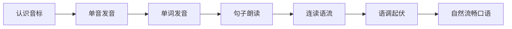
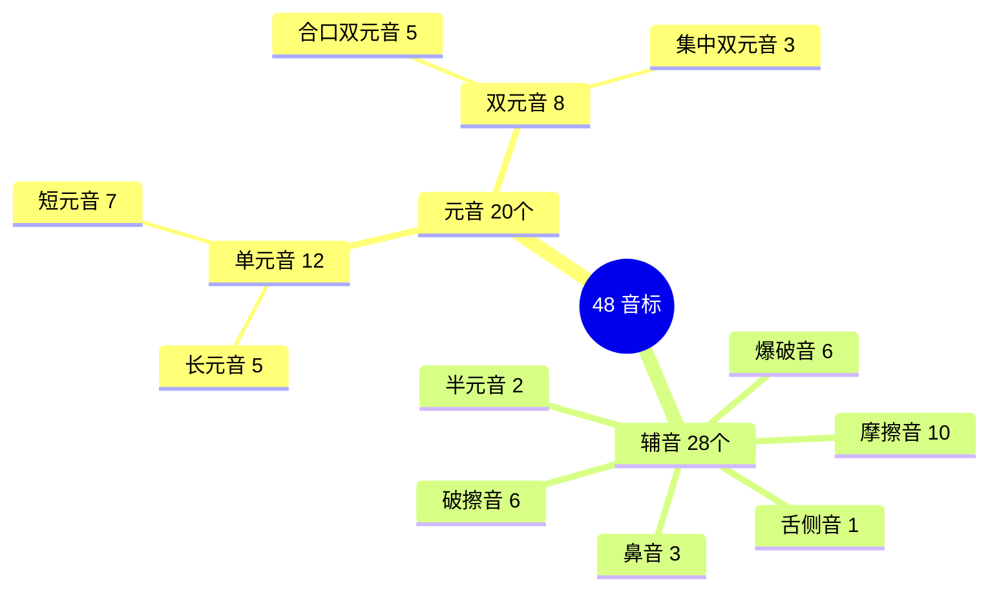
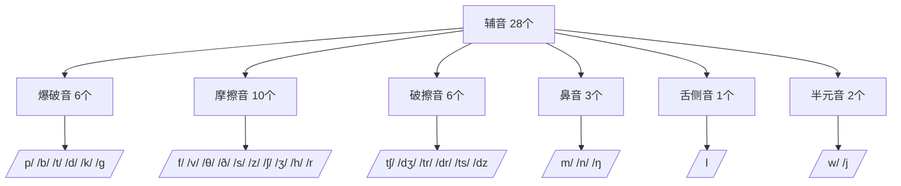
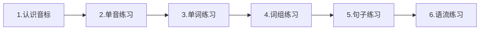

# 英语发音与口语基础

> [!info] 本篇定位
> 这是整套教程里**最"累"但最值得**的一篇。
>
> 发音是口语的**地基**，也是听力的**钥匙**——你听不懂英语的 90% 原因，不是不认识单词，而是**自己发音不对，所以识别不出真实语音**。
>
> 读完这一篇，你会知道：48 个音标怎么发、为什么老外说话像连成一串、同一个句子重音不同意思为什么完全不同、中国人说英语为什么一听就是中国人。

---

## 1. 本篇导读：为什么必须学音标

### 1.1 不学音标会发生什么

很多人学英语**跳过音标**，直接背单词、学语法。结果：

- 单词**永远读不准**，只能靠"看字母猜发音"，碰到不规则的词就懵
- 听力**永远听不懂**——因为你大脑里存的"发音档案"是错的，听到正确的发音反而识别不出
- 口语**永远不地道**——读出来老外听不懂，陷入"他听不懂 → 我不敢说 → 越不说越差"的恶性循环

> [!warning] 残酷的真相
>
> **发音一旦定型，改起来比从零学难 10 倍**。
>
> 很多人学了 10 年英语口语仍然是"Chinglish"，不是因为没努力，而是因为**前 1 年发音没学对**，后面越练越固化。
>
> 花 2 周把音标学扎实，胜过 10 年盲目模仿。

### 1.2 本篇学习策略

本篇不是让你"一次记住 48 个音标"，而是：

1. **先建立认知**：知道英语发音的整体系统
2. **分类突破**：按元音/辅音分组，一组一组攻克
3. **对比掌握**：相似音对比（如 /i/ vs /iː/）
4. **语流训练**：从单音 → 单词 → 句子 → 连读



---

## 2. 国际音标 IPA 是什么

**国际音标**（International Phonetic Alphabet，IPA）是一套**用来标记发音**的符号系统，由国际语音学会制定，**全世界通用**。

### 2.1 字母 vs 音标：两套不同的东西

| 对比项 | 字母 | 音标 |
| ---- | ---- | ---- |
| 用途 | 拼写单词 | 记录读音 |
| 数量 | 26 个 | 48 个 |
| 符号特点 | A, B, C... | /iː/, /æ/, /θ/... |
| 书写位置 | 正常书写 | 两个斜杠 `/ /` 中间 |

**关键理解**：字母不告诉你怎么读，音标才告诉你怎么读。

```
cat     /kæt/        字母 a 读 /æ/
cake    /keɪk/       字母 a 读 /eɪ/
car     /kɑːr/       字母 a 读 /ɑː/
about   /əˈbaʊt/     字母 a 读 /ə/
```

同一个字母 `a`，**4 个单词里 4 种读音**。所以必须靠音标来确定读音。

### 2.2 48 个音标总览

英语国际音标分为两大类：



- **元音（Vowels）**：20 个，发音时**气流不受阻挡**
- **辅音（Consonants）**：28 个，发音时**气流受阻**（唇、舌、牙等阻挡）

---

## 3. 20 个元音详解

元音是所有音节的**核心**。一个音节必须要有元音，辅音可以没有。

### 3.1 12 个单元音

单元音 = 发音过程中**口型不变**的元音。

#### 5 个长元音（带 ː 符号）

| 音标 | 例词 | 发音要点 | 中文参考 |
| ---- | ---- | -------- | -------- |
| /iː/ | see, tree, me | 嘴角向两边咧开，拉长 | 类似"一"的延长 |
| /ɑː/ | car, father, art | 嘴巴张大，舌头平放 | 类似"啊"的延长 |
| /ɔː/ | door, four, all | 嘴唇圆，舌头后缩 | 类似"哦"的延长 |
| /uː/ | too, food, blue | 嘴唇极度收圆，像吹口哨 | 类似"乌"的延长 |
| /ɜː/ | bird, her, work | 舌头中部抬起，嘴唇放松 | 无明显对应中文 |

> [!tip] 长元音核心原则
>
> **长元音的"长"不是嘴型变化，而是时长延长**。
>
> - /iː/ 不是 /i-i/，而是"一~~~"这种拉长一拍的感觉
> - 中国学生常错：把 /iː/ 读成 /i/，把 /uː/ 读成 /u/——**时长不够**

#### 7 个短元音

| 音标 | 例词 | 发音要点 | 中文参考 |
| ---- | ---- | -------- | -------- |
| /ɪ/ | sit, bit, it | 嘴角放松，短促 | "一"的短促版 |
| /e/ | bed, red, egg | 嘴张开适中，嘴角向两边 | 类似"爱"去掉 /i/ |
| /æ/ | cat, bag, apple | 嘴巴大咧开，下巴下沉 | 介于"爱"和"啊"之间 |
| /ʌ/ | cup, run, love | 嘴巴半张，舌头中后 | 类似轻声的"啊" |
| /ɒ/ | hot, box, dog | 嘴张大，嘴唇微圆 | 类似"哦"短促 |
| /ʊ/ | book, put, foot | 嘴唇微圆，不用力 | "乌"的短促版 |
| /ə/ | about, sofa | 最"懒"的音，舌头完全放松 | 轻声的"饿"或"呃" |

> [!warning] 中国学生最大的发音陷阱：/i/ 和 /iː/ 分不清
>
> **真实例子**：
> - `sheep` /ʃiːp/（绵羊）vs `ship` /ʃɪp/（船）
> - `seat` /siːt/（座位）vs `sit` /sɪt/（坐）
> - `beach` /biːtʃ/（海滩）vs `bitch` /bɪtʃ/（母狗、脏话）⚠️
>
> 最后一组**尤其危险**——想说"我喜欢海滩"结果说成"我喜欢 bitch"是很常见的翻车现场。
>
> **区分关键**：不是"长短"，而是：
> - /iː/：嘴角**强烈咧开**，舌面高，持续时长长
> - /ɪ/：嘴角**放松**，舌面略低，持续时长短

> [!tip] 神奇的"懒音" /ə/（Schwa）
>
> /ə/ 叫做 **schwa**（弱读符），是英语里**出现频率最高**的音。
>
> 它出现在**没有重音的音节**上，发音极其"懒"——嘴型放松、舌头放平、气流不费力。
>
> 例子：
> - `about` /əˈbaʊt/ —— 开头的 a
> - `banana` /bəˈnɑːnə/ —— 前后两个 a
> - `the`（弱读时）/ðə/ —— the 在句中通常弱读
>
> **记住 /ə/，你就掌握了英语节奏的一半**。

### 3.2 8 个双元音

双元音 = 发音过程中**口型有变化**，从一个元音滑向另一个。

#### 5 个合口双元音（口型由开变合）

| 音标 | 例词 | 发音要点 | 中文参考 |
| ---- | ---- | -------- | -------- |
| /eɪ/ | name, day, face | 从 /e/ 滑向 /ɪ/ | "诶" |
| /aɪ/ | eye, my, time | 从 /a/ 滑向 /ɪ/ | "爱" |
| /ɔɪ/ | boy, coin, noise | 从 /ɔ/ 滑向 /ɪ/ | "欧-伊" |
| /aʊ/ | how, now, mouth | 从 /a/ 滑向 /ʊ/ | "嗷" |
| /əʊ/ | go, no, phone | 从 /ə/ 滑向 /ʊ/ | "欧" |

#### 3 个集中双元音（滑向中央音 /ə/）

| 音标 | 例词 | 发音要点 | 中文参考 |
| ---- | ---- | -------- | -------- |
| /ɪə/ | here, ear, idea | 从 /ɪ/ 滑向 /ə/ | "一-饿" |
| /eə/ | hair, care, there | 从 /e/ 滑向 /ə/ | "爱-饿" |
| /ʊə/ | tour, poor, sure | 从 /ʊ/ 滑向 /ə/ | "乌-饿" |

> [!tip] 双元音的"双"
>
> **双元音必须发出两个音**，不能只发一个。
>
> - ❌ `name` 读成 /nem/ → 错
> - ✅ `name` 读成 /neɪm/ → 对
>
> 训练方法：每个双元音**夸张地**做口型变化，后来自然就能说快。

---

## 4. 28 个辅音详解

辅音发音时气流**受到某种阻碍**，所以辅音的关键是"**阻碍点在哪、怎么阻碍**"。

### 4.1 辅音分类总览



### 4.2 6 个爆破音

爆破音 = 气流**完全堵住**，然后突然释放，产生爆破感。

**清浊配对**（口型一样，声带振动不同）：

| 清辅音 | 浊辅音 | 阻碍点 | 例词（清）| 例词（浊）|
| ---- | ---- | ---- | ---- | ---- |
| /p/ | /b/ | 双唇 | pen, apple | book, baby |
| /t/ | /d/ | 舌尖抵齿龈 | tea, water | day, bad |
| /k/ | /g/ | 舌后抵软腭 | cat, book | go, big |

> [!info] 清 vs 浊辅音的本质区别
>
> **清辅音**：声带**不振动**，气流强，带"气"
> **浊辅音**：声带**振动**，气流弱，带"声"
>
> **自测方法**：手放在喉咙上
> - 发 /p/ 时喉咙**不振动**
> - 发 /b/ 时喉咙**明显振动**
>
> 同理 /t/-/d/、/k/-/g/、/f/-/v/、/s/-/z/ 等所有清浊对。

**送气 vs 不送气**

清辅音 /p/ /t/ /k/ 在词首会**强烈送气**：

```
pen  → /pʰen/（P 后面有明显气流）
top  → /tʰɒp/
key  → /kʰiː/
```

但在 /s/ 后面**不送气**：

```
spend → /spend/（p 不送气）
stop  → /stɒp/（t 不送气）
sky   → /skaɪ/（k 不送气）
```

> [!tip] 一个练习技巧
>
> 拿一张纸放在嘴前 10 厘米：
> - 发 `pen` 时纸应该**明显动**（强送气）
> - 发 `spend` 时纸**几乎不动**（不送气）
>
> 这是母语者的自然习惯，但中国学生经常把 spend 读成 /spʰend/，听起来不地道。

### 4.3 10 个摩擦音

摩擦音 = 气流**从狭窄通道挤出**，产生摩擦声。

| 清辅音 | 浊辅音 | 阻碍点 | 例词（清）| 例词（浊）|
| ---- | ---- | ---- | ---- | ---- |
| /f/ | /v/ | 上齿下唇 | five, off | very, give |
| /θ/ | /ð/ | 舌尖轻咬 | think, three | this, mother |
| /s/ | /z/ | 舌尖靠近齿龈 | sea, kiss | zero, boys |
| /ʃ/ | /ʒ/ | 舌前靠近硬腭 | she, wish | measure |

**独行侠**：/h/ 清，/r/ 浊

> [!warning] 中国人最难的两个音：/θ/ 和 /ð/
>
> 这两个音**中文没有**，所以很多人用 /s/ /z/ 代替，结果：
> - `think` /θɪŋk/（思考）→ 说成 /sɪŋk/（sink 水槽）
> - `this` /ðɪs/（这个）→ 说成 /dɪs/ 或 /zɪs/
>
> **正确发音方法**：
> 1. 舌尖**轻轻咬**在上下牙之间（或顶在上齿背面）
> 2. 让气流从**舌尖和牙齿**的缝隙挤出
> 3. /θ/ 不振声带，/ð/ 振声带
>
> **对镜练习**：发 /θ/ 时，你应该能在镜子里**看到舌尖**。看不到说明舌头没伸出来。

> [!warning] 第二个难点：/r/
>
> 英语 /r/ 和中文"日"完全不一样。
>
> **英式 /r/**：
> - 舌尖**卷起**但**不碰**上颚
> - 嘴唇微微**圆**
> - 不要发颤音
>
> **美式 /r/**：
> - 舌尖卷得更厉害
> - 带点"儿化音"感觉
>
> **中国学生常错**：把 /r/ 读成中文"日"，结果 `really` 听起来像"日立"。

### 4.4 6 个破擦音

破擦音 = 爆破 + 摩擦的组合，先堵住再滑出。

| 清辅音 | 浊辅音 | 例词 |
| ---- | ---- | ---- |
| /tʃ/ | /dʒ/ | chair, church / judge, age |
| /tr/ | /dr/ | tree, train / dream, drop |
| /ts/ | /dz/ | cats, eats / goods, beds |

> [!tip] /tr/ /dr/ 的特殊性
>
> /tr/ 不是 /t/ + /r/，而是一个**整体音**，类似"trʊ"的感觉。
>
> ❌ `tree` 读成 "te-rii"（两段）
> ✅ `tree` 读成 "trii"（一个整体）

### 4.5 3 个鼻音

鼻音 = 嘴巴关闭，气流**从鼻子**出来。

| 音标 | 阻碍点 | 例词 | 特点 |
| ---- | ---- | ---- | ---- |
| /m/ | 双唇合拢 | man, home | 像哼歌 |
| /n/ | 舌尖抵齿龈 | no, hand | 舌尖顶住 |
| /ŋ/ | 舌后抵软腭 | sing, think | 舌后部抬起 |

> [!warning] /n/ 和 /ŋ/ 在词尾的区别
>
> - `sin` /sɪn/（罪）——舌尖**碰到**上齿龈
> - `sing` /sɪŋ/（唱）——舌尖**不碰**任何地方，舌后部抬起
>
> **中国北方人**常见错误：
> - `thing` 读成 `thin`（不发鼻化）
>
> **中国南方人**常见错误：
> - `thin` 读成 `thing`（全都鼻化）
>
> 区分练习：反复对比 `sin/sing`、`thin/thing`、`fan/fang`、`win/wing`。

### 4.6 /l/ 舌侧音

/l/ 有两种发法：

- **清晰 /l/**（词首）：`like, love, light`
  - 舌尖**抵住上齿龈**，气流从舌头两侧滑出
  - 类似中文"勒"

- **含糊 /l/**（词尾）：`feel, ball, school`
  - 舌尖可以**不碰**齿龈，整个舌头后缩
  - 听起来像模糊的 "oo" 音
  - 中国学生经常**省略**这个音，把 `feel` 读成 `fee`

### 4.7 2 个半元音 /w/ /j/

半元音 = 介于元音和辅音之间。

- **/w/**：嘴唇**强烈圆起**（像吹口哨），但不发声，**快速滑向后面的元音**
  - 例：`we, want, water`
  - 不是简单的"屋"

- **/j/**：舌位像 /iː/ 但很短促，**快速滑向后面的元音**
  - 例：`yes, yellow, you`
  - 注意：音标 /j/ 对应的是字母 `y`（不是字母 j）

---

## 5. 连读（Liaison）：老外说话像连成一串的秘密

### 5.1 什么是连读

**连读**：前一个词的**最后一个辅音**，和后一个词的**第一个元音**，自然连在一起读。

```
look at      读成：lookʌt      (look-at，k 和 a 连起来)
put it on    读成：puɾiɾɒn    (put-it-on，三个词连成一片)
not at all   读成：nɒɾəɾɔːl   (not-at-all)
```

### 5.2 连读的 5 种情况

**情况 1：辅音 + 元音（最常见）**

```
I like it.          → I li-kit.
Stand up.           → Stan-dup.
Thank you.          → Than-kyou.
Come on.            → Co-mon.
```

**情况 2：元音 + 元音（加 /j/ 或 /w/ 过渡）**

```
go on      →  go-w-on
I agree    →  I-j-agree
he is      →  he-j-is
do it      →  do-w-it
```

**情况 3：r + 元音（连读 r）**

美式英语中，`r` 会和后面的元音连读：

```
four o'clock    → fou-ro'clock
far away        → fa-raway
for example     → fo-rexample
```

**情况 4：相同辅音合并**

两个相同辅音相遇，只读一次，但时长变长：

```
black cat      → blac(k)cat    (只读一个 k，稍长)
big girl       → bi(g)girl
some more      → so(m)more
```

**情况 5：音节替换连读**

```
at all         → /əˈtɔːl/（t 浊化为闪音 /ɾ/）
water          → /ˈwɔːɾər/（美式 t → /ɾ/）
better         → /ˈbeɾər/
```

> [!tip] 为什么老外说话这么快？
>
> 其实不是快，是**连读把词粘在一起**。你学会了连读：
>
> - 自己说话自然流畅
> - 听力突然变好（原来是这样连的）
>
> **练习方法**：找一段 1 分钟的材料，**用连读标记**每个连读点，跟读 50 遍。

---

## 6. 弱读（Weak Forms）：听不懂 of、to、for 的原因

### 6.1 弱读的本质

英语中的**功能词**（介词、连词、助动词、代词、冠词等）在句中通常**弱读**——变得又轻又快，几乎只剩一个 /ə/ 的感觉。

### 6.2 常见弱读词对照

| 词 | 重读（强式）| 弱读（句中）|
| ---- | ---- | ---- |
| a | /eɪ/ | /ə/ |
| an | /æn/ | /ən/ |
| the | /ðiː/ | /ðə/ |
| and | /ænd/ | /ən/ 或 /n/ |
| or | /ɔːr/ | /ər/ |
| but | /bʌt/ | /bət/ |
| of | /ɒv/ | /əv/ 或 /ə/ |
| to | /tuː/ | /tə/ |
| from | /frɒm/ | /frəm/ |
| for | /fɔːr/ | /fər/ |
| at | /æt/ | /ət/ |
| as | /æz/ | /əz/ |
| him | /hɪm/ | /ɪm/（h 脱落）|
| her | /hɜːr/ | /ər/（h 脱落）|
| them | /ðem/ | /ðəm/ 或 /əm/ |
| can | /kæn/ | /kən/ |
| must | /mʌst/ | /məst/ |
| have | /hæv/ | /əv/ |

### 6.3 弱读实例对比

```
句子：I want to go to school.
强读（错误）：I want /tuː/ go /tuː/ school.
弱读（自然）：I wan /tə/ go /tə/ school.

句子：a cup of tea
强读（错误）：a cup /ɒv/ tea.
弱读（自然）：a cup /ə/ tea.  (of 几乎消失)

句子：Thank you for coming.
弱读（自然）：Thank you /fər/ coming.
```

> [!warning] 不会弱读 = 听不懂英语
>
> 如果你脑子里存的 `to` 是 /tuː/，老外说 /tə/ 时你就**识别不出**——"他说的那个 /tə/ 是什么词？"
>
> **修正方法**：
> 1. 背单词时，同时学**强式和弱式**两种读音
> 2. 听材料时，专门留意功能词怎么读
> 3. 自己说话时，**刻意弱读**功能词

---

## 7. 同化（Assimilation）：音的"融合"

**同化** = 相邻的两个音互相影响，合并成一个新音或改变原音。

### 7.1 常见同化规则

**规则 1：/t/ + /j/ → /tʃ/**

```
don't you      →  don't-chu      /dəʊntʃə/
what you       →  what-chu       /wɒtʃə/
meet you       →  meet-chu       /miːtʃə/
```

**规则 2：/d/ + /j/ → /dʒ/**

```
did you        →  did-ju         /dɪdʒə/
would you      →  would-ju       /wʊdʒə/
could you      →  could-ju       /kʊdʒə/
```

**规则 3：/s/ + /j/ → /ʃ/**

```
miss you       →  mi-shu         /mɪʃə/
this year      →  thi-shear      /ðɪʃər/
```

**规则 4：/z/ + /j/ → /ʒ/**

```
as yet         →  a-zhet
is your        →  i-zhor
```

### 7.2 失去爆破（Incomplete Plosion）

相邻两个爆破音，前一个**只做口型不发声**，后一个正常发。

```
good boy       →  goo(d) boy     (d 不爆破)
big cat        →  bi(g) cat      (g 不爆破)
hot day        →  ho(t) day
black cat      →  blac(k) cat
```

**6 个爆破音** /p/ /b/ /t/ /d/ /k/ /g/ 相遇时都可能失爆。

> [!tip] 失爆让你说英语更"省力"
>
> 想象一下 "good boy"，如果你**完整爆破** d 再说 b，嘴巴要做两个完整动作，非常累。
>
> 失爆就是：d 的位置只"停一下"，然后直接发 b——说起来**更自然、更快**。

---

## 8. 重音（Stress）：同一个词不同意思

### 8.1 词重音：单词内部的轻重

英语每个超过一个音节的单词，都有**重音**和**非重音**音节。

```
banana        /bəˈnɑːnə/        第 2 音节重读
photograph    /ˈfəʊtəgrɑːf/     第 1 音节重读
photography   /fəˈtɒgrəfi/      第 2 音节重读
photographic  /ˌfəʊtəˈgræfɪk/   第 3 音节重读（带副重音）
```

> [!warning] 词重音错误 = 老外听不懂
>
> 中国人说 banana 常常**每个音节都重读**，听起来像三个独立音节。但母语者会重读 `NA`，其他音节弱化为 /ə/。
>
> 重音错了，整个单词就变陌生了。

### 8.2 词重音规律（前 80%）

**规律 1：两音节名词/形容词**——通常重音在**前**
```
TA-ble, HAP-py, WA-ter, PEN-cil
```

**规律 2：两音节动词**——通常重音在**后**
```
a-GREE, be-LIEVE, for-GET, pre-FER
```

**规律 3：同词不同类**——名词前重、动词后重
```
REcord（名词，记录）  vs  reCORD（动词，录制）
PREsent（名词，礼物）vs  preSENT（动词，呈现）
CONduct（名词，行为）vs  conDUCT（动词，引导）
```

**规律 4：以 -tion, -sion, -ic, -ity 结尾**——重音在**倒数第二个音节**
```
infor-MA-tion     edu-CA-tion
de-CI-sion        ex-PRE-ssion
eco-NO-mic        spe-CI-fic
uni-VER-sity      possi-BI-lity
```

**规律 5：以 -graphy, -logy, -nomy 结尾**——重音在**倒数第三个音节**
```
pho-TO-graphy     bio-LO-gy         eco-NO-my
```

### 8.3 句子重音：意思的灵魂

**一句话里不是所有词都一样重**。通常：

- **实词**（名词、动词、形容词、副词、疑问词）——**重读**
- **虚词**（介词、连词、冠词、代词、助动词）——**弱读**

```
I went to the park with my friends yesterday.
   ↑重         ↑重      ↑重         ↑重

弱读：I  to the   with my    .
```

### 8.4 重音位置改变意思

同一个句子，**重音不同，意思完全不同**：

```
I didn't say he stole the money.
  ↑ 强调 "I"  → 不是我说的（但别人可能说了）

I didn't say he stole the money.
     ↑ 强调 "didn't" → 我没说过（否认）

I didn't say he stole the money.
          ↑ 强调 "say" → 我没说，但可能暗示了

I didn't say he stole the money.
              ↑ 强调 "he" → 不是他（是别人）

I didn't say he stole the money.
                 ↑ 强调 "stole" → 不是偷的（是借的/拿的）

I didn't say he stole the money.
                       ↑ 强调 "money" → 不是钱（是别的东西）
```

> [!info] 句子重音 = 说话人的"潜台词"
>
> 母语者通过调整重音传达**隐含信息**。学会听和用重音，是从"能说"到"地道"的关键一跃。

---

## 9. 语调（Intonation）：英语的旋律

语调 = 声调的**起伏变化**，传达情绪和语义。

### 9.1 4 种基本语调

**降调（Falling Tone）↘**

- 用于：陈述句、特殊疑问句、命令句、感叹句
- 例：
  - `I'm tired. ↘`
  - `Where are you from? ↘`
  - `Sit down! ↘`
  - `How beautiful! ↘`

**升调（Rising Tone）↗**

- 用于：一般疑问句、礼貌请求、未完成的句子
- 例：
  - `Are you OK? ↗`
  - `Could you help me? ↗`
  - `If you don't mind ↗, can I ask a question?`

**升降调（Rise-Fall）↗↘**

- 用于：表示强烈感情、讽刺、惊讶
- 例：`Really? ↗↘`（真的吗！）

**降升调（Fall-Rise）↘↗**

- 用于：保留意见、暗示、犹豫
- 例：`I don't know ↘↗`（我不太确定）

### 9.2 语调改变意思

```
You're coming. ↘     (陈述：你要来。)
You're coming? ↗     (疑问：你要来吗？)
You're coming! ↗↘   (感叹：你居然要来！)
```

**同一个句子**，不加变换只是标点，光靠语调就能表达 3 种不同意思。

---

## 10. 中式发音 10 大硬伤

### 10.1 硬伤一：没有长短元音区别

- `sheep` vs `ship` 不分
- `food` vs `foot` 不分
- **解决**：长元音真正拉长 1.5 倍时长

### 10.2 硬伤二：/θ/ /ð/ 不伸舌头

- `think` → `sink`
- `mother` → `mozzer`
- **解决**：对镜练习，看到舌尖才算对

### 10.3 硬伤三：/r/ 发成"日"

- `really` → "日-利"
- **解决**：舌尖卷起不碰上颚，嘴唇微圆

### 10.4 硬伤四：/l/ 在词尾省略

- `feel` → "fee"
- `milk` → "me-ku"
- **解决**：词尾 /l/ 舌头后缩发"哦"感

### 10.5 硬伤五：/n/ /ŋ/ 不分

- `thin` / `thing` 读得一样
- **解决**：/n/ 舌尖上抵，/ŋ/ 舌后上抬

### 10.6 硬伤六：没有送气 vs 不送气区别

- `spend` 读成 /spʰend/
- **解决**：/s/ 后的 /p/ /t/ /k/ **不送气**

### 10.7 硬伤七：每个音节都重读

- `banana` 读成 "ba-na-na"（每节同重）
- **解决**：重读 "NA"，其他弱化为 /ə/

### 10.8 硬伤八：不会弱读

- `I want to go to school.` → 每个 `to` 都读 /tuː/
- **解决**：功能词弱读为 /tə/ 等

### 10.9 硬伤九：没有连读

- `Thank you` 读成 "Think. You."
- **解决**：Thank 的 k 和 you 连起来

### 10.10 硬伤十：语调"平"

- 整句话一个调，没有起伏
- **解决**：有意识加入降调/升调变化

---

## 11. 发音训练完整流程

### 11.1 六步走



**第 1-2 步（1 周）：认识 + 单音**
- 每天学 10 个音标，共 5 天学完
- 对镜练习，录音回听
- 资源：BBC Learning English 音标视频

**第 3-4 步（2 周）：单词 + 词组**
- 每个音标练 20 个典型单词
- 长短元音对比训练（sheep/ship, full/fool）
- 清浊辅音对比训练（pat/bat, thin/then）

**第 5-6 步（长期）：句子 + 语流**
- 跟读新概念、BBC Learning English
- 学习连读、弱读、同化规则
- 影子练习 TED 演讲

### 11.2 每日发音训练模板（15 分钟）

```
时段 1（5 分钟）：音标复习
  └── 随机抽 10 个音标，念出来 + 举 2 个例词

时段 2（5 分钟）：跟读训练
  └── 找 1 分钟音频，跟读 5 遍

时段 3（5 分钟）：录音对比
  └── 录自己的声音，和原音对比，找差距
```

---

## 12. 实用资源推荐

| 工具 | 用途 | 推荐度 |
| ---- | ---- | ---- |
| BBC Learning English (音标课程) | 48 音标动画教学 | ⭐⭐⭐⭐⭐ |
| YouGlish | 搜一个词听 100 个真人发音 | ⭐⭐⭐⭐⭐ |
| ELSA Speak | AI 发音评分 | ⭐⭐⭐⭐ |
| Sounds Pronunciation (App) | 音标口型图 | ⭐⭐⭐⭐ |
| Forvo | 真人发音词典 | ⭐⭐⭐⭐ |
| 赖世雄美语音标 | 系统教材 | ⭐⭐⭐⭐⭐ |
| 新概念英语 | 跟读最佳材料 | ⭐⭐⭐⭐⭐ |

---

## 13. 练习与输出建议

> [!success] 本篇练习清单
>
> **基础练习（必做）**
>
> 1. 把 48 个音标抄写一遍，每个音标**配 3 个例词**
>
> 2. **最小对（Minimal Pairs）训练**——反复读出下列对比组，每组 10 遍：
>    - sheep / ship
>    - sheet / shit ⚠️
>    - beach / bitch ⚠️
>    - full / fool
>    - pat / bat
>    - thin / then
>    - sin / sing
>
> **连读练习**
>
> 3. 把下列句子**标出连读点**，然后流利读出：
>    - `Look at that cat!`
>    - `I'd like an apple.`
>    - `What are you doing?`
>    - `Thank you for coming.`
>    - `Could you pass me the salt?`
>
> **弱读练习**
>
> 4. 读出下列句子，刻意弱读功能词：
>    - `I want to go home.`
>    - `A cup of tea, please.`
>    - `He's from the UK.`
>    - `Thanks for your help.`
>
> **长期任务**
>
> 5. 每天录 1 分钟自己读文章的音频，**1 周后回听对比**，找出改进点。
>
> 6. 下载 YouGlish，每学一个新词就搜来听 5 个母语者怎么读。

---

## 14. 本篇小结

> [!success] 本篇核心要点回顾
>
> **48 音标**：20 元音（12 单元音 + 8 双元音）+ 28 辅音（爆破 6 + 摩擦 10 + 破擦 6 + 鼻 3 + 侧 1 + 半元 2）
>
> **元音关键**：长短区别（/iː/ vs /ɪ/）、schwa /ə/ 是英语节奏灵魂
>
> **辅音关键**：清浊配对（声带振动）、送气规律、/θ/ /ð/ /r/ 是中国人三大难点
>
> **连读**：辅 + 元连读最常见，让英语听起来流畅
>
> **弱读**：功能词弱化为 /ə/，识别弱读是听力关键
>
> **同化**：/t/+/j/ → /tʃ/、失去爆破等自然音变
>
> **重音**：词重音和句重音都会改变意思
>
> **语调**：降调陈述、升调疑问、升降调情绪、降升调保留
>
> **中式发音 10 硬伤**：长短不分、舌头不伸、r 发成"日"、词尾 l 省略、n/ŋ 不分、送气错、重音平、不会弱读、不会连读、语调平

### 14.1 行动清单

**本周要完成**：
1. ✅ 学完 48 个音标的发音
2. ✅ 每天 15 分钟发音训练（见第 11.2 节模板）
3. ✅ 完成至少 10 对最小对练习
4. ✅ 录 3 段自己的朗读，对比原音

### 14.2 下一篇预告

> [!info] 下一篇：04.英语思维与语感培养
>
> 发音是口语的地基，**思维**是英语的灵魂。下一篇我们讲：
>
> - 中英思维的 10 个核心差异（比本教程第 1 篇更深入）
> - 如何摆脱"翻译式"英语
> - 语块（Chunk）记忆法完整指南
> - 刻意练习与 Shadowing 进阶
> - 如何培养"英语耳"和"英语嘴"
>
> 这是入门基础分类的**收官篇**，读完你就真正准备好进入句型框架模块了。
