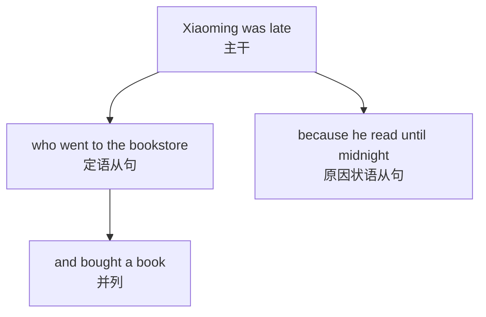
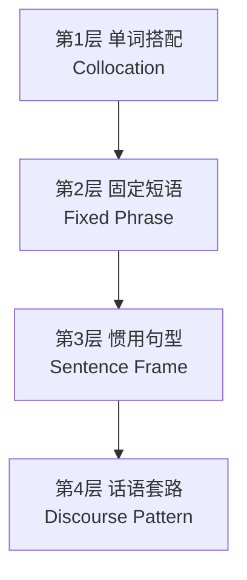
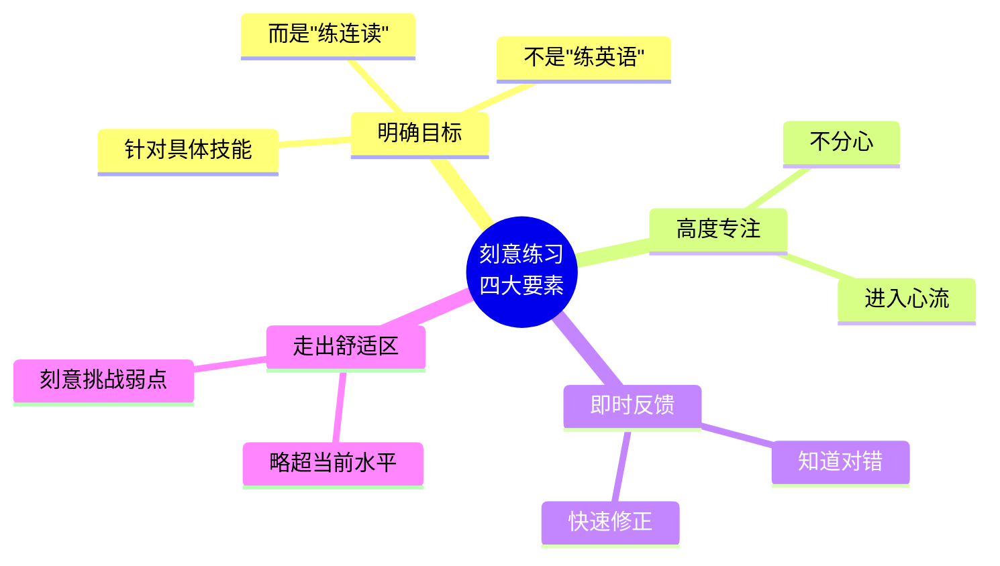

# 英语思维与语感培养

> [!info] 本篇定位
> 这是"入门基础与学习方法"分类的**收官之作**。
>
> 前三篇给了你**认知地图**、**行动路径**和**发音地基**。这一篇解决一个更玄但更重要的问题：**怎么让英语从"翻译"变成"思维"**？
>
> 很多人学了 10 年英语，说出来的每句话**都是先想中文再翻译**——这不是"英语好"，这是"翻译速度快"。真正会英语的人，是直接**用英语思考**。
>
> 这一篇就是把这个"玄学"拆开讲清楚，给你可以上手的训练方法。

---

## 1. 本篇导读：什么是"英语思维"

### 1.1 一个典型的"翻译式英语"场景

想象你在纽约的咖啡店，想问对面的外国人是否可以借你一支笔。

**有翻译思维的人**的大脑活动：

```
中文： 请问我可以借一下你的笔吗
  ↓ 逐词翻译
英文： Excuse me, can I borrow your pen?
  ↓ 说出来
耗时： 5-8 秒（够对方觉得你反应慢）
```

**有英语思维的人**的大脑活动：

```
场景触发 → 直接涌现句型："Excuse me, could I..."
  ↓
耗时： 1-2 秒
```

**这就是差距**。不是词汇量差 10 倍，而是**大脑里存储和调用语言的方式**根本不同。

### 1.2 本篇要解决的 3 个问题

1. 中英思维到底差在哪里？为什么翻译出来的英语"别扭"？
2. 怎么训练才能让英语从"翻译"变成"直出"？
3. 哪些**可以上手的工具和方法**能加速这个过程？

---

## 2. 中英思维 10 大差异（深度版）

### 2.1 差异一：树状 vs 竹状（核心差异）

**英语是"树"**：一句话有一个**主干**（主谓宾），其他都是挂在主干上的**枝叶**。

**中文是"竹"**：一句话像**一节一节的竹子**，一段一段平铺直叙。

**例子**：

中文（竹状）：
> "小明昨天去了书店，买了一本书，回家后看到很晚，第二天迟到了。"
>
> （四个小句并列，一节一节推进）

英文（树状）：
> `Xiaoming, who went to the bookstore yesterday and bought a book, was late the next day because he read until midnight.`
>
> （一个主句 `Xiaoming was late`，其他都是挂在上面的从句）



**怎么训练**：

- 写英文时，**先找主干**（谁+做什么），再挂修饰
- 不要像写中文一样一句一句加，而是把它们**嵌套**进一句

### 2.2 差异二：先重点 vs 先铺垫

**英文**：**先说结论/重点，再补充细节**。
**中文**：**先铺垫背景，最后说结论**。

**例子**：

中文：
> "今天天气不错，我朋友约我出去玩，路上堵车堵了两个小时，所以**我回来晚了**。"（结论在最后）

英文：
> `**I came home late** because of a two-hour traffic jam on my way out with a friend today in this nice weather.`（结论在最前）

**职场邮件/报告更是如此**：

- 中文习惯："鉴于……考虑到……综合以上……**因此决定**……"
- 英文习惯："**We've decided to...** because..."

### 2.3 差异三：人称主语 vs 物称主语

**中文偏爱"人"做主语**，**英语经常用"物"做主语**。

```
中文：我想到了一个主意。     （人做主语）
英文：An idea came to me.     （物做主语）

中文：我很担心这件事。         （人做主语）
英文：This matter worries me.  （物做主语）

中文：下雨了。                 （省略主语或"天下雨"）
英文：It is raining.          （用 it 做虚主语）
```

**训练技巧**：多用 `This reminds me of...`（这让我想起）、`It occurred to me that...`（我突然想到）、`What made you...`（是什么让你……）这类句型，**强迫自己用物做主语**。

### 2.4 差异四：抽象 vs 具体

**英文喜欢抽象名词**，**中文喜欢具体描述**。

```
中文：他很勤奋。               （形容词描述）
英文：He shows great diligence. （用抽象名词 diligence）

中文：她总是对我很关心。       （具体行为）
英文：She shows great concern for me. （抽象名词 concern）
```

### 2.5 差异五：被动 vs 主动

**英文爱用被动**（尤其在正式场合），**中文偏爱主动**。

```
中文：他们昨天修好了这台机器。
英文（主动）：They fixed the machine yesterday.
英文（被动，更正式）：The machine was fixed yesterday.
```

**新闻/学术/正式报告**中，英文的被动语态出现频率是中文的 3-5 倍。

### 2.6 差异六：形合 vs 意合

- **英语是形合语言**：靠**形式标志**（连词、关系词、时态）连接逻辑
- **中文是意合语言**：靠**意思自明**，经常不加连词

```
中文：你不快点，就迟到了。（无 if，无 then，靠意思理解条件关系）
英文：If you don't hurry up, you'll be late. （必须有 if）

中文：下雨了，我没去。
英文：It rained, so I didn't go. / Because it rained, I didn't go.
```

> [!warning] 学英语的"形合魔咒"
>
> 中国学生写英文作文，最大的通病就是**"缺连词"**——每句话都孤零零的，句子之间逻辑不清。
>
> **必背连词清单**：
> - 因果：because, so, therefore, as a result
> - 转折：but, however, although, yet
> - 递进：moreover, furthermore, in addition
> - 举例：for example, for instance, such as
> - 总结：in conclusion, to sum up, overall
> - 时间：when, while, after, before, as soon as

### 2.7 差异七：时态显化 vs 时间词表达

- **英语**：通过**动词变形**表达时间
- **中文**：通过**时间副词**表达时间（动词不变）

```
中文：我昨天吃了饭 / 我正在吃饭 / 我明天吃饭
     （"吃"字完全不变，靠"昨天/正在/明天"区分）

英文：I ate dinner / I am eating / I will eat
     （动词 ate, am eating, will eat 三种形式）
```

**训练方法**：做**"时态转换练习"**——同一句话，用 16 种时态分别说一遍。

### 2.8 差异八：从大到小 vs 从小到大

```
地址：
  中文：中国 北京市 朝阳区 建国路 88 号 301 室
  英文：Room 301, 88 Jianguo Road, Chaoyang District, Beijing, China

日期：
  中文：2026 年 4 月 20 日
  英文（美式）：April 20, 2026
  英文（英式）：20 April 2026

姓名：
  中文：张 伟   （姓在前）
  英文：Wei Zhang  （名在前）
```

### 2.9 差异九：直接 vs 委婉

**英语更讲究委婉和礼貌**，尤其是提要求、拒绝、批评。

```
中文：把窗户关了。               （直接）
英文：Could you please close the window?   （委婉）

中文：我不同意。                 （直接）
英文：I'm afraid I can't agree. / I see your point, but... （委婉）

中文：你错了。                   （直接）
英文：I don't think that's quite right. / You might want to reconsider. （委婉）
```

**英式/美式英语中**，直接命令会让人觉得粗鲁。学会用 **Could you..., Would you mind..., I wonder if...** 等委婉结构是必修课。

### 2.10 差异十：事后反应 vs 事中反应

英美人**说话时频繁给反馈**（aha, right, I see, uh-huh, oh wow），中国人往往**听完才反应**。

**对话示例**：

母语对话：
```
A: "I went to Paris last week."
B: "Oh really? Nice!"
A: "It was amazing, you know, the Eiffel Tower..."
B: "Wow, I've always wanted to go!"
A: "And the food was incredible."
B: "Mm-hmm, I bet."
```

中国学生对话（常见模式）：
```
A: "I went to Paris last week, it was amazing, the Eiffel Tower, and the food was incredible."
B: [等 A 说完] "...Good."
```

> [!tip] 练习"反馈词"
>
> **必学反馈词清单**：
> - 同意类：`Right, I see, Exactly, Absolutely, Totally`
> - 惊讶类：`Really? Wow! No way! Seriously?`
> - 思考类：`Hmm, Well, Let me see`
> - 情感类：`Oh no! That's awful! That's great!`
>
> 在听英语对话时，**每 5-10 秒就要给反馈**，否则母语者会觉得你"没在听"。

---

## 3. 摆脱翻译式英语的 5 步法

### 3.1 第一步：降低翻译成本——储备语块

如果你脑子里**没有现成的语块**，每次说话都要从零组装，当然慢。

**解决方案**：建立你的"语块库"（下一节详细讲）。

### 3.2 第二步：场景 → 英文直通——不经过中文

建立**"场景-英文"直通链路**，绕开中文翻译。

**怎么做**：

看到一个场景（如"咖啡店点单"），你的大脑里应该直接涌现：
- `Can I have a...`
- `I'd like a...`
- `Medium / Large / Small`
- `For here or to go?`

而不是先想"我要点一杯咖啡"再翻译。

**训练方法**：
1. 选定 10 个高频场景（机场、酒店、餐厅、医院……）
2. 每个场景**强制背 20-30 个语块**
3. 闭眼想场景，**默念英文**（不要默念中文）

### 3.3 第三步：用英文描述画面——绕开母语

看到一个画面/物品，**强制用英文描述**，不借助中文。

**练习方法**：

早上起床洗漱，用英文描述自己在做的事：
```
I'm brushing my teeth.
The toothpaste tastes minty.
I'm washing my face with cold water.
Now I'm going to have breakfast.
```

**这个练习的核心**：你**不是在翻译**中文"我正在刷牙"，而是**直接看到画面**就说英文。

### 3.4 第四步：大量浸泡——建立"预期反应"

母语者说话快，是因为他们有**"预期反应"**——听到半句就知道后半句大概是什么。

这种能力只能通过**大量输入**建立。

**方法**：
- 每天 **30-60 分钟**的可理解英文输入
- 泛听 + 精听结合
- 持续 **3-6 个月**能明显感到变化

### 3.5 第五步：输出倒逼——暴露问题

光输入不输出，你永远不知道自己哪里不会。

**方法**：
- 每天英文日记 5-10 句
- 每周一次 AI 角色扮演对话
- 每周精读 1 篇文章后**用英文复述**

---

## 4. 语块（Chunk）记忆法：英语的"预制件"

### 4.1 什么是语块

**语块**（Chunk / Lexical Item）= 由**多个单词组成的固定或半固定搭配**，作为**一个整体**存储和调用。

母语者的大脑不是"词 + 语法规则"，而是**"语块库"**。他们说话像拼乐高——从库里调现成模块，而不是每次从零搭建。

### 4.2 语块的 4 个层次



**第 1 层：单词搭配（Collocation）**

两三个词的固定搭配。

```
make a decision       做决定
take a shower         洗澡
pay attention         注意
catch a cold          感冒
strong coffee         浓咖啡（不是 thick coffee）
heavy rain            大雨（不是 big rain）
fast food             快餐（不是 quick food）
```

> [!warning] 搭配错误 = 典型"中式英语"
>
> - ❌ `learn knowledge` → ✅ `acquire knowledge` / `gain knowledge`
> - ❌ `do a mistake` → ✅ `make a mistake`
> - ❌ `open the light` → ✅ `turn on the light`
> - ❌ `expensive price` → ✅ `high price`
>
> 搭配没有规律，只能**整个记下来**。

**第 2 层：固定短语（Fixed Phrase）**

完整的小短语。

```
by the way            顺便说
as a matter of fact   实际上
for the time being    暂时
in the long run       从长远看
it's up to you        看你的
no worries            别担心
take your time        不着急
```

**第 3 层：惯用句型（Sentence Frame）**

有"变量"的句型框架。

```
It's not that ... but rather ...     不是……而是……
The thing is, ...                    问题是……
What I mean is ...                   我的意思是……
I was wondering if you could ...     不知您能否……
There's no way I could ...            我不可能……
```

**第 4 层：话语套路（Discourse Pattern）**

多句话组成的表达套路，用于特定场合。

```
拒绝邀请：
  "Thanks for inviting me, but I'm afraid I can't make it.
   I already have something planned that evening.
   Maybe next time?"

表达不同意见：
  "I see your point, but I think there's another way to look at it.
   From my perspective, ..."

请求帮助：
  "Sorry to bother you, but I was wondering if you could help me with ...
   It would mean a lot to me."
```

### 4.3 如何积累语块

**原则 1：按场景积累**

建一个笔记本（或 Notion / Anki 卡片），按场景分类：

```
📁 餐厅场景
  - I'd like to book a table for two.
  - Could I see the menu, please?
  - What do you recommend?
  - Can I have the check, please?

📁 职场场景
  - Could we schedule a meeting for next Tuesday?
  - I'd like to circle back on this.
  - Let me get back to you on that.
  - That's a great point, but...
```

**原则 2：整条记，不要拆**

- ❌ 分别记 `pay` 和 `attention` 两个词
- ✅ 整条记 `pay attention to sth.`

拆开记，用的时候就会瞎搭配。

**原则 3：带语境记**

记语块时**附上一个完整例句**：

```
Bad：  take a chance = 冒险
Good： "Come on, let's take a chance on this idea!"
       （来吧，我们冒险试试这个主意！）
```

**原则 4：每天输出 10 个**

不用则忘。每天**强迫自己用** 10 个新学的语块：
- 造句 5 个
- AI 对话用上 3-5 个
- 英文日记融入 2-3 个

### 4.4 高频语块 50 条（初学必背）

> [!success] 高频万能语块清单
>
> **日常对话开场**
>
> 1. How's it going? — 最近怎样？
> 2. What have you been up to? — 你最近忙啥？
> 3. Long time no see. — 好久不见。
> 4. Nice to meet you. — 很高兴认识你。
> 5. How was your day? — 今天过得怎么样？
>
> **确认和反馈**
>
> 6. I see. — 我明白了。
> 7. That makes sense. — 有道理。
> 8. Fair enough. — 有道理/可以接受。
> 9. Got it. — 明白了。
> 10. Sounds good. — 听起来不错。
>
> **表达观点**
>
> 11. In my opinion, ... — 在我看来……
> 12. If you ask me, ... — 要我说……
> 13. The way I see it, ... — 我的看法是……
> 14. To be honest, ... — 老实说……
> 15. From my perspective, ... — 从我的角度……
>
> **委婉建议**
>
> 16. You might want to ... — 你或许可以……
> 17. Have you considered ...? — 你有没有考虑过……
> 18. Why don't we ...? — 为什么我们不……
> 19. What if we ...? — 如果我们……会怎样
> 20. I was thinking maybe ... — 我在想也许……
>
> **请求帮助**
>
> 21. Could you do me a favor? — 能帮我个忙吗
> 22. Would you mind ...? — 你介意……吗
> 23. I was wondering if you could ... — 我想知道您能否……
> 24. Is there any chance you ...? — 有没有可能你……
> 25. Sorry to bother you, but ... — 不好意思打扰，但……
>
> **表达情绪**
>
> 26. I can't believe it. — 我不敢相信
> 27. You've got to be kidding me. — 你一定在开玩笑
> 28. That's amazing! — 太棒了
> 29. What a shame! — 真可惜
> 30. I'm so excited! — 我好兴奋
>
> **应对困难**
>
> 31. Let me think about it. — 让我想想
> 32. I'll get back to you on that. — 我稍后回复你
> 33. That's a tough one. — 那个有点难
> 34. I'm not sure, but ... — 我不确定，但……
> 35. Let me double-check. — 让我再确认一下
>
> **时间表达**
>
> 36. In the meantime, ... — 与此同时
> 37. Sooner or later, ... — 迟早
> 38. As soon as possible. — 尽快
> 39. At the moment, ... — 目前
> 40. From time to time, ... — 时不时
>
> **转折衔接**
>
> 41. On the other hand, ... — 另一方面
> 42. That being said, ... — 话虽如此
> 43. Having said that, ... — 话说回来
> 44. Speaking of which, ... — 说到这个
> 45. By the way, ... — 顺便说
>
> **结束对话**
>
> 46. I've got to go. — 我得走了
> 47. Talk to you later. — 回头聊
> 48. Take care. — 保重
> 49. Have a good one. — 祝你愉快（随意）
> 50. Catch you later. — 回头见

---

## 5. 刻意练习：从"熟练"到"精通"

### 5.1 什么是刻意练习（Deliberate Practice）

心理学家 Anders Ericsson 提出：**熟能生巧的"巧"不是自动产生的**，必须满足四个条件：



### 5.2 刻意练习 vs 低效练习的对比

| 低效练习 | 刻意练习 |
| ---- | ---- |
| 被动看美剧 | 精听一段反复 20 遍，标注每个连读 |
| 泛读小说 | 抄录 10 个生词，造句、听 YouGlish 发音 |
| 背单词书 A-Z | 针对弱点（如动词）专项记忆 |
| "每天学 1 小时" | "每天专攻连读 15 分钟" |
| 没有反馈 | 每次录音自评 + AI 纠错 |

### 5.3 把英语拆成"专项"刻意训练

**听力弱**？不要泛泛"练听力"，而是：
- 专项 1：连读识别（每天 15 分钟连读专训）
- 专项 2：弱读识别（专门练听功能词）
- 专项 3：数字/人名识别（这个母语者都头疼）

**口语弱**？不要泛泛"练口语"，而是：
- 专项 1：/θ/ /ð/ 舌位（每天 5 分钟，1 个月）
- 专项 2：重音节奏（跟读夸张模仿 10 遍/句）
- 专项 3：对话反馈词（强制每 10 秒一个反馈）

### 5.4 每天 1 个"专项突破"

```
周一：/r/ 发音 10 分钟
周二：连读识别 10 分钟
周三：弱读 10 分钟
周四：重音节奏 10 分钟
周五：语调升降 10 分钟
周末：综合跟读复习
```

**30 天一个循环**，每个专项能有明显提升。

---

## 6. Shadowing：最强的口语训练法

### 6.1 什么是 Shadowing

**Shadowing（影子练习）** = 跟着音频**慢半拍**跟读，不停顿、不看文本，像影子一样紧跟说话者。

这是日本同声传译训练的核心方法，也是**训练口语最有效的方法之一**。

### 6.2 Shadowing 的 5 个阶段


**阶段 1：听懂 + 看字幕**
- 听 3-5 遍，配合字幕完全理解
- 查清所有生词和语法

**阶段 2：跟读 + 看字幕**
- 音频播一句，暂停，跟读一句
- 模仿重音、语调、连读
- 反复至少 10 遍

**阶段 3：跟读不看字幕**
- 合上文本，用耳朵听
- 跟读（允许暂停）

**阶段 4：影子跟读**
- **不暂停**，音频继续播
- 你**慢半拍**跟读
- 像"复读机"一样

**阶段 5：流利影子**
- 甚至可以**同步跟读**（Echo）
- 这时你的嘴已经记住了"肌肉反应"

### 6.3 Shadowing 的具体操作

**推荐材料：**

- **初级**：BBC 6 Minute English（慢、短、有文本）
- **中级**：TED 演讲（5-15 分钟，文稿齐全）
- **高级**：Friends 台词 / 新闻播报

**每日练习（20 分钟）：**

```
第 1-5 分钟：选一段 1 分钟的材料，听 3 遍
第 6-10 分钟：对照文本精听，标注发音难点
第 11-15 分钟：跟读训练，录音
第 16-20 分钟：影子跟读（不看文本）
```

**一段材料练 1 周**，比 7 段每段练 1 次效果好 10 倍。

### 6.4 Shadowing 常见误区

> [!warning] 4 个经常掉的坑
>
> **误区 1：材料太难**
> - 选一段自己只能听懂 50% 的材料，练一辈子也练不熟。
> - 正确：选**能听懂 90%+** 的材料。
>
> **误区 2：追求速度**
> - 想从第一遍就跟上原速。
> - 正确：先用**0.75x 速度**跟读，流利后再提速。
>
> **误区 3：只动嘴不录音**
> - 自己听自己说都觉得"差不多"，但录下来对比原音差距巨大。
> - 正确：每次练完**录音对比**。
>
> **误区 4：频繁换材料**
> - 今天一段，明天换一段，永远学不透一段。
> - 正确：**一段至少练 1 周**。

---

## 7. 培养"英语耳"和"英语嘴"

### 7.1 英语耳：听得懂

**英语耳** = 不需要"翻译"就能直接理解英语意思的能力。

**建立英语耳的三个阶段**：

**阶段 1：能听清音**（1-3 个月）
- 能分辨每个单词（基于发音基础）
- 能识别连读、弱读

**阶段 2：能听懂意**（3-6 个月）
- 听到一个句子，大脑直接浮现画面/意思
- 不需要"先翻译再理解"

**阶段 3：能接住话**（6-12 个月）
- 对方说上半句，你能预测下半句
- 能在听的过程中同步思考如何回应

**训练方法**：
- **泛听**：每天浸泡 30-60 分钟（通勤、洗漱、做饭）
- **精听**：每天专注 15-20 分钟
- **听写**：每周 2-3 次，每次 10 分钟

### 7.2 英语嘴：说得出

**英语嘴** = 不需要思考语法，肌肉就能自动说出正确英语的能力。

**原理**：大脑里存的不是"语法规则"，而是"发过的音的肌肉记忆"。

**训练方法**：
- **跟读**：每个句子反复读 10 遍以上
- **Shadowing**：训练实时输出
- **自言自语**：描述你正在做的事
- **AI 对话**：模拟真实场景

> [!tip] 一个冷门但超有效的方法：背诵
>
> 选 3-5 篇**经典短文**（如新概念 2 册里的课文），**完整背诵**。
>
> - 一开始痛苦，但背下 3 篇后，你会发现：
>   - 很多句型**不知不觉**就"长"在你嘴里了
>   - 说话时能直接调用这些句子
>   - 英语语感突飞猛进
>
> **这是"笨方法"，但效果最好**。

---

## 8. 输入输出闭环：让学习不再是无底洞

### 8.1 什么是学习闭环

**没有闭环的学习**：

```
看视频 → 做笔记 → 存起来 → 再也不看
```

**有闭环的学习**：

```
输入 → 理解 → 输出 → 反馈 → 修正 → 再输出
  ↑                                     ↓
  └─────────── 迭代 ──────────────┘
```

### 8.2 构建你的英语闭环

**最小可行闭环（每天 30 分钟）**：

```
10 min：输入（精读/精听）
  ↓ 标注生词、句型
10 min：输出（口头复述/写日记）
  ↓ 用上新学内容
10 min：反馈（AI 纠错/对照原文）
  ↓ 找出错误
[第二天] 修正 + 再输出
```

**循环的威力**：

- 第 1 天：学 10 个新语块
- 第 2 天：昨天的 10 个中，有 3 个会用错（反馈暴露问题）
- 第 3 天：修正 + 又学 10 个新的
- 第 30 天：已经**真正掌握** 200+ 语块，而不是"学过" 300 个

### 8.3 AI 时代的闭环加速

**传统闭环**：反馈靠老师 / 语伴 → 成本高、频率低

**AI 闭环**：反馈靠 ChatGPT / Claude → **无限次、秒级反馈**

**具体怎么用（参考第 2 篇 Prompt 7）**：

```
Step 1（输入）：阅读一篇 BBC 新闻
Step 2（输出）：用中文概括 + 用英文复述
Step 3（反馈）：
  "这是我用英文复述的内容：[粘贴]
   请帮我：
   1. 改正语法错误
   2. 指出不地道的表达
   3. 给出 3 条改进建议"
Step 4（修正）：按建议重写一遍
Step 5（再输出）：明天用同样的材料，试着说得更地道
```

---

## 9. 100 天英语思维养成计划

> [!tip] 一个可以复制的 100 天训练计划
>
> **第 1-30 天：基础输入 + 语块积累**
>
> - 每天 30 分钟泛听（通勤/家务时）
> - 每天 20 分钟精读 1 段
> - 每天积累 5 个新语块
> - 每天 3 句英文日记
>
> **目标**：建立 200+ 语块库，语感初现
>
> ---
>
> **第 31-60 天：输出训练 + Shadowing**
>
> - 每天 15 分钟 Shadowing 训练
> - 每天 AI 对话 10 分钟
> - 每天 5 句英文日记
> - 每周 1 次完整复述
>
> **目标**：能流畅日常对话，主动用上所学语块
>
> ---
>
> **第 61-90 天：思维训练 + 综合输出**
>
> - 每天 30 分钟英文播客/TED
> - 每天"画面描述"练习 5 分钟
> - 每周写 1 篇短文（200 字）
> - 每周 1 次 AI 纠错复盘
>
> **目标**：能用英文思考简单问题，不需要中文过渡
>
> ---
>
> **第 91-100 天：冲刺输出**
>
> - 每天和 AI 做 30 分钟话题讨论
> - 每天录 2 分钟自由发言
> - 复盘前 90 天所学
>
> **目标**：敢说、能说、说得顺

---

## 10. 语感的"测试"：你到哪一阶段了

### 10.1 五个阶段自测

**阶段 1：翻译期**
- 听英语需要在脑中"翻成中文"才能理解
- 说英语是"中文先想好再翻译"
- 90% 的初学者在这里

**阶段 2：半翻译期**
- 简单句能直接理解，复杂句还要翻译
- 会说的句子不需要翻译，新句子需要

**阶段 3：思维转换期**
- 大部分日常英语能直接思维
- 偶尔遇到"不会说"时才会退回中文思维

**阶段 4：英语思维期**
- 完全用英语思考
- 甚至做梦会说英语（真实现象）
- 有时想说中文反而要"翻译"

**阶段 5：双母语期**
- 两种语言无缝切换
- 不同场景下自然使用不同语言
- 极少人能达到

### 10.2 从阶段 1 到阶段 4 需要多久

**每天 1 小时高效学习 + 正确方法**：

- 阶段 1 → 阶段 2：3-6 个月
- 阶段 2 → 阶段 3：6-12 个月
- 阶段 3 → 阶段 4：12-24 个月

**总计 2-3 年**达到英语思维。**再次强调：没有捷径**。

---

## 11. 常见问题 FAQ

### 11.1 Q：我学了很多年但还是哑巴英语，怎么办？

**A**：**输入 + 输出比例失衡**。

如果你只输入（背单词、做题、看剧）不输出（说、写），永远是"哑巴"。

**解决方案**：
1. 立即开始**每天英文日记**（3 句起步）
2. 下载 AI 对话 App，每天聊 5 分钟
3. 加入英语角或找语伴

### 11.2 Q：词汇量多少才够用？

**A**：看你的目标：
- 日常交流：**2500-3500 词**
- 看美剧不看字幕：**5000-7000 词**
- 读英文小说：**8000-10000 词**
- 雅思 7 分：**10000+ 词**
- 母语大学生：**20000+ 词**

**但质比量重要**：1000 个会用的词 > 5000 个认识但不会用的词。

### 11.3 Q：学英语需要出国吗？

**A**：**不需要，但出国更快**。

国内也能学到很好。关键是：
1. 有**正确的方法**（这套教程就是）
2. **每天坚持**练习
3. 使用 AI + 语伴**创造输出环境**

### 11.4 Q：背单词为什么总是忘？

**A**：因为**不在语境里**记的单词会快速遗忘。

**解决方案**：
1. 别单独背单词，**在句子/文章里记**
2. 用 Anki 做**间隔复习**
3. 每个词**造 3 个自己的例句**
4. 定期**用出去**（不用就忘）

### 11.5 Q：语法重要还是不重要？

**A**：**20% 的核心语法很重要，剩下 80% 够用就行**。

- 必须掌握：五大句型、8 个常用时态、常用从句
- 可以后学：虚拟语气、倒装、强调、省略

---

## 12. 练习与输出建议

> [!success] 本篇练习清单
>
> **思维训练（必做）**
>
> 1. 用英文描述你今天早上做的 5 件事（不许先想中文）：
>    例：`I woke up at 7. I brushed my teeth. I had breakfast. I took the subway. I arrived at the office.`
>
> 2. 找 3 个你常说的"中式英语"，写下正确说法：
>    - ❌ ? → ✅ ?
>    - ❌ ? → ✅ ?
>    - ❌ ? → ✅ ?
>
> **语块积累（强烈推荐）**
>
> 3. 从本篇 50 条高频语块中，**选 20 条**当天用出去（造句或 AI 对话）
>
> 4. 建立你的"语块笔记"（Notion / 纸质本/Anki）
>    - 按场景分类
>    - 每条附例句
>    - 每周复盘
>
> **Shadowing 练习（推荐）**
>
> 5. 选一段 1 分钟的 TED 片段，按 5 阶段法练 1 周，录音对比
>
> **长期任务**
>
> 6. 执行**100 天训练计划**（见第 9 节），每天打卡
>
> 7. 30 天后回头读本篇，看看你对"英语思维"的感觉有什么变化

---

## 13. 本篇小结

> [!success] 本篇核心要点回顾
>
> **中英思维 10 大差异**：
> - 树状 vs 竹状（核心差异）
> - 先重点 vs 先铺垫
> - 物称主语 vs 人称主语
> - 抽象 vs 具体
> - 被动 vs 主动
> - 形合 vs 意合
> - 时态显化 vs 时间词
> - 从小到大 vs 从大到小
> - 委婉 vs 直接
> - 即时反馈 vs 事后反应
>
> **摆脱翻译式英语 5 步法**：储备语块 → 场景直通 → 画面描述 → 大量浸泡 → 输出倒逼
>
> **语块 4 层**：搭配 → 短语 → 句型 → 话语套路
>
> **刻意练习 4 要素**：明确目标、高度专注、即时反馈、走出舒适区
>
> **Shadowing 5 阶段**：听懂 → 跟读看文 → 跟读脱文 → 影子跟读 → 流利影子
>
> **输入输出闭环**：输入 → 输出 → 反馈 → 修正 → 再输出
>
> **100 天计划**：基础积累 → 输出训练 → 思维训练 → 冲刺输出

### 13.1 入门分类收官

读到这里，"01.入门基础与学习方法"分类**全部 4 篇完成**。

你已经：
- ✅ 建立了英语的**整体认知**（第 1 篇）
- ✅ 制定了**个人学习计划**（第 2 篇）
- ✅ 掌握了**发音地基**（第 3 篇）
- ✅ 理解了**思维训练方法**（第 4 篇）

**这些是所有英语学习者必须先走完的路**。走完了，才能进入真正的句型和场景学习。

### 13.2 下一篇预告

> [!info] 下一分类：02.基础句型框架
>
> 接下来我们进入**句型框架模块**（4 篇），这是英语语法的"骨架"：
>
> - **02.01** 英语五大基本句型完全解析（SV、SVO、SVC、SVOO、SVOC）
> - **02.02** 陈述疑问祈使感叹四大句式
> - **02.03** there be 与 it 句型完全手册
> - **02.04** 倒装句、强调句与省略句
>
> 下一篇我们会从**五大基本句型**开始，它们是构成所有英语句子的"原子"。
> 搞懂这 5 个句型，你就等于掌握了英语句子的"元规则"。

---

## 14. 入门基础与学习方法分类总结

本分类 4 篇文档，可以归纳为一条主线：

```
认知   →    行动   →   地基   →   灵魂
第 1 篇     第 2 篇    第 3 篇    第 4 篇
核心概念   规划方法   发音基础   思维语感
```

- **第 1 篇**告诉你**要学什么**
- **第 2 篇**告诉你**怎么学**
- **第 3 篇**给你**发音地基**
- **第 4 篇**告诉你**怎么变成地道英语**

如果你认真读完这 4 篇 + 执行了其中的练习和建议，你已经**把 80% 的同龄学习者甩在后面了**。

但记住：**读完 ≠ 学会**。学英语永远是**"输入 + 输出 + 反馈"的闭环**。

接下来的 44 篇，我们会把英语的每个细节**拆开揉碎讲清楚**。现在，**休息一下，我们下一篇见**。
