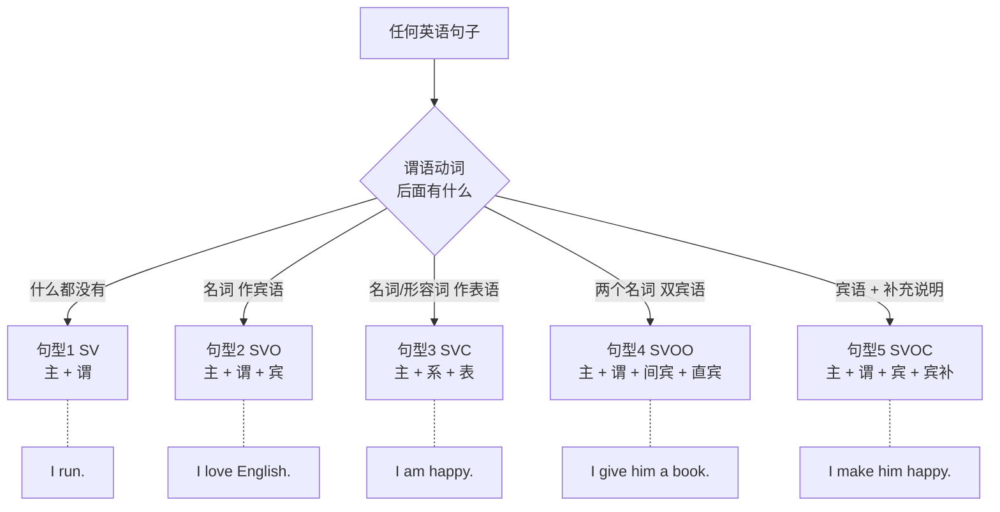
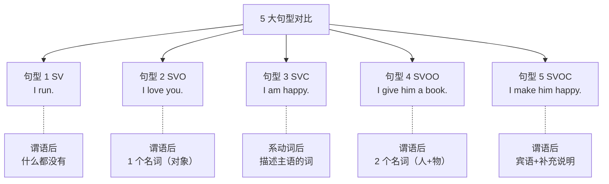
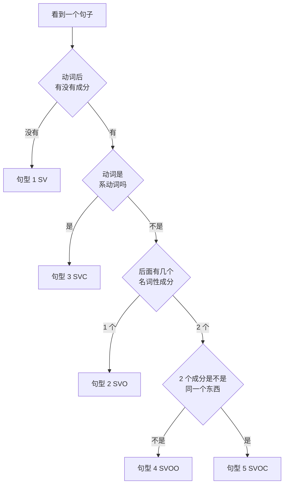

# 英语五大基本句型完全解析

> [!info] 本篇定位
> 欢迎进入"**02.基础句型框架**"分类。
>
> 如果说前面四篇是"认识英语"，那这一篇就是**真正开始搭英语大厦**。
>
> 你可能听过一种说法："**英语所有的句子，都是五大基本句型的变形和扩展**"。这不是夸张——从最简单的 `I run.` 到长达 100 字的复合句，**骨架都是这 5 种**。
>
> 读完本篇，你将具备一个超能力：**看到任何英语句子，都能一眼看出它的骨架**。这对理解复杂句、写英语作文、做翻译都有**决定性的帮助**。

---

## 1. 本篇导读：为什么五大句型是英语的"原子"

### 1.1 一个震撼的事实

请看下面一组句子：

```
① I run.
② I love English.
③ I am happy.
④ I give him a book.
⑤ I make him happy.
```

这 5 个句子**长度差不多**，看起来都很简单。但它们属于**5 种完全不同的句型**！而且——**所有英语句子都是这 5 种句型的扩展或变形**。

现在看一个长句：

```
The tall boy who was sitting next to me at the library yesterday
gave me a book about artificial intelligence very generously.
```

这句话有 19 个单词，看起来复杂，但它的**骨架**只有 4 个词：

```
The tall boy ... gave me a book ...
     |          |    |    |
     主语       谓语  间宾  直宾  ← 这就是句型 ④ SVOO
```

**五大句型的价值**：无论句子多复杂，你都能**剥出**它的主干结构，理解起来就轻松多了。

### 1.2 五大句型总览



**图说**：判断一个句子属于哪个句型，**关键看谓语动词后面接什么**。这个判断树能让你**秒辨句型**。

### 1.3 符号说明（全文通用）

| 符号 | 代表 | 英文全称 |
| ---- | ---- | ---- |
| S | 主语 | Subject |
| V | 谓语动词 | Verb |
| O | 宾语 | Object |
| C | 表语 / 补语 | Complement |
| Vi | 不及物动词 | Intransitive Verb |
| Vt | 及物动词 | Transitive Verb |
| IO | 间接宾语 | Indirect Object |
| DO | 直接宾语 | Direct Object |
| OC | 宾语补足语 | Object Complement |

---

## 2. 句型 1：SV（主 + 谓）

### 2.1 定义与公式

**SV 句型** = **主语 + 谓语**，这是英语最**简单**的句型。

```
公式：Subject + Verb
     主语    + 谓语
```

**特点**：谓语动词**后面不需要接任何成分**，句子意思就完整了。

**最简例句**：

```
I     run.
主语  谓语
(我   跑。)

Birds fly.
主语  谓语
(鸟儿 飞翔。)

Time  flies.
主语  谓语
(时间 飞逝。)
```

### 2.2 SV 句型的动词：Vi（不及物动词）

能用在 SV 句型的动词叫 **Vi（不及物动词）**。

**不及物**的意思是：**这个动作不作用于某个对象**。

- `run`（跑）—— 跑这个动作，不需要"跑谁"
- `sleep`（睡）—— 睡这个动作，不需要"睡谁"
- `smile`（笑）—— 笑这个动作，不需要"笑谁"

**常见 Vi 动词清单**：

```
运动类：  run（跑）, walk（走）, swim（游）, jump（跳）, fly（飞）
状态类：  sleep（睡）, rest（休息）, sit（坐）, stand（站）, lie（躺）
情感类：  smile（微笑）, laugh（大笑）, cry（哭）, frown（皱眉）
自然类：  rain（下雨）, snow（下雪）, shine（发光）
生死类：  live（活）, die（死）, exist（存在）, happen（发生）
运行类：  work（工作）, function（运行）, succeed（成功）, fail（失败）
```

### 2.3 典型例句（20 个）

> [!success] SV 句型典型例句
>
> **日常动作**
> 1. `The sun rises.`（太阳升起。）
> 2. `Babies cry.`（婴儿哭。）
> 3. `Accidents happen.`（事故会发生。）
> 4. `Dogs bark.`（狗叫。）
> 5. `Rivers flow.`（河流流动。）
>
> **带时间状语**（状语不改变句型）
> 6. `He runs every morning.`（他每天早上跑步。）
> 7. `She sleeps at 10 PM.`（她晚上 10 点睡觉。）
> 8. `Birds sing in the morning.`（鸟儿早上歌唱。）
> 9. `Flowers bloom in spring.`（花儿春天开放。）
> 10. `The train arrives at 8.`（火车 8 点到达。）
>
> **带地点状语**
> 11. `I work in Beijing.`（我在北京工作。）
> 12. `He lives in the city.`（他住在城里。）
> 13. `Fish swim in the sea.`（鱼在海里游。）
> 14. `They meet at the park.`（他们在公园见面。）
> 15. `Children play outside.`（孩子们在外面玩。）
>
> **带方式/程度状语**
> 16. `The baby slept peacefully.`（婴儿安静地睡着。）
> 17. `Time flies fast.`（时间飞快。）
> 18. `She smiled brightly.`（她灿烂地笑。）
> 19. `He spoke loudly.`（他大声说话。）
> 20. `The sun shines brightly.`（太阳明亮地照耀。）

### 2.4 扩展：SV + 状语

**注意**：SV 句型可以加**状语**（状语不是句子必需成分，只是修饰）。

```
I run.                            (SV)
I run in the park.                (SV + 地点状语)
I run in the park every morning.  (SV + 地点状语 + 时间状语)
```

**判断方法**：去掉状语，句子**还是完整**的。如果去掉后句子不完整，那就不是状语，是宾语/补语。

### 2.5 SV 句型的常见陷阱

> [!warning] 易错点 1：把 Vi 当 Vt 用
>
> 很多中国学生会说：
> - ❌ `I will arrive the airport at 10.`
> - ✅ `I will arrive at the airport at 10.`
>
> `arrive` 是 Vi（不及物动词），不能直接接宾语。必须用 `arrive at + 地点`。
>
> **常见"伪及物"的 Vi**：
> - ❌ `agree you` → ✅ `agree with you`
> - ❌ `listen the music` → ✅ `listen to the music`
> - ❌ `look me` → ✅ `look at me`
> - ❌ `wait me` → ✅ `wait for me`
> - ❌ `graduate the school` → ✅ `graduate from the school`

> [!warning] 易错点 2：rise vs raise
>
> - `rise`（Vi，升起）：`The sun rises.`（太阳升起。）
> - `raise`（Vt，举起）：`He raises his hand.`（他举手。）
>
> 对比：
> - `The price rises.`（价格上涨。——自己涨）
> - `They raise the price.`（他们抬高价格。——人为抬）

### 2.6 SV 场景实战

**场景**：早晨办公室闲聊

```
A: "How was your weekend?"
B: "I slept a lot. And you?"
A: "I ran in the park every morning."
B: "Wow, that sounds healthy. Did it rain?"
A: "No, it was sunny. Time flies!"
```

**骨架解析**：
- `I slept a lot.` = `I slept.`（SV）+ `a lot`（状语）
- `I ran in the park every morning.` = `I ran.`（SV）+ 两个状语
- `Did it rain?` = `It rains.`（SV）的疑问形式
- `Time flies!` = 纯 SV

---

## 3. 句型 2：SVO（主 + 谓 + 宾）

### 3.1 定义与公式

**SVO 句型** = **主语 + 谓语 + 宾语**，是英语**最常用**的句型，约占所有句子的 60%。

```
公式：Subject + Verb + Object
     主语    + 谓语  + 宾语
```

**特点**：谓语动词**后面必须接一个名词（或相当于名词的成分）作宾语**。

**最简例句**：

```
I     love   you.
主语  谓语   宾语
(我   爱     你。)

She   likes  apples.
主语  谓语   宾语
(她   喜欢   苹果。)

He    reads  books.
主语  谓语   宾语
(他   读     书。)
```

### 3.2 SVO 句型的动词：Vt（及物动词）

能用在 SVO 的动词叫 **Vt（及物动词）**。

**及物**的意思是：**这个动作必须作用于一个对象**。

- `love` 爱——必须爱谁/什么
- `buy` 买——必须买什么
- `see` 看见——必须看见什么

**常见 Vt 动词清单**：

```
认知类：  know（知道）, understand（理解）, remember（记得）, forget（忘记）
感官类：  see（看见）, hear（听见）, feel（感觉）, smell（闻到）
情感类：  love（爱）, like（喜欢）, hate（恨）, enjoy（享受）
交流类：  tell（告诉）, ask（问）, answer（回答）, discuss（讨论）
动作类：  eat（吃）, drink（喝）, buy（买）, sell（卖）, make（做）
学习类：  study（学习）, learn（学）, teach（教）, read（读）, write（写）
```

### 3.3 宾语的 5 种形式

**宾语不一定是单个名词**，可以是：

**形式 1：单个名词 / 代词**
```
I love you.                 (代词作宾语)
She likes apples.           (名词作宾语)
```

**形式 2：名词短语**
```
I love my family.           (my family 名词短语)
She bought a red car.       (a red car 名词短语)
```

**形式 3：动名词（doing）**
```
I enjoy reading.            (reading 动名词作宾语)
He likes swimming.          (swimming)
```

**形式 4：不定式（to do）**
```
I want to learn English.    (to learn English 不定式)
She decided to leave.       (to leave)
```

**形式 5：从句（宾语从句）**
```
I know that he is right.    (that he is right 从句作宾语)
She said (that) she was tired.
```

### 3.4 典型例句（20 个）

> [!success] SVO 句型典型例句
>
> **日常行为**
> 1. `I drink coffee every morning.`（我每天早上喝咖啡。）
> 2. `She plays the piano beautifully.`（她钢琴弹得很美。）
> 3. `They built a new house.`（他们建了一座新房子。）
> 4. `We watched a movie last night.`（我们昨晚看了一部电影。）
> 5. `He reads the newspaper on weekends.`（他周末读报纸。）
>
> **情感表达**
> 6. `I love my parents.`（我爱我的父母。）
> 7. `She misses her hometown.`（她想念她的家乡。）
> 8. `He hates broccoli.`（他讨厌西兰花。）
> 9. `They enjoyed the party.`（他们享受了聚会。）
> 10. `We appreciate your help.`（我们感谢你的帮助。）
>
> **认知思考**
> 11. `I know the answer.`（我知道答案。）
> 12. `She remembered the event.`（她记得那件事。）
> 13. `He forgot his keys.`（他忘了钥匙。）
> 14. `We understand the problem.`（我们理解这个问题。）
> 15. `They noticed something strange.`（他们注意到一些奇怪的事情。）
>
> **带动名词/不定式宾语**
> 16. `I enjoy reading books.`（我喜欢读书。）
> 17. `She wants to travel around the world.`（她想环游世界。）
> 18. `He stopped smoking.`（他戒烟了。）
> 19. `They decided to move.`（他们决定搬家。）
> 20. `We hope to see you soon.`（我们希望尽快见到你。）

### 3.5 SVO 句型的常见陷阱

> [!warning] 易错点 1：宾语缺失
>
> 中文可以说"我喜欢。"（对方知道"什么"），英文必须把"什么"说出来。
>
> - ❌ `Do you like?` → ✅ `Do you like it?`
> - ❌ `I want.` → ✅ `I want it.`

> [!warning] 易错点 2：动名词 vs 不定式
>
> 有些动词后**只能跟动名词**，有些**只能跟不定式**，有些**都可以**。
>
> **只跟动名词**：enjoy, finish, practice, avoid, mind, suggest
> - `I enjoy swimming.` ✅
> - ❌ `I enjoy to swim.`
>
> **只跟不定式**：want, hope, decide, promise, agree, refuse
> - `I want to leave.` ✅
> - ❌ `I want leaving.`
>
> **两者都可以**（意思可能不同）：like, love, hate, prefer, begin, start
> - `I like reading.` / `I like to read.`（都对）
>
> **两者意思不同**：remember, forget, stop, try
> - `I stopped smoking.`（我戒烟了——停止吸烟这件事）
> - `I stopped to smoke.`（我停下来去吸烟——停下来做另一件事）

### 3.6 SVO 场景实战

**场景**：咖啡店点单

```
Clerk: "What can I get you?"
Tom:   "I'd like a latte, please."
Clerk: "What size do you want?"
Tom:   "I'll take a medium."
Clerk: "Do you want sugar?"
Tom:   "I prefer it black, thanks."
```

**骨架解析**：
- `I'd like a latte.` = `I would like + 宾语`（SVO）
- `What size do you want?` = `You want + what size`（SVO 疑问）
- `I'll take a medium.` = `I will take + 宾语`（SVO）
- `I prefer it black.`（SVOC 哦，不是 SVO——这是句型 5，后面讲）

---

## 4. 句型 3：SVC（主 + 系 + 表）

### 4.1 定义与公式

**SVC 句型** = **主语 + 系动词 + 表语**。这是**描述状态/性质**的句型。

```
公式：Subject + Linking Verb + Complement
     主语     + 系动词          + 表语
```

**特点**：系动词本身没什么动作含义，作用是**连接主语和表语**，表语**说明主语是什么/怎么样**。

**最简例句**：

```
I     am       happy.
主语  系动词   表语
(我   是       开心的。)

She   is       a teacher.
主语  系动词   表语
(她   是       一位老师。)

He    looks    tired.
主语  系动词   表语
(他   看起来   累。)
```

### 4.2 系动词：SVC 句型的灵魂

**系动词分 4 类**：

**第 1 类：be 动词家族**（最常见）

```
am / is / are / was / were / be / been / being
```

**第 2 类：感官系动词**（表示"看起来/听起来/尝起来……"）

```
look（看起来）    sound（听起来）
smell（闻起来）   taste（尝起来）
feel（感觉起来）
```

```
This cake tastes delicious.  （这蛋糕很好吃——字面：尝起来美味）
The music sounds nice.       （音乐好听）
You look tired today.        （你今天看起来累）
```

**第 3 类：变化系动词**（表示"变成"）

```
become（成为/变得）    get（变得）    turn（变成）
grow（逐渐变）         go（变——常用于变坏）
```

```
He became a doctor.        （他成为了一名医生。）
It's getting cold.         （天变冷了。）
Her face turned red.       （她脸变红了。）
The milk went bad.         （牛奶变坏了。）
```

**第 4 类：状态保持系动词**（表示"保持某状态"）

```
keep（保持）    stay（保持）    remain（仍然）    seem（似乎）
```

```
Please keep quiet.               （请保持安静。）
She stays calm under pressure.   （她在压力下保持冷静。）
The problem remains unsolved.    （问题仍然没解决。）
He seems happy.                  （他看起来很开心。）
```

### 4.3 表语的 6 种形式

**表语可以是多种形式**：

**形式 1：形容词**（最常见）
```
She is beautiful.       (形容词作表语)
The food tastes good.
```

**形式 2：名词 / 名词短语**
```
He is a doctor.         (名词短语作表语)
She became my friend.
```

**形式 3：代词**
```
This book is mine.      (代词作表语)
It's me.
```

**形式 4：数词**
```
I am twenty.            (数词作表语)
She is the first.
```

**形式 5：介词短语**
```
The book is on the table.   (介词短语作表语)
He is from China.
```

**形式 6：从句（表语从句）**
```
The truth is that he lied.      (从句作表语)
The question is whether we should go.
```

### 4.4 典型例句（20 个）

> [!success] SVC 句型典型例句
>
> **be + 形容词**
> 1. `I am tired.`（我累了。）
> 2. `She is beautiful.`（她很美丽。）
> 3. `The weather is nice today.`（今天天气不错。）
> 4. `They are busy.`（他们很忙。）
> 5. `The story was interesting.`（故事很有趣。）
>
> **be + 名词**
> 6. `He is a student.`（他是学生。）
> 7. `My father is a doctor.`（我爸爸是医生。）
> 8. `Today is Monday.`（今天是周一。）
> 9. `This is my phone.`（这是我的手机。）
> 10. `Beijing is a big city.`（北京是座大城市。）
>
> **感官系动词**
> 11. `You look great!`（你看起来很棒！）
> 12. `This soup tastes salty.`（这汤尝起来咸。）
> 13. `The flower smells sweet.`（花闻起来香。）
> 14. `Her voice sounds nervous.`（她的声音听起来紧张。）
> 15. `This fabric feels soft.`（这面料摸起来柔软。）
>
> **变化系动词**
> 16. `He became famous.`（他变得有名。）
> 17. `The days are getting longer.`（白天变长了。）
> 18. `The leaves turned yellow.`（叶子变黄了。）
> 19. `Dreams come true.`（梦想成真。）
> 20. `The milk went bad.`（牛奶变质了。）

### 4.5 SVC 句型的常见陷阱

> [!warning] 易错点 1：误用副词代替形容词
>
> 系动词后面**只能跟形容词**，不能跟副词。
>
> - ❌ `I am happily.` → ✅ `I am happy.`
> - ❌ `She looks beautifully.` → ✅ `She looks beautiful.`
>
> 中国学生常因为"看起来漂亮**地**"这种中文直译而出错。

> [!warning] 易错点 2：形容词 vs 副词的用法
>
> 对比：
> - `She sings well.` (sing 是实义动词 Vi，后面用副词 well 修饰) → SV
> - `She is well.` (is 是系动词，后面用形容词 well "健康的") → SVC
>
> 同一个单词形式**在不同句型里意思不同**。

> [!warning] 易错点 3：系动词不用进行时
>
> be 动词**通常不用进行时**：
> - ❌ `I am being happy.` → ✅ `I am happy.`
>
> 但 **be + 褒贬形容词描述行为**时可以：
> - `She is being rude today.`（她今天正在表现得粗鲁。——暗指平时不是这样）

### 4.6 SVC 场景实战

**场景**：朋友见面闲聊

```
Mary: "You look tired today."
John: "Yeah, I am exhausted. Work has been crazy."
Mary: "That sounds awful. How's the new project?"
John: "It's challenging, but it's getting better."
Mary: "Well, you'll be a hero when it's done!"
```

**骨架解析**：
- `You look tired.` = S + 系 + 表（SVC）
- `I am exhausted.` = S + 系 + 表（SVC）
- `That sounds awful.` = S + 系 + 表（SVC）
- `It's challenging.` = S + 系 + 表（SVC）
- `It's getting better.` = S + 系 + 表（SVC）
- `You'll be a hero.` = S + 系 + 表（SVC）

---

## 5. 句型 4：SVOO（主 + 谓 + 双宾语）

### 5.1 定义与公式

**SVOO 句型** = **主语 + 谓语 + 间接宾语 + 直接宾语**。表达**"给某人某物"**这类含义。

```
公式：Subject + Verb + Indirect Object + Direct Object
     主语   + 谓语  + 间接宾语（人）    + 直接宾语（物）
```

**特点**：动词后面**跟两个宾语**——一个表示"给谁"（间接宾语），一个表示"给什么"（直接宾语）。

**最简例句**：

```
I     give    him            a book.
主语  谓语    间宾（人）       直宾（物）
(我   给      他              一本书。)

She   tells   me             a story.
主语  谓语    间宾             直宾
(她   告诉    我              一个故事。)

He    buys    his daughter   flowers.
主语  谓语    间宾             直宾
(他   买      他女儿          花。)
```

### 5.2 SVOO 句型常用动词

**能用于 SVOO 的动词有限**，主要是**表示"给予"类的动词**：

**"给予"类**：give（给）, send（发送）, pass（传递）, bring（带来）, hand（递）

**"告诉"类**：tell（告诉）, show（展示）, teach（教）, ask（问）

**"提供"类**：offer（提供）, lend（借出）, pay（支付）, owe（欠）

**"制作"类**：make（做）, buy（买）, get（得到）, cook（煮）, order（点）

**例句**：

```
He sent me a message.           (发)
She showed us her photos.       (展示)
The teacher taught us English.  (教)
Can I ask you a question?       (问)
I'll buy you a coffee.          (买)
Mom cooked me breakfast.        (煮)
```

### 5.3 SVOO 的变形：转换为 SVO + 介词

**SVOO 句型可以转换成 SVO + 介词短语**（间接宾语后置）：

```
原式（SVOO）：I give him a book.
变形（SVO + to）：I give a book to him.
```

**两种变形**：

**用 to 转换（表示"向某人"）**：
常见动词：give, tell, send, show, bring, pass, lend, teach, write

```
I gave him a book.         →  I gave a book to him.
She told me a secret.      →  She told a secret to me.
He sent us a letter.       →  He sent a letter to us.
```

**用 for 转换（表示"为某人"）**：
常见动词：buy, make, cook, get, order, find, choose

```
He bought me a ring.       →  He bought a ring for me.
She made her son a cake.   →  She made a cake for her son.
I'll get you some water.   →  I'll get some water for you.
```

> [!tip] 如何判断用 to 还是 for
>
> - **to**：动作**直接作用于对方**（给、告诉、发——动作指向某人）
> - **for**：动作**为对方而做**（买、做、煮——自己做但为了对方）
>
> 记忆口诀：
>
> - "给 to 说 to 传 to，送 to 写 to 展示 to"（give/tell/pass/send/write/show）
> - "买 for 做 for 煮 for，找 for 订 for 选择 for"（buy/make/cook/find/order/choose）

### 5.4 典型例句（20 个）

> [!success] SVOO 句型典型例句
>
> **"给予"类**
> 1. `My mother gave me a gift.`（妈妈给了我一份礼物。）
> 2. `He handed me the keys.`（他递给我钥匙。）
> 3. `She sent me a postcard.`（她给我寄了一张明信片。）
> 4. `Please pass me the salt.`（请把盐递给我。）
> 5. `I'll bring you some tea.`（我给你带些茶。）
>
> **"告诉/教/展示"类**
> 6. `Tell me the truth.`（告诉我真相。）
> 7. `Can you show me the way?`（你能给我指路吗？）
> 8. `She taught me English.`（她教我英语。）
> 9. `He told us a joke.`（他给我们讲了个笑话。）
> 10. `Let me ask you a question.`（让我问你一个问题。）
>
> **"提供/支付"类**
> 11. `The bank lent him $10,000.`（银行借给他 10000 美元。）
> 12. `I paid the cashier $20.`（我付给收银员 20 美元。）
> 13. `He owes me money.`（他欠我钱。）
> 14. `They offered us a discount.`（他们给了我们一个折扣。）
> 15. `Can you do me a favor?`（你能帮我个忙吗？）
>
> **"做/买/煮"类**
> 16. `I'll make you a sandwich.`（我给你做个三明治。）
> 17. `She bought her husband a watch.`（她给丈夫买了块表。）
> 18. `Can you get me some water?`（能给我拿些水吗？）
> 19. `He cooked us dinner.`（他给我们做晚饭。）
> 20. `I'll order you a taxi.`（我给你叫辆出租车。）

### 5.5 SVOO 句型的常见陷阱

> [!warning] 易错点 1：双宾语顺序
>
> **SVOO 时顺序固定**：先"人"（间宾）后"物"（直宾）。
>
> - ❌ `I give a book him.` → ✅ `I give him a book.`
>
> **但转为 SVO 时**：物在前、to/for + 人在后。
> - ✅ `I give a book to him.`

> [!warning] 易错点 2：代词做直宾时必须变形
>
> 当**直宾是代词**时，**只能用 SVO + to/for 形式**，不能用 SVOO：
>
> - ❌ `I give him it.` → ✅ `I give it to him.`
> - ❌ `She bought me it.` → ✅ `She bought it for me.`

> [!warning] 易错点 3：suggest, explain, introduce 不用 SVOO
>
> 中文的"向某人建议/解释/介绍"容易让人以为是 SVOO，**其实必须用 SVO + to**：
>
> - ❌ `He suggested me a plan.` → ✅ `He suggested a plan to me.`
> - ❌ `She explained me the rule.` → ✅ `She explained the rule to me.`
> - ❌ `Please introduce me your friend.` → ✅ `Please introduce your friend to me.`

### 5.6 SVOO 场景实战

**场景**：生日聚会

```
Tom:   "Happy birthday! I got you something."
Mary:  "Oh wow, you didn't have to!"
Tom:   "I bought you a scarf. I hope you like it."
Mary:  "It's beautiful! Let me show you my new earrings."
Tom:   "Cool! Who gave them to you?"
Mary:  "My mom sent me them for my birthday."
```

**骨架解析**：
- `I got you something.` = SVOO（give 类变体）
- `I bought you a scarf.` = SVOO
- `Let me show you my new earrings.` = SVOO
- `Who gave them to you?` = SVO + to（因为直宾 them 是代词）
- `My mom sent me them for my birthday.` (口语中偶尔可接受，书面语应改为 `sent them to me`)

---

## 6. 句型 5：SVOC（主 + 谓 + 宾 + 宾补）

### 6.1 定义与公式

**SVOC 句型** = **主语 + 谓语 + 宾语 + 宾语补足语**。宾补**补充说明宾语**的状态、身份或行为。

```
公式：Subject + Verb + Object + Object Complement
     主语  + 谓语   + 宾语  + 宾语补足语
```

**特点**：宾语后面**必须再跟一个成分**（宾补）来补充说明宾语，**否则意思不完整**。

**最简例句**：

```
I      make    him      happy.
主语   谓语    宾语      宾补
(我    让      他        开心。)

We     call    her      Mary.
主语   谓语    宾语      宾补
(我们  称呼    她        玛丽。)

They   found   the door open.
主语   谓语    宾语       宾补
(他们  发现    门         开着。)
```

### 6.2 SVOC vs SVOO 的区分

这是最容易混淆的两个句型！

**区分关键**：看"宾语"和"第二个成分"**是不是同一个东西**。

```
SVOO： I give him a book.
       him ≠ a book  （"他"和"书"是不同的东西）

SVOC： I make him happy.
       him = happy  （"他"就是"开心"的那个人——是同一个东西）
```

**另一个判断方法**：在两个成分之间加 "**is/are**"：
- 加完通顺 → SVOC（`him is happy` 合理——"他是开心的"）
- 加完不通顺 → SVOO（`him is a book` 不合理——"他是一本书"？不对）

### 6.3 SVOC 的 4 种宾补形式

**形式 1：名词 / 名词短语**
（表示"称呼某人为……"）

```
They elected him president.           （他们选他为总统。）
We named our dog Buddy.               （我们给狗起名叫 Buddy。）
People call New York the Big Apple.   （人们叫纽约"大苹果"。）
```

常用动词：call, name, elect, make, appoint, consider

**形式 2：形容词**
（表示"使宾语处于某种状态"）

```
The news made me happy.           （消息让我开心。）
Keep the room clean.              （保持房间干净。）
I found the book interesting.     （我发现这本书很有趣。）
```

常用动词：make, keep, find, leave, get, turn

**形式 3：不定式（to do）/ 省略 to 的不定式**
（表示"让/使某人做某事"）

```
I want you to come.                   （我想你来。——to do）
She asked me to help her.             （她请我帮她。）
I heard him sing.                     （我听到他唱歌。——省略 to）
He made me cry.                       （他让我哭了。——省略 to）
Let me go.                            （让我走。——省略 to）
```

**省略 to 的动词**：make, let, have（使役动词）+ see, hear, watch, feel, notice（感官动词）

**形式 4：分词（doing / done）**

现在分词（doing）：表示"宾语正在做……"
```
I saw him running.                （我看见他在跑。）
We kept the engine running.       （我们让引擎开着。）
I heard the baby crying.          （我听见婴儿在哭。）
```

过去分词（done）：表示"宾语被……"
```
I found my car stolen.            （我发现车被偷了。）
Keep the door closed.             （保持门关着。）
I had my hair cut.                （我剪了头发。）
```

### 6.4 典型例句（20 个）

> [!success] SVOC 句型典型例句
>
> **宾补是形容词**
> 1. `Her smile made me happy.`（她的微笑让我开心。）
> 2. `The heat kept us awake.`（炎热让我们睡不着。）
> 3. `I found the movie boring.`（我觉得电影无聊。）
> 4. `Please leave the door open.`（请让门开着。）
> 5. `Exercise keeps you healthy.`（运动让你健康。）
>
> **宾补是名词**
> 6. `They elected him leader.`（他们选他做领导。）
> 7. `We named our son Jack.`（我们给儿子取名 Jack。）
> 8. `People consider her a genius.`（人们认为她是个天才。）
> 9. `The king appointed him minister.`（国王任命他为大臣。）
> 10. `I call him Uncle Tom.`（我叫他汤姆叔叔。）
>
> **宾补是不定式**
> 11. `I want you to stay.`（我想你留下来。）
> 12. `She asked me to help.`（她请我帮忙。）
> 13. `The teacher told us to be quiet.`（老师让我们安静。）
> 14. `Parents expect their children to succeed.`（父母期待孩子成功。）
> 15. `Please allow me to explain.`（请允许我解释。）
>
> **宾补是省略 to 的不定式**
> 16. `Let me go.`（让我走。）
> 17. `Don't make me wait.`（别让我等。）
> 18. `I heard him sing.`（我听见他唱歌。）
> 19. `She watched him leave.`（她看着他离开。）
> 20. `Have him call me.`（让他给我打电话。）

### 6.5 SVOC 句型的常见陷阱

> [!warning] 易错点 1：make / let 后面接 to do
>
> 使役动词 make, let, have + 宾语 + **省略 to** 的不定式！
>
> - ❌ `She made me to cry.` → ✅ `She made me cry.`
> - ❌ `Let him to go.` → ✅ `Let him go.`
> - ❌ `I had him to clean the room.` → ✅ `I had him clean the room.`
>
> 但 **被动语态时 to 要出现**：
> - `I was made to cry by her.`

> [!warning] 易错点 2：see / hear + 宾 + doing vs do
>
> 感官动词后的宾补：
> - **do（省略 to）**：表示**动作全过程**（从开始到结束都看/听到）
> - **doing**：表示**动作正在进行**（只看/听到一段）
>
> 对比：
> - `I saw him cross the street.`（我看到他过马路——全过程）
> - `I saw him crossing the street.`（我看到他正在过马路——瞬间）

> [!warning] 易错点 3：SVOC 中的宾补是形容词不是副词
>
> 和 SVC 一样，SVOC 的宾补**若为描述状态，用形容词不用副词**。
>
> - ❌ `She made me happily.` → ✅ `She made me happy.`
> - ❌ `I found the book interestingly.` → ✅ `I found the book interesting.`

### 6.6 SVOC 场景实战

**场景**：办公室讨论项目

```
Boss:  "I want you to finish the report by Friday."
Alice: "That's tight. Can you give me more time?"
Boss:  "I'm afraid not. The client expects us to deliver on time."
Alice: "OK, I'll make it happen."
Boss:  "Great. Let me know if you need help."
Alice: "Will do. I'll keep you updated."
```

**骨架解析**：
- `I want you to finish the report.` = SVOC（to do 作宾补）
- `The client expects us to deliver on time.` = SVOC
- `I'll make it happen.` = SVOC（省略 to 的不定式 happen）
- `Let me know.` = SVOC（省略 to）
- `I'll keep you updated.` = SVOC（过去分词作宾补）

---

## 7. 五大句型全面对比

### 7.1 一张表看懂 5 种句型



### 7.2 对比表

| 句型 | 结构 | 关键特征 | 代表动词 | 经典例句 |
| ---- | ---- | ---- | ---- | ---- |
| 1. SV | 主 + 谓 | 动词后空 | run, sleep, arrive | `Birds fly.` |
| 2. SVO | 主 + 谓 + 宾 | 动词后 1 个宾语 | love, buy, read | `I love you.` |
| 3. SVC | 主 + 系 + 表 | 系动词连接描述 | be, look, become | `She is happy.` |
| 4. SVOO | 主 + 谓 + 人 + 物 | 动词后 2 个宾语 | give, tell, buy | `He gave me a book.` |
| 5. SVOC | 主 + 谓 + 宾 + 宾补 | 宾语后有补充 | make, keep, find | `I made him happy.` |

### 7.3 辨别句型 3 步法



**3 步法**：
1. **动词后有无**？无 → SV
2. **是否系动词**？是 → SVC
3. **后面几个成分**？1 个 → SVO；2 个且同一对象 → SVOC；2 个且不同对象 → SVOO

---

## 8. 同一动词在不同句型中的差异

有趣的是——**很多动词既可以用作 Vi，也可以用作 Vt**，意思可能不同。

```
open

① The door opens.               (SV——门自己打开)
② He opens the door.            (SVO——他打开门)

run

① He runs fast.                 (SV——他跑得快)
② He runs a company.            (SVO——他经营一家公司)

make

① She makes cakes.              (SVO——她做蛋糕)
② She made me a cake.           (SVOO——她给我做了蛋糕)
③ She makes me happy.           (SVOC——她让我开心)

get

① I got up at 7.                (SV——我 7 点起床)
② I got a letter.               (SVO——我收到一封信)
③ I got her a gift.             (SVOO——我给她买了礼物)
④ I got her happy.              (SVOC——我让她开心)
⑤ It's getting cold.            (SVC——变冷了，系动词)
```

> [!tip] 为什么这很重要
>
> 同一个动词在不同句型里意思不同——**必须通过句型判断意思**。
>
> 例如 "She makes me a cake" 和 "She makes me happy"，看起来结构相似，意思完全不同。这也是为什么"词典查一个词"有时不够——**要看它在哪个句型里**。

---

## 9. 综合练习：识别句型

> [!success] 练习：判断下列句子属于哪种句型
>
> 1. `The baby is sleeping.`
> 2. `I bought my mother flowers.`
> 3. `She looks tired.`
> 4. `We painted the wall white.`
> 5. `He runs a restaurant.`
> 6. `Time flies.`
> 7. `The movie made me cry.`
> 8. `The weather is getting warmer.`
> 9. `Can you tell me the truth?`
> 10. `They arrived yesterday.`

**参考答案**：

1. `The baby is sleeping.` → **SV**（is sleeping 是谓语，后无成分）
2. `I bought my mother flowers.` → **SVOO**（my mother 间宾，flowers 直宾）
3. `She looks tired.` → **SVC**（looks 系动词，tired 表语）
4. `We painted the wall white.` → **SVOC**（the wall 宾语，white 宾补）
5. `He runs a restaurant.` → **SVO**（run 作"经营"讲，a restaurant 宾语）
6. `Time flies.` → **SV**（flies 谓语）
7. `The movie made me cry.` → **SVOC**（me 宾语，cry 宾补）
8. `The weather is getting warmer.` → **SVC**（getting 系动词，warmer 表语）
9. `Can you tell me the truth?` → **SVOO**（me 间宾，the truth 直宾）
10. `They arrived yesterday.` → **SV**（arrived 谓语，yesterday 状语）

---

## 10. 场景实战：从一段真实对话中识别所有句型

**场景**：餐厅吃饭

```
Waiter:  "Welcome! How many of you?"                    [SV 疑问变体]
John:    "Three people, please."
Waiter:  "Follow me. Your table is ready."              [SV + SVC]
John:    "Thanks. The menu looks great."                [SV + SVC]
Waiter:  "I'll bring you some water first."             [SVOO]
John:    "Can you recommend us a good dish?"            [SVOO]
Waiter:  "The steak is our specialty."                  [SVC]
John:    "Sounds good. I'll have the steak."            [SVC + SVO]
Waiter:  "How would you like it cooked?"                [SVOC 疑问]
John:    "Medium, please. And can I get a beer?"        [SVO]
Waiter:  "Sure. I'll bring them right away."            [SVO]

(meal comes)

John:    "Wow, this steak tastes amazing!"              [SVC]
Mary:    "Let me try a bite."                           [SVOC - 省略to]
John:    "Here you go."
Mary:    "You're right. It's really tender."           [SVC]
John:    "I'm glad you like it."                        [SVC + SVO]
Waiter:  "Is everything okay here?"                     [SVC]
John:    "Perfect! Can you bring us the check?"        [SVOO]
Waiter:  "Of course."
```

**分析要点**：
- 在真实对话中，**5 种句型都在频繁出现**
- 最高频：SVC（描述状态）、SVO（做什么）、SVOO（给对方）
- SV 多用于简短动作
- SVOC 表达意图和感知

> [!tip] 用五大句型"听"英语
>
> 下次你听英语对话时，**尝试标记**每句话属于哪个句型。刚开始慢，一周后会变得自动。
>
> 这个能力会让你：
> - **听力**提升：一听就懂结构
> - **口语**流畅：能快速"组装"出正确结构
> - **阅读**变快：长句能一眼看出骨架

---

## 11. 常见问题 FAQ

### 11.1 Q：状语属于哪个句型？

**A**：**状语不影响句型**。状语（时间、地点、方式等）是**附加成分**，可以加在任何句型里。

```
I run.                     (SV)
I run every morning.       (SV + 状语) ← 还是 SV
I run in the park.         (SV + 状语)
I run fast every morning in the park.  (SV + 多个状语)
```

### 11.2 Q：定语属于哪个句型？

**A**：**定语也不影响句型**。定语修饰名词，属于**名词短语内部**。

```
I love her.                       (SVO)
I love my beautiful girlfriend.   (SVO) ← 定语 my/beautiful 修饰 girlfriend
```

### 11.3 Q：疑问句怎么分析句型？

**A**：**先变回陈述句**，再判断。

```
疑问：Do you like apples?
陈述：You like apples. → SVO

疑问：What did he give you?
陈述：He gave you what. → SVOO

疑问：Is she happy?
陈述：She is happy. → SVC
```

### 11.4 Q：被动语态怎么分析？

**A**：被动语态的句型**以主动形式判断**。

```
被动：The book was given to me by him.
主动：He gave me the book. → SVOO

被动：I was made happy by her.
主动：She made me happy. → SVOC
```

### 11.5 Q：五大句型之外还有别的句型吗？

**A**：**严格来说，这 5 种覆盖了 99% 的句子**。剩下 1% 是一些特殊结构（如 `there be` 句型），但可以看作 SVC 的变体。

---

## 12. 练习与输出建议

> [!success] 本篇练习清单
>
> **基础识别**
>
> 1. 从一段英文短文（如你正在读的任何文章），找出 10 个句子，**标注**每个属于哪种句型。
>
> 2. 把本篇 100 个例句（5 种 × 20 个）**朗读 3 遍**，感受结构差异。
>
> **造句练习**
>
> 3. 用 5 种句型各造 3 个句子，**关于你今天的生活**：
>    - SV 例：`I got up at 7. I showered. I went to work.`
>    - SVO 例：`I drank coffee. I read a book.`
>    - SVC 例：`The coffee was hot. I felt tired.`
>    - SVOO 例：`My colleague brought me breakfast.`
>    - SVOC 例：`The meeting made me exhausted.`
>
> **混合应用**
>
> 4. 用 5 种句型**组合写一段日记**（5-10 句），描述你的一天。
>
> **高阶任务**
>
> 5. 看一集美剧（或一段视频），**标注每句台词的句型**，统计比例（你会发现 SVO 和 SVC 最多）。

---

## 13. 本篇小结

> [!success] 本篇核心要点回顾
>
> **五大基本句型**：
> - **SV**：I run.（主 + 谓，动词后无成分）
> - **SVO**：I love you.（主 + 谓 + 宾，动词后 1 个对象）
> - **SVC**：I am happy.（主 + 系 + 表，描述主语状态）
> - **SVOO**：I give him a book.（主 + 谓 + 人 + 物）
> - **SVOC**：I make him happy.（主 + 谓 + 宾 + 宾补）
>
> **关键区分**：
> - SVO vs SVC：看动词是实义还是系动词
> - SVOO vs SVOC：后两个成分是不是同一对象（加 is 检验）
>
> **系动词 4 类**：be、感官（look/sound/taste/smell/feel）、变化（become/get/turn/grow）、保持（keep/stay/remain/seem）
>
> **SVOC 宾补 4 形式**：名词、形容词、不定式、分词
>
> **SVOO → SVO 转换**：用 to（give 类）或 for（buy 类）
>
> **状语、定语**：不影响句型判断

### 13.1 下一篇预告

> [!info] 下一篇：02.陈述疑问祈使感叹四大句式
>
> 本篇讲的是"**骨架的 5 种结构**"。下一篇讲的是"**用这些骨架说出不同功能的话**"：
>
> - 陈述句（Declarative）：`She is a teacher.` ← 最基础
> - 疑问句（Interrogative）：
>   - Yes/No 疑问：`Is she a teacher?`
>   - 特殊疑问：`Who is she?`
>   - 反义疑问：`She is a teacher, isn't she?`
>   - 选择疑问：`Is she a teacher or a doctor?`
> - 祈使句（Imperative）：`Be quiet!`
> - 感叹句（Exclamatory）：`How beautiful (she is)!`
>
> 下一篇会让你**用 5 大句型变出 20+ 种不同功能的句子**，这才是真正的灵活运用。
