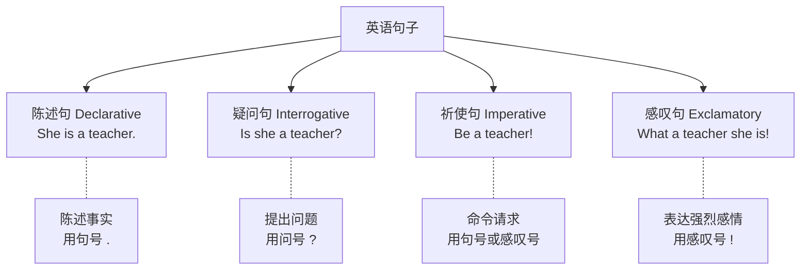
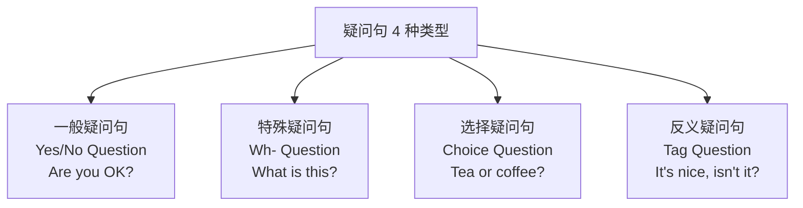
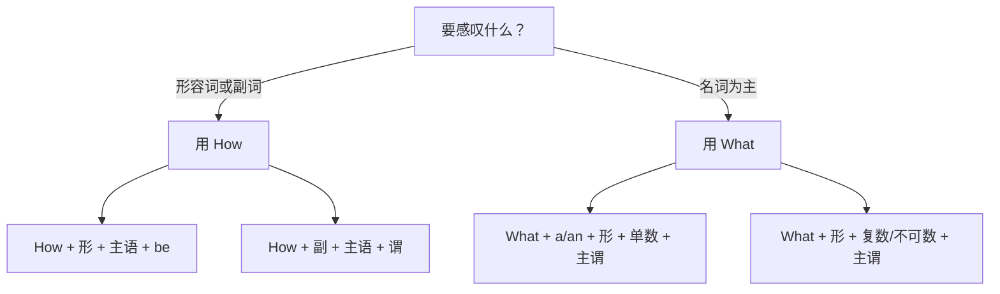

# 陈述疑问祈使感叹四大句式

> [!info] 本篇定位
> 上一篇讲的是"**骨架**"（五大句型），这一篇讲的是"**用骨架说不同功能的话**"。
>
> 同样一个意思"她是老师"，你可以用**四种方式**说出来：
>
> - 陈述：`She is a teacher.`（她是老师。）
> - 疑问：`Is she a teacher?`（她是老师吗？）
> - 祈使：`Be a teacher!`（当老师吧！）（极少见，但语法正确）
> - 感叹：`What a great teacher she is!`（她真是个好老师！）
>
> 本篇让你**掌握这四大句式的转换规则**，从而能**灵活表达任何意图**——提问、肯定、命令、感叹。

---

## 1. 本篇导读：句型 vs 句式

### 1.1 两个容易混淆的概念

| 概念 | 定义 | 维度 | 分类 |
| ---- | ---- | ---- | ---- |
| **句型** | 看**结构** | 主谓宾排列 | 5 种（SV/SVO/SVC/SVOO/SVOC）|
| **句式** | 看**功能** | 表达什么意图 | 4 种（陈述/疑问/祈使/感叹）|

**一个形象比喻**：
- **句型** = 汽车的**底盘**（骨架）
- **句式** = 汽车的**类型**（轿车/SUV/卡车——同一底盘可以造不同类型）

**关键理解**：任何一个句型（SV/SVO/SVC/SVOO/SVOC）都可以变成四种句式。

### 1.2 四大句式总览



### 1.3 四种句式的功能对比

| 句式 | 功能 | 语气 | 标点 | 典型使用场景 |
| ---- | ---- | ---- | ---- | ---- |
| 陈述 | 陈述事实 | 平静 | . | 描述、叙述、判断 |
| 疑问 | 获取信息 | 询问 | ? | 提问、确认、请求 |
| 祈使 | 发出指令 | 命令/请求 | . 或 ! | 命令、请求、建议 |
| 感叹 | 表达情感 | 强烈 | ! | 赞叹、惊讶、不满 |

---

## 2. 陈述句（Declarative Sentence）

### 2.1 陈述句是什么

**陈述句**：**陈述一个事实或观点**的句子，是英语中**最基础、最常用**的句式（占 70% 以上）。

**特点**：
- 语序：**主 + 谓 + 其他**（正常语序）
- 语调：**降调 ↘**
- 标点：**句号 .**

### 2.2 肯定陈述句（Positive Declarative）

**肯定陈述** = 表达"是/做"的句子。

```
主语 + 谓语 + 其他
I      am        a student.
She    loves     English.
They   went      home.
The book is      on the table.
```

### 2.3 否定陈述句（Negative Declarative）

**否定陈述** = 表达"不是/不做"的句子。

**构成公式**：根据句子里是否有"特殊动词"分两种情况。

**情况 1：有 be 动词 / 助动词 / 情态动词**

→ 直接在它们后面加 **not**

```
I am happy.        →  I am not happy.    (缩写：I'm not happy.)
She is a doctor.   →  She isn't a doctor.
They are here.     →  They aren't here.

He can swim.       →  He cannot swim. (缩写：He can't swim.)
You should go.     →  You shouldn't go.
I will come.       →  I won't come.

She has finished.  →  She hasn't finished.
They have eaten.   →  They haven't eaten.
```

**情况 2：只有实义动词**

→ 需要借助**助动词 do/does/did**，后面动词变回原形

```
I run every day.   →  I don't run every day.
She likes coffee.  →  She doesn't like coffee.
They played.       →  They didn't play.

He speaks English. →  He doesn't speak English.
                      (注意：加了 does，speaks 要变回 speak)
```

### 2.4 常用缩写形式（口语必备）

英语口语中，**否定几乎都用缩写**。

| 全写 | 缩写 | 全写 | 缩写 |
| ---- | ---- | ---- | ---- |
| is not | isn't | cannot | can't |
| are not | aren't | could not | couldn't |
| was not | wasn't | will not | won't |
| were not | weren't | would not | wouldn't |
| do not | don't | should not | shouldn't |
| does not | doesn't | might not | mightn't |
| did not | didn't | must not | mustn't |
| have not | haven't | have to not / don't have to | don't have to |

### 2.5 双重否定与含义

**双重否定**在英语中是**加强否定**，不是肯定（与中文逻辑一致）。

```
I don't know nothing.    (= I know nothing.) ← 加强
                         (但语法不严谨，正式场合避免)

正式：I don't know anything. / I know nothing.
```

> [!warning] 这个细节很重要
>
> 中文"不少"、"不无道理"是**双重否定表肯定**。但英语中"不知道没有东西"（don't know nothing）在**非正式、非标准**英语中通常被视为强调性的否定，正式语法中应避免。
>
> **结论**：
> - ✅ `I don't know anything.`（标准英语）
> - ✅ `I know nothing.`（标准英语）
> - ⚠️ `I don't know nothing.`（口语中存在，但不标准）

### 2.6 陈述句典型例句（20 个）

> [!success] 陈述句例句
>
> **肯定陈述**
> 1. `I am a programmer.`（我是一名程序员。）
> 2. `She works in Beijing.`（她在北京工作。）
> 3. `The sun rises in the east.`（太阳从东方升起。）
> 4. `We went to the park yesterday.`（我们昨天去了公园。）
> 5. `He has been studying for hours.`（他已经学习了好几个小时。）
> 6. `They will arrive tomorrow.`（他们明天到。）
> 7. `Time flies fast.`（时间过得很快。）
> 8. `The meeting starts at 10 AM.`（会议 10 点开始。）
> 9. `Reading books is my hobby.`（读书是我的爱好。）
> 10. `My mother cooks delicious food.`（我妈妈做饭很好吃。）
>
> **否定陈述**
> 11. `I don't like coffee.`（我不喜欢咖啡。）
> 12. `She isn't from China.`（她不是中国人。）
> 13. `He doesn't live here anymore.`（他不再住这儿了。）
> 14. `We didn't go to school yesterday.`（我们昨天没上学。）
> 15. `They haven't finished the project.`（他们还没完成项目。）
> 16. `I can't speak French.`（我不会说法语。）
> 17. `You shouldn't worry about it.`（你不该担心这件事。）
> 18. `The store isn't open on Sundays.`（商店周日不开。）
> 19. `I won't be late again.`（我不会再迟到了。）
> 20. `She didn't tell me the truth.`（她没告诉我真相。）

---

## 3. 疑问句（Interrogative Sentence）

疑问句是英语**最复杂**也**最重要**的句式。它有 **4 种不同形式**，每种都有自己的规则。

### 3.1 疑问句的 4 种类型总览



### 3.2 一般疑问句（Yes/No Question）

**用途**：问一个"**是或不是**"的问题，对方用 Yes/No 回答。

**构成公式**：**助动词/be动词/情态动词 + 主语 + 其他**

**情况 1：有 be 动词 / 助动词 / 情态动词**

→ **直接提到句首**

```
陈述：She is happy.           →  疑问：Is she happy?
陈述：They are students.       →  疑问：Are they students?
陈述：He was late.             →  疑问：Was he late?

陈述：You can swim.            →  疑问：Can you swim?
陈述：She will come.           →  疑问：Will she come?
陈述：We should leave.         →  疑问：Should we leave?

陈述：He has finished.         →  疑问：Has he finished?
陈述：They have eaten.         →  疑问：Have they eaten?
```

**情况 2：只有实义动词**

→ 句首加 **Do/Does/Did**，实义动词变回**原形**

```
陈述：I like apples.           →  疑问：Do I like apples?
陈述：She likes apples.        →  疑问：Does she like apples? (likes→like)
陈述：They played football.    →  疑问：Did they play football? (played→play)

陈述：He works in a bank.      →  疑问：Does he work in a bank?
陈述：We met yesterday.        →  疑问：Did we meet yesterday?
```

**回答方式**：

```
Q: Is she happy?
A: Yes, she is. / No, she isn't.

Q: Do you like coffee?
A: Yes, I do. / No, I don't.

Q: Can you swim?
A: Yes, I can. / No, I can't.
```

> [!tip] 回答小技巧
>
> **不要只答 Yes 或 No**，要用"Yes + 短句"或"No + 短句"。
>
> - ❌ `Yes.`（显得冷淡）
> - ✅ `Yes, I do.` / `Yes, I am.` / `Yes, I can.`
>
> 配合的助动词要和问句里的一致。

### 3.3 特殊疑问句（Wh- Question）

**用途**：问**具体信息**（谁、什么、哪里、什么时候、为什么、怎么）。

**9 个特殊疑问词**：

| 疑问词 | 意思 | 问什么 | 例句 |
| ---- | ---- | ---- | ---- |
| **what** | 什么 | 事物、事情 | What is this? |
| **who** | 谁 | 人（主语或宾语） | Who is he? |
| **whom** | 谁 | 人（宾语，较正式） | Whom did you see? |
| **whose** | 谁的 | 所属 | Whose book is this? |
| **which** | 哪个 | 有限选择 | Which do you like? |
| **where** | 哪里 | 地点 | Where are you? |
| **when** | 什么时候 | 时间 | When did he come? |
| **why** | 为什么 | 原因 | Why are you sad? |
| **how** | 怎样 | 方式、状态 | How are you? |

**构成公式**：**疑问词 + 一般疑问句结构**

```
一般疑问：   Is she happy?
特殊疑问：   Why is she happy?   (为什么她开心？)
                ↑ 在 Is she happy 前加疑问词 Why

一般疑问：   Do you like coffee?
特殊疑问：   When do you like coffee?   (你什么时候喜欢咖啡？)
```

**常见特殊疑问例句**：

```
What:    What is your name?               (你叫什么名字？)
         What do you do for a living?      (你做什么工作？)
         What time is it?                  (几点了？)

Who:     Who is your teacher?              (你的老师是谁？)
         Who called you yesterday?         (昨天谁打电话给你？)

Whose:   Whose phone is this?              (这是谁的手机？)

Which:   Which color do you prefer?        (你更喜欢哪个颜色？)

Where:   Where are you from?               (你来自哪里？)
         Where do you live?                (你住哪儿？)

When:    When is your birthday?            (你生日什么时候？)
         When did you arrive?              (你什么时候到的？)

Why:     Why are you late?                 (你为什么迟到？)
         Why do you like it?               (你为什么喜欢它？)

How:     How are you?                      (你好吗？)
         How do you do it?                 (你怎么做的？)
         How was your trip?                (你旅行怎么样？)
```

**特殊：how + 形容词/副词**

**how** 可以和形容词/副词组合，问**具体的量**：

```
how old       多大      How old are you?
how tall      多高      How tall is he?
how long      多长      How long is the road?
how far       多远      How far is it?
how much      多少（钱/不可数）   How much is this?
how many      多少（可数）        How many books do you have?
how often     多频繁     How often do you exercise?
how soon      多快（多久后）       How soon will you be here?
```

**回答方式**：特殊疑问**不能用 Yes/No 回答**，必须给具体信息。

```
Q: Where do you live?
A: I live in Beijing. / In Beijing.

Q: What time is it?
A: It's 3 o'clock. / 3 o'clock.
```

### 3.4 选择疑问句（Choice / Alternative Question）

**用途**：在**两个或多个选项**中让对方选择。

**构成公式**：**一般疑问句 + or + 选项**

```
Would you like tea or coffee?
(你想要茶还是咖啡？)

Do you want to stay or go?
(你想留下还是走？)

Is she a teacher or a doctor?
(她是老师还是医生？)

Are you coming today, tomorrow, or the day after?
(你今天、明天还是后天来？)
```

**语调特点**：
- 前面的选项用**升调 ↗**
- 最后一个选项用**降调 ↘**

```
Tea ↗ or coffee? ↘
```

**回答方式**：选择疑问**不能用 Yes/No**，必须说出选择。

```
Q: Tea or coffee?
✅ A: Tea, please. / Coffee.
❌ A: Yes. / No.   ← 错误！

Q: Do you want to stay or leave?
A: I'd like to stay. / I think I'll leave.
```

### 3.5 反义疑问句（Tag Question / Question Tag）

**用途**：**陈述 + 小尾巴**，用来**确认**或**征求认同**。

**构成公式**：**陈述句 + 助动词/be/情态 + 主语（代词）**

**关键规则**：**前肯后否 / 前否后肯**

```
前肯后否：
  You are happy, aren't you?           (你开心，是吧？)
  She can swim, can't she?             (她会游泳，对吧？)
  He has finished, hasn't he?          (他完成了，是吧？)
  They went there, didn't they?        (他们去了，对吗？)

前否后肯：
  You aren't happy, are you?           (你不开心，是吗？)
  She can't swim, can she?             (她不会游泳，对吗？)
  He hasn't finished, has he?          (他没完成，是吧？)
  They didn't go, did they?            (他们没去，对吗？)
```

**特殊情况**：

**1. I am → aren't I**（不对称）

```
I am late, aren't I?        (我迟到了，是吧？)
不用 amn't I（英语没这种缩写）
```

**2. Let's → shall we**

```
Let's go, shall we?         (我们走吧，好吗？)
```

**3. 祈使句尾 → will you / won't you**

```
Come here, will you?        (过来，好吗？)
Don't be late, will you?    (别迟到，好吗？)
```

**4. There be 句型 → there + 对应 be**

```
There is a book, isn't there?
There are some eggs, aren't there?
```

**语调规则**：

- **升调 ↗**：真的不确定，希望对方给答案
  - `You're tired, aren't you? ↗`（你累了吧？——真的在问）
- **降调 ↘**：已经确定，只求附和
  - `It's cold, isn't it? ↘`（天冷吧。——我很确定）

**回答方式**：按**事实**回答，不按问句的情感倾向。

```
Q: You like coffee, don't you?
如果你确实喜欢：Yes, I do.
如果你不喜欢：  No, I don't.
```

> [!warning] 反义疑问最大的坑：否定词的判断
>
> 含 **never, seldom, hardly, few, little, no, none** 等词的陈述句，**前半句算否定**，所以 tag 要用肯定。
>
> - `He never comes, does he?`（他从不来，是吗？——never 是否定词）
> - `She hardly speaks, does she?`（她几乎不说话，是吗？）
> - `There is no way, is there?`

---

## 4. 祈使句（Imperative Sentence）

### 4.1 祈使句是什么

**祈使句**：**发出命令、请求、建议、警告**的句子。

**特点**：
- **省略主语**（主语是 "you"，但不说）
- **动词用原形**
- 语调：**降调**（命令）或**升调**（礼貌请求）
- 标点：**句号**（一般）或**感叹号**（强烈）

### 4.2 肯定祈使句

**构成公式**：**动词原形 + 其他**

```
Open the door.          (开门。)
Come here.              (过来。)
Be quiet.               (安静。) ← be 动词也要用原形
Listen carefully.       (仔细听。)
Stand up!               (站起来！)
```

### 4.3 否定祈使句

**构成公式**：**Do not / Don't + 动词原形**

```
Don't move.             (别动。)
Don't be late.          (别迟到。) ← 注意：是 Don't be，不是 Be not
Don't worry.            (别担心。)
Don't touch this!       (别碰这个！)
Do not enter.           (禁止进入。——正式标识)
```

> [!warning] 常见错误：Be not
>
> ❌ `Be not late.`（中国学生常犯）
> ✅ `Don't be late.`
>
> **所有否定祈使都用 `Don't + 动词原形`**，即使是 be 动词。

### 4.4 礼貌化：加 please

**直接祈使** = 命令，显得粗鲁。**加 please** = 请求，更礼貌。

```
Open the window.              (开窗。——命令)
Please open the window.       (请开窗。——礼貌)
Open the window, please.      (请开窗。——同上，please 可放后面)
```

**更礼貌的升级**：

```
Please open the window.                       (礼貌)
Could you please open the window?             (更礼貌，用疑问句形式)
Would you mind opening the window?            (最礼貌)
I was wondering if you could open the window. (非常礼貌/正式)
```

### 4.5 包含第一人称的祈使：Let's

**Let's = Let us**（让我们）——用于**建议一起做某事**。

```
Let's go.                  (我们走吧。)
Let's have lunch.          (我们去吃午饭吧。)
Let's not argue.           (我们别争了。)  ← 否定形式
Let's start the meeting.   (开始会议吧。)
```

**Let's vs Let us**：

- `Let's` = 包括听者（我们一起）
- `Let us`（不缩写）= 不一定包括听者，常表"请允许我们"

```
Let's go.           (我们一起走吧。——对方也一起)
Let us go.          (请让我们走。——把我们和对方分开)
```

### 4.6 加强语气的祈使

**加 Do 强调**（非常强烈的请求）：

```
Do be quiet!        (真的请安静！——带感情)
Do come in!         (快进来！)
Do try this!        (一定要试试这个！)
```

**加 Never 强调禁止**：

```
Never give up!              (永不放弃！)
Never lie to me again.      (再也不要对我说谎。)
Never talk to strangers.    (永远不要和陌生人说话。)
```

### 4.7 祈使句典型例句（20 个）

> [!success] 祈使句例句
>
> **日常指令**
> 1. `Open the door.`（开门。）
> 2. `Close the window.`（关窗。）
> 3. `Sit down.`（坐下。）
> 4. `Stand up.`（站起。）
> 5. `Come in.`（请进。）
>
> **礼貌请求**
> 6. `Please pass me the salt.`（请把盐递给我。）
> 7. `Could you help me, please?`（能帮我一下吗？）
> 8. `Be careful, please.`（请小心。）
> 9. `Hold the line, please.`（请稍等。）
> 10. `Have a seat.`（请坐。）
>
> **否定祈使**
> 11. `Don't be shy.`（别害羞。）
> 12. `Don't worry about it.`（别担心。）
> 13. `Don't forget your keys.`（别忘了钥匙。）
> 14. `Don't touch that!`（别碰那个！）
> 15. `Never lie to me.`（永远别对我撒谎。）
>
> **建议/邀请**
> 16. `Let's go out tonight.`（我们今晚出去吧。）
> 17. `Let's have a party.`（我们办个聚会吧。）
> 18. `Let's not fight.`（我们别吵了。）
> 19. `Take your time.`（别急。）
> 20. `Enjoy your meal.`（请慢用。）

### 4.8 祈使句的常见陷阱

> [!warning] 易错点 1：祈使句忘记用动词原形
>
> 所有祈使句的动词**都是原形**，不管主语是什么。
>
> - ❌ `Opens the door.` → ✅ `Open the door.`
> - ❌ `Is quiet.` → ✅ `Be quiet.`

> [!warning] 易错点 2：please 的位置
>
> `please` 可放**句首、句尾**，**不要放中间**。
>
> - ✅ `Please sit down.`
> - ✅ `Sit down, please.`
> - ❌ `Sit please down.`

---

## 5. 感叹句（Exclamatory Sentence）

### 5.1 感叹句是什么

**感叹句**：**表达强烈感情**（惊讶、赞美、不满、激动）的句子。

**特点**：
- 通常以 **How / What** 开头
- **语气强烈**
- 标点：**感叹号 !**

### 5.2 How 感叹句

**构成公式**：**How + 形容词/副词 + 主语 + 谓语 !**

**公式 1：How + 形容词 + 主语 + be动词**

```
How beautiful she is!           (她真美！)
How cold it is today!           (今天真冷！)
How interesting this book is!   (这本书真有趣！)
```

**公式 2：How + 副词 + 主语 + 谓语**

```
How fast he runs!              (他跑得真快！)
How well she sings!            (她唱得真好！)
How carefully he listens!      (他听得真仔细！)
```

**公式 3：How + 主语 + 谓语**（简洁感叹）

```
How I miss you!               (我多么想你！)
How time flies!               (时间过得真快！)
How we love this song!        (我们多么爱这首歌！)
```

**简化感叹**：口语中可只说 `How + 形容词/副词!`

```
How beautiful!      (真美！)
How cute!           (真可爱！)
How lovely!         (真可爱！)
How amazing!        (真神奇！)
```

### 5.3 What 感叹句

**构成公式**：**What + (a/an) + 形容词 + 名词 + 主语 + 谓语 !**

**可数名词单数**：**What + a/an + 形容词 + 名词**

```
What a beautiful day it is!        (多么美好的一天！)
What an interesting book this is!  (多有趣的一本书！)
What a clever girl she is!         (多聪明的女孩！)
What a shame (it is)!              (真可惜！)
```

**可数名词复数 / 不可数名词**：**What + 形容词 + 名词**（不加 a/an）

```
What beautiful flowers these are!    (多美的花！)
What good ideas you have!            (你的想法真好！)
What nice weather we have today!     (今天天气真好！)
What bad news!                       (多糟糕的消息！)
```

**简化感叹**：口语中可只说 `What + (a/an) + 形容词 + 名词!`

```
What a day!           (真是糟糕/精彩的一天！)
What a surprise!      (真是惊喜！)
What a mess!          (真是一团糟！)
What nonsense!        (真荒唐！)
```

### 5.4 How vs What 对比



**同一个意思，两种表达**：

```
How beautiful the flower is!   = What a beautiful flower it is!
How interesting the book is!   = What an interesting book it is!
How nice the weather is!       = What nice weather it is!
How clever the boys are!       = What clever boys they are!
```

**判断方法**：句子的"重点"在形容词 → How；在名词 → What

### 5.5 其他感叹形式

**so/such 感叹**：

```
He is so tall!                 (他真高！)
She is so beautiful!           (她真漂亮！)
It is such a nice day!         (真是美好的一天！)
They are such kind people!     (他们真是好人！)
```

**直接陈述 + !**：

```
You're crazy!                  (你疯了！)
I love it!                     (我爱死它了！)
That's amazing!                (太神奇了！)
I can't believe it!            (难以置信！)
```

**疑问式感叹**：

```
Isn't she beautiful!           (她不是很美吗！)
Isn't it cold today!           (今天不是很冷吗！)
```

（注意：形式是疑问句，但语气是感叹，用感叹号或感叹语调）

### 5.6 感叹句典型例句（20 个）

> [!success] 感叹句例句
>
> **How 感叹**
> 1. `How beautiful the sunset is!`（夕阳多美啊！）
> 2. `How cold it is today!`（今天真冷！）
> 3. `How cute your puppy is!`（你的小狗真可爱！）
> 4. `How fast time flies!`（时间过得真快！）
> 5. `How kind of you to help!`（你真好心来帮忙！）
>
> **What 感叹（单数）**
> 6. `What a lovely day!`（多美好的一天！）
> 7. `What a clever idea!`（多聪明的主意！）
> 8. `What an amazing movie!`（多精彩的电影！）
> 9. `What a shame!`（真可惜！）
> 10. `What a coincidence!`（真巧！）
>
> **What 感叹（复数/不可数）**
> 11. `What beautiful eyes you have!`（你的眼睛真美！）
> 12. `What good students they are!`（他们真是好学生！）
> 13. `What bad luck!`（真倒霉！）
> 14. `What fun we had!`（我们玩得真开心！）
> 15. `What nonsense you talk!`（你说的真荒唐！）
>
> **So / such 感叹**
> 16. `You're so smart!`（你真聪明！）
> 17. `I'm so tired!`（我太累了！）
> 18. `It's such a beautiful day!`（真是美好的一天！）
> 19. `They're such nice people!`（他们真是好人！）
> 20. `I can't believe it!`（难以置信！）

---

## 6. 四大句式全面对比

### 6.1 用同一个核心意思变换四种句式

看看"**她很美**"这个核心意思的 4 种表达：

```
陈述：She is beautiful.              (她很美。)
疑问：Is she beautiful?              (她美吗？)
祈使：Be beautiful. (一般不这么用)
感叹：How beautiful she is!          (她真美！)
感叹：What a beautiful woman she is! (她真是个美人！)
```

### 6.2 四大句式对比表

| 句式 | 主语 | 动词 | 标点 | 语调 | 例子 |
| ---- | ---- | ---- | ---- | ---- | ---- |
| 陈述（肯定）| 必有 | 按时态 | . | ↘ | `She is happy.` |
| 陈述（否定）| 必有 | 加 not | . | ↘ | `She isn't happy.` |
| 一般疑问 | 必有，放动词后 | 前置 | ? | ↗ | `Is she happy?` |
| 特殊疑问 | 必有 | 疑问词+前置 | ? | ↘（多数）| `Why is she happy?` |
| 选择疑问 | 必有 | 前置 | ? | 前↗后↘ | `Tea or coffee?` |
| 反义疑问 | 必有 | 陈述+tag | ? | ↗ 或 ↘ | `She's happy, isn't she?` |
| 祈使 | 省略（you）| 原形 | . 或 ! | ↘ | `Be happy.` |
| How 感叹 | 必有 | 按时态 | ! | ↘ | `How happy she is!` |
| What 感叹 | 必有 | 按时态 | ! | ↘ | `What a happy girl!` |

---

## 7. 场景实战：一段完整对话看四大句式

**场景**：朋友重逢

```
Tom:   "Wow, is that you, Mary?"                         [一般疑问]
Mary:  "Yes, it's me! How are you?"                      [特殊疑问]
Tom:   "I'm great! What a surprise to see you here!"     [What 感叹]
Mary:  "I know, right? How long has it been?"            [特殊疑问]
Tom:   "At least five years!"                            [陈述]
Mary:  "Time flies, doesn't it?"                         [反义疑问]
Tom:   "It really does. Are you still living in Beijing,
        or did you move?"                                [选择疑问]
Mary:  "I moved to Shanghai last year."                  [陈述]
Tom:   "No way! How did I not know this?"                [特殊疑问]
Mary:  "Don't worry, we haven't been in touch."          [否定祈使 + 陈述]
Tom:   "Let's catch up over coffee!"                     [Let's 祈使]
Mary:  "Good idea! How about tomorrow?"                  [特殊疑问]
Tom:   "Perfect! Bring your husband too."                [祈使]
Mary:  "Sure. I'm so excited to see you again!"          [陈述 + 感叹]
```

**句式统计**：
- 陈述：5 句
- 一般疑问：1 句
- 特殊疑问：4 句
- 选择疑问：1 句
- 反义疑问：1 句
- 祈使：3 句
- 感叹：1 句

> [!tip] 观察
>
> 真实对话中，**四种句式交替使用**——陈述事实、问问题、发出请求、表达情绪全都融合在一起。学会灵活切换，是流利表达的核心。

---

## 8. 特殊疑问的 3 个进阶技巧

### 8.1 谁做主语 vs 谁做宾语

**当 who/what 做主语时**，**不需要助动词**，按陈述句语序：

```
Who made this cake?          (谁做的这蛋糕？——who 是主语)
                             ✅ 不用 Who did make this cake

What happened?               (发生了什么？——what 是主语)
                             ✅ 不用 What did happen
```

**当 who/what 做宾语时**，按一般疑问结构：

```
Who did you see?             (你看见了谁？——who 是宾语)
What did he say?             (他说了什么？——what 是宾语)
```

### 8.2 疑问词 + 介词（正式 vs 口语）

**正式（介词提前）**：

```
With whom did you go?        (你和谁去的？)
About what are you talking?  (你在谈什么？)
```

**口语（介词后置）**：

```
Who did you go with?         (更自然的说法)
What are you talking about?
```

### 8.3 间接疑问句（引用疑问）

当疑问句**嵌入到另一个句子**中时，**要变回陈述语序**：

```
直接：Where is she?
间接：I don't know where she is.     (不是 where is she)

直接：What did he say?
间接：Tell me what he said.           (不是 what did he say)

直接：Is she happy?
间接：I wonder if she is happy.       (用 if 或 whether)
```

---

## 9. 练习与输出建议

> [!success] 本篇练习清单
>
> **陈述↔疑问转换（必做）**
>
> 1. 把下列陈述句改成 4 种疑问句（Yes/No、特殊、反义、选择）：
>    - `She lives in New York.`
>    - `Tom likes pizza.`
>    - `They are coming tomorrow.`
>
> **特殊疑问造句**
>
> 2. 针对下列答句，造**特殊疑问句**：
>    - 答：`I am from Beijing.`    → 问：?
>    - 答：`I live with my parents.` → 问：?
>    - 答：`I had lunch at 12.`     → 问：?
>    - 答：`I go to the gym twice a week.` → 问：?
>    - 答：`I like chocolate cake.` → 问：?
>
> **祈使 & 感叹练习**
>
> 3. 把下列陈述句**改为祈使**：
>    - `You should be quiet.`  → ?
>    - `You must not be late.` → ?
>
> 4. 把下列陈述句**改为感叹（两种方式：How / What）**：
>    - `She is very smart.`     → ?
>    - `This is a lovely dog.`  → ?
>
> **场景输出**
>
> 5. 写一段 10 句话的对话，**4 种句式都用到**，描述你今天发生的事。
>
> 6. 用 AI 做一次角色扮演：假装你和朋友重逢，刻意使用 4 种句式。

### 9.1 练习参考答案

**练习 1**（以第一句为例）：

- Yes/No：`Does she live in New York?`
- 特殊：`Where does she live?`
- 反义：`She lives in New York, doesn't she?`
- 选择：`Does she live in New York or Los Angeles?`

**练习 2**：

- `Where are you from?`
- `Who do you live with?`
- `When did you have lunch?` / `What time did you have lunch?`
- `How often do you go to the gym?`
- `What kind of cake do you like?` / `What do you like?`

**练习 3**：

- `Be quiet.`
- `Don't be late.`

**练习 4**：

- `How smart she is! / What a smart girl she is!`
- `How lovely the dog is! / What a lovely dog this is!`

---

## 10. 本篇小结

> [!success] 本篇核心要点回顾
>
> **四大句式功能对比**：
> - 陈述：陈述事实（.）
> - 疑问：获取信息（?）
> - 祈使：发出指令（. 或 !）
> - 感叹：表达感情（!）
>
> **陈述句**：正常语序；否定加 not 或 don't/doesn't/didn't
>
> **疑问句 4 种**：
> - 一般疑问：助动词/be/情态 + 主语 + ...?
> - 特殊疑问：疑问词 + 一般疑问结构
> - 选择疑问：...X or Y?
> - 反义疑问：前肯后否 / 前否后肯
>
> **祈使句**：省主语 + 动词原形；否定用 Don't
>
> **感叹句**：
> - How + 形/副 + 主 + 谓
> - What + (a/an) + 形 + 名 + 主 + 谓
>
> **高频陷阱**：
> - Be not → Don't be
> - who 作主语不用助动词
> - 反义疑问看否定词（never, seldom, hardly）
> - 间接疑问句用陈述语序

### 10.1 下一篇预告

> [!info] 下一篇：03.there be 与 it 句型完全手册
>
> 下一篇讲两个**非常重要但特殊**的句型：
>
> - **There be 句型**（存在句）：`There is a book on the desk.`——表示"存在、有"
> - **It 句型**：
>   - 天气：`It is raining.`
>   - 时间：`It is 3 o'clock.`
>   - 距离：`It is 5 miles from here.`
>   - 形式主语：`It is important to learn English.`
>   - 强调句：`It was John who broke the window.`
>
> 这两个句型**中文里没有对应结构**，是中国学生**最容易出错**的地方。下一篇会把它们讲透。
