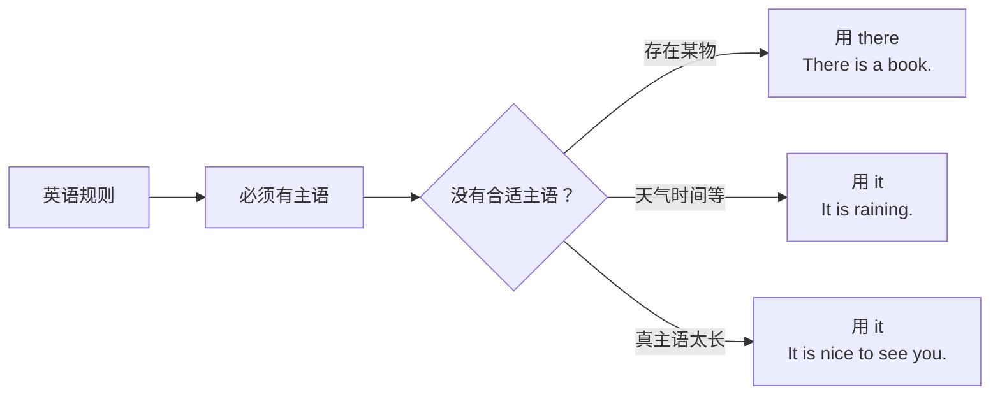
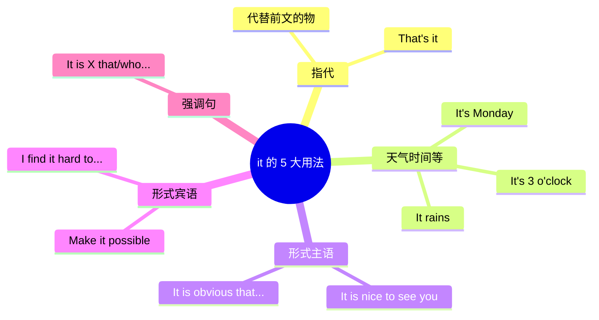

# there be 与 it 句型完全手册

> [!info] 本篇定位
> 这两个句型是**中国学生最容易出错**的句型，也是**日常使用频率最高**的句型之一。
>
> 为什么容易错？因为**中文里没有对应结构**——
>
> - 中文说"桌上有本书"，会直译成 ❌ `Desk has a book.`（大错特错）
> - 中文说"下雨了"，会直译成 ❌ `Rained.` 或 ❌ `The sky rains.`（都不对）
>
> 正确说法是：
> - ✅ `There is a book on the desk.`（**there be** 句型）
> - ✅ `It is raining.`（**it** 句型）
>
> 这两个句型必须**按英语规则学**，不能硬套中文。本篇把它们所有用法讲透。

---

## 1. 本篇导读：为什么要单独讲这两个句型

### 1.1 两大"伪主语"句型

这两个句型有个共同特点：**there** 和 **it** 都是"**伪主语**"（或叫"形式主语"）——它们不代表真正的主体，只是占据主语位置，让句子符合英语的"必须有主语"规则。



### 1.2 本篇学习路径

- **Part 1**：彻底搞懂 **there be** 句型（6 种变化）
- **Part 2**：彻底搞懂 **it** 的 5 大用法
- **Part 3**：两者对比与场景应用

---

# Part 1：There be 句型全解

## 2. 什么是 there be 句型

### 2.1 基本概念

**there be 句型** = 表示"**某处存在某物**"的特殊句型。

**核心含义**：**"（某地）有……"**

**最简公式**：

```
There + be + 名词 + 状语（通常是地点/时间）
有些        存在某物      在某处
```

**经典例句**：

```
There is a book on the desk.      (桌上有本书。)
There are two cats in the room.   (房间里有两只猫。)
There was a party last night.     (昨晚有个派对。)
There will be a meeting tomorrow. (明天会有个会议。)
```

### 2.2 There be 句型的本质

> [!tip] 语法本质：变种 SVC 句型
>
> 严格说，there be 句型是 **SVC 句型的变种**——
>
> - 正常 SVC：`A book is on the desk.`（一本书在桌上。——强调"这本书"）
> - there be：`There is a book on the desk.`（桌上有本书。——强调"存在"）
>
> **两种说法意思相近，但侧重点不同**：
> - 正常 SVC：已知某物的位置
> - there be：**引入新信息**（听者还不知道有这个东西）

### 2.3 there 不是"那里"

> [!warning] 最大的坑：here's a book 里的 there 不是"那里"
>
> 中国学生常把 `there` 翻译成"那里"，结果：
> - 看到 `There is a book on the desk.` 翻成"**那里**桌上有本书"（怪怪的）
>
> **真相**：这里的 `there` **没有实际意思**，只是**语法占位符**，可以不翻译。
>
> 要表示"那里有"，要说 `There is a book there.`（第一个 there 是占位符，第二个 there 才是"那里"）

---

## 3. There be 句型的 6 种变化

### 3.1 变化 1：be 动词的人称和数

**there be 后面的 be 动词，要与紧跟的第一个名词一致**。

```
There is a book.         (book 单数 → is)
There are two books.     (books 复数 → are)

There is some water.     (water 不可数 → is)
There are some apples.   (apples 复数 → are)
```

**"就近原则"**：当 there be 后面有多个并列名词时，be 动词与**最靠近的名词**一致。

```
There is a pen and two books on the desk.
       ↑ 最靠近 a pen，用 is

There are two books and a pen on the desk.
        ↑ 最靠近 two books，用 are
```

### 3.2 变化 2：时态变化

**there be 可以用各种时态**，只需改变 be 动词。

| 时态 | 形式 | 例句 |
| ---- | ---- | ---- |
| 一般现在 | there is / are | There is a cat. |
| 一般过去 | there was / were | There was a cat. |
| 一般将来 | there will be | There will be a party. |
| 一般将来（be going to）| there is going to be | There is going to be a storm. |
| 现在完成 | there has been / have been | There has been an accident. |
| 过去完成 | there had been | There had been a meeting before. |
| 现在进行 | there is being（极少）| There is being a fuss. |
| 情态动词 | there + 情态 + be | There might be a problem. |

**典型例句**：

```
There is an apple.              (现在：有一个苹果。)
There was a party.              (过去：有过一个派对。)
There will be snow.             (将来：会下雪。)
There has been much change.     (完成：发生了很多变化。)
There might be a solution.      (可能：可能有个解决方案。)
There should be more effort.    (应该：应该有更多努力。)
```

### 3.3 变化 3：否定

**在 be 动词/情态动词后加 not**：

```
There is a book.         →  There isn't a book.  (没有书。)
There are cars.          →  There aren't cars.   (没有车。)
There was snow.          →  There wasn't snow.   (没下雪。)
There will be a meeting. →  There won't be a meeting. (不会有会议。)
There has been an error. →  There hasn't been an error.
```

**也可用 no 直接否定名词**（更简洁）：

```
There are no cars.       (一辆车都没有。)
There is no time.        (没有时间。)
There was no one here.   (这里没人。)
```

### 3.4 变化 4：疑问

**把 be 动词/助动词提到 there 前面**：

```
一般疑问：
There is a book.          →  Is there a book?           (有书吗？)
There are students.       →  Are there students?        (有学生吗？)
There was a fire.         →  Was there a fire?          (发生火灾了吗？)
There will be a party.    →  Will there be a party?     (会有派对吗？)
There has been an issue.  →  Has there been an issue?   (出问题了吗？)
```

**回答方式**：

```
Q: Is there a book on the desk?
A: Yes, there is. / No, there isn't.

Q: Are there any students in the room?
A: Yes, there are. / No, there aren't.
```

**特殊疑问**：

```
How many students are there?              (有多少学生？)
What is there in the box?                 (盒子里有什么？)
How much milk is there?                   (有多少牛奶？)
Why is there no answer?                   (为什么没有回答？)
```

### 3.5 变化 5：状语的位置

there be 后面**常跟状语**（地点/时间），位置可变。

**地点状语**：通常在最后。

```
There is a cat on the sofa.
There are three people in the room.
There was a beautiful sunset yesterday.
```

**时间状语**：可在最后或句首。

```
There will be a meeting tomorrow.       (时间在最后)
Tomorrow, there will be a meeting.      (时间在句首，更强调)
```

**同时有时间和地点**：通常**地点在前，时间在后**。

```
There is going to be a concert in the park tomorrow.
                               [地点]       [时间]
```

### 3.6 变化 6：不定代词做主体

there be 后面常跟 **some/any/no/much/many/a lot of** 等不定代词或量词。

```
There is some water in the cup.        (杯子里有些水。)
There isn't any milk left.             (没剩牛奶了。)
There is no time to waste.             (没时间可以浪费。)
There are a few people outside.        (外面有几个人。)
There is much to learn.                (有很多要学的。)
```

**some vs any**：

- **some** 用于**肯定句**和**请求/邀请的疑问句**
- **any** 用于**否定句**和**疑问句**

```
There are some books on the desk.       (肯定：有一些书。)
Are there any books on the desk?        (疑问：有书吗？)
There aren't any books on the desk.     (否定：没有书。)

特例（邀请/请求）：
Would you like some coffee?             (用 some 因为是邀请)
```

---

## 4. There be 句型的典型例句（25 个）

> [!success] There be 例句精选
>
> **描述场所**
> 1. `There is a park near my house.`（我家附近有个公园。）
> 2. `There are many shops on this street.`（这条街上有很多商店。）
> 3. `There is a problem with the computer.`（电脑出了问题。）
> 4. `There are two bedrooms in the apartment.`（公寓里有两间卧室。）
> 5. `There is a beautiful view from here.`（从这里可以看到美丽的景色。）
>
> **描述时间/事件**
> 6. `There was a big storm last night.`（昨晚有场大风暴。）
> 7. `There will be a concert this weekend.`（这个周末有场音乐会。）
> 8. `There has been a lot of rain recently.`（最近下了很多雨。）
> 9. `There is a chance it will snow tomorrow.`（明天可能下雪。）
> 10. `There used to be a school here.`（这里曾经有个学校。）
>
> **抽象概念**
> 11. `There is no doubt about it.`（毫无疑问。）
> 12. `There is always hope.`（永远有希望。）
> 13. `There are many ways to learn English.`（学英语有很多方法。）
> 14. `There is too much noise.`（太吵了。）
> 15. `There is something strange.`（有些奇怪。）
>
> **疑问**
> 16. `Is there anyone here?`（这里有人吗？）
> 17. `Are there any questions?`（有什么问题吗？）
> 18. `How many people are there in your family?`（你家有几口人？）
> 19. `Was there a meeting yesterday?`（昨天开会了吗？）
> 20. `Will there be a problem?`（会有问题吗？）
>
> **否定**
> 21. `There isn't enough time.`（时间不够。）
> 22. `There aren't any eggs left.`（没剩鸡蛋了。）
> 23. `There has been no news.`（没有消息。）
> 24. `There was no one at home.`（家里没人。）
> 25. `There won't be any issues.`（不会有问题的。）

---

## 5. There be vs have：中国学生的第一大坑

### 5.1 表达"有"的两种方式

中文里的"有"对应**两种英语表达**：

- **there be**：表示"**存在**"（某处有某物）
- **have**：表示"**拥有**"（某人有某物）

**对比**：

```
中文：桌上有本书。
英文：There is a book on the desk.        (存在：桌上有本书)
✗ 错： The desk has a book.               (除非把桌子当成会拥有东西的主体)

中文：我有一辆车。
英文：I have a car.                       (拥有：我拥有一辆车)
✗ 错： There is a car of mine.            (英语中不这么说)
```

### 5.2 判断方法

| 情境 | 用哪个 |
| ---- | ---- |
| 某地方有某物（无主人）| **there be** |
| 某人/某组织拥有某物 | **have** |

```
There are 4 seasons.              (存在 4 个季节。)
He has a big family.              (他有一个大家庭。)

There is a book on the desk.      (存在：桌上有书)
I have a book.                    (拥有：我有书)

There is hope.                    (存在希望)
I have hope.                      (我怀有希望)
```

### 5.3 中式英语示例

> [!warning] 典型中式英语翻译错误
>
> ❌ `My room has a window.` （中式：我的房间有窗户）
> ✅ `There is a window in my room.`
>
> ❌ `China has a long history.` （中式：中国有悠久的历史）
> ✅ `China has a long history.` （这个实际上正确！因为把"中国"当作主体）
> 或：`There is a long history in China.`
>
> ❌ `The city has many buildings.` （模棱两可）
> ✅ `There are many buildings in the city.` （更地道）

**实际上**：当主语是**国家、城市、组织**等**大型主体**时，两种表达都可以。但**具体的物品位置**，必须用 there be。

---

## 6. There be 特殊变体

### 6.1 There + 其他动词（文艺/正式）

除了 be，there 还可以接一些**表示存在/发生**的动词：

```
There stands a tall tree.          (有一棵高大的树矗立着。)
There lived a king long ago.       (很久以前住着一位国王。)
There came a knock on the door.    (传来一声敲门声。)
There appeared a stranger.         (出现了一个陌生人。)
There exist many theories.         (存在许多理论。)
```

**常见动词**：stand, live, come, appear, exist, remain, lie, seem

这类句子**多见于文学作品**，日常口语用得少。

### 6.2 There seems/appears to be

表示"似乎有/看来有"：

```
There seems to be a problem.        (似乎有个问题。)
There appears to be no solution.    (看来没有解决办法。)
There seemed to be nobody home.     (好像家里没人。)
```

### 6.3 There is no point / use / need...

**固定表达**：

```
There is no point (in) arguing.     (争论没意义。)
There is no use crying.             (哭没有用。)
There is no need to worry.          (没必要担心。)
There is no way to know.            (没办法知道。)
There is no denying it.             (无可否认。)
```

---

# Part 2：It 句型全解

## 7. It 的 5 大用法

### 7.1 用法总览

**it** 在英语中**极其高频**，但它的用法有 **5 种**，很多中国学生只会其中一两种：



### 7.2 用法 1：指代（代词 it）

最基础的用法：it 代替前面提到的**单数事物或动物**。

```
I have a cat. It is very cute.          (it = the cat)
This is my phone. I love it.            (it = the phone)
The book is on the desk. Pass it to me. (it = the book)
```

**it 作代词的特点**：
- 代替**单数、非人**
- 性别：中性（人用 he/she，动物视亲密度）

> [!tip] it 也可指代上文的一件事
>
> ```
> He failed the exam. It was sad.    (it = 他考试没及格这件事)
> She lied to me. I can't forgive it.  (it = 她撒谎这件事)
> ```

---

## 8. 用法 2：表示天气、时间、日期、距离、环境

这是**中国学生最易错**的用法。**it 作虚主语，没有实际意义**。

### 8.1 天气

**中文**："下雨了。"（没主语）
**英文**：`It is raining.`（必须有主语，用 it）

```
It is raining.          (下雨了。)
It is snowing.          (下雪了。)
It's sunny today.       (今天晴天。)
It's cloudy.            (多云。)
It's windy.             (风大。)
It's foggy.             (有雾。)
It's cold / hot / warm. (冷/热/暖。)
```

**提问**：

```
What's the weather like today?    (今天天气怎么样？)
How is the weather?               (天气如何？)
Is it raining?                    (下雨了吗？)
```

### 8.2 时间

```
It's 3 o'clock.                   (3 点了。)
It's half past ten.               (10 点半。)
It's quarter to five.             (差一刻 5 点。)
It's time for dinner.             (该吃晚饭了。)
It's about time you left.         (你该走了。)
```

**提问**：

```
What time is it?                  (几点了？)
What time is it now?
What's the time?
```

### 8.3 日期 / 星期 / 月份 / 年份

```
It's Monday today.                (今天周一。)
It's April 20th.                  (今天 4 月 20 号。)
It's 2026.                        (现在是 2026 年。)
It's winter.                      (现在是冬天。)
It's my birthday!                 (今天我生日！)
```

### 8.4 距离

```
It's 5 kilometers to the park.    (到公园 5 公里。)
It's far from here.               (离这里很远。)
It's only 10 minutes away.        (只有 10 分钟路程。)
How far is it from here to there? (从这到那有多远？)
```

### 8.5 环境 / 氛围

```
It's noisy in here.               (这里很吵。)
It's quiet.                       (很安静。)
It's crowded.                     (很拥挤。)
It's beautiful here.              (这里很美。)
```

### 8.6 小结：it 的"万能虚主语"功能

> [!tip] 口诀：天气时间不用怕，it 做主语就搞定
>
> 只要表达**天气、时间、日期、距离、环境**，**一律用 it 做主语**。
>
> - ❌ `Today is rain.` → ✅ `It's raining today.`
> - ❌ `Now is 3 o'clock.` → ✅ `It is 3 o'clock now.`
> - ❌ `Here is crowded.` → ✅ `It's crowded here.`

---

## 9. 用法 3：形式主语（最重要！）

### 9.1 什么是形式主语

**当真正的主语是一个长句子或不定式/从句时**，为了避免句子"头重脚轻"，英语把 **it** 放在前面做**假主语**，**真主语**放在后面。

```
真正结构：
  [To learn English] is important.    (学英语很重要。)
  [That he lied] is obvious.          (他撒谎很明显。)

更自然的结构：
  It is important to learn English.
  It is obvious that he lied.
```

**对比**：

```
不自然：To see you again makes me happy.    (原主语太长)
自然：  It makes me happy to see you again.  (用 it 占位)
```

### 9.2 形式主语的 3 大结构

**结构 1：It is + adj. + to do...**

真主语是**不定式**。

```
It is important to learn English.    (学英语很重要。)
It is easy to make mistakes.         (犯错很容易。)
It is nice to see you.               (见到你很高兴。)
It is hard to say no.                (很难拒绝。)
It is dangerous to smoke.            (吸烟很危险。)
It is fun to travel.                 (旅行很有趣。)
```

**结构 2：It is + adj. + that 从句**

真主语是**that 从句**。

```
It is obvious that he lied.          (很明显他撒谎了。)
It is clear that we need help.       (很明显我们需要帮助。)
It is true that money can't buy happiness.
                                     (金钱买不到幸福是真的。)
It is a pity that you can't come.    (很遗憾你不能来。)
It is amazing that she won.          (她赢了真是惊人。)
```

**结构 3：It is + n. + to do... / that...**

it + 系动词 + **名词** + 真主语。

```
It is a pleasure to meet you.        (见到您很荣幸。)
It is a shame that you left.         (你走了真可惜。)
It is my dream to travel the world.  (环游世界是我的梦。)
It is a fact that the earth is round. (地球是圆的是事实。)
```

### 9.3 形式主语常用形容词

**正面评价**：
```
nice, great, wonderful, amazing, interesting, fun, easy, important, useful, helpful
```

**负面评价**：
```
hard, difficult, dangerous, risky, foolish, silly, rude
```

**程度描述**：
```
possible, impossible, likely, unlikely, true, false, obvious, clear
```

**经典搭配**：

```
It is nice of you to help me.         (你来帮我真好。)
It is kind of you to say so.          (你这么说真客气。)
It is foolish of him to believe that. (他居然相信那个真蠢。)
```

**注意**：`of + 某人` 用于表达**对某人的评价**；`for + 某人` 用于表达**对某人来说**的状态。

```
It is nice of you to help.       (你真好 —— of，评价人)
It is hard for me to learn this. (对我来说难 —— for，状态)
```

### 9.4 形式主语的疑问和否定

**疑问**：

```
Is it important to learn English?    (学英语重要吗？)
Was it fun to play there?            (在那玩有意思吗？)
Is it true that she quit?            (她辞职了是真的吗？)
```

**否定**：

```
It is not easy to learn Chinese.
It is not a good idea to stay up late.
```

### 9.5 形式主语的典型例句（15 个）

> [!success] 形式主语例句
>
> 1. `It is easy to say "I love you".`（说"我爱你"很容易。）
> 2. `It is hard to find a good job.`（找好工作很难。）
> 3. `It is fun to hang out with friends.`（和朋友玩很有意思。）
> 4. `It is important to be honest.`（诚实很重要。）
> 5. `It is boring to sit here all day.`（整天坐这儿很无聊。）
> 6. `It is obvious that he's lying.`（他在撒谎很明显。）
> 7. `It is clear that we need a plan.`（我们需要计划是很清楚的。）
> 8. `It is true that practice makes perfect.`（熟能生巧是真的。）
> 9. `It is a pity that it's raining.`（下雨真可惜。）
> 10. `It is amazing how fast time flies.`（时间过得真快。）
> 11. `It is nice of you to help.`（你来帮我真好。）
> 12. `It is my pleasure to assist you.`（帮您是我的荣幸。）
> 13. `It is dangerous for kids to play there.`（对孩子来说在那玩危险。）
> 14. `Is it OK if I leave early?`（我早走可以吗？）
> 15. `It is not wise to make quick decisions.`（快速做决定不明智。）

---

## 10. 用法 4：形式宾语

### 10.1 什么是形式宾语

**当动词的真正宾语是长句子时**，用 **it** 做**假宾语**，真宾语放后面。

**典型结构**：**动词 + it + 宾补 + 真宾语（to do / that 从句）**

```
不自然：I find to learn English hard.
自然：  I find it hard to learn English.
        ↑ it 是假宾语，to learn English 是真宾语
```

### 10.2 常见的形式宾语结构

**结构 1：find / think / consider + it + 形容词 + to do / that 从句**

```
I find it easy to make friends.         (我觉得交朋友容易。)
I think it important to be kind.        (我觉得善良很重要。)
We consider it necessary to change.     (我们认为有必要改变。)
I think it a pity that you can't come.  (我觉得你不能来真可惜。)
```

**结构 2：make + it + 形容词 + to do**

```
She made it clear that she was leaving. (她明确表示她要走。)
Make it easy for him to help.           (让他容易来帮忙。)
Technology makes it possible to work from anywhere.
                                        (科技让远程工作成为可能。)
```

**结构 3：take / owe + it + to do**

```
I take it for granted that he'll come.  (我理所当然地认为他会来。)
I owe it to you that I succeeded.       (我成功多亏了你。)
```

### 10.3 形式宾语 vs 形式主语

对比：

```
形式主语：
  It is easy to learn English.
  ↑ it 是主语

形式宾语：
  I find it easy to learn English.
  ↑ it 是 find 的宾语
```

---

## 11. 用法 5：强调句（Emphatic Sentence）

### 11.1 强调句的公式

**强调句**：用 **It is / It was + 被强调部分 + that / who + 其他** 结构，**突出某个成分**。

**公式**：

```
It is / was + [被强调部分] + that / who + [其余部分]
```

### 11.2 强调句的变换

原句：`Tom broke the window in the park yesterday.`

可以强调 **主语、宾语、地点、时间** 任意一个：

**强调主语**：
```
It was Tom who broke the window in the park yesterday.
(是 Tom 在昨天公园里打破了窗户。——不是别人)
```

**强调宾语**：
```
It was the window that Tom broke in the park yesterday.
(是窗户被 Tom 昨天在公园打破了。——不是别的东西)
```

**强调地点**：
```
It was in the park that Tom broke the window yesterday.
(是在公园里 Tom 昨天打破窗户的。——不是别的地方)
```

**强调时间**：
```
It was yesterday that Tom broke the window in the park.
(是昨天 Tom 打破的窗户。——不是别的时候)
```

**强调谓语**：强调动作本身时**不能用强调句**，要用**助动词 do**：

```
✗ It was broke that Tom ... (错！)
✓ Tom did break the window. (Tom 确实打破了窗户。)
```

### 11.3 强调句的关键规则

**规则 1：that vs who**

- 强调**人**时，用 **who** 或 **that** 都可
- 强调**其他**（物、时间、地点等）时，用 **that**

```
It was Tom who broke the window.   ✓
It was Tom that broke the window.  ✓

It was the window that was broken. ✓
It was yesterday that I saw him.   ✓
```

**规则 2：be 动词跟随时态**

- 原句**一般现在/现在完成/将来**时：`It is`
- 原句**一般过去/过去完成**时：`It was`

```
Tom broke the window.       →  It was Tom who broke the window.
Tom breaks the window.      →  It is Tom who breaks the window.
Tom will break the window.  →  It is Tom who will break the window.
```

**规则 3：不能强调谓语**

前面已讲，用 do/does/did 替代。

### 11.4 强调句 vs 形式主语

两者都以 `It is/was... that...` 开头，**极易混淆**！

**判断方法**：把 `It is/was` 和 `that` 去掉，看剩下的句子：

- 如果**仍是完整句** → **强调句**
- 如果**不是完整句** → **形式主语**

```
句 1：It is Tom that broke the window.
去掉 It is / that：Tom broke the window.  ← 完整句 → 强调句

句 2：It is true that he lied.
去掉 It is / that：true he lied.  ← 不完整 → 形式主语（it 替代 that 从句）
```

### 11.5 强调句典型例句（10 个）

> [!success] 强调句例句
>
> 1. `It was John who broke the vase.`（是 John 打碎了花瓶。）
> 2. `It is my parents that I love the most.`（我最爱的是我的父母。）
> 3. `It was last year that I met him.`（我是去年遇见他的。）
> 4. `It is at school where we study.`（我们在学校学习。）
> 5. `It was because of the rain that we stayed home.`（因为下雨我们才待在家。）
> 6. `It is knowledge that makes a man wise.`（是知识让人智慧。）
> 7. `It was Tom who told me the news.`（是 Tom 告诉我这个消息的。）
> 8. `It is in winter that it snows.`（冬天才下雪。）
> 9. `It was only after he left that I realized.`（他走后我才意识到。）
> 10. `It is not what you say but what you do that matters.`（重要的不是你说了什么，而是你做了什么。）

---

## 12. 特殊 it 结构汇总

### 12.1 It takes + 时间 + to do

表示"做某事花费多长时间"。

```
It takes me 30 minutes to go to work.       (我上班要 30 分钟。)
It took us 2 hours to finish the project.   (我们完成项目花了 2 小时。)
It will take years to master English.       (掌握英语要好多年。)
How long does it take to learn Chinese?     (学中文要多久？)
```

### 12.2 It costs / takes + 钱 + to do

表示"做某事花费多少钱"。

```
It costs $10 to park here.                  (停这里要 10 美元。)
It cost me $100 to fix the phone.           (修手机花了 100 美元。)
```

### 12.3 It seems / appears + that...

"似乎 / 好像……"

```
It seems that he is happy.                  (他似乎很开心。)
It appears that we are lost.                (看起来我们迷路了。)
It seemed as if nothing had changed.        (好像什么都没变。)
```

### 12.4 It turns out that...

"结果发现 / 原来"

```
It turns out that he was lying.             (原来他在撒谎。)
It turned out to be a big mistake.          (结果是个大错误。)
```

### 12.5 It's up to you / me / them

"由……决定"

```
It's up to you.                             (你说了算。)
It's up to the manager to decide.           (由经理决定。)
Whether we go or not is up to you.          (走不走由你定。)
```

### 12.6 固定表达

```
That's it!                  (就是它！/ 好了！/ 完了！)
It depends.                 (看情况。)
It doesn't matter.          (没关系。)
That's it for today.        (今天就到这。)
Let's call it a day.        (收工。)
Take it easy.               (放松。)
```

---

## 13. 场景实战：一段对话中的 there be 和 it

**场景**：在酒店入住

```
Guest:    "Hi, is there a reservation under Smith?"
                [there be 疑问]

Clerk:    "Let me check... yes, there is.
           It is a double room on the 5th floor."
           [there be 陈述 + it 指代]

Guest:    "Great. Is it possible to get a late checkout?"
           [it 形式主语]

Clerk:    "Let me see... It's usually $30 extra for a late checkout,
           but there's no charge today."
           [it 强调句 + there be]

Guest:    "Wonderful. It's always nice to stay at a friendly hotel."
           [it 形式主语]

Clerk:    "Thank you. It will take just a minute to check you in."
           [it takes + to do]

Guest:    "Is there a restaurant in the hotel?"
           [there be 疑问]

Clerk:    "Yes, there is one on the ground floor.
           It opens at 7 AM. It's very popular for breakfast."
           [there be + it 指代 + it 形式主语]

Guest:    "Perfect. It's been a long day.
           I just want to rest now."
           [it has been（完成时）]
```

---

## 14. 常见错误大盘点

### 14.1 错误 1：用 have 代替 there be

- ❌ `The room has two beds.` → ✅ `There are two beds in the room.`
- ❌ `The garden has many flowers.` → ✅ `There are many flowers in the garden.`

### 14.2 错误 2：there be 后面跟动词

- ❌ `There is have a book.` → ✅ `There is a book.`
- ❌ `There are exist many problems.` → ✅ `There are many problems.` / `There exist many problems.`

### 14.3 错误 3：it is raining 少了 it

- ❌ `Is raining.` → ✅ `It is raining.`
- ❌ `Now is 3 o'clock.` → ✅ `It is 3 o'clock now.`

### 14.4 错误 4：形式主语忘了 it

- ❌ `Is important to learn English.` → ✅ `It is important to learn English.`

### 14.5 错误 5：形式宾语忘了 it

- ❌ `I find hard to understand.` → ✅ `I find it hard to understand.`

### 14.6 错误 6：强调句后忘了 that/who

- ❌ `It was Tom broke the window.` → ✅ `It was Tom who broke the window.`

---

## 15. 练习与输出建议

> [!success] 本篇练习清单
>
> **there be 练习**
>
> 1. 翻译下列句子（都用 there be）：
>    - 桌子上有一本书。
>    - 房间里有几个人？
>    - 明天会有一个派对。
>    - 昨晚没下雨。
>    - 冰箱里有什么？
>
> **it 用法识别**
>
> 2. 判断下列句子中 it 的用法（指代/天气时间/形式主语/形式宾语/强调句）：
>    - It is raining cats and dogs.
>    - It is important to be on time.
>    - I bought a book. It's very interesting.
>    - I find it easy to use.
>    - It was Tom who called me.
>
> **翻译练习**
>
> 3. 翻译下列中文（注意 there be vs have）：
>    - 我有两个孩子。
>    - 公园里有很多人。
>    - 这个城市有悠久的历史。
>    - 我的包里没东西。
>    - 今天有风。
>
> **场景输出**
>
> 4. 用 **there be** 和 **it 的 5 种用法**各造 2 个句子，描述你现在的环境。
>
> 5. 用强调句**强调一个事实**，同一个事实用 3 种强调方式写出来（强调主/宾/时间）。

### 15.1 参考答案

**练习 1**：
- `There is a book on the desk.`
- `How many people are there in the room?`
- `There will be a party tomorrow.`
- `There was no rain last night.` / `It didn't rain last night.`
- `What is there in the fridge?`

**练习 2**：
- `It is raining cats and dogs.` → **天气**
- `It is important to be on time.` → **形式主语**
- `I bought a book. It's very interesting.` → **指代**
- `I find it easy to use.` → **形式宾语**
- `It was Tom who called me.` → **强调句**

**练习 3**：
- `I have two children.` （拥有 → have）
- `There are many people in the park.` （存在 → there be）
- `This city has a long history.` / `There is a long history in this city.`
- `There is nothing in my bag.`
- `It's windy today.`

---

## 16. 本篇小结

> [!success] 本篇核心要点回顾
>
> **There be 句型**：
> - 表示"某处存在某物"
> - be 动词与紧跟名词一致
> - 时态变化靠改 be 动词
> - 否定：isn't/aren't/wasn't 或 no
> - 疑问：be 提前到 there 前
> - 状语通常在句尾
>
> **There be vs have**：
> - 存在 → there be
> - 拥有 → have
>
> **it 的 5 大用法**：
> 1. **指代**：代替单数事物
> 2. **天气/时间/日期/距离/环境**：虚主语
> 3. **形式主语**：代替 to do 或 that 从句
> 4. **形式宾语**：find/think/make it + 形容词 + to do
> 5. **强调句**：It is/was + 被强调 + that/who + 其他
>
> **强调句 vs 形式主语**：
> - 去掉 It is/was... that...
> - 剩下完整句 → 强调句
> - 剩下不完整 → 形式主语
>
> **高频易错**：
> - `Desk has a book` 应为 `There is a book on the desk`
> - `Is raining` 应为 `It is raining`
> - `Find hard` 应为 `Find it hard`

### 16.1 下一篇预告

> [!info] 下一篇：04.倒装句、强调句与省略句
>
> 本分类的最后一篇，讲三个**"特殊结构"**：
>
> - **倒装句**：`Never have I seen such a thing!`（正常：I have never seen...）
>   - 完全倒装 vs 部分倒装
>   - 触发倒装的常见情况
>
> - **强调句**（本篇已讲）+ 其他强调方式
>   - 用 do/does/did 强调谓语
>   - 用 very, really 强调
>
> - **省略句**：省略已知信息的句子
>   - 对话中的省略
>   - 并列句中的省略
>
> 下一篇讲完，**02.基础句型框架**分类就全部完成！
