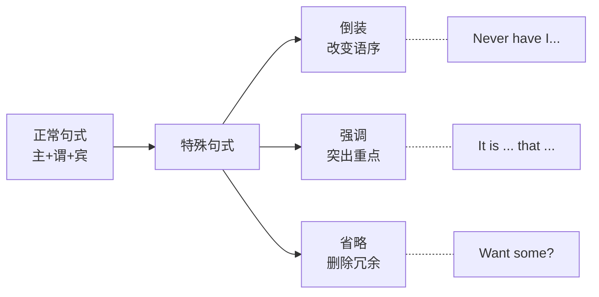
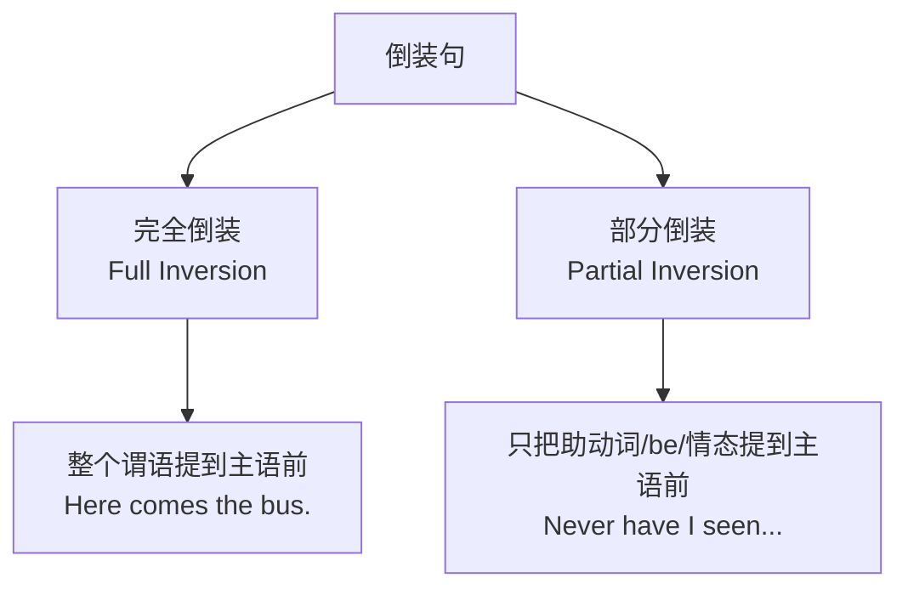
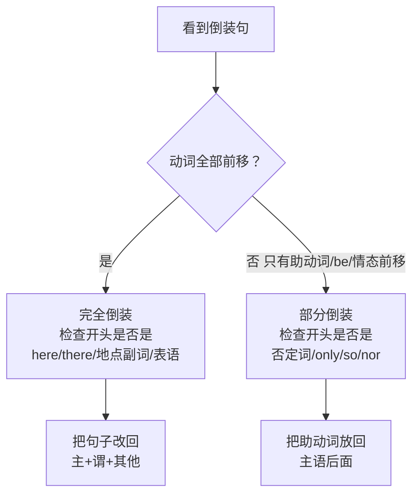

# 倒装句、强调句与省略句

> [!info] 本篇定位
> 这是 **02.基础句型框架**分类的**收官之作**。
>
> 前三篇讲的是**正常语序**的句子：五大句型、四大句式、there be / it 句型。
>
> 本篇讲的是**"打破正常"**的句子——
>
> - **倒装句**：故意把语序颠倒，让句子更有气势
>   - `Never have I seen such beauty.`（我从未见过这样的美景。）
> - **强调句**：用特殊结构让某部分"闪光"
>   - `I do love you.`（我**真的**爱你。）
> - **省略句**：省略已知信息，让句子更简洁
>   - `Like it?`（= Do you like it?）
>
> 这三种结构是英语**高级表达**的标志。掌握它们，你的英语就能**从"能说"变成"会说"**。

---

## 1. 本篇导读：为什么要学这三种特殊句式

### 1.1 三种句式的共同特点

倒装、强调、省略，都是**打破常规**的句式：



### 1.2 日常使用频率

- **倒装**：书面语和正式场合高频，口语少用
- **强调**：口语和书面都高频
- **省略**：口语**极高频**，几乎每句话都有

### 1.3 学习策略

- 倒装：**重点记规则**，考试和写作用
- 强调：**重点练用法**，说话更有感染力
- 省略：**重点培养语感**，日常交流自然化

---

# Part 1：倒装句（Inversion）

## 2. 什么是倒装句

### 2.1 倒装的本质

**倒装** = 把句子的正常语序**颠倒**，通常是**把谓语的一部分或全部放到主语前面**。

**对比**：

```
正常语序：
  I have never been to Paris.     (我从未去过巴黎。)

倒装语序：
  Never have I been to Paris.     (从未我去过巴黎——更有气势)
```

### 2.2 为什么用倒装

**三大原因**：

1. **强调**：把重点放到句首，更醒目
2. **语气**：让句子更有文学感、戏剧感
3. **语法要求**：某些结构**强制**要倒装

### 2.3 两种倒装：完全 vs 部分



**区分关键**：看动词怎么移动。

---

## 3. 完全倒装

### 3.1 什么是完全倒装

**完全倒装** = 把**整个谓语**放到主语前面。

**语序**：**谓语 + 主语 + 其他**

```
正常：The bus comes.    →   倒装：Here comes the bus.
                                   ↑ 谓语 comes 在主语 the bus 前面
```

### 3.2 完全倒装的 4 种触发情境

**情境 1：here / there / now / then 等副词开头**

```
Here comes the bus!                 (公交车来了！)
There goes my dream.                (我的梦想破灭了。)
Now comes the hard part.            (难的部分来了。)
Then came a loud noise.             (然后传来一声巨响。)
```

> [!tip] 注意：主语是代词时，不倒装！
>
> 当主语是**人称代词**（I, you, he, she, it, we, they）时，**不倒装**：
>
> - ❌ `Here comes he.`
> - ✅ `Here he comes.`
>
> - ❌ `There goes it.`
> - ✅ `There it goes.`
>
> **只有主语是名词时才倒装**。

**情境 2：地点/方位副词开头**

```
In front of me stood a big tree.    (在我面前立着一棵大树。)
Under the bed lay a little cat.     (床下躺着一只小猫。)
On the wall hung a beautiful picture. (墙上挂着一幅美画。)
Next to the lake is a small house.  (湖边有一间小屋。)
```

**情境 3：表语开头（书面文学常见）**

```
So beautiful was the scene that I forgot to breathe.
(如此美丽的场景，我忘了呼吸。)

Happy are those who love to learn.
(热爱学习的人是幸福的。)

Gone are the days of my childhood.
(我的童年一去不复返。)
```

**情境 4：过去分词开头（正式文体）**

```
Attached is the report.             (附件是报告。)
Included in the package are 3 books. (包裹里有 3 本书。)
Enclosed please find the documents. (随函附上文件。)
```

### 3.3 完全倒装典型例句

> [!success] 完全倒装例句
>
> 1. `Here comes the train.`（火车来了。）
> 2. `There goes the bell.`（铃响了。）
> 3. `Here is your coffee.`（你的咖啡来了。）
> 4. `There stood an old man.`（站着一位老人。）
> 5. `In the garden were many flowers.`（花园里有很多花。）
> 6. `On the table lay a book.`（桌上放着一本书。）
> 7. `Around the corner came a dog.`（从拐角跑来一条狗。）
> 8. `Behind the door stood a tall man.`（门后站着一个高个男人。）
> 9. `Up went the rocket.`（火箭升空了。）
> 10. `Away flew the bird.`（鸟儿飞走了。）

---

## 4. 部分倒装

### 4.1 什么是部分倒装

**部分倒装** = 只把**助动词、be 动词、情态动词**放到主语前面（不是整个谓语）。

**语序**：**助动词/be/情态 + 主语 + 实义动词 + 其他**

```
正常：I have never seen him.
倒装：Never have I seen him.
      ↑ 只有 have 前移，seen 还在后面
```

### 4.2 部分倒装的 7 种触发情境

**情境 1：否定词/否定副词开头**

**触发词**：never, seldom, rarely, hardly, scarcely, no, not, nowhere, little, few, nor

```
Never have I seen such beauty.              (我从未见过这样的美景。)
Seldom does he make mistakes.               (他很少犯错。)
Rarely do we have such a chance.            (我们很少有这样的机会。)
Hardly had I arrived when it started to rain.  (我刚到就下雨了。)
Little did I know what would happen.        (我当时根本不知道会发生什么。)
Nowhere could I find my keys.               (哪儿都找不到钥匙。)
Not a word did he say.                      (他一句话也没说。)
```

> [!warning] 常见错误
>
> - ❌ `Never I have seen him.`（主语还在助动词前）
> - ✅ `Never have I seen him.`
>
> - ❌ `Hardly I arrived when...`
> - ✅ `Hardly had I arrived when...`

**情境 2：only + 状语/副词/介词短语开头**

```
Only then did I realize the truth.          (直到那时我才意识到真相。)
Only in this way can we succeed.            (只有这样我们才能成功。)
Only after the war did peace return.        (只有战争结束后和平才回来。)
Only when you grow up will you understand.  (只有你长大后才会明白。)
```

> [!tip] 注意：only + 主语不倒装
>
> - `Only Tom knows the answer.` ← **不倒装**（only 修饰主语）
> - `Only when Tom comes will we start.` ← **倒装**（only 修饰状语从句）

**情境 3：so, nor, neither 开头（表"也……"）**

**so + 倒装**：表示"也……"（肯定）

```
"I love this song." "So do I."          (我也爱。)
"She is happy." "So is he."             (他也开心。)
"They went early." "So did we."         (我们也早走了。)
```

**nor / neither + 倒装**：表示"也不……"（否定）

```
"I don't like fish." "Neither do I."    (我也不喜欢。)
"She isn't here." "Nor is her brother." (她哥哥也不在。)
"He can't swim." "Neither can I."       (我也不会。)
```

> [!tip] so 倒装 vs so 不倒装
>
> - **So + 倒装**：意思是"**也**……"
>   - `"I'm tired." "So am I."` = 我也累了
>
> - **So + 主 + 谓（不倒装）**：意思是"**的确如此**"
>   - `"You said it's raining." "So it is."` = 的确在下雨

**情境 4：虚拟条件句省略 if 倒装**

**虚拟语气的 if 可以省略**，此时把 were/had/should 提到句首。

```
正常：If I were you, I would study harder.
倒装：Were I you, I would study harder.

正常：If I had known, I would have called.
倒装：Had I known, I would have called.

正常：If it should rain, the game will be cancelled.
倒装：Should it rain, the game will be cancelled.
```

**情境 5：so/such ... that 句型倒装**

当 so/such 开头时，需要部分倒装：

```
So cold was the weather that we couldn't go out.
                                (天气太冷了，我们出不去。)

Such was his anger that he couldn't speak.
                                (他气得说不出话。)

So loudly did he speak that everyone heard him.
                                (他说得太大声，每个人都听到了。)
```

**情境 6：as / though 引导让步状语（把表语/副词/动词提前）**

```
Young as he is, he knows a lot.         (尽管他年轻，却知道很多。)
Hard as she tried, she couldn't do it.  (尽管她努力，还是做不到。)
Smart though he may be, he often makes mistakes.
                                        (尽管他聪明，也常犯错。)
Try as I might, I couldn't sleep.       (尽管我努力尝试，还是睡不着。)
```

**情境 7：not only ... but also 开头**

```
Not only did he help me, but he also gave me money.
(他不仅帮了我，还给了我钱。)

Not only is she kind, but she is also smart.
(她不仅善良，还聪明。)
```

### 4.3 部分倒装典型例句（15 个）

> [!success] 部分倒装例句
>
> **否定词开头**
> 1. `Never before have I felt so happy.`（我从未如此开心过。）
> 2. `Seldom does he go to the cinema.`（他很少去电影院。）
> 3. `Rarely did she speak.`（她很少说话。）
> 4. `Hardly had we arrived when it started to rain.`（我们刚到就下雨了。）
> 5. `No sooner had I sat down than the phone rang.`（我刚坐下电话就响了。）
>
> **only 开头**
> 6. `Only by working hard can we succeed.`（只有努力才能成功。）
> 7. `Only then did he realize his mistake.`（直到那时他才意识到错误。）
> 8. `Only after dinner can we watch TV.`（只有饭后才能看电视。）
>
> **so/nor/neither 倒装**
> 9. `"I love pizza." "So do I."`（我也爱披萨。）
> 10. `"I can't swim." "Neither can I."`（我也不会游泳。）
>
> **虚拟倒装**
> 11. `Were I in your position, I would agree.`（我若是你，我会同意。）
> 12. `Had he studied harder, he would have passed.`（他要是更努力，就能通过了。）
> 13. `Should you need help, please call me.`（需要帮助请给我打电话。）
>
> **其他**
> 14. `So angry was she that she left.`（她气得走了。）
> 15. `Not only did it rain, but it also snowed.`（不仅下雨，还下雪了。）

---

## 5. 倒装句的辨别步骤



---

# Part 2：强调句（Emphasis）

## 6. 英语强调的 6 种方式

除了上一篇讲的 **It is/was ... that/who ...** 强调句，英语还有多种强调手段。

### 6.1 方式 1：It is/was + 被强调 + that/who + 其他

**（上一篇已详细讲解，这里简要回顾）**

```
原句：Tom broke the window yesterday.

强调主语：It was Tom who broke the window yesterday.
强调宾语：It was the window that Tom broke yesterday.
强调时间：It was yesterday that Tom broke the window.
```

### 6.2 方式 2：do / does / did 强调谓语

**用法**：在**一般现在/过去时的肯定句**中，谓语前加 do/does/did，**强调谓语动词**。

**规则**：
- 一般现在：加 **do** 或 **does**（第三人称单数）
- 一般过去：加 **did**，**后面动词变回原形**

```
原句：I love you.                →  强调：I do love you.           (我**真的**爱你。)
原句：She looks beautiful.       →  强调：She does look beautiful. (她**确实**美。)
原句：He came yesterday.         →  强调：He did come yesterday.   (他**确实**昨天来了。)
原句：Please be quiet.           →  强调：Do be quiet.             (真的**请**安静。)
```

**典型使用场景**：

- **反驳对方的怀疑**：
  - A: `You don't love me!`
  - B: `I do love you!`（我**真的**爱你！）

- **对比强调**：
  - `I thought he wouldn't come, but he did come.`
    （我以为他不会来，但他确实来了。）

- **加强请求**：
  - `Do come tomorrow!`（**一定**要来！）
  - `Do try this!`（**一定**要试试！）

### 6.3 方式 3：very / really / truly / indeed 等词

**这类副词用来强调**：

```
I'm very tired.                 (我非常累。)
She really loves him.           (她真的爱他。)
That's truly amazing.           (那真的很棒。)
I do indeed appreciate it.      (我确实感激。)
I'm absolutely sure.            (我绝对确定。)
She's definitely coming.        (她肯定来。)
I'm completely exhausted.       (我完全累了。)
```

**程度强调副词清单**：

```
very, really, truly, indeed, absolutely, definitely, completely,
totally, entirely, utterly, extremely, incredibly, seriously
```

### 6.4 方式 4：ever 在疑问句中强调

```
Have you ever been to Paris?          (你**曾经**去过巴黎吗？)
Did you ever see him?                 (你**到底**见过他没？)
Why did you ever do that?             (你**究竟**为什么那样做？)
```

**注意**：`ever` 本身不翻译成"曾经"，只是**加强语气**。

### 6.5 方式 5：反身代词强调

**反身代词**（myself, yourself, himself...）放在被强调对象**后面**或**句末**，表示"**亲自**"。

```
I built this house myself.            (我**亲自**建的这房子。)
He himself admitted the mistake.      (他**亲口**承认了错误。)
She did it all by herself.            (她**独自**完成了一切。)
The president himself came to welcome us. (总统**亲自**来欢迎我们。)
```

### 6.6 方式 6：重复强调

**重复单词或短语**强调：

```
Very, very tired.                     (非常非常累。)
I'm so, so sorry.                     (我真的真的很抱歉。)
Again and again, he tried.            (一次又一次，他尝试。)
Hour after hour, she waited.          (一个小时又一个小时，她等着。)
```

### 6.7 其他强调方法

**感叹号**：直接加感叹号强化语气

```
Stop!              (停！)
No way!            (不可能！)
```

**用 on earth / in the world / the hell 加强疑问**（口语）：

```
What on earth are you doing?          (你到底在干什么？)
Where in the world is my phone?       (我的手机到底在哪？)
Who the hell is that?                 (那到底是谁？)（粗俗，慎用）
```

**破折号 / 斜体**（书面强调）：

```
I — absolutely — refuse to go.
I *absolutely* refuse to go.
```

---

## 7. 强调方式对比

| 强调对象 | 常用方式 | 例句 |
| ---- | ---- | ---- |
| 主语 | It is X who... | It is **Tom** who called. |
| 宾语 | It is X that... | It is **the book** that he bought. |
| 时间 | It is X that... | It was **yesterday** that he arrived. |
| 地点 | It is X that... | It was **here** that we met. |
| 谓语 | do/does/did | He **does** love you. |
| 名词 | very, really | This is **very** important. |
| 疑问 | ever, on earth | What **on earth** happened? |
| 亲自做 | 反身代词 | I did it **myself**. |

---

# Part 3：省略句（Ellipsis）

## 8. 什么是省略句

### 8.1 省略的本质

**省略** = 为了**避免重复**或**简洁明了**，把句子中**某些成分去掉**。

**核心原则**：被省略的部分必须是**上下文能推断出来**的。

```
完整：Do you want to go? Yes, I want to go.
省略：Wanna go? Yeah.         (极度简化)

完整：If you are ready, we can start.
省略：If ready, we can start.
```

### 8.2 为什么要学省略

**省略句在日常英语中极其高频**。英语母语者说话时，能省略的绝对省略。

不懂省略规则，会导致：
- **听力困难**（不知道那些"残缺句"是什么意思）
- **口语冗长**（说话像写作文）
- **阅读误解**（对省略的部分理解错）

---

## 9. 对话中的省略

### 9.1 省略主语或助动词（口语）

```
完整：Do you want some coffee?
省略：Want some coffee?          (要咖啡吗？)

完整：Are you ready?
省略：Ready?                      (准备好了吗？)

完整：Do you see what I mean?
省略：See what I mean?            (明白我的意思吗？)

完整：I am going to the store.
省略：Going to the store.         (去商店。)
```

### 9.2 回答问题时的省略

```
Q: What are you doing?
A: Reading.                       (省略 I'm)

Q: Where are you going?
A: To the gym.                    (省略 I'm going)

Q: Who broke the vase?
A: Tom.                           (省略 broke the vase)
```

### 9.3 反馈语（纯省略表达）

```
"Sure!"          (= Sure, I'll do it.)
"Of course!"     (= Of course I will.)
"Got it."        (= I got it.)
"Maybe."         (= Maybe I will.)
"Not really."    (= Not really sure.)
```

---

## 10. 并列句中的省略

**在 and / but / or 连接的并列句中，相同的部分可以省略**。

### 10.1 省略主语

```
完整：I went to the store and I bought some milk.
省略：I went to the store and bought some milk.

完整：He is tired but he is happy.
省略：He is tired but happy.
```

### 10.2 省略动词

```
完整：John likes apples and Mary likes apples.
省略：John likes apples and Mary does, too.     (用 does 代替)
     或：John and Mary like apples.

完整：I can speak English and I can speak French.
省略：I can speak English and French.
```

### 10.3 省略助动词 / 情态动词

```
完整：I have been to Paris, and she has been to Paris.
省略：I have been to Paris, and so has she.

完整：He can swim and I can swim too.
省略：He can swim and I can too.
```

---

## 11. 从句中的省略

### 11.1 状语从句省略"主语 + be"

**当从句的主语与主句相同**，且从句谓语是 be 动词时，可以**省略从句的主语和 be 动词**。

**触发连词**：when, while, if, unless, though, although, as, once

```
完整：While I was walking in the park, I met an old friend.
省略：While walking in the park, I met an old friend.

完整：When he was young, he liked sports.
省略：When young, he liked sports.

完整：If you are ready, we can start.
省略：If ready, we can start.

完整：Though he is tired, he keeps working.
省略：Though tired, he keeps working.
```

### 11.2 不定式后的省略

**为了避免重复，to 后面的动词可以省略**（只留 to）。

```
完整：I want to go, but I don't have time to go.
省略：I want to go, but I don't have time to.

完整：Would you like to come? I'd love to come.
省略：Would you like to come? I'd love to.

完整：You can leave if you want to leave.
省略：You can leave if you want to.
```

### 11.3 定语从句中的关系词省略

**当关系代词是从句的宾语**时，可以省略。

```
完整：The book that I bought is great.
省略：The book I bought is great.

完整：The man whom I met was kind.
省略：The man I met was kind.

完整：The person who is singing is my sister.
(此句关系代词 who 是主语，不能省略)
```

**原则**：
- **从句宾语**的关系代词（that/which/whom）可省
- **从句主语**的关系代词**不能省**

### 11.4 宾语从句中 that 的省略

```
完整：I think that he is right.
省略：I think he is right.

完整：She said that she would come.
省略：She said she would come.
```

`think, say, know, believe, hope` 等动词后的 **that 常省略**。

---

## 12. 常见省略的其他场景

### 12.1 固定省略表达

**在招牌、标题、电报、短信中**，常大量省略：

```
"No smoking."                          (= Smoking is not allowed here.)
"No entry."                            (= Entry is not allowed.)
"Sale today."                          (= There is a sale today.)
"Happy birthday!"                      (= I wish you a happy birthday!)
"Thanks."                              (= Thanks to you.)
"See you later."                       (= I will see you later.)
"Any questions?"                       (= Do you have any questions?)
```

### 12.2 条件句的简化

```
Without you, I would be lost.          (没有你，我会迷失。)
(= If I didn't have you, I would be lost.)

With luck, we might win.               (运气好的话，我们可能赢。)
(= If we are lucky, we might win.)
```

### 12.3 比较句中的省略

```
完整：Tom is taller than John is.
省略：Tom is taller than John.

完整：I like coffee more than you do.
省略：I like coffee more than you.

完整：She runs faster than I run.
省略：She runs faster than me. / She runs faster than I.
```

---

## 13. 省略典型例句（20 个）

> [!success] 省略句例句
>
> **对话省略**
> 1. `Ready?` (= Are you ready?)
> 2. `Going out?` (= Are you going out?)
> 3. `Like it?` (= Do you like it?)
> 4. `Any luck?` (= Have you had any luck?)
> 5. `Why not?` (= Why don't we do it?)
>
> **并列句省略**
> 6. `I came, saw, and conquered.` (恺撒名言：我来，我见，我征服)
> 7. `She is smart but lazy.` (smart but she is lazy → smart but lazy)
> 8. `He likes tea and so do I.` (he likes tea / I like tea too)
>
> **状语从句省略**
> 9. `When in doubt, ask.` (= When you are in doubt, ask.)
> 10. `If possible, come early.` (= If it is possible, come early.)
> 11. `Once decided, don't change.` (= Once you have decided...)
> 12. `Though tired, he went on.` (= Though he was tired...)
>
> **to 后省略**
> 13. `Want to come? I'd love to.`
> 14. `Can you do it? I'll try to.`
>
> **that 省略**
> 15. `I think he's right.` (省略 that)
> 16. `I know she works hard.` (省略 that)
>
> **定语从句省略**
> 17. `The book I read was great.` (省略 that)
> 18. `The person I met was kind.` (省略 whom)
>
> **固定省略**
> 19. `Any questions?` (= Do you have any questions?)
> 20. `See you tomorrow!` (= I will see you tomorrow.)

---

## 14. 三大特殊句式综合对比

### 14.1 总结对比

| 句式 | 目的 | 手段 | 使用频率 |
| ---- | ---- | ---- | ---- |
| 倒装 | 强调/气势 | 改变语序 | 正式场合多 |
| 强调 | 突出重点 | It is/do/very | 任何场合 |
| 省略 | 简洁/自然 | 删除冗余 | 口语极高频 |

### 14.2 三种方式同时使用

同样一个意思，可以用三种方式组合：

**原句**：I really love her very much.

- 倒装：`Never have I loved anyone as much.`
- 强调：`It is her whom I love the most.` / `I do love her.`
- 省略：`Her? Love her!`

---

## 15. 场景实战：综合应用

**场景**：朋友深夜吐槽工作

```
Mary:  "So, how's work?"                            [省略：(How is) work?]
John:  "Busy! Never have I been so tired!"          [倒装强调]
Mary:  "Really? What happened?"                     [省略 did]
John:  "Crazy deadlines. I do need a break."        [强调 do]
Mary:  "You should take a vacation. Where would
        you go?"                                    [完整句]
John:  "Anywhere but here. Hard though it may be,   [倒装]
        I have to keep working."
Mary:  "Why not quit?"                              [省略]
John:  "Not that easy."                             [省略 it is]
Mary:  "Well, if really bad, just leave."           [省略 it is]
John:  "Yeah. It is the money that keeps me here."  [强调句]
Mary:  "I hear you. Done. Let's get dinner."        [省略]
John:  "Sure, so do I."                             [so 倒装]
```

**分析**：
- **倒装**：`Never have I been so tired` / `Hard though it may be`
- **强调**：`I do need` / `It is the money that keeps me`
- **省略**：`Work?` / `Why not quit?` / `Not that easy` / `Done`

---

## 16. 常见错误大盘点

### 16.1 倒装错误

> [!warning] 错误 1：否定词开头忘了倒装
>
> - ❌ `Never I have been there.`
> - ✅ `Never have I been there.`

> [!warning] 错误 2：here/there 主语是代词时倒装
>
> - ❌ `Here comes he.`
> - ✅ `Here he comes.`

> [!warning] 错误 3：只有 only + 状语才倒装
>
> - ❌ `Only Tom does know.` (only + 主语，不倒装)
> - ✅ `Only Tom knows.`

### 16.2 强调错误

> [!warning] 错误 1：did 后忘记用动词原形
>
> - ❌ `I did went.`
> - ✅ `I did go.`

> [!warning] 错误 2：强调句 that/who 选错
>
> - 强调人用 who 或 that（均可）
> - 强调物只能用 that
>
> - ❌ `It was Tom which...`
> - ✅ `It was Tom who...` 或 `It was Tom that...`

### 16.3 省略错误

> [!warning] 错误 1：省略过度导致意思不清
>
> - ❌ `Coffee, please.` （这没问题）
> - ⚠️ `Coffee.` （单独一个词，不清楚）

> [!warning] 错误 2：关系代词做主语时不能省
>
> - ❌ `The boy is crying is my son.` (错)
> - ✅ `The boy who is crying is my son.` (who 不能省)

---

## 17. 练习与输出建议

> [!success] 本篇练习清单
>
> **倒装句练习**
>
> 1. 把下列句子改写成倒装句：
>    - `I have never seen such a beautiful place.`
>    - `We can only succeed by working hard.`
>    - `I don't like coffee, and she doesn't either.`
>    - `If I were you, I would apologize.`
>
> 2. 翻译下列中文，用上倒装：
>    - 他几乎没开口说话。
>    - 要是我早知道就好了。
>    - 我也这么想。
>
> **强调句练习**
>
> 3. 把下列句子用**三种方式**强调：
>    - 原句：`Tom broke the window yesterday.`
>    - 强调 Tom：?
>    - 强调 window：?
>    - 强调 yesterday：?
>
> 4. 用 do/does/did 强调改写：
>    - `I love English.` → ?
>    - `She studies hard.` → ?
>    - `He came here.` → ?
>
> **省略句练习**
>
> 5. 简化下列句子：
>    - `Do you want some coffee?`
>    - `When he was young, he loved sports.`
>    - `I think that she will come.`
>    - `The book that I bought is good.`
>
> **综合输出**
>
> 6. 用一段 10 句话的英文，同时使用**倒装、强调、省略**三种结构，主题自选。

### 17.1 参考答案

**练习 1**：
- `Never have I seen such a beautiful place.`
- `Only by working hard can we succeed.`
- `I don't like coffee, and neither does she.`
- `Were I you, I would apologize.`

**练习 2**：
- `Hardly did he speak.`
- `Had I known earlier!`
- `So do I.`

**练习 3**：
- `It was Tom who broke the window yesterday.`
- `It was the window that Tom broke yesterday.`
- `It was yesterday that Tom broke the window.`

**练习 4**：
- `I do love English.`
- `She does study hard.`
- `He did come here.`

**练习 5**：
- `Want some coffee?`
- `When young, he loved sports.`
- `I think she will come.`
- `The book I bought is good.`

---

## 18. 本篇小结

> [!success] 本篇核心要点回顾
>
> **倒装句**：
> - **完全倒装**：整个谓语前移（here/there/方位词/表语/分词开头）
> - **部分倒装**：只助动词/be/情态前移
>   - 否定词开头：never, seldom, rarely, hardly, no sooner
>   - only + 状语
>   - so/nor/neither 倒装
>   - 虚拟条件省略 if
>   - so/such ... that
>   - as/though 让步
>   - not only ... but also
>
> **强调句**：
> - **It is/was + X + that/who ...**：强调成分
> - **do/does/did + 原形动词**：强调谓语
> - **very, really, truly**：强调程度
> - **on earth, ever**：强调疑问
> - **myself, himself**：强调亲自
> - **重复**：very very, again and again
>
> **省略句**：
> - 对话中省略主语/助动词
> - 并列句省略重复成分
> - 状语从句省略主语 + be
> - 不定式后保留 to 省略动词
> - 关系代词作宾语可省
> - that 引导宾语从句可省

### 18.1 基础句型框架分类收官

恭喜！你已经完成了 **02.基础句型框架** 分类的全部 4 篇：

```
✅ 01.英语五大基本句型完全解析  (英语骨架)
✅ 02.陈述疑问祈使感叹四大句式  (句式功能)
✅ 03.there be 与 it 句型完全手册 (特殊高频句型)
✅ 04.倒装句、强调句与省略句     (高级技巧)
```

**现在你已经掌握**：
- 英语**所有句子的底层结构**（5 大句型）
- 英语**所有表达功能**（陈述、疑问、祈使、感叹）
- 英语**最特殊的存在/形式句型**（there be、it）
- 英语**高级灵活表达**（倒装、强调、省略）

接下来我们将进入 **03.时态与语态句型框架** 分类，专攻英语的**时间表达系统**——这是中国学生传统的痛点，也是通往流利英语的关键一关。

### 18.2 下一分类预告

> [!info] 下一分类：03.时态与语态句型框架
>
> 下一个分类我们将系统攻克：
>
> - **03.01**：16 种时态完全手册（4 时间 × 4 状态）
> - **03.02**：被动语态句型框架
> - **03.03**：虚拟语气完全解析（if 三种条件 + wish + as if...）
> - **03.04**：情态动词句型框架（can/could/may/might/must/should...）
>
> 下一篇我们从 **16 种时态**开始。如果你害怕时态，别担心——我会用一张表格 + 清晰的对比，让你**一次性搞清楚所有时态**。
