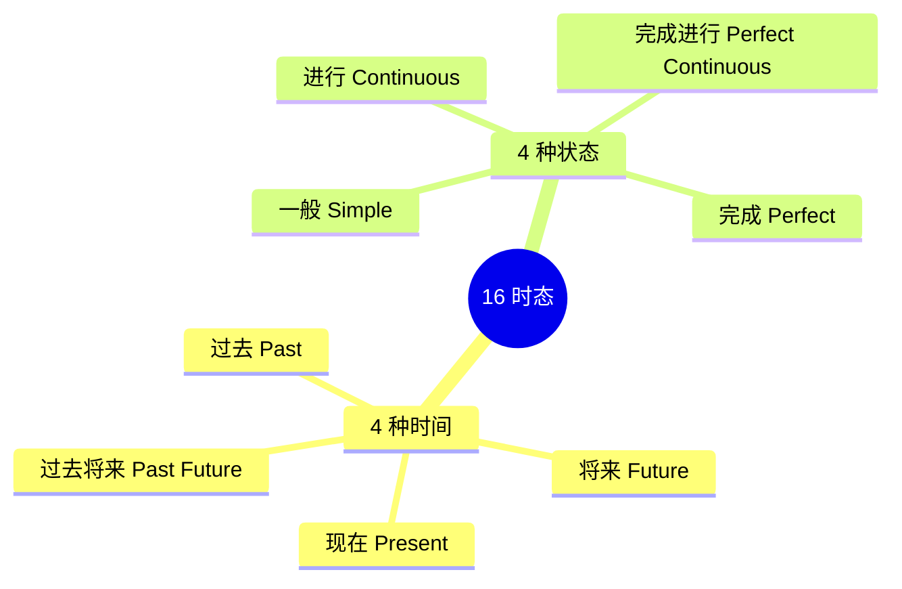
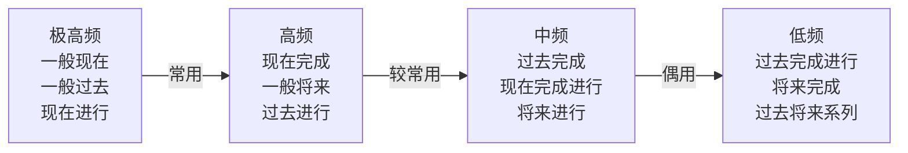

# 16 种时态完全手册

> [!info] 本篇定位
> 这是整套教程**最长也最重要**的一篇——**15000+ 字**。
>
> 时态是中国学生学英语的**分水岭**：搞懂了，阅读听力作文都上一个台阶；搞不懂，永远在初级徘徊。
>
> 本篇的目标：**一次性把 16 种时态讲透**，让你看完就能：
>
> - 分辨 16 种时态的**构成**和**使用场景**
> - 识别每种时态的**时间标志词**
> - 面对任何句子，**准确判断应该用哪个时态**
> - 摆脱"一般过去 / 现在完成"的千年困扰
>
> 建议**分 3-5 天读完**。每天吃透 3-5 种时态，配合练习。

---

## 1. 本篇导读：时态是什么？

### 1.1 一句话理解时态

**时态** = **时间**（动作发生在什么时候）+ **状态**（动作处于什么阶段）。

**中文只看"时间"，英文同时看"时间"和"状态"**，所以英文的时态比中文复杂得多。

```
中文：我吃饭。（是现在吃？过去吃？正在吃？吃完了？——不明确）
英文：
  I eat.                       (一般现在——习惯吃)
  I am eating.                 (现在进行——正在吃)
  I ate.                       (一般过去——过去吃过)
  I have eaten.                (现在完成——吃过了)
  I had eaten.                 (过去完成——之前吃过)
  ...
```

### 1.2 时态的二维坐标

英语时态可以画成一个 **4 × 4 = 16 宫格**的表格：



**16 时态总表**：

|  | 一般 | 进行 | 完成 | 完成进行 |
| --- | --- | --- | --- | --- |
| **现在** | I eat. | I am eating. | I have eaten. | I have been eating. |
| **过去** | I ate. | I was eating. | I had eaten. | I had been eating. |
| **将来** | I will eat. | I will be eating. | I will have eaten. | I will have been eating. |
| **过去将来** | I would eat. | I would be eating. | I would have eaten. | I would have been eating. |

> [!tip] 别被吓到
>
> 虽然是 16 种，但**日常使用最频繁的只有 6 种**：
>
> 1. 一般现在（I eat.）
> 2. 现在进行（I am eating.）
> 3. 现在完成（I have eaten.）
> 4. 一般过去（I ate.）
> 5. 一般将来（I will eat.）
> 6. 过去进行（I was eating.）
>
> **这 6 种覆盖了 90% 的日常使用**。其他 10 种主要在正式写作、文学、新闻中出现。

### 1.3 本篇学习策略

- **先学**常用 6 种（占 90% 使用率）
- **再学**剩下 10 种（应试和高级写作）
- 每学一种：**构成**→**用法**→**例句**→**时间词**→**对比**

---

## 2. 基础知识：动词的 4 种形态

在学时态前，必须搞清楚动词的 4 种形态。

### 2.1 动词 4 形态对照

每个动词都有 4 种形态，分别用于不同时态。

**以 work 为例**（规则动词）：

| 形态 | 英文名 | work 的形式 | 用于哪些时态 |
| ---- | ---- | ---- | ---- |
| 原形 | base form | work | 一般现在、一般将来等 |
| 单三 | 3rd person singular | works | 一般现在（第三人称单数）|
| 过去式 | past | worked | 一般过去 |
| 过去分词 | past participle | worked | 完成时、被动语态 |
| 现在分词 | present participle | working | 进行时 |

**规则动词**：过去式和过去分词都在原形后加 **-ed**。

**不规则动词**：过去式和过去分词变化不规则，需要记忆。

### 2.2 常见不规则动词表

| 原形 | 过去式 | 过去分词 | 现在分词 | 中文 |
| ---- | ---- | ---- | ---- | ---- |
| be | was/were | been | being | 是 |
| have | had | had | having | 有 |
| do | did | done | doing | 做 |
| go | went | gone | going | 去 |
| come | came | come | coming | 来 |
| see | saw | seen | seeing | 看 |
| eat | ate | eaten | eating | 吃 |
| drink | drank | drunk | drinking | 喝 |
| give | gave | given | giving | 给 |
| take | took | taken | taking | 拿 |
| make | made | made | making | 做 |
| get | got | got/gotten | getting | 得到 |
| know | knew | known | knowing | 知道 |
| think | thought | thought | thinking | 想 |
| write | wrote | written | writing | 写 |
| read | read | read | reading | 读 |
| run | ran | run | running | 跑 |
| speak | spoke | spoken | speaking | 说 |
| tell | told | told | telling | 告诉 |
| say | said | said | saying | 说 |

> [!tip] 学习建议
>
> 不规则动词**没有捷径**，只能**多见**。背诵**100 个最常见不规则动词**后，你会发现变化规律，之后遇到新的就好记了。
>
> 推荐先背：be, have, do, go, come, see, eat, make, take, get, know, think, write, read, run, say, tell, give。

---

## 3. 一般现在时（Simple Present）

### 3.1 构成公式

```
肯定：主语 + 动词原形（第三人称单数加 -s/-es）
否定：主语 + don't/doesn't + 动词原形
疑问：Do/Does + 主语 + 动词原形 + ?
```

**be 动词特例**：

```
肯定：I am / You are / He is ...
否定：I am not / You aren't / He isn't ...
疑问：Am I? / Are you? / Is he? ...
```

### 3.2 使用场景

**用法 1：经常性、习惯性的动作**

```
I drink coffee every morning.      (我每天早上喝咖啡。)
She goes to the gym twice a week.  (她每周去两次健身房。)
Dogs bark.                         (狗会叫——习性。)
```

**用法 2：客观事实、科学真理**

```
The sun rises in the east.         (太阳从东方升起。)
Water boils at 100°C.              (水在 100 度沸腾。)
Two plus two equals four.          (2+2=4。)
```

**用法 3：状态、特征、感受**

```
I love you.                        (我爱你——状态。)
She knows the answer.              (她知道答案。)
He lives in Beijing.               (他住在北京。)
```

**用法 4：时间表、日程（表将来意义）**

```
The train leaves at 8 AM tomorrow. (火车明天 8 点出发。)
The movie starts at 7.             (电影 7 点开始。)
```

**用法 5：格言、谚语**

```
Practice makes perfect.            (熟能生巧。)
Time flies.                        (时间飞逝。)
```

### 3.3 时间标志词

```
always, usually, often, sometimes, never, rarely, seldom
every day / week / month / year
once / twice a week
on Mondays
in the morning
```

### 3.4 典型例句（10 个）

> [!success] 一般现在时例句
>
> 1. `I work in Beijing.`（我在北京工作。）
> 2. `She speaks three languages.`（她会说三种语言。）
> 3. `We have dinner at 7 PM.`（我们 7 点吃晚饭。）
> 4. `The earth goes around the sun.`（地球绕太阳转。）
> 5. `He always tells the truth.`（他总是说实话。）
> 6. `My parents live in the countryside.`（我父母住在乡下。）
> 7. `I don't eat meat.`（我不吃肉。）
> 8. `Does she drink coffee?`（她喝咖啡吗？）
> 9. `The store opens at 9 AM.`（商店 9 点开门。）
> 10. `Honesty is the best policy.`（诚实是最好的策略。）

### 3.5 常见错误

> [!warning] 错误 1：第三人称单数忘记加 -s
>
> - ❌ `She work hard.` → ✅ `She works hard.`
> - ❌ `He go to school.` → ✅ `He goes to school.`

> [!warning] 错误 2：否定和疑问忘记用 do/does
>
> - ❌ `He not like coffee.` → ✅ `He doesn't like coffee.`
> - ❌ `You like it?` → ✅ `Do you like it?`

---

## 4. 现在进行时（Present Continuous）

### 4.1 构成公式

```
肯定：主语 + am/is/are + 动词-ing
否定：主语 + am/is/are + not + 动词-ing
疑问：Am/Is/Are + 主语 + 动词-ing + ?
```

### 4.2 使用场景

**用法 1：此刻正在发生的动作**

```
I am reading a book.               (我正在读书。)
She is cooking dinner.             (她正在做饭。)
The baby is sleeping.              (宝宝正在睡。)
```

**用法 2：这段时期正在进行的动作**（不一定此刻）

```
I am learning English.             (我这段时间在学英语。)
She is writing a novel.            (她在写一部小说。)
They are building a new house.     (他们在盖新房。)
```

**用法 3：表将来安排**（已确定的计划）

```
I'm flying to Paris tomorrow.      (我明天飞巴黎——已订票。)
We are having a party this Friday. (我们这周五有派对。)
```

**用法 4：抱怨/批评（搭配 always, constantly）**

```
He is always complaining.          (他总是抱怨——表达不满。)
She is constantly late.            (她总迟到——埋怨语气。)
```

### 4.3 时间标志词

```
now, right now, at the moment, at present
today, this week, this year
Look! / Listen! / See! （提示动作正在进行）
```

### 4.4 典型例句（10 个）

> [!success] 现在进行时例句
>
> 1. `I am studying English now.`（我现在正在学英语。）
> 2. `Look! The bus is coming.`（看！公交车来了。）
> 3. `She is talking on the phone.`（她正在打电话。）
> 4. `They are playing basketball.`（他们正在打篮球。）
> 5. `It is raining outside.`（外面正在下雨。）
> 6. `I'm meeting my boss at 3 PM.`（我下午 3 点要见老板。）
> 7. `We are traveling to Japan next month.`（下月我们去日本。）
> 8. `He is always losing his keys.`（他总是丢钥匙——抱怨。）
> 9. `Are you listening?`（你在听吗？）
> 10. `I'm not doing anything.`（我什么也没做。）

### 4.5 不用进行时的动词

> [!warning] 注意：某些动词不用进行时
>
> **感知动词**：see, hear, smell, taste, feel, notice
> **情感动词**：love, hate, like, prefer, want, wish, care
> **思维动词**：know, believe, think, remember, forget, understand, mean
> **状态动词**：be, have (拥有), own, belong, seem, exist
>
> ❌ `I am loving you.`（现在语义变化，口语中用）
> ✅ `I love you.`
>
> ❌ `I am knowing the answer.`
> ✅ `I know the answer.`
>
> **注意**：有些词用作动作时可用进行时：
> - `I'm having dinner.`（吃——动作，可用）
> - `I have a car.`（拥有——不用进行时）

---

## 5. 一般过去时（Simple Past）

### 5.1 构成公式

```
肯定：主语 + 动词过去式
否定：主语 + didn't + 动词原形
疑问：Did + 主语 + 动词原形 + ?
```

**be 动词特例**：

```
was：I, he, she, it 用
were：you, we, they 用

肯定：I was happy. / They were tired.
否定：I wasn't happy. / They weren't tired.
疑问：Was I happy? / Were they tired?
```

### 5.2 使用场景

**用法 1：过去某时发生的动作**

```
I visited my grandma yesterday.    (我昨天去看奶奶了。)
She went to Paris last year.       (她去年去了巴黎。)
```

**用法 2：过去习惯性动作**

```
When I was young, I played football every day.
(我年轻时每天踢球。)

He smoked for 20 years.
(他抽了 20 年烟。)
```

**用法 3：描述过去的状态**

```
She was beautiful.                 (她曾很美。)
The weather was nice.              (天气不错。)
```

### 5.3 时间标志词

```
yesterday, last week/month/year, ago (two days ago, a long time ago)
in 1999, in the 1990s
then, at that time, once, just now (刚才)
when + 过去时 (When I was a child...)
```

### 5.4 典型例句（10 个）

> [!success] 一般过去时例句
>
> 1. `I went to school yesterday.`（我昨天上学了。）
> 2. `She cooked dinner last night.`（她昨晚做了饭。）
> 3. `They visited us two weeks ago.`（他们两周前来看我们了。）
> 4. `I was born in 1995.`（我出生于 1995 年。）
> 5. `He didn't call me.`（他没给我打电话。）
> 6. `Did you see the movie?`（你看那部电影了吗？）
> 7. `We had a great time at the party.`（我们在派对上玩得很开心。）
> 8. `She was a teacher for 10 years.`（她当了 10 年老师。）
> 9. `The meeting started at 9 AM.`（会议 9 点开始。）
> 10. `I didn't know the answer.`（我不知道答案。）

### 5.5 used to 句型

**used to + 原形** = 过去常常（但现在不再）。

```
I used to smoke, but I quit.       (我以前抽烟，但戒了。)
She used to live in Shanghai.      (她以前住上海。)
```

**对比**：
- `used to + 原形`（过去常常但现在不了）
- `be used to + doing`（习惯于做某事——现在状态）
- `be used to do`（被用来做……——被动）

---

## 6. 过去进行时（Past Continuous）

### 6.1 构成公式

```
肯定：主语 + was/were + 动词-ing
否定：主语 + was/were + not + 动词-ing
疑问：Was/Were + 主语 + 动词-ing + ?
```

### 6.2 使用场景

**用法 1：过去某时正在进行的动作**

```
At 8 PM yesterday, I was watching TV.
(昨晚 8 点，我在看电视。)

This time last year, we were living in Beijing.
(去年这个时候，我们住在北京。)
```

**用法 2：过去两个同时进行的动作**（when / while）

```
While I was cooking, she was setting the table.
(我做饭时，她在摆桌。)
```

**用法 3：过去一个动作进行时，另一个动作打断**

```
I was reading when the phone rang.
(我正在读书时电话响了。)

When she arrived, we were having dinner.
(她到时，我们正在吃饭。)
```

> [!tip] 关键规律
>
> `when / while + 过去进行` **+** `过去一般`
>
> - **背景动作**用过去进行时（长动作）
> - **突发动作**用过去一般时（短动作）

### 6.3 时间标志词

```
at 8 PM yesterday, at that moment, at that time
when..., while...
this time last year
all day yesterday, from 3 to 5 PM yesterday
```

### 6.4 典型例句（10 个）

> [!success] 过去进行时例句
>
> 1. `I was sleeping at midnight.`（半夜我正在睡觉。）
> 2. `She was cooking when I called.`（我打电话时她在做饭。）
> 3. `They were playing football all afternoon.`（他们整个下午在踢球。）
> 4. `What were you doing at 10 PM?`（你晚上 10 点在干嘛？）
> 5. `While I was reading, she was watching TV.`（我读书时她看电视。）
> 6. `The rain was falling heavily.`（雨下得很大。）
> 7. `He wasn't paying attention.`（他没在注意。）
> 8. `When I arrived, everyone was laughing.`（我到时大家都在笑。）
> 9. `We were having breakfast when the alarm rang.`（我们吃早饭时警报响了。）
> 10. `At this time last year, I was studying in America.`（去年此时我在美国读书。）

---

## 7. 现在完成时（Present Perfect）

### 7.1 构成公式

```
肯定：主语 + have/has + 过去分词
否定：主语 + haven't/hasn't + 过去分词
疑问：Have/Has + 主语 + 过去分词 + ?
```

**注意**：第三人称单数用 **has**，其他用 **have**。

### 7.2 使用场景（中国学生最困难的时态！）

**用法 1：过去发生、对现在有影响**

```
I have lost my keys.               (我钥匙丢了——现在没钥匙。)
She has broken her leg.            (她摔断了腿——现在还没好。)
```

**用法 2：从过去某时一直持续到现在**

```
I have lived here for 10 years.    (我在这住了 10 年——现在还住。)
She has been a teacher since 2010. (她从 2010 年就当老师——现在还是。)
```

**用法 3：过去的经历（不强调时间）**

```
I have been to Paris.              (我去过巴黎——有这个经历。)
She has seen the movie.            (她看过这部电影。)
```

**用法 4：到现在为止的动作/成就**

```
I have finished my homework.       (我写完作业了。)
We have sold 1000 copies.          (我们已经卖了 1000 份。)
```

### 7.3 时间标志词

```
just（刚刚）, already（已经）, yet（还，用于否定/疑问）
ever（曾经）, never（从未）
for + 时间段（for two years）
since + 时间点（since 2010, since last year）
so far, up to now, until now（到目前为止）
recently, lately（最近）
this week/month/year（本周/月/年）
```

### 7.4 现在完成 vs 一般过去（超级重点！）

这是中国学生最容易混淆的地方。

| 区别 | 一般过去 | 现在完成 |
| ---- | ---- | ---- |
| 时间 | 明确的过去时间 | 不明确或持续到现在 |
| 与现在关系 | 无关 | 有关 |
| 典型标志 | yesterday, ago, in 2010 | for, since, ever, never |

**对比**：

```
一般过去：I saw him yesterday.                  (昨天这件事，与现在无关)
现在完成：I have seen him.                      (我见过他——有这个经历)

一般过去：She lived in Beijing from 2000-2010.  (过去那段时间，现在不住)
现在完成：She has lived in Beijing for 10 years. (住了 10 年，现在还住)

一般过去：Did you eat?                          (你吃了吗？——过去某时)
现在完成：Have you eaten?                       (你吃过了吗？——现在还饿不饿)
```

> [!tip] 判断技巧
>
> 问自己：**"这个动作和现在有关系吗？"**
>
> - **有关系** → 现在完成
> - **无关系** → 一般过去
>
> 另一个技巧：看有没有**明确的过去时间词**（yesterday, last week, ago, in 2010）：
>
> - 有 → **必须用一般过去**
> - 没有 → 可能是现在完成

### 7.5 典型例句（15 个）

> [!success] 现在完成时例句
>
> **对现在有影响**
> 1. `I have lost my keys.`（我钥匙丢了——现在找不到。）
> 2. `She has already left.`（她已经走了——现在不在。）
> 3. `We have sold the house.`（我们已经把房子卖了。）
>
> **持续到现在**
> 4. `I have lived here for 10 years.`（我在这住了 10 年。）
> 5. `They have been married since 2015.`（他们从 2015 年就结婚了。）
> 6. `She has known him all her life.`（她认识他一辈子了。）
>
> **经历**
> 7. `I have been to Paris twice.`（我去过巴黎两次。）
> 8. `Have you ever tried sushi?`（你吃过寿司吗？）
> 9. `She has never seen snow.`（她从没见过雪。）
>
> **近期发生**
> 10. `I have just finished my homework.`（我刚写完作业。）
> 11. `He has recently started a new job.`（他最近开始了新工作。）
>
> **问进度**
> 12. `Have you done it yet?`（你做完了吗？）
> 13. `I haven't seen her this week.`（我这周还没见到她。）
> 14. `How long have you been learning English?`（你学英语多久了？）
> 15. `I have read this book three times.`（这本书我读了三次。）

---

## 8. 现在完成进行时（Present Perfect Continuous）

### 8.1 构成公式

```
肯定：主语 + have/has been + 动词-ing
否定：主语 + haven't/hasn't been + 动词-ing
疑问：Have/Has + 主语 + been + 动词-ing + ?
```

### 8.2 使用场景

**用法 1：动作从过去持续到现在（并强调持续）**

```
I have been studying for 3 hours.
(我学了 3 个小时——现在还在学或刚停。)

She has been working here since 2018.
(她从 2018 年就在这工作，一直在。)
```

**用法 2：最近一直在做某事（不一定现在还在）**

```
I have been feeling tired lately.
(我最近一直感到累。)

It has been raining all day.
(一整天都在下雨。)
```

### 8.3 现在完成 vs 现在完成进行

| 区别 | 现在完成 | 现在完成进行 |
| ---- | ---- | ---- |
| 侧重 | 动作的**结果** | 动作的**持续过程** |
| 时态感 | 已完成 | 还在进行 |

**对比**：

```
I have read this book.              (我读过这本书——读完了。)
I have been reading this book.      (我一直在读这本书——还没读完。)

She has painted the wall.           (她把墙刷完了。)
She has been painting the wall.     (她一直在刷墙——可能还没完。)
```

### 8.4 典型例句（10 个）

> [!success] 现在完成进行时例句
>
> 1. `I have been waiting for an hour.`（我已经等了一小时。）
> 2. `She has been working on this project for weeks.`（她做这个项目几周了。）
> 3. `How long have you been learning English?`（你学英语多久了？）
> 4. `It has been snowing since last night.`（从昨晚就一直在下雪。）
> 5. `We have been looking for you everywhere.`（我们到处找你。）
> 6. `He has been exercising regularly.`（他一直在规律运动。）
> 7. `I've been thinking about the problem.`（我一直在想这问题。）
> 8. `They have been talking for hours.`（他们聊了好几个小时。）
> 9. `The baby has been crying for a while.`（宝宝哭了一阵子。）
> 10. `What have you been doing lately?`（你最近在做什么？）

---

## 9. 过去完成时（Past Perfect）

### 9.1 构成公式

```
肯定：主语 + had + 过去分词
否定：主语 + hadn't + 过去分词
疑问：Had + 主语 + 过去分词 + ?
```

### 9.2 使用场景

**核心用法**：**"过去的过去"**——在过去某时之前已经发生的动作。

```
When I arrived, she had already left.
       过去时点↑    ↑更早之前的动作（用过去完成）

By 2010, I had been to Paris three times.
(到 2010 年，我去过巴黎 3 次了。)
```

**典型结构**：
- `by + 过去时间点, 主语 had + 过去分词`
- `when 过去一般, 主语 had + 过去分词`
- `before + 过去时间`

### 9.3 典型例句（10 个）

> [!success] 过去完成时例句
>
> 1. `By 8 PM, I had finished my homework.`（到 8 点，我写完作业了。）
> 2. `When she arrived, the train had already left.`（她到时火车已经开走了。）
> 3. `I had never seen snow before I came here.`（来这之前我从没见过雪。）
> 4. `By the time we got there, they had eaten dinner.`（我们到时，他们已经吃过饭。）
> 5. `She had worked for the company for 5 years before she quit.`（她辞职前在公司工作了 5 年。）
> 6. `He told me he had seen the movie.`（他告诉我他看过那电影。）
> 7. `After she had finished, she went home.`（她做完后回家了。）
> 8. `I realized I had forgotten my wallet.`（我意识到钱包忘带了。）
> 9. `The game had started before we arrived.`（我们到之前比赛就开始了。）
> 10. `She had been a teacher for 10 years when she retired.`（她退休时已经当了 10 年老师。）

---

## 10. 过去完成进行时（Past Perfect Continuous）

### 10.1 构成公式

```
肯定：主语 + had been + 动词-ing
否定：主语 + hadn't been + 动词-ing
疑问：Had + 主语 + been + 动词-ing + ?
```

### 10.2 使用场景

**核心用法**：过去某时之前一直在进行的动作，**强调持续**。

```
By the time she arrived, I had been waiting for 2 hours.
(她到时，我已经等了 2 个小时了——一直在等。)

He had been studying all night before the exam.
(考试前他学了一整晚。)
```

### 10.3 典型例句（5 个）

```
1. I had been working for 8 hours when I finally took a break.
   (我工作了 8 小时才休息。)
2. She had been crying for an hour before he called.
   (他打电话之前她已经哭了一个小时。)
3. They had been planning the trip for months.
   (他们计划这次旅行好几个月了。)
4. How long had you been waiting when the bus came?
   (公交来之前你等了多久？)
5. We had been living there for 5 years before we moved.
   (搬走之前我们在那住了 5 年。)
```

---

## 11. 一般将来时（Simple Future）

### 11.1 构成公式

**方式 1：will + 动词原形**（最常用）

```
肯定：主语 + will + 动词原形
否定：主语 + won't + 动词原形
疑问：Will + 主语 + 动词原形?
```

**方式 2：be going to + 动词原形**

```
肯定：主语 + am/is/are going to + 动词原形
否定：主语 + am/is/are not going to + 动词原形
疑问：Am/Is/Are + 主语 + going to + 动词原形?
```

### 11.2 will vs be going to

两者**都可以表将来**，但有微妙区别：

| 区别 | will | be going to |
| ---- | ---- | ---- |
| 决定时机 | 说话当下做决定 | 说话前已决定 |
| 证据 | 主观预测 | 有客观证据 |
| 用法 | 承诺、请求、威胁 | 计划、安排 |

**对比**：

```
情境：电话响了
A: The phone is ringing.
B: I'll get it.                    (说话当下决定——will)

情境：已经买了机票
A: What are you doing this weekend?
B: I'm going to Paris.             (已经计划好——be going to)

情境：看到乌云
A: Look at the clouds.
B: It's going to rain.             (有证据——be going to)

情境：猜测
A: Do you think she'll come?
B: Yes, she will.                  (主观预测——will)
```

### 11.3 使用场景

**用法 1：未来会发生的动作**

```
I will graduate next year.         (我明年毕业。)
She will call you later.           (她稍后会打给你。)
```

**用法 2：现场决定（will）**

```
I'll take the blue one.            (我要蓝色的——当场决定。)
```

**用法 3：预先计划（be going to）**

```
I'm going to visit my grandma next week.
(我下周要去看奶奶——已计划。)
```

**用法 4：预测（based on evidence）**

```
Watch out! You're going to fall!   (小心！你要摔了！)
```

**用法 5：承诺/威胁/请求（will）**

```
I'll always love you.              (我会永远爱你——承诺。)
Will you help me?                  (你能帮我吗？——请求。)
I won't tell anyone.               (我不会告诉任何人。)
```

### 11.4 时间标志词

```
tomorrow, next week/month/year, soon
in two days, in the future
later, in a moment
```

### 11.5 典型例句（10 个）

> [!success] 一般将来时例句
>
> 1. `I will call you tomorrow.`（我明天给你打电话。）
> 2. `She is going to start a new job.`（她要开始新工作。）
> 3. `We will meet again someday.`（我们有天会再见。）
> 4. `It will rain tomorrow.`（明天会下雨。）
> 5. `I'm going to travel this summer.`（今年夏天我要旅行。）
> 6. `Will you marry me?`（你愿意嫁给我吗？）
> 7. `He won't give up.`（他不会放弃。）
> 8. `The meeting will start at 3 PM.`（会议 3 点开始。）
> 9. `I'll have the steak, please.`（我要牛排。）
> 10. `She's going to have a baby.`（她要生宝宝了。）

### 11.6 其他表将来的方式

**用法 A：现在进行时表将来**（已确定的近期安排）

```
I'm meeting John tomorrow.         (明天我要见 John——已约好。)
```

**用法 B：一般现在时表将来**（时间表）

```
The train leaves at 8.             (火车 8 点开——时刻表。)
```

**用法 C：be about to + 原形**（即将）

```
I am about to leave.               (我马上就走。)
```

---

## 12. 将来进行时（Future Continuous）

### 12.1 构成公式

```
肯定：主语 + will be + 动词-ing
否定：主语 + won't be + 动词-ing
疑问：Will + 主语 + be + 动词-ing?
```

### 12.2 使用场景

**用法 1：未来某时正在进行**

```
At 8 PM tomorrow, I will be watching TV.
(明晚 8 点，我会在看电视。)

This time next week, she will be flying to New York.
(下周此时，她将在飞往纽约。)
```

**用法 2：礼貌询问（比 will 更委婉）**

```
Will you be using the car?         (你会用车吗？——礼貌。)
```

### 12.3 典型例句（5 个）

```
1. I will be working until 6 PM.             (我会工作到 6 点。)
2. They will be traveling next week.         (他们下周会在旅行。)
3. Don't call at 8, I'll be sleeping.        (8 点别打，我在睡。)
4. Will you be joining us for dinner?        (你会和我们吃饭吗？)
5. This time tomorrow, we'll be on the beach. (明天此时我们在海滩。)
```

---

## 13. 将来完成时（Future Perfect）

### 13.1 构成公式

```
肯定：主语 + will have + 过去分词
否定：主语 + won't have + 过去分词
疑问：Will + 主语 + have + 过去分词?
```

### 13.2 使用场景

**核心用法**：到**将来某时之前**就已经完成的动作。

```
By next year, I will have graduated.
(到明年，我就毕业了。)

By the time you arrive, I will have finished cooking.
(等你到时，我就做完饭了。)
```

### 13.3 典型例句（5 个）

```
1. By 2030, humans will have landed on Mars.   (到 2030 年，人类会登上火星。)
2. I will have finished the report by 5 PM.     (5 点前我会写完报告。)
3. They will have been married for 10 years by December.
                                                 (到 12 月他们就结婚 10 年了。)
4. By then, she will have left.                 (到那时她已经走了。)
5. Will you have completed the task by Friday?  (你周五前能完成吗？)
```

---

## 14. 将来完成进行时（Future Perfect Continuous）

### 14.1 构成公式

```
肯定：主语 + will have been + 动词-ing
```

### 14.2 使用场景

**核心用法**：到将来某时**一直在进行**的动作（强调持续）。

```
By next month, I will have been working here for 5 years.
(到下个月，我在这工作就满 5 年了。)
```

这个时态**极少使用**，了解即可。

### 14.3 典型例句（3 个）

```
1. By June, I will have been studying English for 10 years.
   (到 6 月我学英语就满 10 年了。)
2. By the time she graduates, she will have been studying for 16 years.
   (她毕业时学习就满 16 年了。)
3. By tonight, we will have been driving for 12 hours.
   (到今晚我们就开车开 12 小时了。)
```

---

## 15. 过去将来时（Past Future）

**过去将来时** = 站在**过去某个时间点**看向未来。

### 15.1 一般过去将来：would + 原形

**用法**：常用于**间接引语**。

```
直接：He said, "I will call you."
间接：He said (that) he would call me.
     ↑ 在过去说了"将来"，所以用 would

He knew he would pass the exam.
(他知道他会通过考试。)
```

### 15.2 过去将来进行：would be + doing

```
She thought she would be flying at this time.
(她以为她这时候会在飞行。)
```

### 15.3 过去将来完成：would have + 过去分词

```
I thought he would have arrived by noon.
(我以为他中午前会到。)
```

### 15.4 过去将来完成进行：would have been + doing

```
He said he would have been working for 10 years by 2020.
(他说到 2020 年他就工作满 10 年了。)
```

### 15.5 过去将来时的使用总结

过去将来时主要出现在两种情况：

1. **间接引语/宾语从句**（主句是过去时）
2. **条件句**（虚拟语气后续篇章会讲）

**例句**：

```
I knew he would come.                      (我知道他会来。)
She said she would help.                   (她说她会帮忙。)
They promised they would return.           (他们答应会回来。)
```

---

## 16. 16 时态综合对比表

### 16.1 完整对比

以动词 **work** 为例，第一人称 I：

| | 一般 | 进行 | 完成 | 完成进行 |
| --- | --- | --- | --- | --- |
| **现在** | I work. | I am working. | I have worked. | I have been working. |
| **过去** | I worked. | I was working. | I had worked. | I had been working. |
| **将来** | I will work. | I will be working. | I will have worked. | I will have been working. |
| **过去将来** | I would work. | I would be working. | I would have worked. | I would have been working. |

### 16.2 使用频率



### 16.3 学习优先级

**必须精通（90% 使用）**：
- 一般现在、一般过去、现在进行、现在完成、一般将来、过去进行

**应该掌握（进阶必备）**：
- 过去完成、现在完成进行、将来完成、过去将来

**了解即可（正式写作用）**：
- 将来进行、过去完成进行、将来完成进行、过去将来完成/完成进行

---

## 17. 时态辨别技巧

### 17.1 3 步辨别法

**第 1 步：先看时间词**

| 时间词 | 对应时态 |
| ---- | ---- |
| every day, usually | 一般现在 |
| now, look! | 现在进行 |
| yesterday, ago, in 2010 | 一般过去 |
| when..., while... | 过去进行（搭配一般过去） |
| for, since, ever, never, yet | 现在完成 |
| by the time (过去) | 过去完成 |
| tomorrow, next, will | 一般将来 |
| by + 未来时间 | 将来完成 |

**第 2 步：再看语境**

- 陈述事实 → 一般现在
- 习惯 → 一般现在
- 正在发生 → 现在进行
- 经历 → 现在完成
- 过去某时的动作 → 一般过去
- 过去之前 → 过去完成

**第 3 步：最后看逻辑**

- 动作是否已经结束？
- 动作是否还有影响？
- 动作是否持续？

### 17.2 对比练习

**对比 1：一般现在 vs 现在进行**

```
I work in Beijing.          (习惯/状态——一般现在)
I am working now.           (此刻正在——现在进行)
```

**对比 2：一般过去 vs 现在完成**

```
I went to Paris last year.  (过去某时，与现在无关——一般过去)
I have been to Paris.       (有这经历，可能影响现在——现在完成)
```

**对比 3：一般过去 vs 过去进行**

```
I cooked dinner.            (完成了做饭这个动作——一般过去)
I was cooking dinner.       (当时正在做——过去进行)
```

**对比 4：现在完成 vs 现在完成进行**

```
I have read the book.       (读完了——现在完成)
I have been reading.        (一直在读——可能没读完——完成进行)
```

---

## 18. 场景实战：一段英文日记中的 8 种时态

```
Today was a busy day. [一般过去]

I woke up at 6 AM and went for a run. [一般过去]
While I was running, I saw a beautiful sunrise. [过去进行 + 一般过去]

When I got home, my wife had already made breakfast. [一般过去 + 过去完成]

I am now sitting at my desk, writing this diary. [现在进行]

I have been working on this project for a week. [现在完成进行]
I have finished half of it. [现在完成]

Tomorrow, I will meet my boss to discuss progress. [一般将来]

By next Friday, I will have completed the report. [将来完成]

I know I will be working overtime this whole week. [过去将来 + 将来进行，一般现在作主句]
```

---

## 19. 常见错误大盘点

### 19.1 错误 1：第三人称单数忘加 -s

```
❌ She work hard.
✅ She works hard.
```

### 19.2 错误 2：时间标志和时态不匹配

```
❌ I have seen him yesterday.        (have 不能和 yesterday 搭配)
✅ I saw him yesterday.

❌ She lives here for 10 years.      (for 10 years 要用完成时)
✅ She has lived here for 10 years.
```

### 19.3 错误 3：不规则动词变错

```
❌ I goed to school.
✅ I went to school.

❌ He seeed it.
✅ He saw it.
```

### 19.4 错误 4：状态动词用进行时

```
❌ I am knowing the answer.
✅ I know the answer.
```

### 19.5 错误 5：will 和 be going to 混用

```
❌ I will visit Paris.（已计划）→ 应为 I'm going to visit Paris.
❌ I'm going to get the phone.（电话响）→ 应为 I'll get the phone.
```

---

## 20. 练习与输出建议

> [!success] 本篇练习清单
>
> **时态识别**
>
> 1. 判断下列句子的时态：
>    - I eat breakfast at 7 AM.
>    - She is reading now.
>    - They went home.
>    - He has lived here for years.
>    - We will travel tomorrow.
>
> **改写练习**
>
> 2. 把 `I eat an apple` 改成以下时态：
>    - 现在进行
>    - 一般过去
>    - 现在完成
>    - 一般将来
>    - 过去完成
>
> **翻译练习**
>
> 3. 翻译下列中文：
>    - 我每天跑步。
>    - 我正在跑步。
>    - 我昨天跑了步。
>    - 我跑步已经 10 年了。
>    - 我明天会跑步。
>    - 我到明年将跑步满 11 年。
>
> **长期任务**
>
> 4. 每天写 5 句英文日记，**刻意使用不同时态**。
>
> 5. 阅读一段英文新闻，**标注所有谓语动词的时态**。

---

## 21. 本篇小结

> [!success] 本篇核心要点回顾
>
> **16 时态 = 4 时间 × 4 状态**
>
> **4 种时间**：现在 / 过去 / 将来 / 过去将来
>
> **4 种状态**：一般（habit）/ 进行（in progress）/ 完成（finished）/ 完成进行（duration）
>
> **最常用 6 种**：
> 1. 一般现在（习惯、事实）
> 2. 现在进行（正在发生）
> 3. 一般过去（过去发生）
> 4. 过去进行（过去正发生）
> 5. 现在完成（对现在有影响）
> 6. 一般将来（将要发生）
>
> **最大难点**：
> - 一般过去 vs 现在完成（有无过去明确时间、是否影响现在）
> - will vs be going to（决定时机、证据）
> - 现在完成 vs 现在完成进行（结果 vs 持续）

### 21.1 下一篇预告

> [!info] 下一篇：02.被动语态句型框架
>
> 下一篇深入讲**被动语态**：
>
> - 被动语态的构成（be + 过去分词）
> - 各时态的被动形式
> - 主动 vs 被动的转换
> - 什么时候用被动（新闻、科技、正式场合）
> - 特殊被动结构（情态 + be done、get + done）
> - 中国学生常犯的被动错误
>
> 如果本篇时态的 16 种组合让你懵圈，被动语态相对简单——只要掌握一个公式 `be + 过去分词`，就能套入所有时态。
