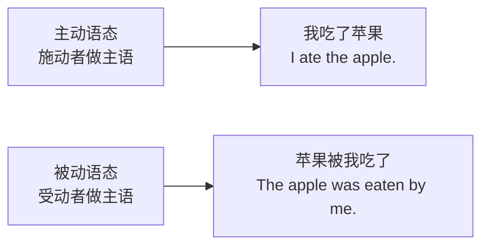
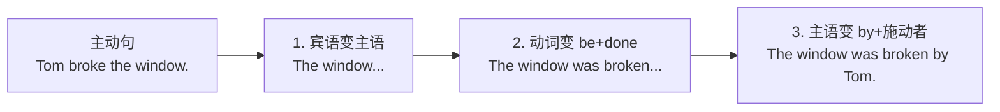
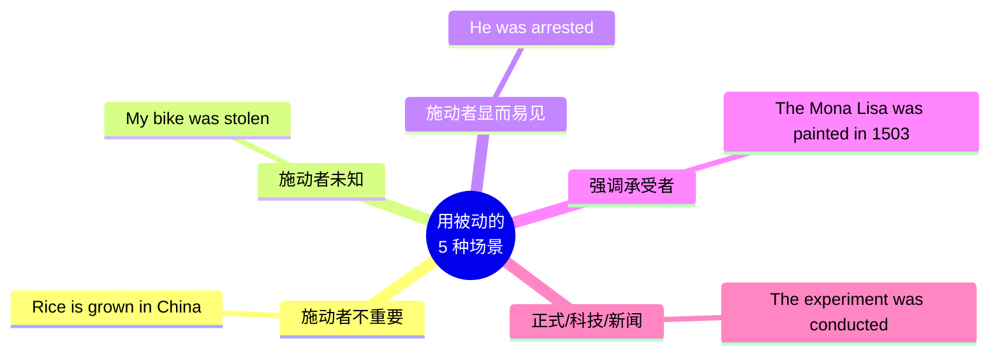

# 被动语态句型框架

> [!info] 本篇定位
> 上一篇讲了**时态**（时间），这一篇讲**语态**（主动还是被动）。
>
> 这两个概念**经常被放在一起**，因为它们共同决定了"**动词怎么变形**"。
>
> 被动语态是中国学生的**相对弱项**——因为**中文用被动比英文少**。但在英语的：
>
> - **新闻报道**
> - **科技论文**
> - **正式商务邮件**
> - **客观描述**
>
> 等场合，**被动语态出现的频率是主动的 3-5 倍**。不会用被动，你的英语永远"学生气"。
>
> 本篇让你**一次性吃透被动语态**：构成、各时态、转换、使用场景、特殊结构，全都讲透。

---

## 1. 本篇导读：主动 vs 被动

### 1.1 一个简单的例子

同样一件事"Tom 打破了窗户"，可以用两种方式说：

```
主动语态（Active Voice）：
  Tom broke the window.
  [动作发出者]  [动作]  [动作承受者]
  主语是做动作的人

被动语态（Passive Voice）：
  The window was broken by Tom.
  [动作承受者]    [被动作]      [动作发出者]
  主语是承受动作的人/物
```

**核心区别**：
- **主动**：**谁做了什么** (主语是施动者)
- **被动**：**什么被谁做了** (主语是受动者)

### 1.2 主动 vs 被动对比



### 1.3 本篇学习地图

1. 搞懂**基本公式**（be + 过去分词）
2. 掌握**16 种时态的被动**（公式套用）
3. 学会**主动 ↔ 被动转换**
4. 明确**什么时候用被动**
5. 攻克**特殊被动结构**（get done、双宾被动等）

---

## 2. 被动语态的基本公式

### 2.1 核心公式

**所有被动语态都遵循一个公式**：

```
be + 过去分词（done）
```

`be` 会根据**时态**和**主语**变形，但"过去分词"不变。

### 2.2 最简单的示例

**主动**：`He loves her.`

**被动**：`She is loved (by him).`
           ↑         ↑
         主语变成受动者   be + loved

### 2.3 被动语态的 3 大要素

一个完整的被动语态包含：

1. **主语**（原句的宾语变来）
2. **be + 过去分词**（核心结构）
3. **by + 动作发出者**（可选）

```
The book    was written    by the author.
[主语]       [be+done]      [施动者]
这本书        被写           由作者
```

**注意**：`by + 施动者` **经常省略**，尤其当施动者**不重要、不知道、不想说**时：

```
Tea is grown in India.                 (施动者：农民——不重要，省略)
My phone was stolen yesterday.         (施动者：不知道，省略)
Mistakes were made.                    (刻意不说，省略)
```

---

## 3. 16 种时态的被动形式

**被动公式 = 时态的 be + 过去分词**

只要把每种时态中的 be 动词部分变形，后面加过去分词即可。

### 3.1 16 时态被动对照表

以动词 **love**（过去分词 loved）为例：

| 时态 | 主动 | 被动 |
| ---- | ---- | ---- |
| 一般现在 | I love her. | She is loved. |
| 现在进行 | I am loving her. | She is being loved. |
| 现在完成 | I have loved her. | She has been loved. |
| 现在完成进行 | I have been loving her. | (几乎不用) |
| 一般过去 | I loved her. | She was loved. |
| 过去进行 | I was loving her. | She was being loved. |
| 过去完成 | I had loved her. | She had been loved. |
| 过去完成进行 | I had been loving her. | (几乎不用) |
| 一般将来 | I will love her. | She will be loved. |
| 将来进行 | I will be loving her. | (几乎不用) |
| 将来完成 | I will have loved her. | She will have been loved. |
| 一般过去将来 | I would love her. | She would be loved. |
| 过去将来完成 | I would have loved her. | She would have been loved. |

### 3.2 核心 6 种被动（最常用）

> [!tip] 必须掌握这 6 种
>
> 日常使用覆盖 95% 的场景：
>
> **1. 一般现在被动**：`am/is/are + done`
> - `English is spoken worldwide.`（英语全球通用。）
>
> **2. 一般过去被动**：`was/were + done`
> - `The letter was sent yesterday.`（信昨天被寄出。）
>
> **3. 一般将来被动**：`will be + done`
> - `The house will be built next year.`（房子明年会建成。）
>
> **4. 现在进行被动**：`am/is/are + being + done`
> - `The road is being repaired.`（路正在被修。）
>
> **5. 过去进行被动**：`was/were + being + done`
> - `The dinner was being cooked.`（晚餐正在做。）
>
> **6. 现在完成被动**：`have/has been + done`
> - `The problem has been solved.`（问题已被解决。）

### 3.3 各时态被动例句

**一般现在被动**：
```
Rice is eaten in China.                        (中国人吃米。)
English is taught in many countries.           (英语在许多国家被教。)
The window is cleaned every day.               (窗户每天都被擦。)
These books are written for children.          (这些书是为儿童写的。)
```

**一般过去被动**：
```
The Great Wall was built 2000 years ago.       (长城 2000 年前建造。)
The cake was eaten by the children.            (蛋糕被孩子们吃了。)
I was hired last month.                        (我上个月被雇。)
Mistakes were made.                            (出了错。)
```

**一般将来被动**：
```
The meeting will be postponed.                 (会议将被推迟。)
A new hospital will be built here.             (这里将建一所新医院。)
You will be notified by email.                 (您将通过邮件收到通知。)
```

**现在进行被动**：
```
The bridge is being repaired now.              (桥正在被修。)
The students are being tested.                 (学生正在被测试。)
My car is being washed.                        (我的车正在洗。)
```

**现在完成被动**：
```
The report has been finished.                  (报告已完成。)
All tickets have been sold.                    (所有票已售出。)
He has been promoted.                          (他被晋升了。)
```

**过去完成被动**：
```
By 2020, the book had been translated into 10 languages.
(到 2020 年，这本书被翻译成 10 种语言。)

When I arrived, the meeting had already been cancelled.
(我到时，会议已经被取消了。)
```

**情态动词被动**：
```
The package should be delivered tomorrow.      (包裹应该明天到。)
This must be done carefully.                   (这必须小心做。)
The door can be opened with this key.          (门可以用这钥匙开。)
Work may be finished by next week.             (工作可能下周做完。)
```

---

## 4. 主动 ↔ 被动转换规则

### 4.1 转换 3 步法



**详细说明**：

**Step 1**：**宾语** → 变 **主语**
```
Tom broke [the window].
         ↓
[The window] → 新主语
```

**Step 2**：**谓语动词** → 变 **be + 过去分词**（be 与原时态一致）
```
broke（过去式）→ was broken
```

**Step 3**：**原主语** → 变 **by + 原主语**（可省略）
```
Tom → by Tom
```

**最终**：`The window was broken by Tom.`

### 4.2 转换练习

| 主动 | 被动 |
| ---- | ---- |
| `She writes a letter.` | `A letter is written by her.` |
| `They built a house.` | `A house was built by them.` |
| `We will finish the project.` | `The project will be finished by us.` |
| `She is watching TV.` | `TV is being watched by her.` |
| `He has done it.` | `It has been done by him.` |

### 4.3 不能变被动的句子

**只有 SVO 句型（有宾语）才能变被动**。

**不能变被动的情况**：

**情况 1：不及物动词（无宾语）**
```
❌ He runs.             →  无宾语，不能变被动
❌ She arrived.         →  同上
```

**情况 2：系动词**
```
❌ She is beautiful.    →  is 是系动词，不能被动
❌ He became a doctor.  →  became 是系动词
```

**情况 3：某些及物动词表"状态"**
```
❌ He has a car.        →  have 表"拥有"，不变被动
❌ The book cost $10.   →  cost 表"花费"，不变被动
❌ The bag weighs 5 kg. →  weigh 表"重量"
```

**情况 4：某些动词 + 自己**
```
❌ She enjoys herself.  →  反身代词做宾语，不变被动
```

---

## 5. 什么时候用被动语态

### 5.1 使用被动的 5 大场景



### 5.2 场景 1：施动者不重要

当**"谁做的"不重要**，而"事情本身"才是重点时，用被动。

```
Tea is grown in India.
(茶叶产自印度。——谁种的不重要)

English is spoken in many countries.
(许多国家都说英语。——谁在说不重要)

This building was built in 1920.
(这栋楼 1920 年建的。——谁建的不重要)
```

### 5.3 场景 2：施动者未知

**不知道是谁做的**。

```
My phone was stolen.               (我手机被偷了——不知道是谁偷的)
The vase was broken.               (花瓶被打碎了——不知道是谁。)
```

### 5.4 场景 3：施动者显而易见

**谁做的大家都知道**，没必要说出来。

```
The criminal was arrested.         (罪犯被捕。——默认警察做的。)
The package was delivered.         (包裹已送达。——默认快递员。)
He was taken to hospital.          (他被送医。——默认救护车/朋友。)
```

### 5.5 场景 4：强调承受者/动作本身

让承受者成为关注点。

```
The Mona Lisa was painted by Leonardo da Vinci.
(《蒙娜丽莎》是达芬奇画的。——重点在画。)

The President was shot.
(总统被枪击。——重点在总统。)

Harry Potter was written by J.K. Rowling.
(哈利波特是 JK 罗琳写的。——重点在书。)
```

### 5.6 场景 5：正式/客观表达

**新闻、科技论文、正式报告**中，被动让叙述更客观。

```
The experiment was conducted in 2020.
(实验于 2020 年进行。——比"我们做了实验"客观。)

It is widely believed that ...
(人们普遍认为……——比"许多人认为"正式。)

The data was analyzed using SPSS.
(数据用 SPSS 分析。——科技论文标准说法。)
```

### 5.7 避免用"一般泛指主语"

中文常说"**人们**认为"、"**大家**都说"，英文用被动更地道：

```
❌ People think this is true.
✅ This is thought to be true.
✅ It is thought that this is true.

❌ People say the king is dead.
✅ The king is said to be dead.
✅ It is said that the king is dead.
```

---

## 6. 什么时候不用被动

### 6.1 日常口语尽量用主动

**口语中用被动过多会显得"公文化"**。

```
口语自然：Someone stole my bike.      (有人偷了我的自行车。)
口语生硬：My bike was stolen by someone. (太正式。)
```

### 6.2 短句用主动更清爽

```
更好：The dog bit me.          (狗咬了我。)
较差：I was bitten by the dog.  (我被狗咬了——口语中显正式。)
```

### 6.3 动作发出者重要时用主动

```
如果要强调是谁做的：
主动：Tom broke the vase.       (强调是 Tom 做的。)
```

---

## 7. 被动语态的 8 种特殊结构

### 7.1 特殊结构 1：情态动词被动

**公式**：`情态动词 + be + 过去分词`

```
can be done, should be done, must be done, may be done,
might be done, will be done, could be done, would be done
```

**例句**：

```
This problem can be solved.               (这问题能被解决。)
The report should be finished by Friday.  (报告周五前该完成。)
Children must be educated.                (孩子必须受教育。)
Mistakes may be made.                     (可能会出错。)
```

### 7.2 特殊结构 2：情态动词完成式被动

**公式**：`情态动词 + have been + 过去分词`

表示"**过去应该被……但实际没有**"等。

```
The work should have been done by now.
(这活儿到现在该做完了——但还没做完。)

It could have been avoided.
(本可以避免的——但没避免。)

The truth must have been known.
(真相肯定被知道了——推测。)
```

### 7.3 特殊结构 3：不定式被动 / 动名词被动

**不定式被动**：`to be + 过去分词`

```
I want to be loved.                       (我想被爱。)
He expected to be promoted.               (他希望被提升。)
The house needs to be cleaned.            (房子需要被清理。)
```

**动名词被动**：`being + 过去分词`

```
He hates being criticized.                (他讨厌被批评。)
She likes being photographed.             (她喜欢被拍照。)
I don't enjoy being ignored.              (我不喜欢被忽视。)
```

### 7.4 特殊结构 4：get + 过去分词（口语被动）

**get + done** 是**口语中常用的被动**，比 be done 更强调**动作和变化**。

```
I got hired!              (我被录用了！——强调事件。)
She got fired.            (她被炒了。)
They got married.         (他们结婚了——进入婚姻状态。)
He got hurt.              (他受伤了——变成受伤状态。)
My wallet got stolen.     (我钱包被偷了。)
```

**be 被动 vs get 被动**：

| 区别 | be + done | get + done |
| ---- | ---- | ---- |
| 正式度 | 正式、书面 | 口语、非正式 |
| 侧重 | 状态 | 动作/变化 |
| 常见场景 | 写作、新闻 | 日常对话 |

### 7.5 特殊结构 5：双宾语（SVOO）的被动

**SVOO 句型有两个宾语**（间宾人 + 直宾物），被动有**两种形式**：

**原主动**：`She gave me a book.`
           [主] [谓] [间宾] [直宾]

**被动 A（人做主语）**：`I was given a book by her.`
**被动 B（物做主语）**：`A book was given to me by her.`

**常见双宾语动词的被动**（如 give, tell, show, offer, send, teach, ask 等）：

```
He was told the news.                     (他被告知了消息。)
I was offered a job.                      (我被提供了一份工作。)
She was asked a question.                 (她被问了个问题。)
We were shown a new movie.                (给我们放了部新电影。)
```

### 7.6 特殊结构 6：SVOC 的被动

**SVOC 句型**（主 + 谓 + 宾 + 宾补）变被动时，**宾补保留**。

**原主动**：`We call him Tom.`
           [主] [谓] [宾] [宾补]

**被动**：`He is called Tom.`

**更多例子**：

```
They elected him president.         →  He was elected president.
We consider her smart.              →  She is considered smart.
They made him angry.                →  He was made angry.
I found the book interesting.       →  The book was found interesting.
```

### 7.7 特殊结构 7：使役/感官动词 + 被动

**使役动词 (make, have, let)** 和**感官动词 (see, hear, watch)** 在**主动**时，后面的动词**省略 to**，但**变被动**后，**to 要加回来**。

```
主动：They made him cry.
被动：He was made to cry.
      ↑ cry 变成 to cry

主动：I saw him leave.
被动：He was seen to leave.
      ↑ leave 变成 to leave

主动：She heard him sing.
被动：He was heard to sing.
      ↑ sing 变成 to sing
```

> [!tip] 只有被动会加 to，主动仍省略
>
> - 主动：`I made him do it.`（省略 to）
> - 被动：`He was made to do it.`（必须加 to）

### 7.8 特殊结构 8：含短语动词的被动

**短语动词（如 look after, take care of）** 变被动时，**介词不能漏**。

```
主动：They look after the baby.
被动：The baby is looked after.
      ↑ after 必须保留

主动：We took care of the problem.
被动：The problem was taken care of.

主动：She laughed at me.
被动：I was laughed at.
```

---

## 8. 被动语态中的 by 和 with

### 8.1 by vs with 的区别

- **by**：表示**动作的发出者**（谁做的）
- **with**：表示**使用的工具**（用什么做的）

```
The cake was made by my mom.               (蛋糕是妈妈做的。)
                    ↑ 发出者
The cake was made with flour and butter.   (蛋糕是用面粉和黄油做的。)
                    ↑ 工具

The door was broken by the thief.          (门被小偷弄坏。)
The door was broken with a hammer.         (门被用锤子弄坏。)
```

### 8.2 其他介词

**in + 材料**：
```
The statue was carved in marble.           (雕像是用大理石雕的。)
```

**from + 原料（看不见原样）**：
```
Cheese is made from milk.                  (奶酪由牛奶做成——看不见牛奶了。)
```

**of + 原料（看得见原样）**：
```
The table is made of wood.                 (桌子是木头做的——看得见木头。)
```

---

## 9. 一些"伪被动"

**有些词形式像被动，意思却是主动**。

### 9.1 某些形容词（源自过去分词）

```
I'm interested in English.        (我对英语感兴趣——形容"我"的状态)
I'm surprised.                    (我很惊讶。)
I'm excited.                      (我很激动。)
I'm tired.                        (我很累。)
I'm confused.                     (我很困惑。)
```

这些不是被动语态，而是**形容词做表语**。

### 9.2 -ed 和 -ing 形容词的区别

- **-ed 形容词**：描述**人**的感受
- **-ing 形容词**：描述**事物**的性质

```
The movie is interesting.         (电影有趣——形容电影)
I am interested in the movie.     (我对电影感兴趣——形容我)

The story is boring.              (故事无聊——形容故事)
I am bored.                       (我感到无聊——形容我)

The news is exciting.             (新闻令人激动)
He is excited.                    (他感到激动)
```

> [!warning] 中国学生常错
>
> - ❌ `I am very boring.`（我很无聊——实际意思"我很乏味"）
> - ✅ `I am bored.`（我感到无聊。）
>
> - ❌ `The class is interested.`（错，除非是拟人）
> - ✅ `The class is interesting.` / `I am interested in the class.`

---

## 10. 被动语态典型例句（20 个）

> [!success] 被动语态例句精选
>
> **正式客观描述**
> 1. `The report was submitted yesterday.`（报告昨天提交了。）
> 2. `Tea is grown in southern China.`（茶产自中国南方。）
> 3. `The new law will be announced next week.`（新法规下周公布。）
>
> **施动者未知**
> 4. `My wallet was stolen on the bus.`（我钱包在公交上被偷了。）
> 5. `The building was designed by a famous architect.`（建筑由著名建筑师设计。）
>
> **新闻报道**
> 6. `A new vaccine has been developed.`（新疫苗已研发。）
> 7. `The suspect was arrested this morning.`（嫌犯今早被捕。）
> 8. `The protests were organized online.`（抗议在网上组织。）
>
> **科技学术**
> 9. `The experiment was conducted in 2021.`（实验于 2021 年进行。）
> 10. `Data was analyzed using Python.`（数据用 Python 分析。）
> 11. `The results are presented below.`（结果如下。）
>
> **日常口语（get 被动）**
> 12. `I got fired yesterday.`（我昨天被炒了。）
> 13. `My bike got stolen.`（我车被偷了。）
> 14. `They got married last year.`（他们去年结婚了。）
>
> **情态动词**
> 15. `This should be done carefully.`（这要小心做。）
> 16. `The work must be finished by Friday.`（工作周五前必须完成。）
>
> **双宾语 / SVOC 被动**
> 17. `I was given a promotion.`（我被提升了。）
> 18. `He was elected chairman.`（他被选为主席。）
>
> **特殊结构**
> 19. `The problem has been solved.`（问题已解决。）
> 20. `He is known to be honest.`（大家都知道他诚实。）

---

## 11. 场景实战：新闻报道中的被动语态

**场景**：阅读一则新闻报道

```
BREAKING NEWS

A major fire broke out at a factory in Beijing this morning.
The factory was evacuated immediately.
[被动 · 施动者显而易见：员工/工人]

Firefighters were called to the scene at 9:30 AM.
[被动 · 施动者不重要]

The fire is being investigated as we speak.
[现在进行被动]

Three workers were injured in the accident.
[一般过去被动]

They have been taken to the nearest hospital.
[现在完成被动]

The cause of the fire has not yet been determined.
[现在完成否定被动]

More details will be released once the investigation is complete.
[一般将来被动]

The factory, which was built in 1995, produces electronics.
[一般过去被动，定语从句]
```

**分析**：一段新闻中出现了 **8 处被动语态**，几乎全部是被动！这就是新闻英语的典型特征。

---

## 12. 被动语态的常见错误

### 12.1 错误 1：忘记变过去分词

```
❌ The letter was wrote yesterday.
✅ The letter was written yesterday.
   (wrote 是过去式，written 才是过去分词)
```

### 12.2 错误 2：be 动词时态错

```
❌ The house is built in 1920.
✅ The house was built in 1920.
   (过去时间点，应用 was)
```

### 12.3 错误 3：主谓不一致

```
❌ The books is sold here.
✅ The books are sold here.
   (books 复数，用 are)
```

### 12.4 错误 4：不及物动词变被动

```
❌ He was arrived at 5.
✅ He arrived at 5.
   (arrive 是不及物动词，不能变被动)
```

### 12.5 错误 5：短语动词丢介词

```
❌ The baby is looked after.
✗ The baby is looked.  (丢了 after)
```

### 12.6 错误 6：使役/感官动词被动忘加 to

```
❌ He was made cry.
✅ He was made to cry.
```

### 12.7 错误 7：interested/interesting 混用

```
❌ I am very interesting in English.
✅ I am very interested in English.
   (形容人用 -ed)
```

---

## 13. 中英被动对比

### 13.1 使用频率对比

| 语言 | 被动使用频率 | 典型表达 |
| ---- | ---- | ---- |
| 中文 | 低 | "被"字句相对少用 |
| 英文 | 高 | 各种场合均可 |

### 13.2 结构对比

**中文被动标志**：**被、受、遭、由、让、叫、给**

```
中文：他被打了。
英文：He was hit.

中文：建议被采纳。
英文：The suggestion was accepted.
```

**中文无"被"字的被动**（意义被动）：

```
中文：饭吃了。（饭被吃了）
英文：The food has been eaten.

中文：房子盖好了。（房子被盖好了）
英文：The house has been built.

中文：会开完了。
英文：The meeting is over.
```

> [!warning] 中国学生需要练习的思维转换
>
> 中文说"饭吃完了"，英语学生的**第一反应**：`The rice ate finished.`（错）
>
> **正确**：`The rice has been eaten.` 或 `The food is finished.`
>
> 学会**从主动思维切换到被动思维**，是英语思维的一大进步。

---

## 14. 练习与输出建议

> [!success] 本篇练习清单
>
> **主动↔被动转换（必做）**
>
> 1. 把下列主动句变成被动句：
>    - `They are building a new house.`
>    - `Shakespeare wrote Hamlet.`
>    - `Someone has stolen my car.`
>    - `They will finish the project next week.`
>    - `The teacher is explaining the lesson.`
>    - `We must complete the task.`
>
> 2. 把下列被动句变成主动句：
>    - `The cake was eaten.`
>    - `The report has been written.`
>    - `The house is being cleaned.`
>    - `The window was broken by the kids.`
>
> **识别练习**
>
> 3. 判断下列句子是主动还是被动：
>    - `The door opened.` (被动还是主动？)
>    - `The door was opened.`
>    - `The window is broken.` (形容词还是被动？)
>    - `I got hurt.`
>
> **场景应用**
>
> 4. 用被动语态写 5 句关于你的**工作/学校**：
>    - 提示：`The meeting was scheduled for 3 PM.`
>
> 5. 写一段 **100 字**的新闻报道，至少使用 **5 处被动**。
>
> **中英对比**
>
> 6. 翻译下列中文（注意被动）：
>    - 我手机被偷了。
>    - 这本书是由我爸爸写的。
>    - 会议已被推迟。
>    - 新办公室下个月将建成。
>    - 他被提升了。

### 14.1 参考答案

**练习 1**：
- `A new house is being built.`
- `Hamlet was written by Shakespeare.`
- `My car has been stolen.`
- `The project will be finished next week.`
- `The lesson is being explained by the teacher.`
- `The task must be completed.`

**练习 2**：
- `Someone ate the cake.` / `The cake was eaten.` (无人提及时，保留被动)
- `Someone has written the report.`
- `Someone is cleaning the house.`
- `The kids broke the window.`

**练习 3**：
- `The door opened.` → **主动**（open 作不及物动词"打开"）
- `The door was opened.` → **被动**（被打开）
- `The window is broken.` → **形容词**（坏的状态，或被动瞬间——语境判断）
- `I got hurt.` → **被动**（get 被动）

**练习 6**：
- `My phone was stolen.`
- `The book was written by my father.`
- `The meeting has been postponed.`
- `A new office will be built next month.`
- `He was promoted.`

---

## 15. 本篇小结

> [!success] 本篇核心要点回顾
>
> **核心公式**：被动语态 = **be + 过去分词**
>
> **转换 3 步**：
> 1. 宾语 → 主语
> 2. 谓语 → be + done
> 3. 原主语 → by + 原主语（可省略）
>
> **常用 6 种被动**：
> - 一般现在：am/is/are + done
> - 一般过去：was/were + done
> - 一般将来：will be + done
> - 现在进行：am/is/are being + done
> - 过去进行：was/were being + done
> - 现在完成：have/has been + done
>
> **使用被动的 5 大场景**：
> 1. 施动者不重要
> 2. 施动者未知
> 3. 施动者显而易见
> 4. 强调承受者
> 5. 正式/客观表达
>
> **特殊结构**：
> - 情态动词：modal + be done
> - get 被动（口语）：got done
> - 双宾语：两种被动
> - SVOC：宾补保留
> - 使役/感官动词：加 to（被动时）
> - 短语动词：介词保留
>
> **易错点**：
> - 过去分词忘记变形
> - -ed / -ing 形容词混用
> - 不及物动词不能变被动

### 15.1 下一篇预告

> [!info] 下一篇：03.虚拟语气完全解析
>
> 被动语态相对简单（一个公式走天下），下一篇的**虚拟语气**是英语三大"难点"之一：
>
> - **if 三种条件句**：真实 / 与现在相反 / 与过去相反
> - **wish 句型**：表达愿望或遗憾
> - **as if / as though**：好像…
> - **would rather / it's time that**：宁愿 / 该……了
> - **suggest 类动词后的虚拟**：建议/要求/命令
>
> 虚拟语气用于表达**"假设、非真实、愿望"**，是英语思维的另一大差异点。读完下一篇，你就能用英语表达"要是我能飞就好了"这种假设。
