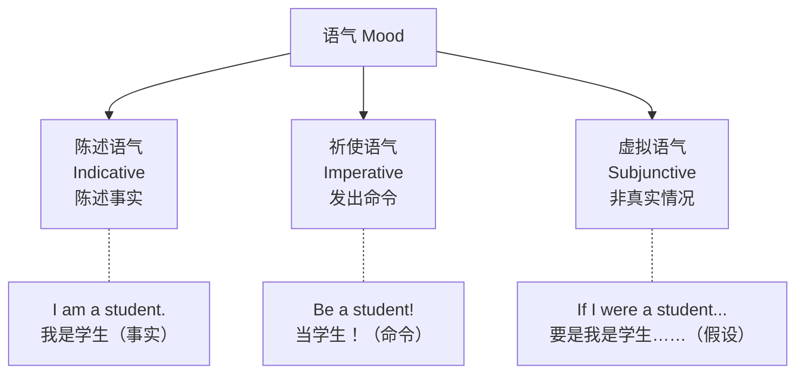
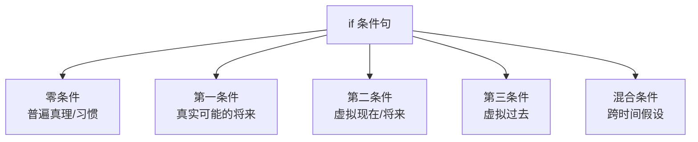
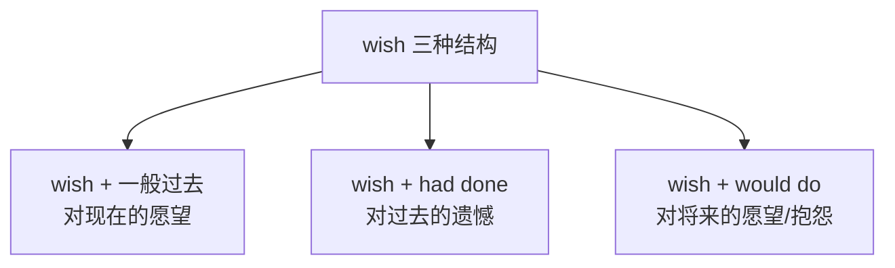

# 虚拟语气完全解析

> [!info] 本篇定位
> 虚拟语气（Subjunctive Mood）是英语学习的**三大难点之一**（另外两个是时态和从句）。
>
> 为什么难？因为**中文没有虚拟语气**——我们用"如果……就……"表达所有假设；而英语用**动词变形**来表达"与事实相反"的意思。
>
> 读完本篇，你会掌握：
>
> - 用英语说"**要是我是你就好了**"（虚拟现在）
> - 用英语说"**要是我当时没辞职就好了**"（虚拟过去）
> - 用英语说"**我希望我会飞**"（wish 句型）
> - 用英语说"**他好像见过鬼**"（as if 句型）
> - 在**正式场合**自信使用建议/命令/要求类虚拟
>
> 这些能力让你从"说大白话"升级到"有深度、有层次"的表达。

---

## 1. 本篇导读：虚拟语气是什么

### 1.1 陈述 vs 虚拟

英语有三种"**语气（Mood）**"：



### 1.2 虚拟语气表达什么

**虚拟语气**表达**与事实相反**、**不可能实现**、**纯粹假设**、**愿望/遗憾/建议**等。

**对比**：

```
陈述：I am in China.           (事实：我在中国。)
虚拟：If I were in Paris now,  (假设：要是我现在在巴黎……，但实际不在)
     I would be happy.

陈述：I didn't study hard.      (事实：我没努力学。)
虚拟：If I had studied harder, (假设：要是我当初努力了……，但实际没有)
     I would have passed.
```

### 1.3 虚拟语气的核心特征：时态错位

**虚拟语气有一个特殊规律：时态"退一步"**。

```
表达"现在的假设"→ 用"一般过去"形式
表达"过去的假设"→ 用"过去完成"形式
```

这种"**时态错位**"就是识别虚拟语气的**最大特征**。

---

## 2. if 条件句的三兄弟

if 条件句是虚拟语气最常见的形式。按"现实性"分为 **3 种**（有的语法书分 4 种，加上零条件句）：



其中：
- **零条件、第一条件** → **陈述语气**（真实情况）
- **第二条件、第三条件、混合** → **虚拟语气**（与事实相反）

---

## 3. 零条件句：普遍真理

### 3.1 公式

```
If + 一般现在, 一般现在
```

### 3.2 使用场景

表达**普遍真理、科学事实、习惯性因果**——"**只要 A，就 B**"。

```
If you heat water, it boils.            (水加热就沸腾。)
If it rains, the ground gets wet.       (下雨地就湿。)
If people eat too much, they gain weight. (吃太多就会长胖。)
```

### 3.3 特点

- **两边都用一般现在**
- **不是虚拟**，是**真实**的因果
- 可以用 `when` 替代 `if`

```
If it rains, I stay home.
= When it rains, I stay home.    (都表"下雨时")
```

---

## 4. 第一条件句：真实可能的将来

### 4.1 公式

```
If + 一般现在, will + 动词原形
```

**注意**：if 从句用一般现在，但**表将来意义**。**从句不能用 will**。

### 4.2 使用场景

表达**将来可能发生**的真实情况——"**如果……将会……**"。

```
If it rains tomorrow, I will stay home.
(明天下雨我就待家——真的可能下雨。)

If you study hard, you will pass.
(努力学习就能通过——真的可能。)

If I see him, I will tell him.
(要是见到他我就告诉他——可能见到。)
```

### 4.3 第一条件的变体

**用其他情态代替 will**：

```
If you finish early, you can leave.             (你早做完就能走——许可)
If it rains, we should stay inside.             (下雨我们该待屋内——建议)
If you miss the bus, you may be late.           (错过车可能迟到——可能性)
If he calls, tell him I'm busy.                 (他打来告诉他我忙——祈使)
```

### 4.4 第一条件 vs 零条件

| 区别 | 零条件 | 第一条件 |
| ---- | ---- | ---- |
| 语义 | 普遍真理 | 具体的将来可能 |
| 主句 | 一般现在 | will + 原形 |
| 可能性 | 100%（一定发生）| 较高（可能发生）|

**对比**：

```
零条件：If you press the button, the door opens.  (只要按按钮，门就开——机器原理)
第一条件：If you press the button now, the door will open. (你现在按，门就会开——具体动作)
```

### 4.5 第一条件典型例句（10 个）

> [!success] 第一条件句例句
>
> 1. `If it's sunny tomorrow, we'll go to the beach.`（明天出太阳就去海滩。）
> 2. `If you need help, call me.`（需要帮助就打给我。）
> 3. `If I have time, I will visit you.`（有时间我就去看你。）
> 4. `If she comes, we'll start the meeting.`（她来了我们就开始。）
> 5. `If you don't hurry, you'll miss the train.`（不快点就赶不上火车。）
> 6. `If he asks, tell him the truth.`（他问就告诉他真相。）
> 7. `If I see her, I'll give her your message.`（见到她我就转达。）
> 8. `If the weather is good, we can have a picnic.`（天好就能野餐。）
> 9. `If I get the job, I will move.`（得到工作我就搬家。）
> 10. `If you're tired, you should rest.`（你累了就该休息。）

---

## 5. 第二条件句：虚拟现在/将来

### 5.1 公式

```
If + 一般过去, would + 动词原形
```

**注意 1**：if 从句用**一般过去**，但**表示现在或将来**的假设。

**注意 2**：be 动词**一律用 were**（不管主语）——这是最重要的虚拟标记。

### 5.2 使用场景

表达**与现在事实相反**或**不太可能实现的将来**的假设——"**要是……就……**"。

```
If I were you, I would accept the offer.
(要是我是你，我会接受——但我不是你。)

If I had more money, I would buy a house.
(要是我有更多钱，我会买房——但我没有。)

If it rained tomorrow, I would stay home.
(明天要是下雨我会待家——但不太可能下雨。)
```

### 5.3 关键：be 动词用 were

虚拟语气中，**所有人称的 be 动词都用 were**（不是 was）。

```
正式/标准：If I were you...
口语中偶尔：If I was you...  (不标准，考试不建议)
```

**记忆口诀**：`If I were...`（是虚拟的标志）；`If I was...`（过去陈述）。

### 5.4 第二条件 vs 第一条件

**最大区别**：**现实性**。

| 区别 | 第一条件 | 第二条件 |
| ---- | ---- | ---- |
| 现实性 | 可能实现 | 不太可能/不能 |
| if 从句 | 一般现在 | 一般过去 |
| 主句 | will + 原形 | would + 原形 |
| be 动词 | 正常变化 | 全用 were |

**对比**：

```
第一条件：If it rains tomorrow, I will stay home.
(明天可能下雨，真的有这个可能。)

第二条件：If it rained tomorrow, I would stay home.
(明天不太可能下雨，但假设一下。)

第一条件：If I have money, I will buy a car.
(有钱我就买车——也许以后会有。)

第二条件：If I had money, I would buy a car.
(要是我有钱就买车——但现在没有。)
```

### 5.5 第二条件典型例句（10 个）

> [!success] 第二条件句例句
>
> 1. `If I were rich, I would travel the world.`（要是我有钱就环游世界。）
> 2. `If I had wings, I would fly to you.`（要是我有翅膀就飞向你。）
> 3. `If she were here, she would know what to do.`（要是她在这儿就知道怎么办。）
> 4. `If I knew his number, I would call him.`（要是我知道他电话就打。）
> 5. `If you lived closer, we could meet more often.`（你住得近点我们能多见。）
> 6. `If I were taller, I could reach it.`（要是我高点就够得着。）
> 7. `If I had more time, I would learn French.`（要是有时间就学法语。）
> 8. `What would you do if you won the lottery?`（要是中彩票你会做什么？）
> 9. `If I were you, I wouldn't do that.`（要是我是你就不会那么做。）
> 10. `If it weren't raining, we could go out.`（要不是下雨我们能出去。）

### 5.6 `If I were you...` 万能句型

**`If I were you, I would/wouldn't...`** 是**最常用**的虚拟表达，用来**给建议**。

```
If I were you, I would accept the offer.
If I were you, I wouldn't give up.
If I were you, I would talk to him.
If I were you, I would take the job.
```

---

## 6. 第三条件句：虚拟过去

### 6.1 公式

```
If + 过去完成 (had done), would have + 过去分词
```

### 6.2 使用场景

表达**与过去事实相反**的假设——"**要是当初……，就……**"。

这是**表达遗憾、后悔、反事实**的专用句型。

```
If I had studied harder, I would have passed the exam.
(要是我当初努力学，就考过了——但没努力，没考过。)

If you had told me earlier, I would have come.
(要是你早告诉我，我就来了——但没早说。)

If he hadn't left, he would have met her.
(要是他没走，就能见到她——但他走了。)
```

### 6.3 公式详解

**两个部分**：

- **if 从句**：`had + 过去分词`（过去完成时）
- **主句**：`would/could/might have + 过去分词`

**变体（主句用其他情态）**：

```
If I had known, I would have told you.         (我会告诉你)
If I had known, I could have helped.           (我本可以帮忙)
If I had known, I might have come.             (我可能会来)
```

### 6.4 第三条件典型例句（10 个）

> [!success] 第三条件句例句
>
> 1. `If I had known, I would have come.`（我要是知道就来了。）
> 2. `If you had asked, I would have helped.`（你要是问我就帮了。）
> 3. `If we had left earlier, we wouldn't have been late.`（早点走就不会迟到。）
> 4. `If she had studied medicine, she would have become a doctor.`（要是她学医早当医生了。）
> 5. `If I hadn't missed the bus, I would have been on time.`（没错过公交就准时了。）
> 6. `If he had worked harder, he would have got promoted.`（他要是更努力就升职了。）
> 7. `If it hadn't rained, we would have had a picnic.`（不下雨我们就野餐了。）
> 8. `If I had listened to my parents, I wouldn't have made this mistake.`（听父母话就不会犯这错。）
> 9. `What would you have done if I hadn't called?`（我没打你会怎么办？）
> 10. `If they had known the truth, they might have changed their minds.`（知道真相或许会改主意。）

---

## 7. 混合条件句

### 7.1 什么是混合条件

**混合条件** = if 从句和主句的时间**不一样**。

最常见的是：**过去条件 + 现在结果**。

### 7.2 公式

```
If + 过去完成, would + 动词原形
```

注意：主句用 `would + 原形`（不是 would have done）。

### 7.3 使用场景

表达"**如果过去……，现在就……**"。

```
If I had studied harder (过去), I would be a doctor now (现在).
(要是我当初努力学，现在就是医生了。)

If he hadn't married her (过去), he would be single now (现在).
(要是他当初没娶她，现在就单身了。)

If we had bought that house (过去), we would be rich now (现在).
(要是当初买了那房子，现在就富了。)
```

### 7.4 反向混合

也可以是：**现在条件 + 过去结果**（较少见）。

```
If I were a good cook, I wouldn't have burned the dinner.
(要是我厨艺好，就不会烧糊了。)
```

---

## 8. if 条件句的特殊形式

### 8.1 省略 if 的倒装

**如果 if 从句中有 `were / had / should`，可以省略 if，把这些词提前**。

**1. Were 型（第二条件）**

```
原：If I were you, I would go.
倒：Were I you, I would go.

原：If it were sunny, we'd go out.
倒：Were it sunny, we'd go out.
```

**2. Had 型（第三条件）**

```
原：If I had known, I would have come.
倒：Had I known, I would have come.

原：If you had told me, I could have helped.
倒：Had you told me, I could have helped.
```

**3. Should 型（更不可能的将来）**

```
原：If you should need help, call me.
倒：Should you need help, call me.

原：If it should rain, we'll cancel.
倒：Should it rain, we'll cancel.
```

> [!tip] 倒装虚拟更正式
>
> 倒装形式**更正式**，常用于：
> - 商务邮件
> - 正式演讲
> - 学术写作
>
> 口语中还是用 if 更多。

### 8.2 替代 if 的连词

**这些连词可以引导条件句，意思略有不同**：

| 连词 | 意思 | 例句 |
| ---- | ---- | ---- |
| unless | 除非（= if not）| Unless it rains, we'll go. |
| provided (that) | 假如，只要 | Provided you're free, let's meet. |
| supposing (that) | 假如 | Supposing it rains, what'll we do? |
| on condition that | 条件是 | I'll go on condition that you come. |
| as long as | 只要 | As long as you try, it's fine. |
| in case | 以防，万一 | Take an umbrella in case it rains. |

**unless 特别注意**：

```
Unless you study, you will fail.
= If you don't study, you will fail.
```

### 8.3 没有 if 的虚拟

**with / without + 名词**可以表达条件意义：

```
With more time, I could finish it.
(要是有更多时间，我能完成。)
= If I had more time, I could finish it.

Without your help, I couldn't have done it.
(没有你的帮助，我不可能做到。)
= If you hadn't helped me, I couldn't have done it.
```

**but for 也表示"要不是"**：

```
But for your help, I would have failed.
(要不是你的帮助，我就失败了。)
```

### 8.4 三种 if 条件句对比表

| 类型 | 时间 | if 从句 | 主句 | 现实性 |
| ---- | ---- | ---- | ---- | ---- |
| 第一条件 | 将来真实 | 一般现在 | will + 原 | 真实 |
| 第二条件 | 现在/将来虚拟 | 一般过去 | would + 原 | 虚拟 |
| 第三条件 | 过去虚拟 | 过去完成 | would have + done | 虚拟 |

---

## 9. wish 句型：愿望与遗憾

### 9.1 wish 的三种结构

`wish` 后面跟**宾语从句**，从句**必须用虚拟**。



### 9.2 wish + 一般过去：对现在的遗憾

**公式**：`wish + 主 + 一般过去（were/did）`

**表达**：**希望现在是……（但事实不是）**。

```
I wish I were taller.
(要是我更高就好了——但我不高。)

I wish I knew the answer.
(要是我知道答案就好了——但我不知道。)

She wishes she lived in New York.
(她希望住在纽约——但没住。)

I wish I could speak French.
(要是我会说法语就好了——但不会。)
```

### 9.3 wish + had done：对过去的遗憾

**公式**：`wish + 主 + had + 过去分词`

**表达**：**希望过去……（但实际没……）**。

```
I wish I had studied harder.
(要是我当初努力学就好了——但没有。)

She wishes she hadn't quit her job.
(她后悔辞了工作——但已经辞了。)

I wish I had told him the truth.
(要是我当初告诉他真相就好了。)

I wish I had taken that opportunity.
(要是我抓住那个机会就好了。)
```

### 9.4 wish + would do：对将来的愿望/抱怨

**公式**：`wish + 主 + would + 动词原形`

**表达**：**希望某人会做某事**（常带抱怨/不满）。

```
I wish it would stop raining.
(真希望别再下雨了——带无奈/抱怨。)

I wish he would stop complaining.
(真希望他别再抱怨了。)

I wish you wouldn't talk so loudly.
(真希望你别这么大声说话。)

I wish the meeting would end.
(真希望会议结束。)
```

> [!warning] wish would do 的限制
>
> **主语不能是 I**：不能说 `I wish I would...`（因为你自己就能决定）
>
> - ❌ `I wish I would be happy.`
> - ✅ `I wish I were happy.`

### 9.5 wish vs hope

**wish** 用于**不太可能**或**虚拟**的愿望。
**hope** 用于**真实可能**的希望，用一般时态。

```
I hope you pass the exam.          (我希望你通过考试——真实。)
I wish you would pass the exam.    (我希望你能通过——带虚拟意味。)

I hope it won't rain tomorrow.     (我希望明天别下雨——真希望。)
I wish it would stop raining.      (真希望别下了——抱怨。)
```

### 9.6 wish 典型例句（15 个）

> [!success] wish 句型例句
>
> **wish + 一般过去（现在）**
> 1. `I wish I had more time.`（要是我有更多时间就好了。）
> 2. `I wish I were a better person.`（要是我更好就好了。）
> 3. `She wishes she could fly.`（她希望会飞。）
> 4. `I wish you were here.`（多希望你在这儿。）
> 5. `I wish I knew what to do.`（要是我知道怎么办就好了。）
>
> **wish + had done（过去）**
> 6. `I wish I had studied abroad.`（要是我当初出国留学就好了。）
> 7. `I wish I hadn't said that.`（我不该那样说的。）
> 8. `She wishes she had listened.`（她后悔没听。）
> 9. `I wish I had met you earlier.`（要是我早点遇到你就好了。）
> 10. `I wish I had saved more money.`（后悔没多存点钱。）
>
> **wish + would do（将来/抱怨）**
> 11. `I wish it would snow.`（真希望下雪。）
> 12. `I wish he would stop smoking.`（真希望他戒烟。）
> 13. `I wish you would be more careful.`（希望你能更小心点。）
> 14. `I wish the bus would come.`（真希望公交快来。）
> 15. `I wish they would be quiet.`（真希望他们安静点。）

---

## 10. as if / as though 句型

### 10.1 基本用法

**as if / as though** = "**好像、似乎**"，后面常跟**虚拟语气**。

**注意**：as if 和 as though **意思完全一样**，可互换。

### 10.2 三种时态

**1. 好像现在……（与现实相反）**：**as if + 一般过去**

```
He acts as if he were the boss.
(他表现得好像自己是老板——但不是。)

She walks as if she knew the place.
(她走得好像认识这地方——但不认识。)
```

**2. 好像过去……（与过去相反）**：**as if + 过去完成**

```
He looks as if he had seen a ghost.
(他看起来好像见过鬼——但没见过。)

She talks as if she had been there.
(她说得好像去过那里——但没去过。)
```

**3. 好像真的……（真实可能）**：**as if + 一般时态**

如果是真实可能的情况，用**一般时态**：

```
It looks as if it is going to rain.
(看起来真要下雨了——真的可能下。)

She sounds as if she is happy.
(她听起来真的很开心。)
```

> [!tip] 虚拟 vs 真实
>
> - 虚拟（不是事实）：**as if + 一般过去** 或 **had done**
> - 真实（可能是事实）：**as if + 一般时态**

### 10.3 典型例句（10 个）

> [!success] as if / as though 例句
>
> 1. `He speaks as if he knew everything.`（他说得好像无所不知。）
> 2. `She looks as if she were angry.`（她看起来好像生气了。）
> 3. `They act as though they owned the place.`（他们表现得好像这是他们的。）
> 4. `He treated me as if I were a child.`（他待我像小孩。）
> 5. `She cried as if her heart were broken.`（她哭得像心碎了。）
> 6. `He looks as if he had been running.`（他看起来好像一直在跑。）
> 7. `I feel as if I had known you forever.`（感觉好像认识你一辈子。）
> 8. `It seems as though nothing had happened.`（好像什么都没发生。）
> 9. `She sang as if she were a professional.`（她唱得像专业歌手。）
> 10. `It's as if time stood still.`（时间好像停了。）

---

## 11. would rather 句型

### 11.1 用法 1：would rather + 动词原形（做自己的事）

表示"**我宁愿（自己）做某事**"。

```
I would rather stay home.              (我宁愿待家。)
She would rather not go.               (她宁愿不去。)
I'd rather have tea than coffee.       (我宁愿喝茶而不是咖啡。)
```

**否定**：**would rather not + 原形**

### 11.2 用法 2：would rather + 从句（希望别人做/不做）

**公式**：**would rather + 主语 + 一般过去 / had done**

**表达**：**宁愿别人（做过去的/现在的事）**。

```
I would rather you went now.           (我宁愿你现在就走。——现在)
I would rather you didn't smoke here.  (我宁愿你别在这儿抽烟。)
I'd rather she hadn't called me.       (我宁愿她没给我打电话。——过去)
```

### 11.3 would rather vs prefer

```
would rather + 原形 = prefer + to do
would rather A than B = prefer A to B

I'd rather watch movies than read.
= I prefer watching movies to reading.
```

---

## 12. It's time + 过去：该……了

### 12.1 公式

```
It's (high / about) time + 主语 + 一般过去
```

### 12.2 用法

表示"**该做某事了（但还没做）**"，带**催促、不满**意味。

```
It's time you went to bed.              (该睡觉了。)
It's high time he got a job.            (他早该找工作了。)
It's about time she apologized.         (她也该道歉了。)
It's time we left.                      (该走了。)
```

**注意**：虽然 `went/got/apologized` 是过去式，但意思是**现在该做**（虚拟）。

### 12.3 也可用 to do

```
It's time to go.                        (该走了。)
It's time to have dinner.               (该吃晚饭了。)
```

**区别**：
- `It's time to do` —— 泛泛地"到时候做了"
- `It's time + 主 + 过去` —— 特指某人该做**（但还没做）**

---

## 13. suggest 类动词后的虚拟

### 13.1 核心规则

**表达"建议、命令、要求、坚持、必要"**的动词后面，如果跟 that 从句，**从句必须用虚拟**。

**公式**：**that + 主 + (should) + 动词原形**

`should` 可以**省略**，只留动词原形。

### 13.2 触发虚拟的动词清单

**建议类**：suggest, recommend, advise, propose
**要求类**：demand, request, require, ask, insist
**命令类**：order, command
**重要形容词**：important, necessary, essential, vital, crucial, imperative
**表达"重要性"**：It is + 上述形容词 + that...

### 13.3 典型用法

**动词 + that 从句**：

```
She suggested that he (should) go to the doctor.
(她建议他去看医生。)

I recommend that you (should) try this.
(我建议你试试这个。)

The boss demanded that the report (should) be finished today.
(老板要求今天完成报告——注意被动。)

They insisted that we (should) stay longer.
(他们坚持要我们多待会儿。)
```

**形容词 + that 从句**：

```
It is important that he (should) arrive on time.
(他准时到很重要。)

It is necessary that we (should) take action.
(我们采取行动很必要。)

It is essential that the work (should) be done carefully.
(这活儿必须小心做。)
```

### 13.4 注意：动词必须是原形（第三人称也是！）

> [!warning] 关键规则
>
> 虚拟的 `(should) + 原形` 结构中，**动词永远是原形**，**不加 -s**：
>
> - ❌ `She suggested that he goes to bed.`
> - ✅ `She suggested that he (should) go to bed.`
>
> - ❌ `It is important that he is on time.`
> - ✅ `It is important that he (should) be on time.`

### 13.5 suggest 的两种用法区分

**suggest 有两种意思**：

**意思 1：建议**（用虚拟）

```
He suggested that she take a break.
(他建议她休息一下。)
```

**意思 2：暗示、表明**（用陈述语气）

```
Her smile suggested that she was happy.
(她的笑表明她很开心。)
```

### 13.6 典型例句（10 个）

> [!success] 建议/要求类虚拟例句
>
> 1. `I suggest that you see a doctor.`（我建议你看医生。）
> 2. `She recommended that he study harder.`（她建议他更努力学习。）
> 3. `The teacher required that all students be present.`（老师要求所有学生到场。）
> 4. `The manager insisted that the meeting start on time.`（经理坚持会议准时开始。）
> 5. `They demanded that he apologize.`（他们要求他道歉。）
> 6. `It is essential that everyone know the rules.`（所有人都知道规则很关键。）
> 7. `It is important that she be informed.`（告诉她很重要。）
> 8. `I propose that we take a different approach.`（我建议换个方法。）
> 9. `The law requires that drivers wear seat belts.`（法律要求司机系安全带。）
> 10. `It is necessary that the document be signed.`（文件必须签字。）

---

## 14. 其他虚拟表达

### 14.1 if only 句型

**if only** = "**要是……就好了**"，比 wish **更强烈**的情感。

```
If only I were rich!                   (要是我富有就好了！)
If only you had told me earlier!       (你要是早告诉我就好了！)
If only it would stop raining!         (要是不下雨就好了！)
```

结构和 wish 完全相同（一般过去 / had done / would do）。

### 14.2 but for / without

**but for + 名词** = "**要不是……**"

```
But for your help, I would have failed.
(要不是你的帮助，我就失败了。)

Without you, I couldn't do it.
(没有你，我做不到。)
```

### 14.3 may / might 表愿望

```
May you be happy!                      (愿你幸福！)
May the force be with you!             (愿原力与你同在！——星球大战)
Long live the king!                    (国王万岁！)
```

### 14.4 lest / for fear that（以防）

**lest / for fear that + 主 + (should) + 原形**：以防、唯恐

```
He studies hard lest he (should) fail.
(他努力学习以防考不过。)

She spoke quietly for fear that the baby would wake.
(她小声说话，唯恐吵醒宝宝。)
```

---

## 15. 虚拟语气综合对比表

### 15.1 所有虚拟结构一览

| 结构 | 时间 | 公式 | 例句 |
| ---- | ---- | ---- | ---- |
| 第二条件 | 现在/将来虚拟 | if + 过去, would + 原 | If I were you... |
| 第三条件 | 过去虚拟 | if + had done, would have + done | If I had known... |
| 混合条件 | 跨时间 | if + had done, would + 原 | If I had studied, I would be a doctor now |
| wish 现在 | 现在遗憾 | wish + 过去 | I wish I were taller |
| wish 过去 | 过去遗憾 | wish + had done | I wish I had studied |
| wish 将来 | 愿望/抱怨 | wish + would do | I wish it would stop |
| as if 虚拟 | 好像…… | as if + 过去/had done | He talks as if he knew |
| would rather 从句 | 宁愿…… | would rather + 过去/had done | I'd rather you went |
| It's time + 从句 | 该…… | It's time + 过去 | It's time you left |
| suggest 类 | 建议/要求 | suggest that + 原 | I suggest (that) he go |

---

## 16. 场景实战：虚拟语气在日常对话中

**场景**：朋友聊人生

```
Mary: "How's your job?"
John: "Not great. I wish I had a different job."
                 [wish + 过去，对现在的愿望]
Mary: "Why don't you change?"
John: "If I had more experience, I could."
                 [第二条件，虚拟现在]
Mary: "You should've studied more languages in college."
                 [should have done，对过去的遗憾]
John: "Yeah, I wish I had. If I had learned French,
      I'd be working in Paris now."
                 [wish 过去 + 混合条件]
Mary: "It's not too late. If I were you, I'd start now."
                 [If I were you 给建议]
John: "Easy for you to say. If only I had more time."
                 [if only，强烈遗憾]
Mary: "I suggest that you take a language class."
                 [suggest 类，建议]
John: "Thanks. I feel as if I were stuck in a rut."
                 [as if 虚拟]
Mary: "Were I in your position, I would try something new."
                 [倒装虚拟]
John: "You're right. It's time I made a change."
                 [It's time + 过去]
Mary: "If you had asked me earlier, I could have helped more."
                 [第三条件，过去虚拟]
```

**统计**：一段对话用到了 **10+ 种虚拟结构**，这就是母语者的自然表达。

---

## 17. 虚拟语气常见错误

### 17.1 错误 1：be 动词用 was 不用 were

```
❌ If I was you, I would go.
✅ If I were you, I would go.
   (虚拟中 be 用 were)
```

### 17.2 错误 2：从句用 will

```
❌ If it will rain, I will stay.
✅ If it rains, I will stay.
   (第一条件 if 从句不用 will)
```

### 17.3 错误 3：时态选错

```
❌ If I knew earlier, I would tell you. (表过去要用 had known)
✅ If I had known earlier, I would have told you.
```

### 17.4 错误 4：wish 用陈述

```
❌ I wish I am taller.
✅ I wish I were taller.
   (wish 后用虚拟)
```

### 17.5 错误 5：suggest 后加 to do

```
❌ He suggested me to go.
✅ He suggested that I (should) go.
   (suggest 不用不定式宾语)
```

### 17.6 错误 6：as if 该虚拟时用陈述

```
❌ He talks as if he knows everything. (实际不知道时)
✅ He talks as if he knew everything.
```

### 17.7 错误 7：It's time + 原形

```
❌ It's time you go.
✅ It's time you went.
   (It's time 后用过去式)
```

---

## 18. 练习与输出建议

> [!success] 本篇练习清单
>
> **if 条件句练习**
>
> 1. 判断下列句子用哪种条件句：
>    - 要是明天下雨，我就待家。
>    - 要是我是你，我会辞职。
>    - 要是我当初听话，就不会犯错了。
>    - 要是你早告诉我，我现在就不会这么难受。
>
> 2. 翻译上面 4 句为英语。
>
> **wish 练习**
>
> 3. 用 wish 造句：
>    - 希望自己身高再高点。
>    - 后悔没学医。
>    - 希望室友别总熬夜。
>
> **综合应用**
>
> 4. 写一段 10 句话的英文，描述你对**人生某方面的遗憾和愿望**，要求使用：
>    - 至少 1 处第二条件
>    - 至少 1 处第三条件
>    - 至少 1 处 wish + 过去
>    - 至少 1 处 wish + had done
>    - 至少 1 处 If I were you
>
> **高阶挑战**
>
> 5. 把下列句子用**倒装**改写：
>    - If I were rich, I'd travel the world. → ?
>    - If you had helped, it would have been easier. → ?
>    - If you should need me, call. → ?
>
> 6. 用 **suggest / recommend / demand** 各造 2 个句子，用虚拟。

### 18.1 参考答案

**练习 1-2**：
- 第一条件：`If it rains tomorrow, I will stay home.`
- 第二条件：`If I were you, I would quit.`
- 第三条件：`If I had listened, I wouldn't have made mistakes.`
- 混合条件：`If you had told me, I wouldn't be feeling so bad now.`

**练习 5（倒装）**：
- `Were I rich, I'd travel the world.`
- `Had you helped, it would have been easier.`
- `Should you need me, call.`

---

## 19. 本篇小结

> [!success] 本篇核心要点回顾
>
> **虚拟语气 = 表达与事实相反、愿望、遗憾、建议**
>
> **核心规律**：**时态退一步**
>
> **三大 if 条件句**：
> - 第一条件：真实可能 → if + 现在, will + 原
> - 第二条件：虚拟现在/将来 → if + 过去, would + 原
> - 第三条件：虚拟过去 → if + had done, would have + done
>
> **混合条件**：过去 + 现在/过去 + 将来的跨时间假设
>
> **wish 三种**：
> - wish + 过去（现在遗憾）
> - wish + had done（过去遗憾）
> - wish + would do（将来愿望/抱怨）
>
> **as if / as though**：
> - 虚拟用过去/had done
> - 真实用一般时态
>
> **其他结构**：
> - would rather + 从句：用过去/had done
> - It's time + 主语 + 过去：该做了
> - suggest 类 + (should) + 原形
> - if only：强烈愿望/遗憾
> - but for / without：要不是
>
> **倒装虚拟**：省略 if，把 were/had/should 提前
>
> **易错**：
> - 虚拟 be 用 were
> - 第一条件 if 从句不用 will
> - suggest 不接 to do
> - It's time 后用过去式

### 19.1 下一篇预告

> [!info] 下一篇：04.情态动词句型框架
>
> 下一篇讲**情态动词**——英语表达"**可能、必须、应该、愿意、过去习惯**"等语气的关键。
>
> - `can / could`：能力、许可、可能
> - `may / might`：许可、可能
> - `must`：必须、肯定
> - `should / ought to`：应该
> - `would`：愿意、过去习惯、假设
> - `shall`：（英式）将、询问
> - `need / dare`：需要、敢
>
> 还会讲 **情态动词 + have done**（对过去的推测/后悔）。
>
> 下一篇讲完，**03.时态与语态句型框架**分类就完成了！
