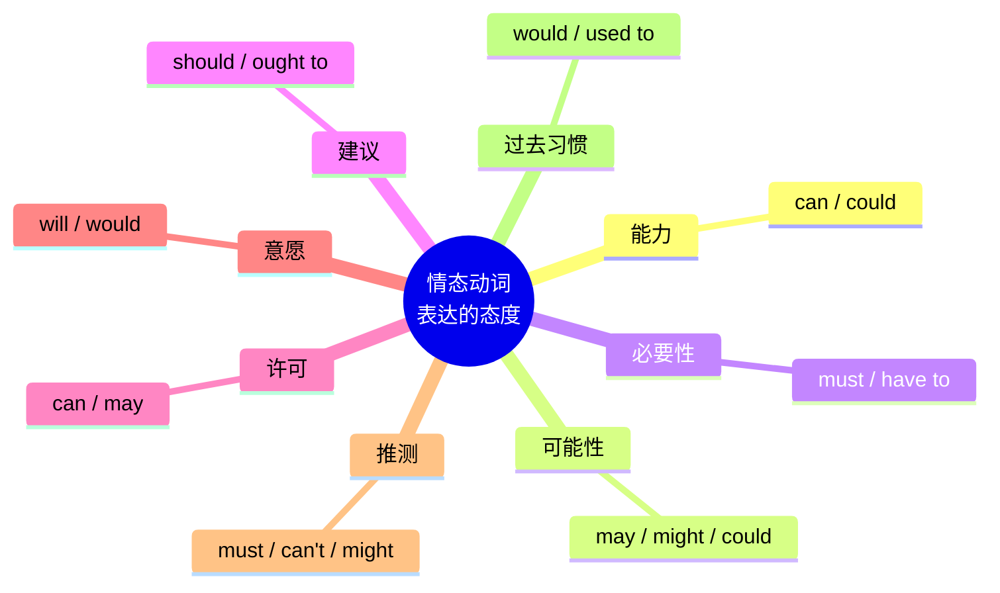
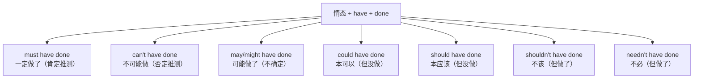

# 情态动词句型框架

> [!info] 本篇定位
> **情态动词（Modal Verbs）** 是英语**表达语气和态度**的核心工具。
>
> 同样是"做一件事"，用不同的情态动词表达的意思完全不同：
>
> - `I **must** go.`（我必须走——强制）
> - `I **should** go.`（我应该走——义务）
> - `I **can** go.`（我能走——能力）
> - `I **may** go.`（我或许会走——可能性）
> - `I **could** go.`（我可以走——可能/委婉）
> - `I **will** go.`（我要走——意愿）
> - `I **would** go.`（我会走——委婉/假设）
>
> 掌握情态动词，你的英语会**立刻从"平铺直叙"变成"有层次、有态度"**。
>
> 本篇是 **03.时态与语态句型框架**分类的**收官篇**，也是这个分类最实用的一篇。

---

## 1. 本篇导读：为什么情态动词这么重要

### 1.1 情态动词表达什么

**情态动词** = 表达**说话人态度、语气、判断**的动词。

它们不表达具体动作，而是表达**对动作的态度**：



### 1.2 情态动词的使用频率

**前 5 名最常用**：

```
1. will / would  →  表愿意、习惯、假设
2. can / could   →  表能力、许可、可能
3. should        →  表应该
4. must          →  表必须、肯定
5. may / might   →  表可能、许可
```

这 5 对情态动词覆盖了**日常使用的 90%**。

---

## 2. 情态动词的共同特征

在学具体情态动词前，先搞清楚它们的**共同规则**。

### 2.1 9 大共同特征

**特征 1：后面只能跟动词原形**

```
✅ I can swim.                    (原形 swim)
❌ I can swims.
❌ I can swimming.
❌ I can to swim.
```

**特征 2：没有人称变化（第三人称不加 s）**

```
✅ He can swim.                   (注意：不是 cans)
✅ She must go.                   (不是 musts)
```

**特征 3：没有自己的过去式**（大部分只有一两种形态）

```
can → could（过去/虚拟）
will → would（过去/虚拟）
may → might（过去/虚拟）
shall → should（作"应该"时）
must → 无过去（用 had to 代替）
```

**特征 4：自身就是助动词，不用 do/does/did**

```
否定：直接加 not
  I can't swim.  (不是 I don't can swim.)

疑问：直接倒装
  Can you swim? (不是 Do you can swim?)
```

**特征 5：不能用进行时和完成时**

```
❌ I am canning...
❌ I have canned...
```

但可以跟 have + 过去分词，表示**对过去的推测**（见第 10 节）。

**特征 6：不与其他情态动词连用**

```
❌ I will can swim.
✅ I will be able to swim.
   (用 be able to 代替)
```

**特征 7：没有不定式形式**

```
❌ to can, to must, to should
```

**特征 8：shall / will 表将来时的"助动词"用法是例外**

`I will go.` 中 will 既是情态动词（表意愿）也是将来时助动词。

**特征 9：情态动词的否定和缩写**

| 情态 | 缩写否定 |
| ---- | ---- |
| cannot | can't |
| could not | couldn't |
| will not | won't |
| would not | wouldn't |
| should not | shouldn't |
| must not | mustn't |
| may not | mayn't (极少用) |
| might not | mightn't (少用) |

---

## 3. can / could：能力、许可、可能

### 3.1 can 的 4 大用法

**用法 1：能力（"能够"）**

```
I can swim.                         (我会游泳。)
She can speak three languages.      (她会三种语言。)
Dogs can hear high-pitched sounds.  (狗能听到高频声音。)
```

**用法 2：许可（"可以"）**

```
You can leave now.                  (你现在可以走。)
Can I have some water?              (我能喝点水吗？)
Can I use your phone?               (能借用你的电话吗？)
```

**用法 3：可能性（理论上的可能）**

```
It can be very cold in winter.      (冬天可能很冷。)
Accidents can happen anywhere.      (事故到处都可能发生。)
```

**用法 4：请求（"能……吗"）**

```
Can you help me?                    (你能帮我吗？)
Can you pass the salt?              (能把盐递给我吗？)
```

### 3.2 could 的 4 大用法

**用法 1：can 的过去式（过去的能力）**

```
I could swim when I was 5.          (我 5 岁时会游泳。)
She could speak French as a child.  (她小时候会说法语。)
```

**用法 2：礼貌的请求（比 can 更礼貌）**

```
Could you help me, please?          (您能帮我吗？——比 can 更礼貌)
Could I borrow your pen?            (我能借你的笔吗？)
```

**用法 3：推测/可能（可能性较小）**

```
She could be at home.               (她可能在家——不确定。)
It could rain tomorrow.             (明天可能下雨。)
```

**用法 4：虚拟（与事实相反）**

```
If I had time, I could help you.    (要是我有时间就能帮你。)
I wish I could fly.                 (要是我会飞就好了。)
```

### 3.3 can vs be able to

**can** 和 **be able to** 都表"**能**"，但有区别：

| 场景 | can | be able to |
| ---- | ---- | ---- |
| 一般能力 | ✓（首选）| ✓ |
| 过去成功做成某事 | ✗ | ✓ |
| 将来能力 | 用 will be able to | ✓ |
| 完成时 | ✗ | ✓（have been able to）|

**对比**：

```
一般能力：
  I can swim. ✓
  I am able to swim. ✓（较正式）

过去的"成功完成"：
  I was able to finish the work yesterday. ✓
  I could finish the work yesterday. ✗（错，用 was able to）

过去一般能力：
  I could swim when I was young. ✓
```

> [!tip] 小规则
>
> **过去的"具体成就"用 was/were able to**，不用 could。
>
> - `I could speak French as a child.` ✓ (一般能力)
> - `I could speak French to the waiter yesterday.` ✗ (具体事件)
> - `I was able to speak French to the waiter yesterday.` ✓

### 3.4 典型例句（10 个）

> [!success] can / could 例句
>
> 1. `I can drive a car.`（我会开车。）
> 2. `Can you swim?`（你会游泳吗？）
> 3. `You can leave early today.`（你今天可以早走。）
> 4. `Could you tell me the time?`（能告诉我几点吗？）
> 5. `I could walk when I was one.`（我 1 岁就会走路了。）
> 6. `It could be true.`（有可能是真的。）
> 7. `Can I come in?`（我可以进来吗？）
> 8. `She couldn't find her keys.`（她找不到钥匙。）
> 9. `We can't afford a new car.`（我们买不起新车。）
> 10. `Could you pass me the menu?`（能把菜单递给我吗？）

---

## 4. may / might：许可、可能

### 4.1 may 的 3 大用法

**用法 1：许可（比 can 更正式）**

```
May I come in?                      (我可以进来吗？——正式)
You may leave now.                  (你现在可以走了。)
You may not smoke here.             (此处不许吸烟。)
```

**用法 2：可能性**

```
It may rain tomorrow.               (明天可能下雨。)
She may be at the office.           (她可能在办公室。)
```

**用法 3：祝愿（正式/书面）**

```
May you be happy!                   (愿你幸福！)
May the Force be with you!          (愿原力与你同在！)
Long may she reign!                 (愿她长久统治！)
```

### 4.2 might 的 2 大用法

**用法 1：可能性（比 may 更不确定）**

```
It might rain tomorrow.             (明天可能下雨——不太确定。)
She might come.                     (她可能来——也可能不来。)
```

**用法 2：委婉请求/建议**

```
You might want to try this.         (你或许可以试试这个。)
Might I suggest another approach?   (我能提议另一种方法吗？)
```

### 4.3 may vs might 可能性对比

**可能性程度**：

```
will > must > should > may > might > could
100%    90%     80%     60%    40%     30%
```

- `It will rain.` —— 确定会下
- `It must rain.` —— 肯定会下（强推测）
- `It should rain.` —— 应该会下
- `It may rain.` —— 可能会下
- `It might rain.` —— 或许会下
- `It could rain.` —— 有可能下

### 4.4 典型例句（10 个）

> [!success] may / might 例句
>
> 1. `May I ask a question?`（我可以问个问题吗？）
> 2. `You may sit down.`（你可以坐。）
> 3. `It may snow tonight.`（今晚可能下雪。）
> 4. `She may be tired.`（她可能累了。）
> 5. `You may not use your phone.`（不许用手机。）
> 6. `I might go to the party.`（我可能会去派对。）
> 7. `He might not remember.`（他可能不记得。）
> 8. `May your dreams come true.`（愿你美梦成真。）
> 9. `Might I have a word with you?`（我能和您谈谈吗？）
> 10. `That might be a good idea.`（那也许是个好主意。）

---

## 5. must / have to：必须

### 5.1 must 的 3 大用法

**用法 1：必须（内在义务、说话人的判断）**

```
I must study harder.                (我必须更努力。)
You must wear a seatbelt.           (你必须系安全带。)
We must respect each other.         (我们必须互相尊重。)
```

**用法 2：肯定推测（"一定"）**

```
He must be at home now.             (他现在一定在家。)
You must be tired.                  (你一定累了。)
It must be raining outside.         (外面一定在下雨。)
```

**用法 3：禁止（must not = mustn't）**

```
You mustn't smoke here.             (这里禁止吸烟。)
Children mustn't cross the street alone.
(孩子不能独自过马路。)
```

### 5.2 must vs have to

两者都表"**必须**"，但有微妙区别：

| 区别 | must | have to |
| ---- | ---- | ---- |
| 义务来源 | 内在/说话人的判断 | 外在/规则/环境 |
| 正式度 | 较正式 | 较随意 |
| 过去时 | 无 | had to |
| 将来时 | 无 | will have to |

**对比**：

```
I must finish this report.
(我必须完成这报告——我自己想完成/觉得该完成。)

I have to finish this report.
(我必须完成——老板/规定要求。)

I had to work yesterday.
(我昨天必须工作——must 没有过去。)

I will have to work harder next year.
(我明年得更努力——将来要用 have to。)
```

### 5.3 must not vs don't have to

这两个否定**意思完全不同**！

**must not = mustn't** → **禁止**（不许做）

```
You mustn't park here.              (这里禁止停车。)
You mustn't tell anyone.            (你绝不能告诉任何人。)
```

**don't have to** → **不必**（可做可不做）

```
You don't have to come.             (你不必来——可以不来。)
You don't have to pay.              (你不用付钱——免费。)
```

> [!warning] 中国学生最易错的对比
>
> - `You mustn't go.` = 你**不能**去（禁止）
> - `You don't have to go.` = 你**不必**去（自由）
>
> 完全相反的意思！

### 5.4 典型例句（10 个）

> [!success] must / have to 例句
>
> 1. `I must leave now.`（我必须走了。）
> 2. `You must see this movie.`（你一定要看这电影。）
> 3. `She must be rich.`（她一定很有钱。）
> 4. `You mustn't drink and drive.`（不许酒驾。）
> 5. `We have to wear uniforms.`（我们必须穿制服。）
> 6. `I have to work on Saturday.`（我周六得工作。）
> 7. `He had to cancel the trip.`（他不得不取消旅行。）
> 8. `Do you have to go?`（你必须走吗？）
> 9. `You don't have to apologize.`（你不必道歉。）
> 10. `It must have been difficult.`（那一定很难。）

---

## 6. should / ought to：应该

### 6.1 should 的 4 大用法

**用法 1：建议/义务（"应该"）**

```
You should see a doctor.            (你应该看医生。)
We should save money.               (我们应该省钱。)
Children should respect their parents.
(孩子应该尊重父母。)
```

**用法 2：预期（"应该会"）**

```
He should be here by now.           (他现在应该到了。)
The train should arrive at 8.       (火车应该 8 点到。)
```

**用法 3：shouldn't（不应该）**

```
You shouldn't smoke.                (你不该抽烟。)
She shouldn't be late again.        (她不该再迟到了。)
```

**用法 4：正式场合的"应该"（较少用）**

```
Should you need any help, contact me.
(您若需要帮助，请联系我——正式。)
```

### 6.2 ought to

**ought to** = should（意思几乎相同）

```
You ought to apologize.             = You should apologize.
We ought to leave now.              = We should leave now.
```

**区别**：
- **should** 更常用（口语、书面）
- **ought to** 稍正式，口语中较少

### 6.3 had better

**had better + 动词原形** = "**最好……**"（带警告意味）

```
You had better go now. (否则会迟到)
You'd better not tell anyone. (否则有麻烦)
We'd better leave before it rains.
```

**注意**：
- 用 **had**（不是 would），虽然意思是"现在该……"
- 否定：**had better not + 原形**

### 6.4 should vs must vs have to

**语气强度**：

```
语气最强：must (必须——强制)
中等：    have to (必须——外部要求)
较弱：    should (应该——建议)
最弱：    might want to / could (或许可以——温和建议)
```

**对比**：

```
You must see a doctor.      (一定要看——严重情况)
You have to see a doctor.   (必须看——规定或强烈建议)
You should see a doctor.    (应该看——建议)
You might want to see a doctor. (或许可以看——温和)
```

### 6.5 典型例句（10 个）

> [!success] should / ought to 例句
>
> 1. `You should exercise more.`（你该多运动。）
> 2. `We should respect elders.`（我们该尊重长辈。）
> 3. `You shouldn't work so hard.`（你不该这么拼。）
> 4. `The meeting should end by 5.`（会议应该 5 点前结束。）
> 5. `He should be home by now.`（他现在应该到家了。）
> 6. `You ought to apologize.`（你该道歉。）
> 7. `We ought to help them.`（我们该帮他们。）
> 8. `You had better hurry.`（你最好快点。）
> 9. `You'd better not be late.`（你最好别迟到。）
> 10. `I think you should call her.`（我觉得你该给她打电话。）

---

## 7. will / would：意愿、习惯、假设

### 7.1 will 的 5 大用法

**用法 1：将来**（见时态篇）

```
I will call you tomorrow.           (我明天会给你打电话。)
```

**用法 2：意愿/决心**

```
I will always love you.             (我会永远爱你。)
I won't give up.                    (我不会放弃。)
She won't listen.                   (她不肯听。)
```

**用法 3：请求（礼貌不如 could/would）**

```
Will you help me?                   (你能帮我吗？)
Will you shut the door?             (关门好吗？)
```

**用法 4：习性/规律**

```
Oil will float on water.            (油会浮在水上——规律。)
Boys will be boys.                  (男孩就是男孩——天性。)
```

**用法 5：预测/推测**

```
That will be the mailman.           (那应该是邮递员——推测。)
He will know the answer.            (他肯定知道答案。)
```

### 7.2 would 的 6 大用法

**用法 1：will 的过去式（间接引语）**

```
He said he would call.              (他说他会打电话。)
She promised she would help.        (她答应会帮忙。)
```

**用法 2：过去习惯**（= used to，但仅限动作）

```
When I was young, I would play in the park every day.
(我年轻时每天都会在公园玩。)

He would always smoke after dinner.
(他总在晚饭后抽烟。)
```

**用法 3：礼貌请求（最礼貌）**

```
Would you please help me?           (您能帮我吗？——非常礼貌)
Would you like some coffee?         (您想来点咖啡吗？)
Would you mind opening the window?  (您介意开窗吗？)
```

**用法 4：虚拟（见虚拟语气篇）**

```
If I were you, I would go.          (要是我是你我会去。)
I would love to come.               (我很想来。)
```

**用法 5：表假设意愿**

```
I would never do that.              (我绝不会那样做。)
She wouldn't lie to me.             (她不会对我撒谎。)
```

**用法 6：would rather（宁愿）**

```
I would rather stay home.           (我宁愿待家。)
```

### 7.3 Would you like...? 句型

**最常用的礼貌询问**：

```
Would you like some tea?            (您想喝茶吗？)
Would you like to come?             (您想来吗？)
What would you like to eat?         (您想吃什么？)
```

**回答**：
- `Yes, please.` / `I'd love to.` / `That would be nice.`
- `No, thanks.` / `I'd rather not.` / `Maybe later.`

### 7.4 典型例句（10 个）

> [!success] will / would 例句
>
> 1. `I will help you.`（我会帮你。）
> 2. `He won't come.`（他不肯来。）
> 3. `Oil will float on water.`（油浮在水上。）
> 4. `That will be John.`（那一定是 John。）
> 5. `Would you open the door?`（能开下门吗？）
> 6. `I would love some coffee.`（我很想来点咖啡。）
> 7. `When I was a child, I would play outside.`（我小时候会在外面玩。）
> 8. `She wouldn't believe me.`（她不肯相信我。）
> 9. `What would you do in my situation?`（换你会怎么做？）
> 10. `I'd rather watch TV.`（我宁愿看电视。）

---

## 8. shall：英式用法、提议

### 8.1 shall 的 3 大用法

**用法 1：英式将来（主语是 I, we）**

```
I shall go.                         (我会去——英式，现在少见。)
We shall see.                       (我们将会看到。)
```

**美式英语中**：shall 几乎已被 will 代替。

**用法 2：提议（第一人称疑问）**

```
Shall we dance?                     (我们跳个舞吧？)
Shall we go?                        (我们走吧？)
Shall I open the window?            (要我开窗吗？)
```

**用法 3：命令/规定（正式文书）**

```
Employees shall arrive on time.     (员工必须准时到——正式。)
The contract shall be binding.      (合同应有法律效力。)
```

### 8.2 shall vs will

```
英式：  I shall go.
美式：  I will go.

美式：  Will we go?
英式：  Shall we go?（更常见）
```

**现代英语中 will 更常用**，shall 主要保留在：
- `Shall we...?`（提议）
- 正式合同/法律文件

### 8.3 should 是 shall 的过去式

`should` 作"应该"讲时，是 shall 的过去式变来的。

---

## 9. need / dare：需要 / 敢

### 9.1 need 的两种用法

**用法 1：作实义动词（正常变化）**

```
I need a pen.                       (我需要笔。)
She needs help.                     (她需要帮助。)
Do you need anything?               (你需要什么吗？)
```

**用法 2：作情态动词（只用于否定/疑问）**

```
You needn't come.                   (你不必来。)
Need I say more?                    (我还要多说吗？)
```

**区别**：

```
实义动词：
  She needs to go.           (主语加 s，to 加 go)

情态动词：
  She need not go.           (无 s，无 to)
```

**实义用法更常见**。

### 9.2 dare 的两种用法

**用法 1：作实义动词（正常变化）**

```
I dare to say it.                   (我敢说。)
He doesn't dare to go.              (他不敢去。)
```

**用法 2：作情态动词（否定/疑问）**

```
I dare not go.                      (我不敢去。)
How dare you!                       (你好大的胆子！)
Dare you say it?                    (你敢说吗？)
```

---

## 10. 情态动词 + have + 过去分词（对过去的评论）

### 10.1 这是情态动词最复杂的用法

**情态动词 + have + 过去分词** = **对过去事件的推测、评价、后悔**。



### 10.2 逐个详解

**1. must have done：肯定做了**

```
She must have forgotten.            (她一定是忘了。)
You must have been tired.           (你当时一定累了。)
He must have left already.          (他一定已经走了。)
```

**2. can't have done / couldn't have done：不可能做了**

```
She can't have lied.                (她不可能撒谎。)
He couldn't have known.             (他不可能知道。)
```

**3. may / might have done：可能做了**

```
She may have missed the bus.        (她可能错过了公交。)
He might have forgotten.            (他可能忘了。)
```

**4. could have done：本可以做**（但没做）

```
I could have helped you.            (我本可以帮你的。——但没帮)
She could have been a star.         (她本可以成为明星。——但没有)
We could have won.                  (我们本可以赢。——但输了)
```

**5. should have done：本该做**（但没做）—— 遗憾

```
I should have studied harder.       (我本该更努力学的。——但没)
You should have called.             (你本该打电话的。)
We should have left earlier.        (我们本该早点走的。)
```

**6. shouldn't have done：不该做**（但做了）—— 后悔

```
I shouldn't have said that.         (我不该说那话的。)
You shouldn't have spent so much money.
(你不该花这么多钱。)
```

**7. needn't have done：本不必做**（但做了）—— 白费力气

```
I needn't have brought an umbrella. (我本不必带伞的——没下雨。)
You needn't have cooked. (你本不必做饭的——外卖来了。)
```

### 10.3 完整对比

**场景**：Tom 迟到了

```
推测（肯定）：  He must have missed the train.  (他一定是错过火车了。)
推测（可能）：  He might have slept in.         (他可能睡过头了。)
推测（否定）：  He can't have forgotten.         (他不可能忘了。)
评价（遗憾）：  He should have set an alarm.    (他本该定闹钟。)
评价（可能）：  He could have called us.        (他本可以给我们打电话。)
```

### 10.4 典型例句（15 个）

> [!success] 情态 + have done 例句
>
> **肯定推测**
> 1. `She must have been sick yesterday.`（她昨天一定病了。）
> 2. `You must have studied hard.`（你一定努力学了。）
> 3. `He must have missed the bus.`（他一定错过了公交。）
>
> **否定推测**
> 4. `She can't have been there.`（她不可能在那儿。）
> 5. `He couldn't have lied.`（他不可能撒谎。）
>
> **可能推测**
> 6. `They may have got lost.`（他们可能迷路了。）
> 7. `She might have forgotten.`（她可能忘了。）
>
> **能做没做**
> 8. `I could have helped you.`（我本可以帮你。）
> 9. `We could have won the game.`（我们本可以赢。）
>
> **该做没做（遗憾）**
> 10. `You should have been more careful.`（你本该更小心。）
> 11. `I should have listened to my mom.`（我本该听妈妈的。）
>
> **不该做（后悔）**
> 12. `I shouldn't have eaten so much.`（我不该吃这么多。）
> 13. `You shouldn't have told him.`（你不该告诉他。）
>
> **不必做（白费）**
> 14. `You needn't have rushed.`（你本不必赶的。）
> 15. `I needn't have worried.`（我本不必担心。）

---

## 11. 情态动词表推测的层级

### 11.1 可能性百分比

```
100%  →  will (一定会/肯定)
90%   →  must (肯定、推测)
70%   →  should (应该)
50%   →  can (可能)
40%   →  may (或许)
30%   →  might (或许)
20%   →  could (有可能)
 0%   →  won't / can't / couldn't (不可能)
```

### 11.2 例句对比

```
She will be at home.       (100% 肯定在家)
She must be at home.       (90% 肯定在家)
She should be at home.     (70% 应该在家)
She may be at home.        (40% 可能在家)
She might be at home.      (30% 或许在家)
She could be at home.      (30% 有可能在家)
She can't be at home.      (0% 不可能在家)
```

---

## 12. 情态动词在场景中的应用

### 12.1 请求帮助（从直接到委婉）

```
直接：Help me.                            (命令，直接)
     Can you help me?                    (一般请求)
     Could you help me?                  (礼貌)
     Would you help me?                  (更礼貌)
     Would you mind helping me?          (最礼貌)
```

### 12.2 征求许可

```
非正式：Can I sit here?                  (一般)
      Could I sit here?                  (礼貌)
正式：  May I sit here?                   (正式)
      Might I sit here?                  (非常正式)
```

### 12.3 表达建议

```
温和：You could try this.                 (你可以试试。)
中等：You should try this.                (你应该试试。)
较强：You ought to try this.              (你应该试试。)
强烈：You must try this.                  (你一定要试试。)
```

### 12.4 禁止/警告

```
强烈：You must not smoke here.            (这里禁止吸烟。)
中等：You shouldn't smoke here.           (你不该在这抽烟。)
温和：You really shouldn't smoke.         (你真的不该抽烟。)
警告：You had better not smoke.           (你最好别抽。)
```

### 12.5 表达意愿

```
强烈：I will do it.                       (我一定做。)
中等：I would do it.                      (我会做。)
委婉：I might do it.                      (我可能做。)
```

---

## 13. 场景实战：情态动词综合应用

**场景**：办公室同事讨论项目

```
Boss:  "Can you finish the report by Friday?"
       [can - 能力/请求]

Alice: "I could try, but I may need help."
       [could - 委婉尝试; may - 可能]

Boss:  "You should ask Tom for help."
       [should - 建议]

Alice: "He must be busy with his own project."
       [must - 推测]

Boss:  "He might have some free time."
       [might - 或许]

Alice: "OK, I'll ask him. Shall I email him or call?"
       [will - 意愿; shall - 提议]

Boss:  "You'd better call. Email might be too slow."
       [had better - 最好; might - 可能]

Alice: "Got it. If I finish by 5, could I leave early?"
       [could - 请求许可]

Boss:  "You can leave whenever you want, but the report must be done."
       [can - 许可; must - 必须]

Alice: "I should have started earlier."
       [should have done - 遗憾]

Boss:  "Yeah, you could have managed your time better."
       [could have done - 本可以]

Alice: "Next time, I won't wait till the last minute."
       [won't - 决心]
```

**统计**：一段 12 句对话用了 **13 种情态动词用法**！

---

## 14. 常见错误大盘点

### 14.1 错误 1：情态动词后加 -s

```
❌ He cans swim.
✅ He can swim.
```

### 14.2 错误 2：情态动词后加 to

```
❌ I can to swim.
✅ I can swim.
```

### 14.3 错误 3：两个情态动词连用

```
❌ I will can swim next year.
✅ I will be able to swim next year.
```

### 14.4 错误 4：must not vs don't have to

```
❌ "You don't have to park here." 想表达"禁止停车"
✅ "You mustn't park here."
```

### 14.5 错误 5：could 表过去具体事件

```
❌ I could finish the work yesterday.
✅ I was able to finish the work yesterday.
```

### 14.6 错误 6：had better 用 would better

```
❌ You would better go now.
✅ You'd better go now. / You had better go now.
```

### 14.7 错误 7：should have 表达错误

```
❌ I should studied harder.
✅ I should have studied harder.
   (应该 + have + 过去分词)
```

### 14.8 错误 8：Would you like 后用 doing

```
❌ Would you like going?
✅ Would you like to go?
   (Would you like 后接 to do)
```

---

## 15. 练习与输出建议

> [!success] 本篇练习清单
>
> **基础识别**
>
> 1. 判断下列情态动词表达什么意思（能力/许可/建议/必须/推测/可能）：
>    - She can speak English.
>    - You must leave now.
>    - It might rain.
>    - You should see a doctor.
>    - He must be home.
>
> **选词填空**
>
> 2. 用合适的情态动词填空：
>    - I _____ swim when I was 5.（过去能力）
>    - _____ I help you?（礼貌提议）
>    - You _____ try this cake!（强烈建议）
>    - She _____ be tired.（推测）
>    - It _____ rain tomorrow.（可能）
>
> **情态 + have done**
>
> 3. 翻译下列句子（使用情态 + have done）：
>    - 他一定是忘了。
>    - 我本该打电话的。
>    - 你不该那么说。
>    - 他们可能已经到了。
>    - 我本可以帮你。
>
> **场景输出**
>
> 4. 写一段英文，表达你对**过去某件事的遗憾**（should have done / shouldn't have done）
>
> 5. 写 5 个礼貌请求（用 could, would, might）
>
> **高阶挑战**
>
> 6. 把下列句子按**语气强度**排序（从强到弱）：
>    - You must leave.
>    - You should leave.
>    - You could leave.
>    - You might want to leave.
>    - You'd better leave.

### 15.1 参考答案

**练习 1**：
- can speak = 能力
- must leave = 必须
- might rain = 可能
- should see = 建议
- must be = 肯定推测

**练习 2**：
- could
- Shall / Can
- must
- must / might
- may / might

**练习 3**：
- He must have forgotten.
- I should have called.
- You shouldn't have said that.
- They may/might have arrived.
- I could have helped you.

**练习 6（语气从强到弱）**：
- You must leave. (最强)
- You'd better leave.
- You should leave.
- You could leave.
- You might want to leave. (最弱)

---

## 16. 本篇小结

> [!success] 本篇核心要点回顾
>
> **9 大情态动词 + 9 大共同特征**
>
> **按功能分类**：
>
> **能力**：can（能）, could（过去能）
>
> **许可**：can/could/may/might
>
> **必要**：must（必须）, have to（必须）, should（应该）, ought to（应该）
>
> **可能**：will > must > should > may > might > could
>
> **意愿**：will（将/肯）, would（会/愿）
>
> **建议**：should, ought to, had better, might want to
>
> **禁止**：must not, shouldn't, had better not
>
> **情态 + have + done**（对过去的评论）：
> - must have done：一定做了
> - can't have done：不可能做
> - may/might have done：可能做了
> - could have done：本可以（没做）
> - should have done：本该（没做）
> - shouldn't have done：不该（做了）
> - needn't have done：本不必（做了）
>
> **易混概念**：
> - must not vs don't have to
> - can vs be able to
> - could vs was able to（具体事件）
> - may vs might（不确定性）

### 16.1 时态与语态句型框架分类收官

恭喜完成 **03.时态与语态句型框架** 分类全部 4 篇：

```
✅ 01.16 种时态完全手册         (16 种时态全解)
✅ 02.被动语态句型框架           (be + 过去分词)
✅ 03.虚拟语气完全解析           (if 条件句 + wish + 虚拟)
✅ 04.情态动词句型框架           (9 大情态动词)
```

**现在你已经掌握**：
- 英语**时间表达**的全部 16 种形式
- 英语**语态变化**的主动 ↔ 被动转换
- 英语**假设、愿望、遗憾**的虚拟语气
- 英语**态度、语气、判断**的情态动词

**这 4 篇是英语语法最核心、最难的部分**。搞定这些，你已经站在了 60% 中国学生的上游。

### 16.2 下一分类预告

> [!info] 下一分类：04.从句与复合句型框架
>
> 接下来我们进入**从句**的世界：
>
> - **04.01** 名词性从句四大类型（主/宾/表/同位语从句）
> - **04.02** 定语从句完全手册（who/which/that/where/when 等）
> - **04.03** 状语从句九大类型（时间/地点/原因/条件/让步等）
> - **04.04** 非谓语动词框架（to do / doing / done）
>
> 下一篇从**名词性从句**开始。从句是英语**变复杂句的关键**——学完这个分类，你就能说和写**像母语者一样的复杂句**。
