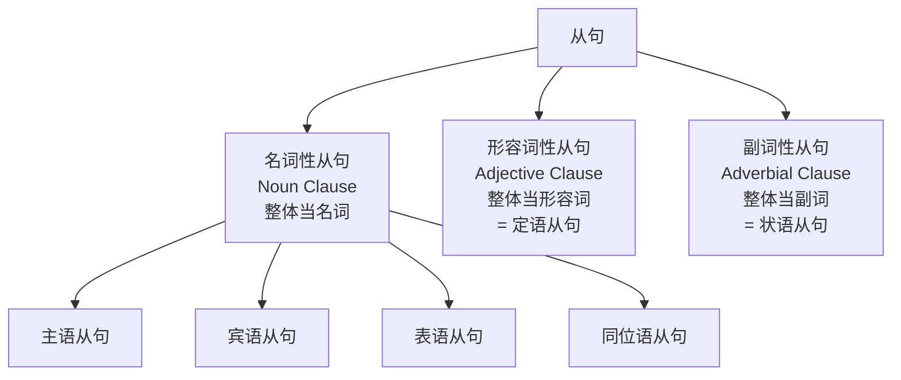
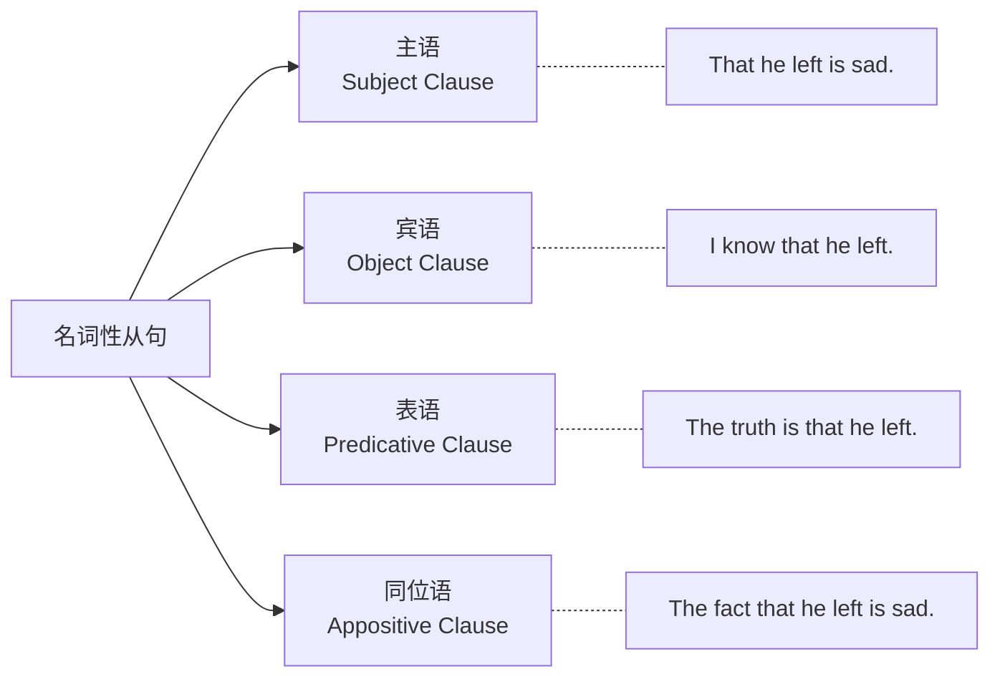
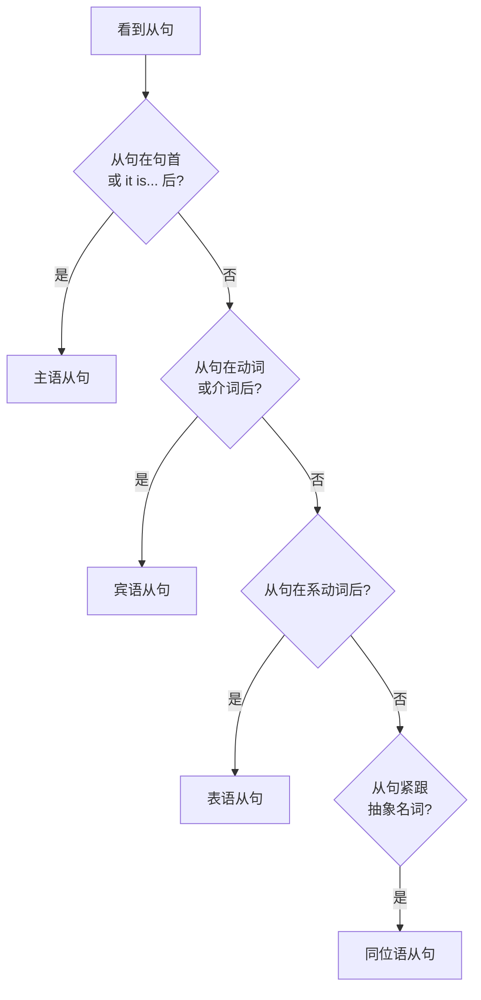
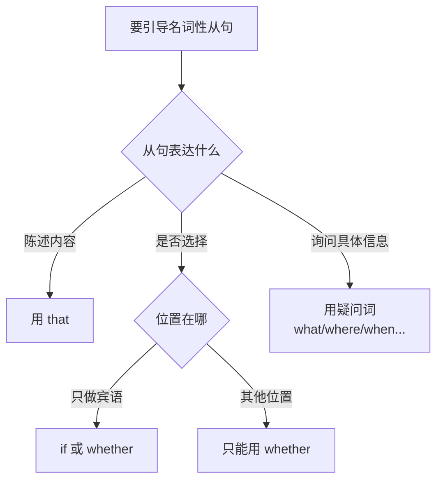

# 名词性从句四大类型

> [!info] 本篇定位
> 欢迎进入 **04.从句与复合句型框架** 分类。
>
> 如果前三个分类让你掌握了"**说一句话**"的能力，这个分类让你掌握"**说一长串话**"的能力。
>
> 英语的长句几乎都是靠**从句**搭建的。一个从句嵌套另一个从句，就成了复杂的复合句。**母语者每说 3 句话就有 1 句带从句**。
>
> 本篇讲的是**名词性从句**——把一整个句子当成**名词**来用。这是从句里最基础的一类。
>
> 读完本篇，你能：
>
> - 一眼识别句子中的名词性从句
> - 流畅使用 **I think that... / What I want is... / The fact that...**
> - 搞清楚"**是 whether 还是 if**"、"**是 that 还是 which**"、"**要不要倒装**"等高频困惑

---

## 1. 本篇导读：什么是从句

### 1.1 一个例子理解从句

**句子**：`I know.`（我知道。）—— 这是个完整句子。

**问题**：你知道**什么**？

**加个宾语**：`I know the answer.`（我知道答案。）—— OK。

**换一种方式**：`I know that he is right.`（我知道他是对的。）—— **that he is right** 就是**从句**，它整体充当了 `know` 的宾语。

**从句** = **有主语 + 有谓语**的**句子**，但**嵌入到更大句子里**，充当某种成分。

### 1.2 从句 vs 短语

| 成分 | 特征 | 例子 |
| ---- | ---- | ---- |
| 短语 | **没有**主 + 谓 | `a red apple`, `to go home` |
| 从句 | **有**主 + 谓 | `that he left`, `when he arrived` |

### 1.3 从句的三大家族



本分类 4 篇文档：
- **本篇**：名词性从句（4 种）
- **下篇**：定语从句
- **再下**：状语从句（9 种）
- **最后**：非谓语动词

---

## 2. 名词性从句的 4 种类型

**名词性从句** = 整体**充当名词**的从句，在句中可以做：



### 2.1 4 种对比

| 类型 | 作用 | 位置 | 例句 |
| ---- | ---- | ---- | ---- |
| 主语从句 | 句子的主语 | 句首（或 it 占位）| That he lied is obvious. |
| 宾语从句 | 动词/介词的宾语 | 动词/介词后 | I know that he lied. |
| 表语从句 | 系动词后的表语 | 系动词后 | The truth is that he lied. |
| 同位语从句 | 解释前面名词 | 抽象名词后 | The fact that he lied... |

---

## 3. 名词性从句的 3 大引导词家族

名词性从句必须有**引导词**。引导词分 3 类：

### 3.1 that 引导

**that 引导"陈述内容"的从句**。

```
I think that he is right.
          ↑ that 引导
```

**特点**：
- 只起**连接作用**，没有意义
- 在**宾语从句**中可以**省略**
- 在**主语/表语/同位语从句**中**不能省略**

### 3.2 whether / if 引导

**引导"是否……"的从句**。

```
I wonder whether he will come.
I wonder if he will come.
        ↑ whether / if 引导
```

**两者区别**：
- **whether 用处更广**（各种位置都行）
- **if 只用于宾语从句**
- whether 可以 + or not；if 一般不加 or not

### 3.3 疑问词（wh-）引导

**引导"询问内容"的从句**，用疑问词：

```
what（什么）, who（谁）, whom（谁）, whose（谁的）, which（哪个）
where（哪里）, when（什么时候）, why（为什么）, how（怎样）
how long, how much, how many, how old 等
```

**例子**：

```
I know what he said.                (我知道他说什么。)
Tell me where you live.             (告诉我你住哪。)
I don't know who he is.             (我不知道他是谁。)
```

### 3.4 三大引导词对比

| 引导词 | 用于 | 意思 | 例句 |
| ---- | ---- | ---- | ---- |
| that | 陈述内容 | （无意义）| I think that he is right. |
| whether/if | 是非选择 | 是否 | I wonder if he will come. |
| 疑问词 | 具体信息 | 什么/谁/哪里... | I know where he went. |

---

## 4. 主语从句（Subject Clause）

### 4.1 什么是主语从句

**主语从句** = **充当整个句子主语**的从句。

```
[That he lied]    is obvious.
↑ 这一整串是主语   ↑ 系动词
(他撒谎这件事很明显。)
```

### 4.2 主语从句的两种形式

**形式 1：从句在句首直接做主语**

```
That he is honest is true.          (他诚实是真的。)
What he said surprised me.          (他说的话让我吃惊。)
Whether we go or not depends on the weather.
(我们去不去看天气。)
Why he left is a mystery.           (他为什么走是个谜。)
```

**形式 2：用 it 做形式主语（更常用）**

**公式**：`It + be + 形容词/名词 + that/whether/wh- 从句`

```
It is true that he is honest.
It surprised me what he said.
It depends on the weather whether we go or not.
It is a mystery why he left.
```

**为什么用 it 开头？**

- 避免主语**头重脚轻**（主语太长不好）
- 让句子更符合英语习惯
- 更**口语化、自然**

**对比**：

```
不自然：That she passed the exam surprised everyone.
自然：  It surprised everyone that she passed the exam.
```

### 4.3 主语从句的时态一致

**主句和从句时态要一致**：

```
It is true that he is honest.        (主句现在，从句现在——陈述普遍事实)
It was obvious that he was lying.    (主句过去，从句也过去)
```

### 4.4 主语从句的引导词

**that 引导**（最常见）：
```
That he will come is certain.
= It is certain that he will come.
```

**whether 引导**（不用 if 做主语！）：
```
Whether she will come is unknown.
= It is unknown whether she will come.

❌ If she will come is unknown.
```

**疑问词引导**：
```
What he said is a lie.
= It is a lie what he said.

Who broke the window is still unknown.
How they found us is a mystery.
```

### 4.5 主语从句的谓语动词：单数

**主语从句做主语时，谓语动词用单数（第三人称）**。

```
That he is right is obvious.          (不是 are)
Whether she comes doesn't matter.     (不是 don't)
What they said surprises me.          (不是 surprise)
```

### 4.6 主语从句典型例句（10 个）

> [!success] 主语从句例句
>
> **that 引导**
> 1. `It is true that practice makes perfect.`（熟能生巧是真的。）
> 2. `That he lied is obvious.`（他撒谎很明显。）
> 3. `It is important that you arrive on time.`（你准时到很重要。）
>
> **whether 引导**
> 4. `Whether we should go is still a question.`（我们要不要去还是个问题。）
> 5. `It doesn't matter whether you succeed or not.`（你成不成功没关系。）
>
> **疑问词引导**
> 6. `What you said was interesting.`（你说的很有趣。）
> 7. `How he did it is a mystery.`（他怎么做到的是个谜。）
> 8. `Why she left surprised us.`（她为什么走让我们吃惊。）
> 9. `Who will win is hard to say.`（谁会赢很难说。）
> 10. `Where they went is unknown.`（他们去哪了不知道。）

---

## 5. 宾语从句（Object Clause）

### 5.1 什么是宾语从句

**宾语从句** = **充当动词或介词宾语**的从句。

```
I know [that he is right].
       ↑ 整串做 know 的宾语

I'm interested in [what you said].
                  ↑ 整串做介词 in 的宾语
```

### 5.2 宾语从句的 3 种引导词

**that 引导**（最常见，可省略）：

```
I think (that) he is right.
She said (that) she was tired.
I know (that) you love me.
```

**whether / if 引导**：

```
I wonder whether he will come.
I wonder if he will come.
I don't know whether/if it's true.
```

**疑问词引导**：

```
I know what you did.
Tell me where you live.
I asked him who he was.
I don't remember when she called.
```

### 5.3 宾语从句的关键：陈述语序！

**这是中国学生最容易错的地方**。

疑问句**嵌入宾语从句后**，**必须改为陈述语序**（不倒装）。

**对比**：

```
直接疑问（倒装）：Where is he?
宾语从句（陈述）：I know where he is.     (不是 where is he)

直接疑问：       What did he say?
宾语从句：       I know what he said.     (不是 what did he say)

直接疑问：       Is she happy?
宾语从句：       I wonder if she is happy. (不是 if is she happy)
```

> [!warning] 中国学生最易错
>
> - ❌ `I don't know where is he.`
> - ✅ `I don't know where he is.`
>
> - ❌ `Can you tell me when will the train arrive?`
> - ✅ `Can you tell me when the train will arrive?`
>
> 记住：**宾语从句用陈述语序**！

### 5.4 主从句时态一致

**当主句是过去时，宾语从句通常也要相应变为过去**：

| 主句过去时，从句时态 | 示例 |
| ---- | ---- |
| 一般现在 → 一般过去 | He said he was busy. |
| 现在进行 → 过去进行 | She said she was working. |
| 现在完成 → 过去完成 | He said he had finished. |
| 一般过去 → 过去完成 | She said she had seen him. |
| 一般将来 → 过去将来 | He said he would come. |

**对比**：

```
主句现在时：   He says he is busy.
主句过去时：   He said he was busy.  (tense 相应后退)
```

**例外**：**客观真理、固定事实**——从句**保持一般现在**。

```
The teacher said the earth is round. (地球是圆的，永恒真理)
He told me that light travels fast.   (光速是客观事实)
```

### 5.5 宾语从句的 that 省略

**在宾语从句中 that 可以省略**（非正式语境）：

```
I think (that) he is right.
She said (that) she was tired.
I know (that) you like it.
```

**但不能省略的情况**：

1. **在主语、表语、同位语从句中不能省**
2. **在并列的第二个从句中通常不省**：
```
✅ I think (that) he is right and that she is wrong.
❌ I think (that) he is right and she is wrong.（不推荐，第二个 that 要保留）
```

### 5.6 宾语从句典型例句（15 个）

> [!success] 宾语从句例句
>
> **that 引导**
> 1. `I know that you are busy.`（我知道你忙。）
> 2. `She believes he is honest.`（她相信他诚实。）
> 3. `He promised he would come.`（他承诺会来。）
> 4. `I told her I loved her.`（我告诉她我爱她。）
> 5. `They didn't realize how late it was.`（他们没意识到多晚了。）
>
> **whether / if 引导**
> 6. `I wonder if she is coming.`（我想知道她是否来。）
> 7. `I don't know whether to laugh or cry.`（我不知道是该笑还是哭。）
> 8. `Can you tell me if this is correct?`（你能告诉我这对不对吗？）
>
> **疑问词引导**
> 9. `I don't know what to do.`（我不知道该做什么。）
> 10. `Tell me where you put the keys.`（告诉我你把钥匙放哪了。）
> 11. `I forgot when the meeting is.`（我忘了会议什么时候。）
> 12. `She asked how I learned English.`（她问我怎么学的英语。）
> 13. `I want to know why you left.`（我想知道你为什么走。）
>
> **介词 + 从句**
> 14. `I'm worried about how he's feeling.`（我担心他的感受。）
> 15. `It depends on what she decides.`（取决于她怎么决定。）

---

## 6. 表语从句（Predicative Clause）

### 6.1 什么是表语从句

**表语从句** = 在**系动词（be/seem/look等）后面**，**做表语**的从句。

```
The truth is [that he lied].
             ↑ 表语从句

The problem is [how we can solve it].
               ↑ 表语从句
```

### 6.2 常用于表语从句的主句主语

**抽象名词**：
```
the truth, the reason, the question, the problem,
the fact, the answer, the idea, the point
```

**例句**：

```
The truth is that he is innocent.
The reason is that I was tired.
The problem is how we can afford it.
The question is whether we should go.
```

### 6.3 表语从句的引导词

**that 引导（不能省）**：

```
The fact is that he lied.             (不省 that)
My belief is that we will succeed.
```

**whether 引导（不用 if！）**：

```
The question is whether to go or stay.
❌ The question is if to go or stay.
```

**疑问词引导**：

```
This is what I want.
The problem is how to start.
The question is when he will come.
```

**as if / as though 引导**（特殊）：

```
It seems as if nothing happened.
It looks as if it will rain.
```

**because 引导**（特殊）：

```
The reason is because he was late.
(也可说：The reason is that he was late.)
```

> [!tip] "the reason is..." 的规范
>
> 严格语法要求用 `The reason is that...`，但 `The reason is because...` 在口语中**非常普遍**。
>
> - 口语：`The reason is because I was tired.`
> - 书面正式：`The reason is that I was tired.`

### 6.4 表语从句典型例句（10 个）

> [!success] 表语从句例句
>
> 1. `The fact is that he is lying.`（事实是他在撒谎。）
> 2. `The truth is we don't know.`（事实是我们不知道。）
> 3. `The question is whether we can afford it.`（问题是我们是否负担得起。）
> 4. `The reason is that he was sick.`（原因是他病了。）
> 5. `This is where I grew up.`（这就是我长大的地方。）
> 6. `The problem is how to start.`（问题是怎么开始。）
> 7. `The idea is that we share everything.`（理念是我们共享一切。）
> 8. `It looks as if it's going to rain.`（看起来要下雨。）
> 9. `My concern is what will happen next.`（我担心接下来会怎样。）
> 10. `The best part is that it's free.`（最好的是免费。）

---

## 7. 同位语从句（Appositive Clause）

### 7.1 什么是同位语从句

**同位语从句** = **解释或说明前面抽象名词**的从句。

它和前面的名词是**"同一个东西"**的关系。

```
The fact [that he lied] is obvious.
名词       ↑同位语从句（解释 fact 是什么）

The news [that he won] surprised us.
名词      ↑同位语从句（解释 news 的内容）
```

### 7.2 常接同位语从句的名词

**这些抽象名词后面常跟同位语从句**：

```
fact（事实）        news（消息）       idea（想法）
belief（信念）      opinion（意见）    proposal（建议）
suggestion（建议）  hope（希望）       doubt（怀疑）
fear（担心）        conclusion（结论） rumor（谣言）
answer（答案）      question（问题）   theory（理论）
truth（真相）
```

### 7.3 同位语从句的引导词

**that 引导**（最常见，**不能省**）：

```
The rumor that he quit turned out to be true.
                ↑ 不能省
```

**whether 引导**（表"是否"）：

```
The question whether to go or stay is difficult.
```

**疑问词引导**：

```
The question how we can afford it needs an answer.
```

### 7.4 同位语从句 vs 定语从句（重要！）

这两者**看起来很像**，但**本质不同**。

**判断方法**：看 that 在从句中**是否做成分**。

- **定语从句**中，that 是**成分**（做主语或宾语）
- **同位语从句**中，that 是**连接词**（没做成分）

**对比**：

```
定语从句：The news [that he told me] was shocking.
         ↑ that 是 told 的宾语（定语从句）
         (他告诉我的消息令人震惊。)

同位语从句：The news [that he quit] was shocking.
         ↑ that 不做成分（同位语从句）
         (他辞职的这个消息令人震惊。)
```

**验证方法**：

- 同位语：从句**和前面名词意思相同**（news = he quit）
- 定语：从句**描述前面名词**（news = 他告诉我的）

### 7.5 同位语从句典型例句（10 个）

> [!success] 同位语从句例句
>
> 1. `The fact that he lied surprised us.`（他撒谎的事实让我们吃惊。）
> 2. `I agree with the idea that we should start early.`（我同意我们该早点开始这个想法。）
> 3. `The rumor that she got promoted isn't true.`（她升职的谣言不真实。）
> 4. `There is no doubt that he will come.`（毫无疑问他会来。）
> 5. `The hope that peace can be achieved keeps us going.`（能实现和平的希望让我们坚持。）
> 6. `I heard the news that he won the prize.`（我听说他得奖的消息。）
> 7. `The conclusion that we drew was correct.`（我们得出的结论是对的。）
> 8. `His belief that everyone is good is naive.`（他相信人人都好的信念很天真。）
> 9. `The question whether we can succeed remains.`（我们能否成功的问题还在。）
> 10. `I have a feeling that something bad will happen.`（我感觉坏事要发生。）

---

## 8. 四大名词性从句对比

### 8.1 综合对比表

| 类型 | 作用 | 在哪里 | that 能否省 | 例句 |
| ---- | ---- | ---- | ---- | ---- |
| 主语从句 | 主语 | 句首或 it... | 不能省 | That he left is sad. |
| 宾语从句 | 宾语 | 动词/介词后 | **能省** | I know (that) he left. |
| 表语从句 | 表语 | 系动词后 | 不能省 | The truth is that he left. |
| 同位语从句 | 解释名词 | 抽象名词后 | 不能省 | The fact that he left... |

### 8.2 辨别 4 种从句的步骤



### 8.3 同一内容的 4 种表达

同样的信息"他诚实"可以表达为 4 种从句：

```
主语从句：   That he is honest is obvious.
宾语从句：   I believe that he is honest.
表语从句：   The truth is that he is honest.
同位语从句： The fact that he is honest is clear.
```

---

## 9. 引导词的选择：that vs if vs whether vs wh-

### 9.1 完整决策树



### 9.2 whether vs if 的差异

**whether** 比 **if** 用法更广：

| 用法 | whether | if |
| ---- | ---- | ---- |
| 做宾语 | ✓ | ✓ |
| 做主语 | ✓ | ✗ |
| 做表语 | ✓ | ✗ |
| 做同位语 | ✓ | ✗ |
| + or not | ✓ | ✗（不加 or not）|
| + 不定式 | whether to go | ✗ |
| 介词后 | ✓ | ✗ |

**例子**：

```
宾语：I don't know whether/if he will come.        (都行)
主语：Whether he comes or not doesn't matter.      (不用 if)
介词后：It depends on whether he comes.            (不用 if)
不定式：I don't know whether to go.                (不用 if to go)
+ or not：I don't care whether you like it or not. (if 不加 or not)
```

### 9.3 疑问词的选择

按**问的内容**选择：

```
人：      who, whom, whose
事物：    what
哪个：    which
地点：    where
时间：    when
原因：    why
方式：    how
程度：    how + 形/副
  how old (多大), how tall (多高), how much (多少),
  how many (几个), how often (多久一次), how long (多久)
```

---

## 10. 名词性从句的陈述语序（最重要规则！）

### 10.1 核心规则

**所有名词性从句都用陈述语序**，不管是疑问词引导还是 whether/if 引导。

```
❌ I don't know where is he.
✅ I don't know where he is.

❌ Can you tell me what did you do?
✅ Can you tell me what you did?

❌ I wonder if is she happy.
✅ I wonder if she is happy.
```

### 10.2 对比：直接问句 vs 宾语从句

```
直接问句（倒装）：Where did you go?
宾语从句（陈述）：Tell me where you went.

直接问句（倒装）：What is his name?
宾语从句（陈述）：I forgot what his name is.

直接问句（倒装）：When will they arrive?
宾语从句（陈述）：Do you know when they will arrive?

直接问句（倒装）：Is she married?
宾语从句（陈述）：I don't know if she is married.
```

### 10.3 常见错误检查

```
❌ Can you tell me where is the bathroom?
✅ Can you tell me where the bathroom is.

❌ I don't know how long does it take.
✅ I don't know how long it takes.

❌ She asked me why did I come.
✅ She asked me why I came.
```

---

## 11. 间接引语（Reported Speech）

名词性从句最大的应用之一是**间接引语**（把别人说的话转述出来）。

### 11.1 直接引语 vs 间接引语

```
直接：He said, "I am busy."
间接：He said that he was busy.
```

### 11.2 间接引语的 3 大变化

**变化 1：时态后退（主句是过去时）**

| 直接引语 | 间接引语 |
| ---- | ---- |
| 一般现在 | 一般过去 |
| 现在进行 | 过去进行 |
| 现在完成 | 过去完成 |
| 一般过去 | 过去完成 |
| 一般将来（will）| 过去将来（would）|
| can | could |
| may | might |
| must | had to |

**例子**：

```
直接：He said, "I am tired."
间接：He said he was tired.

直接：She said, "I have finished."
间接：She said she had finished.

直接：He said, "I will come."
间接：He said he would come.
```

**变化 2：人称变化**

```
直接：Tom said, "I love my job."
间接：Tom said he loved his job.
     (I → he,  my → his)

直接：She told me, "You are right."
间接：She told me I was right.
     (You → I)
```

**变化 3：时间地点副词变化**

| 直接引语 | 间接引语 |
| ---- | ---- |
| now | then |
| today | that day |
| tomorrow | the next day |
| yesterday | the day before |
| this | that |
| here | there |
| last week | the week before |
| next week | the following week |

**例子**：

```
直接：He said, "I will come tomorrow."
间接：He said he would come the next day.

直接：She said, "I was here yesterday."
间接：She said she had been there the day before.
```

### 11.3 各种引语转换

**陈述句**：用 that 从句

```
直接：He said, "I'm busy."
间接：He said (that) he was busy.
```

**一般疑问句**：用 whether / if

```
直接：He asked, "Are you OK?"
间接：He asked if I was OK.
```

**特殊疑问句**：用疑问词

```
直接：She asked, "Where are you going?"
间接：She asked where I was going.
```

**祈使句**：用 `tell/ask/order + sb. + to do`

```
直接：She said, "Sit down."
间接：She told us to sit down.

直接：He said, "Don't be late."
间接：He told me not to be late.
```

---

## 12. 场景实战：一段对话中的名词性从句

**场景**：朋友聊工作

```
Mary:  "Do you know what time the meeting starts?"
       [宾语从句：what time the meeting starts]

John:  "I think it starts at 3."
       [宾语从句：(that) it starts at 3，省略 that]

Mary:  "The problem is that I might be late."
       [表语从句：that I might be late]

John:  "What are you going to do?"
       [疑问句]

Mary:  "I'm not sure whether to reschedule or just apologize."
       [宾语从句：whether to reschedule or just apologize]

John:  "The fact that you're worried shows you care."
       [同位语从句：that you're worried]

Mary:  "That's true. It's just that I hate being late."
       [it is... that 结构 + 动名词]

John:  "I know what you mean. I wonder if we should ask the boss."
       [宾语从句 × 2：what you mean + if we should ask]

Mary:  "Good idea. The question is how to word it."
       [表语从句：how to word it]

John:  "Just say the truth - that you were stuck in traffic."
       [同位语从句：that you were stuck in traffic]

Mary:  "Whether he'll accept that is another question."
       [主语从句：Whether he'll accept that]

John:  "Don't worry. I heard that he's in a good mood today."
       [宾语从句：that he's in a good mood today]
```

**统计**：一段 10 句对话用了 **12 处名词性从句**（各种类型齐全）。

---

## 13. 常见错误大盘点

### 13.1 错误 1：宾语从句用倒装

```
❌ I don't know where is he.
✅ I don't know where he is.
```

### 13.2 错误 2：主语/表语/同位语用 if

```
❌ If he will come is unknown.
✅ Whether he will come is unknown.

❌ The question is if we should go.
✅ The question is whether we should go.
```

### 13.3 错误 3：that 乱省

```
❌ That he is right obvious.（主语从句不能省 that）
✅ That he is right is obvious. / It is obvious that he is right.

❌ The reason is he is sick.（表语从句不建议省 that）
✅ The reason is that he is sick.
```

### 13.4 错误 4：间接引语时态不变

```
❌ He said he is tired.
✅ He said he was tired.
```

### 13.5 错误 5：主语从句谓语用复数

```
❌ What he said are wrong.
✅ What he said is wrong.（主语从句做主语，谓语用单数）
```

### 13.6 错误 6：同位语从句和定语从句混淆

```
辨别：
同位语：The news that he quit.  (news = he quit 内容)
定语：  The news that he told me.  (news 被 he told me 修饰)
```

---

## 14. 练习与输出建议

> [!success] 本篇练习清单
>
> **识别练习**
>
> 1. 判断下列句中从句属于哪种类型（主/宾/表/同位）：
>    - That she is beautiful is obvious.
>    - I know that she is coming.
>    - The truth is that he lied.
>    - The fact that he lied is shocking.
>    - What you said makes sense.
>    - I wonder if he will come.
>    - The question is why he left.
>
> **语序纠错**
>
> 2. 改正下列错误的宾语从句：
>    - Can you tell me where is the bus stop?
>    - I don't know how long will it take.
>    - She asked me why did I cry.
>    - Do you know what time is it?
>
> **间接引语转换**
>
> 3. 把下列直接引语改为间接引语：
>    - He said, "I am busy."
>    - She asked, "Where do you live?"
>    - They said, "We will come tomorrow."
>    - He told me, "Don't be late."
>
> **造句练习**
>
> 4. 用 4 种名词性从句各造 2 个句子：
>    - 主语从句 × 2
>    - 宾语从句 × 2
>    - 表语从句 × 2
>    - 同位语从句 × 2
>
> **长期任务**
>
> 5. 阅读一段英文新闻，**圈出所有名词性从句**并标注类型。

### 14.1 参考答案

**练习 1**：
- 主语 / 宾语 / 表语 / 同位语 / 主语 / 宾语 / 表语

**练习 2**：
- Can you tell me where the bus stop is?
- I don't know how long it will take.
- She asked me why I cried.
- Do you know what time it is?

**练习 3**：
- He said (that) he was busy.
- She asked where I lived.
- They said they would come the next day.
- He told me not to be late.

---

## 15. 本篇小结

> [!success] 本篇核心要点回顾
>
> **4 种名词性从句**：
> 1. 主语从句（做主语）
> 2. 宾语从句（做宾语）
> 3. 表语从句（做表语）
> 4. 同位语从句（解释抽象名词）
>
> **3 大引导词**：
> - **that**：陈述内容（宾语从句中可省）
> - **whether / if**：是非选择（if 只能做宾语）
> - **疑问词**：询问具体信息
>
> **最重要规则**：**名词性从句用陈述语序**
> - 不是 "where is he"
> - 是 "where he is"
>
> **常用公式**：
> - `It is + 形容词 + that 从句`（形式主语）
> - `The fact/truth/news that + 从句`（同位语）
> - `The reason/problem is that + 从句`（表语）
>
> **间接引语 3 大变化**：时态后退 + 人称变化 + 时间地点词变化
>
> **同位语 vs 定语从句**：看 that 是否在从句中做成分

### 15.1 下一篇预告

> [!info] 下一篇：02.定语从句完全手册
>
> 下一篇讲**定语从句**——用从句做**形容词**修饰名词。
>
> - 关系代词：who, whom, whose, which, that
> - 关系副词：where, when, why
> - 限制性 vs 非限制性定语从句（是否加逗号）
> - 介词 + 关系代词
> - 关系代词的省略
> - as 引导的定语从句
>
> 定语从句是英语**最复杂的从句之一**，也是**最能体现英语水平**的句式。下一篇会把它讲透。
