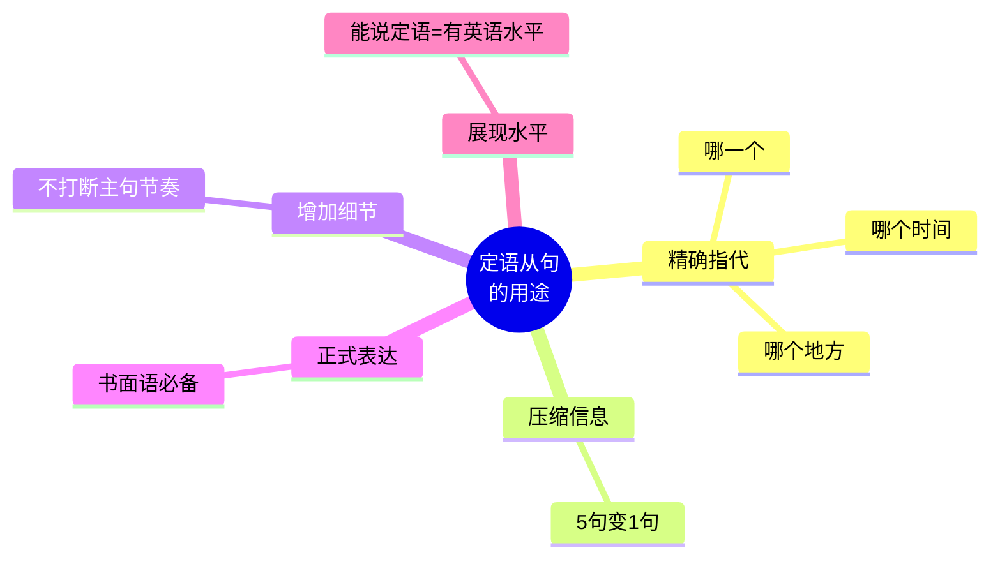
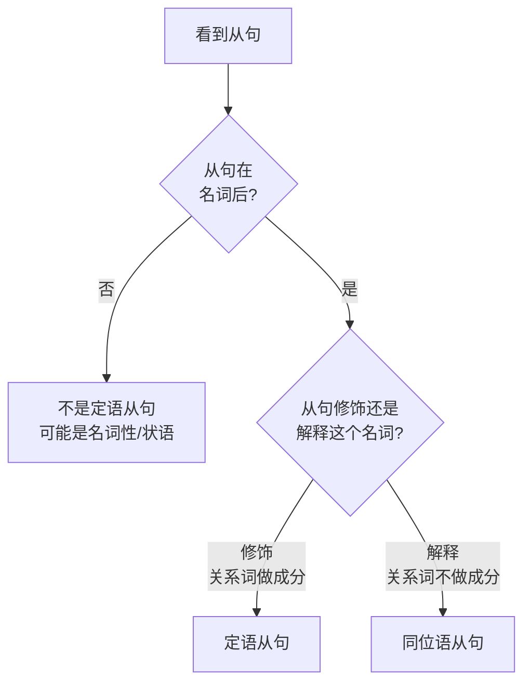

# 定语从句完全手册

> [!info] 本篇定位
> 定语从句是**英语最复杂**、**最能体现水平**的从句。
>
> 一个会用定语从句的人，说出来的英语是这样的：
>
> ```
> The man who is standing over there is my father,
> who works at a bank that my uncle founded in 1980.
> ```
>
> 一句话套了**3 层定语从句**，但母语者说起来毫不费力。
>
> 而不会用定语从句的人，只能说：
>
> ```
> There is a man. He is standing over there. He is my father.
> He works at a bank. My uncle founded it in 1980.
> ```
>
> —— **5 个短句**，像小学生作文。
>
> 本篇让你**彻底掌握定语从句**，从此告别"流水账英语"。

---

## 1. 本篇导读：定语从句有多重要

### 1.1 一个场景对比

想介绍"站在那边的那个戴眼镜的男人是我的老师"：

**没有定语从句的表达**（初学者）：
```
See that man? He is standing over there. He wears glasses.
He is my teacher. He teaches me English.
```
（5 个短句，冗长）

**有定语从句的表达**（地道）：
```
That man who is standing over there wearing glasses is my teacher,
who teaches me English.
```
（1 句话，简洁优雅）

### 1.2 定语从句在英语中的地位



**统计事实**：**英语写作**中每 2-3 句就有 1 句定语从句。**新闻、学术、商务邮件**使用频率更高。

### 1.3 本篇学习路径

1. **基本结构**（必须掌握）
2. **关系代词** who/whom/whose/which/that
3. **关系副词** where/when/why
4. **限制性 vs 非限制性**（逗号的用处）
5. **介词 + 关系代词**（进阶）
6. **省略规则 + 特殊用法**
7. **场景实战**

---

## 2. 定语从句的基本结构

### 2.1 什么是定语从句

**定语从句** = 用**一整个句子**做**定语**（修饰名词）的从句。

**对比**：

```
形容词做定语：the [tall] boy           (高的男孩)
介词短语做定语：the boy [in the room]   (房间里的男孩)
定语从句做定语：the boy [who is tall]   (高的那个男孩)
                         ↑ 从句作定语
```

### 2.2 定语从句的基本构成

**公式**：**先行词 + 关系词 + 从句**

```
The man  who  is standing there  is my father.
[先行词] [关系词]   [从句]          [主句继续]

翻译：站在那儿的那个男人是我父亲。
```

**3 个关键概念**：

- **先行词（Antecedent）**：被修饰的名词，在主句中
- **关系词（Relative Word）**：连接先行词和从句，代替先行词
- **定语从句**：修饰先行词的整个小句子

### 2.3 定语从句的位置

**定语从句紧跟在先行词后面**。

```
The book [that I bought yesterday] is interesting.
    ↑      ↑从句修饰 book↑

Do you know the man [who lives next door]?
              ↑   ↑从句修饰 the man↑
```

### 2.4 定语从句的"分解原理"

**把定语从句 = 两个独立句子合成的**。

**示例**：

```
句 1：I have a friend.
句 2：He lives in Paris.

合并：I have a friend who lives in Paris.
                     ↑ 关系词代替句 2 中的 He
```

**记住这个原理**：关系词是"**代替先行词**"的代词/副词。

---

## 3. 关系代词（Relative Pronouns）

**关系代词** = 代替先行词**做主语或宾语**的代词。

### 3.1 5 大关系代词

| 关系词 | 指代 | 从句中做 | 例句 |
| ---- | ---- | ---- | ---- |
| **who** | 人 | 主语或宾语 | the man **who** lives here |
| **whom** | 人 | 宾语（正式）| the man **whom** I met |
| **whose** | 人/物 | 定语（所属）| the man **whose** car... |
| **which** | 物/动物 | 主语或宾语 | the book **which** I read |
| **that** | 人/物/动物 | 主语或宾语 | the man/book **that**... |

### 3.2 who 的用法

**用法**：代替**人**，在从句中做**主语或宾语**。

**做主语**：

```
The man who lives next door is a doctor.
         ↑ who 做从句的主语（= he lives next door）

The girl who called me is my sister.
         ↑ who 做从句的主语
```

**做宾语**：

```
The man who I met yesterday is a teacher.
         ↑ who 做从句的宾语（= I met him yesterday）

(正式场合用 whom：The man whom I met yesterday...)
```

### 3.3 whom 的用法

**用法**：代替**人**，在从句中做**宾语**（较正式）。

```
The person whom you saw is my cousin.
            ↑ you saw whom → whom I saw (whom 做宾语)

I know the woman whom he married.
                 ↑ 做 married 的宾语
```

**关键点**：

- **whom 只能做宾语**，不能做主语
- **口语中 whom 常被 who 替代**
- 介词 + whom 只能用 whom（不能用 who）：`the man to whom I spoke`

### 3.4 whose 的用法

**用法**：代替**人或物**，表"**……的**"（所属关系）。

**代替人**：

```
The student whose homework is missing will get zero.
             ↑ whose = the student's

I have a friend whose father is a doctor.
                 ↑ = my friend's father
```

**代替物（其实是 of which 的替代）**：

```
The house whose roof is red is mine.
           ↑ whose = the house's
           (= The house of which the roof is red...)
```

**whose 的特点**：

- **后面必须跟名词**
- 既可用于人，也可用于物

### 3.5 which 的用法

**用法**：代替**物或动物**，在从句中做**主语或宾语**。

**做主语**：

```
The book which is on the table is mine.
           ↑ 做从句主语

The dog which barks is friendly.
          ↑ 做从句主语
```

**做宾语**：

```
The book which I borrowed is great.
           ↑ 做从句宾语（= I borrowed the book）

The movie which she recommended is boring.
            ↑ 做从句宾语
```

### 3.6 that 的用法

**that 是"万金油"**，可以代替人、物、动物，做主语或宾语。

**代替人**：

```
The man that I met is my neighbor.
        ↑ = whom I met

The girl that is singing is my daughter.
         ↑ = who is singing
```

**代替物**：

```
The book that I read is interesting.
         ↑ = which I read

The car that is parked outside is mine.
        ↑ = which is parked outside
```

### 3.7 that 只能用（不能用 who/which）的 7 种情况

> [!tip] 必须用 that 的 7 种情况
>
> **1. 先行词是不定代词 / 不定量词**
>
> - all, none, nothing, something, anything, everything, no one, nobody
>
> ```
> ✅ All that glitters is not gold. (发光的不全是金子)
> ❌ All which glitters...
>
> ✅ There is nothing that I can do.
> ❌ There is nothing which I can do.
> ```
>
> **2. 先行词是最高级 / 序数词**
>
> ```
> ✅ This is the best book that I have read.
> ✅ This is the first movie that I watched.
> ❌ This is the best book which I have read.（不地道）
> ```
>
> **3. 先行词被 the only / the very / the same 修饰**
>
> ```
> ✅ He is the only person that I trust.
> ✅ You are the very one that I need.
> ```
>
> **4. 先行词同时包含"人 + 物"**
>
> ```
> ✅ The man and his dog that are walking in the park...
> ```
>
> **5. 疑问句以 who 开头（避免两个 who）**
>
> ```
> ✅ Who is the woman that you're talking about?
> ❌ Who is the woman who you're talking about?
> ```
>
> **6. 先行词是 all / few / little / much + 抽象物**
>
> ```
> ✅ There is much that needs to be done.
> ```
>
> **7. there be 句型中**
>
> ```
> ✅ There is a man that wants to see you.
> ```

### 3.8 that 不能用（必须用 who/which）的 3 种情况

> [!warning] that 的禁忌
>
> **1. 非限制性定语从句**（有逗号）
>
> ```
> ✅ My father, who works in Beijing, is a doctor.
> ❌ My father, that works in Beijing, is a doctor.
> ```
>
> **2. 介词 + 关系代词**
>
> ```
> ✅ The house in which I live is big.
> ❌ The house in that I live is big.
> ```
>
> **3. 表示"包括在内"的 of which / of whom**
>
> ```
> ✅ He has two cars, one of which is red.
> ❌ He has two cars, one of that is red.
> ```

---

## 4. 关系副词（Relative Adverbs）

**关系副词** = 代替先行词**做状语**的副词。

### 4.1 3 大关系副词

| 关系词 | 指代 | 作用 | 例句 |
| ---- | ---- | ---- | ---- |
| **where** | 地点 | 地点状语 | the place where I was born |
| **when** | 时间 | 时间状语 | the day when we met |
| **why** | 原因 | 原因状语 | the reason why she left |

### 4.2 where 的用法

**用法**：代替**表地点的先行词**，在从句中做**地点状语**。

```
This is the place where I grew up.
                  ↑ 在这个地方我长大

I remember the restaurant where we first met.
                         ↑ 在那个餐厅我们初次见面
```

**where 可以替换为"介词 + which"**：

```
This is the place where I grew up.
= This is the place in which I grew up.
```

### 4.3 when 的用法

**用法**：代替**表时间的先行词**，在从句中做**时间状语**。

```
I remember the day when I met her.
                   ↑ 那一天我遇见了她

2020 was the year when everything changed.
              ↑ 那一年一切都变了
```

**when 可以替换为"介词 + which"**：

```
I remember the day when I met her.
= I remember the day on which I met her.
```

### 4.4 why 的用法

**用法**：代替 **the reason**（原因）。

```
This is the reason why I came.
                   ↑ 我来的原因

Tell me the reason why you're crying.
                ↑ 你哭的原因
```

**why 等于 "for which"**：

```
This is the reason why I came.
= This is the reason for which I came.
```

### 4.5 关系代词 vs 关系副词（重要辨别！）

**这是中国学生非常易错的点**。

**判断方法**：看从句中**是否缺少主语或宾语**。

```
缺少 → 用关系代词（who/which/that）
不缺 → 用关系副词（where/when/why）
```

**对比**：

```
The city which I visited is beautiful.
               ↑ I visited (什么？缺宾语 which)→ 用关系代词

The city where I grew up is beautiful.
               ↑ I grew up (不缺主宾，grew up 是不及物)→ 用关系副词
```

**更多对比**：

```
The house which I bought is big.          (bought 缺宾语 → 用 which)
The house where I live is big.            (live 不缺 → 用 where)

The day which I remember was sunny.       (remember 缺宾语 → 用 which)
The day when I arrived was sunny.         (arrived 不缺 → 用 when)

The reason which he gave was weak.        (gave 缺宾语 → 用 which)
The reason why he came is unclear.        (came 不缺 → 用 why)
```

> [!tip] 快速判断法
>
> **把关系词"挪走"，看从句是否完整**：
> - **完整** → 关系副词
> - **不完整** → 关系代词
>
> 示例：`The house ___ I live is big.`
> - 试 `I live is big.` → 完整 → 用 where
>
> `The book ___ I bought is great.`
> - 试 `I bought is great.` → 不完整（bought 缺宾语） → 用 which/that

---

## 5. 限制性 vs 非限制性定语从句

### 5.1 核心区别：加不加逗号

英语定语从句分**两大类**：

| 类型 | 逗号 | 功能 | 删除后 |
| ---- | ---- | ---- | ---- |
| **限制性** | 不加 | **限定**先行词（必要信息）| 意思改变 |
| **非限制性** | 加 | **补充**先行词（附加信息）| 意思不变，只少细节 |

### 5.2 对比示例

**限制性**（没有逗号，是必要信息）：

```
My brother who lives in Paris is a doctor.
(我住在巴黎的那个哥哥是医生——说明我有不止一个哥哥。)
```

**非限制性**（有逗号，是额外信息）：

```
My brother, who lives in Paris, is a doctor.
(我哥哥，他住在巴黎，是医生——我只有一个哥哥，顺便提一下他住巴黎。)
```

**意思差别巨大**！限制性暗示有多个哥哥，非限制性说明只有一个哥哥。

### 5.3 非限制性定语从句的 3 大特点

**特点 1：必须加逗号**

```
✅ Tom, who is my best friend, lives nearby.
❌ Tom who is my best friend lives nearby.
```

**特点 2：不能用 that**

```
✅ Tom, who is my best friend, lives nearby.
❌ Tom, that is my best friend, lives nearby.
```

**特点 3：关系代词不能省略**

```
限制性（可省 that/which）：
  The book I bought is great.

非限制性（不可省）：
  This book, which I bought yesterday, is great.
  ↑ 不能省 which
```

### 5.4 非限制性定语从句的用法

**用法 1：先行词是专有名词（人名、地名）**

```
Shakespeare, who wrote Hamlet, is famous.
Beijing, which is the capital of China, is huge.
```

**用法 2：先行词独一无二**

```
The Earth, which revolves around the Sun, is our home.
My mother, who is 50, is very healthy.
```

**用法 3：补充额外信息**

```
I talked to John, who agreed to help.
(我跟 John 谈了，他同意帮忙——补充 John 的反应)
```

### 5.5 限制性 vs 非限制性练习

```
(1) The students who study hard will pass.
    (限制性：只有努力学的学生才过——针对"努力的学生"这部分)

(2) The students, who study hard, will pass.
    (非限制性：所有学生都会过，顺便说他们都努力——说所有学生)

(3) The car that I bought was expensive.
    (限制性：我买的那辆车贵——指特定的那辆)

(4) This car, which I bought yesterday, was expensive.
    (非限制性：这辆车贵，顺便说昨天买的——指特定的这辆)
```

---

## 6. 介词 + 关系代词（进阶）

### 6.1 基本结构

当从句中**关系代词做介词宾语**时，有两种形式：

**形式 1：介词放在从句末尾（口语）**

```
The man (who/that) I talked to is my boss.
                    ↑ to 在末尾
```

**形式 2：介词提前（正式）**

```
The man to whom I talked is my boss.
      ↑ to 提前了，必须用 whom（不能用 that）
```

### 6.2 规则总结

| 情况 | 关系词 | 例句 |
| ---- | ---- | ---- |
| 介词在后 | who/whom/that/which/省略 | the man I talked to |
| 介词在前 | 只能用 whom/which | the man to whom I talked |
| 非限制性 | 只能用 whom/which | the man, to whom I talked |

### 6.3 典型例句（10 个）

```
1. The person I'm talking about is Tom.
   = The person about whom I'm talking is Tom.

2. The house I used to live in is gone.
   = The house in which I used to live is gone.

3. The friend I was traveling with got sick.
   = The friend with whom I was traveling got sick.

4. The topic we're discussing is important.
   = The topic about which we're discussing is important.

5. The chair I'm sitting on is broken.
   = The chair on which I'm sitting is broken.

6. The man she's married to is a lawyer.
   = The man to whom she's married is a lawyer.

7. The tool you worked with is new.
   = The tool with which you worked is new.

8. The company he works for is huge.
   = The company for which he works is huge.

9. The book I'm looking for is on the shelf.
   (look for 不能拆分，只能 The book I'm looking for)

10. The guy I bought it from cheated me.
    = The guy from whom I bought it cheated me.
```

> [!tip] 实用建议
>
> **日常口语中**：用"介词后置"形式（更自然）
> **正式写作中**：用"介词前置"形式（更规范）
>
> 不要过分追求"介词前置"，否则听起来像 18 世纪文学。

---

## 7. 关系代词的省略

### 7.1 什么时候可以省略

**限制性定语从句中，关系代词做宾语时可以省略**。

**可省的情况**：

**1. 关系代词做及物动词宾语**

```
The book (that) I read was great.
         ↑ 可省

The man (whom) I met is my friend.
        ↑ 可省
```

**2. 关系代词做介词宾语（介词在后时）**

```
The man (whom) I talked to is my boss.
        ↑ 可省
```

### 7.2 什么时候不能省略

**1. 关系代词做主语**

```
✅ The book that is on the table is mine.
❌ The book is on the table is mine. (省了 that 就不对了)
```

**2. 非限制性定语从句**

```
✅ Tom, whom I met yesterday, is a doctor.
❌ Tom, I met yesterday, is a doctor.
```

**3. 介词 + whom/which（介词提前时）**

```
✅ The man to whom I spoke is my boss.
❌ The man to I spoke is my boss. (错)
```

**4. 关系副词（where, when, why）通常不省略**

（但口语中有时省略 when）

### 7.3 省略对比

```
完整：The book [that I bought] is great.
省略：The book I bought is great.

完整：The woman [whom you met] is my aunt.
省略：The woman you met is my aunt.

完整：The movie [which we watched] was boring.
省略：The movie we watched was boring.

完整：The place [where I grew up] is small.
省略：The place I grew up is small.（口语，非正式）
```

---

## 8. as 引导的定语从句

**as** 也可以引导定语从句，意思是"**正如**、**就像**"。

### 8.1 as 做关系代词

**结构**：`as + 谓语 + 代替前面整个句子`

```
He is Chinese, as is obvious from his accent.
(他是中国人，从他的口音就能明显看出——as 指整句话)

As is known to all, the earth is round.
(众所周知，地球是圆的。)
```

### 8.2 as 的 3 种固定结构

**1. such ... as**：像……一样的

```
Such a book as this one is rare.
(像这样的书很少见。)
```

**2. the same ... as**：和……一样的

```
He wears the same shirt as mine.
(他穿着和我一样的衬衫。)
```

**3. as + 主句（非限制性）**：如……

```
As we all know, learning takes time.
(众所周知，学习需要时间。)
```

### 8.3 as vs which（非限制性）

**as** 和 **which** 在非限制性中都能代指前面整句话，但用法不同：

| 区别 | as | which |
| ---- | ---- | ---- |
| 位置 | 句首、句中、句末都可以 | 只能句末 |
| 含义 | 正如、就像 | 这（事情） |

**对比**：

```
As is reported in the news, the storm is coming.  (as 在句首)
The storm is coming, as is reported in the news.  (as 在句末)
The storm is coming, which is reported in the news. (which 只能句末)
```

---

## 9. which 代指整句话

**非限制性定语从句**中，**which** 可以指代**前面整个句子**的内容。

```
He failed the exam, which surprised everyone.
                    ↑ which 指代"他考试没及格"这整件事

She won the prize, which made her happy.
                   ↑ which 指代"她获奖"

It rained all day, which ruined our plans.
                   ↑ which 指代"下了一整天雨"

He forgot my birthday, which hurt my feelings.
```

**只有 which 能这样用**，不能用 that 或 who。

---

## 10. 典型例句合集（25 个）

> [!success] 定语从句典型例句
>
> **who 引导**
> 1. `The man who is standing there is my uncle.`（站那儿的男人是我叔叔。）
> 2. `People who smoke may get cancer.`（抽烟的人可能得癌。）
> 3. `She is the person who I trust the most.`（她是我最信任的人。）
>
> **whom 引导**
> 4. `The teacher whom I respect retired last year.`（我尊敬的那位老师去年退休了。）
> 5. `The man with whom she was speaking is her boss.`（和她谈话的男人是她老板。）
>
> **whose 引导**
> 6. `The boy whose father is a doctor is my friend.`（父亲是医生的那个男孩是我朋友。）
> 7. `I have a cat whose fur is white.`（我有只毛是白色的猫。）
>
> **which 引导**
> 8. `The book which I'm reading is interesting.`（我正在读的书很有趣。）
> 9. `This is the phone which I bought last week.`（这是我上周买的手机。）
>
> **that 引导**
> 10. `This is the best cake that I have ever had.`（这是我吃过最好的蛋糕。）
> 11. `All that you need is love.`（你需要的就是爱。）
> 12. `The only thing that matters is truth.`（唯一重要的是真相。）
>
> **where 引导**
> 13. `This is the city where I was born.`（这是我出生的城市。）
> 14. `The park where we met is closed.`（我们相遇的那个公园关了。）
>
> **when 引导**
> 15. `2020 was the year when the pandemic started.`（2020 年是疫情开始的那年。）
> 16. `I'll never forget the day when we first kissed.`（我永远不会忘记我们初吻那天。）
>
> **why 引导**
> 17. `Tell me the reason why you left.`（告诉我你离开的原因。）
> 18. `This is the reason why I love her.`（这就是我爱她的原因。）
>
> **非限制性**
> 19. `My mother, who is a teacher, works hard.`（我妈妈，是个老师，工作努力。）
> 20. `Beijing, which is the capital, has 20 million people.`（北京，首都，有 2000 万人。）
>
> **介词 + 关系词**
> 21. `The man to whom I spoke is my boss.`（我和之谈话的男人是我老板。）
> 22. `The house in which I live is old.`（我住的房子很老。）
>
> **which 指代整句**
> 23. `He passed the exam, which made him happy.`（他通过了考试，这让他开心。）
> 24. `It was raining, which ruined our picnic.`（下雨了，毁了我们的野餐。）
>
> **嵌套定语从句（进阶）**
> 25. `The man who lives in the house that I built is my friend.`（住在我建的房子里的那个男人是我朋友。）

---

## 11. 场景实战：定语从句的真实应用

**场景**：讨论周末活动

```
Mary:  "Remember the restaurant where we went last month?"
       [关系副词 where 引导]

John:  "The one that serves Italian food?"
       [关系代词 that 引导]

Mary:  "Yes! The chef who cooked our pizza was amazing."
       [关系代词 who]

John:  "I agree. The wine which they recommended was great too."
       [关系代词 which]

Mary:  "I want to go back, but the time when they're open
        is inconvenient for me."
       [关系副词 when]

John:  "What if we go on Saturday, which is their busy day?"
       [which 指代 Saturday]

Mary:  "Saturday, when I'm free, works for me."
       [非限制性 when]

John:  "Perfect. Let me call the waiter who served us last time -
        he's the one whose brother I know."
       [who + whose]

Mary:  "Sounds like a plan. The food there is something I've been craving."
       [something (that) I've been craving - 省略 that]

John:  "The fact that we both enjoyed it so much is a good sign."
       [注意：这是同位语从句，不是定语从句！]

Mary:  "True. Friday night, the day when we usually go out, is too busy."
       [非限制性 when]
```

**定语从句统计**：一段 11 句对话用了 **12+ 处定语从句**。

---

## 12. 定语从句 vs 名词性从句 vs 状语从句

### 12.1 辨别方法

**三种 that 从句**看起来很像，但功能完全不同：

```
定语从句：The fact [that he told me] is false.
          ↑ that 修饰 fact (做 told 的宾语)
          (他告诉我的事实是假的)

同位语从句：The fact [that he lied] is shocking.
           ↑ that 解释 fact (不做成分)
           (他撒谎这个事实令人震惊)

宾语从句：I know [that he lied].
         ↑ that 是连接词 (不做成分)
         (我知道他撒谎了)
```

### 12.2 辨别流程



---

## 13. 常见错误大盘点

### 13.1 错误 1：关系词选错

```
❌ The book who I read is great.       (物不能用 who)
✅ The book which/that I read is great.

❌ The man which I met is tall.        (人不能用 which)
✅ The man who/whom/that I met is tall.
```

### 13.2 错误 2：关系代词 vs 关系副词混淆

```
❌ The place which I live is small.  (live 不缺宾语)
✅ The place where I live is small.

❌ The day which I arrived was sunny.  (arrive 不及物)
✅ The day when I arrived was sunny.
```

### 13.3 错误 3：非限制性用 that

```
❌ My father, that is a doctor, is old.
✅ My father, who is a doctor, is old.
```

### 13.4 错误 4：关系代词多余/重复

```
❌ The man who he is my uncle.    (who 做主语，不用再加 he)
✅ The man who is my uncle...

❌ The book which I read it.      (which 做宾语，不用再加 it)
✅ The book which I read.
```

### 13.5 错误 5：whose 后忘加名词

```
❌ The boy whose is Tom's brother.
✅ The boy whose father is Tom is my friend.（whose + 名词）
```

### 13.6 错误 6：where 当关系代词用

```
❌ The city where I visited is Paris.   (where 不能做 visit 的宾语)
✅ The city which I visited is Paris.
✅ The city where I lived is Paris.     (live 不及物，用 where)
```

### 13.7 错误 7：which 指代人

```
❌ My friend which helps me is kind.
✅ My friend who helps me is kind.
```

---

## 14. 练习与输出建议

> [!success] 本篇练习清单
>
> **填入正确的关系词**
>
> 1. 用 who / whom / whose / which / that / where / when / why 填空：
>    - The girl _____ sings is my sister.
>    - The book _____ I bought is on the desk.
>    - 2020 was the year _____ COVID started.
>    - The place _____ I was born is small.
>    - I don't know the reason _____ she left.
>    - The man _____ car was stolen called the police.
>    - She is the only one _____ knows.
>
> **合并句子**
>
> 2. 用定语从句合并下列两句：
>    - `I have a friend. He lives in Paris.` → ?
>    - `This is the book. I bought it yesterday.` → ?
>    - `That is the house. I grew up in it.` → ?
>    - `I met a girl. Her father is famous.` → ?
>
> **限制 vs 非限制**
>
> 3. 判断下列句子是限制性还是非限制性：
>    - The students who study hard pass.
>    - My mother, who is 50, is healthy.
>    - The book that I'm reading is exciting.
>    - Tom, who works here, is my friend.
>
> **翻译练习**
>
> 4. 翻译下列中文：
>    - 那个正在看书的男孩是我弟弟。
>    - 我喜欢那家我们昨天去的餐厅。
>    - 她是我认识最好的人。
>    - 我忘了我把钱包放在哪儿了。
>    - 北京，中国的首都，是一座大城市。
>
> **场景输出**
>
> 5. 写一段英文介绍**你的家人/朋友**，要求至少用 5 个定语从句。

### 14.1 参考答案

**练习 1**：
- who, which/that/(省略), when, where, why, whose, that

**练习 2**：
- I have a friend who lives in Paris.
- This is the book that/which I bought yesterday.
- That is the house where I grew up. / That is the house in which I grew up.
- I met a girl whose father is famous.

**练习 3**：
- 限制性 / 非限制性 / 限制性 / 非限制性

**练习 4**：
- `The boy who is reading is my brother.`
- `I love the restaurant where we went yesterday.` / `...that we went to yesterday.`
- `She is the best person (that) I know.`
- `I forgot where I put my wallet.` (这其实是宾语从句)
- `Beijing, which is the capital of China, is a big city.`

---

## 15. 本篇小结

> [!success] 本篇核心要点回顾
>
> **定语从句 = 先行词 + 关系词 + 从句**
>
> **5 大关系代词**：
> - who（人，主/宾）
> - whom（人，宾，正式）
> - whose（所属，+ 名词）
> - which（物，主/宾）
> - that（万能，主/宾）
>
> **3 大关系副词**：
> - where（地点）
> - when（时间）
> - why（原因）
>
> **关系代词 vs 关系副词**：
> - 缺主/宾 → 用关系代词
> - 不缺 → 用关系副词
>
> **限制性 vs 非限制性**：
> - 限制性：无逗号，必要信息，不能省略就删
> - 非限制性：有逗号，附加信息，可删除
> - **非限制性不能用 that**
>
> **只能用 that**：不定代词、最高级、序数词、the only/very/same、there be 等
>
> **不能用 that**：非限制性、介词 + 关系代词、of which
>
> **可省略**：限制性 + 做宾语的关系代词（that/whom/which）
>
> **which 特别用法**：在非限制性中可指代整个主句
>
> **易错**：
> - 物用 who / 人用 which（错！）
> - 关系代词和关系副词混淆
> - 非限制性用 that

### 15.1 下一篇预告

> [!info] 下一篇：03.状语从句九大类型
>
> 下一篇讲**状语从句**——用从句做**副词**修饰动词/形容词/整句。
>
> **9 大类型**：
> 1. 时间状语从句（when, while, as, before, after...）
> 2. 地点状语从句（where, wherever）
> 3. 原因状语从句（because, since, as, now that）
> 4. 结果状语从句（so...that, such...that）
> 5. 目的状语从句（so that, in order that）
> 6. 条件状语从句（if, unless, provided）
> 7. 让步状语从句（although, though, even if）
> 8. 方式状语从句（as, as if, the way）
> 9. 比较状语从句（than, as...as）
>
> 掌握状语从句，你就能表达**英语中所有的时间、地点、因果、条件、让步关系**。
