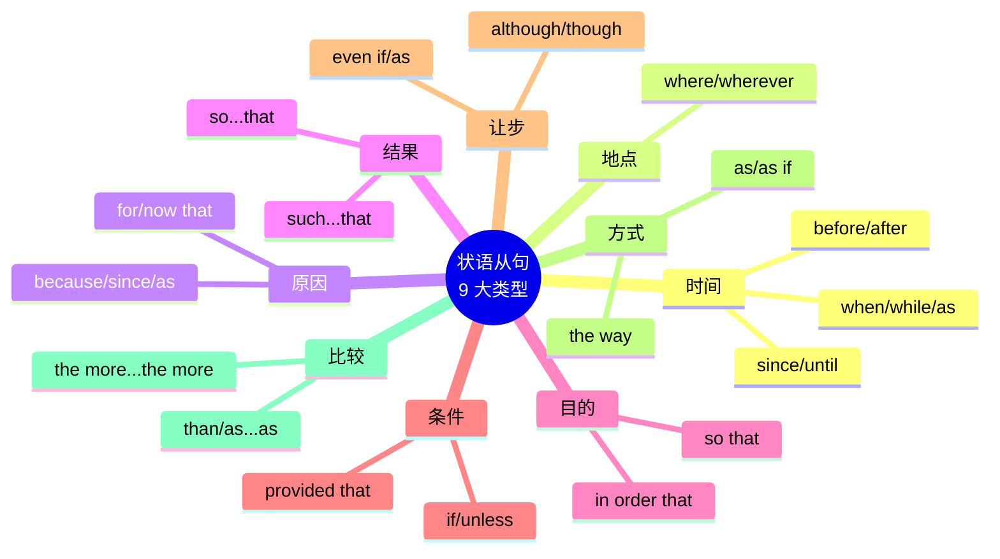

# 状语从句九大类型

> [!info] 本篇定位
> **状语从句**是英语表达**逻辑关系**的核心工具——时间先后、因果、条件、让步、目的、比较。
>
> 想表达"**虽然下雨了，但因为我带了伞，所以没淋湿**"这样有**多重逻辑关系**的句子，必须用状语从句。
>
> 中国学生的典型弱点：只会用最简单的连词（when, because），不知道每种逻辑都有**多种连词**可选。用多了就变成"翻来覆去只会说 because"。
>
> 本篇梳理 **9 大状语从句**，每类都给出**所有常用连词**、**时态搭配**、**微妙差异**，让你的英语从"说得出"升级到"说得细"。

---

## 1. 本篇导读：状语从句是什么

### 1.1 一句话理解状语从句

**状语从句** = 用**整个从句**做**状语**，修饰主句的**动词、形容词或整个句子**。

```
主句：          I went to bed.
加时间状语：    I went to bed [when I was tired].
                             ↑ 时间状语从句

主句：          She smiled.
加原因状语：    She smiled [because she was happy].
                             ↑ 原因状语从句
```

### 1.2 9 大类型总览



### 1.3 本篇使用建议

- **不必一次背完所有连词**，重点先学**每类最常用的 2-3 个**
- 每类重点关注**时态搭配规则**
- 学会**连词的微妙差异**（如 because vs since vs as）

---

## 2. 时间状语从句（Time Clause）

### 2.1 常用连词

时间状语从句的连词**最多**，也**最常用**。

| 连词 | 意思 | 用法特点 |
| ---- | ---- | ---- |
| when | 当……时 | 最通用 |
| while | 在……期间 | 持续性动作 |
| as | 当……时 | 同时发生 |
| before | 在……之前 | 后动作在前 |
| after | 在……之后 | 前动作在前 |
| since | 自从 | 从过去到现在 |
| until / till | 直到 | 持续到某时 |
| as soon as | 一……就 | 立即 |
| by the time | 到……时候 | 完成 |
| the moment / the instant | 一……就 | 强调瞬间 |
| hardly...when / no sooner...than | 一……就 | 倒装句式 |
| every time / each time | 每次 | 重复 |
| whenever | 无论何时 | 任何时候 |

### 2.2 when / while / as 的区别

这三个都表"当……时"，但用法微妙不同：

**when**：**最通用**，可表**点时间**或**段时间**

```
When I was young, I loved ice cream.        (段时间)
When the phone rang, I was sleeping.        (点时间)
```

**while**：**一般只用段时间**（持续动作）

```
While I was cooking, the phone rang.        (我做饭时，电话响了)
While he slept, we watched TV.              (他睡觉时我们看电视)
```

**as**：**强调同时发生/边……边……**

```
As I was leaving, it started to rain.       (我离开时突然下雨)
She sang as she walked.                     (她边走边唱)
```

> [!tip] 简单记忆
>
> - **when**：什么时候都能用（最安全）
> - **while**：强调"在那段时间里"
> - **as**：强调"同时、边做边做"

### 2.3 时间状语从句的时态规则（重要！）

**主将从现**：**主句用将来，从句必须用一般现在**。

```
✅ I will call you when I arrive.
❌ I will call you when I will arrive.

✅ She will leave after she finishes.
❌ She will leave after she will finish.

✅ We'll go if it rains.
❌ We'll go if it will rain.
```

**记忆口诀**：**时间/条件从句中不用 will**（即使表将来意义）。

### 2.4 before / after 的搭配

**before 后从句用一般现在或一般过去**：

```
I'll leave before he arrives.               (一般现在)
I left before he arrived.                   (一般过去)
```

**after 常搭配完成时**：

```
After he had finished eating, he left.      (过去完成)
After she finishes, she will rest.          (搭配主句将来)
```

### 2.5 since 的用法

**since 引导时间从句时，从句通常用过去时**，主句用**完成时**。

```
I have lived here since I was born.
(我从出生就住在这。——since 从句用过去时)

She has been sad since her mother died.
```

### 2.6 until / till 的用法

**until / till** 意思完全相同，表"**直到……**"。

**肯定句**：持续动作到某时停止

```
I will wait until you come back.
(我会等到你回来。)
```

**否定句**：不……直到……

```
I won't leave until you come back.
(你不回来我就不走。)
```

### 2.7 as soon as / the moment

表"**一……就……**"。

```
As soon as I get home, I'll call you.
(我一到家就给你打电话。)

The moment I saw her, I fell in love.
(我一看到她就爱上了。)

I'll tell you the instant he arrives.
(他一到我就告诉你。)
```

### 2.8 hardly...when / no sooner...than（倒装）

这两个表"**刚……就……**"，常用倒装形式：

```
Hardly had I arrived when it started to rain.
(我刚到就开始下雨。)

No sooner had he left than she called.
(他刚走她就打电话了。)
```

**注意**：
- hardly 搭配 when
- no sooner 搭配 than
- 都用**过去完成时**，且**倒装**

### 2.9 时间状语从句典型例句（15 个）

> [!success] 时间状语从句例句
>
> 1. `Call me when you arrive.`（到了给我打电话。）
> 2. `While I was eating, he came in.`（我吃饭时他进来了。）
> 3. `As she was leaving, he apologized.`（她离开时他道歉了。）
> 4. `Look both ways before you cross.`（过马路前左右看看。）
> 5. `After the meeting ends, let's have lunch.`（会议结束后吃午饭。）
> 6. `I've been studying since I was 10.`（我 10 岁就开始学了。）
> 7. `Don't leave until I tell you.`（我叫你走前别走。）
> 8. `As soon as he saw me, he smiled.`（他一看到我就笑了。）
> 9. `By the time we arrived, the show had started.`（我们到时演出已开始。）
> 10. `The moment I heard the news, I cried.`（我一听到消息就哭了。）
> 11. `Whenever I see her, I think of our childhood.`（每次见她我都想起童年。）
> 12. `Every time he calls, it's about money.`（每次他打电话都是关于钱。）
> 13. `Hardly had I sat down when the doorbell rang.`（我刚坐下门铃就响了。）
> 14. `No sooner had she left than it started raining.`（她刚走就下雨了。）
> 15. `I'll wait here till you come back.`（我在这等到你回来。）

---

## 3. 地点状语从句（Place Clause）

### 3.1 常用连词

| 连词 | 意思 |
| ---- | ---- |
| where | 在……地方 |
| wherever | 无论……地方 |
| everywhere / anywhere | 到处 / 任何地方 |

### 3.2 用法

```
Put it where you can find it.                   (放到你能找到的地方。)
Wherever you go, I'll follow.                   (不管你去哪，我都跟着。)
You can sit anywhere you like.                  (你想坐哪就坐哪。)
Everywhere I went, people smiled at me.         (我走到哪，人们都朝我笑。)
```

### 3.3 where 作地点状语 vs 作定语

**作状语**：`where` 后**没有先行词**

```
I live where the air is clean.
(我住在空气清新的地方。——没有先行词)
```

**作定语**：`where` 前**有先行词**（a place, the city 等）

```
I live in a place where the air is clean.
       ↑先行词↑
(我住在一个空气清新的地方。)
```

### 3.4 地点状语从句典型例句

```
1. Where there's a will, there's a way.         (有志者事竟成。)
2. Stay where you are.                          (原地待着。)
3. Wherever you go, don't forget me.            (不管你去哪，别忘了我。)
4. I'll go wherever you send me.                (你派我去哪我去哪。)
5. Home is where the heart is.                  (家是心所在的地方。)
```

---

## 4. 原因状语从句（Reason Clause）

### 4.1 常用连词

| 连词 | 意思 | 语气 |
| ---- | ---- | ---- |
| because | 因为 | 最强 |
| since | 因为 | 已知原因 |
| as | 因为 | 较弱 |
| for | 因为 | 书面/文学 |
| now that | 既然 | 条件 + 原因 |
| seeing that | 鉴于 | 正式 |

### 4.2 because 的用法

**because**：**最常用**，表示**直接原因**。回答 why。

```
I stayed home because I was tired.
(我待家因为我累了。)

Why didn't you come? - Because I was sick.
(你为什么没来？——因为我病了。)
```

### 4.3 since / as 的用法

**since / as**：**双方已知的原因**（不是重点信息）。

```
Since you're here, let's start.
(既然你在这儿了，我们开始吧。——对方知道自己来了)

As it's raining, we'll stay inside.
(既然下雨了，我们就待里面。)
```

**区别**：
- **since** 比 **as** 语气稍强
- **because** 回答 why，强调原因；since/as 则为推论

### 4.4 because vs since vs as 的选择

**问"为什么"答话**：只能用 because

```
Q: Why did you leave?
A: Because I was tired.  ✓
A: Since I was tired.    ✗ (不回答 why)
```

**补充已知原因**：用 since/as

```
Since it's late, let's go home.
As you know the answer, why don't you tell us?
```

### 4.5 for 的用法

**for**：**连词**（= because），**不放句首**，**常用于书面语**。

```
He must be at home, for the light is on.
(他一定在家，因为灯亮着。)
```

**注意**：
- for 后面是**独立的推论**
- for 之前**必须有逗号**
- 口语中很少用，**多见于小说、文学**

### 4.6 now that 的用法

**now that = 既然**，表示"**由于现在……**"。

```
Now that you mention it, I remember.
(既然你提起，我想起来了。)

Now that the kids are grown up, we have more time.
(既然孩子们长大了，我们有更多时间。)
```

### 4.7 原因状语从句典型例句（10 个）

> [!success] 原因状语从句例句
>
> 1. `I'm tired because I worked all night.`（我累了因为我工作了一整晚。）
> 2. `She left because she was sick.`（她走了因为她病了。）
> 3. `Since you're free, can you help me?`（既然你有空能帮我吗？）
> 4. `As it's Sunday, the shop is closed.`（因为是周日商店关门。）
> 5. `He must be rich, for he drives a Ferrari.`（他一定富有，因为他开法拉利。）
> 6. `Now that you're here, let's have dinner.`（既然你来了一起吃饭吧。）
> 7. `I can't come because I'm busy.`（我不能来因为我忙。）
> 8. `Since nobody came, we left.`（既然没人来我们就走了。）
> 9. `As I was tired, I went to bed early.`（因为累我早早睡了。）
> 10. `Now that he's gone, we can talk.`（既然他走了我们可以说话了。）

---

## 5. 结果状语从句（Result Clause）

### 5.1 常用结构

结果状语从句表示"**结果是……**"，主要有 3 种结构：

| 结构 | 意思 | 用法 |
| ---- | ---- | ---- |
| so + 形/副 + that | 如此……以至于 | 后接形容词或副词 |
| such + (a/an) + 形 + 名 + that | 如此……以至于 | 后接名词 |
| so + that | 以至于 | 直接接从句 |

### 5.2 so...that 的用法

**结构**：`so + 形容词/副词 + that + 从句`

```
He was so tired that he fell asleep immediately.
(他太累了以至于立刻睡着了。)

She ran so fast that I couldn't catch up.
(她跑得太快了，我追不上。)

It was so cold that the lake froze.
(太冷了湖都冻了。)
```

### 5.3 such...that 的用法

**结构**：`such + (a/an) + 形容词 + 名词 + that + 从句`

```
It was such a beautiful day that we went hiking.
(天气太好了我们去徒步了。)

He is such a kind person that everyone loves him.
(他是如此善良的人以至于每个人都爱他。)

They made such noise that I couldn't sleep.
(他们声音太大我睡不着。)
```

### 5.4 so...that vs such...that

**核心区别**：so 后是形容词/副词，such 后是名词短语。

```
so + 形容词：      so beautiful
such + 形容词 + 名：such a beautiful girl

so + 形容词 + 名 (特殊)：so beautiful a girl (少见)

so + much/many：   so much work, so many people (例外)
```

**公式对比**：

```
It was [so nice] that we went out.
It was [such a nice day] that we went out.
= It was [so nice a day] that we went out. (正式少见)
```

### 5.5 结果状语从句典型例句（10 个）

> [!success] 结果状语从句例句
>
> 1. `It was so hot that I couldn't sleep.`（太热了我睡不着。）
> 2. `She sings so beautifully that everyone loves her.`（她唱得太美了每个人都爱她。）
> 3. `He is so smart that he solved it quickly.`（他太聪明了很快就解决了。）
> 4. `It was such a long day that I'm exhausted.`（今天太长了我筋疲力尽。）
> 5. `She has such a beautiful voice that she could be a singer.`（她嗓音太美可以当歌手。）
> 6. `There were so many people that we couldn't move.`（人太多我们动不了。）
> 7. `He made so much noise that the baby woke up.`（他声音太大宝宝醒了。）
> 8. `It was such good food that I ate too much.`（食物太好吃我吃多了。）
> 9. `The test was so difficult that nobody passed.`（考试太难没人及格。）
> 10. `It was such a shock that I couldn't speak.`（太震惊了我说不出话。）

---

## 6. 目的状语从句（Purpose Clause）

### 6.1 常用连词

| 连词 | 意思 |
| ---- | ---- |
| so that | 以便、为了 |
| in order that | 为了 |
| lest | 以免、唯恐 |
| for fear that | 唯恐 |

### 6.2 so that 的用法

**最常用**，表"**以便**"。从句常有 **can/could/may/might/will/would** 等情态动词。

```
Study hard so that you can pass the exam.
(努力学以便通过考试。)

I left early so that I wouldn't be late.
(我早走以免迟到。)

She whispered so that nobody could hear.
(她耳语以免有人听到。)
```

### 6.3 so that vs so...that

这两个**看起来像**但**意思完全不同**！

**so that** = **目的**（为了，以便）
**so...that** = **结果**（如此以至于）

**对比**：

```
目的：Study hard so that you can pass.
      (努力学，为了能通过——目的)

结果：The test was so hard that nobody passed.
      (考试太难了，没人通过——结果)
```

**判断方法**：看 so 和 that 之间有没有形容词/副词。
- **有**（so tired that）→ 结果
- **没有**（so that）→ 目的

### 6.4 in order that 的用法

**in order that** 比 so that 更**正式**。

```
We arrived early in order that we could get good seats.
(我们早到以便得到好座位。)
```

### 6.5 lest / for fear that

**lest / for fear that** = **以免、唯恐**（正式，带消极意味）。

**公式**：**lest + 主 + (should) + 原形**（虚拟语气）

```
He studies hard lest he (should) fail.
(他努力学以防考不过。)

She spoke quietly for fear that the baby would wake up.
(她小声说话，唯恐吵醒宝宝。)
```

### 6.6 目的状语从句 vs 不定式

**表目的**常有**两种说法**：

```
从句：    I got up early so that I could catch the bus.
不定式：  I got up early (in order) to catch the bus.
```

**口语中常用不定式**，因为更简洁。

### 6.7 目的状语从句典型例句（10 个）

> [!success] 目的状语从句例句
>
> 1. `I work hard so that I can save money.`（我努力工作以便存钱。）
> 2. `She whispered so that no one would hear.`（她耳语以免有人听到。）
> 3. `He lent me money in order that I could buy a car.`（他借我钱以便我能买车。）
> 4. `Turn off the lights so that we can sleep.`（关灯以便我们能睡。）
> 5. `I explained clearly so that everyone could understand.`（我清楚解释以便人人理解。）
> 6. `She left early in order that she could catch the train.`（她早走以便赶上火车。）
> 7. `He hid the gift lest she should see it.`（他藏起礼物以免她看到。）
> 8. `I locked the door so that no one could enter.`（我锁门以便没人进来。）
> 9. `She studies abroad so that she can get a better education.`（她出国留学以获得更好的教育。）
> 10. `I woke up early so that I wouldn't miss the flight.`（我早起以免错过航班。）

---

## 7. 条件状语从句（Conditional Clause）

### 7.1 常用连词

| 连词 | 意思 |
| ---- | ---- |
| if | 如果 |
| unless | 除非 |
| as long as | 只要 |
| so long as | 只要 |
| provided / providing that | 假如 |
| suppose / supposing | 假设 |
| in case | 万一 |
| on condition that | 条件是 |

### 7.2 if 的用法

**if** = 最常用的条件连词。详见**虚拟语气篇**（第 11 篇）中 if 条件句的三种。

**真实条件**（第一条件）：
```
If it rains, I'll stay home.
```

**虚拟条件**（第二/三条件）：
```
If I were you, I'd go.
If I had known, I would have come.
```

### 7.3 unless 的用法

**unless = if not**。

```
Unless you hurry, you'll miss the train.
= If you don't hurry, you'll miss the train.
(除非你快点，否则就赶不上。)

I won't come unless you invite me.
= I won't come if you don't invite me.
```

**注意**：unless 本身就含**否定**意义，从句**用肯定形式**。

```
❌ Unless you don't hurry, you'll miss it.
✅ Unless you hurry, you'll miss it.
```

### 7.4 as long as / so long as

**as long as** = "**只要**"（强条件）。

```
As long as you work hard, you will succeed.
(只要你努力就会成功。)

I'll help you as long as you need me.
(只要你需要我就帮你。)
```

### 7.5 provided / providing that

**provided / providing that** = "**假如**"（正式）。

```
You can borrow my car provided (that) you return it by 6.
(你可以借我车，前提是 6 点前还。)

Providing it doesn't rain, we'll go hiking.
(假如不下雨我们就去徒步。)
```

### 7.6 in case 的用法

**in case** = "**万一**"（以防）。

```
Take an umbrella in case it rains.
(带把伞以防下雨。)

Save money in case you need it.
(存点钱以防需要。)
```

**注意 in case vs if**：

- **if**：表示**事情发生后**再做什么（结果）
- **in case**：表示**事先准备**（预防）

```
If it rains, I'll take an umbrella.    (下雨我会拿伞——等下雨了才拿)
I'll take an umbrella in case it rains. (我拿伞以防下雨——先拿好)
```

### 7.7 条件状语从句的时态规则

**重申：主将从现**（主句将来，从句用现在）。

```
✅ If it rains tomorrow, I will stay home.
❌ If it will rain tomorrow, I will stay home.
```

---

## 8. 让步状语从句（Concessive Clause）

### 8.1 常用连词

| 连词 | 意思 |
| ---- | ---- |
| although | 虽然、尽管 |
| though | 虽然、尽管 |
| even though | 即使、尽管 |
| even if | 即使（常带虚拟）|
| while | 虽然（较正式）|
| as | 尽管（倒装结构）|
| no matter + wh- | 无论…… |
| whatever/whoever/whichever/wherever/whenever/however | 无论…… |

### 8.2 although / though / even though

这三个表"**虽然**"，基本可互换，但有微妙差别：

**although**：最常用，**较正式**，常放**句首**

**though**：**更随意**，可放**句首、句中、句末**

**even though**：**语气更强**，"**即使、尽管**"

**对比**：

```
Although it was raining, we went out.          (虽然下雨我们出去了)
We went out, though it was raining.            (更随意)
Even though it was raining hard, we went out.  (虽然雨大，但还是去了——强)
```

> [!warning] 中国学生最大易错：although 和 but 不能连用
>
> 中文习惯说"**虽然…但是…**"，英文**只能用一个**！
>
> - ❌ Although it was raining, but we went out.
> - ✅ Although it was raining, we went out.
> - ✅ It was raining, but we went out.
>
> 记住：**英语不用双重连词**。要么 although，要么 but，**不能同时用**。

### 8.3 even if vs even though

**even if**：**假设**（可能事实并非如此，带虚拟意味）

```
Even if it rains, I'll go.
(即使下雨，我也去。——假设可能不下雨)
```

**even though**：**事实**（事情确实发生了）

```
Even though it was raining, I went.
(虽然下雨了，我还是去了。——真的下了)
```

### 8.4 as 引导的让步（倒装结构）

**as / though 引导让步**时，常用**倒装**：把**形容词/副词/动词**提前。

**结构**：`形容词/副词/动词 + as/though + 主语 + 谓语`

```
Young as he is, he knows a lot.
(虽然他年轻，但懂很多。)

Hard as she tried, she failed.
(尽管她努力了，还是失败了。)

Try as I might, I couldn't fall asleep.
(虽然我努力尝试，还是睡不着。)

Rich though he is, he is not happy.
(虽然他富有，但不开心。)
```

> [!tip] 倒装让步的规则
>
> - 名词做表语时**不加 a/an**：`Child as he is, he is very smart.`
> - 其他成分（形/副/动词）正常提前

### 8.5 no matter + 疑问词

**no matter + 疑问词**表"**无论……**"。

```
No matter what you say, I won't change my mind.
(不管你说什么，我都不改主意。)

No matter who calls, tell them I'm busy.
(不管谁打来，告诉他们我忙。)

No matter how hard it is, we must try.
(不管多难，我们必须试。)

No matter where you go, I'll find you.
(不管你去哪我都会找到你。)
```

### 8.6 wh-ever 系列（= no matter wh-）

**whatever/whoever/wherever/whenever/however** 和 **no matter + wh-** 基本等价。

```
Whatever you say, I won't listen.
= No matter what you say, I won't listen.

Wherever you go, I'll follow.
= No matter where you go, I'll follow.
```

**区别**：
- **whatever/whoever/whichever** 既可引导让步，也可引导名词性从句
- **no matter wh-** 只能引导让步

```
Whatever he says is true.                  (whatever 做主语——名词性)
Whatever he says, I don't believe.         (让步——= no matter what)

No matter whatever he says is true.        ✗ (错，no matter 不做主语)
```

### 8.7 让步状语从句典型例句（10 个）

> [!success] 让步状语从句例句
>
> 1. `Although it was raining, we went for a walk.`（虽然下雨我们去散步了。）
> 2. `Though he is rich, he is not happy.`（虽然他富有但不开心。）
> 3. `Even though I was tired, I kept working.`（尽管累我继续工作。）
> 4. `Even if I fail, I will try again.`（即使我失败我还会再试。）
> 5. `While I understand your point, I don't agree.`（虽然理解你的观点但不同意。）
> 6. `Young as he is, he is very responsible.`（虽然年轻但很负责。）
> 7. `No matter what happens, I'll be there.`（不管发生什么我都在。）
> 8. `Whatever you decide, I'll support you.`（不管你决定什么我都支持。）
> 9. `However hard she tried, she couldn't succeed.`（不管她多努力都没成功。）
> 10. `Wherever I am, I think of you.`（无论我在哪儿我都想你。）

---

## 9. 方式状语从句（Manner Clause）

### 9.1 常用连词

| 连词 | 意思 |
| ---- | ---- |
| as | 正如、像 |
| as if / as though | 好像（详见虚拟语气篇）|
| the way | 照……的方式 |
| just as | 就像 |

### 9.2 as 的用法

**as** = "**像……那样、正如**"。

```
Do as I say, not as I do.
(按我说的做，不要按我做的做。)

He is a teacher, as his father was before him.
(他是老师，就像他父亲之前一样。)
```

### 9.3 as if / as though

**表"好像……"**（详见**虚拟语气篇**）。

```
He acts as if he were the boss.
(他表现得好像他是老板。)

She talked as though she knew me.
(她说话好像认识我。)
```

### 9.4 the way 的用法

**the way + 从句** = "**以……的方式**"

```
I love the way you smile.
(我爱你微笑的方式。)

Do it the way I showed you.
(按我示范的方式做。)
```

### 9.5 方式状语从句典型例句

```
1. Do as I do.                              (照我做的做。)
2. He speaks as his father does.            (他说话像他爸爸。)
3. She walks as if she owns the place.      (她走路像这儿是她的。)
4. Treat others the way you want to be treated. (己所不欲勿施于人。)
5. Just as I finished speaking, he left.    (我刚说完他就走了。)
```

---

## 10. 比较状语从句（Comparative Clause）

### 10.1 常用连词

| 连词 | 意思 |
| ---- | ---- |
| than | 比 |
| as...as | 像……一样 |
| not so/as...as | 不像……一样 |
| the more...the more | 越……越…… |

### 10.2 than 的用法

**比较级 + than**：

```
He is taller than I (am).
She runs faster than he does.
I earn more than he does.
```

**注意**：比较时常省略重复部分。

### 10.3 as...as 的用法

**as + 形容词/副词 + as** = "**和……一样……**"

```
She is as tall as her brother.
(她和她哥一样高。)

He runs as fast as I do.
He is not as smart as he looks.
```

**否定形式**：**not so/as...as** = "**不像……那样……**"

```
It's not as cold as yesterday.
(今天没有昨天冷。)
```

### 10.4 the more...the more

表"**越……越……**"的重要结构。

**公式**：`The + 比较级..., the + 比较级...`

```
The more you practice, the better you get.
(练得越多越好。)

The harder I work, the more tired I become.
(越努力越累。)

The older, the wiser.
(越老越智慧。)

The sooner, the better.
(越早越好。)
```

### 10.5 比较状语从句典型例句（10 个）

> [!success] 比较状语从句例句
>
> 1. `He is smarter than I thought.`（他比我想的聪明。）
> 2. `She works harder than anyone else.`（她比任何人都努力。）
> 3. `It's as cold as it was yesterday.`（和昨天一样冷。）
> 4. `He runs twice as fast as I do.`（他跑得比我快两倍。）
> 5. `She is not as quiet as she seems.`（她不像看上去那么安静。）
> 6. `The more you learn, the more you know.`（学得越多知道越多。）
> 7. `The faster I eat, the more I gain.`（吃得越快长得越多。）
> 8. `The older he got, the wiser he became.`（他越老越智慧。）
> 9. `He is less interested than I thought.`（他没我想的那么感兴趣。）
> 10. `The more, the merrier.`（人越多越热闹。）

---

## 11. 状语从句的省略

### 11.1 什么时候可以省略

**当状语从句和主句的主语相同，且从句谓语含 be 动词时**，可省略**主语 + be**。

### 11.2 省略后的 5 种结构

**1. 时间状语**（when, while, before, after, as, since, until）

```
完整：When I was young, I loved ice cream.
省略：When young, I loved ice cream.

完整：While I was walking, I saw a dog.
省略：While walking, I saw a dog.

完整：Before he left, he said goodbye.
省略：Before leaving, he said goodbye.
```

**2. 条件状语**（if）

```
完整：If you are ready, let's start.
省略：If ready, let's start.

完整：If it is necessary, call me.
省略：If necessary, call me.
```

**3. 让步状语**（though, although）

```
完整：Though he was tired, he kept working.
省略：Though tired, he kept working.
```

**4. 地点状语**（where）

```
完整：Go where it is warm.
省略：Go where warm. (较少用)
```

**5. 比较状语**（than, as）

```
完整：He is taller than I am.
省略：He is taller than me. / He is taller than I.
```

### 11.3 省略的条件

**必须满足两个条件**：

1. **主从句主语相同**
2. **从句谓语含 be 动词**

**反例（不能省）**：

```
❌ While walking, the dog barked.
  (主从主语不同——I 走，狗叫)

✅ While I was walking, the dog barked.
```

---

## 12. 9 大状语从句综合对比

### 12.1 连词速查表

| 类型 | 常用连词 | 典型公式 |
| ---- | ---- | ---- |
| 时间 | when, while, as, before, after, since, until, as soon as | 主将从现 |
| 地点 | where, wherever | Where there's X, there's Y |
| 原因 | because, since, as, for, now that | A, because B |
| 结果 | so...that, such...that | so + 形 + that |
| 目的 | so that, in order that, lest | so that + can/will |
| 条件 | if, unless, as long as, provided | 主将从现 |
| 让步 | although, though, even though, even if, as | 单连词 |
| 方式 | as, as if, the way | Do as I say |
| 比较 | than, as...as, the more...the more | 越……越 |

### 12.2 9 种同一主题的表达

"**我会留在家**" 的 9 种不同状语：

```
时间：I'll stay home when it rains.         (下雨时)
地点：I'll stay home where I feel safe.     (感觉安全的地方)
原因：I'll stay home because I'm tired.     (因为累)
结果：I'm so tired that I'll stay home.     (太累以至于)
目的：I'll stay home so that I can rest.    (以便休息)
条件：I'll stay home if it rains.           (如果下雨)
让步：I'll stay home even if it's sunny.    (即使天晴)
方式：I'll stay home as my doctor told me.  (按医生说的)
比较：I'll stay home more than I go out.    (比出门多)
```

---

## 13. 场景实战：综合应用

**场景**：朋友讨论周末计划

```
Mary:  "What are you doing this weekend?"

John:  "If it's sunny, I'll go hiking."
       [条件]

Mary:  "Even if it rains, you should still get out."
       [让步]

John:  "Well, I usually stay home when it rains."
       [时间]

Mary:  "That's because you're lazy!"
       [原因]

John:  "I'm not! I was so tired last week that I needed rest."
       [结果]

Mary:  "OK, fair enough. As long as you don't become a hermit."
       [条件]

John:  "Actually, the more I think about it, the more I want to go."
       [比较]

Mary:  "Let me know wherever you decide to go."
       [让步 / 地点]

John:  "I'll text you as soon as I decide."
       [时间]

Mary:  "By the way, while you're out, can I borrow your book?"
       [时间]

John:  "Sure. I got up so early this morning that I finished it."
       [结果]

Mary:  "Perfect! Although I'm not a big fan of the author,
        I heard this one is good."
       [让步]
```

**统计**：一段对话用了 **9 种类型中的 7-8 种**状语从句。

---

## 14. 常见错误大盘点

### 14.1 错误 1：although 和 but 连用

```
❌ Although it rained, but we went out.
✅ Although it rained, we went out.
```

### 14.2 错误 2：because 和 so 连用

```
❌ Because he was tired, so he went to bed.
✅ Because he was tired, he went to bed.
✅ He was tired, so he went to bed.
```

### 14.3 错误 3：时间/条件从句用 will

```
❌ I'll call you when I will arrive.
✅ I'll call you when I arrive.

❌ If it will rain, we'll stay home.
✅ If it rains, we'll stay home.
```

### 14.4 错误 4：unless 后用否定

```
❌ Unless you don't hurry, you'll be late.
✅ Unless you hurry, you'll be late.
```

### 14.5 错误 5：so...that 和 so that 混淆

```
so 苦...that = 结果：
  I was so tired that I fell asleep.

so that = 目的：
  I slept early so that I could wake up on time.
```

### 14.6 错误 6：since 理解错

```
since 可以是"自从"（时间）或"因为"（原因），看语境：

Since I was born, I've lived here.       (时间：自从)
Since you're here, let's start.           (原因：既然)
```

---

## 15. 练习与输出建议

> [!success] 本篇练习清单
>
> **连词填空**
>
> 1. 用合适的连词填空：
>    - _____ you study hard, you will pass.（只要）
>    - _____ it is raining, we won't go.（因为）
>    - _____ it rains, we will still go.（即使）
>    - _____ he arrives, call me.（一……就）
>    - She is _____ tired _____ she can't move.（太……以至于）
>    - _____ we don't hurry, we'll miss it.（除非）
>    - _____ you go, I'll follow.（不管哪里）
>
> **翻译练习**
>
> 2. 翻译下列中文，注意用对连词：
>    - 虽然我很累，但我还是完成了工作。
>    - 一下雨，我就回家。
>    - 只要你需要我，我就在。
>    - 她越努力，越接近成功。
>    - 我早起以免错过火车。
>
> **改错练习**
>
> 3. 改正错误：
>    - Although he is rich, but he is not happy.
>    - I will call you when I will arrive.
>    - Unless you don't hurry, you'll be late.
>    - She was too tired that she fell asleep.
>
> **场景输出**
>
> 4. 写一段 10 句话的英文，讲述**你的周末计划**，要求用到至少 **6 种**不同的状语从句。

### 15.1 参考答案

**练习 1**：
- As long as / Provided
- Because / Since / As
- Even if / Even though
- As soon as / The moment
- so...that
- Unless
- Wherever

**练习 2**：
- Although I was tired, I finished the work. / I was tired, but I finished the work.
- As soon as it rains, I go home.
- As long as you need me, I'll be here.
- The harder she tries, the closer she gets to success.
- I got up early so that I wouldn't miss the train.

**练习 3**：
- Although he is rich, he is not happy.
- I will call you when I arrive.
- Unless you hurry, you'll be late.
- She was so tired that she fell asleep.

---

## 16. 本篇小结

> [!success] 本篇核心要点回顾
>
> **9 大状语从句**：时间/地点/原因/结果/目的/条件/让步/方式/比较
>
> **最重要规则**：**主将从现**（时间/条件从句中不用 will）
>
> **时间连词对比**：
> - when：通用
> - while：段时间
> - as：同时
> - before/after：顺序
> - since：自从
> - until/till：直到
> - as soon as：一就
>
> **原因连词对比**：
> - because：最强，回答 why
> - since/as：已知原因
> - for：书面，不放句首
> - now that：既然
>
> **结果 vs 目的**：
> - so...that = 结果
> - so that = 目的
>
> **让步**：
> - although/though/even though：虽然
> - **不能和 but 连用**
> - 倒装让步：Young as he is...
>
> **条件**：
> - if/unless/as long as/provided
> - unless = if not（本身含否定）
>
> **比较**：
> - than, as...as, the more...the more
>
> **省略**：主从主语相同 + be 动词时，省 "主语 + be"

### 16.1 下一篇预告

> [!info] 下一篇：04.非谓语动词框架（to do / doing / done）
>
> 下一篇讲英语另一个重要难点——**非谓语动词**：
>
> - **不定式（to do）**：表目的、愿望、结果等
> - **动名词（doing）**：表动作本身、习惯、经验
> - **现在分词（doing）**：表正在进行、主动
> - **过去分词（done）**：表已完成、被动
> - **不定式 vs 动名词**：想要/喜欢/忘记等动词的选择
> - **分词做定语/状语**：简化从句的利器
>
> 学完这一篇，整个**04.从句与复合句型框架**分类就完成了！
