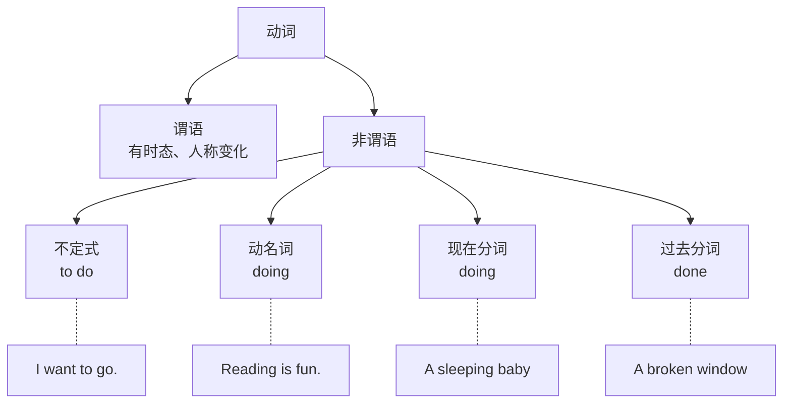
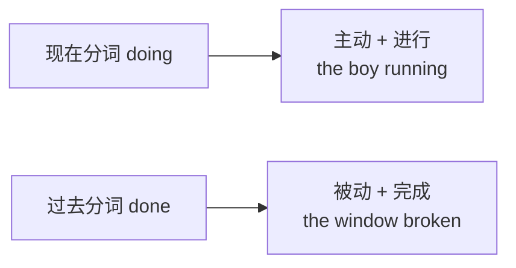

# 非谓语动词框架（to do / doing / done）

> [!info] 本篇定位
> 这是 **04.从句与复合句型框架**分类的**收官篇**。
>
> 非谓语动词 = **动词的三种"变形"**：
>
> - **to do**（不定式）
> - **doing**（动名词 / 现在分词）
> - **done**（过去分词）
>
> 它们**不做谓语**，但可以当**名词、形容词、副词**用——这就是为什么叫"**非谓语**"。
>
> 非谓语动词是英语**简洁表达**的核心。很多长句用从句写啰嗦，用非谓语写简洁。
>
> 典型对比：
>
> - 从句：`Because I was tired, I went home.`
> - 非谓语：`Being tired, I went home.`（更简洁）
>
> 本篇把 3 种非谓语动词的所有用法讲透。

---

## 1. 本篇导读：非谓语动词是什么

### 1.1 谓语 vs 非谓语

**一个句子的"谓语"只有一个**（主动词，决定时态）。剩下的**其他动词**，必须变成**非谓语形式**。

```
主动词（谓语）：I want ...
辅助动词：      I want to eat. (to eat 非谓语)
                  ↑ 不能说 I want eat

同一句子：She enjoys reading books.
         主语 谓语   非谓语(动名词)  宾语
```

### 1.2 非谓语动词的 3 种形态



### 1.3 关键区别

| 形式 | 意义 | 常见角色 |
| ---- | ---- | ---- |
| to do | 动作（目的、未来、未实现）| 主语、宾语、状语、定语 |
| doing（动名词）| 动作本身（抽象名词）| 主语、宾语、表语 |
| doing（现在分词）| 主动、进行 | 定语、状语、表语 |
| done（过去分词）| 被动、完成 | 定语、状语、表语 |

> [!tip] 动名词 vs 现在分词
>
> 形式相同（都是 doing），但**本质不同**：
>
> - **动名词**：当**名词**用（Reading is fun）
> - **现在分词**：当**形容词/副词**用（a sleeping baby）

---

## 2. 不定式（to do）

### 2.1 不定式的形态

| 形式 | 结构 | 例子 |
| ---- | ---- | ---- |
| 一般式 | to do | to eat |
| 进行式 | to be doing | to be eating |
| 完成式 | to have done | to have eaten |
| 完成进行式 | to have been doing | to have been eating |
| 一般被动 | to be done | to be eaten |
| 完成被动 | to have been done | to have been eaten |

### 2.2 不定式的 6 大用法

**用法 1：做主语**

```
To learn English is important.
(学英语很重要。)

To see is to believe.
(眼见为实。)

To err is human.
(犯错是人之常情。)
```

**注意**：做主语时**常用 it 做形式主语**：

```
It is important to learn English.
It is easy to make mistakes.
```

**用法 2：做宾语**

**只能跟不定式做宾语的动词**：
```
want, hope, wish, plan, decide, promise, agree, refuse,
pretend, offer, learn, manage, expect, intend
```

**例句**：

```
I want to go home.
She decided to leave.
They agreed to help us.
He promised to come.
I hope to see you soon.
```

**用法 3：做表语**

```
My dream is to become a doctor.
His goal is to win the race.
The best policy is to tell the truth.
```

**用法 4：做宾补（最常见用法之一）**

很多动词后跟 "**宾语 + to do**"：

```
want sb. to do      I want you to come.
ask sb. to do       She asked me to help.
tell sb. to do      He told me to wait.
expect sb. to do    We expect him to succeed.
advise sb. to do    She advised me to rest.
allow sb. to do     They allowed us to leave.
```

**用法 5：做定语（修饰名词）**

**不定式做定语放在名词后**：

```
I have something to tell you.
(我有话告诉你。)

There's nothing to eat.
(没什么吃的。)

He's the first to arrive.
(他是第一个到的。)

Do you have a pen to write with?
(你有笔可以用来写字吗？——注意保留 with)
```

**用法 6：做状语（表目的、结果）**

**表目的**（最常见）：

```
I went to the store to buy some milk.
(我去商店买牛奶——目的。)

She studies hard to pass the exam.
(她努力学习以通过考试。)

He went abroad to study.
(他出国学习。)
```

**也可以用 in order to / so as to 更强调目的**：

```
I went early in order to get a good seat.
He got up early so as to catch the bus.
```

**表结果**（常带 too/enough）：

```
He is too young to drive.
(他太小不能开车。——结果是不能)

She is old enough to vote.
(她够大可以投票了。)

I was so tired that I couldn't move → So tired as to be unable to move.
```

### 2.3 不定式的 3 种特殊形式

**1. 完成式不定式（to have done）**

表示动作**先于**主句动作发生。

```
I'm happy to have met you.
(我很高兴（已经）见到你。)

She seems to have forgotten.
(她似乎已经忘了。)

He claims to have finished.
(他声称已经完成了。)
```

**2. 进行式不定式（to be doing）**

表示**正在进行**。

```
He seems to be sleeping.
(他好像正在睡觉。)

I pretended to be reading.
(我假装正在读书。)
```

**3. 被动不定式（to be done）**

```
The letter needs to be mailed.
(信需要被寄。)

I want to be invited.
(我想被邀请。)

There is a lot to be done.
(有很多要做的事。)
```

### 2.4 省略 to 的不定式

**某些情况下，to 被省略**（只留动词原形）。

**1. 使役动词 + 宾 + do**（make, let, have）

```
Make him do it.      (让他做。)
Let me go.           (让我走。)
Have him call me.    (让他给我打电话。)
```

**2. 感官动词 + 宾 + do**（see, hear, watch, feel, notice, find）

```
I saw him leave.     (我看见他离开。)
She heard me sing.   (她听见我唱歌。)
```

**注意**：感官动词后面接 **do** vs **doing** 含义不同：
- **do**：完整动作（看到全过程）
- **doing**：动作进行中

```
I saw him cross the street.   (我看他过完了马路。)
I saw him crossing the street. (我看到他正在过马路。)
```

**3. help 后的 to 可省略可不省**

```
Help me (to) carry this box.
I helped her (to) find her keys.
```

**4. why not + 原形**

```
Why not go now?      (为什么不现在就走？)
Why not try again?
```

**5. would rather / had better + 原形**

```
I'd rather stay home.
You'd better hurry.
```

---

## 3. 动名词（doing）

### 3.1 动名词是什么

**动名词** = **动词的 -ing 形式**，当**名词**用，表示"**做某事这件事本身**"。

**特点**：
- 可数/不可数**看具体语境**
- 有**自己的宾语、状语**（还保留动词特性）

### 3.2 动名词的 5 大用法

**用法 1：做主语**

```
Reading is my hobby.
(读书是我的爱好。)

Learning English takes time.
(学英语需要时间。)

Smoking is bad for health.
(吸烟有害健康。)

Being a parent is hard.
(做父母不容易。)
```

> [!tip] 动名词做主语用单数
>
> ```
> ✅ Reading books is fun.    (is，不是 are)
> ✅ Smoking is harmful.
> ```

**用法 2：做宾语（动词后）**

**只能跟动名词的动词**：

```
enjoy, finish, mind, avoid, consider, suggest, admit, deny, miss,
practice, keep, give up, put off, can't help, feel like, look forward to
```

**例句**：

```
I enjoy swimming.
She finished reading the book.
Do you mind opening the window?
Avoid making mistakes.
He suggested trying again.
I can't help laughing.
We're looking forward to seeing you.
```

**用法 3：做表语**

```
Her hobby is painting.
(她的爱好是画画。)

Seeing is believing.
(眼见为实。)

His job is teaching math.
```

**用法 4：做定语（修饰名词）**

**动名词做定语表"用途"**：

```
a swimming pool         (游泳池——用来游泳的)
a reading room          (阅览室)
a sleeping bag          (睡袋)
a walking stick         (拐杖)
drinking water          (饮用水)
```

**区别于现在分词定语**：

```
a swimming pool       (动名词：pool for swimming)
a swimming fish       (现在分词：a fish that is swimming)

a sleeping bag        (动名词：bag for sleeping)
a sleeping baby       (现在分词：baby who is sleeping)
```

**用法 5：介词后（必须用动名词）**

```
Thank you for helping me.       (谢谢帮忙)
I'm tired of waiting.
She's good at singing.
He is fond of traveling.
I'm interested in learning.
What about going out?
Before leaving, he called.
After finishing, he left.
```

> [!warning] 介词后绝不用不定式
>
> - ❌ Thanks for to help me.
> - ✅ Thanks for helping me.
>
> - ❌ I'm good at to sing.
> - ✅ I'm good at singing.

### 3.3 动名词的完成式和被动式

**完成式**：`having + done`

```
He admitted having stolen the money.
(他承认偷过钱。)

I regret having said that.
(我后悔说过那话。)
```

**被动式**：`being + done`

```
She hates being ignored.
(她讨厌被忽视。)

He is afraid of being criticized.
(他害怕被批评。)
```

### 3.4 动名词的逻辑主语

**动名词前可加名词/代词所有格**，表示**动作的执行者**。

```
I don't mind his coming.           (我不介意他来——正式)
I don't mind him coming.           (我不介意他来——口语)

Thanks for your helping me.        (正式)
Thanks for you helping me.         (口语)
```

---

## 4. 不定式 vs 动名词的选择

### 4.1 都可接的动词（意思不同）

**最重要的 4 个动词**：remember, forget, stop, try

**remember**：

```
Remember to lock the door.     (记得去锁门——将要做)
I remember locking the door.   (我记得我锁了门——已经做了)
```

**forget**：

```
Don't forget to call me.       (别忘了打给我——将要打)
I forgot calling her.          (我忘了我已经打过了——已经打了)
```

**stop**：

```
I stopped to smoke.            (我停下来去抽烟——目的)
I stopped smoking.             (我戒烟了——停止抽烟)
```

**try**：

```
Try to do it.                  (试着做——尝试做到)
Try doing it.                  (试试这样做——尝试不同方法)
```

### 4.2 意思差不多的动词

**like, love, hate, prefer, start, begin, continue**：**两种都可**，意思几乎相同。

```
I like swimming.     = I like to swim.
She loves reading.   = She loves to read.
I started crying.    = I started to cry.
```

### 4.3 只能接不定式的常见动词

```
want, hope, wish, plan, decide, promise, agree, refuse,
pretend, offer, learn, manage, expect, intend, choose,
fail, afford, attempt, claim, dare, demand, deserve, seem
```

**例句**：

```
I want to go.
I hope to see you.
She decided to leave.
He refused to help.
```

### 4.4 只能接动名词的常见动词

```
enjoy, finish, mind, avoid, consider, suggest, admit, deny, miss,
practice, keep (on), give up, put off, can't help, feel like,
look forward to, be used to, devote to, confess to, object to
```

**例句**：

```
I enjoy reading.
Avoid making noise.
Keep trying.
I'm looking forward to seeing you.
```

> [!warning] 特殊"to"陷阱
>
> **look forward to, be used to, get used to, object to, devote to, stick to** 中的 to 是**介词**，**后面必须用动名词**，不是不定式！
>
> - ❌ I look forward to see you.
> - ✅ I look forward to seeing you.
>
> - ❌ I'm used to get up early.
> - ✅ I'm used to getting up early.

### 4.5 助记口诀

**只接 to do 的动词**（"want / hope / plan / promise"家族）：
- 一般是**将来性、主观愿望**的动词

**只接 doing 的动词**（"enjoy / finish / mind / avoid"家族）：
- 一般是**已经发生、习惯性、负面情绪**的动词

### 4.6 动词 + 宾语 + to do 结构

**特殊结构**：**很多动词必须跟"宾语 + to do"**

```
want sb. to do       ask sb. to do
tell sb. to do       advise sb. to do
invite sb. to do     allow sb. to do
expect sb. to do     encourage sb. to do
forbid sb. to do     force sb. to do
```

**例句**：

```
I want you to come.
She asked me to help.
They invited us to the party.
He told me to wait.
```

---

## 5. 现在分词（doing）

### 5.1 现在分词的核心含义

**现在分词表示**：
- **主动**（动作由名词主动做）
- **进行**（动作正在发生）

### 5.2 现在分词的 4 大用法

**用法 1：做定语**

现在分词做定语**修饰名词**，表"**正在……的**"。

**单个分词放名词前**：

```
a sleeping baby         (睡着的婴儿)
a running man           (跑着的男人)
boiling water           (沸腾的水)
a dying patient         (垂死的病人)
```

**短语放名词后**：

```
The boy standing there is my brother.
(站在那儿的男孩是我弟弟。)

The woman wearing red is my teacher.
(穿红衣服的女人是我老师。)

Look at the dogs playing in the park.
(看公园里玩耍的狗。)
```

**用法 2：做状语**

现在分词短语做状语，常表**时间、原因、条件、伴随、结果**。

**时间**：
```
Walking down the street, I saw her.
(走在街上时，我看见她。)
= When I was walking down the street...
```

**原因**：
```
Feeling tired, I went home.
(感到累，我回家了。)
= Because I felt tired...
```

**条件**：
```
Working hard, you will succeed.
(努力工作你会成功。)
= If you work hard...
```

**伴随**：
```
He walked away, humming a song.
(他走开了，哼着歌。)
```

**结果**：
```
The fire spread quickly, destroying the building.
(火势蔓延迅速，摧毁了建筑。)
```

**用法 3：做表语**

```
The story is interesting.        (故事有趣——修饰 story)
The news is shocking.            (新闻令人震惊)
His job is exhausting.           (他的工作让人疲惫)
```

**用法 4：做宾补**

**感官/使役动词 + 宾 + doing**：

```
I saw him running.               (我看见他在跑——正在跑)
I heard her singing.             (我听到她在唱)
I kept him waiting.              (我让他一直等着)
I left the door standing open.   (我让门一直开着)
```

### 5.3 现在分词的独立主格结构

当**分词的逻辑主语**和**主句主语**不同时，需要**明确加上分词的主语**，形成"**独立主格**"。

**公式**：`名词/代词主格 + 分词 / 形容词 / 介词短语`

```
Weather permitting, we'll have a picnic.
(如果天气允许，我们去野餐。)

The meeting being over, everyone left.
(会议结束，大家都走了。)

He left, his friend accompanying him.
(他走了，他朋友陪着他。)

All things considered, it's a good plan.
(考虑所有因素，这是个好计划。)
```

**独立主格常表原因、时间、条件、伴随**，相当于从句但更简洁。

---

## 6. 过去分词（done）

### 6.1 过去分词的核心含义

**过去分词表示**：
- **被动**（动作作用于名词）
- **完成**（动作已经结束）

### 6.2 过去分词的 4 大用法

**用法 1：做定语**

过去分词做定语，表"**被……的**"或"**已……的**"。

**单个分词放名词前**：

```
a broken window         (破窗——被打破的)
stolen goods            (赃物——被偷的)
fallen leaves           (落叶——已落的)
boiled water            (开水——已煮沸的)
fried chicken           (炸鸡)
```

**短语放名词后**：

```
The book written by Tom is interesting.
(Tom 写的书很有趣——被 Tom 写的)

The car parked outside is mine.
(停外面的车是我的——被停的)

Students invited to the party were happy.
(被邀请参加聚会的学生很开心。)
```

**用法 2：做状语**

过去分词做状语，表**被动或已完成**。

**时间 / 原因（被动）**：
```
Seen from above, the city looks beautiful.
(从上面看，这城市很美——被看。)

Lost in thought, he didn't hear me.
(陷入沉思，他没听见我。)

Tired from work, she went to bed.
(工作累了，她上床睡了。)
```

**条件**：
```
Properly trained, the dog can do tricks.
(训练得当，狗能做把戏。)
```

**用法 3：做表语**

```
He is tired.              (他累了——tired 描述状态)
I am satisfied.           (我满意)
The door is broken.       (门坏了)
She seems worried.        (她似乎担心)
```

**用法 4：做宾补**

**感官/使役动词 + 宾 + done（被动）**：

```
I had my hair cut.        (我剪了头发——头发被剪)
She had her car washed.   (她洗了车——车被洗)
I want it done by Friday. (我要它在周五前完成。)
Keep the door closed.     (保持门关着。)
```

---

## 7. 现在分词 vs 过去分词（最重要区分！）

### 7.1 核心区别



### 7.2 -ed vs -ing 形容词

很多 **-ed 和 -ing 成对**的形容词，意思不同：

| -ing（现在分词）| -ed（过去分词）|
| ---- | ---- |
| interesting 令人感兴趣的 | interested 感到兴趣的 |
| exciting 令人激动的 | excited 感到激动的 |
| boring 令人无聊的 | bored 感到无聊的 |
| surprising 令人惊讶的 | surprised 感到惊讶的 |
| confusing 令人困惑的 | confused 感到困惑的 |
| tiring 令人疲劳的 | tired 感到疲劳的 |
| moving 令人感动的 | moved 受感动的 |
| shocking 令人震惊的 | shocked 感到震惊的 |

**规则**：
- **-ing**：修饰**事物**（让人感觉如何）
- **-ed**：修饰**人**（感觉如何）

**对比**：

```
The movie is interesting.       (电影有趣——形容电影)
I am interested in the movie.   (我对电影感兴趣——形容人)

The story is boring.            (故事无聊)
I am bored.                     (我感到无聊)

The news was shocking.          (消息令人震惊)
We were shocked by the news.    (我们被消息震惊)
```

> [!warning] 中国学生常错
>
> - ❌ I am boring.  (中文思维："我很无聊"——但这意思变成"我这人乏味")
> - ✅ I am bored.   (我感到无聊)

### 7.3 做定语对比

**the running man**：正在跑的人（主动 + 进行）
**the caught man**：被抓的人（被动 + 完成）

```
falling leaves          (正在落的叶子——进行)
fallen leaves           (已经落的叶子——完成)

the rising sun          (正在升的太阳)
the risen sun           (已升起的太阳)

boiling water           (沸水——正在沸)
boiled water            (开水——已煮沸)
```

### 7.4 做状语对比

```
Seeing the truth, he left.      (看到真相——主动)
Seen from here, it's beautiful. (从这儿看——被看，被动)

Feeling tired, I rested.        (感到累——主动）
Tired from work, I rested.      (被工作弄累——被动)
```

---

## 8. 非谓语动词的完成式 / 被动式

### 8.1 不定式的完成式和被动式

```
一般式：       to do
完成式：       to have done（先于主句动作）
进行式：       to be doing（正在进行）
被动式：       to be done
完成被动式：   to have been done
```

**例句**：

```
一般：I hope to see you soon.
完成：I am glad to have met you. (已见过)
进行：He seems to be sleeping. (正在睡)
被动：I want to be invited.
完成被动：This is known to have been built in 1920.
```

### 8.2 动名词的完成式和被动式

```
一般：doing
完成：having done
被动：being done
完成被动：having been done
```

**例句**：

```
一般：I enjoy reading.
完成：He admitted having cheated. (承认作弊过)
被动：I hate being ignored.
完成被动：She complained about having been ignored.
```

### 8.3 分词的完成式和被动式

```
一般现在分词：doing
完成现在分词：having done
过去分词（本身就是被动/完成）：done
```

**例句**：

```
一般：Walking down the street, I met her.
完成：Having finished my work, I left.
     (做完工作后我走了——强调完成)
```

---

## 9. 非谓语动词综合对比

### 9.1 一张表搞定

| 形式 | 主动 | 被动 |
| ---- | ---- | ---- |
| 不定式一般 | to do | to be done |
| 不定式完成 | to have done | to have been done |
| 动名词一般 | doing | being done |
| 动名词完成 | having done | having been done |
| 现在分词一般 | doing | being done |
| 现在分词完成 | having done | having been done |
| 过去分词 | —— | done |

### 9.2 同一意思的不同表达

**例子**：我看见他在哭。

```
动词：      I see him cry.          (SVOC，完整动作)
doing 宾补：I see him crying.       (正在哭)
done 宾补： I have him punished.    (被罚)

从句：      I see that he is crying.
非谓语：    I see him crying.
```

### 9.3 非谓语 vs 从句（转换）

**非谓语动词可以转换为从句，反之亦然**：

```
非谓语：Walking home, I saw a dog.
从句：  When I was walking home, I saw a dog.

非谓语：Feeling tired, I went to bed.
从句：  Because I felt tired, I went to bed.

非谓语：To pass the exam, I studied hard.
从句：  So that I could pass the exam, I studied hard.
```

**用非谓语的好处**：**更简洁、更地道**。

---

## 10. 非谓语动词典型例句（25 个）

> [!success] 非谓语动词例句精选
>
> **不定式 to do**
> 1. `I want to travel the world.`（我想环游世界。）
> 2. `To learn English is important.`（学英语很重要。）
> 3. `She has a lot of work to do.`（她有很多工作要做。）
> 4. `I went to the store to buy milk.`（我去商店买牛奶。）
> 5. `He is too young to drive.`（他太小不能开车。）
> 6. `I'm happy to meet you.`（很高兴见到你。）
>
> **动名词 doing**
> 7. `Reading is my favorite hobby.`（读书是我最爱的爱好。）
> 8. `I enjoy learning new things.`（我喜欢学新东西。）
> 9. `Thanks for helping me.`（谢谢帮我。）
> 10. `I'm tired of waiting.`（我等烦了。）
> 11. `I look forward to seeing you.`（我盼望见到你。）
> 12. `She is good at singing.`（她擅长唱歌。）
>
> **现在分词 doing**
> 13. `The boy running over there is my son.`（跑的男孩是我儿子。）
> 14. `Feeling tired, I went to bed.`（感到累我上床睡了。）
> 15. `He sat in the chair, reading a book.`（他坐在椅子上读书。）
> 16. `Walking down the street, she saw an old friend.`（走在街上她看到老朋友。）
>
> **过去分词 done**
> 17. `The book written by Tom is great.`（Tom 写的书很棒。）
> 18. `The window broken yesterday is fixed now.`（昨天打破的窗户修好了。）
> 19. `Lost in thought, he missed his stop.`（陷入沉思他错过了站。）
> 20. `Surprised by the news, she cried.`（被新闻吓到她哭了。）
>
> **特殊用法**
> 21. `I had my hair cut.`（我剪了头发。）
> 22. `I saw him leave the room.`（我看见他离开房间。——完整动作）
> 23. `I saw him leaving the room.`（我看见他正离开房间。——动作中）
> 24. `Having finished my work, I went home.`（做完工作我回家了。）
> 25. `Weather permitting, we'll go.`（如果天气允许我们就去。）

---

## 11. 场景实战：非谓语动词综合应用

**场景**：周末活动描述

```
Waking up early on Saturday, I decided to go hiking.
[现在分词作状语] [不定式作宾语]

I wanted to enjoy the beautiful weather, so I packed
a lunch to bring with me.
[不定式作宾语] [不定式作定语]

Walking in the forest, I saw many birds singing.
[现在分词作状语] [现在分词作宾补]

Feeling tired after an hour, I sat on a fallen tree to rest.
[现在分词原因] [过去分词作定语] [不定式作目的]

Looking up, I noticed the sky turning orange.
[现在分词] [现在分词作宾补]

Having rested for 20 minutes, I continued hiking.
[完成式分词]

Reaching the top, I felt accomplished.
[现在分词] [过去分词作表语]

The view seen from the top was breathtaking.
[过去分词作定语] [现在分词作表语]

It was worth the effort to climb up.
[形容词] [不定式作主语]

I looked forward to sharing the photos with friends.
[动名词，因为 to 是介词]

Having had such a great time, I decided to hike every weekend.
[完成式分词] [不定式作宾语]
```

**统计**：一段 12 句对话用了 **15+ 处非谓语动词**（几乎每句都有）。

---

## 12. 常见错误大盘点

### 12.1 错误 1：介词后用不定式

```
❌ Thank you for to help.
✅ Thank you for helping.
```

### 12.2 错误 2：look forward to + 原形

```
❌ I look forward to see you.
✅ I look forward to seeing you.
```

### 12.3 错误 3：动名词主语用复数

```
❌ Reading books are fun.
✅ Reading books is fun.
```

### 12.4 错误 4：-ed / -ing 形容词混用

```
❌ I am boring.（说自己乏味）
✅ I am bored.

❌ The movie is interested.
✅ The movie is interesting.
```

### 12.5 错误 5：现在分词 / 过去分词选错

```
❌ The man stealing was caught.（被偷的？谁偷？）
✅ The stolen wallet was found.（被偷的钱包）
✅ The man stealing the wallet was caught.（正在偷的人）
```

### 12.6 错误 6：remember/forget/stop/try 选错

```
❌ Remember locking the door.（意思："我记得锁过"——不是提醒）
✅ Remember to lock the door.（记得去锁——提醒）
```

### 12.7 错误 7：非谓语动词主语混乱

```
❌ Walking home, a dog bit me.（字面意思："狗走回家路上咬了我"——主语是狗？）
✅ Walking home, I was bitten by a dog.
```

### 12.8 错误 8：独立主格忘了加主语

```
❌ Permitting, we'll have a picnic.
✅ Weather permitting, we'll have a picnic.
```

---

## 13. 练习与输出建议

> [!success] 本篇练习清单
>
> **选择 to do 还是 doing**
>
> 1. 用正确的形式填空：
>    - I enjoy _____ (read).
>    - She decided _____ (leave).
>    - Thanks for _____ (help) me.
>    - He agreed _____ (come).
>    - Avoid _____ (make) noise.
>    - I'm looking forward to _____ (see) you.
>    - Remember _____ (close) the door when you leave.
>    - I forgot _____ (post) the letter (我忘了寄信——已经忘).
>
> **-ed vs -ing 形容词**
>
> 2. 选择正确的形式：
>    - The news was (surprised / surprising).
>    - I was (surprised / surprising) by the news.
>    - This book is (interested / interesting).
>    - The students look (bored / boring).
>
> **现在分词 vs 过去分词**
>
> 3. 选择正确的形式：
>    - The man (driving / driven) the car is my brother.
>    - The window (breaking / broken) yesterday is fixed.
>    - Look at the leaves (falling / fallen) from the tree.
>    - (Seeing / Seen) from above, the city is beautiful.
>
> **改错练习**
>
> 4. 改正错误：
>    - I'm used to get up early.
>    - Thank you for to invite me.
>    - I am very interesting in English.
>    - Walking home, the sky turned dark.
>
> **翻译练习**
>
> 5. 翻译下列中文：
>    - 我来这儿是为了学英语。
>    - 我喜欢旅行。
>    - 坐在那边的女孩是我的妹妹。
>    - 破碎的窗户需要修理。
>    - 感到累了，我决定休息。
>
> **长期任务**
>
> 6. 找一段英文文章，**标注所有非谓语动词**并分析它们的角色。

### 13.1 参考答案

**练习 1**：
- reading, to leave, helping, to come, making, seeing, to close, posting

**练习 2**：
- surprising, surprised, interesting, bored

**练习 3**：
- driving, broken, falling, Seen

**练习 4**：
- I'm used to getting up early.
- Thank you for inviting me.
- I am very interested in English.
- Walking home, I saw the sky turn dark. （主从主语要一致）

**练习 5**：
- I came here to learn English.
- I like traveling. / I like to travel.
- The girl sitting there is my sister.
- The broken window needs to be fixed. / ... needs fixing.
- Feeling tired, I decided to rest.

---

## 14. 本篇小结

> [!success] 本篇核心要点回顾
>
> **非谓语动词 3 种形态**：
> - **to do** 不定式
> - **doing** 动名词 / 现在分词
> - **done** 过去分词
>
> **不定式 to do**：主/宾/表/定/状/宾补，表未来/目的/愿望
>
> **动名词 doing**：主/宾/表/定/介词后，表动作本身（抽象名词）
>
> **现在分词 doing**：定/状/表/宾补，表**主动 + 进行**
>
> **过去分词 done**：定/状/表/宾补，表**被动 + 完成**
>
> **最重要对比**：
>
> 1. **动名词 vs 现在分词**：前者名词，后者形容词/副词
> 2. **现在分词 vs 过去分词**：主动 vs 被动
> 3. **to do vs doing**：看具体动词（want → to do, enjoy → doing）
> 4. **-ing 形容词 vs -ed 形容词**：事物用 -ing，人用 -ed
>
> **remember/forget/stop/try 双重含义**：
> - to do：要去做
> - doing：做过了
>
> **只接 to do 的动词**：want, hope, decide, promise, agree, refuse 等
>
> **只接 doing 的动词**：enjoy, finish, mind, avoid, consider, suggest 等
>
> **特殊介词 to + doing**：look forward to, be used to, object to, devote to
>
> **省略 to**：使役（make/let/have）、感官（see/hear/watch）

### 14.1 从句与复合句型框架分类收官

恭喜完成 **04.从句与复合句型框架** 分类全部 4 篇：

```
✅ 01.名词性从句四大类型      (整句当名词)
✅ 02.定语从句完全手册        (整句当形容词)
✅ 03.状语从句九大类型        (整句当副词)
✅ 04.非谓语动词框架          (动词的三种变形)
```

**现在你已经掌握**：
- 英语**复合句的所有结构**
- **4 种名词性从句**的引导词和用法
- **定语从句**的所有关系词
- **9 类状语从句**的逻辑关系
- **3 种非谓语动词**的选择规则

**这 4 篇是英语语法最难的部分**。吃透这些，你已经超过 70% 的英语学习者。

### 14.2 整体进度小结

**已完成 4 个分类（16 篇，33.3%）**：
- ✅ 01.入门基础（4 篇）
- ✅ 02.基础句型框架（4 篇）
- ✅ 03.时态与语态句型框架（4 篇）
- ✅ 04.从句与复合句型框架（4 篇）

**接下来**：
- 05.高频实用表达句型框架（4 篇）
- 06-12.7 个场景实战分类（28 篇）

**从第 5 分类起，重心从"纯语法"转向"实用应用"**，难度会下降，实用性会上升。

### 14.3 下一分类预告

> [!info] 下一分类：05.高频实用表达句型框架
>
> 接下来 4 篇：
>
> - **05.01** 表达观点与态度的 50 个万能句型
> - **05.02** 建议请求邀请拒绝四大功能句型
> - **05.03** 同意反对让步转折句型库
> - **05.04** 比较对比举例总结句型库
>
> 这 4 篇把前面学的语法**变成可以直接使用的"万能句型"**。每篇都是**可以直接背下来就能用**的。
>
> 读完 05 分类，你就能**像母语者一样流畅表达各种语义功能**。
