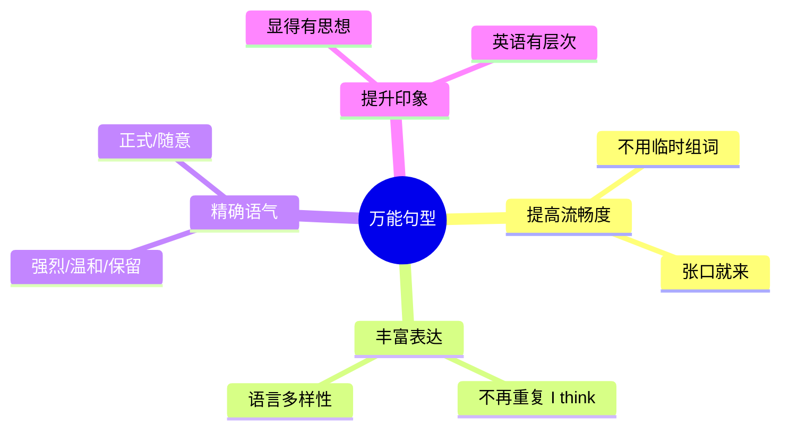
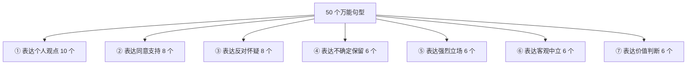
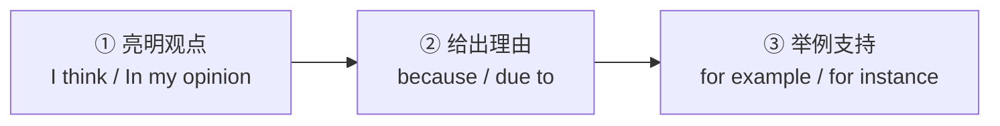

# 表达观点与态度的 50 个万能句型

> [!info] 本篇定位
> 恭喜进入 **05.高频实用表达句型框架** 分类！
>
> 前 4 个分类讲的是"**语法骨架**"，这个分类讲的是"**可以直接拿来用的万能句型**"。
>
> **观点表达**是英语中最频繁的语用功能之一——无论是日常聊天、开会讨论、学术辩论，都需要表达"我认为……"、"我同意……"、"我不赞同……"。
>
> 中国学生常被"**翻来覆去只会说 I think**"困扰。读完本篇，你能掌握 **50 个不同正式度、不同语气**的观点表达句型，让你的英语**层次感**立刻提升。

---

## 1. 本篇导读：为什么需要万能句型

### 1.1 一个尴尬场景

开会讨论一个方案。你想表达"我觉得这个方案不错"。

**只会初级表达**：
```
A: I think it's good.
B: I think it's bad.
A: I think so.
B: I don't think so.
(5 分钟内用了 10 次 "I think"，显得单薄。)
```

**会用万能句型**：
```
A: In my opinion, this is a solid plan.
B: I see your point, but I have some concerns.
A: I totally agree with most of it.
B: From my perspective, there's room for improvement.
```

**相同意思**，但后者**词汇丰富、层次清晰、显得有见解**。

### 1.2 万能句型的价值



### 1.3 本篇 50 个句型按 7 类功能分



---

## 2. 类别一：表达个人观点（10 个）

### 2.1 核心 10 个句型

> [!success] 表达"我认为"的 10 种说法
>
> **① I think (that) ...**
> 最通用、最口语。
> - `I think he is right.`
>
> **② I believe (that) ...**
> 比 think 更坚定，有"信念"感。
> - `I believe we can do it.`
>
> **③ In my opinion, ...**
> 稍正式，适合发言、写作。
> - `In my opinion, the plan needs revision.`
>
> **④ In my view, ...**
> = In my opinion，稍正式。
> - `In my view, this is the best option.`
>
> **⑤ From my perspective, ...**
> "从我的角度"，强调主观视角。
> - `From my perspective, it's a good idea.`
>
> **⑥ As far as I'm concerned, ...**
> "在我看来/就我而言"，较正式。
> - `As far as I'm concerned, we should try.`
>
> **⑦ If you ask me, ...**
> "要我说"，较随意。
> - `If you ask me, he's wrong.`
>
> **⑧ To my mind, ...**
> "依我看"，稍文学。
> - `To my mind, honesty matters most.`
>
> **⑨ Personally, ...**
> "就我个人而言"，简洁有力。
> - `Personally, I love this idea.`
>
> **⑩ The way I see it, ...**
> "我的看法是"，口语化。
> - `The way I see it, we have no choice.`

### 2.2 正式度分级

| 句型 | 正式度 | 适合场合 |
| ---- | ---- | ---- |
| If you ask me | 随意 | 朋友聊天 |
| I think | 中性 | 几乎所有场合 |
| Personally | 中性 | 对话、写作 |
| The way I see it | 中性 | 口语 |
| I believe | 中性偏正式 | 陈述观点 |
| In my opinion | 正式 | 演讲、报告 |
| In my view | 正式 | 同上 |
| From my perspective | 正式 | 商务 / 学术 |
| As far as I'm concerned | 正式 | 辩论 / 讨论 |
| To my mind | 文学 | 书面 / 演讲 |

### 2.3 使用对比示例

**同一主题：对"工作 vs 生活"发表看法**

```
I think work is important.
(最普通)

In my opinion, work-life balance is essential.
(正式)

From my perspective, work is just a part of life, not all.
(深度)

If you ask me, too much work kills the soul.
(口语 + 情绪)

The way I see it, you work to live, not live to work.
(观点鲜明)
```

### 2.4 使用禁忌

> [!warning] 3 个常见错误
>
> **错误 1：In my opinion + I think（重复）**
> - ❌ `In my opinion, I think...`
> - ✅ `In my opinion, this is...` 或 `I think this is...`
>
> **错误 2：According to me**
> - ❌ `According to me, it's good.`
> - ✅ `In my opinion` / `I think`
> - `according to` 通常用于第三方信息来源（according to the news / according to him）
>
> **错误 3：As far as I know 乱用**
> - `As far as I know` = "据我所知"，表示**信息掌握范围**
> - `As far as I'm concerned` = "就我而言"，表示**观点**
>
> ```
> As far as I know, the meeting is cancelled. (据我所知，会议取消了——信息)
> As far as I'm concerned, we should cancel.   (就我而言，我们应该取消——观点)
> ```

---

## 3. 类别二：表达同意与支持（8 个）

### 3.1 核心 8 个句型

> [!success] 表达"同意"的 8 种说法
>
> **⑪ I agree (with you).**
> 最基础。
>
> **⑫ I totally / completely / absolutely agree.**
> 完全同意，加强语气。
> - `I totally agree with your point.`
>
> **⑬ That's a good point.**
> "说得好"，先肯定对方。
>
> **⑭ You're right.**
> "你说得对"，直接认同。
>
> **⑮ I couldn't agree more.**
> "我再同意不过了"——**最强**的同意，字面"不能同意更多"。
>
> **⑯ That makes sense.**
> "有道理"，理性同意。
>
> **⑰ I'm with you on this.**
> "在这件事上我支持你"，朋友语气。
>
> **⑱ Exactly! / Absolutely! / Precisely!**
> 简短强烈认同。

### 3.2 强度排序

```
最强 ↑
  I couldn't agree more.          (完全同意)
  Absolutely! / Exactly!           (绝对没错)
  I totally/completely agree.      (完全同意)
  You're absolutely right.         (你完全对)
  I'm with you on this.            (我支持你)
  That makes sense.                (有道理)
  That's a good point.             (说得好)
  I agree.                         (同意)
最弱 ↓
```

### 3.3 典型对话应用

```
A: "We should focus on customer satisfaction."
B: "I couldn't agree more. Without happy customers, nothing matters."

A: "Working from home makes us more productive."
B: "Absolutely! I get so much more done at home."

A: "We need to invest in AI technology."
B: "That makes sense. It's the future."

A: "Let's cancel tomorrow's meeting."
B: "I'm with you on that. We don't really need it."
```

### 3.4 同意后的转折

**真实对话中，同意常常是"铺垫"**，后面跟**转折**：

```
"I see your point, but ..."            (我理解你，但……)
"You're right, however, ..."           (对，然而……)
"That's true, although, ..."           (没错，虽然……)
"I agree to some extent, but ..."      (我某种程度同意，但……)
```

这是**西方讨论的礼貌技巧**——先肯定对方，再提出不同看法。

---

## 4. 类别三：表达反对与怀疑（8 个）

### 4.1 核心 8 个句型

> [!success] 表达"不同意"的 8 种说法
>
> **⑲ I disagree.**
> 最直接。
>
> **⑳ I'm afraid I disagree / I have to disagree.**
> 委婉的不同意。
>
> **㉑ I don't think so.**
> "我不这么认为"，温和。
>
> **㉒ I see it differently.**
> "我看法不同"，中性。
>
> **㉓ I'm not sure about that.**
> "我对此不确定"，保留态度。
>
> **㉔ I beg to differ.**
> "恕我不敢苟同"，正式。
>
> **㉕ With all due respect, ...**
> "恕我冒昧"，正式反对。
>
> **㉖ I'm sorry, but I can't agree.**
> 礼貌反对。

### 4.2 强度分级（从温和到强烈）

| 语气 | 句型 |
| ---- | ---- |
| 最温和 | I'm not sure about that. |
| 温和 | I see it differently. |
| 温和 | I don't think so. |
| 中性 | I have to disagree. |
| 中性 | I'm afraid I disagree. |
| 正式 | With all due respect, I disagree. |
| 正式 | I beg to differ. |
| 直接 | I disagree. |

### 4.3 中英文化差异：如何礼貌地不同意

> [!warning] 英语文化中"不同意"不能太直接
>
> 中文里"我不同意"可以直接说，但英语里**直接说 "I disagree"** 可能显得太冲。
>
> **英语常见的委婉反对模式**：
>
> 1. **先肯定再反对**：
> ```
> "You're right that costs matter, but quality is more important."
> ```
>
> 2. **用疑问表达**：
> ```
> "Don't you think we should consider another angle?"
> ```
>
> 3. **用"可能"软化**：
> ```
> "I'm not sure that's the best approach."
> ```
>
> 4. **铺垫道歉**：
> ```
> "With all due respect, I don't quite see it that way."
> ```

### 4.4 表达怀疑的附加句型

```
I'm not convinced.                    (我不信服。)
I have my doubts about that.          (我对此有疑虑。)
That sounds too good to be true.      (听起来太好了不像真的。)
I find that hard to believe.          (我觉得难以置信。)
Are you sure about that?              (你确定吗？)
Really? I don't buy it.               (真的吗？我不信。)
```

---

## 5. 类别四：表达不确定与保留（6 个）

### 5.1 核心 6 个句型

当你**不完全确定**自己的观点时，用这些句型**留有余地**。

> [!success] 表达"不确定/保留"的 6 种说法
>
> **㉗ I'm not sure, but ...**
> "我不确定，但是……"
>
> **㉘ It seems that ...**
> "似乎……"
>
> **㉙ It looks like ...**
> "看起来……"
>
> **㉚ I guess ...**
> "我猜……"
>
> **㉛ I suppose ...**
> "我想大概……"
>
> **㉜ If I'm not mistaken, ...**
> "如果我没记错的话……"

### 5.2 应用示例

```
I'm not sure, but I think the meeting was moved to 3 PM.

It seems that we have a problem with the server.

It looks like they're going to be late.

I guess we'll have to reschedule.

I suppose that's the best we can do.

If I'm not mistaken, this is the third time this week.
```

### 5.3 强化保留的工具词

```
kind of     有点
sort of     有点
somewhat    多少
maybe       也许
perhaps     或许
possibly    可能
probably    大概
```

**举例**：

```
It's kind of interesting.              (有点意思——降低绝对性)
That's sort of what I meant.           (差不多是我的意思。)
She's somewhat skeptical.              (她多少有些怀疑。)
Maybe we should try again.             (也许我们该再试试。)
```

---

## 6. 类别五：表达强烈立场（6 个）

### 6.1 核心 6 个句型

当你**非常确定**或**非常强烈**要表达某种观点时：

> [!success] 表达"强烈立场"的 6 种说法
>
> **㉝ I strongly believe (that) ...**
> "我强烈相信……"
>
> **㉞ I'm convinced (that) ...**
> "我坚信……"
>
> **㉟ There's no doubt (that) ...**
> "毫无疑问……"
>
> **㊱ I insist (that) ...**
> "我坚持认为……"
>
> **㊲ It's clear/obvious (that) ...**
> "很明显……"
>
> **㊳ Without a doubt, ...**
> "毫无疑问地……"

### 6.2 示例

```
I strongly believe that education is the key to success.
(我强烈相信教育是成功的关键。)

I'm convinced that we made the right decision.
(我坚信我们做了正确的决定。)

There's no doubt that climate change is real.
(毫无疑问气候变化是真的。)

I insist that we follow the rules.
(我坚持我们要遵守规则。)

It's clear that he's not interested.
(很明显他不感兴趣。)

Without a doubt, she's the best candidate.
(毫无疑问她是最好的候选人。)
```

### 6.3 强度等级

```
"I think it's cold."                   (普通)
"I'm sure it's cold."                  (确定)
"I'm convinced it's cold."             (坚信)
"I strongly believe it's cold."        (强烈)
"There's no doubt it's cold."          (毫无疑问)
```

---

## 7. 类别六：表达客观与中立（6 个）

### 7.1 核心 6 个句型

在**正式场合、辩论、学术写作**中，需要**客观表达**：

> [!success] 表达"客观中立"的 6 种说法
>
> **㊴ It is said that ...**
> "据说……"
>
> **㊵ It is believed that ...**
> "人们认为……"
>
> **㊶ It is widely known that ...**
> "众所周知……"
>
> **㊷ Research shows that ...**
> "研究表明……"
>
> **㊸ Statistics indicate that ...**
> "数据显示……"
>
> **㊹ Some people argue that ..., while others think ...**
> "有人认为……，也有人认为……"

### 7.2 示例

```
It is said that practice makes perfect.
(据说熟能生巧。)

It is believed that the universe is expanding.
(人们相信宇宙在膨胀。)

It is widely known that smoking is harmful.
(众所周知吸烟有害。)

Research shows that sleep is essential for health.
(研究表明睡眠对健康至关重要。)

Statistics indicate that online shopping is growing.
(数据显示网购在增长。)

Some people argue that AI is a threat, while others think it's an opportunity.
(有人认为 AI 是威胁，有人认为是机会。)
```

### 7.3 客观表达的特点

- 用**被动语态**（It is said/believed/known）
- 引用**数据/研究**（Research shows...）
- 呈现**多方观点**（Some...while others...）
- 避免 **I think**（太主观）

---

## 8. 类别七：表达价值判断（6 个）

### 8.1 核心 6 个句型

表达"**好/坏/重要/必要**"等价值判断：

> [!success] 表达"价值判断"的 6 种说法
>
> **㊺ It's important (that / to) ...**
> "……很重要"
>
> **㊻ It's essential / crucial / vital (that / to) ...**
> "……必不可少"（更强）
>
> **㊼ It's worth (doing) ...**
> "值得做……"
>
> **㊽ It's a shame / a pity that ...**
> "……真可惜"
>
> **㊾ It's about time (that) ...**
> "……也是时候了"
>
> **㊿ It's better to ... than to ...**
> "……比……好"

### 8.2 示例

```
It's important to listen to others.
(倾听别人很重要。)

It's essential that we save the environment.
(保护环境必不可少。)

It's worth trying once.
(值得试一次。)

It's a shame he couldn't come.
(真可惜他不能来。)

It's about time you apologized.
(你也是时候道歉了。)

It's better to give than to receive.
(给予比接受更好。)
```

### 8.3 重要性分级

```
轻：useful, helpful, nice              (有用、有帮助、好)
中：important, necessary               (重要、必要)
重：essential, crucial, vital          (必不可少、关键、至关重要)
极重：indispensable, fundamental       (不可或缺、根本的)
```

**对比**：

```
Water is useful.           (水有用)
Water is important.        (水重要)
Water is essential.        (水必不可少)
Water is indispensable.    (水不可或缺)
```

---

## 9. 50 句型综合应用：一场讨论

### 9.1 场景：团队讨论新产品方向

```
Manager:  "I think we should pivot to mobile."
          [㉚ I think]

Alice:    "From my perspective, mobile is the future."
          [⑤ From my perspective]

Bob:      "I couldn't agree more. Research shows that 80% of users
          now access content on phones."
          [⑮ I couldn't agree more + ㊷ Research shows]

Charlie:  "I see your point, but I'm not convinced."
          [先同意 + ⑤ 不确定]

Manager:  "Why not?"

Charlie:  "With all due respect, I think we should consider desktop too.
          Some people argue that professionals still use desktops."
          [㉕ With all due respect + ㊹ Some people argue]

Alice:    "That's a good point. But statistics indicate that even
          professionals spend 60% of their time on mobile now."
          [⑬ good point + ㊸ Statistics indicate]

Charlie:  "Hmm, I guess you're right. It's about time we adapted."
          [㉚ I guess + ㊾ It's about time]

Manager:  "So, personally, I strongly believe we should focus
          on mobile first."
          [⑨ Personally + ㉝ I strongly believe]

Bob:      "Absolutely! Without a doubt, that's the right call."
          [Absolutely + ㊳ Without a doubt]

Charlie:  "Fine, I'm with you on this."
          [⑰ I'm with you on this]

Manager:  "Great. It's essential that we move quickly."
          [㊻ It's essential]
```

**统计**：15 句对话用了 **14 个万能句型**！这就是**母语者的思维层次**。

---

## 10. 连接句型：组成完整观点

### 10.1 完整观点的"三段论"

**母语者的标准观点表达**常包含 3 部分：



### 10.2 实际例子

```
① 观点：
"In my opinion, working from home is more productive."

② 理由：
"because there are fewer distractions, and employees save
commuting time."

③ 例子：
"For example, a recent study showed that remote workers are
13% more efficient than office workers."

(组合起来是一段完整论述)
```

### 10.3 常用连接词

**给理由**：
```
because, since, as                     因为
due to, owing to                       由于
the reason is that                     原因是
the main reason is                     主要原因是
```

**举例**：
```
for example, for instance              例如
such as                                 比如
take X for example                      以 X 为例
a case in point                         一个例证
```

**结论**：
```
therefore, thus, hence                 因此
as a result                             结果
that's why                              这就是为什么
in conclusion, in summary               总之
```

---

## 11. 观点表达的 5 大原则

### 11.1 原则 1：清晰（Be Clear）

**亮明观点，不要含糊**。

```
不清晰：Maybe it could be that...     (太模糊)
清晰：  In my opinion, this is...      (明确)
```

### 11.2 原则 2：尊重（Be Respectful）

**即使反对，也要尊重对方**。

```
粗鲁：You're wrong.
尊重：I see it differently.
```

### 11.3 原则 3：有理有据（Be Reasoned）

**观点 + 理由 + 例子**。

```
弱：I think it's bad.
强：I think it's bad because..., for example...
```

### 11.4 原则 4：灵活（Be Flexible）

**留余地，不要绝对化**。

```
绝对：This is the only way.
灵活：In my view, this seems to be the best approach, though other
     options are worth considering.
```

### 11.5 原则 5：得体（Be Appropriate）

**场合决定措辞**。

```
朋友聊天：If you ask me, it sucks.
商务会议：I'm afraid I have some reservations about this.
学术论文：Research suggests that the proposed solution has limitations.
```

---

## 12. 50 句型速查表

```
① I think ...                           我觉得
② I believe ...                         我相信
③ In my opinion, ...                    在我看来
④ In my view, ...                       我的观点是
⑤ From my perspective, ...              从我的角度
⑥ As far as I'm concerned, ...          就我而言
⑦ If you ask me, ...                    要我说
⑧ To my mind, ...                       依我看
⑨ Personally, ...                       个人而言
⑩ The way I see it, ...                 我的看法是

⑪ I agree ...                           我同意
⑫ I totally/completely agree.           完全同意
⑬ That's a good point.                  说得好
⑭ You're right.                         你说得对
⑮ I couldn't agree more.                无比同意
⑯ That makes sense.                     有道理
⑰ I'm with you on this.                 我支持你
⑱ Exactly! Absolutely!                  完全正确

⑲ I disagree.                           不同意
⑳ I'm afraid I disagree.                恐怕不同意
㉑ I don't think so.                     我不这么认为
㉒ I see it differently.                 我看法不同
㉓ I'm not sure about that.              不确定
㉔ I beg to differ.                      恕我不苟同
㉕ With all due respect, ...             恕我冒昧
㉖ I'm sorry, but I can't agree.         抱歉不同意

㉗ I'm not sure, but ...                 不确定但
㉘ It seems that ...                     似乎
㉙ It looks like ...                     看起来
㉚ I guess ...                           我猜
㉛ I suppose ...                         我想
㉜ If I'm not mistaken, ...              如果我没错

㉝ I strongly believe ...                强烈相信
㉞ I'm convinced ...                     坚信
㉟ There's no doubt ...                  毫无疑问
㊱ I insist ...                          坚持
㊲ It's clear that ...                   很明显
㊳ Without a doubt, ...                  毫无疑问

㊴ It is said that ...                   据说
㊵ It is believed that ...               人们相信
㊶ It is widely known that ...           众所周知
㊷ Research shows that ...               研究表明
㊸ Statistics indicate ...               数据显示
㊹ Some ... while others ...             有人……也有人

㊺ It's important (that/to) ...          ……很重要
㊻ It's essential (that/to) ...          ……必不可少
㊼ It's worth ...                        值得……
㊽ It's a shame that ...                 真可惜
㊾ It's about time ...                   是时候了
㊿ It's better to ... than to ...        ……比……好
```

---

## 13. 练习与输出建议

> [!success] 本篇练习清单
>
> **基础替换**
>
> 1. 把下列 `I think` 替换为 **3 种不同表达**：
>    - I think pizza is delicious.
>    - I think we should go.
>    - I think she's right.
>
> **情感强度匹配**
>
> 2. 选择合适强度的句型：
>    - 对好朋友说"你超棒"：?
>    - 对老板说"您是对的"：?
>    - 对辩论对手说"我不同意"：?
>    - 对学术报告说"研究表明"：?
>
> **完整观点练习**
>
> 3. 用"观点 + 理由 + 例子"的三段论，谈谈下列话题（用 5-10 句英语）：
>    - Should students wear uniforms?
>    - Is working from home a good idea?
>    - Is social media good or bad?
>
> **场景模拟**
>
> 4. 模拟一场 3 人辩论：
>    - 话题：Is AI a threat or an opportunity?
>    - 每人 5 句话，**使用至少 8 个不同的句型**
>
> **长期任务**
>
> 5. 选 10 个你最常用的句型，**每天至少用一次**（对话、日记、AI 对话均可）。
>
> 6. 观察英语母语者（YouTube、播客、新闻），**收集你听到的观点句型**。

### 13.1 参考答案（练习 2）

- 好朋友 / 强烈：`Absolutely! You rock!` / `I couldn't agree more, you're amazing!`
- 老板 / 正式：`You're absolutely right, sir.` / `I completely agree.`
- 辩论 / 直接：`I'm afraid I have to disagree.` / `I see it differently.`
- 学术 / 客观：`Research shows that...` / `Studies indicate that...`

---

## 14. 本篇小结

> [!success] 本篇核心要点回顾
>
> **50 个万能句型 7 大类**：
> 1. 个人观点（10 个）：I think / In my opinion / As far as I'm concerned...
> 2. 同意支持（8 个）：I agree / I couldn't agree more / That makes sense...
> 3. 反对怀疑（8 个）：I disagree / With all due respect / I beg to differ...
> 4. 不确定保留（6 个）：I'm not sure / It seems / I guess...
> 5. 强烈立场（6 个）：I strongly believe / I'm convinced / There's no doubt...
> 6. 客观中立（6 个）：It is said / Research shows / Statistics indicate...
> 7. 价值判断（6 个）：It's important / It's worth / It's better to...
>
> **5 大使用原则**：清晰、尊重、有理有据、灵活、得体
>
> **完整观点 3 段论**：观点 → 理由 → 例子
>
> **正式度分级**：
> - 随意：if you ask me
> - 中性：I think, personally
> - 正式：in my opinion, from my perspective
> - 文学：to my mind
>
> **文化技巧**：即使反对，也要**先肯定再反对**

### 14.1 下一篇预告

> [!info] 下一篇：02.建议请求邀请拒绝四大功能句型
>
> 下一篇继续**实用句型**：
>
> - **建议**：Why don't you... / You might want to... / Have you considered...
> - **请求**：Could you... / Would you mind... / I was wondering if...
> - **邀请**：Would you like to... / How about... / Do you want to...
> - **拒绝**：I'm afraid... / I'd love to but... / Maybe next time...
>
> 这 4 大功能是**日常交际的核心**。读完能让你**轻松应对社交**。
