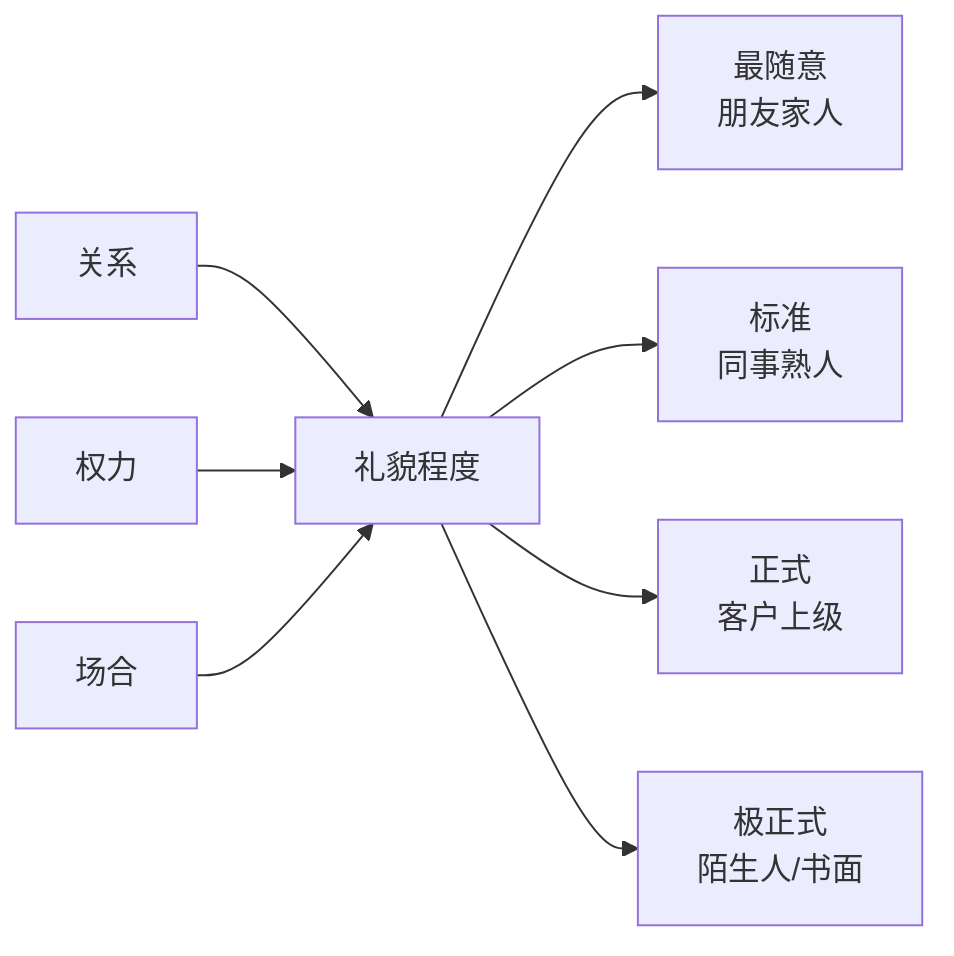
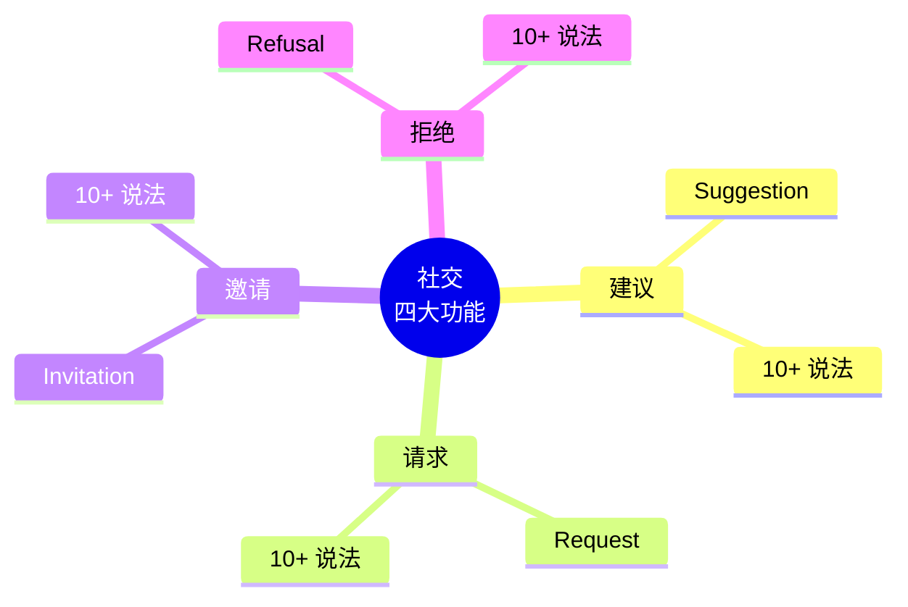
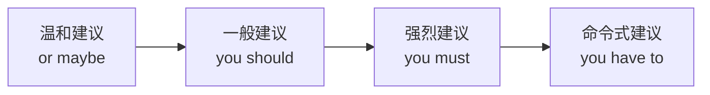
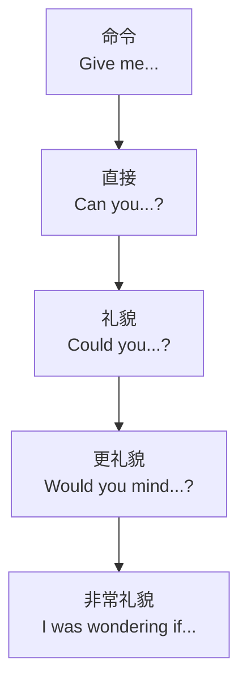
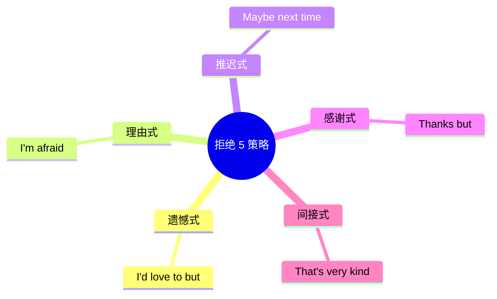

# 建议请求邀请拒绝四大功能句型

> [!info] 本篇定位
> **社交英语**本质上是由 4 个功能撑起来的：**建议（我觉得你该……）、请求（你能……吗）、邀请（一起来吗）、拒绝（不好意思……）**。
>
> 会不会这 4 件事，**直接决定你英语社交的质量**。
>
> 中国学生的共同痛点：
>
> - 建议总是"You should..."（太生硬）
> - 请求总是"Can you..."（不够礼貌）
> - 邀请总是"Let's..."（缺乏变化）
> - 拒绝总是"I can't"（伤害对方）
>
> 本篇给你每种功能的 **10-15 种说法**，从最随意到最正式，全场景覆盖。

---

## 1. 本篇导读：四大功能的分级思维

### 1.1 礼貌分级的必要性

**英语社交一个核心原则：说话者和听者的"关系和权力"决定用词**。

- 对**朋友**可以直接：`Can you...?`
- 对**同事**要礼貌：`Could you please...?`
- 对**领导/陌生人**要正式：`I was wondering if you could...?`



### 1.2 四大功能总览



---

## 2. 建议类句型（Suggestion）

### 2.1 建议的 4 种强度



### 2.2 温和建议（10 个）

**用于**：不想强加给对方时。

> [!success] 温和建议句型
>
> **① Why don't you ...?**
> "为什么不……？"（最常用）
> - `Why don't you take a break?`（你为什么不休息一下？）
>
> **② How about (doing) ...?**
> "……怎么样？"
> - `How about going for coffee?`（去喝咖啡怎么样？）
>
> **③ What about (doing) ...?**
> 同 how about
> - `What about trying a different approach?`
>
> **④ What if we ...?**
> "如果我们……会怎样？"
> - `What if we postpone the meeting?`
>
> **⑤ Have you considered (doing) ...?**
> "你考虑过……吗？"
> - `Have you considered taking a year off?`
>
> **⑥ You might want to ...**
> "你或许可以……"（很委婉）
> - `You might want to check that email.`
>
> **⑦ You could ...**
> "你可以……"
> - `You could try yoga.`
>
> **⑧ Maybe you should ...**
> "也许你该……"
> - `Maybe you should see a doctor.`
>
> **⑨ Perhaps you'd like to ...**
> "也许你想……"（正式）
> - `Perhaps you'd like to try our new menu.`
>
> **⑩ It might be a good idea to ...**
> "……可能是个好主意"
> - `It might be a good idea to save some money.`

### 2.3 一般建议（6 个）

**用于**：给出明确建议，关系较近。

```
⑪ I suggest (that) you ...
  I suggest that you see a doctor.
  (建议你看医生。)

⑫ I recommend (doing / that) ...
  I recommend reading this book.
  I recommend that you read this book.

⑬ I advise you to ...
  I advise you to be careful.

⑭ You should ...
  You should apologize.

⑮ You ought to ...
  You ought to call your mother.

⑯ If I were you, I would ...
  If I were you, I would take the offer.
```

> [!warning] suggest 用法小心
>
> suggest 后面**不能直接跟人**：
>
> - ❌ `I suggest you to go.`
> - ✅ `I suggest that you (should) go.`
> - ✅ `I suggest going.`
> - ✅ `I suggest you go.`（省略 that 和 should）

### 2.4 强烈建议（5 个）

**用于**：非常重要、紧急的建议。

```
⑰ You really should ...
  You really should see a doctor now.

⑱ You must ...
  You must try this cake!

⑲ You have to ...
  You have to come to the party!

⑳ I really think you should ...
  I really think you should apologize.

㉑ My advice is to ...
  My advice is to start early.
```

### 2.5 开放式建议（5 个）

**用于**：提议但留给对方决定。

```
㉒ Let's ...
  Let's try it.

㉓ Why not ...?
  Why not try it once?

㉔ Shall we ...?
  Shall we take a break?

㉕ How about if we ...?
  How about if we meet at 6?

㉖ One option is to ...
  One option is to wait a week.
```

### 2.6 建议场景示范

```
场景 1：朋友失恋
温和：  "Why don't you take some time for yourself?"
        "Maybe you should talk to someone."

场景 2：同事遇到难题
一般：  "I suggest you ask the boss for clarification."
        "You could try a different approach."

场景 3：看到有人生病
强烈：  "You really should see a doctor."
        "You must get checked out."

场景 4：提议吃饭
开放：  "Let's grab lunch together!"
        "How about Italian food?"
```

### 2.7 建议时的文化差异

> [!tip] 英语文化中的建议原则
>
> 1. **少用 should**（"应该"带有评判）
> 2. **多用 might**（"或许"留余地）
> 3. **配合问句**（"Have you considered...?" 比命令更礼貌）
> 4. **先肯定再建议**（"That's a great idea, but maybe you could also..."）

---

## 3. 请求类句型（Request）

### 3.1 请求的礼貌阶梯（从低到高）



### 3.2 朋友之间（3 个）

**用于**：熟人、朋友、家人。

```
㉗ Can you ...?
  Can you pass me the salt?
  Can you help me?

㉘ Will you ...?
  Will you help me with this?
  (比 Can you 稍礼貌一点)

㉙ Please ...
  Please close the door.
```

### 3.3 同事熟人（4 个）

**用于**：标准礼貌场合。

```
㉚ Could you ...?
  Could you send me the report?
  (Could 比 Can 更礼貌)

㉛ Could you please ...?
  Could you please explain again?

㉜ Do you think you could ...?
  Do you think you could help me?

㉝ Would you ...?
  Would you help me move this?
```

### 3.4 更礼貌（5 个）

**用于**：对上级、陌生人、正式场合。

```
㉞ Would you mind (doing) ...?
  Would you mind opening the window?
  (注意：后接 doing)

㉟ Would you be so kind as to ...?
  Would you be so kind as to hold the door?
  (非常礼貌/正式)

㊱ I was wondering if you could ...
  I was wondering if you could review my document.

㊲ I was hoping you could ...
  I was hoping you could help me.

㊳ If it's not too much trouble, could you ...?
  If it's not too much trouble, could you pick me up?
```

### 3.5 非常正式（3 个）

**用于**：客户、邮件、书面。

```
㊴ Would it be possible (for you) to ...?
  Would it be possible to meet tomorrow?

㊵ I would appreciate it if you could ...
  I would appreciate it if you could confirm.
  (邮件常用)

㊶ Might I trouble you for ...?
  Might I trouble you for some water?
  (极正式/文学)
```

### 3.6 Would you mind... 的用法详解

> [!warning] Would you mind 后接 doing
>
> - ✅ `Would you mind opening the window?`
> - ❌ `Would you mind to open the window?`
> - ❌ `Would you mind open the window?`
>
> **回答方式特别**：
> - 同意 → **No**（不介意）
> - 拒绝 → **Yes, I'm afraid I do**（介意）
>
> 所以 "No" 反而是答应！

**例句**：

```
A: Would you mind closing the door?
B: No, not at all. (表示愿意关)
或 B: Of course not. (同上)

如果不愿意：
B: Actually, I'd rather not. (委婉拒绝)
```

### 3.7 请求时的附加技巧

**加入 "please" 能提升礼貌度**：

```
Can you help me? → Can you please help me?
Could you do this? → Could you please do this?
```

**加入理由让请求更合理**：

```
基础：Could you lend me 100 dollars?
加理由：Could you lend me 100 dollars? I left my wallet at home.
```

**道歉式开头**：

```
Sorry to bother you, but could you ...?
Excuse me, would it be possible to ...?
I hate to ask, but could you ...?
```

---

## 4. 邀请类句型（Invitation）

### 4.1 邀请的 3 种正式度

### 4.2 非正式邀请（6 个）

**用于**：朋友、随意场合。

```
㊷ Want to ...?
  Want to grab coffee?
  (最口语，朋友间)

㊸ Do you want to ...?
  Do you want to watch a movie?

㊹ Let's ...
  Let's go to the beach!

㊺ How about ...?
  How about dinner tomorrow?

㊻ Why don't we ...?
  Why don't we play tennis?

㊼ Fancy (doing) ...?
  Fancy going for a drink?
  (英式口语)
```

### 4.3 标准邀请（5 个）

**用于**：同事、熟人。

```
㊽ Would you like to ...?
  Would you like to come to dinner?
  (最常用的礼貌邀请)

㊾ Would you care to ...?
  Would you care to join us?

㊿ Are you free to ...?
  Are you free to go out tonight?

㊿+1 Are you interested in ...?
  Are you interested in joining our team?

㊿+2 I'd like to invite you to ...
  I'd like to invite you to our wedding.
```

### 4.4 正式邀请（4 个）

**用于**：商务、重要场合。

```
• We'd like to invite you to ...
  We'd like to invite you to our conference.

• It would be our pleasure to have you ...
  It would be our pleasure to have you as our guest.

• You are cordially invited to ...
  You are cordially invited to the opening ceremony.
  (最正式，邀请函用)

• Would you do us the honor of ...?
  Would you do us the honor of speaking at our event?
```

### 4.5 邀请答复句型

**接受邀请**：

```
Yes, I'd love to.                      (好的，我很乐意。)
Sure, sounds great!                    (好，听起来不错！)
That sounds fun.                       (听起来好玩。)
I'd be delighted to.                   (我很高兴——正式。)
Count me in!                           (算我一个！)
With pleasure.                         (乐意之至。)
```

**接受但需要确认**：

```
Let me check my schedule.              (让我看看安排。)
That sounds great, let me confirm.     (不错，我确认一下。)
I'd love to, what time?                (我很乐意，几点？)
```

### 4.6 邀请场景示范

**场景 1：约朋友吃饭**
```
Want to grab lunch tomorrow?
How about we try that new sushi place?
```

**场景 2：邀请同事聚会**
```
Would you like to come to my birthday party?
Are you free this Saturday? I'm having a gathering.
```

**场景 3：正式商务邀请**
```
We'd like to invite you to our annual conference.
It would be our pleasure to have you as our keynote speaker.
```

**场景 4：邀请函（书面）**
```
You are cordially invited to the wedding of
Mr. John Smith and Ms. Mary Johnson
on Saturday, June 15th, 2026.
```

---

## 5. 拒绝类句型（Refusal）

**拒绝是英语社交最微妙的技能**。直接说 "No" 在英语中**非常粗鲁**。

### 5.1 拒绝的 5 大策略



### 5.2 策略 1：遗憾式（7 个）

**用于**：表达你想去但不能去。

```
• I'd love to, but ...
  I'd love to, but I have plans.
  (最常用！)

• I wish I could, but ...
  I wish I could, but I'm busy.

• I really want to, but ...
  I really want to, but I can't make it.

• Unfortunately, I can't.
  Unfortunately, I can't make it.

• That sounds great, but ...
  That sounds great, but I have a conflict.

• Sadly, I have to decline.
  (较正式)

• I'd really like to, but circumstances don't allow.
  (非常正式)
```

### 5.3 策略 2：理由式（5 个）

**用于**：给出具体理由。

```
• I'm afraid I can't ...
  I'm afraid I can't come to the party.

• Sorry, I'm busy with ...
  Sorry, I'm busy with work.

• I have other plans.
  I have other plans that evening.

• Something's come up.
  Something's come up, so I can't make it.

• I already have something scheduled.
```

### 5.4 策略 3：推迟式（4 个）

**用于**：婉拒但留下再见的可能。

```
• Maybe next time.
  Maybe next time! Thanks for the invite.

• How about another time?
  How about another time when I'm less busy?

• Can we reschedule?
  Can we reschedule for next week?

• Let's do it next week instead.
```

### 5.5 策略 4：感谢式（3 个）

**用于**：先感谢，再拒绝。

```
• Thanks, but I'll pass.
  Thanks for the offer, but I'll pass.

• Thank you, but no thank you.

• That's very kind of you, but ...
  That's very kind of you, but I have to decline.
```

### 5.6 策略 5：间接式（3 个）

**用于**：软拒绝，避免尴尬。

```
• I'll think about it.
  (实际上多半是婉拒)

• Let me check and get back to you.

• I don't think I'll be able to ...
```

### 5.7 不同强度的拒绝

**最柔和**：
```
"That sounds really fun, but I'd better not. Maybe next time?"
```

**中等**：
```
"I'm afraid I can't. I have other plans."
```

**较直接（但不粗鲁）**：
```
"No, thank you."
"Not this time, thanks."
```

**强烈（慎用）**：
```
"Absolutely not."   (非常强)
"I'm not interested."  (可能伤人)
```

### 5.8 拒绝后的安慰语

**拒绝完**，常加一句安慰：

```
"But thanks for thinking of me."        (但谢谢你想到我。)
"I really appreciate the invite."       (我很感激邀请。)
"Have fun without me!"                  (没我你们玩得开心！)
"Let's catch up soon."                  (改天聚聚。)
```

### 5.9 不同场合的拒绝

**拒绝邀约**：
```
A: Do you want to come to my party?
B: I'd love to, but I have a deadline. Can we catch up next week?
```

**拒绝请求**：
```
A: Could you help me move this weekend?
B: I wish I could, but I'm out of town. Maybe Tom can help?
```

**拒绝建议**：
```
A: You should try this restaurant.
B: Thanks for the tip, but I'm trying to save money right now.
```

**拒绝销售**：
```
A: Would you like to sign up for our newsletter?
B: No thanks, I'm all set.
```

**拒绝工作邀请**：
```
A: We'd love to have you join our team.
B: I really appreciate the offer, but I've decided to stay where I am.
```

---

## 6. 四大功能综合对话

### 6.1 场景：周末计划

```
Alice:  "Hey, are you free this Saturday?"              [邀请前奏]

Bob:    "I think so. Why?"

Alice:  "Would you like to go hiking with us?"          [邀请·标准]

Bob:    "That sounds great! Where are you thinking?"    [接受]

Alice:  "Why don't we try that new trail near the lake?" [建议·温和]

Bob:    "Good idea. What time should we meet?"          [同意]

Alice:  "How about 8 AM?"                                [建议]

Bob:    "Umm, could you make it 9?"                     [请求·礼貌]
        "I'm not a morning person."                      [理由]

Alice:  "Sure, 9 works! Would you mind bringing some snacks?" [请求·更礼貌]

Bob:    "No problem, I'll bring sandwiches."            [接受]

Alice:  "Great! Also, want to invite Tom?"              [邀请·非正式]

Bob:    "Maybe not this time. He mentioned he's busy    [拒绝·推迟 + 理由]
        with family stuff this weekend."

Alice:  "OK, maybe next time. See you Saturday!"         [理解]

Bob:    "Can't wait!"                                    [期待]
```

**统计**：15 句对话用了**所有 4 大功能**，且展现了**不同礼貌层级**。

---

## 7. 文化差异提醒

### 7.1 "No" 的文化

英语国家（尤其美国）**不喜欢直接说 No**：

| 中文思维 | 英语思维 |
| ---- | ---- |
| "不行" | "I'd love to, but I can't." |
| "不要" | "No thanks, I'm fine." |
| "不去" | "Maybe next time." |

### 7.2 中国式"客气"的翻译陷阱

**中国人常说的客套话**：

```
"哪里哪里" → ❌ Where? Where? (直译错)
              ✅ Thank you. / You're too kind.

"不好吧" → ❌ Not good. 
          ✅ I'm not sure that would be a good idea.

"再说吧" → ❌ Say again.
          ✅ Let me think about it. / We'll see.
```

### 7.3 "拒绝"要真拒绝，不要模棱两可

**英语里 "Maybe" 很容易被当成真的"可能"**。

如果你**确定要拒绝**，不要说 "Maybe"，要说：

```
直接拒绝：No, thank you. / I'll pass.
推迟真心：Maybe next time (带具体时间框架).
不想说死：Let me think about it (后续要回复).
```

**"I'll think about it" 但永不回复**，会让对方很困惑。

---

## 8. 综合应用原则

### 8.1 关键原则

```
建议 = 温和 + 给对方选择余地
请求 = 礼貌 + 加理由 + 感谢
邀请 = 明确 + 提供细节
拒绝 = 感谢 + 理由 + 期待下次
```

### 8.2 "套路公式"

**礼貌请求的完整公式**：

```
开头道歉 + 礼貌请求 + 具体内容 + 感谢

示例：Sorry to bother you, but could you possibly help me with this
      quick question? I'd really appreciate it.
```

**得体拒绝的完整公式**：

```
感谢 + 遗憾 + 理由 + 留余地

示例：Thanks so much for the invitation! I'd love to come, but I
      already have plans. Maybe we can grab coffee next week?
```

---

## 9. 练习与输出建议

> [!success] 本篇练习清单
>
> **基础替换**
>
> 1. 用 5 种不同的句型表达"建议对方戒烟"：
>    - 温和：?
>    - 一般：?
>    - 强烈：?
>    - 问句式：?
>    - 假设式：?
>
> **礼貌升级**
>
> 2. 把下列请求从**直接**升级到**最礼貌**：
>    - "Give me your pen."
>    - "Help me."
>    - "Open the window."
>    - "Send me the file."
>
> **邀请创作**
>
> 3. 向朋友发出一个**邀请**，并考虑：
>    - 选择合适的句型
>    - 加上时间地点
>    - 如果对方拒绝，你怎么回应
>
> **拒绝练习**
>
> 4. 用**不同策略**拒绝下列邀请：
>    - 朋友邀请你去酒吧（你想待家）
>    - 同事邀请你加班（你不想）
>    - 陌生人邀请你参加活动（你不感兴趣）
>
> **场景模拟**
>
> 5. 模拟一场对话（至少 10 句），使用所有 4 大功能：
>    - 朋友邀请你聚会
>    - 你给他一个建议（换地方）
>    - 他请求你帮忙订位
>    - 你婉拒了他的另一个附加邀请
>
> **长期任务**
>
> 6. 每天记录一次**真实的拒绝**场景，写出 3 种不同的拒绝方式。

### 9.1 参考答案（练习 1）

- 温和：`Have you considered quitting smoking?` / `You might want to cut down on smoking.`
- 一般：`I suggest that you stop smoking.` / `You should really quit.`
- 强烈：`You really must quit smoking now.` / `You have to stop for your health.`
- 问句：`Why don't you try to quit?` / `How about quitting smoking?`
- 假设：`If I were you, I would quit immediately.`

### 9.2 参考答案（练习 2）

以 "Send me the file" 为例：

- 直接：`Send me the file.`
- 请求：`Can you send me the file?`
- 礼貌：`Could you send me the file, please?`
- 更礼貌：`Would you mind sending me the file?`
- 最礼貌：`I was wondering if you could send me the file when you have a moment.`
- 书面正式：`I would appreciate it if you could send me the file at your earliest convenience.`

---

## 10. 本篇小结

> [!success] 本篇核心要点回顾
>
> **四大功能 40+ 句型**：
>
> **建议**（26 个）：
> - 温和：Why don't you / How about / You might want to
> - 一般：I suggest / I recommend / You should
> - 强烈：You really should / You must
> - 开放：Let's / Why not / Shall we
>
> **请求**（15+ 个）：
> - 朋友：Can you / Will you / Please
> - 同事：Could you / Would you
> - 更礼貌：Would you mind / I was wondering if / I was hoping
> - 正式：Would it be possible / I would appreciate it if
>
> **邀请**（15 个）：
> - 非正式：Want to / Let's / How about / Fancy
> - 标准：Would you like to / Are you free to
> - 正式：We'd like to invite / You are cordially invited
>
> **拒绝 5 策略**：
> - 遗憾：I'd love to, but...
> - 理由：I'm afraid I can't...
> - 推迟：Maybe next time
> - 感谢：Thanks, but...
> - 间接：Let me check...
>
> **核心原则**：
> - 建议 = 温和 + 给选择
> - 请求 = 礼貌 + 加理由
> - 邀请 = 明确 + 给细节
> - 拒绝 = 感谢 + 理由 + 留余地
>
> **文化差异**：
> - 英语不直接说 "No"
> - 不要用 "Maybe" 作为真正的拒绝
> - 拒绝后要留余地（maybe next time）

### 10.1 下一篇预告

> [!info] 下一篇：03.同意反对让步转折句型库
>
> 下一篇讲**辩证思维**的英语表达：
>
> - **同意**：表达认可（5+ 句型）
> - **反对**：表达异议（5+ 句型）
> - **让步**：表达"虽然……但"（10+ 句型）
> - **转折**：表达"但是……"（10+ 句型）
>
> 这些句型是**讨论、辩论、写作**的核心工具，让你的英语表达**有逻辑、有层次**。
