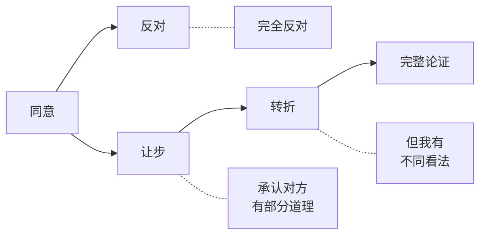
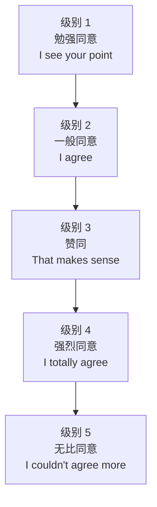
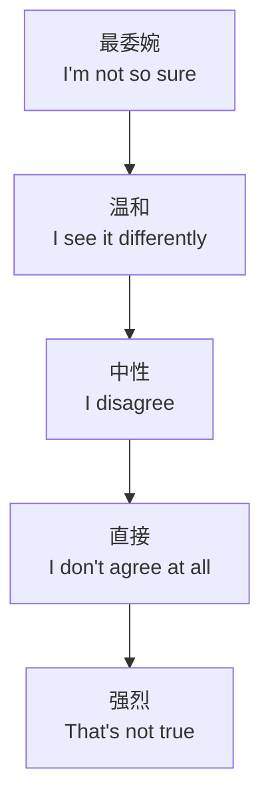
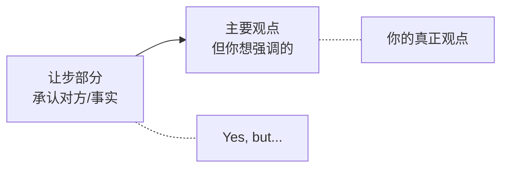
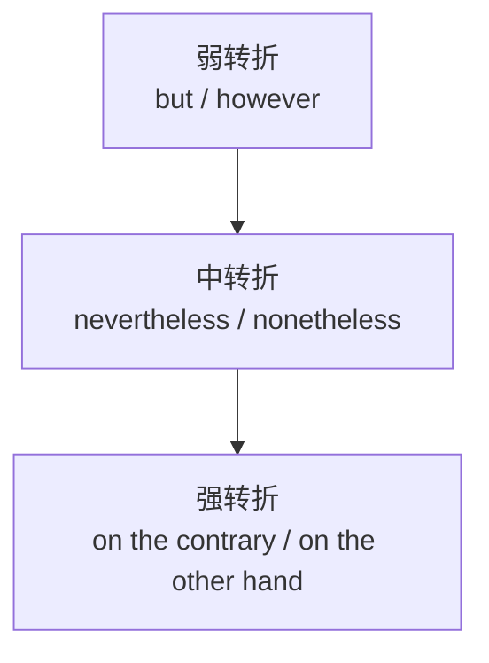

# 同意反对让步转折句型库

> [!info] 本篇定位
> 上一篇讲了**社交 4 大功能**（建议/请求/邀请/拒绝），这一篇讲**讨论 4 大功能**（同意/反对/让步/转折）。
>
> 这 4 个功能合起来构成了**辩证讨论**的完整框架：
>
> - 你说我**同意**——肯定对方
> - 你说我**反对**——表达不同
> - 我**让步**——承认对方有道理
> - 然后我**转折**——但还有别的方面
>
> 这是英语**讨论、辩论、写作**最核心的工具。中国学生最大的问题是：要么**只会同意**（yes-man），要么**反对得太冲**（伤感情）。学完本篇，你能**优雅地表达异见**。

---

## 1. 本篇导读：辩证讨论的灵魂

### 1.1 一个案例对比

讨论"是否应该 996"。

**初级表达**：
```
A: 996 is bad.
B: I agree.
A: Yes.
B: Yes.
(单调、扁平)
```

**辩证表达**：
```
A: I think 996 is unsustainable.
B: I see your point. However, in some industries it's hard to avoid.
A: That's a fair argument. But even so, the long-term cost outweighs
   the short-term gain.
B: I have to admit you have a point there.
(有层次、有论证)
```

**关键技巧**：先**让步**承认对方有道理，再**转折**提出自己的观点。这是**英语论证的黄金模式**。

### 1.2 4 大功能的关系



---

## 2. 同意类句型（15 个）

### 2.1 强度 5 分级



### 2.2 级别 1：保留同意（3 个）

**承认对方有道理，但保留余地**：

```
① I see your point.
   "我明白你的意思。"
   (字面：我看到你的观点——还没说同意)

② I see what you mean.
   "我懂你的意思。"

③ That's one way of looking at it.
   "这是看待它的一种方式。"
   (隐含：还有别的方式)
```

### 2.3 级别 2：一般同意（4 个）

**直接表达赞同**：

```
④ I agree (with you).
⑤ I think you're right.
⑥ You have a point.
⑦ Fair enough.
   "有道理。"（口语）
```

### 2.4 级别 3：明确赞同（4 个）

**强调认可**：

```
⑧ That makes sense.
   "有道理。"

⑨ That's true.
   "确实如此。"

⑩ Exactly! / Precisely!
   "正是！"

⑪ I'm with you on this.
   "在这件事上我支持你。"
```

### 2.5 级别 4：强烈同意（4 个）

```
⑫ I totally / completely / absolutely agree.
   "我完全同意。"

⑬ You're absolutely right.
   "你完全正确。"

⑭ I agree 100%.
   "我 100% 同意。"

⑮ I'm in complete agreement.
   "我完全赞同。"（正式）
```

### 2.6 级别 5：无比同意（3 个）

```
• I couldn't agree more.
   "我无比同意。"（最强）

• You took the words right out of my mouth.
   "这正是我想说的。"

• My thoughts exactly.
   "我也是这么想的。"
```

### 2.7 同意 + 补充

**真正会聊天的人**：同意后会**补充自己的看法**：

```
"I totally agree. In fact, I would even add that..."
"You're absolutely right, and I'd say..."
"That makes sense. Plus, ..."
"I agree, especially with the part about..."
```

---

## 3. 反对类句型（15 个）

### 3.1 反对的礼貌阶梯



### 3.2 最委婉（4 个）

**用于**：怕伤害对方、面对长辈/上级、不熟的人。

```
① I'm not so sure about that.
   "我对此不太确定。"

② I see your point, but I'm not entirely convinced.
   "我理解，但还不完全信服。"

③ That's an interesting point, but ...
   "这是个有意思的观点，但是……"
   (注意：interesting 在英语中常隐含"我不完全认同"。)

④ I see what you mean, but ...
```

### 3.3 温和（4 个）

```
⑤ I see it differently.
   "我看法不同。"

⑥ I tend to disagree.
   "我倾向于不同意。"

⑦ I'm not sure I agree.
   "我不太同意。"

⑧ I have a different take on that.
   "我对此有不同看法。"
```

### 3.4 中性（4 个）

```
⑨ I disagree.
⑩ I don't agree.
⑪ I beg to differ.
   "恕我不能同意。"（正式）
⑫ I have to disagree.
   "我不得不不同意。"
```

### 3.5 直接（3 个）

**用于**：辩论、明确反对。

```
⑬ I don't agree at all.
⑭ That's not true.
   "不是这样。"
⑮ I completely disagree.
```

### 3.6 反对的"缓冲句"

英语反对**很少裸说**，常加**缓冲句**：

```
缓冲 + 反对：

"With all due respect, I disagree."
"I might be wrong, but I think..."
"I hate to disagree, but..."
"Forgive me for saying so, but..."
"I don't mean to be rude, but..."
```

### 3.7 反对 + 理由

**只反对没理由**显得情绪化。**反对必须给理由**：

```
"I disagree because ..."
"I don't think so because ..."
"My problem with that is ..."
"The issue I see is ..."
```

---

## 4. 让步类句型（15 个）

**让步**= 表达"**虽然 A，但是 B**"——承认 A，但更强调 B。

### 4.1 让步的本质



### 4.2 让步连词类（10 个）

**用于**：从句让步。

```
① although + 句子
   Although it's expensive, it's worth it.

② though + 句子
   Though I'm tired, I'll keep going.

③ even though + 句子
   Even though it rained, we had fun.

④ even if + 句子
   Even if I lose, I'll try.
   (假设性让步)

⑤ while + 句子
   While I see your point, I disagree.
   (让步性 while)

⑥ whereas + 句子
   Whereas she likes coffee, I prefer tea.
   (对比性让步，正式)

⑦ in spite of + 名词/动名词
   In spite of the rain, we went out.

⑧ despite + 名词/动名词
   Despite the cold, she went swimming.

⑨ regardless of + 名词
   Regardless of the cost, we'll do it.

⑩ no matter + 疑问词
   No matter what happens, I'm with you.
```

### 4.3 让步副词/插入语类（5 个）

**用于**：在表达观点时加"让步"语气。

```
⑪ Admittedly, ...
   "诚然……"
   Admittedly, the plan has flaws, but it's the best we have.

⑫ True, ...
   "确实……"
   True, it's expensive. But quality matters.

⑬ Granted, ...
   "诚然……"
   Granted, he made a mistake, but he learned from it.

⑭ It's true that ..., but ...
   It's true that AI is powerful, but it has limits.

⑮ Of course, ...
   "当然……"
   Of course, there are challenges, but...
```

### 4.4 "让步先行"句型

**英语论证的黄金模式**：先让步，再表达自己的观点。

```
模式 1：Although [让步], [主要观点].
  Although it's risky, we should try.

模式 2：[主要观点], although [让步].
  We should try, although it's risky.

模式 3：[让步], but [主要观点].
  It's risky, but we should try.

模式 4：While [让步], [主要观点].
  While I appreciate your effort, this isn't enough.
```

### 4.5 让步的实战例子

**讨论新产品**：

```
"Granted, the design is innovative. However, the price is too high
for our target market."

"Of course, there are some technical issues, but those can be
solved with more development time."

"Although the launch is delayed, the final product will be much
better than the original plan."

"I admit it's not perfect, but it's a major improvement."
```

---

## 5. 转折类句型（15 个）

**转折**= 引出与前句相反或对立的内容。

### 5.1 转折强度分级



### 5.2 弱转折（5 个）

**用于**：日常表达，最常用。

```
① but
   It's expensive, but it's worth it.

② however
   I'm tired. However, I'll finish the work.

③ yet
   He's old, yet still strong.

④ still
   It rained. Still, we had fun.

⑤ though（句末，口语）
   It was hard, though.
```

### 5.3 中转折（5 个）

**用于**：稍正式，表达"尽管如此"。

```
⑥ nevertheless
   The task is hard. Nevertheless, we must try.

⑦ nonetheless
   He failed. Nonetheless, he learned a lot.

⑧ even so
   It was a long day. Even so, I enjoyed it.

⑨ all the same
   He's wrong. All the same, I respect him.

⑩ at the same time
   I love him. At the same time, I worry about him.
```

### 5.4 强转折（5 个）

**用于**：强调对立、对比。

```
⑪ On the contrary, ...
   "相反……"
   "He doesn't hate it. On the contrary, he loves it."

⑫ On the other hand, ...
   "另一方面……"
   "It's expensive. On the other hand, it lasts forever."

⑬ In contrast, ...
   "相比之下……"
   "Some people love rain. In contrast, others find it depressing."

⑭ Conversely, ...
   "相反地……"（正式）
   "Conversely, it could also be argued that..."

⑮ Whereas / While ...
   "然而……"
   "He likes coffee, whereas she prefers tea."
```

### 5.5 转折的位置

**转折词可以放在句首、句中、句末**：

```
句首：However, I disagree.
句中：I, however, disagree.
句末：I disagree, however. (较少)

句首：But I disagree.
句末（口语）：I disagree, though.
```

### 5.6 but vs however vs although

这三个**最容易混淆**：

| 词 | 词性 | 位置 | 标点 | 例句 |
| ---- | ---- | ---- | ---- | ---- |
| but | 连词 | 中间 | 前面逗号 | I tried, but failed. |
| however | 副词 | 句首/中/末 | 前后逗号 | I tried. However, I failed. |
| although | 连词 | 引导从句 | 从句后逗号 | Although I tried, I failed. |

**关键**：
- **but** 连接两个**简单句**或**句子成分**
- **however** 是**副词**，单独成句或加逗号
- **although** 引导**从句**，不能和 but 连用

```
✅ I tried, but I failed.
✅ I tried. However, I failed.
✅ Although I tried, I failed.

❌ Although I tried, but I failed. (中式英语)
❌ But however I tried, I failed.
```

---

## 6. 同意 + 让步 + 转折的黄金模式

### 6.1 黄金模式公式

**完整的辩证表达 = 同意 + 让步 + 转折**：

```
[同意/承认对方] + [让步] + [转折] + [自己的观点]
```

**模板**：

```
"You raise a good point about X.
 Granted, X has its merits.
 However, we should also consider Y.
 In my view, Y is more important because..."
```

### 6.2 实例 1：辩论 996

```
A: "996 is necessary for startups to succeed."

B: "I see your point about startups needing to move fast.
    [同意：I see your point]
    Granted, startups face intense competition.
    [让步：Granted]
    However, sustained 996 leads to burnout and lower productivity
    in the long run.
    [转折：However]
    A more balanced approach would actually be more sustainable."
    [自己的观点]
```

### 6.3 实例 2：讨论留学

```
A: "Studying abroad is the best way to learn a language."

B: "There's truth to that.
    [同意]
    True, immersion is incredibly valuable.
    [让步]
    But many people have learned excellent English without going abroad.
    [转折]
    What matters most is consistent practice, not just location."
    [自己的观点]
```

### 6.4 这个模式的好处

1. **显得有思考**：不是简单的赞同或反对
2. **降低对抗感**：先承认对方有道理
3. **让你的观点更有说服力**：因为你已经考虑过对方
4. **是西方辩论的标准模式**：母语者期待这样

---

## 7. 4 大功能综合句型库（速查）

```
========== 同意 ==========
I agree.
I see your point.
I see what you mean.
That makes sense.
Fair enough.
Exactly! / Precisely!
You have a point.
That's true.
I totally agree.
I'm with you on this.
You're absolutely right.
I couldn't agree more.
You took the words out of my mouth.
My thoughts exactly.

========== 反对 ==========
I see it differently.
I'm not so sure.
I tend to disagree.
I have a different take.
I'm afraid I disagree.
I beg to differ.
I have to disagree.
I disagree.
I don't think so.
That's not quite right.
I don't agree at all.
With all due respect, ...
That's not true.

========== 让步 ==========
Although ...
Though ...
Even though ...
Even if ...
While ...
Whereas ...
In spite of ...
Despite ...
Regardless of ...
No matter ...
Admittedly, ...
True, ...
Granted, ...
It's true that ...
Of course, ...

========== 转折 ==========
but
however
yet
still
though (sentence end)
nevertheless
nonetheless
even so
all the same
on the contrary
on the other hand
in contrast
conversely
whereas
while
```

---

## 8. 场景实战：综合应用

### 8.1 场景：会议中讨论方案

```
Manager:  "I think we should adopt the new system immediately."

Alice:    "I see your point about the urgency, but I'm not sure
          that immediate adoption is wise."
          [同意 + 反对]

Manager:  "Why?"

Alice:    "Although the new system has many advantages, the team
          needs training first."
          [让步 + 转折]

Bob:      "Fair enough. However, we can train them in parallel
          with the rollout."
          [同意 + 转折]

Charlie:  "I see what you mean, Bob. Granted, parallel training
          is possible, but it might lead to errors during transition."
          [同意 + 让步 + 转折]

Manager:  "These are all valid concerns. On the other hand, delaying
          could cost us the market opportunity."
          [认可 + 转折]

Alice:    "True, timing matters. But I'd argue that quality matters
          more than speed."
          [让步 + 转折]

Manager:  "Let me think about it. You've raised some important points."
          [中立认可]
```

**统计**：8 句对话用了**所有 4 大功能**且呈现**辩证思维**。

### 8.2 场景：和朋友辩论

```
A: "Working from home is the best."

B: "I see why you'd think so. But there are downsides too."
   [同意 + 转折]

A: "Like what?"

B: "Well, it can be lonely. Granted, you have flexibility,
   but human interaction matters."
   [让步 + 转折]

A: "I see what you mean, although I'd say video calls help."
   [同意 + 让步]

B: "True, they help. Still, it's not the same as being together."
   [让步 + 转折]

A: "Fair enough. I guess it depends on the person."
   [同意 + 让步]
```

---

## 9. 中英思维差异

### 9.1 中文表达 vs 英文表达

**中文常用"虽然……但是……"，英文不能直译**：

```
中文：虽然累，但是值得。
❌ Although tired, but worth it.
✅ Although I'm tired, it's worth it.
✅ I'm tired, but it's worth it.
```

**关键规则**：英语**不能同时用 although 和 but**。

### 9.2 中英反对的差异

```
中文：你错了。
英文：直译 → "You're wrong." → 太冲

英文方式：
温和：I see it differently.
中性：I'm not sure that's correct.
正式：With all due respect, I have to disagree.
```

### 9.3 西方文化的"软反对"传统

英语国家（尤其是美国/英国）的讨论文化：

1. **先肯定对方**（即使要反对）
2. **使用"软化语"**（actually, perhaps, somehow）
3. **避免"You are wrong"** 这种直接判断
4. **保持"yes, and..." 心态**（即使是反对，也要建设性）

---

## 10. 常见错误大盘点

### 10.1 错误 1：although 和 but 同时用

```
❌ Although it's hard, but I'll try.
✅ Although it's hard, I'll try.
✅ It's hard, but I'll try.
```

### 10.2 错误 2：because 和 so 同时用

```
❌ Because I'm tired, so I'll rest.
✅ Because I'm tired, I'll rest.
✅ I'm tired, so I'll rest.
```

### 10.3 错误 3：however 当连词用

```
❌ I tried however I failed.
✅ I tried. However, I failed.
✅ I tried; however, I failed.
✅ I tried, but I failed.
```

### 10.4 错误 4：on the contrary vs on the other hand

```
on the contrary：完全相反
on the other hand：另一方面（不一定相反）

❌ I love coffee. On the contrary, tea is also nice.
   (love coffee 和 tea 不构成"相反")
✅ I love coffee. On the other hand, tea is also nice.

✅ I don't hate it. On the contrary, I love it.
   (hate vs love 才是相反)
```

### 10.5 错误 5：despite + 句子

```
❌ Despite it was raining, we went out.
✅ Despite the rain, we went out.
✅ Although it was raining, we went out.

despite 后面跟名词/动名词，不跟从句。
```

### 10.6 错误 6："interesting" 的含义

```
A: I think we should rebuild from scratch.
B: That's interesting.
       ↑ 这通常意味着"我不完全同意"，不是真的"有趣"！

英语中 "That's interesting" 常常是委婉的不同意。
要真表达赞同，用 "That's a great idea!"
```

---

## 11. 练习与输出建议

> [!success] 本篇练习清单
>
> **基础练习**
>
> 1. 把下列简单同意/反对升级为更丰富的表达：
>    - I agree. → ?（5 种说法）
>    - I disagree. → ?（5 种说法）
>
> **黄金模式练习**
>
> 2. 用"同意 + 让步 + 转折"模式回应下列观点：
>    - "All students should learn coding."
>    - "Money is the most important thing."
>    - "Working hard guarantees success."
>
> **改错练习**
>
> 3. 改正错误：
>    - Although I tried hard, but I failed.
>    - Because I was tired, so I went home.
>    - I tried however I failed.
>    - Despite I was sick, I came to work.
>
> **辩论练习**
>
> 4. 选一个话题，写一段 10 句话的"辩证讨论"（自己 vs 对方），要求：
>    - 至少使用 2 个同意句型
>    - 至少使用 2 个反对句型
>    - 至少使用 2 个让步句型
>    - 至少使用 2 个转折句型
>
> **长期任务**
>
> 5. 听一段英语辩论或讨论（YouTube/TED/Podcast），**记录所有让步和转折表达**。

### 11.1 参考答案（练习 3）

- `Although I tried hard, I failed.` / `I tried hard, but I failed.`
- `Because I was tired, I went home.` / `I was tired, so I went home.`
- `I tried. However, I failed.` / `I tried, but I failed.`
- `Despite my sickness, I came to work.` / `Although I was sick, I came to work.`

---

## 12. 本篇小结

> [!success] 本篇核心要点回顾
>
> **同意 5 级 + 15 句型**：
> - L1 保留：I see your point
> - L2 一般：I agree
> - L3 明确：That makes sense
> - L4 强烈：I totally agree
> - L5 无比：I couldn't agree more
>
> **反对 5 级 + 15 句型**：
> - 最委婉：I'm not so sure
> - 温和：I see it differently
> - 中性：I disagree
> - 直接：I don't agree at all
> - 强烈：That's not true
>
> **让步 15 句型**：
> - 连词：although / though / even though / despite / while
> - 副词：admittedly / true / granted / of course
>
> **转折 15 句型**：
> - 弱：but / however / yet / still
> - 中：nevertheless / nonetheless / even so
> - 强：on the contrary / on the other hand / in contrast
>
> **黄金模式**：同意 + 让步 + 转折 + 观点
>
> **3 大避免**：
> - 不要 although + but 同用
> - 不要 because + so 同用
> - 不要把 however 当连词用
>
> **文化技巧**：
> - 先肯定再反对
> - 用 "interesting" 时要小心（隐含不同意）
> - 反对要给理由

### 12.1 下一篇预告

> [!info] 下一篇：04.比较对比举例总结句型库
>
> 下一篇是 **05 分类的收官篇**：
>
> - **比较**：more...than / less...than / similar to / different from
> - **对比**：compared with / in comparison / on the contrary
> - **举例**：for example / for instance / such as / take...for example
> - **总结**：in conclusion / to sum up / overall / all in all
>
> 下一篇讲完，整个**句型框架模块（5 个分类共 20 篇）**就全部完成。从此之后，进入**场景实战阶段**（06-12 共 28 篇）。
