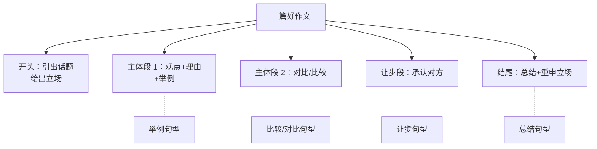
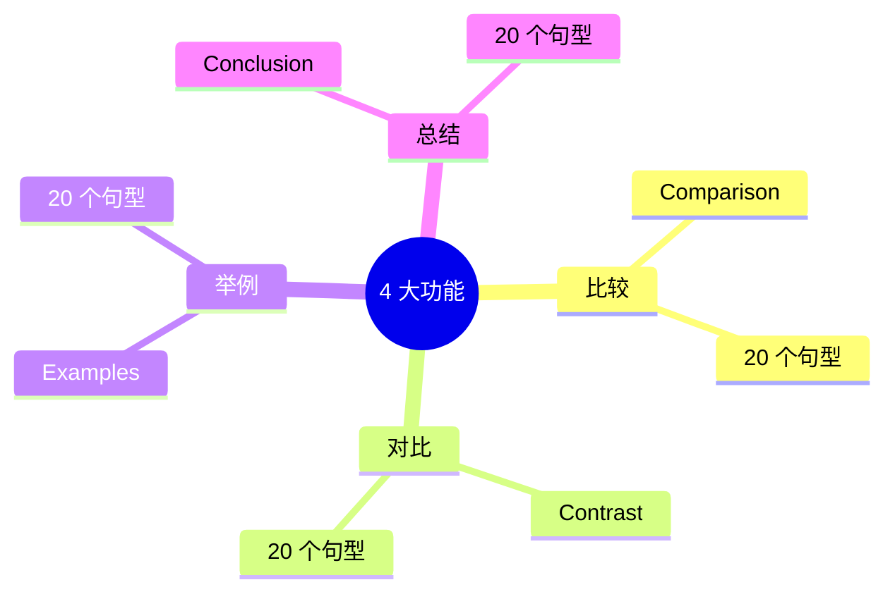

# 比较对比举例总结句型库

> [!info] 本篇定位
> 这是 **05.高频实用表达句型框架** 分类的**收官篇**，也是**整个句型框架模块（20 篇）**的**最后一篇**。
>
> 这一篇讲**写作和有逻辑表达**最需要的 4 大功能：
>
> - **比较**：A 比 B……
> - **对比**：A 和 B 不同……
> - **举例**：举个例子……
> - **总结**：综上所述……
>
> 这 4 大功能贯穿**写作、演讲、辩论、报告**。掌握它们，你就能**写出有逻辑的英语段落**。
>
> 读完本篇，整个**英语句型框架模块（5 个分类、20 篇文档）就全部完成**——你已经掌握了英语**所有基础到高级的句型工具**。

---

## 1. 本篇导读：4 大功能在写作中的地位

### 1.1 一篇好的英语作文需要什么

一篇好的**议论文/说明文**通常包含：



**没有这 4 大功能，作文就会**：
- ❌ 干巴巴只讲观点，没有论证（缺举例）
- ❌ 单一视角，没有思辨（缺对比）
- ❌ 平铺直叙，没有量化（缺比较）
- ❌ 突兀结尾，没有收束（缺总结）

### 1.2 本篇 4 大功能 + 80 个句型



---

## 2. 比较类句型（20 个）

**比较** = **量化两个事物的相同/不同程度**。

### 2.1 比较级基础（10 个）

```
① more + 形容词 + than
   This book is more interesting than that one.

② less + 形容词 + than
   This is less expensive than I expected.

③ 形容词比较级 + than
   He is taller than me.

④ as + 形 + as
   She is as smart as her brother.
   (一样)

⑤ not as / so + 形 + as
   It's not as cold as yesterday.
   (没有……那么)

⑥ the same as
   This is the same as that.

⑦ different from
   Mine is different from yours.

⑧ similar to
   This is similar to the original.

⑨ like
   He runs like a horse.

⑩ unlike
   Unlike his brother, he loves sports.
```

### 2.2 倍数比较（5 个）

**英语用倍数表达"几倍"的方式**：

```
⑪ ... times + 比较级 + than
   This box is two times bigger than that one.

⑫ ... times + as + 形 + as
   This costs three times as much as that.

⑬ ... times the size / amount / number of ...
   This city has five times the population of that one.

⑭ twice as ... as
   He earns twice as much as me.

⑮ half as ... as
   This is half as expensive as the other.
```

> [!warning] 倍数表达的注意
>
> **英语的"倍"和中文不一样**：
>
> - "twice" = 2 倍（不是中文"翻一倍"= 增加 1 倍）
> - "three times" = 3 倍（包含原来的）
>
> 中文"是 A 的 3 倍" = 英文 "three times A"

### 2.3 越...越...（3 个）

```
⑯ The + 比较级 + ..., the + 比较级 + ...
   The more you practice, the better you get.
   (练得越多越好)

⑰ The longer ..., the more ...
   The longer I wait, the more impatient I become.

⑱ ... the + 比较级 ...
   Better late than never.
   (越好越晚不及不晚)
```

### 2.4 强烈比较（2 个）

```
⑲ far / much / a lot / way + 比较级
   This is much better than I thought.
   That's way more expensive.

⑳ even + 比较级
   He's even taller than his father.
```

### 2.5 比较句型应用示例

**讨论两个产品**：

```
"The new model is more efficient than the old one.
 In fact, it's twice as fast and uses half the energy.
 The longer we use it, the more we save.
 It's much better than I expected.
 In comparison, the old model is even less reliable than I remembered."
```

---

## 3. 对比类句型（20 个）

**对比** = **强调 A 和 B 的差异/对立**（与"比较"侧重不同）。

### 3.1 比较 vs 对比的区别

| 概念 | 中心 | 例子 |
| ---- | ---- | ---- |
| 比较 | 量化差异程度 | A is taller than B (高了多少) |
| 对比 | 突出对立特征 | A is short, while B is tall (强调对立) |

### 3.2 介词类对比（6 个）

```
① compared to / with
   Compared to last year, sales doubled.

② in comparison to / with
   In comparison to their generation, we are luckier.

③ in contrast to / with
   In contrast to her sister, she is shy.

④ as opposed to
   I prefer tea as opposed to coffee.

⑤ unlike
   Unlike most people, he loves Mondays.

⑥ versus / vs
   Quality vs Quantity is a classic debate.
```

### 3.3 连词类对比（6 个）

```
⑦ while / whereas
   While I love coffee, my wife prefers tea.
   Whereas he is hardworking, his brother is lazy.

⑧ but
   He's tall, but she's short.

⑨ however
   I planned to go. However, it rained.

⑩ yet
   He's old, yet still active.

⑪ though / although
   Although he tried hard, he failed.

⑫ on the contrary
   He doesn't hate it. On the contrary, he loves it.
```

### 3.4 副词类对比（4 个）

```
⑬ on the other hand
   On the one hand, it's risky. On the other hand, the rewards
   are huge.

⑭ in contrast
   He's quiet. In contrast, his sister is loud.

⑮ conversely
   Conversely, the data suggests the opposite.

⑯ by contrast
   By contrast, the new method is much faster.
```

### 3.5 平衡对比结构（4 个）

**"一方面……另一方面"**：

```
⑰ On the one hand ... On the other hand ...
   On the one hand, working from home saves time.
   On the other hand, it can be lonely.

⑱ Some people ... while others ...
   Some people love spicy food, while others can't tolerate it.

⑲ Whereas ..., ...
   Whereas he focuses on details, she focuses on the big picture.

⑳ For ... ; for ...
   For some, money is king; for others, freedom matters more.
```

### 3.6 对比句型应用示例

**讨论城市生活 vs 乡村生活**：

```
"Compared to city life, country life has its own charms.
 While the city offers convenience, the country offers tranquility.
 On the one hand, urban dwellers enjoy more career opportunities;
 on the other hand, country folks have a slower pace of life.
 In contrast to the chaos of the metropolis, rural areas provide peace.
 Some prefer the energy of the city, whereas others crave the silence
 of nature."
```

---

## 4. 举例类句型（20 个）

**举例** = 用**具体的事物/事件**说明抽象观点。

### 4.1 直接举例（8 个）

```
① for example
   I love fruits. For example, apples and bananas.

② for instance
   Some animals are nocturnal. For instance, owls and bats.

③ such as
   I enjoy outdoor activities such as hiking and camping.

④ like
   He loves snacks like chips and chocolate.

⑤ including
   Many countries, including China and India, are developing fast.

⑥ namely
   I have two hobbies, namely reading and swimming.

⑦ that is (i.e.)
   The first option, that is, working from home, is preferred.

⑧ in particular / particularly
   I enjoy classical music, particularly Mozart.
```

### 4.2 引出例子（5 个）

```
⑨ Take ... for example.
   Take the iPhone for example. It changed mobile phones forever.

⑩ A good / clear example is ...
   A good example is what happened in 2008.

⑪ Consider ...
   Consider the case of Microsoft.

⑫ A case in point is ...
   A case in point is the recent merger.

⑬ To illustrate, ...
   To illustrate, let me share a story.
```

### 4.3 列举例子（4 个）

```
⑭ first, ... second, ... third, ...
   There are several reasons. First, cost. Second, time. Third, quality.

⑮ for one thing ... for another ...
   For one thing, it's expensive. For another, it's not durable.

⑯ to begin with ... furthermore ... finally ...
   (先……再……最后)

⑰ in addition / additionally / besides / moreover
   In addition, the design is beautiful.
   Moreover, the price is reasonable.
```

### 4.4 强化举例（3 个）

```
⑱ A case in point is when ...
⑲ As an illustration, ...
⑳ For example / instance, take the time when ...
```

### 4.5 such as vs for example 的区别

> [!tip] 两者细微差别
>
> **such as**：直接接**简短的例子**（名词 / 名词短语）
>
> ```
> ✅ I like fruits such as apples and bananas.
> ✅ Cities such as Tokyo and London are crowded.
> ```
>
> **for example**：可以接**句子**或**短语**，更灵活
>
> ```
> ✅ I love sports. For example, I play tennis every weekend.
> ✅ Many cities are crowded, for example, Tokyo and London.
> ```
>
> **如果只是简单列举名词，用 such as 更地道**。

### 4.6 举例时的标点细节

```
正确：I have many hobbies, for example, reading and writing.
正确：I have many hobbies. For example, I love reading.
错误：I have many hobbies for example reading and writing.

正确：I like many fruits, such as apples and oranges.
错误：I like many fruits, such as: apples and oranges. (不加冒号)
```

---

## 5. 总结类句型（20 个）

**总结** = 文章/讨论的**最后收束**，重申要点。

### 5.1 最常用总结词（6 个）

```
① in conclusion
   In conclusion, English learning takes time and patience.

② to sum up
   To sum up, three factors are key to success.

③ in summary
   In summary, this approach is more efficient.

④ overall
   Overall, the project was a success.

⑤ in short
   In short, we need more time.

⑥ all in all
   All in all, it was a great experience.
```

### 5.2 强化总结（4 个）

```
⑦ to put it briefly / in brief
   To put it briefly, less is more.

⑧ in essence
   In essence, the message is simple: be honest.

⑨ at the end of the day
   At the end of the day, what matters is family.

⑩ when all is said and done
   When all is said and done, we tried our best.
```

### 5.3 重申立场（3 个）

```
⑪ As mentioned earlier, ...
   As mentioned earlier, time is our most precious resource.

⑫ As I have argued, ...
   As I have argued, the data supports this conclusion.

⑬ To reiterate, ...
   To reiterate, we need a fundamental change.
```

### 5.4 推断结论（4 个）

```
⑭ Therefore, ...
   The data is clear. Therefore, we should act now.

⑮ Thus, ...
   Thus, we can conclude that...

⑯ As a result, ...
   As a result, sales increased dramatically.

⑰ Hence, ...
   The team worked hard. Hence, the success.
   (较正式)
```

### 5.5 留下思考（3 个）

```
⑱ This raises the question of ...
   This raises the question of whether AI will replace humans.

⑲ It remains to be seen whether ...
   It remains to be seen whether this approach will succeed.

⑳ Only time will tell.
```

### 5.6 不同长度的总结

**短总结（一句）**：
```
"In short, money matters."
"All in all, it was worth it."
```

**中总结（一段）**：
```
"In conclusion, while there are challenges, the benefits of remote work
outweigh the drawbacks."
```

**长总结（数段）**：
```
"To sum up the discussion, three key points emerge.
 First, ...
 Second, ...
 Third, ...
 Therefore, we should..."
```

---

## 6. 写作中过渡词的全清单

### 6.1 8 大类过渡词

```
========== 增加（And） ==========
also, in addition, additionally, furthermore, moreover,
besides, what's more, as well as

========== 转折（But） ==========
but, however, yet, still, nevertheless, nonetheless, even so,
on the contrary, on the other hand

========== 因果（So） ==========
because, since, as, due to, owing to, therefore, thus, hence,
as a result, consequently, accordingly

========== 举例 ==========
for example, for instance, such as, like, namely, including,
in particular, take ... for example

========== 比较对比 ==========
similarly, likewise, in the same way, compared to, in contrast,
in comparison, on the contrary, while, whereas

========== 时间顺序 ==========
first, second, third, finally, then, next, after that,
meanwhile, in the meantime, eventually, at last

========== 强调 ==========
indeed, in fact, certainly, definitely, undoubtedly, of course,
above all, most importantly

========== 总结 ==========
in conclusion, to sum up, in summary, overall, all in all,
in short, to put it briefly, finally
```

### 6.2 过渡词分级（口语 vs 书面）

| 口语常用 | 书面正式 |
| ---- | ---- |
| but | however |
| so | therefore / thus |
| like | such as |
| also | moreover / furthermore |
| in the end | in conclusion |
| anyway | nevertheless |

---

## 7. 综合应用：写一段标准议论文

### 7.1 5 段式议论文模板

```
段 1（引入）：提出话题 + 立场
段 2（主体 1）：观点 1 + 理由 + 例子
段 3（主体 2）：观点 2 + 比较/对比
段 4（让步）：承认对方观点 + 转折
段 5（结尾）：总结 + 重申
```

### 7.2 实例：议论文"Should we work from home?"

```
段 1：引入
"In recent years, working from home has become increasingly common.
The question is: is it really better than working in an office?
In my opinion, working from home offers more advantages than
disadvantages."

段 2：主体 1（举例）
"First, working from home saves time. For example, the average
American spends 26 minutes commuting one way. By eliminating this,
employees gain over 4 hours per week. Such time can be used for
exercise, family, or hobbies."

段 3：主体 2（比较）
"Second, working from home is more flexible compared to office work.
On one hand, employees can manage their own schedules; on the other
hand, they can balance work and life better. In contrast to rigid
office hours, remote work offers freedom."

段 4：让步
"Of course, working from home has its challenges. Granted, it can
lead to isolation. However, with video calls and team chats, this
problem can be largely solved. Even though it requires self-discipline,
the benefits outweigh the costs."

段 5：总结
"In conclusion, working from home, while imperfect, offers significant
advantages in terms of time, flexibility, and well-being. As workplaces
evolve, remote work is likely to become the norm. Therefore, both
employers and employees should embrace this shift."
```

**这一篇用了**：
- 举例（4 个：For example, Such as）
- 比较（3 个：compared to, on one hand...on the other hand, In contrast to）
- 让步（4 个：Of course, Granted, However, Even though）
- 总结（4 个：In conclusion, while, Therefore）

**这就是会用句型的标准。**

---

## 8. 场景实战：商务报告中的 4 大功能

```
项目报告

[引入] In this report, we analyze Q1 sales performance and
       compare it to Q4 last year.

[比较] Q1 sales increased by 25%, two times higher than the
       industry average. Compared to last year, growth has
       accelerated significantly.

[对比] On the one hand, online channels grew by 40%; on the other
       hand, offline retail declined by 5%. In contrast to the
       overall growth, our flagship store underperformed.

[举例] Several factors drove this growth. For instance, the new
       product launch attracted 30% more customers. Such as our
       flagship product, which sold out within a week.

[让步] Granted, supply chain issues caused some delays. However,
       these were resolved by mid-Q1.

[总结] In summary, Q1 was a strong quarter overall. To put it briefly,
       online channels lead growth, while offline needs attention.
       Therefore, we recommend doubling down on digital while
       restructuring physical retail.
```

---

## 9. 常见错误大盘点

### 9.1 错误 1：such as 后接句子

```
❌ I like sports such as I play tennis.
✅ I like sports such as tennis and basketball.
✅ I like sports. For example, I play tennis.
```

### 9.2 错误 2：比较级误用

```
❌ He is more taller than me.（比较级不能再加 more）
✅ He is taller than me.

❌ He is the most tallest.（最高级不加 most）
✅ He is the tallest.
```

### 9.3 错误 3：than 和 then 混淆

```
than：比（用于比较）
then：然后（用于时间）

❌ He is taller then me.
✅ He is taller than me.
```

### 9.4 错误 4：对比词重复

```
❌ However but, ...
❌ But however, ...
✅ But ... 或 However, ...
```

### 9.5 错误 5：总结词太频繁

```
不要每段都用 in conclusion。
in conclusion 只用在文章最后。
中间可以用：to sum up this point, to wrap up this section.
```

### 9.6 错误 6：举例词混用

```
❌ For example such as apples.
✅ For example, apples.
✅ Such as apples.

不要同时用 for example 和 such as！
```

---

## 10. 4 大功能整合速查表

```
========== 比较 ==========
more / less ... than
... times + 比较级 + than
as ... as
not as ... as
the more ... the more ...
similar to / different from
twice / half as ... as

========== 对比 ==========
compared to / with
in comparison
in contrast to / with
unlike / as opposed to
while / whereas
on the one hand ... on the other hand
some ... while others ...
versus / vs

========== 举例 ==========
for example / for instance
such as
like / including / namely
take ... for example
a case in point is
to illustrate
particularly / in particular

========== 总结 ==========
in conclusion
to sum up
in summary
overall / all in all
in short / in brief
to put it briefly
therefore / thus / hence
as a result
```

---

## 11. 练习与输出建议

> [!success] 本篇练习清单
>
> **基础替换**
>
> 1. 把下列简单表达升级（用更地道句型）：
>    - "I think A is good and B is bad."
>    - "I like apples and bananas."
>    - "Last year was good. This year is bad."
>    - "Finally, I think we should try."
>
> **造句练习**
>
> 2. 用下列句型造句：
>    - The more ..., the more ...
>    - Compared to ...
>    - For example, ...
>    - In conclusion, ...
>
> **段落写作**
>
> 3. 选一个话题，写一段 5-8 句话的对比段落，要求：
>    - 用至少 2 个比较句型
>    - 用至少 2 个对比句型
>    - 用至少 2 个举例句型
>
> **写作练习**
>
> 4. 写一篇 5 段式议论文（约 300 词），话题任选：
>    - Online learning vs traditional classroom
>    - Living in a city vs the countryside
>    - Reading books vs watching videos
>
>    要求使用所有 4 大功能。
>
> **长期任务**
>
> 5. 阅读一篇英文文章，**圈出所有过渡词**并标注是哪类（比较/对比/举例/总结）。

---

## 12. 本篇小结

> [!success] 本篇核心要点回顾
>
> **4 大功能 80 个句型**：
>
> **比较（20 个）**：
> - 比较级：more/less...than, as...as
> - 倍数：times + 比较级
> - 越...越...：The more, the more
>
> **对比（20 个）**：
> - 介词：compared to, in contrast to, unlike
> - 连词：while, whereas, but, however
> - 副词：on the other hand, in contrast
> - 平衡：On one hand...on the other...
>
> **举例（20 个）**：
> - 直接：for example, for instance, such as
> - 引出：take...for example, a case in point
> - 列举：first, second, third / for one thing, for another
>
> **总结（20 个）**：
> - 最常用：in conclusion, to sum up, overall
> - 推断：therefore, thus, as a result
> - 强化：at the end of the day, in essence
>
> **过渡词 8 大类**：增加 / 转折 / 因果 / 举例 / 比较 / 时间 / 强调 / 总结
>
> **5 段式议论文模板**：引入 → 主体 1 → 主体 2 → 让步 → 总结
>
> **避免错误**：
> - such as ≠ 句子（只接名词）
> - 比较级 ≠ more taller（重复）
> - than ≠ then
> - 不要重复对比词

### 12.1 句型框架模块大收官（1-5 分类共 20 篇）

**🎉 重大里程碑：句型框架模块全部完成！**

```
✅ 01.入门基础与学习方法 (4 篇)
✅ 02.基础句型框架 (4 篇)
✅ 03.时态与语态句型框架 (4 篇)
✅ 04.从句与复合句型框架 (4 篇)
✅ 05.高频实用表达句型框架 (4 篇)

→ 共 20 篇 / 约 25 万字 / 英语语法和句型完整体系
```

**你已经掌握**：

1. **认知地基**：英语整体认知 + 学习方法 + 发音 + 思维
2. **基础句型**：5 大基本句型 + 4 大句式 + 特殊句型 + 倒装/强调/省略
3. **时态语态**：16 种时态 + 被动 + 虚拟 + 情态动词
4. **复合句**：4 大名词性从句 + 定语从句 + 9 类状语从句 + 非谓语
5. **实用句型**：观点 / 建议请求邀请拒绝 / 同意反对让步转折 / 比较对比举例总结

**这是英语语法 + 高频句型的完整体系**，足以支撑你应对**任何场合的英语表达**。

### 12.2 接下来：场景实战阶段（06-12 共 28 篇）

> [!info] 下一个分类：06.日常生活场景实战
>
> 从下一篇起，进入 **7 大场景分类、共 28 篇文档**：
>
> - **06.日常生活场景**：问候 / 家务 / 购物 / 餐饮（4 篇）
> - **07.社交交际场景**：聚会 / 电话 / 约会 / 邀请（4 篇）
> - **08.出行旅游场景**：机场 / 酒店 / 交通 / 问路（4 篇）
> - **09.学习教育场景**：课堂 / 图书馆 / 考试 / 留学（4 篇）
> - **10.职场商务场景**：求职 / 会议 / 邮件 / 谈判（4 篇）
> - **11.医疗紧急场景**：医院 / 心理 / 报警 / 灾害（4 篇）
> - **12.特殊进阶场景**：演讲 / 跨文化 / 网络 / AI（4 篇）
>
> **场景实战的特点**：
>
> - **每篇都是一个具体场景**，可以直接背下来用
> - **真实对话 + 50-100 个常用语块**
> - **核心句型 + 文化背景 + 注意事项**
>
> **下一篇**：`06.日常生活场景实战/01.问候寒暄与自我介绍场景.md`
>
> 这一篇会让你**第一次见面就能流利对话**。
