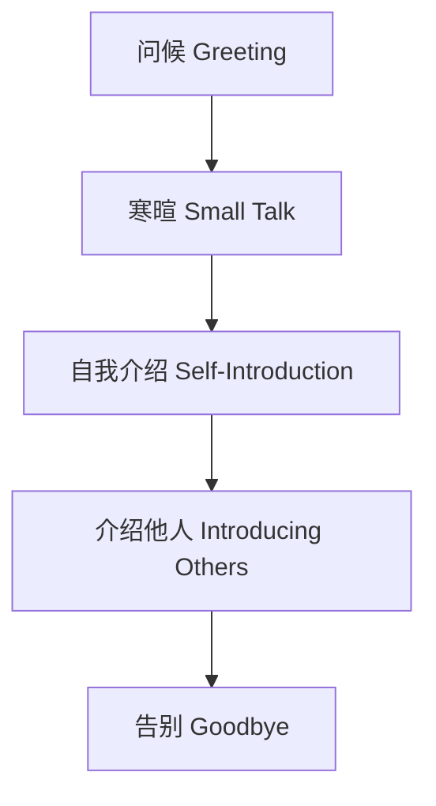
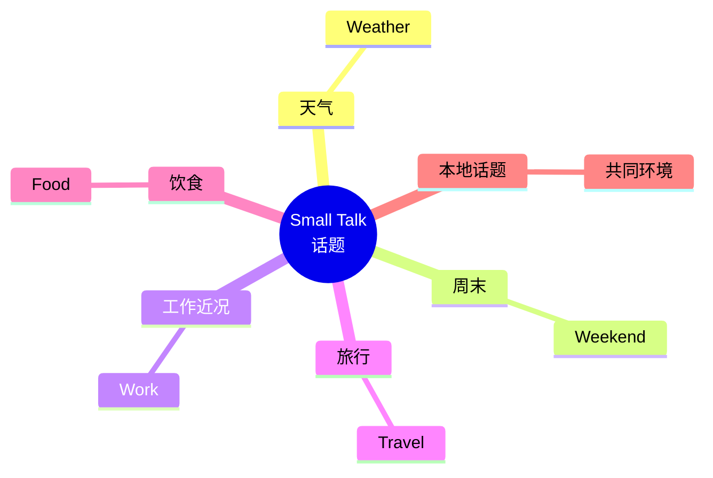
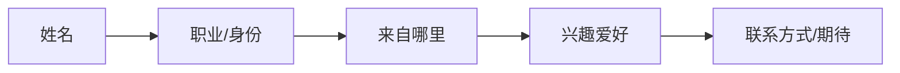

# 问候寒暄与自我介绍场景

> [!info] 本篇定位
> 欢迎进入 **06.日常生活场景实战** 分类，这是整套教程的**应用核心**！
>
> 前 20 篇是"语法工具箱"，从这一篇开始，我们**直接进入真实场景**——每篇都是**可以直接背下来用**的对话和句型。
>
> 第一篇讲的是**所有场景的开端**：问候、寒暄、自我介绍。
>
> **80% 的尴尬冷场**发生在这三步。一旦能流畅完成开场，后面的对话会自然展开。
>
> 读完本篇，你能：
>
> - 在**不同场合**自如打招呼（朋友/同事/陌生人/商务）
> - 用 **Small Talk** 化解尴尬（天气、周末、工作近况）
> - 做出**完整的自我介绍**（基本信息 + 工作 + 兴趣）
> - **介绍他人**给在场的朋友

---

## 1. 本篇导读：开场为什么这么重要

### 1.1 一个常见尴尬场景

国外会议茶歇，你想去和外国人交流，结果：

```
你：    Hello.
对方：  Hi, how are you?
你：    Fine, thank you. And you?
对方：  Good. (沉默)
你：    ... (不知道说什么)
对方：  ... (走开了)
```

**问题在哪？**
- 用了**最古老的教科书问候**（如今美国人不再说 "Fine, thank you"）
- 没有**Small Talk** 来延伸对话
- 没准备好**自我介绍**承接

### 1.2 一个流畅的开场

```
你：    Hi! I don't think we've met. I'm John.
对方：  Hi John, I'm Sarah. Nice to meet you!
你：    You too. How's the conference going for you?
对方：  Pretty good! I really enjoyed the morning sessions.
你：    Same here. The keynote was inspiring.
        So, what brings you here?
对方：  I work in marketing for a tech startup...
你：    Oh interesting! I'm in product management myself.
```

**5 句话**就完成：**问候 → Small Talk → 自我介绍 → 找到共同话题**。这就是本篇要教的能力。

### 1.3 本篇结构



---

## 2. 问候 Greetings

### 2.1 时段问候（5 个）

```
Good morning!         (早安——5 AM 到 12 PM)
Good afternoon!       (下午好——12 PM 到 5 PM)
Good evening!         (晚上好——5 PM 之后，见面用)
Good night!           (晚安——告别用，不是见面)
Good day!             (你好——澳式，全天可用)
```

> [!warning] Good night ≠ 晚上好
>
> **Good night** 只用于**告别**，意思是"睡个好觉/再见"。
>
> 晚上见到人时用 **Good evening**。

### 2.2 通用问候（10 个）

**最常用的现代问候**：

```
① Hi! / Hello!
② Hey! (更随意)
③ How are you?
   ✅ 标准回答：I'm good, thanks. / Good, you?
   ✅ 更地道：Pretty good. / Not bad. / Doing well.
   ❌ "Fine, thank you. And you?" (太死板，现代英语少用)

④ How's it going?
   ✅ It's going great. / Pretty good. / Not bad.

⑤ How are you doing?
   ✅ Doing well. / Doing good.

⑥ What's up?
   ✅ Not much. / Same old. / Just chilling.
   (随意，朋友间)

⑦ How have you been? (久未见)
   ✅ I've been good. / Pretty busy.

⑧ How's life?
   ✅ Life's good. / Can't complain.

⑨ Long time no see! (好久不见)
   ✅ I know! How have you been?

⑩ Nice to see you (again)!
   ✅ You too!
```

### 2.3 不同关系的问候选择

| 关系 | 问候方式 |
| ---- | ---- |
| 好朋友 | Hey! / What's up? / Yo! |
| 同事 | Hi! / How's it going? / Morning! |
| 陌生人 | Hello! / Hi! / Good morning! |
| 商务场合 | Good morning. / Hello, [Mr./Ms. + 姓] |
| 客户 | It's a pleasure to meet you. / Hello, how do you do? |

### 2.4 美式 vs 英式问候

| 美式 | 英式 |
| ---- | ---- |
| How are you doing? | How are you? |
| What's up? | You alright? |
| Hey there! | Hi there! |
| Howdy! (南部方言) | Cheers! (告别) |

> [!tip] How are you 不是真的问"怎么样"
>
> 这是**最大的文化误解**！
>
> 美国人说 **How are you?** 大多数时候**不是真的关心**你过得如何，**只是问候**。**期待的回答**：
>
> - "Good, thanks!"
> - "Pretty good, you?"
> - "Doing well!"
>
> **不要回答详细的近况**：
>
> ❌ "Well, my back hurts and my dog is sick..."
>
> 如果想真聊聊，问 **"How have you been (really)?"** 才是真在问。

---

## 3. 寒暄 Small Talk

### 3.1 什么是 Small Talk

**Small Talk** = **没有实质内容的轻松闲聊**，主要功能是**建立社交连接、消除冷场**。

**英语国家的核心社交技能**——不会 Small Talk 会被认为"很冷漠"。

### 3.2 6 大经典话题



### 3.3 话题 1：天气（10 个句型）

天气是**最安全**的话题——不涉及隐私，人人都能聊。

```
① Lovely weather, isn't it?           (天气真好啊。)
② Nice day today!                      (今天天真好！)
③ Beautiful weather we're having!     (好天气！)
④ Cold/hot enough for you?             (够冷/热的吧？)
⑤ Looks like it's going to rain.       (好像要下雨了。)
⑥ Did you see the weather forecast?    (看天气预报了吗？)
⑦ Can you believe this heat?           (这热得不可思议吧？)
⑧ I hope it doesn't rain.              (希望别下雨。)
⑨ It's been so cold lately.            (最近真冷。)
⑩ The weather's been crazy this year. (今年天气太奇怪了。)
```

**完整对话**：

```
A: "Beautiful day, isn't it?"
B: "It really is! I love this kind of weather."
A: "I just hope it stays like this for the weekend."
B: "Same here. I'm planning a hike."
```

### 3.4 话题 2：周末（10 个句型）

```
① How was your weekend?               (周末怎么样？)
② Did you do anything fun this weekend?
③ Got any plans for the weekend?
④ Are you doing anything special this weekend?
⑤ How did you spend your weekend?
⑥ I had a quiet weekend.               (周末很安静。)
⑦ Just stayed home and relaxed.        (在家放松了一下。)
⑧ I went to a barbecue.                (我去了烧烤。)
⑨ I caught up on sleep.                (我补了觉。)
⑩ Same old, nothing special.           (老样子，没什么特别。)
```

**完整对话**：

```
A: "How was your weekend?"
B: "Pretty good! I went hiking with some friends. How about you?"
A: "Just a quiet one. I caught up on some Netflix."
B: "Oh nice, what did you watch?"
```

### 3.5 话题 3：工作近况（10 个句型）

**对同事/熟人**：

```
① How's work going?                    (工作怎么样？)
② Busy week?                           (这周忙吗？)
③ Are you working on anything interesting?
④ How's the project going?
⑤ Any big projects coming up?

回答：
⑥ Pretty busy, but it's good.          (挺忙的，还不错。)
⑦ Crazy busy these days.               (最近忙疯了。)
⑧ Same old, same old.                  (老样子。)
⑨ It's been a tough week.              (这周很难。)
⑩ I'm just trying to survive!          (我只想挺过去！)
```

**对新认识的人**：

```
What do you do (for a living)?         (你做什么工作？)
What line of work are you in?
Where do you work?
What do you do there?

回答：
I'm a [职业].                          (I'm a teacher.)
I work in [行业].                      (I work in finance.)
I work for [公司].                     (I work for Google.)
I'm in [部门].                         (I'm in marketing.)
```

### 3.6 话题 4：旅行（5 个句型）

```
① Have you been on any trips lately?
② Are you planning any vacations?
③ Where did you go on your last vacation?
④ Have you ever been to [地方]?
⑤ I've been wanting to visit [地方].
```

### 3.7 话题 5：饮食（5 个句型）

```
① Have you tried [the new restaurant]?
② What kind of food do you like?
③ I'm a big fan of [Italian food].
④ Have you eaten yet?
⑤ I'm getting hungry.
```

### 3.8 话题 6：本地话题/共同环境（5 个句型）

利用**当下共同的环境**展开话题：

```
办公室：Did you see the new espresso machine?
聚会：  Have you tried the food yet?
会议：  What did you think of the keynote?
排队：  Quite the line, isn't it?
店里：  Have you been here before?
```

### 3.9 Small Talk 禁忌话题

> [!warning] 西方文化中的禁忌话题
>
> **避免在 Small Talk 中谈这些**：
>
> - **政治**（partisan politics）
> - **宗教**
> - **薪资 / 收入**
> - **年龄**（尤其女性）
> - **体重 / 外貌**
> - **婚姻状况**（"为什么还不结婚"）
> - **生育计划**（"什么时候要孩子"）
>
> **中国式关心** = **西方式冒犯**。

### 3.10 Small Talk 万能套路

**5 步套路**：

```
1. 开场问候：     Hi! How are you?
2. 简短回答：     Good, thanks. How about you?
3. 切入话题：     This weather is crazy, isn't it?
4. 深入聊几句：   I can't wait for spring.
5. 礼貌结束：     Anyway, nice talking to you!
```

---

## 4. 自我介绍 Self-Introduction

### 4.1 自我介绍的 5 大要素



### 4.2 不同长度的自我介绍

**10 秒版（最简）**：

```
"Hi, I'm John. I'm a software engineer from Beijing.
 Nice to meet you!"
```

**30 秒版（标准）**：

```
"Hi, I'm John. I'm originally from Beijing, but I currently
 work in Shanghai as a software engineer at Tech Co.
 I've been doing this for about 5 years.
 In my free time, I love hiking and photography.
 Nice to meet you!"
```

**1 分钟版（求职/正式）**：

```
"Hi, my name is John. I'm a software engineer with 5 years of
 experience, currently working at Tech Co.
 I specialize in backend development and cloud infrastructure.
 I have a Bachelor's degree in Computer Science from Tsinghua University.
 I'm passionate about building scalable systems and learning new
 technologies.
 In my spare time, I enjoy hiking, photography, and reading.
 I'm looking forward to discussing how I can contribute to your team."
```

### 4.3 介绍姓名的句型（5 种）

```
① I'm + 名字
   I'm John.

② My name is + 全名
   My name is John Smith.
   (正式)

③ You can call me + 昵称
   My name is John, but you can call me J.
   (中国学生常用：可以介绍英文名)

④ I go by + 名字
   I go by John.
   (我叫 John——通常这是别人对我的称呼)

⑤ Just call me + 名字
   Just call me John.
   (随意)
```

### 4.4 介绍职业（10 种）

**直接说职业**：

```
I'm a teacher.
I'm a doctor.
I'm an engineer.
I'm a student.
I'm a stay-at-home mom.    (全职妈妈)
I'm self-employed.         (自由职业)
I'm retired.               (退休)
```

**说工作公司/领域**：

```
I work for Microsoft.                  (我为微软工作。)
I work in finance.                     (我在金融业。)
I work in the tech industry.           (我在科技行业。)
I'm in healthcare.                     (我在医疗行业。)
I'm currently between jobs.            (我目前没工作——委婉。)
```

**说工作经验**：

```
I've been a teacher for 10 years.
I have 5 years of experience in marketing.
I'm new to this field.                 (我是这行的新人。)
I'm transitioning into tech.           (我正转行做科技。)
```

### 4.5 介绍家乡/出身（8 种）

```
① I'm from + 地方
   I'm from China.
   I'm from Beijing.

② I come from + 地方
   I come from a small town in northern China.

③ I'm originally from ..., but I live in ...
   I'm originally from Beijing, but I currently live in Shanghai.

④ I was born in ..., raised in ...
   I was born in China, raised in the US.

⑤ I grew up in ...
   I grew up in a small village.

⑥ I'm based in ...
   I'm based in New York now.

⑦ I'm a native of ...
   I'm a native of Tokyo.
   (较正式)

⑧ My hometown is ...
   My hometown is Chengdu.
```

### 4.6 介绍家庭（10 种）

**婚姻状况**：

```
I'm single.                    (我单身。)
I'm married.                   (我已婚。)
I'm divorced.                  (我离异。)
I'm engaged.                   (我订婚了。)
I'm in a relationship.         (我有男/女朋友。)
I'm seeing someone.            (我在和某人交往。)
```

**家庭成员**：

```
I have two kids.               (我有两个孩子。)
I have an older sister.        (我有一个姐姐。)
I'm the youngest of three.     (我是三个孩子里最小的。)
I live with my parents.        (我和父母一起住。)
```

**注意**：**初次见面慎问婚姻状况**——西方文化中算隐私。

### 4.7 介绍兴趣爱好（15 种）

**通用模板**：`I love / enjoy / am into + (doing) ...`

```
I love reading.
I enjoy traveling.
I'm into yoga.
I'm a big fan of [activity].
In my free time, I [activity].
On weekends, I usually [activity].
```

**具体爱好**：

```
体育：I play tennis. / I do CrossFit. / I'm a runner.
艺术：I love painting. / I play the guitar. / I write poetry.
学习：I love reading. / I'm learning Spanish. / I take online courses.
游戏：I'm a gamer. / I play board games. / I love chess.
户外：I love hiking. / I go camping. / I do photography.
社交：I love trying new restaurants. / I host dinner parties.
家居：I love cooking. / I do DIY projects.
```

**热情等级**：

```
I'm interested in ...          (有兴趣)
I like ...                     (喜欢)
I love ...                     (热爱)
I'm passionate about ...       (热衷)
I'm obsessed with ...          (痴迷)
```

### 4.8 完整自我介绍模板

**模板 1：社交场合**

```
Hi, I'm [Name].
I'm originally from [Place], and I work as a [Profession]
at [Company].
In my spare time, I love [Hobby 1] and [Hobby 2].
What about you?
```

**模板 2：商务场合**

```
Good morning. I'm [Name], [Position] at [Company].
I have [X] years of experience in [Field].
My main responsibilities include [Job Description].
I'm here to [Purpose].
It's a pleasure to meet you.
```

**模板 3：第一次小组碰面**

```
Hi everyone, I'm [Name].
I'm new to the team, joining from [Previous Role/Place].
My background is in [Field], and I'm excited to work with all of you.
A bit about me personally: I love [Hobby] and [Fact].
Looking forward to getting to know you all!
```

---

## 5. 介绍他人 Introducing Others

### 5.1 基本介绍句型

```
① This is + 名字 + 描述
   This is John, my colleague.
   This is Mary, she's from Australia.

② I'd like you to meet + 名字
   I'd like you to meet my friend, Tom.
   (较正式)

③ Have you met + 名字 + ?
   Have you met Sarah? She works in marketing.

④ Let me introduce you to + 名字
   Let me introduce you to my boss, Mr. Chen.

⑤ Allow me to introduce + 名字
   Allow me to introduce Ms. Smith, our CEO.
   (最正式)
```

### 5.2 描述被介绍人

```
This is John ...
- my friend / colleague / brother / wife / boss
- from Beijing / from college / from work
- who works in tech / who I met at...
- a great photographer / an amazing chef
```

### 5.3 介绍后的回应

**被介绍方的回应**：

```
Nice to meet you!
Pleasure to meet you.
Pleased to meet you. (较正式)
It's a pleasure. (商务场合)
Hi! Great to finally meet you. (听过名字)
```

**回应方的回应**：

```
You too!
Likewise!
The pleasure is mine.
Good to meet you as well.
```

### 5.4 介绍优先级（礼仪）

**正式场合的介绍顺序**：

1. **把年轻 / 资历低的人**介绍给**年长 / 资深的人**
2. **把男士**介绍给**女士**（传统礼仪）
3. **把员工**介绍给**客户/上级**

```
Mr. Smith, this is John, my new assistant.
(向 Mr. Smith 介绍 John，因为 Smith 资深)

Sarah, this is Tom, my college friend.
(向女士介绍男士)
```

### 5.5 介绍后的对话延伸

介绍完不能就走开，要让两人能开始聊：

```
"Tom, this is Sarah. She just got back from Italy."
"Sarah, Tom is also into traveling. You two have a lot in common."

(给两人提供共同话题，避免冷场。)
```

---

## 6. 告别 Goodbye

### 6.1 不同情境的告别

**朋友间（随意）**：

```
Bye! / See ya! / Catch you later!
Take care! / Have a good one!
Talk to you later! (口语缩写：TTYL)
Later! / Peace!
```

**同事间（标准）**：

```
Have a good day!
Have a great weekend!
See you tomorrow!
Take care!
```

**正式场合**：

```
It was a pleasure meeting you.
It was great talking to you.
I look forward to our next meeting.
Goodbye. / Farewell.
```

**未来再见**：

```
Let's keep in touch.
Let's grab coffee sometime.
We should hang out soon.
Hope to see you again.
```

### 6.2 告别的"软退出"

**英语国家避免突然结束对话**，常用"软退出"：

```
1. 表达想结束：
   "Anyway, ..."
   "Well, ..."
   "I should probably get going."
   "I don't want to keep you."

2. 给理由：
   "I've got to head out."
   "I need to make a call."
   "I have a meeting in 10."

3. 表示愉快：
   "It was great talking to you!"
   "I really enjoyed our chat."

4. 期待再见：
   "Let's catch up soon!"
   "See you around!"

5. 正式告别：
   "Have a great rest of your day!"
   "Take care!"
```

**完整退出对话**：

```
"Well, I should probably get going—I have a call in 10 minutes.
 But it was really nice talking to you, John!
 Let's grab coffee soon. Take care!"
```

---

## 7. 完整场景对话（5 个）

### 7.1 场景 1：第一次见面（聚会）

```
Tom:    Hi there! I don't think we've met. I'm Tom.
Sara:   Hi Tom, I'm Sara. Nice to meet you!
Tom:    Likewise. Are you a friend of John's?
Sara:   Yeah, we work together. How about you?
Tom:    I'm John's neighbor. We've known each other for years.
Sara:   Oh, cool! What do you do for a living?
Tom:    I'm a graphic designer. You?
Sara:   I'm in marketing. We probably collaborate sometimes!
Tom:    Ha! Probably. Have you tried the food?
Sara:   Not yet, I just got here. Want to grab some?
Tom:    Sure, lead the way!
```

### 7.2 场景 2：办公室早晨

```
Mike:   Morning, Lisa! How was your weekend?
Lisa:   Hey Mike! Pretty good, thanks. I went hiking.
        How about yours?
Mike:   Quiet one. Mostly Netflix and pizza.
Lisa:   Sounds perfect actually!
Mike:   Are you ready for the big meeting today?
Lisa:   I think so. I prepped over the weekend.
Mike:   You're so prepared! I should learn from you.
Lisa:   Ha! Anyway, see you in the meeting!
Mike:   Good luck!
```

### 7.3 场景 3：商务会议初见

```
You:    Good morning, Mr. Anderson. It's a pleasure to finally meet you.
Mr. A:  The pleasure is mine. Please, call me David.
You:    David, then. I'm John, the project lead from our side.
Mr. A:  John, great to meet you. How was your trip?
You:    Quite smooth, thank you. The hotel is excellent.
Mr. A:  Good to hear. Shall we get started?
You:    Absolutely.
```

### 7.4 场景 4：老朋友重逢

```
Alice:  No way—Mark? Is that you?
Mark:   Alice! Long time no see! How have you been?
Alice:  I've been good! It's been what, 5 years?
Mark:   At least! Last time was Sarah's wedding, right?
Alice:  Yes! How are you? Still in Beijing?
Mark:   No, I moved to Shanghai a year ago for work.
        How about you?
Alice:  Still in Beijing. I'm working at a startup now.
Mark:   That's exciting! We have so much to catch up on.
Alice:  Definitely! Are you free for dinner tomorrow?
Mark:   Yes, let's do it. I'll text you.
```

### 7.5 场景 5：网络/视频会议初次见面

```
You:     Hi everyone, can you hear me okay?
Others:  Yes, loud and clear.
You:     Great. For those who don't know me, I'm John,
         the new product manager.
         I've been with the company for 2 weeks now.
         I'm based in Shanghai, but I've worked with global teams
         for the past 5 years.
         Looking forward to working with all of you!
Boss:    Thanks for the intro, John! Welcome aboard.
You:     Thank you! Excited to be here.
```

---

## 8. 文化差异提醒

### 8.1 东西方介绍差异

| 项目 | 中文文化 | 英语文化 |
| ---- | ---- | ---- |
| 称呼 | 名 + 头衔（张老师）| 名 + 姓 / 直呼名 |
| 谦虚 | "我没什么本事" | 自信介绍特长 |
| 隐私 | 可以问年龄/收入 | 避免问 |
| 详细度 | 简短 | 较详细（含兴趣） |
| 谦虚介绍 | "马马虎虎" | 不接受 false modesty |

### 8.2 中国式自我介绍的常见误区

> [!warning] 6 个中式自我介绍陷阱
>
> **陷阱 1：过度谦虚**
> - ❌ "I'm not very good at English."（西方人会真的相信你不行。）
> - ✅ "My English is still improving, but I'm getting better."
>
> **陷阱 2：照本宣科**
> - ❌ "Hello, my name is John. I am 30 years old. I am from China.
>     I work at..."（像背书）
> - ✅ 自然连贯的口语化介绍
>
> **陷阱 3：信息过多**
> - ❌ 把所有信息一口气说完（年龄、家庭、收入、爱好……）
> - ✅ 简短开场，根据对方反应延伸
>
> **陷阱 4：用 "How are you?" 当真话**
> - ❌ 长篇回答近况
> - ✅ "Pretty good, you?" 然后等对方接话
>
> **陷阱 5：忘记问对方**
> - ❌ 自我介绍完不问对方
> - ✅ "What about you?" / "And you?"
>
> **陷阱 6：握手过弱**
> - 西方文化：握手要有力（firm handshake），但不要捏疼
> - 中国学生常握得太轻，被认为"没自信"

### 8.3 文化中的"距离感"

```
熟悉度从低到高：
陌生人：    Hello / How do you do (英)
普通认识：  Hi / How are you?
朋友：      Hey / What's up?
好朋友：    Yo / Sup
家人：      可以省略问候
```

---

## 9. 100 个核心词组速查

### 9.1 问候

```
Hi / Hello / Hey
Good morning / afternoon / evening
How are you?
How's it going?
What's up?
How have you been?
Long time no see
Nice to meet you
Pleased to meet you
Pleasure to meet you
```

### 9.2 寒暄过渡

```
What brings you here?
What do you do?
Where are you from?
How do you know [host]?
Have you been here before?
This place is great, isn't it?
```

### 9.3 自我介绍

```
I'm + name
My name is ...
I work as / for / in ...
I'm originally from ...
I currently live in ...
I have X years of experience in ...
In my spare time, I ...
I'm passionate about ...
I love / enjoy / am into ...
I'm a big fan of ...
```

### 9.4 介绍他人

```
This is ...
I'd like you to meet ...
Have you met ...?
Let me introduce you to ...
... is a good friend of mine.
```

### 9.5 告别

```
It was nice talking to you.
Let's keep in touch.
Have a great day / weekend!
See you later / soon / tomorrow!
Take care!
Catch you later!
```

---

## 10. 常见错误大盘点

### 10.1 错误 1：Fine, thank you. And you?

**几乎没人这么说了**——这是 50 年前的教科书表达。

```
现代地道：Pretty good, you? / Doing well!
```

### 10.2 错误 2：How do you do? 当问候

```
How do you do? 是一种**过时**的极正式问候，用于初次见面。
回答也是 "How do you do?"（不是答近况）

现代场合用 Nice to meet you 即可。
```

### 10.3 错误 3：Where are you come from?

```
❌ Where are you come from?
✅ Where are you from?
✅ Where do you come from?
```

### 10.4 错误 4：How old are you?（初次见面）

**初次见面问年龄是冒犯**！尤其对女性。

如果真要知道，可以用：

```
"What year did you graduate?" (推算年龄)
"You look young!" (称赞，不直问)
```

### 10.5 错误 5：把英文名当昵称

```
❌ "My name is Wang Wei. You can call me Mike."
   (有些奇怪——好像 Mike 不是真名)

✅ "I'm Wang Wei, but most people call me Mike."
✅ "I go by Mike."
✅ "My English name is Mike."
```

### 10.6 错误 6：太频繁说 "Sorry"

中国学生常因为紧张说很多 sorry：

```
❌ "Sorry, I'm not very good. Sorry, my English is bad."
✅ 自信开口，错了再纠正即可。
```

---

## 11. 练习与输出建议

> [!success] 本篇练习清单
>
> **基础练习**
>
> 1. 写出你的 **3 个版本**自我介绍（10 秒、30 秒、1 分钟）
>
> 2. 准备 **5 个 Small Talk 话题**，每个话题写 3 个句型
>
> 3. 选择 5 种问候方式，**录音 3 遍**，模仿语调
>
> **角色扮演**
>
> 4. 模拟 5 个场景（自己读两个角色）：
>    - 在咖啡馆遇到外国朋友的朋友
>    - 第一次入职新公司
>    - 飞机上和邻座聊天
>    - 视频会议第一次和团队见面
>    - 多年未见的同学重逢
>
> **AI 对话**
>
> 5. 让 AI 扮演陌生人，你做 **3 分钟自我介绍 + Small Talk**，
>    让 AI 给你**反馈**和**建议**。
>
> **长期任务**
>
> 6. 准备一份"**英语社交工具包**"：
>    - 5 个开场白
>    - 10 个 Small Talk 句型
>    - 你的标准自我介绍（30 秒版）
>    - 5 个告别套路
>    全部背熟，**张口就来**。
>
> 7. 找 **1 个英语聊天对象**（语伴 / Tandem / 外教），实战练习。

---

## 12. 本篇小结

> [!success] 本篇核心要点回顾
>
> **问候**：
> - 时段：Good morning/afternoon/evening
> - 通用：Hi / Hello / How are you / How's it going
> - 久未见：Long time no see / How have you been
>
> **Small Talk 6 大话题**：
> - 天气、周末、工作、旅行、饮食、本地话题
> - **禁忌**：政治、宗教、薪资、年龄、婚育
>
> **自我介绍 5 要素**：
> - 姓名 + 职业 + 来源 + 兴趣 + 期待
> - 3 个版本：10 秒 / 30 秒 / 1 分钟
>
> **介绍他人**：
> - This is ... / I'd like you to meet ...
> - 给两人共同话题
>
> **告别**：
> - 朋友：See ya / Catch you later
> - 同事：Have a good day
> - 商务：It was a pleasure meeting you
> - "软退出"：先给理由，再表愉快，再期待
>
> **文化差异**：
> - How are you 不是真问，期待简短回答
> - 不要过度谦虚 / 道歉
> - 不要问年龄 / 收入 / 婚育
> - 握手要有力

### 12.1 下一篇预告

> [!info] 下一篇：02.家庭家务与日常起居场景
>
> 下一篇讲**最日常的家庭场景**：
>
> - **起床/睡觉**：早晨晚上的对话
> - **三餐**：早午晚餐如何说
> - **做饭**：买菜、烹饪、口味
> - **打扫**：吸尘、洗衣、收拾
> - **家电故障**：水管漏水、空调坏了怎么报修
>
> 这一篇帮你**用英语描述每天的生活**。
