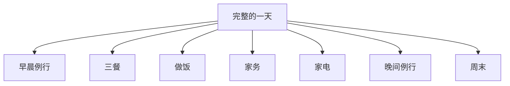

# 家庭家务与日常起居场景

> [!info] 本篇定位
> 上一篇讲了**社交开场**，这一篇讲**最贴近你生活的内容**——家里的一切。
>
> 你能用英文流畅说出"早上 7 点起床、刷牙洗脸、煮咖啡、上班、晚上做饭、洗碗、看电视、睡觉"吗？大多数中国学生**说不出来**——因为这些**最简单的日常动作**，反而是我们**最少在课本上学到**的。
>
> 本篇覆盖 **400+ 日常生活词汇**和 **80+ 实用句型**，让你能用英文**完整描述自己的一天**。

---

## 1. 本篇导读：日常英语为什么"最难"

### 1.1 一个现实尴尬

你认识 `magnificent`、`incredible`、`extraordinary` 这种"高级词"，却不会说"**马桶堵了**"、"**电饭锅煮饭**"、"**抽油烟机坏了**"。

为什么？因为：

- 学校只教书面语，**不教生活词**
- 这些词**翻译软件查不到地道说法**
- 中文母语者从小不需要思考"刷牙"怎么说

### 1.2 本篇要解决的目标

读完本篇，你能：

- ✅ **用英语描述完整的一天**（起床到睡觉）
- ✅ 在国外**租房入住**时和房东沟通
- ✅ **报修家电** / 抱怨故障
- ✅ 和外国室友/朋友谈论**日常生活**
- ✅ 和**家庭成员/孩子**用英文交流

### 1.3 学习地图



---

## 2. 早晨例行（Morning Routine）

### 2.1 核心动作（30 个）

```
起床类：
wake up         (醒来)
get up          (起床)
get out of bed  (下床)
sleep in        (睡懒觉)
oversleep       (睡过头)

洗漱类：
brush my teeth      (刷牙)
floss               (用牙线)
wash my face        (洗脸)
take a shower       (淋浴)
take a bath         (洗澡)
shave               (剃须)
put on makeup       (化妆)
do my hair          (做发型)
comb my hair        (梳头)

穿着类：
get dressed        (穿衣)
put on clothes     (穿衣服)
change clothes     (换衣服)

晨间活动：
make the bed       (整理床铺)
make breakfast     (做早餐)
have breakfast     (吃早餐)
make coffee        (煮咖啡)
read the news      (看新闻)
check my phone     (看手机)
walk the dog       (遛狗)

出门：
leave for work     (去上班)
catch the bus      (赶公交)
drive to work      (开车上班)
take the subway    (坐地铁)
beat the traffic   (避开堵车)
```

### 2.2 实用句型（10 个）

```
① I'm an early bird.
   (我是早起鸟。)

② I'm not a morning person.
   (我不喜欢早起。)

③ I usually wake up at 7.
   (我一般 7 点醒。)

④ I hit the snooze button three times.
   (我按了三次贪睡键。)

⑤ I overslept this morning.
   (我今早睡过头了。)

⑥ I need coffee to function.
   (我得喝咖啡才能正常运转。)

⑦ I rush out the door at 8.
   (我 8 点匆匆出门。)

⑧ I take a 15-minute shower.

⑨ I have a quick breakfast.
   (我快速吃个早餐。)

⑩ I usually skip breakfast.
   (我经常不吃早餐。)
```

### 2.3 早晨场景对话

```
Roommate A: "Good morning! You're up early today."
You:        "Yeah, I have an early meeting. What about you?"
Roommate A: "I'm running late as usual. I overslept again."
You:        "I made some extra coffee, help yourself."
Roommate A: "You're a lifesaver! I'll grab a cup and run."
You:        "Have a good day!"
Roommate A: "You too!"
```

---

## 3. 三餐场景（Meals）

### 3.1 三餐时间与名称

```
breakfast    (早餐)            6 AM - 10 AM
brunch       (早午餐)          10 AM - 12 PM (周末常用)
lunch        (午餐)            12 PM - 2 PM
afternoon tea (下午茶)          3 PM - 4 PM (英式)
dinner       (晚餐)            5 PM - 8 PM
supper       (晚餐/宵夜)        8 PM 后
midnight snack (夜宵)
```

> [!tip] dinner vs supper
>
> - **dinner**：现代用法 = **晚餐**（一天的主餐）
> - **supper**：旧式用法 = **轻便的晚餐**（在 dinner 之后的小餐）
>
> 美国大部分地区**不区分**，都说 dinner。

### 3.2 描述三餐的句型（15 个）

**早餐**：

```
① For breakfast, I usually have cereal.
   (早餐我通常吃麦片。)

② I had eggs and toast this morning.
   (我今早吃了鸡蛋和吐司。)

③ I usually skip breakfast.
   (我经常不吃早餐。)

④ I grab a bagel on my way to work.
   (我上班路上买个贝果。)

⑤ I'm not really a breakfast person.
   (我不太爱吃早餐。)
```

**午餐**：

```
⑥ What's for lunch?
   (午餐吃什么？)

⑦ I'll grab a sandwich.
   (我去拿个三明治。)

⑧ I bring my own lunch from home.
   (我从家带午餐。)

⑨ I usually eat out for lunch.
   (午餐我通常出去吃。)

⑩ Let's order delivery.
   (我们点外卖吧。)
```

**晚餐**：

```
⑪ What should we have for dinner?
   (晚餐吃什么？)

⑫ Dinner's ready!
   (饭好了！)

⑬ I'm starving!
   (我饿死了！)

⑭ I'm full.
   (我饱了。)

⑮ Save room for dessert.
   (留点肚子吃甜点。)
```

### 3.3 食物种类词汇库（80 个）

**主食类**：
```
rice 米饭            noodles 面条        pasta 意大利面
bread 面包          toast 吐司          bagel 贝果
sandwich 三明治     burger 汉堡          pizza 比萨
sushi 寿司          dumplings 饺子      bun 包子
```

**蛋白类**：
```
chicken 鸡           beef 牛肉            pork 猪肉
fish 鱼              shrimp 虾            lamb 羊肉
eggs 鸡蛋            tofu 豆腐
```

**蔬菜类**：
```
broccoli 西兰花      spinach 菠菜         carrot 胡萝卜
tomato 番茄          cucumber 黄瓜        lettuce 生菜
mushroom 蘑菇        onion 洋葱           garlic 大蒜
potato 土豆          cabbage 白菜
```

**水果类**：
```
apple 苹果           banana 香蕉          orange 橙子
strawberry 草莓      grape 葡萄           watermelon 西瓜
mango 芒果           peach 桃             pear 梨
pineapple 菠萝
```

**饮品类**：
```
water 水             coffee 咖啡          tea 茶
milk 牛奶            juice 果汁           soda 汽水
beer 啤酒            wine 葡萄酒          smoothie 奶昔
```

**调味类**：
```
salt 盐              sugar 糖             pepper 胡椒
vinegar 醋           soy sauce 酱油       oil 油
butter 黄油          honey 蜂蜜           jam 果酱
```

### 3.4 描述食物的形容词（30 个）

**口味类**：
```
sweet 甜             salty 咸             sour 酸
spicy 辣             bitter 苦            bland 淡
savory 咸鲜          mild 温和            rich 浓郁
```

**质感类**：
```
crispy 脆            crunchy 嘎嘣脆       chewy 有嚼劲
soft 软              tender 嫩            tough 老
juicy 多汁           dry 干               creamy 奶味浓
```

**温度状态**：
```
hot 烫               warm 温              cold 冷
fresh 新鲜           frozen 冻的          stale 不新鲜的
ripe 熟的            raw 生的             cooked 熟的
```

**评价类**：
```
delicious 好吃       yummy 美味
amazing 非常棒        awful 难吃
disgusting 恶心       so-so 一般
```

---

## 4. 烹饪场景（Cooking）

### 4.1 烹饪动作（25 个）

```
准备类：
chop 切碎           dice 切丁           slice 切片
mince 切末          peel 削皮           grate 擦丝
wash 洗             rinse 冲洗          drain 沥干
mix 混合            stir 搅拌           whisk 打发
beat 打蛋           knead 揉面

烹饪类：
boil 煮             steam 蒸             fry 煎
deep-fry 炸         stir-fry 炒         grill 烤架烤
bake 烤箱烤         roast 烤            broil 焗
simmer 文火炖       stew 炖
microwave 用微波炉

完成类：
season 调味         taste 尝            serve 上菜
plate 装盘
```

### 4.2 厨房用具（20 个）

```
pot 锅               pan 平底锅           wok 中式炒锅
frying pan 煎锅     saucepan 小锅
oven 烤箱            microwave 微波炉    stove 炉子
fridge 冰箱          freezer 冰柜
knife 刀             cutting board 砧板  spatula 锅铲
spoon 勺             fork 叉             chopsticks 筷子
plate 盘             bowl 碗             cup 杯
ladle 长柄勺
```

### 4.3 烹饪句型（15 个）

```
① I'm making dinner.
   (我在做饭。)

② What are you cooking?
   (你在做什么菜？)

③ Can you help me chop the onions?
   (你能帮我切洋葱吗？)

④ Add a pinch of salt.
   (加一小撮盐。)

⑤ Let it simmer for 10 minutes.
   (文火炖 10 分钟。)

⑥ Stir occasionally.
   (偶尔搅拌一下。)

⑦ Don't overcook it.
   (别煮过头了。)

⑧ It's almost done.
   (快好了。)

⑨ Taste it and tell me what you think.
   (尝一下告诉我怎么样。)

⑩ It needs more seasoning.
   (需要多调点味。)

⑪ I burned the rice.
   (我把饭烧糊了。)

⑫ This recipe is super easy.
   (这食谱超简单。)

⑬ I'm a terrible cook.
   (我做饭很糟糕。)

⑭ I follow the recipe.
   (我按食谱来。)

⑮ I just wing it.
   (我就随便做。)
```

### 4.4 完整厨房对话

```
Wife:    "What should we have for dinner tonight?"
Husband: "How about pasta? I can make a quick sauce."
Wife:    "Sounds good. Do we have all the ingredients?"
Husband: "Let me check... we have pasta, but we need tomatoes."
Wife:    "I can run to the store. Anything else?"
Husband: "Maybe some basil and garlic, if they have it fresh."
Wife:    "Got it. I'll be back in 15."

(15 minutes later)

Wife:    "I'm back. How's it going?"
Husband: "Just chopping the onions. Can you boil some water for the pasta?"
Wife:    "Sure. How much salt should I add?"
Husband: "Just a generous pinch. The water should taste like the sea."
Wife:    "Done. Now what?"
Husband: "Wait for it to boil, then add the pasta. Cook for 8 minutes."
Wife:    "Smells amazing already!"
Husband: "Wait till you taste it!"
```

---

## 5. 家务清单（Household Chores）

### 5.1 主要家务（25 个）

```
do the laundry        (洗衣服)
fold the laundry      (叠衣服)
hang the laundry      (晾衣服)
iron the clothes      (熨衣服)

wash the dishes       (洗碗)
do the dishes         (洗碗)
load the dishwasher   (装洗碗机)
unload the dishwasher (卸洗碗机)

vacuum the floor      (吸尘)
sweep the floor       (扫地)
mop the floor         (拖地)
dust the furniture    (擦灰)
wipe the counter      (擦台面)

make the bed          (整理床铺)
change the sheets     (换床单)
clean the bathroom    (打扫浴室)
scrub the toilet      (刷马桶)

take out the trash    (倒垃圾)
empty the trash       (清空垃圾)
recycle               (回收)

water the plants      (浇花)
walk the dog          (遛狗)
feed the cat          (喂猫)

organize the closet   (整理衣柜)
declutter             (整理杂物)
```

### 5.2 描述家务的句型（15 个）

```
① I have to do the laundry today.
   (今天得洗衣服。)

② Whose turn is it to wash the dishes?
   (该谁洗碗？)

③ Can you take out the trash?
   (你能倒一下垃圾吗？)

④ I just vacuumed.
   (我刚吸过尘。)

⑤ The kitchen is a mess.
   (厨房乱死了。)

⑥ I need to declutter my room.
   (我得整理一下我的房间。)

⑦ I hate doing the dishes.
   (我讨厌洗碗。)

⑧ The bathroom is filthy.
   (浴室太脏了。)

⑨ Let's split the chores.
   (我们分工做家务吧。)

⑩ I do the cooking, you do the cleaning.
   (我做饭，你打扫。)

⑪ The living room is spotless!
   (客厅一尘不染！)

⑫ I'll tackle the laundry today.
   (今天我来搞定洗衣服。)

⑬ My place needs a deep clean.
   (我家需要彻底打扫。)

⑭ I do a quick clean every day.
   (我每天简单打扫一下。)

⑮ I'm a clean freak.
   (我是个洁癖。)
```

### 5.3 洗衣服详细句型

```
sort the clothes (by color)    (按颜色分类)
load the washing machine       (装洗衣机)
put detergent in               (放洗衣液)
press start                    (按启动键)
take out the wet clothes       (拿出湿衣服)
put them in the dryer          (放进烘干机)
hang them on the drying rack   (晾在晾衣架)
fold the dry clothes           (叠干净的衣服)
put them away                  (收起来)
```

### 5.4 家务分工对话

```
Wife:    "Ugh, the house is a mess."
Husband: "Let's clean up this weekend."
Wife:    "Good idea. Let's split the chores."
Husband: "OK, I'll do the bathroom and vacuum."
Wife:    "I'll handle the kitchen and laundry."
Husband: "What about the trash?"
Wife:    "Whoever finishes first does the trash."
Husband: "Deal!"
```

---

## 6. 家电使用与故障（Appliances）

### 6.1 常见家电（30 个）

```
厨房：
refrigerator / fridge   (冰箱)
freezer                 (冰柜)
microwave               (微波炉)
oven                    (烤箱)
stove / cooktop         (炉灶)
dishwasher              (洗碗机)
rice cooker             (电饭锅)
blender                 (搅拌机)
toaster                 (烤面包机)
coffee maker            (咖啡机)
kettle                  (烧水壶)

清洁：
washing machine         (洗衣机)
dryer                   (烘干机)
vacuum cleaner          (吸尘器)
robot vacuum            (扫地机器人)

调温：
air conditioner / AC    (空调)
heater                  (暖气)
fan                     (风扇)
humidifier              (加湿器)
dehumidifier            (除湿机)
air purifier            (空气净化器)

电子：
TV                      (电视)
remote control          (遥控器)
router                  (路由器)
modem                   (调制解调器)

其他：
hair dryer              (吹风机)
electric toothbrush     (电动牙刷)
iron                    (熨斗)
sewing machine          (缝纫机)
```

### 6.2 故障描述（15 个）

```
① It's broken.
   (坏了。)

② It's not working.
   (不工作了。)

③ It's not turning on.
   (打不开。)

④ It keeps making a strange noise.
   (一直发出奇怪的声音。)

⑤ The screen is frozen.
   (屏幕卡住了。)

⑥ The light is flickering.
   (灯一闪一闪。)

⑦ It's leaking.
   (漏水了。)

⑧ It's overheating.
   (过热了。)

⑨ The Wi-Fi is down.
   (Wi-Fi 断了。)

⑩ The Internet is so slow.
   (网速好慢。)

⑪ The TV won't turn on.
   (电视打不开。)

⑫ The fridge isn't cooling.
   (冰箱不制冷了。)

⑬ The toilet is clogged.
   (马桶堵了。)

⑭ The drain is blocked.
   (下水道堵了。)

⑮ The water pressure is low.
   (水压太低。)
```

### 6.3 报修句型（10 个）

```
① I need to call the repair guy.
   (我得叫维修工。)

② Can you send someone to fix it?
   (能派人来修吗？)

③ When can you come?
   (你什么时候能来？)

④ How much will it cost?
   (要多少钱？)

⑤ Is it covered by warranty?
   (在保修期内吗？)

⑥ It started making weird noises yesterday.
   (它昨天开始发出奇怪的声音。)

⑦ I tried unplugging it, but it didn't help.
   (我试着拔了插头，但没用。)

⑧ Can you walk me through it over the phone?
   (能在电话里指导我一步步弄吗？)

⑨ The repair is going to take a few days.
   (维修要几天。)

⑩ How long will the repair take?
```

### 6.4 报修对话

```
You:        "Hi, I'm calling about my AC. It stopped working
            this morning."
Repair:     "OK. What's the issue exactly?"
You:        "It's blowing warm air, not cold."
Repair:     "Have you checked the thermostat?"
You:        "Yes, it's set to 22 degrees."
Repair:     "OK. Is the unit making any unusual noises?"
You:        "Actually, yes—a buzzing sound."
Repair:     "Sounds like the compressor. We can send a technician
            tomorrow morning."
You:        "What time would that be?"
Repair:     "Between 9 and 11 AM. Will that work?"
You:        "Yes, that's fine. How much will it cost?"
Repair:     "Diagnosis is free. Repair cost depends on the issue.
            Could be anywhere from $100 to $500."
You:        "OK, please book it. Thanks!"
```

---

## 7. 房屋问题与房东沟通（Housing Issues）

### 7.1 常见房屋问题（15 个）

```
The toilet is clogged.            (马桶堵了。)
The sink is leaking.              (水池漏水。)
There's a leak in the ceiling.    (天花板漏水。)
The faucet is dripping.           (水龙头滴水。)
The drain is slow.                (下水慢。)
The hot water doesn't work.       (没热水。)
There's mold in the bathroom.     (浴室有霉。)
The window won't open / close.    (窗户开/关不了。)
The door doesn't lock properly.   (门锁不上。)
The heating is broken.            (暖气坏了。)
There are bugs / cockroaches.     (有虫子/蟑螂。)
There are mice / rats.            (有老鼠。)
The smoke detector is beeping.    (烟雾报警器在响。)
The light bulb burned out.        (灯泡坏了。)
The wall has a crack.             (墙裂了。)
```

### 7.2 联系房东句型（10 个）

```
① I'm having an issue with ...
   I'm having an issue with the heating.

② Could you send someone to fix it?

③ When can you have it fixed?
   (什么时候能修好？)

④ This is urgent.
   (这事很急。)

⑤ The problem has been going on for a week.
   (问题已经持续一周了。)

⑥ Could I get a rent reduction for this?
   (这能减点租金吗？)

⑦ Is this covered by my lease?
   (我的租约包含这个吗？)

⑧ I'd like to report a maintenance issue.

⑨ Can the issue be fixed remotely?

⑩ I'd appreciate a quick response.
   (希望尽快回复。)
```

### 7.3 房东对话

```
You:       "Hi, this is John from apartment 5B. I have a problem
           with the bathroom."
Landlord:  "What's the issue?"
You:       "There's water leaking from the ceiling. It looks like
           it's coming from the apartment above."
Landlord:  "How bad is it?"
You:       "It's dripping pretty steadily. I had to put a bucket
           underneath."
Landlord:  "OK, I'll send a plumber today. Are you home?"
You:       "I'll be home after 5."
Landlord:  "I'll have him come at 6. Sound good?"
You:       "Yes, thank you. Also, the bathroom fan stopped working
           last week."
Landlord:  "I'll have him check that too. Anything else?"
You:       "That's it for now. Thanks for the quick response."
Landlord:  "No problem. Sorry for the inconvenience."
```

---

## 8. 晚间例行（Evening Routine）

### 8.1 晚间动作（20 个）

```
回家：
get home              (到家)
unwind                (放松)
chill                 (放松)

放松：
watch TV              (看电视)
binge a series        (一口气看剧)
read a book           (读书)
listen to music       (听音乐)
play video games      (打游戏)
scroll on my phone    (刷手机)
catch up on the news  (看新闻)

家庭活动：
play with the kids    (陪孩子玩)
help with homework    (辅导作业)
read a bedtime story  (讲睡前故事)

睡前：
take a shower         (洗澡)
brush my teeth        (刷牙)
wash my face          (洗脸)
take off makeup       (卸妆)
do my skincare        (护肤)
put on pajamas        (穿睡衣)
set my alarm          (定闹钟)
go to bed             (上床)
```

### 8.2 晚间句型（15 个）

```
① I'm finally home.
   (我终于到家了。)

② I'm exhausted.
   (我累死了。)

③ I just want to relax.

④ Let's order delivery.
   (我们点外卖吧。)

⑤ What should we watch?

⑥ I'm gonna binge-watch this show.

⑦ I'll just read for a while.

⑧ It's been a long day.

⑨ I'm calling it a night.
   (我今天到此为止了。)

⑩ I should head to bed.

⑪ I'm going to sleep early tonight.

⑫ I usually go to bed around 11.

⑬ I'm a night owl.
   (我是夜猫子。)

⑭ Sweet dreams!
   (好梦！)

⑮ See you in the morning.
```

---

## 9. 周末日常（Weekend Routine）

### 9.1 周末活动（20 个）

```
sleep in               (睡懒觉)
have brunch            (吃早午餐)
go for a walk          (散步)
go to the gym          (去健身)
run errands            (办杂事)
go grocery shopping    (买菜)
do a deep clean        (大扫除)
do laundry             (洗衣服)

entertainment：
watch a movie          (看电影)
go out with friends    (和朋友出去)
have a barbecue        (烧烤)
go hiking              (徒步)
go biking              (骑车)
play sports            (运动)

家庭：
visit family           (探亲)
have a family dinner   (家庭聚餐)
play with the kids     (陪孩子玩)
go to the park         (去公园)

self-care：
get a haircut          (理发)
get a massage          (做按摩)
read a book            (看书)
nap                    (午睡)
```

### 9.2 周末句型（10 个）

```
① I love sleeping in on weekends.

② I caught up on sleep this weekend.

③ I had a lazy Sunday.

④ I had a productive weekend.

⑤ The weekend flew by.
   (周末过得好快。)

⑥ I need a longer weekend.

⑦ I'm not ready for Monday.

⑧ I made the most of the weekend.

⑨ Weekends are too short.

⑩ I love a slow Saturday morning.
```

---

## 10. 描述完整一天（Sample Day）

### 10.1 一段完整的英文日记

```
Today was a typical Tuesday.

I woke up at 7 AM, hit the snooze button twice, and finally got up
at 7:15. I took a quick shower, brushed my teeth, and got dressed.
For breakfast, I had coffee and a bagel.

I left for work at 8:30 and caught the subway. The morning was
busy—back-to-back meetings until lunch.

For lunch, I grabbed a salad from the deli downstairs and ate at
my desk while answering emails.

The afternoon was more productive. I finished a report and sent
it to my boss.

I left work at 6 PM and stopped by the grocery store to pick up
some vegetables. When I got home, I cooked pasta with marinara sauce.

After dinner, I did the dishes and watched two episodes of my
favorite show. Around 10 PM, I took a shower, did my skincare,
and got ready for bed.

I read a few pages of my book and fell asleep around 11.
A simple, but good day.
```

---

## 11. 中式生活英语词汇库（70 个）

### 11.1 中式饮食词汇

```
hot pot                (火锅)
dumplings              (饺子)
buns / steamed buns    (包子)
spring rolls           (春卷)
fried rice             (炒饭)
noodle soup            (汤面)
porridge / congee      (粥)
youtiao / fried dough  (油条)
soy milk               (豆浆)
dim sum                (点心)
bubble tea             (奶茶)
chopsticks             (筷子)
takeout / delivery     (外卖)
```

### 11.2 中国生活物品

```
electric kettle        (电热水壶)
rice cooker            (电饭锅)
hot water dispenser    (饮水机)
slipper                (拖鞋)
quilt / comforter      (被子)
sheet                  (床单)
pillowcase             (枕套)
mosquito net           (蚊帐)
hanger                 (衣架)
balcony                (阳台)
```

### 11.3 中式生活习惯

```
take a nap             (午睡)
soak my feet           (泡脚)
get a head massage     (按头)
cup my back            (拔火罐)
moxibustion            (艾灸)
TCM                    (中医)
acupuncture            (针灸)
night market           (夜市)
square dancing         (广场舞)
```

---

## 12. 常见错误大盘点

### 12.1 错误 1：动词搭配错

```
❌ open the TV
✅ turn on the TV

❌ close the light
✅ turn off the light

❌ wash bath
✅ take a bath / take a shower

❌ wash teeth
✅ brush my teeth
```

### 12.2 错误 2：do 还是 make

```
✅ do the dishes (洗碗)
✅ do the laundry (洗衣服)
✅ do the cleaning (打扫)
✅ do my homework (作业)

✅ make the bed (整理床)
✅ make breakfast (做早餐)
✅ make a sandwich (做三明治)
✅ make a phone call (打电话)
```

### 12.3 错误 3：family vs home vs house

```
family：家人（人）
home：家（情感意义）
house：房子（建筑物）

I love my family. (我爱我的家人)
I'm going home. (我回家了)
I bought a new house. (我买了新房子)

❌ I have a big home. (会让人觉得"我家庭很大"——不自然)
✅ I have a big house. (我有一个大房子)
```

### 12.4 错误 4：cook 用法

```
❌ I cook by gas. (用煤气煮)
✅ I cook on the stove.
✅ I cook on a gas stove.

❌ I'm cooking food.
✅ I'm cooking dinner / lunch.
✅ I'm making dinner.
```

### 12.5 错误 5：水电气用法

```
❌ My WiFi is bad.
✅ The WiFi is slow / weak / down.

❌ Water doesn't come.
✅ The water isn't running.
✅ There's no running water.
```

---

## 13. 练习与输出建议

> [!success] 本篇练习清单
>
> **基础练习**
>
> 1. 用 10 句英文描述你**今天**做了什么（从早到晚）
>
> 2. 列出 **20 个家电** + 用英文写出它们的名称
>
> 3. 用 10 句英文描述你**昨天的午餐**（什么菜、什么口味、谁做的）
>
> **场景模拟**
>
> 4. 模拟报修对话（你和维修工）：
>    - 冰箱不制冷
>    - WiFi 太慢
>    - 马桶堵了
>
> 5. 模拟和室友分配家务的对话
>
> **写作练习**
>
> 6. 写一篇英文日记（200 词），描述完整的一天
>
> 7. 写一篇英文短文（150 词），介绍你**最喜欢做的菜**和做法
>
> **长期任务**
>
> 8. 每天用英文 **describe in your head**：
>    - 早上起床到出门做了什么
>    - 在做哪道菜
>    - 周末计划
>
> 9. 在生活中**英文标注家里物品**（贴便利贴），强化记忆。

---

## 14. 本篇小结

> [!success] 本篇核心要点回顾
>
> **早晨例行**：起床 / 洗漱 / 早餐 / 出门
>
> **三餐场景**：breakfast / brunch / lunch / dinner / supper
>
> **食物词汇**：
> - 主食 / 蛋白 / 蔬菜 / 水果 / 饮品 / 调味
> - 口味 / 质感 / 评价 30+ 形容词
>
> **烹饪场景**：
> - 准备：chop / dice / slice / mince
> - 烹饪：boil / steam / fry / bake / roast
> - 用具：pot / pan / oven / fridge
>
> **家务清单**：
> - 洗：do the laundry / wash the dishes
> - 扫：vacuum / sweep / mop
> - 整理：make the bed / organize / declutter
>
> **家电故障**：
> - It's broken / not working / leaking / making noise
> - 报修流程
>
> **晚间例行**：unwind / watch TV / take a shower / go to bed
>
> **常见错误**：
> - turn on TV (不是 open)
> - do the dishes / make the bed (do/make 区别)
> - family / home / house 区分

### 14.1 下一篇预告

> [!info] 下一篇：03.购物超市与讨价还价场景
>
> 下一篇讲**购物场景**：
>
> - **超市**：找东西、买菜、付款
> - **服装店**：试穿、尺码、退换
> - **电子产品**：选购、参数、保修
> - **讨价还价**：砍价的艺术（适用于跳蚤市场、夜市等）
> - **退换货**：表达不满、要求退款
>
> 这一篇让你**在国外购物毫无障碍**。
