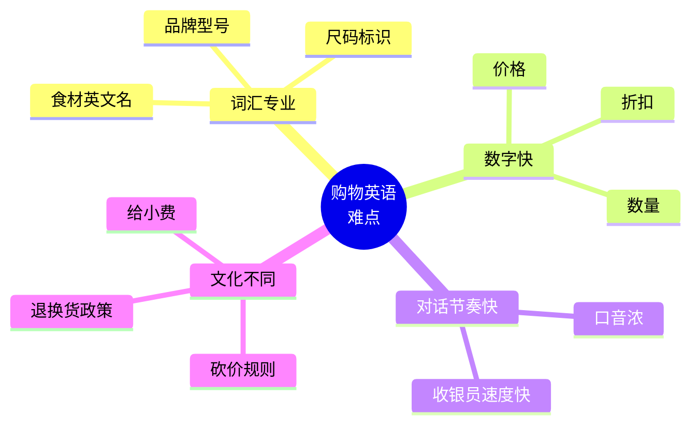
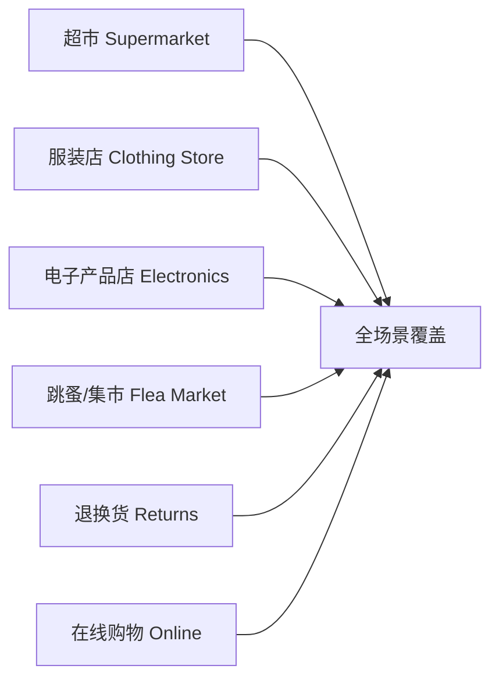

# 购物超市与讨价还价场景

> [!info] 本篇定位
> **购物**是出国生活的**第一个高频场景**——你不能不买东西。
>
> 国外购物时，中国学生最常踩的坑：
>
> - 看不懂商品标签和包装
> - 不会试穿和换尺码
> - 想砍价不知道怎么开口
> - 商品有问题不知道怎么退
> - 在线购物看不懂物流英语
>
> 本篇覆盖 **超市、服装店、电子产品店、跳蚤市场、退换货、在线购物** 6 大购物场景，**350+ 实用词汇** + **80+ 句型** + **15+ 真实对话**。
>
> 读完本篇，你能**毫无障碍地在英语国家购物**。

---

## 1. 本篇导读：购物英语的难点

### 1.1 为什么购物英语容易卡



### 1.2 本篇 6 大场景



---

## 2. 超市购物场景（Supermarket）

### 2.1 超市核心词汇（50 个）

**超市区域**：
```
produce section          (蔬果区)
meat section             (肉类区)
dairy section            (乳制品区)
frozen section           (冷冻区)
bakery                   (烘焙区)
deli                     (熟食区)
seafood                  (海鲜区)
beverage aisle           (饮料区)
snack aisle              (零食区)
canned goods             (罐头区)
toiletries aisle         (洗护用品区)
checkout                 (收银台)
cashier                  (收银员)
self-checkout            (自助结账)
```

**包装与计量**：
```
a bag of                 (一袋)
a box of                 (一盒)
a bottle of              (一瓶)
a can of                 (一罐)
a jar of                 (一罐头瓶)
a pack of                (一包)
a carton of              (一纸盒)
a loaf of bread          (一条面包)
a dozen eggs             (一打鸡蛋)
a pound of               (一磅)
a kilo of                (一公斤)
a half gallon of milk    (半加仑牛奶)
```

**购物用具**：
```
shopping cart            (购物车)
basket                   (篮子)
trolley                  (购物推车，英)
shopping bag             (购物袋)
reusable bag             (环保袋)
plastic bag              (塑料袋)
receipt                  (小票)
coupon                   (优惠券)
```

### 2.2 超市寻物句型（10 个）

```
① Excuse me, where can I find ...?
   Excuse me, where can I find the milk?

② Which aisle is ... in?
   Which aisle is the bread in?

③ Do you have ...?
   Do you have organic eggs?

④ I'm looking for ...
   I'm looking for gluten-free pasta.

⑤ Where's the ... section?

⑥ Is this on sale?
   (这个特价吗？)

⑦ How much is this?

⑧ Is there a bigger size / smaller size?

⑨ Do you have this in stock in the back?
   (库房里有货吗？)

⑩ When does this sell-by date expire?
   (保质期到什么时候？)
```

### 2.3 收银台句型（15 个）

**收银员说**：
```
Did you find everything OK?           (东西都找到了吗？)
Do you have a rewards card?           (有会员卡吗？)
Paper or plastic?                     (纸袋还是塑料袋？——美国超市)
Will that be all?                     (就这些吗？)
That'll be $25.50.                    (一共 25.5 美元。)
How would you like to pay?            (怎么支付？)
Cash or card?
Debit or credit?                      (储蓄卡还是信用卡？)
Would you like the receipt?
Have a great day!
```

**你说**：
```
Yes, I found everything. (Yes, I'm good.)
No, I don't have a card.
I'd like to sign up for one. (我想办一张。)
Plastic, please. / I have my own bag.
Yes, that's all.
Card, please.
Debit.
Yes, please. / No thanks.
Thanks, you too.
```

### 2.4 完整超市对话

```
You：     "Excuse me, where can I find olive oil?"
Staff：   "Aisle 7, on the right side."
You：     "Thanks. Do you have extra virgin?"
Staff：   "Yes, third shelf from the bottom."
You：     "Perfect."

(at checkout)

Cashier： "Hi! Did you find everything OK?"
You：     "Yes, thanks."
Cashier： "Do you have a rewards card?"
You：     "No, I don't."
Cashier： "Would you like to sign up? It's free."
You：     "Sure, why not."
Cashier： "Great, just need your phone number."
You：     "555-1234."
Cashier： "Done. Your total is $42.50."
You：     "I'll pay by card."
Cashier： "Insert or tap. (Receipt with you?)"
You：     "Email it, please."
Cashier： "Have a great day!"
You：     "You too!"
```

---

## 3. 服装店场景（Clothing Store）

### 3.1 服装类别（30 个）

```
上身：
T-shirt                  (T 恤)
shirt                    (衬衫)
blouse                   (女衬衫)
sweater                  (毛衣)
hoodie                   (连帽衫)
cardigan                 (开衫)
jacket                   (夹克)
coat                     (大衣)
blazer                   (西装外套)
tank top                 (背心)

下身：
jeans                    (牛仔裤)
pants / trousers         (裤子)
shorts                   (短裤)
skirt                    (裙子)
leggings                 (打底裤)

连身：
dress                    (连衣裙)
suit                     (西装套装)
jumpsuit                 (连体裤)

内搭：
underwear                (内衣)
bra                      (胸罩)
socks                    (袜子)
tights                   (连裤袜)

其他：
hat                      (帽子)
scarf                    (围巾)
gloves                   (手套)
belt                     (腰带)
shoes                    (鞋子)
sneakers                 (运动鞋)
boots                    (靴子)
sandals                  (凉鞋)
```

### 3.2 颜色与尺码

**颜色**：
```
black 黑      white 白       red 红
blue 蓝       green 绿       yellow 黄
pink 粉       purple 紫      orange 橙
brown 棕      gray/grey 灰   beige 米色
navy 藏青     khaki 卡其     burgundy 酒红
```

**尺码**：
```
XS / Small / Medium / Large / XL / XXL
size 6 / 8 / 10 / 12       (美国女装)
shoe size 7 / 8 / 9 / 10
slim fit 修身             regular fit 标准
loose fit 宽松             oversized 超大
```

**面料**：
```
cotton 棉           wool 羊毛           silk 丝绸
linen 亚麻          polyester 涤纶      leather 皮革
denim 牛仔布        cashmere 羊绒
```

### 3.3 服装店实用句型（20 个）

**询问商品**：

```
① I'm just browsing.
   (我就看看。)

② Do you have this in a different color?

③ Do you have this in a smaller size?
   Do you have this in a medium?

④ Is this on sale?

⑤ What's your return policy?
   (退货政策是怎样的？)

⑥ Do you have any new arrivals?
   (有新品吗？)
```

**试穿**：

```
⑦ Can I try this on?

⑧ Where are the fitting rooms?
   (试衣间在哪？)

⑨ How many items can I take in?
   (能带几件进去？)

⑩ This is too tight.

⑪ This is too loose.

⑫ This doesn't fit.

⑬ It's a bit short / long.

⑭ Do you have a size up / down?
   (有大/小一码的吗？)
```

**决定**：

```
⑮ I'll take it.

⑯ I'll think about it.

⑰ Could you hold this for me?
   (能帮我留一下吗？)

⑱ Can I get a discount?
   (能打折吗？)

⑲ Do you have a student discount?

⑳ It's not quite what I'm looking for.
   (不是我想要的。)
```

### 3.4 完整服装店对话

```
Sales：   "Hi! Welcome in. Are you looking for anything specific?"
You：     "Hi, I'm just browsing for now, thanks."
Sales：   "Sure, let me know if you need anything."

(later)

You：     "Excuse me, do you have this shirt in a medium?"
Sales：   "Let me check. (checks) Yes, here you go. The fitting rooms
          are right over there."
You：     "Thanks."

(in fitting room, comes out)

Sales：   "How does it fit?"
You：     "It's a bit tight in the shoulders. Do you have a large?"
Sales：   "Yes, one moment."

(returns with large)

You：     "Perfect, this fits great. I'll take it. Is it on sale?"
Sales：   "Actually yes, 20% off. The discount will be applied at
          checkout."
You：     "Great. What's your return policy?"
Sales：   "30 days with the receipt and tags attached."
You：     "Got it. I'll take this one."
Sales：   "Anything else?"
You：     "No, that's all. Thanks!"
```

---

## 4. 电子产品场景（Electronics）

### 4.1 电子产品分类（25 个）

```
phone / smartphone       (手机)
laptop                   (笔记本电脑)
desktop computer         (台式机)
tablet                   (平板)
smartwatch               (智能手表)
earbuds                  (无线耳机)
headphones               (头戴式耳机)
speaker                  (音箱)
TV / television          (电视)
camera                   (相机)
charger                  (充电器)
cable                    (数据线)
power bank               (充电宝)
mouse                    (鼠标)
keyboard                 (键盘)
monitor                  (显示器)
printer                  (打印机)
gaming console           (游戏机)
controller               (手柄)
hard drive               (硬盘)
USB drive                (U 盘)
```

### 4.2 参数与功能

```
storage                  (存储)
battery life             (续航)
camera quality           (相机像素)
processor / CPU          (处理器)
RAM / memory             (内存)
screen size              (屏幕尺寸)
resolution               (分辨率)
operating system / OS    (操作系统)
warranty                 (保修)
```

### 4.3 电子产品句型（15 个）

```
① I'm looking for a new laptop.

② What's the difference between this and that one?

③ How long does the battery last?

④ How much storage does it have?

⑤ Is this the latest model?

⑥ When is the new model coming out?
   (新款什么时候出？)

⑦ Does it come with a warranty?

⑧ How long is the warranty?

⑨ Can I see a demo?
   (能演示一下吗？)

⑩ Is this in stock?
   (有现货吗？)

⑪ Can I order it online?

⑫ Do you offer trade-ins?
   (能以旧换新吗？)

⑬ Does this support 5G?

⑭ Is the screen scratch-resistant?

⑮ I want one with a longer battery life.
```

### 4.4 完整电子产品对话

```
You：     "Hi, I'm looking for a new phone."
Sales：   "Sure, what's your budget?"
You：     "Around $800."
Sales：   "OK, in that range we have these three options.
          Are you looking for anything specific?"
You：     "Mainly good camera and long battery life."
Sales：   "Then I'd recommend this one. Great camera, all-day battery."
You：     "How much storage?"
Sales：   "Comes in 128GB and 256GB."
You：     "What's the difference in price?"
Sales：   "$100 more for 256."
You：     "I'll go with 256. Does it come with a charger?"
Sales：   "Just the cable, no adapter."
You：     "OK. What about warranty?"
Sales：   "One year manufacturer's warranty. You can extend it for
          $99 to get two years and accidental damage coverage."
You：     "Hmm, let me think about that. I'll take the phone."
Sales：   "Great. I'll get one from the back."
```

---

## 5. 询问价格与付款（Price & Payment）

### 5.1 询问价格（10 个）

```
① How much is this?

② How much does it cost?

③ What's the price?

④ Is there a discount?

⑤ Is this on sale?

⑥ Do you have any promotions?
   (有促销吗？)

⑦ How much would the total be?

⑧ Could you give me a better price?
   (能给个更好的价吗？)

⑨ What's the price for two?

⑩ Is tax included?
   (含税吗？——美国通常不含税)
```

### 5.2 付款方式（10 个）

```
cash                     (现金)
credit card              (信用卡)
debit card               (储蓄卡)
mobile pay               (手机支付)
Apple Pay / Google Pay   (苹果/谷歌支付)
contactless              (闪付)
check                    (支票，少见)
gift card                (礼品卡)
voucher                  (代金券)
store credit             (店内余额)
```

### 5.3 付款句型（10 个）

```
① I'll pay by card.

② Cash, please.

③ Can I split it between two cards?
   (能拆分两张卡支付吗？)

④ Can I use Apple Pay?

⑤ Is contactless OK?

⑥ Do you accept American Express?

⑦ Could I get a receipt?

⑧ Email me the receipt, please.

⑨ I forgot my card. Can I run home and come back?

⑩ Is there a minimum for card?
   (刷卡有最低消费吗？)
```

---

## 6. 讨价还价（Bargaining）

### 6.1 哪里可以砍价

> [!warning] 美国超市/连锁店不能砍价
>
> **能砍价的场所**：
> - 跳蚤市场（flea market）
> - 集市 / 街边小贩
> - 二手店 / 古董店
> - 房地产
> - 大件商品（汽车、家具）
> - 个体小店（小规模）
>
> **不能砍价**：
> - 超市
> - 连锁服装店
> - 电子产品大店（除非是议价款）
> - 餐厅
>
> 在不能砍价的地方砍价**会被认为没礼貌**。

### 6.2 砍价句型（15 个）

**温和试探**：

```
① Can you give me a better price?

② Is the price negotiable?

③ Can you do anything on the price?

④ Is there any room for discount?

⑤ What's your best price?
   (最低多少？)
```

**直接砍价**：

```
⑥ Can you take $X for it?
   Can you take $50 for it?
   (能 50 美元卖给我吗？)

⑦ How about $X?

⑧ Would you go down to $X?

⑨ I'll give you $X cash right now.
   (现金的话给你 X 元。)

⑩ Final offer: $X.
   (最后出价 X。)
```

**还价技巧**：

```
⑪ It's a bit pricey for me.
   (对我来说有点贵。)

⑫ I saw it cheaper elsewhere.
   (我在别处见到更便宜的。)

⑬ Is that with tax? (Then say it's too much.)

⑭ I'll think about it.
   (我考虑一下。——常常促使对方让步)

⑮ I'll pass for now, thanks.
   (我先看看，谢谢。——准备走人）
```

### 6.3 完整跳蚤市场对话

```
You：    "How much is this old camera?"
Seller： "$80."
You：    "$80? That's a bit much. How about $50?"
Seller： "I can't go that low. How about $70?"
You：    "Hmm. Does it work?"
Seller： "Tested it yesterday. Works perfectly."
You：    "OK, $60 cash, take it or leave it."
Seller： "$65 and it's yours."
You：    "Deal."
Seller： "Cash only, right?"
You：    "Yes, here you go."
Seller： "Great. Want a bag?"
You：    "Thanks!"
```

### 6.4 砍价的礼仪

> [!tip] 砍价 5 大技巧
>
> 1. **先看货**：仔细检查商品再开价
> 2. **报价低于预期 20-30%**：留出还价空间
> 3. **保持微笑**：友好态度更能成功
> 4. **准备走人**：表示不买往往让对方让步
> 5. **现金优势**：现金支付常能砍更多

---

## 7. 退换货（Returns and Exchanges）

### 7.1 退换货词汇

```
return                   (退货)
exchange                 (换货)
refund                   (退款)
store credit             (店内余额)
receipt                  (收据)
tag / price tag          (吊牌)
defective                (有缺陷的)
damaged                  (损坏的)
faulty                   (有问题的)
warranty                 (保修)
return policy            (退货政策)
30-day return            (30 天退货)
final sale               (最终销售，不退不换)
no questions asked       (无理由退换)
```

### 7.2 退换货句型（15 个）

```
① I'd like to return this.

② Can I exchange this for a different size?

③ I'd like a refund.

④ Can I get a refund or just store credit?

⑤ Here's the receipt.

⑥ I bought this yesterday and it's already broken.

⑦ It doesn't work properly.

⑧ It's the wrong size.

⑨ It doesn't fit.

⑩ I changed my mind.
   (我改主意了。)

⑪ I got it as a gift, do I need a receipt?

⑫ How long do refunds take?
   (退款要多久？)

⑬ Can the refund go back to my card?

⑭ Is there a restocking fee?
   (有上架费吗？——某些商品退货收费)

⑮ I'd like to speak to the manager.
   (我想找经理。)
```

### 7.3 完整退货对话

```
You：     "Hi, I'd like to return this."
Staff：   "OK, do you have the receipt?"
You：     "Yes, here it is."
Staff：   "What's the reason for the return?"
You：     "It doesn't fit."
Staff：   "Was it worn?"
You：     "Just tried on at home, never worn outside."
Staff：   "OK. The tags need to be attached."
You：     "Yes, they are."
Staff：   "Great. Do you want a refund or store credit?"
You：     "Refund, please."
Staff：   "It'll go back to the card you used. Should appear in
          3-5 business days."
You：     "Sounds good. Thanks!"
```

### 7.4 退货遭拒怎么办

```
Staff：   "I'm sorry, this item is final sale."
You：     "Oh, I didn't realize. Is there any flexibility?"
Staff：   "Unfortunately not."
You：     "Can I speak to the manager?"
Staff：   "Of course, one moment."

(manager arrives)

You：     "Hi, I bought this yesterday and just realized it doesn't
          work. The receipt says final sale, but I just bought it
          and it's defective."
Manager： "Let me take a look. ... You're right, this is faulty.
          I'll make an exception and process the refund."
You：     "Thank you so much!"
```

---

## 8. 在线购物（Online Shopping）

### 8.1 在线购物词汇（25 个）

```
add to cart              (加入购物车)
checkout                 (结账)
shipping address         (收货地址)
billing address          (账单地址)
shipping fee             (运费)
free shipping            (免运费)
expedited shipping       (加急运送)
standard shipping        (普通运送)
estimated delivery       (预计送达)
tracking number          (运单号)
order confirmation       (订单确认)
out of stock             (缺货)
back in stock            (补货)
pre-order                (预订)
discount code            (折扣码)
promo code               (促销码)
review                   (评价)
rating                   (评分)
return label             (退货标签)
refund processed         (退款已处理)
```

### 8.2 在线购物句型（10 个）

```
① I added it to my cart.

② I just placed the order.

③ The package is on its way.

④ When will it arrive?

⑤ It says "out for delivery."

⑥ I haven't received my order yet.
   (订单还没到。)

⑦ The wrong item was sent.

⑧ I want to cancel my order.

⑨ Where can I track my order?

⑩ I left a review.
```

### 8.3 物流状态英语

```
order placed              (已下单)
processing                (处理中)
shipped                   (已发货)
in transit                (运输中)
out for delivery          (派送中)
delivered                 (已送达)
delayed                   (延误)
returned to sender        (退回发件人)
```

---

## 9. 常见购物词汇大盘点

### 9.1 折扣相关

```
sale 特价
discount 折扣
50% off / half off 半价
buy one, get one free / BOGO 买一送一
clearance 清仓
markdown 降价
member price 会员价
deal 优惠
bargain 划算
```

### 9.2 价格描述

```
expensive / pricey 贵
cheap / inexpensive 便宜
affordable 负担得起
overpriced 价格过高
reasonable 合理
worth it 值得
not worth it 不值
budget-friendly 经济实惠
high-end 高端
low-end 低端
luxury 奢侈
```

### 9.3 表达态度

```
I love this!             (我爱死了！)
This is a steal!         (太划算了！)
What a bargain!          (好划算！)
That's a rip-off.        (太黑了。)
Way overpriced.          (贵得离谱。)
Total waste of money.    (浪费钱。)
```

---

## 10. 文化差异提醒

### 10.1 美国超市的"惊喜"

```
1. 价格不含税
   标 $10 的商品，实际付 $10.85（10% 销售税）
   每个州税率不同。

2. 给小费
   超市不用给小费，但餐厅、出租车、理发店要。

3. 要 receipt
   退货必须有 receipt，所以要保留。

4. 包装袋收费
   有些州（如加州）塑料袋要收费。

5. 自带购物袋
   reusable bag 越来越常见。
```

### 10.2 服装店的差异

```
1. 试穿次数有限
   美国试衣间通常限制每次 6 件。

2. 退换货宽松
   大部分店 30 天无理由退换（带 receipt 和 tag）。

3. 没人跟着你
   不像中国店员一直跟着，美国店员只会问一次"need help?"

4. 黑色星期五
   感恩节后是最大购物节，折扣高达 70%。
```

### 10.3 中美砍价差异

```
中国：菜市场、夜市、个体小店都能砍。
美国：超市、连锁店不能砍；二手、跳蚤、小摊可以砍。

中国：习惯性砍价，砍掉 30-50% 不奇怪。
美国：能砍 10-20% 已经不错。

中国：直接说"便宜点"。
美国：用 "Can you do anything on the price?" 更礼貌。
```

---

## 11. 常见错误大盘点

### 11.1 错误 1：how much 用错

```
❌ How much money?
✅ How much is it?
✅ How much does it cost?
```

### 11.2 错误 2：穿和带不分

```
❌ I'm wearing my shoes. (我戴着鞋——有点怪)
✅ I'm wearing shoes. (我穿着鞋)

✅ I'm wearing a hat / glasses / earrings (帽子/眼镜/耳环用 wear)
```

### 11.3 错误 3：try on 还是 try

```
❌ Can I try the dress?
✅ Can I try on the dress? (穿上试)

try = 尝试
try on = 试穿（衣物）
```

### 11.4 错误 4：discount 用法

```
❌ Can you discount me?
✅ Can you give me a discount?
✅ Is there a discount?
```

### 11.5 错误 5：cash 没有复数

```
❌ I have cashes.
✅ I have cash. (cash 不可数)
✅ I have some cash.
```

### 11.6 错误 6：clothes 没有单数

```
❌ I bought a clothes.
✅ I bought clothes.
✅ I bought a piece of clothing.
```

---

## 12. 练习与输出建议

> [!success] 本篇练习清单
>
> **基础练习**
>
> 1. 用英文写出**今天去超市**的购物清单（至少 20 项）
>
> 2. 用 5 句话描述你**最喜欢的一件衣服**（颜色/尺码/面料/价格/为什么喜欢）
>
> **场景模拟**
>
> 3. 模拟 5 个购物对话：
>    - 超市找东西 + 收银
>    - 服装店试穿
>    - 电子产品店询问参数
>    - 退货
>    - 跳蚤市场砍价
>
> **角色扮演**
>
> 4. 找语伴/AI，**每天进行一次购物对话**练习。
>
> **写作练习**
>
> 5. 写一篇 200 词的英文短文，主题：
>    - "My most regretted purchase"（最后悔的购物）
>    - "The best deal I ever got"（我得过的最好交易）
>
> **长期任务**
>
> 6. 看一段 YouTube 上的购物 vlog，**记录所有购物相关词汇**。
>
> 7. 在网上**用英文订一次东西**（亚马逊或其他），全程英文操作。

---

## 13. 本篇小结

> [!success] 本篇核心要点回顾
>
> **超市**：
> - 区域：produce / dairy / frozen / bakery / deli
> - 包装：a bag of / a box of / a dozen of
> - 收银：Did you find everything? / Cash or card?
>
> **服装店**：
> - 30 个服装类别
> - 颜色 / 尺码 / 面料词汇
> - 试穿：Can I try this on? / It doesn't fit
> - 退换：return / exchange / refund / store credit
>
> **电子产品**：
> - 25 个产品名 + 参数（storage/battery/RAM/warranty）
> - 询问：What's the difference / How long does the battery last
>
> **价格付款**：
> - How much / Is this on sale / Can you give me a discount
> - Cash / Card / Apple Pay / Tax included?
>
> **砍价**：
> - 哪里能砍：跳蚤市场 / 二手店 / 大件
> - 哪里不能：超市 / 连锁店
> - 句型：Can you do anything on the price / Take $X / I'll think about it
>
> **退换货**：
> - 必备：receipt + tags + 30-day window
> - 句型：I'd like to return / It doesn't fit / Refund or store credit
>
> **在线购物**：
> - 物流状态：placed / shipped / in transit / delivered
> - 折扣码 / 跟踪号 / 退货标签

### 13.1 下一篇预告

> [!info] 下一篇：04.餐饮点餐外卖与聚餐场景
>
> 下一篇是 **06 分类的收官篇**：
>
> - **餐厅点餐**：菜单、点单、特殊要求
> - **快餐店**：套餐、To go vs For here
> - **外卖**：在线下单、配送
> - **咖啡店**：咖啡饮品、定制
> - **酒吧**：点酒、调酒
> - **结账与小费**：复杂的小费文化
>
> 这一篇让你**在国外吃喝毫无障碍**，是非常实用的一篇。
