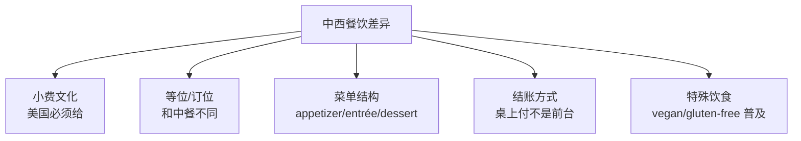

# 餐饮点餐外卖与聚餐场景

> [!info] 本篇定位
> 这是 **06.日常生活场景实战** 分类的**收官篇**，也是日常生活中**最高频**的场景之一。
>
> 在国外**吃一顿饭**会涉及到：
>
> - 进店与服务员打招呼
> - 看菜单（看得懂吗？）
> - 点餐（怎么说"少辣"、"不放葱"？）
> - 用餐中（叫服务员加水？）
> - 结账（怎么给小费？）
>
> 中国学生**在餐厅最容易出洋相**——因为外国餐厅文化和中国差别太大。
>
> 本篇覆盖 **8 大餐饮场景**，**400+ 词汇** + **80+ 句型** + **15+ 真实对话**，让你**在国外吃饭从容不迫**。

---

## 1. 本篇导读：餐饮英语的特别难点

### 1.1 中西餐饮 5 大差异



### 1.2 本篇 8 大场景

```
1. 餐厅点餐 (Sit-down restaurant)
2. 快餐店 (Fast food)
3. 咖啡店 (Café)
4. 外卖订餐 (Delivery / Takeout)
5. 酒吧点酒 (Bar / Pub)
6. 结账与小费 (Bill & tipping)
7. 聚餐分享 (Group dining)
8. 投诉与赞美 (Complaints & compliments)
```

---

## 2. 餐厅点餐场景（Sit-down Restaurant）

### 2.1 进店与等位

**进店时**服务员/迎宾会问：

```
Hi, welcome! Two for dinner?         (你好！两位用餐？)
How many in your party?              (几位？)
Do you have a reservation?           (订位了吗？)
Where would you like to sit?         (想坐哪？)
Inside or outside?                   (室内还是室外？)
Booth or table?                      (卡座还是桌？)
```

**你的回应**：

```
Yes, two please.
Three for dinner.
Yes, under [name] for 7 PM.
A booth, please.
By the window if possible.
We'd love to sit outside.
We're a party of 4.            (4 人聚会)
```

**没订位时的等位**：

```
Hostess：  "How long is the wait?"  → 你问等多久
Hostess：  "About 30 minutes for a table."
You：      "Can we put our name down?"
            (能登记一下吗？)
Hostess：  "Sure, name?"
You：      "John, party of 2."
Hostess：  "We'll text you when ready."
```

### 2.2 菜单理解（必备 30 词）

**菜单结构**：

```
appetizer / starter      (前菜)
soup                     (汤)
salad                    (沙拉)
entrée / main course     (主菜)
side dish / sides        (配菜)
dessert                  (甜点)
beverage                 (饮料)
wine list                (酒单)
specials                 (特色菜/今日特餐)
chef's recommendation    (主厨推荐)
```

**烹饪方式**：

```
grilled         (烤)            roasted     (烤箱烤)
fried           (炸)            sautéed     (煎/炒)
steamed         (蒸)            poached     (水煮)
braised         (慢炖)          smoked      (烟熏)
raw             (生的)          rare/medium/well-done (牛排生熟)
```

**饮食标识**：

```
vegetarian (V)              (素食)
vegan                       (纯素)
gluten-free (GF)            (无麸质)
dairy-free                  (无乳制品)
nut-free                    (无坚果)
spicy / mild                (辣/不辣)
contains nuts               (含坚果)
keto                        (生酮饮食)
organic                     (有机)
locally sourced             (本地食材)
```

### 2.3 点餐句型（20 个）

**服务员问**：

```
① Are you ready to order?
② Can I take your order?
③ What would you like to start with?       (前菜要什么？)
④ How would you like your steak?           (牛排几分熟？)
⑤ Anything to drink?
⑥ Would you like an appetizer?
⑦ Are you all set?
⑧ Anything else?
```

**你的回应**：

```
⑨ I'll have the ... please.
   I'll have the steak, please.

⑩ Could I get the ...?
   Could I get the salmon?

⑪ I'd like to order the ...

⑫ I'll start with the ... and then have the ...
   I'll start with the soup and then have the salad.

⑬ What do you recommend?
   (你推荐什么？)

⑭ What's good here?

⑮ What's the soup of the day?

⑯ Could I see the menu / wine list again?

⑰ I'll have a glass of red wine.

⑱ Just water for me, please.
   Tap water is fine.       (普通自来水就行——免费)
   Sparkling water           (气泡水)
   Still water               (普通水)

⑲ I need a few more minutes.

⑳ Could you give us a moment?
```

### 2.4 特殊饮食要求（10 个）

```
① I'm allergic to nuts / shellfish / dairy.
   (我对坚果/贝类/乳制品过敏。)

② I'm vegetarian / vegan.

③ I don't eat pork / beef.

④ Could you make it without ...?
   Could you make it without onions?

⑤ Can I substitute fries for salad?
   (能把薯条换成沙拉吗？)

⑥ Is this dish spicy?

⑦ Can I have it less spicy?

⑧ No salt, please.

⑨ On the side, please.
   (酱料/dressing 单独装。)

⑩ Could I have extra cheese?
   (能多加点奶酪吗？)
```

### 2.5 用餐过程中（10 个）

```
① Can we get more water, please?

② Could I have another fork?

③ This is delicious!

④ The food is amazing.

⑤ Could you take this away?

⑥ Could I have a to-go box?
   (能给我个打包盒吗？——剩饭打包)

⑦ Could you reheat this?

⑧ This is overcooked.

⑨ I think there's something wrong with my dish.

⑩ Could I have the check, please?
```

### 2.6 完整餐厅对话

```
Hostess：  "Hi, welcome! How many?"
You：      "Two, please."
Hostess：  "Right this way. Booth or table?"
You：      "A booth would be great."
Hostess：  "Here's your menu. Your server will be right with you."

(server arrives)

Server：   "Hi, welcome! Can I start you off with something to drink?"
You：      "I'll have a sparkling water. And what white wines do
            you have by the glass?"
Server：   "We have Chardonnay, Sauvignon Blanc, and Pinot Grigio."
You：      "I'll go with the Sauvignon Blanc."
Server：   "And for you, sir?"
Friend：   "Just water for me, thanks."
Server：   "Sure. Are you ready to order, or do you need a few
            more minutes?"
You：      "We need a few more minutes."

(later)

Server：   "Are you all set?"
You：      "Yes, I'll have the grilled salmon, with the salad on
            the side."
Server：   "How would you like the salad dressing?"
You：      "On the side, please."
Friend：   "I'll have the steak, medium rare, with mashed potatoes."
Server：   "Excellent choice. Anything else?"
You：      "That'll be all for now."

(during meal)

Server：   "How is everything?"
You：      "It's wonderful, thank you."

(after meal)

Server：   "Did you save room for dessert?"
You：      "I think we're full. Could we have the check, please?"
Server：   "Of course, I'll bring it right over."
```

---

## 3. 快餐店场景（Fast Food）

### 3.1 快餐核心词汇

```
combo / meal             (套餐)
small / medium / large   (小/中/大)
to go                    (打包)
for here                 (堂食)
drive-thru               (得来速)
fries                    (薯条)
soda                     (汽水)
burger                   (汉堡)
nuggets                  (鸡块)
sauce                    (酱料)
```

### 3.2 快餐店句型（10 个）

**店员问**：
```
For here or to go?              (堂食还是打包？)
Will that be all?
Anything else?
Would you like fries with that?
Small, medium, or large?
```

**你说**：
```
① I'll have a #2 combo.
   (我要 2 号套餐。)

② Make it a large, please.

③ No onions on the burger.

④ Can I add bacon?

⑤ I'll have a Coke / Sprite / Diet Coke.
```

### 3.3 快餐对话

```
Cashier：  "Hi, what can I get for you?"
You：      "I'll have a #3 combo, please."
Cashier：  "Cheeseburger combo with fries and a drink, right?"
You：      "Yes, but no pickles on the burger."
Cashier：  "Sure. What size?"
You：      "Medium."
Cashier：  "And what to drink?"
You：      "A Coke, please."
Cashier：  "For here or to go?"
You：      "To go."
Cashier：  "That'll be $8.50."
You：      "Card, please."
Cashier：  "Insert or tap. ... Receipt?"
You：      "No, thanks."
Cashier：  "Order will be ready in 5 minutes at the counter."
```

---

## 4. 咖啡店场景（Café）

### 4.1 咖啡饮品词汇（25 个）

```
espresso              (浓缩)
americano             (美式)
latte                 (拿铁)
cappuccino            (卡布奇诺)
macchiato             (玛奇朵)
mocha                 (摩卡)
flat white            (白咖啡)
drip coffee           (滴滤咖啡)
iced coffee           (冰咖啡)
cold brew             (冷萃)
frappuccino           (星冰乐)

茶类：
green tea             (绿茶)
black tea             (红茶)
chai latte            (印度奶茶)
matcha latte          (抹茶拿铁)
herbal tea            (花草茶)

非咖啡：
hot chocolate         (热可可)
smoothie              (奶昔)
juice                 (果汁)
milk tea              (奶茶)
bubble tea            (珍珠奶茶)
```

### 4.2 咖啡定制（15 个）

```
sizes：
short / tall / grande / venti     (星巴克尺寸)
small / medium / large

milk options：
whole milk            (全脂)
skim milk             (脱脂)
2% milk               (低脂)
oat milk              (燕麦奶)
almond milk           (杏仁奶)
soy milk              (豆奶)

定制：
extra shot            (多一份浓缩)
decaf                 (无咖啡因)
half-caf              (半咖啡因)
sugar-free            (无糖)
hot / iced            (热的/冰的)
extra hot             (特热)
no foam               (不加泡沫)
extra foam            (多泡沫)
light ice             (少冰)
no ice                (不加冰)
```

### 4.3 咖啡店句型（10 个）

```
① I'll have a tall latte, please.

② Can I get a grande iced americano?

③ With oat milk, please.

④ Make it a venti.

⑤ Could you make it less sweet?

⑥ Half the syrup, please.

⑦ Extra hot, please.

⑧ One sugar, please.

⑨ Could I have it with whipped cream?

⑩ For here / To go.
```

### 4.4 完整咖啡店对话

```
Barista：  "Hi! What can I get started for you?"
You：      "I'll have a grande iced latte, please."
Barista：  "Anything to flavor that?"
You：      "Yes, vanilla, but only one pump."
Barista：  "Got it, one pump of vanilla. Any milk preference?"
You：      "Oat milk, please."
Barista：  "Sure. Anything to eat?"
You：      "Yes, a blueberry muffin."
Barista：  "Heated up?"
You：      "Yes, please."
Barista：  "Your name for the cup?"
You：      "John."
Barista：  "Total is $7.45."
You：      "Card."
Barista：  "Tap or insert. Tip percentage on the screen?"
You：      "I'll do 15%."
Barista：  "Thanks! We'll call your name when it's ready."
```

---

## 5. 外卖订餐场景（Delivery / Takeout）

### 5.1 外卖词汇

```
delivery                  (外卖配送)
takeout / takeaway        (外带)
pickup                    (自取)
delivery fee              (配送费)
service fee               (服务费)
tip                       (小费)
estimated time            (预计时间)
order summary             (订单摘要)
add-ons                   (加配)
contact-free delivery     (无接触配送)
```

### 5.2 外卖电话对话

```
You：      "Hi, I'd like to order delivery, please."
Restaurant："What would you like?"
You：      "One large pepperoni pizza and a 2-liter Coke."
Restaurant："Any extras?"
You：      "Could I add extra cheese?"
Restaurant："Sure, that's $2 more. Anything else?"
You：      "That's it. How long for delivery?"
Restaurant："About 30-40 minutes."
You：      "OK. Address is 123 Main Street, apartment 5B."
Restaurant："Phone number?"
You：      "555-1234."
Restaurant："Total is $25.50. Cash or card?"
You：      "Card. (gives card info)"
Restaurant："Confirmed. Driver will call when arriving."
```

### 5.3 外卖 App 句型（10 个）

```
① I placed an order.

② My order is taking too long.

③ I want to cancel my order.

④ Where's my driver?

⑤ The driver can't find my address.

⑥ My order is missing items.

⑦ The food arrived cold.

⑧ Wrong order delivered.

⑨ I'd like a refund.

⑩ Can I tip after delivery?
```

---

## 6. 酒吧场景（Bar / Pub）

### 6.1 酒类词汇（20 个）

```
beer                     (啤酒)
draft beer               (生啤)
bottled beer             (瓶装啤酒)
wine                     (葡萄酒)
red wine                 (红酒)
white wine               (白葡萄酒)
rosé                     (桃红酒)
champagne                (香槟)
sparkling wine           (起泡酒)
cocktail                 (鸡尾酒)
shot                     (一小杯烈酒)
whiskey                  (威士忌)
vodka                    (伏特加)
gin                      (金酒)
rum                      (朗姆)
tequila                  (龙舌兰)
mojito                   (莫吉托)
margarita                (玛格丽特)
bourbon                  (波本威士忌)
on the rocks             (加冰块)
neat / straight up       (纯饮)
```

### 6.2 酒吧句型（10 个）

```
① I'll have a beer.

② What do you have on tap?
   (生啤都有什么？)

③ A glass of red wine, please.

④ Could I see the cocktail menu?

⑤ I'll have a vodka tonic.

⑥ Make it a double.
   (双份。)

⑦ On the rocks, please.

⑧ Could you make it less sweet?

⑨ Another round, please.
   (再来一轮。)

⑩ Close out my tab, please.
   (结账。——酒吧术语)
```

### 6.3 酒吧对话

```
Bartender：  "Hi! What can I get you?"
You：        "What IPAs do you have on tap?"
Bartender：  "We've got Hazy IPA, Citra IPA, and a West Coast IPA."
You：        "I'll try the Hazy."
Bartender：  "Pint?"
You：        "Yes, please."
Bartender：  "Coming up. (pours) That'll be $8."
You：        "Want to start a tab. Here's my card."
Bartender：  "Sure. (later) Another?"
You：        "Yes, same. And let me get an order of nachos."
Bartender：  "Got it."

(later)

You：        "Could I close out, please?"
Bartender：  "Sure, that'll be $32. Want to tip on the card?"
You：        "Yes, $6 tip."
Bartender：  "Thanks! Have a great night."
```

---

## 7. 结账与小费文化（Bill & Tipping）

### 7.1 结账句型（10 个）

```
① Could we have the check, please?
   (能给我们账单吗？)

② Could I have the bill?
   (英式：bill = check)

③ Can we get separate checks?
   (能分开结账吗？)

④ It's all on one bill.
   (一起算。)

⑤ This is on me.
   (我请客。)

⑥ Let's split it.
   (我们 AA。)

⑦ I'll get this round.
   (这一轮我来。)

⑧ Could you charge it to room 5B?
   (酒店：算到 5B 房间。)

⑨ Is service charge included?
   (含服务费吗？)

⑩ Keep the change.
   (零钱不用找了。)
```

### 7.2 美国小费文化详解

> [!warning] 美国小费 = 强制（不给会被认为粗鲁）

**小费比例**：

```
餐厅服务员：     15-20% (普通) / 25%+ (优秀)
酒吧服务员：     $1-2 per drink
外卖配送：       10-15% / $3-5
打车 (Uber)：    10-20%
理发：          15-20%
酒店行李员：    $2-5 per bag
酒店清洁：      $2-5 per night
导游：          视服务
按摩：          15-20%

不需要小费：
快餐店、自助点单、收银员
```

### 7.3 怎么计算小费

**简单方法**：

```
总账单 $50
小费 15%：$50 × 0.15 = $7.50

简化算法（美国常用）：
1. 看消费税（约 8-10%）
2. 小费 = 消费税的 2 倍

例：账单 $50，税 $4 → 小费 $8 (16%)
```

**信用卡支付小费**：

```
账单上有 3 行：
Subtotal: $50.00
Tip: ____      ← 你写小费金额（如 $10）
Total: ____    ← 你写总额（$60）
Signature: ____ ← 签名
```

**移动支付小费（如 iPad 屏幕）**：

```
屏幕显示：15% / 18% / 20% / Custom
直接选一个比例。
```

### 7.4 小费句型（10 个）

```
① Service was great. Adding 20%.

② I'll add 15% on the card.

③ Here's $5 for tip in cash.

④ Tip's on the table.

⑤ Was the tip included in the bill?

⑥ Could you add the tip to the check?

⑦ I never know how much to tip.
   (我从不知道给多少小费。)

⑧ Is 18% enough?

⑨ Service was poor, I'm tipping 10%.

⑩ Can you ring me up with no tip option?
```

---

## 8. 聚餐与分享（Group Dining）

### 8.1 聚餐词汇

```
group dining            (聚餐)
share plates            (分享菜)
family style            (中式合餐)
appetizer for the table (大家分享的前菜)
split the bill          (AA 制)
treat someone           (请客)
my treat                (我请客)
on me                   (我来)
```

### 8.2 聚餐句型（15 个）

```
① Let's order family style.
   (我们一起点几个菜分享。)

② We'll share.

③ One for the table.

④ Should we share an appetizer?

⑤ Why don't we get a few different things and try them all?

⑥ I'm going to have the steak.

⑦ Anything you don't eat?
   (有忌口吗？)

⑧ Pick anything you want.

⑨ My treat tonight!

⑩ This one's on me.

⑪ Let's split it down the middle.
   (平摊。)

⑫ Can we split this evenly across all cards?
   (我们均分到所有卡上吧。)

⑬ I had less, so let me pay a bit less.

⑭ Let's Venmo each other.
   (用 Venmo 转账。)

⑮ I'll cover yours, you got me last time.
   (我请你，你上次请的我。)
```

### 8.3 聚餐对话

```
Tom：    "Should we share some appetizers?"
Mary：   "Yes! Let's get the calamari and the bruschetta."
Tom：    "Sounds good. What about mains?"
Mary：   "I'm going to get the salmon."
Tom：    "I'll get the steak. Want to share fries?"
Mary：   "Yes, get the truffle fries for the table."

(later)

Server：  "Together or separate checks?"
Tom：    "Separate, please."
Server：  "Sure. (brings checks) Yours is $35, yours is $42."
Tom：    "Hey Mary, since you had wine and I didn't, let me give
         you $5 for my appetizer share."
Mary：   "Oh, perfect, that works."
```

---

## 9. 抱怨与赞美（Complaints & Compliments）

### 9.1 投诉句型（10 个）

```
① Excuse me, this is overcooked.

② This isn't what I ordered.

③ I asked for no onions.

④ The food is cold.

⑤ My order is taking too long.

⑥ Could you take this back?

⑦ Could you make me a new one?

⑧ I'd like to speak to the manager.

⑨ This is unacceptable.

⑩ I want a refund.
```

### 9.2 赞美句型（10 个）

```
① The food is amazing!

② This is the best [dish] I've ever had.

③ My compliments to the chef!
   (向厨师致敬！)

④ Everything was perfect.

⑤ The service was excellent.

⑥ I'll definitely come back.

⑦ Worth every penny.
   (物超所值。)

⑧ I'm impressed.

⑨ You guys did a great job.

⑩ I'll recommend this place to friends.
```

---

## 10. 中西餐饮文化差异

### 10.1 进店差异

```
中国：直接进店找位
美国：等迎宾安排
```

### 10.2 服务员差异

```
中国：呼叫式（"服务员！"）
美国：服务员会主动询问，**不要呼叫**
     如果需要服务员，举手或微微点头
```

### 10.3 上菜顺序

```
中餐：所有菜一起上
西餐：appetizer → entrée → dessert（一道一道）
```

### 10.4 分享文化

```
中国：所有菜共享
美国：each orders own meal（虽然现在 share 越来越普遍）
```

### 10.5 水

```
中国：不主动给水
美国：服务员会自动倒水（free），可以续杯
     冷水 = ice water (常默认有冰)
```

### 10.6 结账

```
中国：去前台结账
美国：服务员把账单送到桌上结账
```

### 10.7 小费

```
中国：不用给小费
美国：必须给（15-20%）
```

### 10.8 打包

```
中国：打包正常
美国：打包正常，但少叫"剩菜打包"显得不够 fancy
     更地道：Could I get a to-go box?
```

---

## 11. 中餐英文菜单（必备）

### 11.1 中餐分类

```
appetizer / dim sum     (前菜/点心)
soup                    (汤)
main course / entrée    (主菜)
rice / noodles          (主食)
vegetable               (蔬菜)
seafood                 (海鲜)
chicken / beef / pork   (肉类)
dessert                 (甜点)
```

### 11.2 经典中餐英文名

```
Kung Pao Chicken           (宫保鸡丁)
Mapo Tofu                  (麻婆豆腐)
Sweet and Sour Pork        (糖醋里脊)
Hot and Sour Soup          (酸辣汤)
Beef with Broccoli         (西兰花牛肉)
Fried Rice                 (炒饭)
Lo Mein / Chow Mein        (拌面/炒面)
Dumplings                  (饺子)
Spring Rolls               (春卷)
Wonton Soup                (馄饨汤)
Peking Duck                (北京烤鸭)
General Tso's Chicken      (左宗棠鸡——美式中餐)
Hot Pot                    (火锅)
Dim Sum                    (点心)
Bao / Steamed Bun          (包子)
```

### 11.3 描述中餐特点

```
spicy 辣            mild 不辣
authentic 地道       Westernized 美式中餐
homestyle 家常       fusion 融合菜
```

---

## 12. 常见错误大盘点

### 12.1 错误 1：bill vs check

```
英国：can I have the bill?
美国：can I have the check?

中国学生学的 "bill" 在美国餐厅说显得"很英式"，但都能听懂。
```

### 12.2 错误 2：waitress / waiter

```
旧称：waitress (女) / waiter (男)
新称：server (中性)

现代英语越来越用 server。
```

### 12.3 错误 3："Give me ..."

```
❌ Give me a burger.
✅ I'll have a burger.
✅ Could I get a burger?
```

### 12.4 错误 4：To go vs For here

```
快餐：For here or to go? (堂食还是打包？)
餐厅：Could I get a to-go box?

❌ Take away (英式，美国少用)
✅ To go (美式)
```

### 12.5 错误 5：忘记给小费

```
在美国忘记小费 = 极度失礼。
即使服务一般，也要给至少 15%。
服务太差才给 10%。
```

### 12.6 错误 6：直呼服务员

```
❌ Waiter! Waiter! (大声呼叫，被认为粗鲁)
✅ 举手 / 眼神接触 / 微笑示意
✅ "Excuse me" (服务员经过时)
```

### 12.7 错误 7：spicy 程度不会说

```
not spicy / mild / medium / spicy / very spicy
                                   ↑
                                超过这个，西方人多承受不住

如果想很辣：
"Make it as spicy as you can!" (加辣到极致)
"I love spicy food."
```

---

## 13. 练习与输出建议

> [!success] 本篇练习清单
>
> **基础练习**
>
> 1. 写下你**最喜欢的 5 道菜**的英文名（中餐+西餐）
>
> 2. 列出**10 种饮食限制**的英文（vegetarian / gluten-free 等）
>
> **场景模拟**
>
> 3. 模拟 5 个完整餐饮对话：
>    - 在高档西餐厅完整一餐
>    - 麦当劳点套餐
>    - 星巴克点拿铁
>    - 电话订外卖
>    - 酒吧点酒
>
> 4. 模拟 3 个特殊情境：
>    - 菜出错了
>    - 食物太冷
>    - 朋友请客你想 AA
>
> **写作练习**
>
> 5. 写一篇 200 词的英文短文：
>    - "My favorite restaurant"
>    - "How to give a perfect tip"
>    - "Best meal I ever had"
>
> **长期任务**
>
> 6. 看一段美剧中的餐厅场景，**抄录所有句型**。
>
> 7. 下一次外出吃饭，**用英文在脑中模拟整个流程**：
>    - 进店、看菜单、点餐、用餐、结账、小费

---

## 14. 本篇小结

> [!success] 本篇核心要点回顾
>
> **餐厅点餐**：
> - 进店：How many in your party / Booth or table
> - 菜单：appetizer / entrée / dessert / sides
> - 点餐：I'll have / Could I get / What do you recommend
> - 用餐：Could we get more water / Could I have a to-go box
>
> **快餐**：
> - For here or to go / Combo / Drive-thru
>
> **咖啡店**：
> - Sizes (tall/grande/venti)
> - Milk options (whole/skim/oat/almond)
> - Customizations (extra shot/decaf/sugar-free)
>
> **外卖**：
> - delivery / takeout / pickup
> - tracking / driver / refund
>
> **酒吧**：
> - on tap / cocktail / on the rocks
> - tab / round
>
> **结账**：
> - Could we have the check / Split / On me
> - Tip 15-20% (美国必须给)
>
> **聚餐**：
> - Family style / Share / My treat / Venmo each other
>
> **文化差异**：
> - 美国：等迎宾、不呼服务员、必须给小费
> - 中美上菜顺序、分享、结账方式都不同

### 14.1 06 分类收官

恭喜完成 **06.日常生活场景实战** 分类全部 4 篇：

```
✅ 01.问候寒暄与自我介绍
✅ 02.家庭家务与日常起居
✅ 03.购物超市与讨价还价
✅ 04.餐饮点餐外卖与聚餐
```

**现在你已经掌握**：
- 在国外**社交开场**（问候、介绍、Small Talk）
- 用英文**描述完整的一天**（家庭生活）
- 在国外**毫无障碍购物**（超市/服装/电子/退换/砍价）
- 在国外**优雅地吃饭**（餐厅/咖啡/酒吧/小费）

**这 4 个场景覆盖了 80% 的日常英语需求**。

### 14.2 下一分类预告

> [!info] 下一分类：07.社交交际场景实战
>
> 接下来 4 篇进入**社交场景**：
>
> - **07.01** 交友聚会与闲聊场景
> - **07.02** 电话短信与在线沟通场景
> - **07.03** 约会恋爱与人际关系场景
> - **07.04** 邀请庆祝与节日祝福场景
>
> **下一篇**：交友聚会与闲聊——让你**在派对上不再尴尬**。
