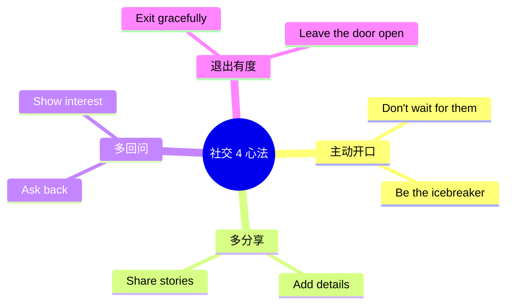

# 交友聚会与闲聊场景

> [!info] 本篇定位
> 欢迎进入 **07.社交交际场景实战** 分类！
>
> 这一篇讲**英语社交最考验功力**的场景：**派对、聚会、Networking**。
>
> 中国学生**最怕的英语场景**就是聚会——你不能像在餐厅一样按部就班点餐，**必须主动找话题、加入对话、保持互动**。
>
> 一个**国外读书的中国学生**最常见的尴尬：
>
> - 派对上一个人靠着墙
> - 别人在聊天你不知道怎么加入
> - 聊几句不知道接什么
> - 想离开不知道怎么告别
>
> 本篇给你一套**完整的社交工具箱**——从**进入聚会、加入对话、找话题、加联系方式、优雅离开**全流程。

---

## 1. 本篇导读：社交英语的核心心法

### 1.1 一个尴尬场景

在国外朋友家的派对：

```
你：    Hi.
对方：  Hi! How are you?
你：    Fine, thanks. (沉默)
对方：  ... So, who do you know here?
你：    John.
对方：  Oh nice. (沉默)
你：    Yeah. (沉默)
对方：  ... Well, nice meeting you. (走开了)
```

**问题**：你只回答**最少的信息**，没有**回问对方**，没有**展开话题**。

### 1.2 流畅的社交场景

```
你：    Hi! Are you a friend of John's?
对方：  Yeah, we work together. How about you?
你：    Same, actually. Different department, but we always grab
        lunch together. I'm Sarah by the way.
对方：  Mike, nice to meet you! What department are you in?
你：    Marketing. You?
对方：  Engineering. So you're the one who plans all the cool events?
你：    Ha! Yeah, that's me. So how long have you been at the company?
```

**关键**：每次回答**都加点信息**，并**回问对方**。这就是 social ping-pong（社交乒乓球）的艺术。

### 1.3 社交英语 4 大心法



---

## 2. 进入派对（Arriving at a Party）

### 2.1 到达时的常用句型（10 个）

```
① Hi! Thanks for having me!
   (谢谢邀请。)

② Sorry I'm late, traffic was crazy.

③ The party is great so far!

④ Where's the host?

⑤ Where can I put my coat / bag?

⑥ Where's the bathroom?

⑦ Help yourself to drinks?
   (饮料自取吗？)

⑧ I brought a bottle of wine.
   (我带了瓶酒。)

⑨ Can I help with anything?

⑩ Should I take my shoes off?
   (要脱鞋吗？)
```

### 2.2 主人的招呼

```
"Welcome! Glad you made it!"
"Come on in, make yourself at home."
"Drinks are in the kitchen, food on the table."
"Let me introduce you to some folks."
"Help yourself to anything."
```

### 2.3 带礼物的礼仪

**通常带什么**：
```
- A bottle of wine                (一瓶酒)
- A six-pack of beer              (六瓶啤酒)
- Flowers                         (鲜花)
- A small dessert                 (小蛋糕)
- A box of chocolates             (巧克力)
```

**送出礼物的句型**：
```
"I brought a bottle of wine."
"Hope you like red."
"This is for you."
"Just a little something."
```

---

## 3. 加入对话（Joining a Conversation）

### 3.1 如何加入正在进行的对话

**派对上看到 2-3 个人在聊天，怎么加入**？

**方法 1：站在边上听几秒，然后切入**

```
"Hey, mind if I join you guys?"
"Sorry to interrupt—I overheard you talking about [话题].
 I'm really interested in that too."
```

**方法 2：找熟人引荐**

```
你 → 朋友：    "Hey, who's that you're talking to?"
朋友 → 介绍：  "Oh! Mike, this is John. John, Mike."
```

**方法 3：从食物/饮料入手**

```
"Excuse me, do you know what's in this dip? It's amazing!"
"Have you tried the wine? It's really good."
```

### 3.2 加入后的过渡（5 个）

```
① So, how do you guys know each other?
   (你们怎么认识的？)

② What were you guys talking about?

③ I love this song, what is it?

④ How's everyone enjoying the party?

⑤ This place is amazing, right?
```

### 3.3 退出对话（5 个）

如果对话不投缘，**优雅退出**：

```
① Excuse me, I need to grab another drink.

② I'm going to find the bathroom.

③ I see my friend over there, let me say hi.

④ I'll let you guys catch up.

⑤ It was nice talking to you, I'll catch you later.
```

---

## 4. 闲聊话题（Small Talk Topics）

### 4.1 派对必备话题

**话题 1：你怎么认识主人**（最安全）

```
"How do you know [host]?"
"Are you a friend of [host]'s?"
"How long have you known [host]?"
"How did you two meet?"
```

**话题 2：工作**

```
"What do you do?"
"Where do you work?"
"How long have you been doing that?"
"Do you like your job?"
```

**话题 3：兴趣爱好**

```
"What do you do for fun?"
"Got any hobbies?"
"What are you into these days?"
```

**话题 4：周末/最近**

```
"Doing anything fun this weekend?"
"How's your week been?"
"Have you been to any good restaurants lately?"
"Watching anything good on Netflix?"
```

**话题 5：旅行**

```
"Have you traveled anywhere recently?"
"Any vacation plans?"
"Where are you from originally?"
"Have you been to [city] before?"
```

### 4.2 兴趣爱好分享（20 个）

**运动类**：
```
I play [tennis / basketball / soccer].
I'm into [yoga / crossfit / climbing].
I'm a runner.
I love hiking.
I just started learning [tennis].
```

**艺术类**：
```
I love photography.
I play the guitar.
I'm learning [piano].
I love going to art museums.
I write [poetry / a blog].
```

**学习类**：
```
I love reading.
I'm learning [Spanish / French].
I take online courses on [topic].
I'm reading [book name] right now.
```

**娱乐类**：
```
I'm a big movie buff.            (电影迷)
I love cooking.
I'm into video games.
I love board games.
I'm obsessed with [TV show].
```

### 4.3 表达"非常喜欢"的程度

```
I like it.                (一般)
I really like it.         (相当)
I love it.                (爱)
I'm passionate about it.  (热衷)
I'm obsessed with it.     (痴迷)
I'm a huge fan.           (大粉丝)
I can't get enough of it. (沉迷)
```

### 4.4 找到共同话题（Common Ground）

**关键句型**：

```
① Oh, me too!
② Same here!
③ Really? I love that too!
④ No way! I just [did the same thing]!
⑤ We have something in common.
⑥ I knew we'd hit it off.
   (我就知道我们能聊得来。)
⑦ What a coincidence!
⑧ Small world!
⑨ I've been wanting to try that.
⑩ I can totally relate.
   (我完全理解。)
```

**当发现共同点时**：

```
A: "I love hiking."
B: "Oh me too! Have you done [trail name]?"
A: "Yes! Last summer."
B: "Small world! I went there too. What did you think?"
```

---

## 5. 完整聚会对话场景

### 5.1 场景 1：朋友家派对

```
You：     "Hey John, thanks for having me!"
Host：    "Hey! So glad you came. Drinks are in the kitchen,
          food on the table. Help yourself."
You：     "Awesome. I brought you some wine."
Host：    "Oh, you didn't have to! Thanks!"

(in the kitchen)

You：     "Hi! I don't think we've met. I'm Sarah."
Mike：    "Hi Sarah, I'm Mike. How do you know John?"
You：     "We work together. You?"
Mike：    "He's my college roommate."
You：     "Oh nice! What did you guys study?"
Mike：    "Computer Science. We were both terrible at it."
You：     "Ha! He turned out OK."
Mike：    "Yeah, he's doing better than I am."
You：     "What do you do now?"
Mike：    "I'm a teacher. Middle school math."
You：     "Wow, that's brave! Middle schoolers are tough."
Mike：    "Tell me about it. How about you?"
You：     "I'm in marketing. Way easier than dealing with teenagers."
Mike：    "Ha! Probably."

(later)

You：     "Hey Mike, I'm gonna grab some food. Want to come?"
Mike：    "Sure!"
```

### 5.2 场景 2：Networking Event

```
You：     "Hi! Mind if I join?"
Person：  "Not at all. I'm Lisa."
You：     "I'm John. So what brings you here?"
Lisa：    "I'm in tech consulting. You?"
You：     "Product management at a fintech startup."
Lisa：    "Oh, fintech is hot right now. Which company?"
You：     "We're called PayFlow. Pretty small, just 50 people."
Lisa：    "I'll have to look you up. Got a card?"
You：     "Yeah, here. Or we can connect on LinkedIn?"
Lisa：    "Even better. (gets phone) What's your name?"
You：     "John Smith. PayFlow Product."
Lisa：    "Found you. Sending request now."
You：     "Got it. Let's catch up sometime over coffee."
Lisa：    "I'd love that. Send me a message."
```

### 5.3 场景 3：婚礼

```
You：     "Hi! Are you on the bride's side or groom's side?"
Person：  "Bride. We're old college friends. You?"
You：     "Groom's side. We work together."
Person：  "Oh nice. Sarah's amazing, you'll love her."
You：     "Already do, met her a few times. So how did you know
          she was 'the one' for him?"
Person：  "(laughs) Honestly, the way they look at each other.
          You'll see it during the vows."
You：     "Aw, sweet. Do you know everyone here?"
Person：  "Most people. Want me to introduce you around?"
You：     "That would be great, thanks!"
```

### 5.4 场景 4：陌生人之间（咖啡店、健身房）

```
You：     "Excuse me, is this seat taken?"
Person：  "No, go ahead."
You：     "Thanks. You come here often?"
Person：  "Yeah, I work nearby. You?"
You：     "First time. Place is great."
Person：  "Try the matcha latte. It's their best."
You：     "Oh thanks for the tip. What are you reading?"
Person：  "Atomic Habits. Heard of it?"
You：     "Yes! It's on my list. How is it?"
Person：  "Really practical. I've been recommending it to everyone."
You：     "Maybe I'll grab it next."
Person：  "Definitely worth it."
```

---

## 6. 加微信 / Social Media

### 6.1 西方常用的"加联系"方式

```
✅ Add me on LinkedIn (职场)
✅ Add me on Instagram (社交)
✅ Send me a friend request on Facebook (老一辈)
✅ Get my number (打电话/短信)
✅ Snap me (Snapchat - 年轻人)
✅ Connect on WhatsApp (国际)
✅ DM me on Twitter / X
```

### 6.2 加联系方式的句型（10 个）

```
① Let's stay in touch.

② Got Instagram?

③ Are you on LinkedIn?

④ What's your Insta?

⑤ Can I get your number?

⑥ Let me give you my number.

⑦ Send me a text so I have your number.
   (给我发个信息这样我能存你号码。)

⑧ I'll DM you my address.
   (我私信发你地址。)

⑨ Let's grab coffee sometime.
   (改天喝咖啡。)

⑩ I'll add you on [platform].
```

### 6.3 加联系方式的对话

```
You：     "Hey, I really enjoyed our chat. Mind if we stay in touch?"
Person：  "Sure! Got Insta?"
You：     "Yeah, I'm @johnsmith. Just sent you a request."
Person：  "Got it, accepted! And here's my number too if you want
          to grab coffee."
You：     "Awesome. I'll text you next week!"
```

### 6.4 警惕"假客气"的话

> [!warning] 西方"客气话"陷阱
>
> 有些话**听起来约定**，但**实际上只是客气**：
>
> - "We should hang out sometime!" → 大概率不会真约
> - "Let's grab lunch!" → 同上
> - "I'll DM you" → 不一定真发
>
> **判断方法**：
> - 如果对方**主动给联系方式** → 真心想保持联系
> - 如果只是**口头说一句** → 可能只是客套
>
> **识别真心**：对方会**当场加微信/号码**，**不会拖到下次**。

---

## 7. 不同类型聚会的差异

### 7.1 House Party（家庭聚会）

**特点**：
- 主人家里举办
- 通常 10-30 人
- BYOB（自带酒——Bring Your Own Booze）

**关键句型**：
```
"Should I bring something?"          (要带什么吗？)
"It's BYOB."                          (自带酒。)
"Don't bring anything, just yourself!" (人来就行。)
```

### 7.2 Networking Event（社交活动）

**特点**：
- 商务社交
- 互相交换名片/LinkedIn
- 短时间认识很多人

**关键句型**：
```
"What's your role?"                   (你做什么职位？)
"What company do you work for?"
"Are you hiring?"
"Let's connect."
"Got a card?"
```

### 7.3 Wedding（婚礼）

**特点**：
- 较正式
- 需要 RSVP
- 通常带 +1 (伴侣)

**关键句型**：
```
"Beautiful ceremony!"                  (仪式很美！)
"How do you know the couple?"
"Which side are you on, bride or groom?"
"Cheers to the happy couple!"
```

### 7.4 Birthday Party（生日派对）

**关键句型**：
```
"Happy birthday!"
"Many happy returns!"                  (英式)
"Hope you have an amazing year!"
"How does it feel to be [age]?"
"I got you something."                 (给你带了礼物)
```

### 7.5 Office Party（公司聚会）

**注意事项**：
- 喝酒不要过度
- 避免谈工作问题
- 和不同部门的人聊聊

**关键句型**：
```
"How long have you been with the company?"
"What team are you on?"
"Are you new?"
"Loving the vibe here."
"This party is great!"
```

### 7.6 Holiday Party（节日聚会）

```
Christmas party                       (圣诞派对)
New Year's Eve party                  (跨年派对)
Halloween party                       (万圣节)
Thanksgiving dinner                   (感恩节)

句型：
"Merry Christmas!"
"Happy holidays!"
"Cheers to the new year!"
"What's your costume?"                (你的装扮？——万圣节)
"What are you thankful for?"          (你感恩什么？——感恩节)
```

---

## 8. 派对常用词汇库

### 8.1 派对类型

```
house party              (家庭派对)
cocktail party           (鸡尾酒会)
dinner party             (晚餐聚会)
pool party               (泳池派对)
costume party            (变装派对)
themed party             (主题派对)
birthday party           (生日派对)
housewarming             (乔迁派对)
bachelor party           (单身汉派对)
bachelorette party       (单身女郎派对)
gender reveal party      (性别揭晓派对)
baby shower              (准妈妈派对)
graduation party         (毕业派对)
```

### 8.2 派对动作

```
hang out                 (玩)
chill                    (放松)
catch up                 (聊近况)
mingle                   (与人交流)
dance                    (跳舞)
sing along               (跟唱)
tell stories             (讲故事)
laugh                    (大笑)
toast                    (敬酒)
clink glasses            (碰杯)
```

### 8.3 派对常见物品

```
balloons                 (气球)
streamers                (彩带)
party hats               (派对帽)
candles                  (蜡烛)
cake                     (蛋糕)
gift                     (礼物)
DJ                       (DJ)
playlist                 (音乐列表)
appetizers               (前菜)
finger food              (手抓食物)
```

---

## 9. 离开派对（Leaving a Party）

### 9.1 离场的"软退出"5 步法

```
1. 暗示要走：     "Anyway..." / "Well..."
2. 给个理由：     "I have an early morning."
3. 表达愉快：     "I had a great time!"
4. 期待再见：     "Let's hang out soon!"
5. 礼貌告别：     "Take care! / Goodnight!"
```

### 9.2 离场常用句型（15 个）

**暗示要走**：
```
① Anyway, I should probably head out.
② I should get going.
③ I'm gonna call it a night.
④ It's getting late.
⑤ I have an early morning tomorrow.
```

**找主人告别**：
```
⑥ Hey John, I'm heading out. Thanks for having me!
⑦ I had such a great time, thanks for the invite.
⑧ Beautiful party, thanks again.
```

**和朋友告别**：
```
⑨ Bye everyone!
⑩ Nice meeting you all!
⑪ Let's hang out again soon.
⑫ Catch you later!
⑬ See you Monday!
```

**完整离开**：
```
⑭ Take care, drive safe!
⑮ Have a good night!
```

### 9.3 完整离开对话

```
You：     "Hey John, I think I'm gonna head out."
Host：    "Already? It's only 10."
You：     "I know, but I have an early morning. Thanks so much
          for having me, the food was amazing."
Host：    "I'm so glad you came. Let's grab coffee soon!"
You：     "Yes, definitely. I'll text you next week."
Host：    "Drive safe!"
You：     "Will do. Bye everyone!"
Others：  "Bye! Nice meeting you!"
```

### 9.4 不要说的"中式告别"

```
❌ I have to go because my parents will worry.
   (西方人觉得：你都成年了为什么父母担心？)

❌ I'm tired so I leave first.
   (太突兀)

✅ I should head out.
✅ I'm calling it a night.
✅ Time for me to go.
```

---

## 10. 闲聊高级技巧

### 10.1 FORD 法则

**FORD** = 4 个安全话题的首字母：

```
F - Family       (家人)
O - Occupation   (工作)
R - Recreation   (兴趣)
D - Dreams       (梦想/计划)
```

**任何场合**，都可以用 FORD 找话题。

### 10.2 5W1H 提问法

**用问题让对话延续**：

```
What    do you do for fun?
Where   are you from?
When    did you start [hobby]?
Who     do you know here?
Why     did you choose [career]?
How     long have you been doing [activity]?
```

### 10.3 跟读+跟问

**听到对方说什么后，重复一两个关键词，问开放问题**：

```
A: "I just got back from Japan."
B: "Japan?! Cool—what was your favorite part?"

A: "I'm into mountain biking."
B: "Mountain biking? Where do you usually go?"
```

### 10.4 故事原则

**好的社交不是问答，而是讲故事**：

```
弱：A: I went to Italy.  B: Cool. (结束)

强：A: I went to Italy. The food was amazing—I gained 5 kilos
       in 2 weeks!
   B: Oh no! What did you eat?
   A: Pasta every day, gelato twice a day...
```

### 10.5 倾听 > 说话

**好的社交者 70% 时间在听，30% 时间在说**。

**倾听时的口头反馈**：
```
"Really?"
"No way!"
"That's interesting."
"Wow!"
"Tell me more."
"And then what?"
"What happened next?"
```

---

## 11. 常见错误大盘点

### 11.1 错误 1：只回答"yes/no"

```
❌ A: Do you like sports?
   B: Yes.
   (对话结束)

✅ A: Do you like sports?
   B: Yes, I'm a big tennis fan. How about you?
   (对话延续)
```

### 11.2 错误 2：太多 "I" 不问对方

```
❌ I work at Google. I do this and that. I have a cat. I like...
   (像独白)

✅ I work at Google. What do you do?
✅ I have a cat. Do you have any pets?
```

### 11.3 错误 3：过度谦虚

```
❌ "My English is really bad."
   (西方人觉得你不自信)

✅ "I'm still working on my English, but I'm getting there."
```

### 11.4 错误 4：问敏感问题

```
❌ How much do you make?
❌ Are you married?
❌ How old are you?
❌ Why don't you have kids?

✅ What do you do?
✅ Are you seeing anyone? (亲密朋友)
```

### 11.5 错误 5：突然走开

```
❌ "OK bye."
   (没有任何过渡)

✅ "Anyway, I should grab some food. Talk to you later!"
```

### 11.6 错误 6：握手过弱

```
中国学生常握得太轻 → 被认为"没自信"
西方握手要有力 (firm)，但不要捏疼
```

### 11.7 错误 7：忘记 eye contact

```
看着地面 / 别处 → 显得不感兴趣或不诚实
**要看着对方的眼睛说话**（但不要瞪）
```

---

## 12. 练习与输出建议

> [!success] 本篇练习清单
>
> **基础练习**
>
> 1. 准备你的"**社交工具包**"：
>    - 自我介绍 (30 秒)
>    - 5 个开场白
>    - 5 个 Small Talk 话题
>    - 5 个延伸问题
>    - 离场 5 步法
>
> **场景模拟**
>
> 2. 模拟 5 个聚会对话：
>    - 朋友家派对
>    - Networking event
>    - 婚礼上认识陌生人
>    - 咖啡店随意搭话
>    - 健身房遇到老外
>
> **应用 FORD 法则**
>
> 3. 用 **F-O-R-D** 4 个话题，**自己回答**问题（脑中模拟）：
>    - Family: How is your family?
>    - Occupation: What do you do?
>    - Recreation: What do you do for fun?
>    - Dreams: Any dream destination?
>
> **AI 角色扮演**
>
> 4. 让 AI 扮演**派对中的陌生人**，进行 10 分钟对话练习。
>
> **写作练习**
>
> 5. 写一篇 200 词英文短文：
>    - "The best party I ever attended"
>    - "How to be a great party guest"
>    - "My most awkward social moment"
>
> **长期任务**
>
> 6. 加入一个**英语 meetup**或线上社群，每周参加一次活动，
>    强迫自己**主动开口**。
>
> 7. 看一集 Friends / How I Met Your Mother，**记录所有 Small Talk 句型**。

---

## 13. 本篇小结

> [!success] 本篇核心要点回顾
>
> **社交 4 心法**：主动开口 / 多分享 / 多回问 / 退出有度
>
> **进入派对**：
> - Thanks for having me
> - I brought [gift]
> - Where can I put my coat
>
> **加入对话**：
> - Mind if I join you guys
> - 从食物/饮料/共同朋友切入
>
> **闲聊话题**：
> - 怎么认识主人 / 工作 / 兴趣 / 周末 / 旅行
> - **FORD 法则**：Family / Occupation / Recreation / Dreams
>
> **找共同点**：
> - Me too! / Same here! / Small world!
>
> **加联系**：
> - 现代主流：LinkedIn / Instagram / WhatsApp
> - 警惕"假客气"
>
> **离开派对 5 步法**：暗示 → 理由 → 愉快 → 期待 → 告别
>
> **高级技巧**：
> - 5W1H 提问法
> - 跟读+跟问
> - 讲故事而非问答
> - 倾听 > 说话
>
> **避免错误**：
> - 不要只 yes/no
> - 不要全 I 没你
> - 不要过度谦虚
> - 不要问敏感问题（薪资/婚育/年龄）

### 13.1 下一篇预告

> [!info] 下一篇：02.电话短信与在线沟通场景
>
> 下一篇讲**远程沟通**：
>
> - **接打电话**：商务电话礼仪 + 电话英语
> - **留言**：电话留言、语音邮箱
> - **短信**：常用缩写（lol/btw/ttyl）+ emoji 文化
> - **WhatsApp / iMessage**：即时通讯
> - **视频会议**：Zoom 礼仪、屏幕共享
>
> 这一篇让你**远程沟通也毫无障碍**。
