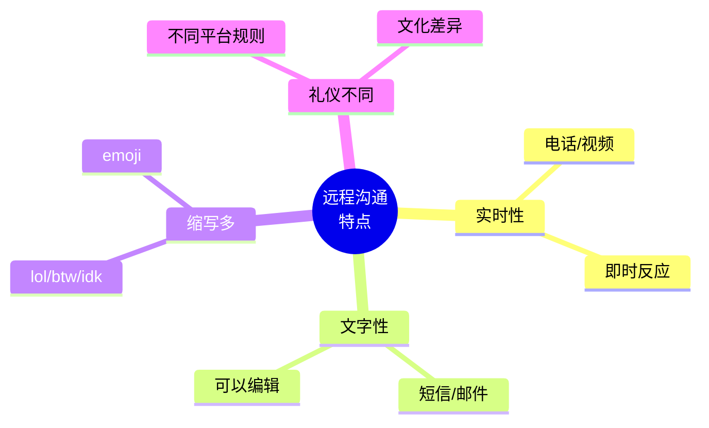

# 电话短信与在线沟通场景

> [!info] 本篇定位
> 上一篇讲**面对面社交**，这一篇讲**远程沟通**——电话、短信、视频会议。
>
> 远程沟通比面对面**更难**，因为：
>
> - **看不到表情**，靠声音/文字传达情绪
> - **来不及思考**，电话不能慢慢翻字典
> - **缩写多**（lol、btw、idk），不懂就掉队
> - **文化差异大**（emoji 用法、回复速度、礼貌度）
>
> 中国学生的痛点：
> - 接到陌生英语电话直接挂断
> - 视频会议不敢开口
> - 看到 "OMW" "TBH" 不知道什么意思
>
> 本篇覆盖**接打电话、电话留言、短信缩写、WhatsApp、视频会议、紧急沟通** 6 大远程场景。

---

## 1. 本篇导读：远程沟通的特别性

### 1.1 远程沟通 4 大特点



### 1.2 沟通方式选择

```
正式 → 轻松
邮件 → 视频会议 → 电话 → WhatsApp → 短信 → Snapchat
```

**选择原则**：
- **正式 / 重要**：邮件、电话
- **快速回复**：短信、WhatsApp
- **复杂讨论**：视频会议
- **休闲**：Snapchat、社交平台 DM

---

## 2. 接打电话基础（Phone Calls）

### 2.1 接电话句型（10 个）

**接到电话**：
```
① Hello?                              (最常用)
② Hi, this is John speaking.
③ John speaking.                       (商务正式)
④ Hello, who's calling?
⑤ Hello, may I ask who's calling?
```

**确认对方身份**：
```
⑥ Who's this?                          (口语)
⑦ Who am I speaking with?
⑧ Could I have your name, please?      (正式)
⑨ Sorry, who is this?
⑩ Is this Mike?                        (确认对方是不是)
```

### 2.2 打电话句型（10 个）

**自我介绍**：
```
① Hi, this is John (calling).
② Hi, my name is John. May I speak to ...?
③ Hello, this is John from [公司].
④ Hi, this is John. Is [人] there?
```

**说明来意**：
```
⑤ I'm calling about ...
⑥ I'm calling regarding ...           (正式)
⑦ The reason I'm calling is ...
⑧ I just wanted to ask about ...
⑨ Could I speak to [人]?
⑩ Is this a good time to talk?         (现在方便吗？)
```

### 2.3 转接 / 等待句型

**对方需要转接**：
```
"Hold on a second, I'll get him."
"Hold the line, please."
"Please hold."
"One moment, please."
"I'll transfer you now."           (我转接给你)
"Let me put you on hold."          (让我先把你挂起)
```

**回应**：
```
"Sure, I'll wait."
"OK, no problem."
"Thanks."
```

### 2.4 听不清楚 / 信号问题

```
"Sorry, I can't hear you very well."
"You're breaking up."                  (你信号不好)
"Could you speak up?"                  (能大点声吗？)
"Could you repeat that?"
"Sorry, what was that?"
"Could you say it again, please?"
"My signal is bad. Let me call you back."
"I'm losing you."                      (听不到你了)
```

### 2.5 结束电话句型（10 个）

```
① Thanks for calling!
② I'll let you go.                     (我让你忙吧——结束信号)
③ Talk to you later.
④ Have a good day!
⑤ Bye!
⑥ Take care.
⑦ I have to run.                       (我得挂了)
⑧ I'll call you back.
⑨ Speak soon.
⑩ Catch up later.
```

---

## 3. 商务电话（Business Calls）

### 3.1 标准商务电话开场

```
You：    "Good morning, ABC Company, John speaking. How can I
         help you?"
Caller： "Hi, this is Mary from XYZ. May I speak with Sarah?"
You：    "May I ask what this is regarding?"
Caller： "It's about the project proposal."
You：    "Hold on, I'll connect you."
```

### 3.2 接到客户电话

```
You：    "Good afternoon, this is John."
Client： "Hi John, this is Mike from ABC."
You：    "Hi Mike, how are you? What can I do for you?"
Client： "I'm calling about the order from last week."
You：    "Sure, let me pull up your file. ... OK, I have it.
         What's the issue?"
Client： "We received the wrong items."
You：    "I apologize for that. Let me get this sorted out
         right away."
```

### 3.3 商务电话礼仪 5 大原则

```
1. 报姓名 + 公司
   "ABC Company, John speaking."

2. 主动询问需求
   "How can I help you?"

3. 重要信息要重复
   "So that's order #1234, correct?"

4. 行动承诺
   "I'll get back to you within an hour."

5. 礼貌结束
   "Thanks for calling. Have a great day."
```

### 3.4 商务电话词汇

```
extension                 (分机)
voicemail                 (语音信箱)
on hold                   (在通话保持)
transfer                  (转接)
conference call           (电话会议)
schedule a call           (安排通话)
follow up                 (跟进)
get back to you           (回复你)
look into it              (调查一下)
```

---

## 4. 电话留言（Voicemail）

### 4.1 留言"完整公式"

```
[问候] + [自我介绍] + [来电原因] + [回拨方式] + [告别]

"Hi, this is John from ABC Company.
 I'm calling about the meeting next Tuesday.
 Please call me back at 555-1234.
 Thanks!"
```

### 4.2 留言句型（10 个）

```
① Hi, this is John (calling).

② I'm calling about ...

③ Please give me a call back when you get a chance.

④ My number is ...

⑤ You can reach me at ...

⑥ I'll be available until 5 PM.

⑦ It's not urgent, just call me back when you can.

⑧ I'll try you again later.

⑨ Thanks, talk soon!

⑩ Sorry I missed you.
```

### 4.3 接到语音邮件回复

**回拨给对方**：
```
You：    "Hi, this is John returning your call."
Person： "Oh hi John, thanks for calling back."
```

### 4.4 设置自己的语音邮件

**模板**：
```
"Hi, you've reached John. I can't take your call right now.
 Please leave your name, number, and a brief message,
 and I'll get back to you as soon as possible. Thanks!"
```

---

## 5. 短信文化（Text Messaging）

### 5.1 必备短信缩写（30 个）

```
基础类：
LOL    laughing out loud           (大笑)
LMAO   laughing my ass off         (笑死)
ROFL   rolling on the floor laughing
OMG    oh my god                   (我的天)
WTF    what the f***                (搞什么)
TBH    to be honest                (老实说)
IMO    in my opinion               (我的看法)
IMHO   in my humble opinion        (依我拙见)

时间地点：
ASAP   as soon as possible         (尽快)
TBD    to be determined            (待定)
TBA    to be announced             (待公布)
ETA    estimated time of arrival   (预计到达)

行动类：
BRB    be right back               (马上回来)
BBL    be back later               (稍后回来)
OMW    on my way                   (在路上)
TTYL   talk to you later
G2G    got to go                   (得走了)
GTG    got to go
NVM    never mind                  (算了)

关系类：
BTW    by the way                  (顺便说)
FYI    for your information        (供参考)
IDK    I don't know
IDC    I don't care
IMU    I miss you
ILY    I love you
TY     thank you
TYSM   thank you so much
NP     no problem
YW     you're welcome

商务/正式：
EOD    end of day                  (下班前)
COB    close of business           (下班前)
WFH    working from home           (居家办公)
PTO    paid time off               (带薪假)
```

### 5.2 短信常用句型

**约时间**：
```
"What time works for you?"
"Free tomorrow at 7?"
"How about Saturday?"
"Can we move it to Monday?"
```

**确认**：
```
"Sounds good!"
"Works for me!"
"On my way!"
"Just leaving now."
"Be there in 10."
```

**取消/改期**：
```
"Sorry, something came up."
"Can we reschedule?"
"Rain check?"                       (改天？)
"Let's do another time."
```

**到达**：
```
"I'm here."
"Outside!"
"Where r u?"                        (where are you 缩写)
```

**回复延迟**：
```
"Sorry, just saw this!"
"My bad, was in a meeting."
"Got tied up at work, sorry."
"Sorry for the late reply!"
```

### 5.3 短信例子

**约朋友吃饭**：
```
A: Hey! Free for dinner Friday?
B: Yeah, what time?
A: 7 work for u?
B: Perfect. Where?
A: How about that new sushi place on Main?
B: Sounds good. C u Friday!
A: 👍
```

**临时改期**：
```
A: Hey, super sorry, but I have to cancel tonight.
   Something came up at work 😔
B: No worries! Rain check?
A: Definitely. How about next week?
B: Works for me. Take care!
```

### 5.4 Emoji 文化

```
😀 笑脸 / 😊 微笑 / 😂 笑哭
👍 👌 🙏 (感谢/祈祷)
❤️ ♥️ 💕 (爱/喜欢)
😢 😭 (哭)
🤔 (思考)
🎉 🎊 (庆祝)
🔥 (火/酷)
✨ (闪/精彩)
💯 (一百分)
🙄 (翻白眼)
😅 (尴尬笑)
```

> [!tip] Emoji 文化技巧
>
> - 朋友间随意用
> - 商务场合谨慎用 (👍 OK，但 🙃 别用)
> - 不要过度使用 (一条信息 5 个 emoji 显得不专业)
> - 注意代际差异 (年轻人用 💀 表"笑死"，老一辈不懂)

---

## 6. WhatsApp / iMessage（即时通讯）

### 6.1 即时通讯特点

```
即时性强       几秒到几分钟回复
混合用途       朋友 + 家人 + 商务
群聊普遍       工作群 / 家庭群 / 朋友群
表情包文化     stickers / GIFs
```

### 6.2 群聊礼仪

```
✅ 信息相关时回复
✅ 不要 "刷屏"
✅ @ 特定人时用 @name
✅ 重要话题分私聊

❌ 长时间沉默后突然刷屏
❌ 转发链式信息（chain messages）
❌ 好早 / 好晚发消息
❌ 大量发语音消息
```

### 6.3 群聊句型

```
"Hey everyone!"
"Just saw this, sorry!"
"@John, what do you think?"
"Can we move this to a smaller group?"
"This is going off-topic."
"Let's take this offline."           (我们私下聊)
```

### 6.4 已读不回的文化

> [!warning] "已读不回"在西方文化
>
> 中国微信的"已读"功能不是国际通用的。
>
> **iMessage / WhatsApp**：
> - 默认显示**已送达**和**已读**
> - 但很多人**关闭已读功能**
>
> **不回复 = 不一定生气**
> - 可能在忙
> - 可能没看到
> - 可能不想立刻回
>
> **正常回复时间**：
> - 朋友：几小时内
> - 商务：当天 / 下个工作日
> - 不熟：1-2 天内

---

## 7. 视频会议（Video Calls）

### 7.1 视频会议词汇

```
平台：
Zoom / Teams / Google Meet / Skype / FaceTime

设置：
camera                   (摄像头)
microphone / mic         (麦克风)
mute                     (静音)
unmute                   (解除静音)
video off                (关视频)
share screen             (共享屏幕)
chat                     (聊天框)
breakout room            (分组讨论室)
host                     (主持人)
participant              (参会者)
recording                (录制)
```

### 7.2 视频会议常用句型（20 个）

**开始**：
```
① Can everyone hear me?
② Can you see my screen?
③ Sorry, I'm having technical issues.
④ Let me unmute myself.
⑤ I'm having trouble with my camera.
```

**中间**：
```
⑥ You're on mute.                      (你静音了)
⑦ Could you mute yourself? There's background noise.
⑧ You're cutting out.                  (信号断断续续)
⑨ I lost connection for a moment.
⑩ Could you share your screen?
⑪ Let me share my screen now.
⑫ I'll send the link in the chat.
⑬ Can you see this slide?
⑭ Let me know if you can't see it.
⑮ Could you repeat that? You broke up.
```

**结束**：
```
⑯ Any questions?
⑰ I think we're good for time.
⑱ Let's wrap up.
⑲ Thanks everyone, have a great day!
⑳ See you in next week's meeting.
```

### 7.3 视频会议礼仪

```
✅ 提前 1-2 分钟进入
✅ 测试摄像头/麦克风
✅ 不发言时静音
✅ 看着摄像头，不是屏幕
✅ 穿着得体（至少上半身）
✅ 背景整洁
✅ 用真名 + 公司

❌ 一边吃饭
❌ 床上躺着
❌ 一直离开
❌ 同事经过镜头
❌ 暗光线
```

### 7.4 完整视频会议对话

```
You：    "Hi everyone, can you all hear me?"
Others： "Yes, loud and clear."
You：    "Great. Let's wait a few more minutes for everyone to join."

(later)

You：    "OK, I think we're all here. Welcome to today's meeting.
         I'll share my screen now. Can everyone see the slides?"
Other：  "Yes, looks good."
You：    "Perfect. So as I mentioned in the email, today we're
         going to discuss..."

(during meeting)

Other：  "Sorry, John, you're on mute."
You：    "Oops, sorry! (unmute) Can you hear me now?"
Other：  "Yes, all good."

(end)

You：    "Any final questions?"
Other：  "I think we're good."
You：    "Great. Thanks everyone! I'll send the recording and
         notes after."
```

---

## 8. 邮件简短沟通（Quick Email）

### 8.1 邮件 vs 短信

```
邮件：正式 / 长内容 / 留底
短信：快速 / 短内容 / 即时
```

### 8.2 简短邮件模板

**询问**：
```
Subject: Quick question about [topic]

Hi [Name],

Hope you're doing well. Just had a quick question about [topic].
[具体问题]

Let me know when you have a moment.

Thanks,
John
```

**确认**：
```
Subject: Confirming our meeting

Hi [Name],

Just confirming our meeting at 3 PM tomorrow.
Please let me know if anything changes.

Thanks,
John
```

**跟进**：
```
Subject: Following up on [topic]

Hi [Name],

Following up on our last conversation about [topic].
Have you had a chance to think it over?

Best,
John
```

> [!info] 详细邮件写法见 10.03 商务邮件章节
>
> 这里只列短邮件，**正式商务邮件**在第 10 分类详细讲。

---

## 9. 网络聊天表达（Online Chat）

### 9.1 网络口语缩写

```
u / ur                   (you / your)
r / r u                  (are / are you)
2 / 4                    (to / for)
gr8                      (great)
pls                      (please)
thx                      (thanks)
plz                      (please)
b4                       (before)
2nite                    (tonight)
2morrow                  (tomorrow)
y                        (yes / why)
cuz / coz                (because)
```

### 9.2 网络情绪表达

```
xD                       (大笑)
:)  :D  :P               (笑脸)
:( :'(                   (哭)
^^ ^_^                   (开心)
T_T                      (哭/沮丧)
:0                       (惊讶)
;) ;P                    (眨眼)
<3                       (爱心)
```

### 9.3 网络互动句型

```
"Yo!"                    (嘿，年轻人)
"Sup?"                   (What's up)
"NM, u?"                 (Not much, you?)
"SMH"                    (Shaking my head——无语)
"FOMO"                   (Fear of missing out——怕错过)
"YOLO"                   (You only live once——人生苦短)
"GOAT"                   (Greatest of all time——最强)
"savage"                 (狠/酷)
"vibe"                   (氛围)
"lit"                    (酷/嗨)
"slay"                   (赞/优秀)
```

> [!warning] 这些缩写正在快速演化
>
> 5 年前流行的 "YOLO" 现在已经过时。
> 现在的年轻人用 "no cap"（不开玩笑）、"bet"（行）等新词。
>
> 跟随**美剧 / TikTok / 美国年轻人对话**，能跟上最新的表达。

---

## 10. 紧急沟通（Urgent Communications）

### 10.1 表达紧急的句型（10 个）

```
① It's urgent.

② This can't wait.

③ I need you to call me back ASAP.

④ Please respond immediately.

⑤ This is time-sensitive.

⑥ Drop everything and read this.

⑦ Code red.                          (口语，紧急)

⑧ All hands on deck.                  (所有人就位)

⑨ Top priority.

⑩ This is a priority.
```

### 10.2 报警紧急电话

**美国 911 / 英国 999**：

```
Dispatcher： "911, what's your emergency?"
You：        "There's a fire at [address]."
Dispatcher： "Is anyone hurt?"
You：        "I don't think so, but the fire is spreading."
Dispatcher： "Stay calm. Help is on the way."
```

**医疗紧急**：

```
"My friend just passed out. We need an ambulance!"
"Someone is having a heart attack."
"There's been an accident."
```

---

## 11. 完整对话场景汇总

### 11.1 场景 1：商务电话约会议

```
You：    "Hi Mike, this is Sarah from ABC."
Mike：   "Hi Sarah, how can I help?"
You：    "I'd like to schedule a call to discuss the proposal."
Mike：   "Sure. What times work for you?"
You：    "How about Thursday or Friday afternoon?"
Mike：   "Friday at 2 PM works for me."
You：    "Great, I'll send a calendar invite. Zoom OK?"
Mike：   "Zoom is fine. Talk to you Friday."
You：    "Thanks, bye!"
```

### 11.2 场景 2：朋友间约见面（短信）

```
A: Hey! What r u doing tomorrow?
B: Nm, prob just chilling. Why?
A: Wanna grab dinner?
B: Sure! Where?
A: That new ramen place?
B: Omg yes 🍜
A: 7 work for u?
B: 👍 c u then
```

### 11.3 场景 3：视频会议技术问题

```
You：    "Hi everyone, sorry I'm late. My WiFi was acting up."
Boss：   "No worries. We can hear you fine."
You：    "Can you see my video?"
Boss：   "Yes, but it's a bit pixelated."
You：    "Let me move closer to the router."

(later)

Boss：   "John, can you unmute and respond?"
You：    "(unmuting) Sorry! Yes, I'd say..."
```

### 11.4 场景 4：客户投诉电话

```
Customer： "Hi, I'm calling about my recent order. There's a problem."
You：      "Hi, sorry to hear that. Can I get your order number?"
Customer： "It's #12345."
You：      "Let me pull that up. ... OK, what's the issue?"
Customer： "I received the wrong item."
You：      "I sincerely apologize. We'll send the correct item
           today, free express shipping."
Customer： "What about returning the wrong one?"
You：      "We'll email you a free return label. Just print and
           drop it off."
Customer： "OK that works."
You：      "Anything else I can help with?"
Customer： "No, that's all."
You：      "Thanks for your patience. Have a great day!"
```

### 11.5 场景 5：紧急情况

```
You：     "(calling 911) Hi, I need help. There's a fire in
          my building."
911：     "OK, stay calm. What's your address?"
You：     "123 Main Street, apartment 5B."
911：     "Is anyone hurt?"
You：     "I don't think so. We're getting out now."
911：     "Good. The fire department is on the way."
You：     "Thank you!"
911：     "Stay outside, do not go back in."
You：     "Got it."
```

---

## 12. 文化差异提醒

### 12.1 接电话差异

```
中国：    "喂？" / "你好"
美国：    "Hello?" / "[Name] speaking."

中国可以一直 "喂喂喂"，美国通常说一次 "Hello"。
```

### 12.2 回复速度差异

```
中国：微信秒回是常态
美国：
- 短信 1-2 小时内回属正常
- 邮件 24-48 小时内回属正常
- 不回 = 可能没看到，不一定是回避
```

### 12.3 商务电话的开场

```
中国常见：    "喂，我是 X 公司的 Y..."
美国常见：    "Hi, this is John speaking" → 让对方说事

差异：美国接电话不会立刻报"我是 X 公司"，
     而是等对方说出来意。
```

### 12.4 视频会议开摄像头

```
美国：默认开摄像头（除非说明）
中国：常常关摄像头

不开摄像头被认为：不投入 / 不专业（西方文化）
```

### 12.5 表情包/Emoji 跨文化

```
👍 全球通用
🙏 美国 = "感谢/祈祷"，中国 = "感谢/拜托"
🤝 商务通用
🌶 西方很少在文字中用，中国常用表"辛辣"
🐉 西方少见

最安全的：😊 👍 ❤️ 🎉
```

---

## 13. 常见错误大盘点

### 13.1 错误 1：电话开口直接说事

```
❌ "I want to know about the order."
✅ "Hi, this is John. I'm calling about the order #1234."
```

### 13.2 错误 2：忘记报姓名

```
❌ "Is John there?"
✅ "Hi, this is Mike. May I speak to John?"
```

### 13.3 错误 3：声音太小

```
英语电话需要**比平时大声**（因为信号、口音等问题）。
中国学生常因为不自信导致声音小。
```

### 13.4 错误 4：缩写理解错

```
"OMW" = on my way (在路上)，**不是** "oh my way"
"NVM" = never mind (算了)，不是字面
"FYI" = for your information (供参考)，不是 "fly you in"
```

### 13.5 错误 5：邮件用短信式

```
❌ "hey, send me the file pls"
✅ "Hi John, could you send me the file when you get a chance?
   Thanks!"

商务邮件不能用短信缩写。
```

### 13.6 错误 6：视频会议穿睡衣

```
即使在家，**至少上半身**穿正常衣服。
对方会突然要求站起来 / 走动。
```

### 13.7 错误 7：把语音邮件当文字

```
留语音邮件时**说话要慢**，**重要信息重复**：
- 自己的姓名 (拼一遍)
- 电话号码 (重复一遍)
```

---

## 14. 练习与输出建议

> [!success] 本篇练习清单
>
> **基础练习**
>
> 1. 准备你的"**电话工具包**"：
>    - 接听开场白
>    - 商务电话的标准开场
>    - 5 个常用句型
>    - 语音邮件模板
>
> 2. 背 **20 个最常用缩写**（LOL/BTW/IDK/ASAP 等）
>
> **场景模拟**
>
> 3. 模拟 5 个对话：
>    - 接到陌生英语电话
>    - 给客户打电话
>    - 留语音邮件
>    - 视频会议技术问题
>    - 911 紧急电话
>
> **短信练习**
>
> 4. 用英文短信和朋友约见面（写出 10 句往复）
>
> **AI 角色扮演**
>
> 5. 让 AI 扮演**客户/同事**，进行 5 分钟商务电话练习。
>
> **写作练习**
>
> 6. 写 3 个语音邮件留言（不同场景）：
>    - 个人朋友
>    - 商务客户
>    - 医生预约
>
> **长期任务**
>
> 7. **看一集美剧的视频会议场景**（如 The Office 第 X 集），
>    记录所有句型。
>
> 8. 加入一个英语视频会议（Toastmasters / 英语角线上版），
>    每周参加。

---

## 15. 本篇小结

> [!success] 本篇核心要点回顾
>
> **接电话**：
> - Hello? / [Name] speaking
> - Hi, this is [Name] calling about ...
>
> **商务电话**：
> - 报公司 + 名字
> - 询问需求
> - 重要信息重复
> - 行动承诺
>
> **语音邮件**：
> - 问候 + 介绍 + 原因 + 回拨方式 + 告别
>
> **短信缩写**：
> - LOL/LMAO/OMG/BTW/IDK/ASAP/OMW
> - TBH/IMO/FYI/NP/TY
> - WFH/PTO (商务)
>
> **WhatsApp/iMessage**：
> - 即时性 + 群聊礼仪
> - 已读不回 ≠ 生气
>
> **视频会议**：
> - 开摄像头 + 静音规则
> - 提前进入 + 测设备
> - 看着摄像头说话
>
> **紧急沟通**：
> - 911 / 999
> - It's urgent / ASAP / Top priority
>
> **文化差异**：
> - 美国电话不立即报公司
> - 不回邮件不一定生气
> - 视频会议默认开摄像头
> - 商务邮件不能用短信缩写

### 15.1 下一篇预告

> [!info] 下一篇：03.约会恋爱与人际关系场景
>
> 下一篇讲**情感场景**——
>
> - **约会**：邀约 / 第一次约会 / 表白
> - **恋爱**：情侣日常 / 表达爱意 / 处理矛盾
> - **分手**：如何分手 / 安慰朋友
> - **家庭关系**：父母 / 兄弟姐妹 / 矛盾沟通
> - **友谊**：表达感谢 / 化解尴尬
>
> 这一篇让你**用英语表达情感**——这是中国学生最难的领域。
