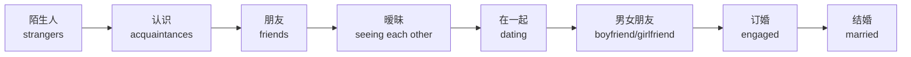

# 约会恋爱与人际关系场景

> [!info] 本篇定位
> 这一篇讲**情感英语**——约会、恋爱、家庭、友谊。
>
> 这是中国学生**最难**的领域，因为：
>
> - 情感表达**文化差异极大**（西方更直接）
> - **暧昧期的"试探"语言**完全不同
> - 表达爱意的**程度阶梯**复杂（like/love/in love）
> - **分手 / 矛盾**的处理方式不同
>
> 中国学生的常见困扰：
> - 喜欢一个外国人，不知道怎么表白
> - 谈恋爱中**英文情话**说不出来
> - 遇到矛盾**英文吵架**完全不会
>
> 本篇覆盖**邀约 → 约会 → 暧昧 → 表白 → 情侣日常 → 矛盾 → 分手 → 家庭友谊** 全流程。

---

## 1. 本篇导读：情感英语的核心

### 1.1 关系阶段词汇表



**英语关系状态**：

```
single                       (单身)
seeing someone               (在和某人交往，未确定)
dating                       (约会中)
in a relationship            (恋爱中)
engaged                      (订婚)
married                      (已婚)
divorced                     (离异)
widowed                      (丧偶)
it's complicated             (一言难尽 - 网络流行)
```

### 1.2 重要文化差异

```
中国式恋爱：    含蓄 / 父母重要 / 早结婚
西方式恋爱：    直接 / 个人优先 / 灵活时间

中国"我们在一起吧"= 西方表白 (确定 official)
西方有"约会期"（dating）= 不一定算男女朋友
```

---

## 2. 邀约（Asking Someone Out）

### 2.1 试探阶段

**展现兴趣的句型**（10 个）：

```
① "Are you seeing anyone?"           (你在和谁约会吗？)
② "Are you single?"
③ "What's your relationship status?"
④ "Tell me about yourself."
⑤ "I'd love to get to know you better."
⑥ "I really enjoy talking to you."
⑦ "We should hang out sometime."
⑧ "I had fun tonight."
⑨ "I had a great time with you today."
⑩ "Do you want to grab coffee sometime?"
```

### 2.2 直接邀约（10 个）

```
① "Would you like to go on a date?"

② "Are you free this Saturday?"

③ "Want to grab dinner sometime?"

④ "I'd love to take you out."

⑤ "Can I take you to dinner?"

⑥ "Would you like to do something this weekend?"

⑦ "I have two tickets to [event]. Want to come?"

⑧ "Coffee on me?"
   (我请你喝咖啡？)

⑨ "Let's get a drink sometime."

⑩ "How about we meet up Friday?"
```

### 2.3 接受邀约

```
"Yes, I'd love to!"
"That sounds great!"
"I'd really like that."
"Sure, when?"
"Let's do it!"
"I've been hoping you'd ask."   (我一直在等你问)
```

### 2.4 拒绝邀约（委婉）

```
"I'm flattered, but I'm not interested."
   (受宠若惊，但不感兴趣)

"I'm sorry, I'm seeing someone."

"I think we're better as friends."
   (我们做朋友更好)

"You're a great person, but I don't feel that way."

"I'm not really looking to date right now."

"Thanks, but no thanks."
```

### 2.5 Dating App（约会软件）

**主流 App**：
```
Tinder              (年轻 / 短期)
Bumble              (女生先开口)
Hinge              (认真寻找关系)
Match.com           (传统正经)
OkCupid             (兴趣匹配)
```

**App 用语**：
```
swipe right            (右滑——喜欢)
swipe left             (左滑——不喜欢)
match                  (配对成功)
super like             (超喜欢)
unmatch                (取消配对)
ghost                  (突然消失)
DTR                    (Define the Relationship——明确关系)
red flag               (危险信号)
green flag             (好的信号)
catfish                (照骗)
```

### 2.6 App 上的开场白

**好的开场白**（吸引回复）：

```
"Hey [Name]! Your photos are amazing—where was the second one taken?"

"That's a really cool [hobby]! How did you get into it?"

"You mentioned you love [topic]. What's your favorite [related thing]?"

"Coffee or tea person?"

"Truth or dare? Tell me your most embarrassing dating story."
```

**避免**：

```
❌ "Hi"  (太简短)
❌ "How are you?"  (无聊)
❌ "You're hot"  (失礼)
❌ Long messages with personal info immediately
```

---

## 3. 第一次约会（First Date）

### 3.1 约会前

**确认时间地点**：

```
"What time should I pick you up?"          (我几点接你？)
"Should I pick you up or meet there?"
"What's the dress code?"                    (穿什么？)
"Where are we going?"
"What should I wear?"
"Should I bring anything?"
"Looking forward to tonight!"
```

### 3.2 约会开场（10 个）

```
① "You look great!"

② "Wow, you look amazing!"

③ "Thanks for coming out tonight."

④ "I'm so glad we're finally doing this."

⑤ "Have you been here before?"

⑥ "How was your day?"

⑦ "Tell me something interesting about yourself."

⑧ "What have you been up to lately?"

⑨ "Did you have any trouble finding the place?"

⑩ "I picked this place because [reason]."
```

### 3.3 约会中聊天话题

**安全话题**：
```
- Family (carefully)
- Work / career
- Hobbies & passions
- Travel
- Food preferences
- Movies / shows / books
- Pets
- Bucket list
- Childhood memories
```

**避免话题（第一次约会）**：
```
❌ Ex-relationships
❌ Politics / religion (heated)
❌ Money / salary
❌ Marriage / kids (pressure)
❌ Past trauma
```

### 3.4 约会中表达兴趣

```
"You're really easy to talk to."
"I love how passionate you are about [X]."
"You have a great laugh."
"I really like your style."
"You're funnier than I expected!"
"I'm having such a good time."
"This is going better than I expected."
```

### 3.5 约会结束

**正面结束**：

```
"I had such a great time."
"Thanks for tonight."
"I'd love to see you again."
"Can I see you again?"
"Same time next week?"
"Text me when you get home."
"Stay safe!"
```

**第一次吻别**：

```
"Can I kiss you?"          (有些人会问)
"...goodnight" (慢慢走近)

避免：
"Want to come up?"  (= 想发生关系？慎用)
```

### 3.6 完整第一次约会对话

```
You：     "Hey! You found the place OK?"
Date：    "Yeah, easy. You look great by the way."
You：     "Thanks! So do you. Have you been here before?"
Date：    "Never. How about you?"
You：     "Once with friends. The pasta is amazing."

(during dinner)

You：     "So, tell me something I don't know about you."
Date：    "Hmm. I lived in Italy for a year after college."
You：     "Wait, really? What were you doing there?"
Date：    "Studying art. It was the best year of my life."
You：     "Wow, that's amazing! Do you still paint?"
Date：    "Sometimes. Mostly digital art now. What about you?
          Any cool experiences?"
You：     "Not as cool as Italy! But I did backpack through
          Southeast Asia for 3 months..."

(end of date)

Date：    "I really had a great time tonight."
You：     "Me too. I'd love to see you again."
Date：    "I'd like that. Text me?"
You：     "Definitely. Have a safe ride home!"
```

---

## 4. 暧昧期与确定关系

### 4.1 "We're seeing each other" 阶段

**这是西方独有的"模糊期"**——已经在约会，但还没确定 official。

**句型**：
```
"We're seeing each other."
"We've been hanging out."
"We're talking."           (年轻人说法)
"It's casual."
"We're not exclusive yet." (还没确定专一)
"We're dating but it's new."
```

### 4.2 "DTR"（Define The Relationship）

**确定关系的对话**——西方文化中需要**主动谈**。

```
"I think we should talk about us."

"I really like spending time with you. What are we doing?"

"Are we exclusive?"               (我们是不是只见对方？)

"Where do you see this going?"

"I want to be your boyfriend / girlfriend."

"I want this to be official."

"Can I introduce you as my partner?"
```

### 4.3 "Official"（在一起）

**英语没有完全对应"在一起"的表达**，常用：

```
"We're official."
"We're a couple now."
"We're together."
"He / She is my boyfriend / girlfriend."
"We just made it Facebook official."   (改 FB 状态)
```

---

## 5. 表白（Confessing Feelings）

### 5.1 表达喜欢的程度阶梯

```
I'm into you.                  (我对你有意思)
I have a crush on you.          (我对你有好感)
I like you.                    (我喜欢你)
I really like you.              (我真的喜欢你)
I'm falling for you.            (我对你动心了)
I'm in love with you.           (我爱上你了)
I love you.                    (我爱你)
```

### 5.2 表白句型（10 个）

```
① I have something to tell you.
② I've been wanting to say something.
③ I really like you. Like, more than a friend.
④ I think I'm developing feelings for you.
⑤ I can't stop thinking about you.
⑥ You make me really happy.
⑦ I want to take this to the next level.
⑧ I want us to be more than friends.
⑨ I think you're amazing.
⑩ I'm crazy about you.
```

### 5.3 经典表白场景

```
You：     "Hey, can I tell you something?"
Crush：   "Sure, what's up?"
You：     "I... I don't know how to say this. I really like you."
Crush：   "..."
You：     "I've been thinking about it for a while. You're amazing,
          and I'd love to take this to the next level."
Crush：   "Wow, I... I feel the same way."
You：     "Really?"
Crush：   "Yeah, I just didn't know if you felt that way too."
You：     "I do. I really do."
```

### 5.4 第一次说 "I love you"

> [!warning] 西方文化中 "I love you" 是大事
>
> **中文随便用**："爱你哟" 朋友间也说。
>
> **英语：I love you 是非常正式的表白**：
>
> - 第一次说要等关系**至少 3 个月**
> - 说太早可能吓到对方
> - 一旦说出，是认真的承诺
>
> **比较随意的表达**：
> - "Love ya!" (love you 缩写) → 朋友/家人之间
> - "I love being with you" → 喜欢和你在一起
> - "I'm in love with you" → 真爱
>
> **中国式"爱你"** 翻译要小心。

### 5.5 表白被拒

```
Wrong responses 错误反应：
❌ "Why?!"
❌ "What's wrong with me?"
❌ "Give me another chance."

Right responses 正确反应：
✅ "I appreciate you being honest."
✅ "I understand. Thanks for telling me."
✅ "Can we still be friends?"
```

---

## 6. 情侣日常（Couple Talk）

### 6.1 称呼对方（昵称）

```
honey                     (亲爱的)
babe                      (宝贝)
baby                      (宝宝)
sweetheart                (心肝)
love / my love            (我的爱)
darling                   (达令)
sweetie                   (甜心)
hon                       (honey 缩写)
hubby / wifey             (夫君/老婆，年轻人)
boo                       (年轻人爱用)
my person                 (我的人)
```

### 6.2 日常情话（20 个）

```
① I miss you.
② I can't wait to see you.
③ You make my day.
④ Thinking of you.
⑤ I'm so lucky to have you.
⑥ You're the best.
⑦ I love you to the moon and back.
⑧ You complete me.
⑨ I can't imagine my life without you.
⑩ You mean everything to me.
⑪ I'm so happy with you.
⑫ You light up my world.
⑬ Love of my life.
⑭ My favorite person.
⑮ You make me a better person.
⑯ I cherish you.
⑰ You're my forever.
⑱ I'd choose you, every time.
⑲ Sweet dreams, love.
⑳ I love waking up next to you.
```

### 6.3 想念对方（10 个）

```
① I miss you so much.
② Can't wait to see you.
③ Wish you were here.
④ Counting down the days.
⑤ Thinking about our last date.
⑥ When can I see you next?
⑦ I miss your face.
⑧ I miss your hugs.
⑨ I had a dream about you.
⑩ Time goes so slow without you.
```

### 6.4 表达感谢（10 个）

```
① Thanks for being there.
② I appreciate everything you do.
③ You're so good to me.
④ I don't know what I'd do without you.
⑤ Thanks for putting up with me.
⑥ You always know how to cheer me up.
⑦ I'm grateful for you every day.
⑧ You spoil me.
⑨ Thanks for listening.
⑩ I'm lucky to have you.
```

### 6.5 情侣日常对话

```
Morning：
"Good morning, beautiful."
"Morning, babe. Sleep well?"
"What's the plan today?"
"Want to grab breakfast together?"

Throughout the day：
"How's your day going?"
"Thinking about you ❤️"
"Can't wait to see you tonight."
"Miss you!"

Evening：
"How was your day?"
"What do you want for dinner?"
"Want to watch a movie?"
"Cuddle time?"

Night：
"Goodnight, love."
"Sweet dreams."
"See you in my dreams."
"Love you."
```

---

## 7. 处理矛盾（Handling Conflicts）

### 7.1 表达不满（5 个温和句型）

```
① I'm a bit upset.
② We need to talk.
③ Can I tell you what's bothering me?
④ I don't want to fight, but...
⑤ I feel ___ when you ___.
   ("I feel hurt when you ignore me.")
```

### 7.2 严重冲突（强烈句型）

```
① I'm really hurt.
② I can't believe you did that.
③ This isn't OK with me.
④ You crossed a line.
⑤ I need some space.
```

### 7.3 道歉句型（10 个）

```
① I'm sorry.
② I apologize.
③ I'm sorry I hurt you.
④ I shouldn't have done that.
⑤ It was wrong of me.
⑥ Can you forgive me?
⑦ I'll do better.
⑧ I won't let it happen again.
⑨ Please give me another chance.
⑩ I take full responsibility.
```

### 7.4 接受道歉

```
"It's OK, I forgive you."
"I appreciate you saying that."
"Let's move forward."
"Just don't do it again."
"It's water under the bridge."   (过去就过去了)
```

### 7.5 不接受道歉

```
"I need time to process this."
"Sorry isn't enough this time."
"Words mean nothing without action."
"I need space to think."
```

### 7.6 完整矛盾对话

```
You：    "We need to talk."
Partner："What's wrong?"
You：    "I'm upset about last night."
Partner："Why?"
You：    "I felt ignored when you were on your phone all evening."
Partner："Oh, I didn't realize. I was just checking work emails."
You：    "When you do that on date night, it makes me feel
         unimportant."
Partner："I hear you. I'm really sorry. I'll put my phone away
         when we're together."
You：    "Thank you. That means a lot."
Partner："Can we do tonight over?"
You：    "Sure. I love you."
Partner："Love you too."
```

---

## 8. 分手（Breaking Up）

### 8.1 分手原因

```
"We're growing apart."
"I don't see this going anywhere."
"We want different things."
"I need to focus on myself."
"It's not working."
"I don't feel the same anymore."
"There's no spark anymore."     (没火花了)
"We're not compatible."
```

### 8.2 分手句型（10 个）

```
① I don't think this is working anymore.

② We need to break up.

③ I think it's time we go our separate ways.

④ I want to break up.

⑤ It's over.

⑥ I'm sorry, but I can't do this anymore.

⑦ It's not you, it's me.       (老套但常见)

⑧ I think we should see other people.

⑨ I don't feel the same way I used to.

⑩ Let's call it quits.
```

### 8.3 完整分手对话

```
You：     "We need to talk."
Partner： "What's wrong?"
You：     "I think it's time for us to break up."
Partner： "What? Why?"
You：     "I don't think we want the same things anymore.
          I've been thinking about it for a while."
Partner： "Is there someone else?"
You：     "No. It's just that we've grown apart."
Partner： "I don't want this to end."
You：     "I know. But I think it's the right thing for both of us."
Partner： "What about ... everything we have?"
You：     "I'll always cherish what we had. But I need to do this."
```

### 8.4 被分手后

**朋友安慰你**：
```
"I'm so sorry."
"How are you holding up?"
"You'll get through this."
"You deserve better."
"Their loss."
"Time heals all wounds."
"I'm here if you need to talk."
```

**自己疗伤**：
```
"I just need time."
"It hurts, but I'll be OK."
"I'm taking some time for myself."
"I need to focus on me."
```

---

## 9. 家庭关系（Family Relationships）

### 9.1 家人称呼

```
mom / mother                (妈妈)
dad / father                (爸爸)
mommy / daddy               (儿语，亲昵)
mama / papa                 (亲昵)
parents                     (父母)
grandma / grandpa           (祖父母)
sibling                     (兄弟姐妹——通用)
brother / sister
older brother / sister      (哥哥/姐姐)
younger brother / sister    (弟弟/妹妹)
twin                        (双胞胎)
cousin                      (堂/表兄弟姐妹)
aunt / uncle                (姑姨/叔伯)
nephew / niece              (侄子/侄女)
in-laws                     (姻亲)
mother-in-law               (婆婆/岳母)
father-in-law               (公公/岳父)
brother-in-law              (姐夫/妹夫)
sister-in-law               (嫂子/弟妹)
```

### 9.2 与父母对话

```
"How are you, Mom?"
"Just calling to check in."
"Miss you, Dad."
"How's everything at home?"
"I'll come visit soon."
"I love you, Mom."
```

### 9.3 家庭矛盾沟通

```
"I respect your opinion, but..."
"Can we talk about this calmly?"
"I see your point, but I see it differently."
"I love you, but I disagree."
"I'm an adult, I need to make my own choices."
```

---

## 10. 友谊（Friendship）

### 10.1 表达感谢与重视（10 个）

```
① You're a great friend.
② I appreciate you.
③ Thanks for always being there.
④ I value our friendship.
⑤ You're like family to me.
⑥ I'm so lucky to have you as a friend.
⑦ I don't know what I'd do without you.
⑧ Thanks for putting up with me.
⑨ You're the best.
⑩ Friendship goals!
```

### 10.2 友谊冲突

```
"I felt hurt by what you said."
"Can we talk about what happened?"
"I miss our friendship."
"I want to fix this."
"What can I do to make it right?"
```

### 10.3 失去联系后重新联系

```
"Hey! Long time no talk!"
"It's been forever! How are you?"
"I'm sorry I've been MIA."     (Missing In Action - 失踪)
"Life got crazy, but I miss you."
"Let's catch up soon!"
```

---

## 11. 中西情感文化差异

### 11.1 表达爱意的差异

```
中国：    含蓄 / 行动 > 语言 / 父母管
西方：    直接 / 语言 + 行动 / 个人决定

中国：    "我饿了" = 表达爱意（关心）
西方：    "I love you" 直接说
```

### 11.2 求婚

```
中国：    可以家长见面后逐步确定
西方：    Proposal（求婚）是大事
         - 单膝跪地
         - 戒指
         - 浪漫场景
         - 对方说 "Yes!" 或 "I do!"
```

### 11.3 婚礼

```
中国：    敬酒 / 传统仪式 / 红包
西方：    宣誓（vows）/ 教堂或户外 / 亲吻新娘 / 礼物
```

### 11.4 离婚

```
西方相对常见，离婚率较高。
谈论离婚的人不会被歧视。
"I'm divorced" 可以正常说。
```

### 11.5 对待"前任"

```
中国：    回避 / 不提
西方：    可以正常提 ex
"My ex and I..."
"I had an ex who..."
但**不要在新对象面前过度提**。
```

---

## 12. 常见错误大盘点

### 12.1 错误 1：直译"在一起吧"

```
❌ "Let's be together." (听起来像哲学讨论)
✅ "Will you be my girlfriend / boyfriend?"
✅ "I want us to be official."
```

### 12.2 错误 2：随便说 "I love you"

```
中国学生学 "I love you" 后到处用，
但西方文化中这是**严肃承诺**。

朋友 / 家人之间用 "Love ya!" 比较安全。
```

### 12.3 错误 3：把"亲爱的"当万能称呼

```
中文："亲爱的" 可以用于朋友、邮件开头。
英语："Dear" 比较正式 / 邮件用。
"My dear" 给情侣或家人。

朋友间不用 "dear"，用 "buddy" / "friend"。
```

### 12.4 错误 4："宝贝" 翻译

```
"Baby" 给情侣 / 宝宝
"Babe" 给情侣 (更随意)

不要给同性朋友 "baby" / "babe"，会很奇怪。
```

### 12.5 错误 5：第一次约会问深问题

```
❌ "Do you want kids?"
❌ "What's your salary?"
❌ "Why did you break up with your ex?"

第一次约会**保持轻松**。
```

### 12.6 错误 6："I miss you" 用法

```
❌ I miss you so much.    (给所有人)
✅ 只给：
- 情侣
- 家人
- 极亲密朋友

朋友间多年不见可以说 "I missed you guys!"
```

---

## 13. 完整场景对话汇总

### 13.1 场景：约朋友的朋友出去（暧昧）

```
You：     "Hey, I had a great time meeting you at John's party."
Crush：   "Yeah, same! It was fun."
You：     "Want to grab coffee sometime?"
Crush：   "Sure! When were you thinking?"
You：     "How about Saturday afternoon?"
Crush：   "Saturday works. Where?"
You：     "There's a great place near downtown. Send me your address,
          I'll plan it out."
Crush：   "Looking forward to it!"
```

### 13.2 场景：表白被接受

```
You：     "Hey, can I tell you something?"
Crush：   "Of course."
You：     "I really like you. Like, more than just friends."
Crush：   "...I was hoping you'd say that."
You：     "Really?"
Crush：   "Yeah. I like you too."
You：     "(smile) So... what does this mean?"
Crush：   "I want to see where this goes."
You：     "Me too."
```

### 13.3 场景：纪念日

```
Partner：  "Happy anniversary, babe."
You：      "Happy anniversary! I can't believe it's been a year."
Partner：  "Best year of my life."
You：      "Same. Here's to many more."
Partner：  "I have something for you..."
You：      "You didn't have to!"
Partner：  "Of course I did. Open it!"
You：      "Oh my god, this is beautiful. Thank you, I love you."
Partner：  "I love you more."
You：      "Not possible."
```

---

## 14. 练习与输出建议

> [!success] 本篇练习清单
>
> **基础练习**
>
> 1. 写出**关系状态**的 10 种表达（single → engaged → married 等）
>
> 2. 列出**5 种邀约**的表达 + **5 种委婉拒绝**
>
> 3. 背 **10 句情话**（适合朋友 / 情侣不同强度）
>
> **场景模拟**
>
> 4. 模拟 5 个对话：
>    - 在派对上邀约新朋友
>    - 第一次约会
>    - 表白
>    - 处理矛盾
>    - 分手
>
> **写作练习**
>
> 5. 写一封英文情书（200 词）
>
> 6. 写一段纪念日祝福（5 句话）
>
> **AI 角色扮演**
>
> 7. 让 AI 扮演**约会对象**，进行 10 分钟约会对话练习。
>
> **长期任务**
>
> 8. 看一部经典爱情电影（如 Notting Hill / Pretty Woman / 500 Days
>    of Summer），**记录所有情感表达**。
>
> 9. 学唱一首英文情歌（如 Ed Sheeran 的 "Perfect"），
>    理解每句歌词的情感。

---

## 15. 本篇小结

> [!success] 本篇核心要点回顾
>
> **关系阶段**：
> single → seeing each other → dating → in a relationship → engaged → married
>
> **邀约**：
> - "Want to grab coffee?"
> - "Are you free this weekend?"
> - 接受："I'd love to!"
> - 拒绝："I'm flattered, but..."
>
> **第一次约会**：
> - 安全话题：work / hobbies / travel / pets
> - 避免：ex / politics / money
> - 结束："I had a great time"
>
> **表白阶梯**：
> into you → crush → like → really like → falling for → in love → love
>
> **"I love you" 是大事**（西方文化中）
>
> **情侣称呼**：honey / babe / baby / sweetheart / love
>
> **处理矛盾**：
> - "I feel ___ when you ___"
> - 道歉 + 行动
>
> **分手**：
> - "I think it's time we go our separate ways"
> - 朋友安慰："Their loss" / "Time heals"
>
> **家庭友谊**：
> - 家人：sibling / cousin / in-laws
> - 友谊：value / appreciate / there for you
>
> **文化差异**：
> - 西方求婚是大事
> - 谈论 ex 不忌讳
> - "亲爱的 / 宝贝" 翻译要小心
> - 第一次约会保持轻松

### 15.1 下一篇预告

> [!info] 下一篇：04.邀请庆祝与节日祝福场景
>
> 下一篇是 **07 分类的收官篇**：
>
> - **生日祝福**：年龄、心愿
> - **婚礼祝福**：祝词、敬酒
> - **节日祝福**：圣诞 / 新年 / 感恩节 / 复活节 / 情人节
> - **毕业 / 升职 / 新家**：人生重要时刻祝福
> - **慰问与吊唁**：表达关心、哀悼
>
> 这一篇让你**在所有重要时刻都能说出得体的话**。
