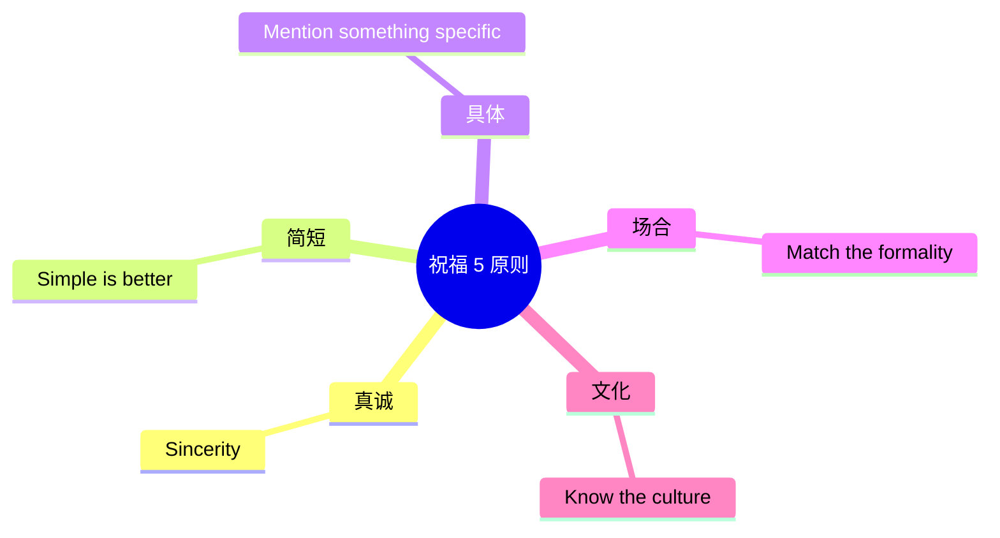

# 邀请庆祝与节日祝福场景

> [!info] 本篇定位
> 这是 **07.社交交际场景实战** 分类的**收官篇**。
>
> 这一篇专门讲**人生重要时刻**和**节日祝福**——
>
> - 生日 / 结婚 / 毕业 / 升职 / 乔迁 / 退休
> - 圣诞 / 新年 / 感恩节 / 情人节 / 母亲节 / 父亲节
> - 慰问 / 吊唁
>
> **会不会说节日祝福**，决定了你能否在国外**真正融入当地生活**。一句得体的 "Merry Christmas" 比任何东西都拉近距离。
>
> 中国学生常见的尴尬：
> - 听到 "Merry Christmas" 不知道怎么回（怎么不只 "Thank you"？）
> - 朋友丧亲，不知道怎么安慰
> - 朋友升职，只会说 "Congratulations"
>
> 本篇覆盖 **300+ 祝福句型** + **15 大重要时刻** + **10 大节日**。

---

## 1. 本篇导读：祝福英语的特殊性

### 1.1 祝福 vs 寒暄的区别

```
寒暄：日常的轻松交流（之前学过）
祝福：在特殊时刻给对方传达情感
```

### 1.2 祝福 5 大原则



### 1.3 节日时间线

```
1月：    New Year's Day (元旦)
2月：    Valentine's Day (情人节)
3月：    St. Patrick's Day (圣帕特里克节)
4月：    Easter (复活节)
5月：    Mother's Day (母亲节)
6月：    Father's Day (父亲节)
7月：    Independence Day (美国独立日)
10月：   Halloween (万圣节)
11月：   Thanksgiving (感恩节，美国)
12月：   Christmas (圣诞节)
12月31日：New Year's Eve (跨年夜)
```

---

## 2. 生日祝福（Birthday）

### 2.1 基本生日祝福（10 个）

```
① Happy birthday!                          (生日快乐)
② Happy birthday to you!                   (传统)
③ Wishing you a very happy birthday!
④ Have a wonderful birthday!
⑤ Many happy returns (of the day)!         (英式)
⑥ HBD!                                      (缩写，短信用)
⑦ Hope you have an amazing birthday!
⑧ Best wishes on your special day!
⑨ Happy birthday, gorgeous!                (亲密的)
⑩ Many more!                                 (祝你长寿)
```

### 2.2 加深祝福（朋友间）

```
① Wishing you all the best on your birthday and always.
② Hope this year brings you all the happiness you deserve.
③ May all your dreams come true this year.
④ Another trip around the sun—make it count!
⑤ You're not getting older, you're getting better.
⑥ Hope your day is as awesome as you are.
⑦ Cheers to another amazing year!
⑧ You deserve all the love and joy in the world.
⑨ Sending you love on your special day.
⑩ Couldn't imagine my life without you—happy birthday!
```

### 2.3 工作场合的生日祝福

```
"Happy birthday! Wishing you a great year ahead."
"Hope you have a wonderful birthday!"
"Happy birthday! Enjoy your day."
"Have a fantastic birthday!"
"Wishing you success and happiness."
```

### 2.4 长辈/长者的生日

```
"Wishing you good health and happiness on your birthday."
"Many more years of joy and good health."
"Happy birthday! May this year be filled with blessings."
```

### 2.5 关于年龄的话题

> [!warning] 注意：成年女性慎问年龄
>
> 在西方文化中，问女性年龄是**不礼貌**的。
>
> 但 **生日聚会上对方主动提到年龄**，可以回应：
>
> ```
> "You look so young!"
> "You don't look a day over [age]!"
> "Age is just a number."
> "You're aging like fine wine."
> ```

### 2.6 完整生日对话

```
You：     "Hey! Happy birthday!"
Friend：  "Thanks!"
You：     "Got any plans?"
Friend：  "Just dinner with family tonight."
You：     "Sounds wonderful. Hope you have an amazing day!
          And I got you a little something."
Friend：  "Aw, you didn't have to!"
You：     "Of course I did. Open it!"
Friend：  "(opens) Oh my god, this is beautiful! Thank you so much."
You：     "Glad you like it. Many happy returns!"
```

### 2.7 生日卡片模板

```
Happy Birthday, [Name]!

Wishing you a day filled with love, laughter, and all the things
that make you happy. You deserve every wonderful thing this new
year of life will bring.

Cheers to many more!

Love,
[Your name]
```

---

## 3. 婚礼祝福（Wedding）

### 3.1 婚礼祝福（10 个）

```
① Congratulations on your wedding!
② Congrats to the happy couple!
③ Wishing you a lifetime of love and happiness!
④ May your love grow stronger every day.
⑤ Best wishes on your new journey together.
⑥ Here's to your forever and always.
⑦ Wishing you a marriage as beautiful as your wedding day.
⑧ May your love story be one for the ages.
⑨ Cheers to the newlyweds!
⑩ Two hearts, one love—congratulations!
```

### 3.2 在婚礼上说什么

**对新郎/新娘**：
```
"You look stunning!"
"What a beautiful ceremony!"
"You two are perfect for each other."
"I'm so happy for you."
"Best day ever!"
```

**对父母**：
```
"You must be so proud."
"What a beautiful family!"
"Such a wonderful celebration."
```

### 3.3 敬酒（Toast）

**简短 toast**：
```
"To the bride and groom!"
"To love and happiness!"
"Cheers to the newlyweds!"
"May your marriage be blessed!"
```

**伴郎/伴娘 toast**（需准备）：

```
"Good evening everyone. For those who don't know me, I'm [name],
the maid of honor.

I've known [bride] since [time]. From day one, she's been my best
friend. And when she met [groom], I knew immediately he was the one.

To watch them grow together, support each other, and become this
amazing couple has been a privilege.

[Bride], you are the most beautiful bride. [Groom], take good care
of her. To the bride and groom—may your love grow with each
passing year. Cheers!"
```

### 3.4 婚礼贺卡模板

```
Dear [Bride] and [Groom],

Congratulations on your wedding!

We're so happy to celebrate this beautiful day with you. May your
marriage be filled with love, laughter, and endless adventures.

Wishing you a lifetime of happiness together.

With love,
[Your names]
```

### 3.5 不能去婚礼的祝福

```
"So sorry I couldn't make it. Wishing you the most beautiful day!"
"Can't wait to see all the photos!"
"Celebrating you both from afar."
"Have an amazing wedding!"
```

---

## 4. 圣诞节（Christmas）

### 4.1 圣诞祝福（10 个）

```
① Merry Christmas!
② Happy Holidays!                       (中性，含犹太教等)
③ Season's Greetings!
④ Wishing you a Merry Christmas!
⑤ Have a wonderful Christmas!
⑥ Hope your Christmas is full of joy!
⑦ Merry Christmas and a Happy New Year!
⑧ Warmest wishes this Christmas season.
⑨ May your Christmas be merry and bright.
⑩ All the best for the holiday season!
```

> [!tip] Merry Christmas vs Happy Holidays
>
> **Merry Christmas**：直接祝圣诞快乐（适合知道对方过圣诞）
>
> **Happy Holidays**：中性，**不知道对方信仰时使用**（包含犹太人 Hanukkah、非洲 Kwanzaa 等）
>
> 在美国职场，**Happy Holidays** 更常用更安全。

### 4.2 圣诞氛围词汇

```
Christmas tree         (圣诞树)
ornaments              (装饰品)
lights                 (彩灯)
wreath                 (花环)
stocking               (圣诞袜)
Santa Claus            (圣诞老人)
reindeer               (驯鹿)
elf                    (小精灵)
sleigh                 (雪橇)
gingerbread            (姜饼)
hot cocoa              (热可可)
eggnog                 (蛋酒)
mistletoe              (槲寄生)
Christmas Eve          (平安夜)
Christmas Day          (圣诞日)
Boxing Day             (节礼日 - 12月26日)
```

### 4.3 完整圣诞对话

```
Friend：  "Merry Christmas!"
You：     "Merry Christmas to you too! How's your holiday going?"
Friend：  "Great! Spending time with family. You?"
You：     "Same. We had a big Christmas dinner last night."
Friend：  "Sounds lovely. Did you get good presents?"
You：     "Yeah, my husband got me a watch I've been eyeing!"
Friend：  "Aw, that's sweet."
You：     "What about you?"
Friend：  "My kids drew me a card. Best gift ever."
You：     "Oh that's adorable."
Friend：  "Anyway, hope you have a wonderful holiday season!"
You：     "You too! Merry Christmas to your family."
```

---

## 5. 新年（New Year）

### 5.1 新年祝福（10 个）

```
① Happy New Year!
② Cheers to the new year!
③ Wishing you a happy new year!
④ Hope this year brings you all the best!
⑤ Best wishes for the new year!
⑥ May the new year bring joy and prosperity.
⑦ Here's to new beginnings!
⑧ New year, new opportunities!
⑨ All the best for 2026!
⑩ Happy 2026!
```

### 5.2 跨年夜（New Year's Eve）

```
"3, 2, 1... Happy New Year!"
"Cheers to a new year!"
"Auld Lang Syne!"               (传统跨年歌)
"What's your resolution?"        (新年决心)
"My resolution is to..."
```

### 5.3 新年决心（Resolutions）

```
Common resolutions：
"My new year's resolution is to exercise more."
"I want to read 50 books this year."
"I'm going to learn a new language."
"I want to travel more."
"I'm focusing on my health."
"Save more, spend less."
"Spend more time with family."
"Start a new hobby."
```

### 5.4 中国春节（Chinese New Year）

```
Happy Chinese New Year!
Gong Xi Fa Cai!                  (恭喜发财，拼音)
May you be prosperous!
Wishing you good luck and good health.
Year of the [Dragon / Tiger]!    (生肖年)
Red envelope                     (红包)
Lion dance                       (舞狮)
Family reunion dinner            (年夜饭)
Spring Festival                  (春节)
```

---

## 6. 感恩节（Thanksgiving）

**美国第四个星期四**，加拿大十月第二个星期一。

### 6.1 感恩节祝福（10 个）

```
① Happy Thanksgiving!
② Wishing you a wonderful Thanksgiving!
③ Hope your Thanksgiving is full of gratitude.
④ Have a blessed Thanksgiving with your family.
⑤ Wishing you all the warmth this Thanksgiving.
⑥ Grateful for you this Thanksgiving!
⑦ May your Thanksgiving be full of love and turkey!
⑧ Hope your day is filled with joy and gratitude.
⑨ Thankful for friends like you.
⑩ Have a heartwarming Thanksgiving!
```

### 6.2 感恩节核心词汇

```
turkey                 (火鸡)
stuffing               (火鸡馅料)
cranberry sauce        (蔓越莓酱)
mashed potatoes        (土豆泥)
gravy                  (肉汁)
pumpkin pie            (南瓜派)
sweet potato           (红薯)
green bean casserole   (青豆砂锅)

Thanksgiving Day       (感恩节)
Black Friday           (黑色星期五，购物日)
Cyber Monday           (网络星期一)
Macy's Parade          (梅西游行)
"Friendsgiving"        (朋友间的感恩节聚会)
```

### 6.3 感恩节话题

```
"What are you thankful for this year?"
"I'm thankful for my family."
"I'm grateful for [specific thing]."
"This year has been [adjective], but I'm thankful for [thing]."
```

### 6.4 完整感恩节对话

```
You：     "Happy Thanksgiving, John!"
John：    "Same to you! How's your day?"
You：     "Wonderful. We had a huge dinner."
John：    "Turkey?"
You：     "Of course! And my mom's pumpkin pie."
John：    "Sounds amazing. What are you thankful for this year?"
You：     "Honestly, just having my family healthy. You?"
John：    "I'm grateful for friends like you."
You：     "Aw, that's sweet. Same here."
John：    "Enjoy the rest of your day!"
You：     "You too! Happy Thanksgiving!"
```

---

## 7. 情人节（Valentine's Day）

### 7.1 情人节祝福（10 个）

```
① Happy Valentine's Day!
② Be my Valentine?
③ I love you—Happy Valentine's!
④ You're my Valentine, today and always.
⑤ Wishing you all the love in the world.
⑥ My heart belongs to you.
⑦ Roses are red, violets are blue, I love you.
⑧ You make every day Valentine's Day.
⑨ I'm so lucky to call you mine.
⑩ Forever yours.
```

### 7.2 情人节物品

```
roses                  (玫瑰)
chocolate              (巧克力)
heart                  (心形)
cupid                  (丘比特)
love letter            (情书)
candle-lit dinner      (烛光晚餐)
proposal               (求婚)
```

### 7.3 单身人群

```
"Single Awareness Day"   (情人节戏称)
"Galentine's Day"        (女性朋友间的情人节，2 月 13 日)
"Treat yourself"         (善待自己)
```

---

## 8. 其他重要节日

### 8.1 万圣节（Halloween, 10 月 31 日）

```
Happy Halloween!
Trick or treat?               (不给糖就捣蛋)
What's your costume?           (你的装扮？)
Spooky / scary / creepy        (吓人/恐怖)
Boo!                           (吓你一下)
ghost / witch / vampire / zombie  (鬼/巫师/吸血鬼/僵尸)
pumpkin / jack-o'-lantern      (南瓜/南瓜灯)
costume party                  (变装派对)
haunted house                  (鬼屋)
```

### 8.2 复活节（Easter）

```
Happy Easter!
Hope the Easter Bunny brings you lots of treats!
Easter egg hunt                (复活节寻蛋活动)
Easter basket                  (复活节篮子)
chocolate bunny                (巧克力兔子)
Easter Sunday                  (复活节周日)
```

### 8.3 母亲节（Mother's Day, 5 月第二个周日）

```
Happy Mother's Day, Mom!
Thank you for everything.
You're the best mom in the world.
I love you, Mom.
Mom, you're my hero.
Wishing all the moms a wonderful day.
```

### 8.4 父亲节（Father's Day, 6 月第三个周日）

```
Happy Father's Day, Dad!
Thanks for being the best dad.
You're my hero, Dad.
Love you, Dad.
```

### 8.5 美国独立日（July 4）

```
Happy 4th!
Happy Independence Day!
Have a great Fourth of July!
Stay safe with the fireworks.
```

### 8.6 圣帕特里克节（St. Patrick's Day, 3 月 17 日）

```
Happy St. Patrick's Day!
Top of the morning to ya!  (爱尔兰式问候)
Wear green!                 (穿绿色)
Lucky shamrock              (幸运三叶草)
```

---

## 9. 人生重要时刻祝福

### 9.1 毕业（Graduation）

```
Congratulations on your graduation!
Congrats, grad!
You did it!
Wishing you success in your next chapter.
The world is yours now!
Best of luck in your future endeavors.
You've worked so hard for this.
Grad school next?
```

### 9.2 升职（Promotion）

```
Congratulations on your promotion!
You deserve it!
You've worked hard for this.
Well-earned!
So proud of you!
Your hard work paid off.
Onward and upward!
Cheers to your new role!
```

### 9.3 新工作 / 新事业

```
Congrats on the new job!
Wishing you success in your new role.
Wishing you all the best in your new venture.
You're going to crush it!
Excited for this new chapter for you.
```

### 9.4 乔迁（New Home）

```
Congratulations on your new home!
Happy housewarming!
Wishing you many happy memories in your new place.
May your new home be filled with love and laughter.
Welcome to the neighborhood!
```

### 9.5 新生儿（Baby）

```
Congratulations on your new baby!
Welcome to the world, [baby's name]!
Wishing your family lots of love and joy.
What a beautiful baby!
Get some sleep while you can!         (玩笑)
Cherish every moment.
```

### 9.6 退休（Retirement）

```
Happy retirement!
Wishing you a wonderful retirement.
You've earned it!
Time to enjoy life!
Now the real fun begins.
Best wishes for this exciting new chapter.
```

### 9.7 周年纪念（Anniversary）

**结婚周年**：
```
Happy anniversary!
[X] years and going strong!
Cheers to many more years!
You two are relationship goals.
```

**工作周年**：
```
Happy work anniversary!
Congrats on [X] years at [Company]!
Looking forward to many more.
```

---

## 10. 慰问与吊唁（Sympathy & Condolences）

### 10.1 朋友生病

```
"I'm sorry to hear you're not feeling well."
"Get well soon!"
"Sending healing thoughts your way."
"Take care of yourself."
"Let me know if you need anything."
"Wishing you a speedy recovery."
"Rest up!"
"Feel better soon!"
```

### 10.2 朋友失业

```
"I'm sorry to hear that."
"That's tough. How are you holding up?"
"Their loss."
"You'll find something even better."
"I'm here if you need to talk."
"Let me know if I can help with anything."
"Take some time for yourself."
```

### 10.3 朋友失恋

```
"I'm so sorry."
"You'll get through this."
"You deserve better."
"Take all the time you need."
"I'm here for you."
"Let me know if you want to talk."
"Want to grab dinner and vent?"
```

### 10.4 失去亲人（吊唁）

> [!warning] 这是英语中最敏感的场景

**核心句型（10 个）**：

```
① I'm so sorry for your loss.
② My deepest condolences.
③ You and your family are in my thoughts.
④ My heart goes out to you.
⑤ I can't imagine what you're going through.
⑥ Sending you love during this difficult time.
⑦ Words can't express how sorry I am.
⑧ I'm here for you, whatever you need.
⑨ [Name] was such a wonderful person.
⑩ I'll always remember [Name]'s [specific quality].
```

**避免说**：
```
❌ "They're in a better place now." (除非你知道对方信教)
❌ "At least they didn't suffer." (减轻痛苦但不合时机)
❌ "I know how you feel." (你不知道)
❌ "Time heals all wounds." (太套路)
❌ "Everything happens for a reason."
```

**最安全的回应**：
```
✅ "I'm so sorry."
✅ "I'm thinking of you."
✅ Just listen.
```

### 10.5 慰问卡

```
Dear [Name],

I was so saddened to hear about [person's] passing.
[He/She/They] was such a [adjective] person, and [he/she/they]
will be deeply missed.

Please know that you and your family are in my thoughts during
this difficult time. If there's anything I can do, please don't
hesitate to ask.

With deepest sympathy,
[Your name]
```

---

## 11. 一般祝福语（万能）

### 11.1 通用美好祝愿

```
Wishing you the best!
All the best!
Best wishes!
Take care!
Stay safe!
Stay well!
Sending love!
Good vibes only!
Hope all is well!
Hope this finds you well!     (邮件用)
```

### 11.2 鼓励的话

```
You got this!
Believe in yourself!
You can do it!
Don't give up!
Keep going!
You're doing great!
Hang in there!
One step at a time.
You're stronger than you think.
This too shall pass.
```

### 11.3 庆祝大事

```
Cheers!
Way to go!
Hooray!
Bravo!
Well done!
You rock!
You're a star!
Killing it!
Crushing it!
Slaying!                  (年轻人爱用)
```

---

## 12. 节日卡片写作模板

### 12.1 卡片结构

```
1. 称呼：    Dear [Name], / To [Name],
2. 开头：    问候 + 节日 + 主题
3. 正文：    具体祝福 + 感谢
4. 结尾：    Best wishes / Love
5. 署名：    [Your name]
```

### 12.2 各种卡片模板

**生日卡**：
```
Dear [Name],

Happy birthday! Hope your day is filled with everything you love.
You bring so much joy to those around you, and I'm grateful for
your friendship.

Wishing you all the best this year.

With love,
[Your name]
```

**圣诞卡**：
```
Dear [Name],

Wishing you a Merry Christmas and a happy new year!
May your home be filled with warmth, laughter, and love.

Hope to see you in the new year.

Warmest regards,
[Your name]
```

**感谢卡**：
```
Dear [Name],

Thank you so much for [specific thing]. It really meant a lot to me.
You're so thoughtful, and I'm lucky to have you in my life.

With gratitude,
[Your name]
```

---

## 13. 文化差异提醒

### 13.1 中西节日重视度

```
中国重要：    春节 / 中秋 / 国庆
西方重要：    圣诞 / 感恩节 / 复活节 / 新年
```

### 13.2 礼物文化

```
西方：
- 当面拆开礼物（不像中国留到后面）
- 表达赞美：It's beautiful! I love it!
- 写感谢卡

中国：
- 客气推让
- 不当面拆开
- 礼物分量重要

→ 在西方收到礼物：当面拆 + 兴奋地称赞
```

### 13.3 庆祝方式

```
中国：    家庭聚餐为主
西方：    Party 文化，朋友重于家人

圣诞：    家庭聚会
新年：    朋友 Party
```

### 13.4 表达感激的程度

```
中国式："谢谢" 一句即可
西方式：表达**具体**和**热烈**

✅ "Thank you SO much for [X]. It means the world to me."
❌ "Thanks." (单独太简短，显得冷淡)
```

---

## 14. 常见错误大盘点

### 14.1 错误 1：节日祝福不用问号

```
❌ Happy birthday?
✅ Happy birthday!

祝福用感叹号或句号，不用问号。
```

### 14.2 错误 2：Congratulations 写成 Congraduations

```
❌ Congraduations
✅ Congratulations
✅ Congrats (口语缩写)
```

### 14.3 错误 3：Marry vs Merry

```
❌ Marry Christmas (变成"嫁给圣诞")
✅ Merry Christmas
```

### 14.4 错误 4：用 Happy 表达婚礼

```
❌ Happy your wedding!
✅ Congratulations on your wedding!
✅ Happy anniversary! (周年才用)
```

### 14.5 错误 5：吊唁用 Congratulations

```
听起来荒唐但确实有人混。
丧事用 condolences / sympathy。
```

### 14.6 错误 6：直译"恭喜发财"

```
❌ "Hope you make a lot of money."
✅ "Wishing you prosperity."
✅ "May the new year bring success."
```

### 14.7 错误 7：感恩节祝中国朋友

```
中国不过感恩节，
但近年来很多人会发祝福。
可以说："Happy Thanksgiving (if you're celebrating)!"
```

---

## 15. 练习与输出建议

> [!success] 本篇练习清单
>
> **基础练习**
>
> 1. 写出**5 种生日祝福**（朋友/家人/同事/老板/恋人）
>
> 2. 列出**10 个西方节日**及对应祝福
>
> 3. 写一段 **toast**（祝酒词）—— 婚礼或新年场合
>
> **场景模拟**
>
> 4. 模拟 5 个对话：
>    - 给朋友送生日礼物
>    - 圣诞节问候
>    - 朋友升职恭喜
>    - 朋友失去亲人慰问
>    - 婚礼上敬酒
>
> **写作练习**
>
> 5. 写 5 张卡片（生日/圣诞/感恩/婚礼/慰问）
>
> 6. 写一段感恩节"我感恩什么"（5 句话）
>
> **AI 角色扮演**
>
> 7. 让 AI 扮演**朋友**，给你不同消息（生日/失业/失恋/丧亲），
>    练习不同的回应。
>
> **长期任务**
>
> 8. 收藏 **10 张英文贺卡**（Pinterest 搜 "Christmas card"），
>    学习地道的祝福用语。
>
> 9. 看一部圣诞电影（如 Home Alone / Love Actually），
>    记录所有节日表达。

---

## 16. 本篇小结

> [!success] 本篇核心要点回顾
>
> **生日祝福**：
> - Happy birthday! / Many happy returns! / HBD!
> - 朋友间深度祝福
>
> **婚礼**：
> - Congrats to the happy couple!
> - Toast 写作
>
> **圣诞**：
> - Merry Christmas vs Happy Holidays
> - 圣诞氛围词汇
>
> **新年**：
> - Happy New Year!
> - Resolutions
> - 春节 = Chinese New Year / Spring Festival
>
> **感恩节**：
> - Happy Thanksgiving!
> - What are you thankful for?
>
> **情人节、复活节、母亲节、父亲节、独立日、万圣节**
>
> **人生时刻**：毕业 / 升职 / 乔迁 / 新生儿 / 退休 / 周年
>
> **慰问吊唁**：
> - 生病：Get well soon!
> - 失业 / 失恋：I'm here for you
> - 丧亲：I'm so sorry for your loss / 不要说 "better place" 等
>
> **卡片写作**：称呼 → 问候 → 祝福 → 结尾 → 署名
>
> **文化差异**：当面拆礼物 + 具体热烈感谢

### 16.1 07 分类收官

恭喜完成 **07.社交交际场景实战** 分类全部 4 篇：

```
✅ 01.交友聚会与闲聊
✅ 02.电话短信与在线沟通
✅ 03.约会恋爱与人际关系
✅ 04.邀请庆祝与节日祝福
```

**现在你已经掌握**：
- **派对/Networking** 自如交友
- **远程沟通** 全平台覆盖（电话/短信/视频）
- **情感表达** 各阶段（约会/恋爱/分手）
- **节日祝福** 全场景（生日/婚礼/各大节日/慰问）

**这是你"社交英语全套技能"的完成**——人生绝大多数社交场合都覆盖了。

### 16.2 下一分类预告

> [!info] 下一分类：08.出行与旅游场景实战
>
> 接下来 4 篇进入**出行场景**：
>
> - **08.01** 机场航班海关入境场景
> - **08.02** 酒店入住预订与投诉场景
> - **08.03** 公共交通打车与租车场景
> - **08.04** 问路景点游览与购物场景
>
> 这一系列让你**出国旅游或工作毫无障碍**。
>
> **下一篇**：从你**出门的第一步**——机场开始。
