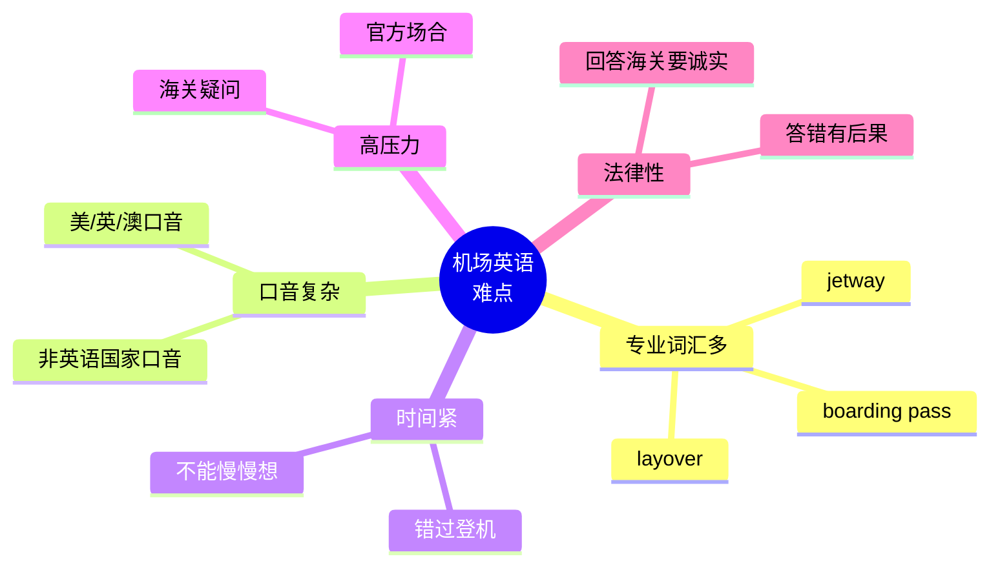

# 机场航班海关入境场景

> [!info] 本篇定位
> 欢迎进入 **08.出行与旅游场景实战** 分类！
>
> 这一篇是**出国第一关**——机场。
>
> 中国学生在国外机场最常见的尴尬：
>
> - 值机时听不懂 "Window or aisle?"
> - 安检时不知道要脱鞋脱腰带
> - 海关问 "What's the purpose of your visit?" 紧张到说错
> - 行李丢了不知道怎么报失
>
> 一次顺畅的国际航班可能涉及：**值机 → 行李托运 → 安检 → 候机 → 登机 → 飞机上 → 转机 → 海关 → 提取行李** ——9 个环节都要英语沟通。
>
> 本篇覆盖**机场全流程**，**350+ 词汇** + **80+ 句型** + **15+ 真实对话**。

---

## 1. 本篇导读：机场英语为什么紧张

### 1.1 机场英语 5 大难点



### 1.2 一次完整国际航班流程

```
1. 在线值机/到机场办登机牌
2. 行李托运 (check-in baggage)
3. 安检 (security)
4. 候机 (boarding gate)
5. 登机 (boarding)
6. 飞机上 (in-flight)
7. (中转机场转机 layover)
8. 抵达 (arrival)
9. 海关入境 (customs / immigration)
10. 提取托运行李 (baggage claim)
11. 出关 (exit)
```

---

## 2. 机场预订与值机（Check-in）

### 2.1 机场预订词汇

```
flight                  (航班)
ticket                  (机票)
booking / reservation   (预订)
e-ticket                (电子机票)
boarding pass           (登机牌)
seat                    (座位)
window seat             (靠窗座)
aisle seat              (靠过道座)
middle seat             (中间座)
emergency exit row      (紧急出口排)
upgrade                 (升舱)
economy / business / first class  (经济/商务/头等舱)
direct flight           (直飞)
non-stop flight         (直飞)
connecting flight       (中转航班)
layover                 (中转停留)
red-eye flight          (红眼航班，夜间)
```

### 2.2 值机柜台对话句型

**柜台员问**：
```
"Can I see your passport, please?"
"Where are you flying to today?"
"Are you checking any bags?"
"Window or aisle?"
"How many bags are you checking?"
"Do you have anything to declare?"        (有要申报的吗？)
"Is this your only bag?"
```

**你说**：
```
① I'd like to check in for my flight to [destination].

② Here's my passport / e-ticket.

③ I'd like a window seat, please.

④ I'm checking two bags.

⑤ I have one carry-on.

⑥ Could I get a seat near the front?

⑦ Is the flight on time?

⑧ What's the boarding time?

⑨ Which gate is it?

⑩ I have a connecting flight to [city].
```

### 2.3 完整值机对话

```
Agent：    "Hi, where are you flying to today?"
You：      "Los Angeles."
Agent：    "May I see your passport?"
You：      "Sure, here you go."
Agent：    "Are you checking any bags?"
You：      "Yes, just this one."
Agent：    "Please put it on the scale. ... It's 23 kilos.
           That's within the limit."
You：      "Great. I have a backpack as carry-on."
Agent：    "That's fine. Window or aisle?"
You：      "Aisle, please."
Agent：    "Got it. Here's your boarding pass. Boarding starts at
           gate 23 at 2:30 PM, and the flight departs at 3:00 PM."
You：      "Thank you. Where's gate 23?"
Agent：    "Through security, follow the signs to your right.
           Have a great flight!"
You：      "Thanks!"
```

### 2.4 行李超重/超尺寸

```
Agent：    "I'm sorry, your bag is over the weight limit."
You：      "How much over?"
Agent：    "5 kilos over. There's a $50 overweight fee."
You：      "Can I move some items to my carry-on?"
Agent：    "Yes, you can repack here."

(after repacking)

Agent：    "Now it's 22 kilos, within limit."
You：      "Great, thanks."
```

---

## 3. 行李托运（Checking In Baggage）

### 3.1 行李词汇

```
baggage / luggage             (行李)
suitcase                      (行李箱)
duffel bag                    (旅行袋)
backpack                      (背包)
carry-on                      (随身行李)
checked baggage               (托运行李)
baggage allowance             (行李额)
overweight                    (超重)
oversized                     (超尺寸)
fragile                       (易碎)
hazardous materials           (危险品)
liquids                       (液体)
batteries                     (电池)
sharp objects                 (尖锐物)
prohibited items              (禁运物品)
baggage claim tag             (行李条)
```

### 3.2 行李规定常用句型

```
"What's the baggage allowance?"
"Is it within the weight limit?"
"How heavy can my carry-on be?"
"Are batteries allowed in checked bags?"
"Can I bring this in carry-on?"
"This is fragile, please mark it."
"Where can I find my baggage tag?"
```

### 3.3 各航空公司常见行李规定

```
经济舱常见：
- 1 件 carry-on (≤7kg / 22 inches)
- 1 件 personal item (背包/手提包)
- 1 件 checked bag (≤23kg) - 部分免费

注意：
- 美国国内航线：通常都收 checked bag 费 ($30-40)
- 国际航线：常常 1 件免费
- 廉价航空：收所有费用
```

---

## 4. 安检（Security Check）

### 4.1 安检词汇

```
security checkpoint        (安检点)
TSA (美国 Transportation Security Administration)
metal detector             (金属探测器)
body scanner               (身体扫描仪)
X-ray machine              (X 光机)
bin / tray                 (托盘)
liquids bag                (液体袋)
laptop                     (笔记本电脑)
electronics                (电子产品)
boarding pass              (登机牌)
ID                         (身份证)
prohibited                 (禁止)
random check               (随机检查)
pat-down                   (拍身搜查)
```

### 4.2 安检员的指令

```
"Please remove your shoes."           (请脱鞋)
"Take off your belt and jacket."      (脱腰带和外套)
"Empty your pockets."                  (掏空口袋)
"Take out your laptop."                (拿出电脑)
"Liquids in a separate bin."           (液体放另一个托盘)
"Step forward, arms up."               (向前一步，举起手臂)
"Walk through, please."                (请走过来)
"Step over here."                      (到这边来)
"Open your bag, please."               (请打开行李)
"Whose bag is this?"                   (这是谁的包？)
```

### 4.3 你的回应

```
"Sure, no problem."
"Yes, of course."
"It's mine."
"What's the issue?"
"Do you need to inspect my bag?"
"What did the scanner pick up?"        (扫描仪检测到什么？)
"Sorry, I forgot about that."
```

### 4.4 完整安检对话

```
Agent：    "Boarding pass and ID, please."
You：      "Here you go."
Agent：    "Remove your shoes, belt, and any electronics from
           your bag."
You：      "OK."

(at scanner)

Agent：    "Step forward, arms up."

(after scan)

Agent：    "Step over here."
You：      "What's wrong?"
Agent：    "We need to do a quick pat-down. The scanner picked up
           something on your pocket."
You：      "Oh, I think it's my house key."

(pat-down)

Agent：    "OK, you're cleared. Have a good flight!"
You：      "Thanks!"
```

### 4.5 液体规则（重要）

> [!warning] 液体规则 (3-1-1 in US)
>
> - **每瓶 ≤ 100ml** (3.4 oz)
> - **所有液体放进 1 个 1-quart (1L) 透明袋**
> - **每人 1 袋**
>
> 包括：水、化妆品、牙膏、防晒霜、酒精洗手液...
>
> **解决方案**：
> - 大瓶液体托运
> - 过安检后买矿泉水
> - 化妆品买**旅行装** (travel size)

---

## 5. 候机厅与登机（Boarding）

### 5.1 候机厅词汇

```
boarding gate               (登机口)
gate                        (闸口，常见)
departure                   (出发)
departure time              (出发时间)
boarding time               (登机时间)
departure board             (出发显示屏)
delayed                     (延误)
on time                     (准点)
cancelled                   (取消)
boarding now                (正在登机)
final call                  (最后通知)
priority boarding           (优先登机)
zone / group                (登机分组)
gate change                 (改登机口)
```

### 5.2 登机广播听力

```
"Now boarding flight [number] to [destination] at gate [X]."
   (前往 X 的航班 X 现在开始登机，X 号登机口)

"Now boarding zone 1."
"Now boarding rows 25 and back."         (25 排往后开始登机)
"Final call for flight..."
"This is the last boarding call..."
"Please proceed to gate 23 immediately."
```

### 5.3 登机口对话

```
Agent：    "Boarding pass, please."
You：      "Here it is."
Agent：    "(scans) Have a great flight!"
You：      "Thanks!"

如果出问题：
Agent：    "I'm sorry, your boarding pass shows zone 4. We're
           still on zone 2."
You：      "Oh sorry, I'll wait."
```

### 5.4 改签/换座

```
"Can I get on an earlier flight?"
"Are there any other flights to [city] today?"
"Can I switch seats?"
"Is there an aisle seat available?"
"My friend and I want to sit together."
```

---

## 6. 飞机上（On the Plane）

### 6.1 飞机上词汇

```
cabin crew / flight attendant     (空乘)
captain                            (机长)
first officer                      (副机长)
overhead bin                       (头顶储物柜)
seatbelt                           (安全带)
tray table                         (折叠小桌)
window shade                       (遮光板)
armrest                            (扶手)
recline                            (后仰)
lavatory / restroom                (厕所)
oxygen mask                        (氧气面罩)
life vest                          (救生衣)
emergency exit                     (紧急出口)
turbulence                         (颠簸)
```

### 6.2 找座位

```
"Excuse me, I think this is my seat."
"Could I get by?"               (能让我过一下吗？)
"Sorry, what seat number is this?"
"Could you swap seats with me?"  (能换座位吗？)
"My family is sitting separately, would you mind switching?"
```

### 6.3 餐饮服务

**空乘问**：
```
"Beef or chicken?"
"Would you like something to drink?"
"Coffee, tea, or juice?"
"Anything to eat?"
"Are you finished?"
```

**你说**：
```
① I'll have the chicken, please.

② Could I have water?

③ Coffee with cream and sugar.

④ Just black, thanks.

⑤ Could I get an extra blanket?

⑥ Could I have the beef without the gravy?

⑦ I'm vegetarian, do you have any options?

⑧ Could I have a snack later?

⑨ Could you take this away?

⑩ Could I get another drink?
```

### 6.4 提出请求

```
"Excuse me, could you help me with my bag?"
"How long until we land?"
"What time will we arrive?"
"Could I have a pair of headphones?"
"My screen isn't working."
"Could I get a pillow?"
"Could you turn down the AC?"
"My TV remote isn't working."
```

### 6.5 不舒服 / 紧急情况

```
"I'm not feeling well."
"I feel airsick."           (晕机)
"Could I have a sick bag?"
"My ears are popping."      (耳朵不适)
"I need to use the lavatory."
"Excuse me, I'd like to get up."
```

### 6.6 完整飞机上对话

```
Crew：     "Welcome aboard! Your seat is on the left."
You：      "Thank you."

(after takeoff)

Crew：     "Beef or chicken?"
You：      "I'll have the chicken, please."
Crew：     "And to drink?"
You：      "Could I have a Coke?"
Crew：     "With ice?"
You：      "Yes, please. And could I have an extra napkin?"
Crew：     "Of course."

(later)

You：      "Excuse me, my screen isn't working."
Crew：     "Let me try to reset it. ... Try now."
You：      "Still not working."
Crew：     "I'm sorry. We can offer you a pair of headphones for
           the audio, or move you if there's an empty seat."
You：      "I'd love to move if possible."
Crew：     "There's one in row 30."
You：      "Great, thanks!"
```

---

## 7. 转机（Connecting Flight）

### 7.1 转机词汇

```
layover                   (停留转机)
connecting flight         (转机航班)
gate connection           (闸口连接)
international transfer    (国际转机)
domestic transfer         (国内转机)
re-check baggage          (重新托运)
transit                   (过境)
```

### 7.2 转机对话

```
You：     "Excuse me, I have a connecting flight to Paris.
          Where do I go?"
Agent：   "Are you with the same airline?"
You：     "Yes."
Agent：   "Then follow the signs for 'Connecting Flights'."
You：     "Do I need to pick up my luggage?"
Agent：   "No, your bag is checked through to Paris."
You：     "How long is my layover?"
Agent：   "Two hours. You should be fine."
You：     "Where's my next gate?"
Agent：   "Check the departure board after security."
```

### 7.3 转机时间紧

```
"My connection is in 30 minutes!"
"How do I get to gate B12 fast?"
"Is there a shortcut?"
"Will the gate hold for me?"
"Can I get priority through security?"
"I'm going to miss my flight."
```

### 7.4 错过航班

```
You：     "I missed my flight."
Agent：   "What was the flight number?"
You：     "AA123 to Chicago."
Agent：   "Let me see... we can rebook you on the next flight at
          5 PM. Or there's one at 7 PM if you prefer."
You：     "5 PM is fine. Is there a fee?"
Agent：   "Since the previous flight was delayed, we'll waive
          the fee. Here's your new boarding pass."
You：     "Thank you so much!"
```

---

## 8. 海关与入境（Customs & Immigration）

### 8.1 海关词汇

```
immigration                (移民/入境)
customs                    (海关)
border control             (边境管制)
customs declaration        (海关申报单)
visa                       (签证)
passport                   (护照)
landing card               (入境卡)
arrival card               (抵达卡)
purpose of visit           (访问目的)
duration of stay           (停留时间)
declare                    (申报)
nothing to declare         (无需申报)
prohibited                 (禁运)
duty-free                  (免税)
```

### 8.2 海关官员的标准问题

**核心 10 问**：

```
① "Passport, please."
② "What's the purpose of your visit?"
③ "How long are you staying?"
④ "Where will you be staying?"
⑤ "Is this your first time visiting?"
⑥ "Do you have a return ticket?"
⑦ "Are you here for business or pleasure?"
⑧ "Do you have anything to declare?"
⑨ "How much money are you carrying?"
⑩ "What do you do for a living?"
```

### 8.3 标准回答模板

**访问目的**：
```
"Tourism."                 (旅游)
"Business."                (商务)
"Visiting family."         (探亲)
"Studying."                (留学)
"Medical treatment."       (就医)
"Conference."              (会议)
"Vacation."                (度假)
```

**停留时间**：
```
"Two weeks."
"Ten days."
"A month."
"Three months."
"I'll be here until [date]."
```

**住处**：
```
"At a hotel called [Name]."
"At my friend's house."
"With my family in [city]."
"Airbnb in [neighborhood]."
"I'll show you the address." (拿出住址)
```

### 8.4 完整海关对话

**第一次入境美国**：

```
Officer：  "Passport, please."
You：      "Here you go."
Officer：  "What's the purpose of your visit?"
You：      "Tourism."
Officer：  "How long will you be in the US?"
You：      "Two weeks."
Officer：  "Where will you be staying?"
You：      "Marriott Hotel in New York."
Officer：  "Do you have a return ticket?"
You：      "Yes, here it is."
Officer：  "What do you do for a living?"
You：      "I'm a software engineer."
Officer：  "Have you been to the US before?"
You：      "No, this is my first time."
Officer：  "Anything to declare?"
You：      "No, nothing."
Officer：  "(stamps passport) Welcome to the United States.
           Enjoy your stay."
You：      "Thank you!"
```

### 8.5 应对刁钻问题

如果官员问得很多很细：

> [!tip] 海关问询心法
>
> 1. **保持冷静**：紧张反而显得可疑
> 2. **回答简短**：不要主动透露太多
> 3. **如实回答**：撒谎会有严重后果
> 4. **听不懂时**：礼貌请求重复
>    "Could you please repeat that?"
>    "Sorry, I didn't catch that."
> 5. **不会说时**：用简单句子
>    "I am visiting friends."

```
官员问：    "What's the relationship of this 'friend'?"
你说：      "We met in college."

官员问：    "Show me their phone number."
你说：      "Of course, here it is."

官员问：    "How much cash do you have?"
你说：      "About $2,000."         (如实回答)
```

### 8.6 海关检查行李

```
Officer：  "Open your bag, please."
You：      "Sure."
Officer：  "What's this?"
You：      "Tea I brought from China."
Officer：  "Any meat or fruits?"
You：      "No."
Officer：  "Any cash over $10,000?"
You：      "No, just $2,000."
Officer：  "OK, you're all set."
```

---

## 9. 提取行李（Baggage Claim）

### 9.1 提取行李词汇

```
baggage claim          (行李提取处)
carousel               (传送带)
luggage cart           (行李推车)
baggage tag            (行李条)
lost and found         (失物招领)
oversized luggage      (超尺寸行李)
trolley                (推车)
```

### 9.2 找传送带

```
"Which carousel is for flight [number]?"
"Where's the baggage claim?"
"My flight was [number], where do I pick up my bag?"
```

### 9.3 找不到行李

```
You：     "Excuse me, my bag didn't come out on the carousel."
Agent：   "When did your flight arrive?"
You：     "About 30 minutes ago, flight [number]."
Agent：   "Let me check. ... Your bag is still in [city].
          It will arrive on the next flight."
You：     "Will it be delivered to my hotel?"
Agent：   "Yes. Can you fill out this form with your details?"
You：     "Sure. When will I get my bag?"
Agent：   "Tomorrow morning."
```

---

## 10. 行李丢失/损坏（Lost/Damaged Baggage）

### 10.1 报失行李

```
"My bag is missing."
"My luggage didn't arrive."
"I think my bag is lost."
"How do I report a missing bag?"
"What's the procedure?"
"How long does it usually take to find?"
```

### 10.2 行李损坏

```
"My bag is damaged."
"The wheels are broken."
"There's a hole in my suitcase."
"Some items are missing."
"My bag was opened."
"I want to file a damage report."
```

### 10.3 完整报失对话

```
You：     "Hi, my bag didn't come out at baggage claim."
Agent：   "What's your flight number?"
You：     "AA123 from Tokyo."
Agent：   "Let me look you up. ... Your bag is in Los Angeles.
          It missed the connection."
You：     "What happens now?"
Agent：   "We'll deliver it to your address tomorrow. Could you
          fill out this form?"
You：     "Sure. (filling) ... Done. Will I get a tracking number?"
Agent：   "Yes, here. You can call this number to track."
You：     "What if it doesn't arrive?"
Agent：   "Most bags are found within 24-48 hours. If it's not
          found in 5 days, we'll process a compensation claim."
You：     "Thank you. What's the compensation?"
Agent：   "Up to $1,500 for international flights, depending on
          contents and value."
You：     "OK, thanks."
```

---

## 11. 飞机延误/取消（Flight Delays/Cancellations）

### 11.1 延误词汇

```
delayed                (延误)
cancelled              (取消)
diverted               (改道)
on time                (准点)
estimated time of arrival (ETA, 预计到达)
estimated time of departure (ETD)
weather                (天气)
mechanical issue       (机械问题)
crew shortage          (机组短缺)
voucher                (代金券)
compensation           (赔偿)
hotel accommodation    (酒店住宿)
meal voucher           (餐券)
rebook                 (改签)
```

### 11.2 延误时的句型

```
"How long is the delay?"
"What caused the delay?"
"Will I miss my connection?"
"Will I get compensation?"
"Will you put me on the next flight?"
"Will you provide a hotel?"
"Can I get a meal voucher?"
"Can I cancel and get a refund?"
```

### 11.3 完整延误对话

```
You：     "Excuse me, my flight is delayed. What's going on?"
Agent：   "Yes, there's a 4-hour delay due to weather."
You：     "I have a connecting flight in [city] that I'll miss."
Agent：   "Let me check. ... I can rebook you on the next morning's
          flight."
You：     "What about tonight's accommodation?"
Agent：   "We'll provide a hotel and meal vouchers."
You：     "Where do I pick those up?"
Agent：   "I'll print them for you. Just go to the desk near gate
          B12 to claim them."
You：     "What about compensation?"
Agent：   "Since this is weather-related, no monetary compensation,
          but we cover lodging and meals."
You：     "OK, that's fair."
```

### 11.4 飞机取消

```
You：     "My flight is cancelled. What are my options?"
Agent：   "We can rebook you on the next available flight,
          tomorrow at 9 AM. Or you can get a full refund."
You：     "I'd like to be rebooked."
Agent：   "Sure. We'll provide a hotel and meals tonight."
```

---

## 12. 机场设施（Airport Facilities）

### 12.1 机场常见设施

```
information desk           (问询处)
currency exchange          (货币兑换)
ATM                        (自动柜员机)
duty-free shop             (免税店)
restroom                   (洗手间)
charging station           (充电站)
lounge                     (贵宾厅)
prayer room                (祈祷室)
nursing room               (母婴室)
smoking area               (吸烟区)
WiFi                       (无线网)
free WiFi                  (免费 WiFi)
```

### 12.2 机场问路

```
"Excuse me, where's the [bathroom/exit/gate B12]?"
"How do I get to terminal 2?"
"Is there a [coffee shop/ATM] nearby?"
"Where can I exchange money?"
"Where's the [airline] check-in counter?"
"How long does it take to get to the gate?"
```

---

## 13. 重要文化差异

### 13.1 美国机场特点

```
- 安全检查严格
- 必须脱鞋脱腰带
- TSA Pre-Check 可加快
- 国内航线常常无餐饮
- 充电站丰富
```

### 13.2 欧洲机场特点

```
- 申根区内部无海关
- 海关 / 安检相对快
- WiFi 普遍免费
- 餐饮选择丰富
```

### 13.3 亚洲机场特点

```
- 服务热情
- 非常干净
- 设施先进
- 转机方便
```

### 13.4 海关回答的"三不要"

```
1. 不要开玩笑：
   ❌ "What's in your bag?" "A bomb!" (笑话)
   → 海关零容忍，会被拘留。

2. 不要否认实物：
   行李里有食物 → 必须申报，否则可能罚款。

3. 不要自作聪明：
   不要试图绕过提问，简短诚实回答最好。
```

---

## 14. 常见错误大盘点

### 14.1 错误 1：值机时听不清座位

```
"Window or aisle?" (靠窗还是过道?)

注意：
window = 靠窗
aisle = 靠过道
middle = 中间（最不受欢迎）

不要回答 "yes"，要回答 "Window, please."
```

### 14.2 错误 2：海关 "Tourist" vs "Tourism"

```
错误：Why are you here? "Tourist." (我是游客 - 但语法不对)
正确：Why are you here? "Tourism." (旅游)
正确：What's your purpose? "Tourism" / "Travel"
```

### 14.3 错误 3：忘记申报

```
带食品 / 现金 > $10,000 / 药品 → 必须申报。
不申报被发现 = 重罚 / 拘留 / 拒绝入境。

宁可申报多，不可漏申报。
```

### 14.4 错误 4：海关说太多

```
你只需回答问题，不需要解释。

问："How long are you staying?"
✅ "Ten days."
❌ "Ten days because my friend has a wedding and we'll go to Vegas
    and..."
```

### 14.5 错误 5：登机后玩手机

```
飞机上不能用蜂窝信号 (cellular data)
但可以用：
- 飞行模式 (Airplane mode) + WiFi
- 飞行模式下基本游戏 / 阅读
```

### 14.6 错误 6：行李超重不知道处理

```
解决方案：
1. 部分物品移到 carry-on
2. 部分物品穿上 / 提手提包
3. 支付超重费
4. 现场扔掉非必需品
```

### 14.7 错误 7：到登机口才发现登机口变了

```
入登机口前看：
- 显示屏 (departure board)
- 登机牌（可能不是最新的）

广播：
"Gate change for flight [X]: now boarding from gate B23."
要听清楚！
```

---

## 15. 练习与输出建议

> [!success] 本篇练习清单
>
> **基础练习**
>
> 1. 准备**机场必备 50 词**：飞机/座位/行李/海关/入境
>
> 2. 准备一个**完整海关问答模板**（10 问 10 答）
>
> 3. 写出 **5 个值机时常用句型** + **5 个登机时常用句型**
>
> **场景模拟**
>
> 4. 模拟 5 个对话：
>    - 值机柜台
>    - 安检
>    - 飞机上要求
>    - 海关入境
>    - 行李丢失报失
>
> **角色扮演**
>
> 5. 让 AI 扮演**海关官员**，问你 10 个问题，模拟练习。
>
> **写作练习**
>
> 6. 写一段 200 词英文短文：
>    - "My most stressful airport experience"
>    - "How to survive a long layover"
>
> **长期任务**
>
> 7. 看一部机场题材电影（如 The Terminal / Up in the Air），
>    记录所有航空英语。
>
> 8. 在网上**用英文订一次国际机票**，全程英文操作。

---

## 16. 本篇小结

> [!success] 本篇核心要点回顾
>
> **机场流程 11 步**：
> 值机 → 行李 → 安检 → 候机 → 登机 → 飞机上 → 转机 → 海关 → 提行李 → 报失（如有）
>
> **值机**：
> - Window or aisle / Are you checking bags / Boarding gate
>
> **安检 (TSA)**：
> - Remove shoes/belt/laptop / Empty pockets / 3-1-1 液体规则
>
> **登机**：
> - Boarding now / Final call / Zone / Group
>
> **飞机上**：
> - Beef or chicken / Coffee, tea, or juice / Lavatory
>
> **海关 10 问**：
> - Purpose / Duration / Where staying / Return ticket / Anything to declare
>
> **行李丢失**：
> - File a report / Tracking / Compensation
>
> **航班延误/取消**：
> - Hotel voucher / Meal voucher / Rebook
>
> **海关 3 不要**：不开玩笑 + 不否认实物 + 不自作聪明
>
> **重要文化**：
> - 美国 TSA 严格
> - 欧洲申根区无海关
> - 海关问询：诚实简短

### 16.1 下一篇预告

> [!info] 下一篇：02.酒店入住预订与投诉场景
>
> 下一篇讲**酒店场景**：
>
> - **酒店预订**：在线/电话/前台预订
> - **入住 Check-in**：填表/房卡/早餐
> - **房间问题**：空调坏了/Wi-Fi 不通/没有热水
> - **客房服务**：Room Service / 加洗衣
> - **退房 Check-out**：账单/小费/打车
>
> 这一篇让你**酒店住得舒服**。
