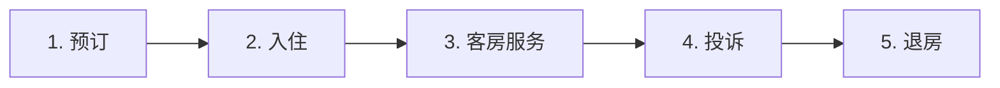

# 酒店入住预订与投诉场景

> [!info] 本篇定位
> 出国旅行 / 出差，**酒店是你的第二个家**。
>
> 一次酒店入住可能涉及：**预订 → 入住 → 房间服务 → 投诉 → 退房** 5 个环节，每个都需要英语沟通。
>
> 中国学生常见困扰：
>
> - 预订时听不懂房型术语（King vs Queen）
> - Check-in 时不会问早餐时间
> - 房间问题不知道怎么投诉
> - 退房时账单出错不会理论
>
> 本篇覆盖**酒店全流程**，**300+ 词汇** + **80+ 句型** + **15+ 真实对话**。

---

## 1. 本篇导读：酒店英语 5 大场景



---

## 2. 酒店类型与房型词汇

### 2.1 酒店类型

```
hotel                       (酒店)
motel                       (汽车旅馆，路边)
B&B (bed and breakfast)     (民宿)
hostel                      (青年旅舍)
resort                      (度假村)
boutique hotel              (精品酒店)
5-star hotel                (五星级)
budget hotel                (经济型)
luxury hotel                (奢华酒店)
inn                         (小客栈)
guesthouse                  (家庭旅馆)
Airbnb                      (爱彼迎)
serviced apartment          (酒店式公寓)
```

### 2.2 房型（Room Types）

```
single room                 (单人间)
double room                 (双人间——一张大床)
twin room                   (双床房——两张单人床)
queen room                  (大床房——queen size)
king room                   (大床房——king size)
suite                       (套房)
deluxe room                 (豪华房)
executive suite             (行政套房)
penthouse                   (顶层套房)
connecting rooms            (相连房)
```

### 2.3 床的尺寸

```
twin / single bed       (单人床, 39"x75")
full / double bed       (双人床, 54"x75")
queen bed              (Queen 床, 60"x80")
king bed               (King 床, 76"x80")
California king        (加州 King, 72"x84")
```

### 2.4 房间设施词汇

```
Wi-Fi                       (无线网)
TV                          (电视)
mini bar                    (迷你吧)
safe                        (保险箱)
fridge                      (冰箱)
coffee maker                (咖啡机)
hair dryer                  (吹风机)
iron                        (熨斗)
balcony                     (阳台)
view                        (景观)
ocean view / sea view       (海景)
mountain view               (山景)
city view                   (城市景观)
non-smoking                 (无烟)
soundproof                  (隔音)
air conditioning            (空调)
heating                     (暖气)
```

### 2.5 浴室词汇

```
bathroom                    (浴室)
shower                      (淋浴)
bathtub                     (浴缸)
toilet                      (马桶)
sink                        (洗手池)
towel                       (毛巾)
toiletries                  (洗漱用品)
shampoo                     (洗发水)
conditioner                 (护发素)
body wash                   (沐浴露)
soap                        (肥皂)
toothbrush                  (牙刷)
toothpaste                  (牙膏)
slippers                    (拖鞋)
robe                        (浴袍)
```

---

## 3. 酒店预订（Reservation）

### 3.1 在线预订常见词汇

```
search                      (搜索)
filter                      (筛选)
sort                        (排序)
amenities                   (设施)
breakfast included          (含早餐)
free cancellation           (免费取消)
non-refundable              (不可退款)
booking confirmation        (预订确认)
reservation number          (预订号)
guest name                  (入住人姓名)
check-in date               (入住日期)
check-out date              (离店日期)
total price                 (总价)
taxes and fees              (税费)
loyalty program             (常客计划)
points                      (积分)
free night                  (免费夜)
```

### 3.2 电话预订

```
You：     "Hi, I'd like to make a reservation."
Hotel：   "Sure. For what dates?"
You：     "Check in May 15, check out May 18."
Hotel：   "How many guests?"
You：     "Just me."
Hotel：   "What type of room?"
You：     "A king room with city view, please. Non-smoking."
Hotel：   "Let me check availability... Yes, we have one
          available at $200 per night."
You：     "Is breakfast included?"
Hotel：   "Yes, complimentary breakfast for one."
You：     "Great, I'll book it."
Hotel：   "Could I get your name and credit card to hold the room?"
You：     "Sure, my name is John Smith. (gives card details)"
Hotel：   "Confirmed. Your reservation number is XYZ123. Looking
          forward to your stay."
You：     "Thank you!"
```

### 3.3 预订核心句型（15 个）

```
① I'd like to book a room.

② Do you have a room available for [dates]?

③ What types of rooms do you have?

④ How much is a [type] room?

⑤ Is breakfast included?

⑥ Are there any extra fees?

⑦ What's your cancellation policy?

⑧ Is there a discount for [longer stay]?

⑨ Do you have any rooms with a [view / balcony]?

⑩ Is the hotel wheelchair accessible?

⑪ Is there free parking?

⑫ Is there a pool / gym?

⑬ How far is it from the airport / city center?

⑭ Could I get a non-smoking room?

⑮ Could you confirm by email?
```

### 3.4 修改/取消预订

```
"I'd like to change my reservation."
"Could I push my check-in date?"        (能延迟入住吗?)
"Could I extend my stay by one night?"  (延长一晚?)
"I need to cancel my reservation."
"What's your cancellation fee?"
"Is it too late to cancel?"
"Can I get a refund?"
```

---

## 4. 入住 Check-in

### 4.1 Check-in 流程

```
1. 到达前台 (Front desk / Reception)
2. 报姓名/订单号
3. 出示证件 (ID/Passport)
4. 押金 (Deposit) 或信用卡授权
5. 拿房卡 (Room key / Key card)
6. 了解设施
7. 上楼 (Take the elevator)
```

### 4.2 前台对话

```
You：     "Hi, I'd like to check in."
Reception："Welcome! Could I have your name?"
You：     "John Smith. I have a reservation."
Reception："Let me find you. ... Yes, three nights, king room.
          Could I see your passport / ID?"
You：     "Here you go."
Reception："I'll need a credit card for incidentals."
You：     "Here's my card."
Reception："Great. Here are your two key cards. You're in room 504.
          Wi-Fi password is on the back of the card. Breakfast is
          from 6 to 10 AM in the restaurant on the second floor."
You：     "Thanks. What time is checkout?"
Reception："11 AM. If you need a late checkout, just call the
          front desk in the morning."
You：     "Got it. Is there anything else I should know?"
Reception："The pool is on the rooftop, open until 10 PM. The gym
          is on the basement, 24 hours. Let me know if you need
          anything else."
You：     "Thanks!"
```

### 4.3 Check-in 句型（15 个）

```
① I have a reservation under [Name].

② I'd like to check in.

③ Here's my passport.

④ Could I get a non-smoking room?

⑤ Could I get a higher floor?
   (能给个高楼层吗?)

⑥ Is breakfast included?

⑦ What time does breakfast start?

⑧ Where's the breakfast served?

⑨ Is there free Wi-Fi?

⑩ What's the Wi-Fi password?

⑪ Do you have a gym / pool / spa?

⑫ Is there a shuttle to the airport?

⑬ How does the air conditioning work?

⑭ Could you call me a taxi tomorrow morning?

⑮ Could I have an extra key card?
```

### 4.4 特殊请求

```
"Could I have a room away from the elevator?"  (远离电梯)
"Could I have a quiet room?"
"I need a room with a bathtub, not just a shower."
"My friend is celebrating a birthday, can you arrange something?"
"I'd like a wake-up call at 6 AM."          (叫醒服务)
"Is it possible to upgrade my room?"        (能升级吗?)
"Could I have an extra bed?"                  (加床)
"Is there an iron in the room?"
```

### 4.5 提前/延后 Check-in

```
"I'm arriving early. Can I check in?"
"Could I store my luggage until my room is ready?"
"What time can I check in?"
"My flight is delayed. Can I check in late?"
"I'm arriving at 11 PM. Will reception be open?"
```

---

## 5. 客房服务（Room Service）

### 5.1 客房服务词汇

```
room service                (客房送餐)
housekeeping                (客房清洁)
laundry service             (洗衣服务)
turndown service            (晚间整理床)
do not disturb              (请勿打扰)
make up the room            (整理房间)
dry cleaning                (干洗)
ironing                     (熨衣服)
shoe shine                  (擦鞋)
concierge                   (礼宾员)
bell desk                   (行李员)
valet parking               (代客泊车)
```

### 5.2 点客房送餐

```
You：     "Hi, I'd like to order room service."
Hotel：   "What's your room number?"
You：     "504."
Hotel：   "What would you like?"
You：     "I'll have the cheeseburger and a Coke."
Hotel：   "Anything else?"
You：     "And a slice of cheesecake."
Hotel：   "Will that be all?"
You：     "Yes."
Hotel：   "Total is $35 plus 18% service charge. We'll deliver in
          30 minutes. Charge to the room?"
You：     "Yes, please."
Hotel：   "It will be at your door in 30 minutes."
```

### 5.3 客房清洁

```
"Could you skip the cleaning today?"
"Could you come back later?"
"We're heading out, you can clean now."
"Could I get extra towels?"
"Could I have my bed turned down?"
"There's no toilet paper."
"Could you replace the [item]?"
```

### 5.4 洗衣服务

```
"I have some laundry for cleaning."
"How much does laundry service cost?"
"How long does it take?"
"I need this dry-cleaned."
"Is same-day service available?"
"Could I get my shirt ironed?"
"There's a stain, can it be removed?"
```

---

## 6. 房间问题与投诉（Complaints）

### 6.1 常见房间问题（20 个）

```
The AC isn't working.
The heater isn't working.
There's no hot water.
The TV doesn't turn on.
The Wi-Fi is too slow.
The Wi-Fi keeps dropping.
The toilet is clogged.
The shower is leaking.
The drain is slow.
The window won't open.
The door doesn't lock properly.
The room smells.
The room is dirty.
The bed is uncomfortable.
The pillows are too hard / soft.
The walls are too thin (我能听到隔壁).
The room is too noisy.
The room is too cold / hot.
There's a strange smell.
There are bugs in the room.
```

### 6.2 投诉句型（15 个）

```
① I have a complaint.

② I'm not happy with my room.

③ I'd like to report a problem.

④ Could you send someone to fix it?

⑤ When can someone come?

⑥ This isn't what I booked.

⑦ I paid for [X] but I got [Y].

⑧ I'd like to switch rooms.

⑨ Could you give me a different room?

⑩ I'd like a refund / discount.

⑪ This is unacceptable.

⑫ I'd like to speak to the manager.

⑬ I expected better service.

⑭ I want to make sure this is taken care of.

⑮ Can you compensate me for the trouble?
```

### 6.3 完整投诉对话

```
You：     "Hi, I'm calling from room 504. I have a problem."
Hotel：   "What's the issue?"
You：     "The air conditioning isn't working. The room is too hot."
Hotel：   "I apologize. Let me send someone right away."
You：     "How long will it take?"
Hotel：   "About 15 minutes."

(15 minutes later, technician arrives, can't fix it)

You：     "It's still not working. Could you move me to another room?"
Hotel：   "Of course. Pack your things, we'll move you to room 612.
          It's an upgraded suite, no extra charge."
You：     "Thank you. Could you also send someone to help with
          my luggage?"
Hotel：   "Right away. And we'll send a complimentary fruit basket
          to apologize for the inconvenience."
You：     "I appreciate that."
```

### 6.4 严重投诉的升级

```
You：     "I'd like to speak to the manager."
Manager： "Hello, I'm the duty manager. How can I help?"
You：     "I've had multiple problems with my room. The AC didn't
          work, the bathroom is dirty, and now the Wi-Fi is down.
          This is a 5-star hotel."
Manager： "I sincerely apologize. Let me make this right.
          We'll move you to a suite at no extra charge, comp your
          room for tonight, and add 5,000 loyalty points."
You：     "Thank you. That's acceptable."
Manager： "Again, I'm so sorry about your experience."
```

### 6.5 噪音投诉

```
You：     "Hi, the room next to mine is very loud. Could you ask
          them to keep it down?"
Hotel：   "I'll send security to check. ... The guests have been
          asked to be quiet. Let me know if it continues."
You：     "Thanks. If it continues, I might need to switch rooms."
Hotel：   "Of course, we have several available."
```

### 6.6 安全问题

```
"I lost my key card, could I get a new one?"
"Someone is knocking on my door, but I didn't order anything."
"I think there's a fire."
"My valuables are missing from my room."
"I'd like to file a police report."
"There's an emergency."
```

---

## 7. 酒店设施使用（Hotel Amenities）

### 7.1 健身房 / 泳池

```
"What time does the gym open?"
"Is the gym 24/7?"
"Is there an extra charge for the gym?"
"Where can I get a towel?"
"Is the pool heated?"
"Is the pool open today?"
"Are kids allowed in the pool?"
"What's the dress code for the pool?"
```

### 7.2 SPA / 按摩

```
"Could I book a massage?"
"What types of massages do you offer?"
"How much is a 60-minute massage?"
"Is there an opening this afternoon?"
"I'd like to add the spa package."
```

### 7.3 商务中心 / 会议室

```
"Where's the business center?"
"Could I print something?"
"Is there a printer in my room?"
"Could I rent a meeting room?"
"What's the rate per hour?"
"Does it have a projector?"
```

### 7.4 餐厅与酒吧

```
"What time does the restaurant open?"
"Could I make a reservation for tonight?"
"Is the bar open?"
"Could I add charges to my room?"
"Where's the breakfast room?"
"Is breakfast buffet or à la carte?"
```

### 7.5 礼宾员（Concierge）

```
"Could you recommend a good restaurant nearby?"
"How do I get to [tourist attraction]?"
"Could you book a tour for tomorrow?"
"Could you call a taxi for me?"
"Where can I exchange currency?"
"Could you make a dinner reservation for me?"
"Is the museum walking distance?"
"Could you arrange a car rental?"
```

---

## 8. 退房 Check-out

### 8.1 退房流程

```
1. 收拾行李
2. 打电话或下楼到前台
3. 办理 check-out
4. 检查账单
5. 付款（如未预付）
6. 退房卡
7. 离开
```

### 8.2 退房对话

```
You：     "Hi, I'd like to check out."
Reception："Sure. Room number?"
You：     "504."
Reception："Let me pull up your account. Did you use the mini bar?"
You：     "Yes, two waters and a Coke."
Reception："OK, that's $15. Did you use room service?"
You：     "Yes, $35 for dinner last night."
Reception："Got it. Your total is $635, $200 of which was
          authorized at check-in. Should I charge the same card?"
You：     "Yes, please."
Reception："One moment... here's your receipt. Need a printed copy
          or email?"
You：     "Email is fine."
Reception："Is there anything else?"
You：     "Could you call me a taxi?"
Reception："Of course. It'll be here in 5 minutes. Anything else?"
You：     "No, that's all. Thanks!"
Reception："Thank you for staying with us. Have a great trip!"
```

### 8.3 退房句型（15 个）

```
① I'd like to check out.

② Is there a late checkout option?

③ Could I have a copy of the bill?

④ Could you email me the receipt?

⑤ I think there's a mistake on my bill.

⑥ I didn't use the mini bar.

⑦ What's this charge for?

⑧ Could you remove this charge?

⑨ Could you charge it to the company card?

⑩ Could I leave my luggage here for a few hours?

⑪ Can someone help with my bags?

⑫ Where's the nearest taxi stand?

⑬ Do you have a shuttle to the airport?

⑭ I'll be back next week, can I leave a bag?

⑮ Thanks for the great stay!
```

### 8.4 账单争议

```
You：     "I see a $50 charge for the mini bar but I didn't use it."
Reception："Let me check. ... You're right, that was an error.
          I've removed it."
You：     "Also, I was told breakfast was included, but I see
          a $25 charge."
Reception："One moment. ... Yes, that should be complimentary.
          I'll remove it as well."
You：     "Thank you. The corrected total looks right now."
```

### 8.5 寄存行李

```
You：     "Could I leave my bags here? My flight isn't until 6 PM."
Reception："Of course. Just hand them to the bell desk.
          You'll get a claim ticket."
You：     "When can I pick them up?"
Reception："Anytime today before midnight."
```

---

## 9. 给小费（Tipping）

### 9.1 酒店小费指南

```
酒店行李员（带行李上楼）：       $1-2 per bag
代客泊车（valet）：              $2-5
礼宾员（订餐 / 推荐）：           $5-10 (复杂请求)
客房服务送餐：                   小费已含在 service charge
                                通常不再额外给
客房清洁（housekeeping）：        $2-5 per night
                                离开前留在床头
```

### 9.2 小费句型

```
"Thanks!" (给小费的同时说)
"Keep the change."
"Here's something for you."
```

### 9.3 留给客房清洁的字条

```
"Thank you for keeping our room nice!"
"Thanks for everything!" (with cash on top)
```

---

## 10. 民宿 / Airbnb（Vacation Rentals）

### 10.1 Airbnb 词汇

```
host                    (房主)
guest                   (租客)
self check-in           (自助入住)
key code                (密码锁)
key safe / lock box     (钥匙保险盒)
house rules             (家规)
quiet hours             (安静时段)
cleaning fee            (清洁费)
review                  (评价)
verified host           (认证房东)
superhost               (超赞房东)
```

### 10.2 与房东沟通

```
"What's the check-in process?"
"Where's the key?"
"Is there a parking spot?"
"What's the Wi-Fi password?"
"Are there extra blankets / pillows?"
"Where's the trash?"
"Could you recommend something nearby?"
"Could I check in early?"
"What time should I check out?"
"Should I take out the trash before leaving?"
```

### 10.3 Airbnb 完整对话（消息）

```
Host：    "Welcome! Check-in is from 3 PM. The key code is 1234.
         Once inside, please remove your shoes."
You：     "Thanks! Will be there at 4 PM."
Host：    "Sounds good. Wi-Fi password is on the table."

(later)

You：     "Hi, the AC isn't cooling well. Any tips?"
Host：    "Try setting it to 70°F. The vents need to be all open.
         Let me know if it doesn't work, I can come by."
You：     "Got it, will try."

(end of stay)

You：     "Thanks for the stay! Place was great."
Host：    "Thanks! Please leave the keys on the counter."
You：     "Will do!"
```

---

## 11. 完整酒店场景对话汇总

### 11.1 场景：5 星级酒店出差入住

```
Reception：  "Welcome to the Marriott. Checking in?"
You：        "Yes, John Smith."
Reception：  "Yes, three nights, executive suite. May I see your
             passport and credit card?"
You：        "Here."
Reception：  "Excellent. We've upgraded you to a corner suite with
             city view—you're a Platinum member."
You：        "Oh thank you!"
Reception：  "Your room is 1502 on the 15th floor. Here are two
             keys. The Executive Lounge is on the 30th floor,
             complimentary breakfast and evening cocktails for
             elite members."
You：        "Wonderful. What time does breakfast start?"
Reception：  "From 6:30 to 10 AM in the lounge. The main restaurant
             starts at 6 AM."
You：        "Thanks. Could you also book me a 7 AM taxi to the
             airport on Wednesday?"
Reception：  "Of course. We'll have it ready."
You：        "Thank you so much."
Reception：  "Have a great stay, Mr. Smith."
```

### 11.2 场景：度假村问题处理

```
You：     "Hi, I'm calling from villa 7. The pool's pump seems
          broken."
Resort：  "I'll send a technician immediately."

(2 hours later)

You：     "It's still not fixed."
Resort：  "I sincerely apologize. We're working on it. As
          compensation, we'd like to offer you a free dinner at
          our beach restaurant tonight."
You：     "I appreciate that. We were really looking forward to
          using the pool."
Resort：  "I understand. Once it's fixed, we'll let you know.
          And we'll waive the resort fee for tonight."
```

---

## 12. 文化差异提醒

### 12.1 美国酒店 vs 中国酒店

```
美国：
- 服务相对简单（不像亚洲酒店那么细致）
- 必须给小费
- 拖鞋 / 牙刷不一定提供
- check-in 要求押金

中国：
- 服务非常贴心
- 不需要小费
- 牙刷 / 拖鞋全套
- 押金现金或刷卡
```

### 12.2 早餐文化

```
美国早餐通常含：
- Eggs (鸡蛋多种做法)
- Bacon / Sausage
- Pancakes / Waffles
- Toast
- Cereal
- Yogurt
- Fruits
- Coffee / Tea / Juice

亚洲常见：
- 粥、面条、包子
- 鸡蛋、豆浆
- 西式 + 亚洲混合
```

### 12.3 拖鞋 / 浴袍

```
美国 / 欧洲：仅 4-5 星级提供
亚洲：几乎所有酒店提供
```

### 12.4 不许带食物上房

```
某些高端酒店：
- 不允许带外卖到房间
- 不允许放冰箱
- 客房送餐才行

注意房间规定。
```

---

## 13. 常见错误大盘点

### 13.1 错误 1：double room ≠ 双床房

```
double room = 一张大床
twin room = 两张单人床

很多中国学生订错。
```

### 13.2 错误 2：没看 cancellation policy

```
- Free cancellation: 可免费取消
- Non-refundable: 不可退款
- Partial refund: 部分退款

订房前必看，不然损失大。
```

### 13.3 错误 3：忘记给清洁小费

```
房间打扫完不留小费 = 部分国家被认为失礼。
建议：每天 $2-5 in cash on the bedside table。
```

### 13.4 错误 4：使用 mini bar 不知道收费

```
Mini bar 物品全部收费，且**比超市贵 3-5 倍**。
打开瓶子 = 算用过 = 收费。
```

### 13.5 错误 5：long-distance phone calls

```
酒店打长途电话**收费极高**。
建议：用手机 + WiFi 或 Skype。
```

### 13.6 错误 6：浴巾留在地上

```
某些酒店：地上的浴巾 = 要换
挂回原位 = 还要用，省水

留意房间内的小卡片提示。
```

### 13.7 错误 7：大门口 valet 给小费时机

```
开车送车 / 帮忙搬行李：当场给 ($2-5)
寄存车再取：取车时给 (而不是寄存时)
```

---

## 14. 练习与输出建议

> [!success] 本篇练习清单
>
> **基础练习**
>
> 1. 写出 **5 种房型** + **5 种床尺寸**的英文
>
> 2. 列出 **15 个房间问题**的英文表达
>
> 3. 准备一段 **完整的酒店预订对话**
>
> **场景模拟**
>
> 4. 模拟 5 个对话：
>    - 电话预订酒店
>    - Check-in
>    - 投诉房间问题
>    - 客房送餐
>    - Check-out + 账单争议
>
> **角色扮演**
>
> 5. 让 AI 扮演**前台**，进行 10 分钟酒店服务对话练习。
>
> **写作练习**
>
> 6. 写一封英文邮件给酒店 - 请求加床 / 升级
>
> 7. 写一段 200 词英文短文：
>    - "The best hotel I've stayed at"
>    - "How to handle a hotel complaint"
>
> **长期任务**
>
> 8. 在 booking.com / hotels.com 上**用英文订一次酒店**
>
> 9. 看一些 YouTube 上酒店 vlog，记录所有酒店相关词汇

---

## 15. 本篇小结

> [!success] 本篇核心要点回顾
>
> **酒店 5 大场景**：预订 → 入住 → 服务 → 投诉 → 退房
>
> **房型词汇**：
> - single / double / twin / queen / king / suite
> - twin = 两张床, double = 一张大床
>
> **预订**：
> - I'd like to book / breakfast included / cancellation policy
>
> **Check-in**：
> - I have a reservation / Could I get a non-smoking room
> - 房卡 / Wi-Fi 密码 / 早餐时间
>
> **客房服务**：
> - Room service / Housekeeping / Laundry
>
> **投诉**：
> - The AC isn't working / Could you fix / Move rooms / Manager
> - 严重投诉：升级 + 补偿
>
> **退房**：
> - Could I check out / 账单争议 / 寄存行李
>
> **小费**：
> - Bell hop $1-2/bag / Housekeeping $2-5/night / Valet $2-5
>
> **常见错误**：
> - double ≠ twin
> - mini bar 收费
> - 早餐 / 拖鞋因酒店级别而异
>
> **Airbnb 特点**：
> - 自助 check-in / 房主沟通 / 清洁费

### 15.1 下一篇预告

> [!info] 下一篇：03.公共交通打车与租车场景
>
> 下一篇讲**出行交通**：
>
> - **地铁 / 公交**：买票/坐车
> - **出租车**：拦车 / 给地址
> - **Uber / Lyft**：App 用法
> - **租车**：选车 / 还车 / 加油
> - **火车**：买票 / 找座位
>
> 这一篇让你**在国外出行无缝**。
