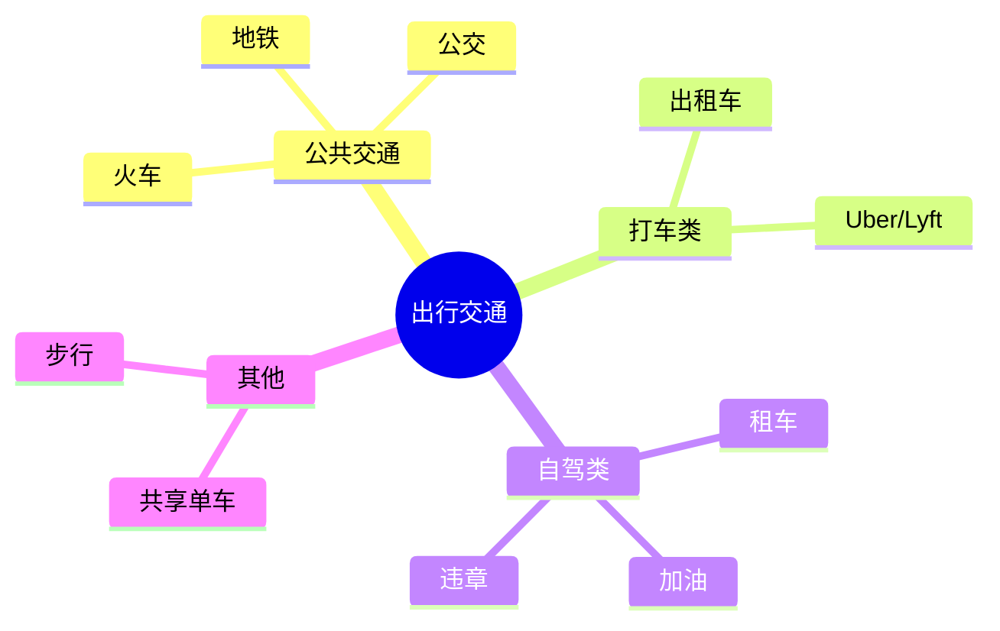

# 公共交通打车与租车场景

> [!info] 本篇定位
> 出国后**每天都要用**的场景——交通。
>
> 中国学生在国外出行的常见困扰：
>
> - 地铁买票看不懂英文界面
> - 出租车听不懂司机口音
> - 用 Uber 不会跟司机沟通
> - 租车不懂保险条款
> - 加油站全自助不知道怎么操作
>
> 本篇覆盖**6 大交通方式**：地铁/公交/出租/Uber/火车/租车 + **加油 + 违章事故**，是出国必备的"通行证"。

---

## 1. 本篇导读：交通英语全景

### 1.1 出行交通的多样性



### 1.2 不同国家的差异

```
美国：    自驾文化为主，公共交通有限
欧洲：    地铁/火车发达，自驾也方便
日本：    地铁极发达
英国：    公交+地铁+火车
澳洲：    自驾必备
```

---

## 2. 地铁（Subway / Metro / Tube / Underground）

### 2.1 各国地铁名称

```
US：     subway / metro
UK：     tube / underground
Paris：  metro
Tokyo：  subway
HK：     MTR
```

### 2.2 地铁基础词汇

```
station                  (车站)
line                     (线路)
platform                 (站台)
ticket                   (车票)
ticket machine           (售票机)
ticket booth             (售票窗口)
turnstile / fare gate    (闸机)
ticket inspector         (验票员)
fare                     (票价)
single ticket            (单程票)
return ticket            (往返票)
day pass                 (日票)
weekly pass              (周票)
monthly pass             (月票)
transfer                 (换乘)
exit                     (出口)
entrance                 (入口)
platform [number]        ([X] 号站台)
```

### 2.3 买票句型

```
"Where can I buy a ticket?"
"How do I use the ticket machine?"
"How much is a single to [destination]?"
"Could I get a day pass?"
"Where can I top up my card?"        (充值卡)
"Does this card work on the bus?"
"How long is the pass valid?"
```

### 2.4 问路句型（地铁）

```
① "Which line goes to [destination]?"

② "Do I need to transfer?"

③ "Where do I transfer?"

④ "How many stops to [station]?"

⑤ "Is this the right platform for [destination]?"

⑥ "Does this train go to [station]?"

⑦ "Which exit should I take for [place]?"

⑧ "How long does it take to get to [destination]?"

⑨ "Is the next train going to [direction]?"

⑩ "Does this train stop at [station]?"
```

### 2.5 完整地铁对话

```
You：     "Excuse me, how do I get to Times Square?"
Local：   "Take the [N/Q/R] line. It's three stops from here."
You：     "Which platform?"
Local：   "Platform 2, that way."
You：     "Do I need to buy a ticket?"
Local：   "Get a MetroCard from the machine. $2.75 per ride or
          $33 for a 7-day unlimited."
You：     "I'll be here for a week, so I'll go with the 7-day pass.
          Thanks!"
Local：   "No problem. The platform 2 is downstairs."
```

### 2.6 地铁问题处理

```
"The train didn't come."
"The train is delayed."
"I missed my stop."
"I went the wrong direction."
"My card isn't working."
"I lost my ticket."
"Where's the lost and found?"
```

---

## 3. 公交（Bus）

### 3.1 公交词汇

```
bus stop                 (公交站)
bus station              (公交总站)
bus route                (公交线路)
schedule / timetable     (时刻表)
fare                     (票价)
exact change             (零钱)
day pass                 (日票)
get on / off the bus     (上/下车)
front / back door        (前/后门)
driver                   (司机)
priority seat            (优先座)
stop button              (下车按钮)
```

### 3.2 上车 / 下车句型

```
"Does this bus go to [destination]?"
"How much is the fare?"
"Could you tell me when we get to [stop]?"
"Could you let me know when to get off?"
"This is my stop."                    (我要在这下)
"Could I get off here?"
"How many stops to [station]?"
```

### 3.3 完整公交对话

```
You：     "Excuse me, does this bus go to Central Park?"
Driver：  "Yes, it's about 8 stops."
You：     "How much is the fare?"
Driver：  "$2.75. Card or cash?"
You：     "I have a MetroCard."
Driver：  "Tap it on the reader. ... OK, beep!"
You：     "Could you let me know when we get to Central Park?"
Driver：  "Sure. I'll call it out."

(later)

Driver：  "Central Park, your stop!"
You：     "Thank you!"
```

---

## 4. 出租车（Taxi / Cab）

### 4.1 出租车词汇

```
taxi / cab               (出租车)
taxi stand / taxi rank   (出租车站)
hail a cab               (拦车)
flag down a taxi         (拦车)
fare                     (车费)
meter                    (计价器)
tip                      (小费)
receipt                  (收据)
drop off                 (放下)
pick up                  (接)
trunk                    (后备箱)
```

### 4.2 上车后

```
You：     "Hi, [destination] please."
Driver：  "Sure. Any specific address?"
You：     "123 Main Street."
Driver：  "Got it."

(during ride)

You：     "Could you take the highway?"
Driver：  "Sure thing."

You：     "Could you slow down a bit?"
Driver：  "Sorry."

You：     "Drop me off at the corner."
Driver：  "OK."
```

### 4.3 出租车句型（15 个）

```
① Could I get a taxi to [destination]?

② How much will it be to [destination]?

③ Could you take me to [address]?

④ Are you available?
   (你接客吗？)

⑤ Is the meter on?
   (开了计价器吗？)

⑥ Could you turn on the meter?

⑦ How much do I owe you?
   (我要付多少？)

⑧ Could I pay by card?

⑨ Could I get a receipt?

⑩ Is there a fixed rate?
   (固定价吗？)

⑪ Could you take a different route?

⑫ Could we avoid traffic?

⑬ How long does it take?

⑭ Drop me off here, please.

⑮ Please wait for a moment, I'll be right back.
```

### 4.4 给小费

```
美国：    标准 15-20%（必须给）
欧洲：    10% 或不给（看国家）
亚洲：    通常不给
```

```
"Keep the change."
"This is for you."
"Thanks, here's the tip."
```

### 4.5 完整出租车对话

```
You：     "Hi, are you available?"
Driver：  "Yes, where to?"
You：     "JFK Airport, please."
Driver：  "Hop in."
You：     "How long does it usually take?"
Driver：  "About an hour with traffic. Less if it's clear."
You：     "Could you take the most direct route?"
Driver：  "I'll do my best."

(at the airport)

You：     "How much do I owe you?"
Driver：  "$65."
You：     "I'll pay $80, keep the change."
Driver：  "Thanks! Have a great trip."
You：     "Could I get a receipt?"
Driver：  "Sure, here you go."
```

---

## 5. Uber / Lyft（共享出行）

### 5.1 App 词汇

```
ride share                 (共享出行)
request a ride             (叫车)
driver                     (司机)
rider / passenger          (乘客)
pickup location            (上车地点)
drop-off location          (下车地点)
estimated time of arrival  (ETA)
estimated fare             (预估车费)
surge pricing              (高峰加价)
UberX / Lyft Standard      (普通车)
UberXL / Lyft XL           (大车，6 人座)
Uber Black / Lyft Lux      (高端车)
Uber Pool / Lyft Shared    (拼车)
cancel                     (取消)
rating                     (评分)
tip                        (小费)
```

### 5.2 与 Uber 司机沟通

**司机到达时**：
```
"Are you my Uber?"
"Are you for [Name]?"
"Hi, [Name]?"
```

**确认目的地**：
```
"My destination is [address]."
"I'm going to [airport]."
"Could you take me to [place]?"
```

**沟通**：
```
"Could you take the highway?"
"Could you avoid the freeway?"
"Could we stop at a gas station?"
"Could you come by [Starbucks] first?"
"Could we add a stop?"
```

**到达时**：
```
"Thanks for the ride!"
"Have a great day!"
"Could you drop me off here?"
"Thanks, I'll rate you 5 stars."
```

### 5.3 完整 Uber 对话

```
(driver arrives, you walk to car)

You：     "Hi, are you the Uber for John?"
Driver：  "Yes, John?"
You：     "That's me. Hop in."
You：     "Going to JFK, right?"
Driver：  "Yes, JFK Terminal 4."
Driver：  "Got it. About an hour with this traffic."
You：     "Take whichever way is fastest."

(on the road)

Driver：  "Are you traveling for business or pleasure?"
You：     "Business. Going to a conference."
Driver：  "Cool, where?"
You：     "Vegas."
Driver：  "Nice! I love Vegas."

(arriving)

Driver：  "Here we are. Terminal 4."
You：     "Thanks! Have a great day!"
Driver：  "You too! Safe travels."
```

### 5.4 Uber 问题处理

```
"My Uber didn't show up."
"The driver cancelled."
"Where's my driver?"
"I left my phone in the car."
"How do I get a refund?"
"The fare seems too high."
"How do I report an issue?"
```

---

## 6. 火车（Train）

### 6.1 火车词汇

```
train station             (火车站)
ticket office             (售票处)
platform                  (站台)
track                     (轨道)
carriage / car            (车厢)
seat number               (座位号)
first class               (头等)
second class / standard   (二等/标准)
business class            (商务)
sleeper car               (卧铺)
dining car                (餐车)
luggage rack              (行李架)
overnight train           (夜车)
high-speed train          (高铁)
intercity train           (城际列车)
express train             (特快)
local train               (慢车)
delayed                   (延误)
on time                   (准点)
cancelled                 (取消)
schedule                  (时刻表)
```

### 6.2 买票

```
You：     "Hi, I'd like a ticket to Boston, please."
Agent：   "When are you traveling?"
You：     "Tomorrow morning."
Agent：   "What time?"
You：     "Around 8 AM."
Agent：   "There's an 8:15 AM Acela Express, $120, or a regional
          train at 8:30 for $80."
You：     "I'll take the regional. Window seat, please."
Agent：   "One way or round trip?"
You：     "Round trip, returning Friday."
Agent：   "Total $160. Card or cash?"
You：     "Card. Could I get a receipt?"
Agent：   "Of course."
```

### 6.3 火车上句型

```
"Excuse me, is this seat taken?"
"What time do we arrive in [destination]?"
"How long is the journey?"
"Where's the dining car?"
"Where's the bathroom?"
"Could I help with your bag?"
"This is my stop."
"Excuse me, may I get by?"
```

### 6.4 火车延误/取消

```
You：     "When's the next train to [city]?"
Agent：   "Your train is delayed by 30 minutes."
You：     "Will I miss my connection?"
Agent：   "Possibly. We can rebook you."
You：     "Yes, please."
Agent：   "You'll be on the next available train. Same seat type."
You：     "Will I get a refund or compensation?"
Agent：   "If the delay is over an hour, yes. Fill out this form."
```

---

## 7. 长途汽车（Coach / Bus）

```
Greyhound          (美国知名长途巴士)
Megabus            (廉价长途巴士)
National Express   (英国长途巴士)

bus terminal       (汽车站)
boarding gate      (上车口)
luggage hold       (行李舱)
overnight trip     (夜间长途)
rest stop          (休息站)
```

```
"How long is the journey?"
"Are there any stops on the way?"
"How long are the stops?"
"Is there a bathroom on the bus?"
"Is there Wi-Fi?"
"Is there power outlet?"
```

---

## 8. 租车（Car Rental）

### 8.1 租车词汇

```
rental car                 (租赁车)
rental agency              (租车公司)
booking                    (预订)
pick-up                    (取车)
drop-off                   (还车)
daily rate                 (日租)
weekly rate                (周租)
mileage                    (里程)
unlimited mileage          (不限里程)
insurance                  (保险)
collision damage waiver (CDW)  (碰撞免责)
liability insurance        (责任险)
deductible                 (自付额)
deposit                    (押金)
inspection                 (检查)
gas / fuel                 (汽油)
full tank                  (满油)
empty tank                 (空油)
manual transmission        (手动)
automatic                  (自动)
4WD / AWD                  (四驱)
GPS                        (导航)
child seat                 (儿童座椅)
```

### 8.2 租车流程

```
1. 预订（在线 / App）
2. 到柜台 (counter)
3. 出示驾照 + 信用卡
4. 选保险
5. 签合同
6. 检查车辆
7. 取车
8. 用车
9. 还车前加满油
10. 还车检查
11. 取押金
```

### 8.3 取车句型

```
You：     "Hi, I have a reservation under [Name]."
Agent：   "May I see your driver's license and credit card?"
You：     "Here you go."
Agent：   "What's your reservation number?"
You：     "ABC123."
Agent：   "I see, three-day rental, compact car. Would you like
          to upgrade?"
You：     "No, the standard is fine."
Agent：   "Insurance options? We offer CDW for $25/day, full
          coverage for $40."
You：     "I'll take the basic insurance."
Agent：   "Need GPS or child seat?"
You：     "GPS would be helpful."
Agent：   "$10/day. Total is $300 with deposit."
You：     "Sounds good."
Agent：   "Sign here. Car is in spot 23. Inspect it before leaving."
```

### 8.4 检查车辆

```
"There's a scratch here."
"This dent was already there."
"Could you note this on the form?"
"The fuel level is at 1/2 tank."
"Could you take a photo of this damage with me?"
```

### 8.5 还车

```
You：     "Hi, I'm returning the car."
Agent：   "License and contract."
You：     "Here."
Agent：   "Is the tank full?"
You：     "Yes, just filled up."
Agent：   "Any damage?"
You：     "No new damage."
Agent：   "Let me inspect... All good. Your final bill is $295.
          Deposit returned."
You：     "Thank you!"
```

### 8.6 租车问题

```
"I need to extend my rental."
"My GPS is broken."
"The car is making a strange noise."
"I have a flat tire."
"I locked my keys in the car."
"I had a small accident."
"How do I get roadside assistance?"
```

---

## 9. 加油站（Gas Station）

### 9.1 加油词汇

```
gas station / petrol station       (加油站)
gas / fuel                         (汽油)
diesel                             (柴油)
unleaded                           (无铅汽油)
regular / mid-grade / premium      (常规/中级/高级)
fill it up                         (加满)
fuel pump                          (油枪)
nozzle                             (油枪嘴)
gas cap                            (油箱盖)
gauge                              (表/计)
mileage / MPG (miles per gallon)   (油耗)
self-service                       (自助)
full service                       (全服务)
```

### 9.2 自助加油（最常见）

**美国大多自助**：

```
1. 停在加油泵前
2. 关闭引擎
3. 选择 pre-pay (插卡 / 进店预付)
4. 选择油的等级
5. 拿起油枪
6. 打开油箱盖
7. 插入油枪嘴
8. 按 "Start"
9. 加完后挂回油枪
10. 取小票
```

**自助加油界面句型**：

```
"Insert credit / debit card"        (插入卡)
"Enter ZIP code" (US)               (输入邮编 - 信用卡验证)
"Select grade"                      (选油的等级)
"Lift nozzle"                       (拿起油枪)
"Press START"                       (按开始)
"Place nozzle in tank"              (插入油箱)
"Squeeze handle to dispense"        (握住油枪手柄)
```

### 9.3 全服务加油（少见，新泽西州必须）

```
You：     "Fill it up, please."
Attendant："Regular or premium?"
You：     "Regular."
Attendant："Cash or card?"
You：     "Card."
```

### 9.4 加油其他句型

```
"$30 of regular, please."          (加 30 美元)
"Half a tank."
"Could you check the tire pressure?"
"Where's the air pump?"
"Where's the bathroom?"
"Could I pay inside?"
"Is there an ATM here?"
```

---

## 10. 自驾出行（Driving）

### 10.1 道路与方向词汇

```
highway / freeway / motorway   (高速公路)
toll road                      (收费公路)
exit                           (出口)
on-ramp                        (上匝道)
off-ramp                       (下匝道)
intersection                   (路口)
traffic light                  (红绿灯)
roundabout                     (环岛)
crosswalk                      (人行道)
speed limit                    (限速)
one-way street                 (单行道)
two-way street                 (双行道)
parking lot                    (停车场)
parking meter                  (停车计费器)
parallel parking               (路边停车)
gas station                    (加油站)
rest area                      (服务区)
detour                         (绕行)
construction                   (施工)
```

### 10.2 GPS 用语

```
"Turn left / right."
"Take the next exit."
"Stay on this road for 5 miles."
"Make a U-turn."
"Recalculating."
"You have arrived at your destination."
"In 200 feet, turn right."
```

### 10.3 问路（自驾时）

```
"How do I get to [place] from here?"
"Is there a faster route?"
"Where's the nearest gas station?"
"Where's the exit for [city]?"
"Which way to [highway]?"
"How far is it to [city]?"
"Is this the way to [place]?"
```

### 10.4 停车

```
"Where can I park?"
"Is parking free?"
"How much per hour?"
"Can I park here?"
"Is this a no-parking zone?"
"How long can I park?"
"Where's the parking garage?"
```

---

## 11. 违章与事故（Traffic Violations & Accidents）

### 11.1 被警察拦下

```
Officer：   "License and registration, please."
You：       "Here you go."
Officer：   "Do you know why I pulled you over?"
You：       "No, officer."
Officer：   "You were going 80 in a 65 zone."
You：       "Sorry, officer. I didn't realize."
Officer：   "I'll let you off with a warning this time. Slow down."
You：       "Thank you, sir."
```

### 11.2 收到罚单

```
You：     "Could you explain the violation?"
Officer： "You ran a red light."
You：     "I'm sorry. What's the fine?"
Officer： "$200. You can pay online or by mail. Information is
          on the ticket."
You：     "Can I dispute it?"
Officer： "Yes, instructions are on the back."
```

### 11.3 交通事故

```
"There's been an accident."
"Are you OK? Is anyone hurt?"
"I need to call the police."
"Could I have your insurance information?"
"Could I take a photo of your license?"
"Let's exchange contact info."
"My car got rear-ended."          (我被追尾)
"I got side-swiped."               (我被刮蹭)
"It was a fender-bender."          (小擦碰)
```

### 11.4 报警 / 报保险

```
You：     "(call 911) I've been in a car accident."
911：     "Is anyone hurt?"
You：     "I'm OK, but I'm not sure about the other driver."
911：     "What's your location?"
You：     "Corner of Main Street and 5th Avenue."
911：     "Stay calm. Help is on the way."
```

### 11.5 报保险公司

```
You：     "Hi, I need to report a claim."
Insurance："What's your policy number?"
You：     "ABC123."
Insurance："What happened?"
You：     "I was rear-ended at a red light."
Insurance："Anyone injured?"
You：     "Just minor whiplash on my side."
Insurance："I'll start a claim. We'll send a tow truck and an
          adjuster."
```

---

## 12. 其他出行方式

### 12.1 共享单车 / 滑板车

```
bike share              (共享单车)
e-scooter / scooter     (电动滑板车)
unlock                  (解锁)
dock                    (停车桩)
helmet                  (头盔)
bike lane               (自行车道)
"How do I unlock it?"
"Where can I park it?"
"How much per minute?"
"Is there a daily cap?"
```

### 12.2 步行

```
"Is it walkable?"
"How far is it walking?"
"Is it safe to walk at night?"
"Which direction is [place]?"
"Could you draw me a map?"
```

### 12.3 国际驾照

```
"Do I need an international driving permit?"
"Will my US / Chinese license work here?"
"How do I rent a car as a foreigner?"
```

---

## 13. 完整对话场景汇总

### 13.1 场景：急赶飞机用 Uber

```
You：     "(open Uber) Need a car to JFK in 5 minutes."

(driver assigned)

You：     "(text driver) Hi, please come to the side entrance,
          not the front. I'm in a hurry."
Driver：  "Got it, almost there."

(in car)

You：     "How long do you think to JFK?"
Driver：  "About 50 minutes with traffic."
You：     "I have to be at gate by 9. It's 8:10. Cutting it close."
Driver：  "I'll take the express lane. We'll make it."

(arriving)

Driver：  "Here you are! Have a safe flight!"
You：     "Thanks, you're a lifesaver! 5 stars!"
```

### 13.2 场景：租车自驾度假

```
(at rental counter)

Agent：    "License, credit card, and confirmation number, please."
You：      "Here. We have a SUV booked for 5 days."
Agent：    "I see. Insurance options - basic CDW is included.
           Full coverage is $30/day extra."
You：      "We'll add the full coverage."
Agent：    "Picking up here, returning at LAX, correct?"
You：      "Yes."
Agent：    "Need GPS, child seats, anything else?"
You：      "GPS would help. We're traveling with kids, so 2 child
           seats."
Agent：    "Sure. Total comes to $850. Card?"
You：      "Yes."

(checking car)

You：      "There's a scratch on the door."
Agent：    "Let me note that. Take photos for your records."
You：      "Thanks!"

(at end of trip)

Attendant："Welcome back. Tank full?"
You：      "Yes, just filled."
Attendant："No new damage. Good. Final bill same as quoted.
           Have a great day!"
```

### 13.3 场景：欧洲城际火车

```
You：     "Hi, I'd like a ticket from London to Paris."
Agent：   "Eurostar?"
You：     "Yes."
Agent：   "When?"
You：     "Tomorrow afternoon."
Agent：   "Standard or business?"
You：     "Standard, please."
Agent：   "There's 2 PM and 4 PM. Both available."
You：     "I'll take the 2 PM."
Agent：   "Window or aisle?"
You：     "Window."
Agent：   "Total is £120. Card?"
You：     "Yes. How early should I arrive?"
Agent：   "30 minutes before. Departure from St. Pancras
          International. Bring your passport - it's an
          international train."
You：     "Thanks!"
```

---

## 14. 文化差异提醒

### 14.1 给小费

```
出租车：    美国 15-20%
Uber：      App 内 10-20%
租车：      不需要小费

司机帮搬行李：$1-2 per bag
代客泊车：    $2-5
```

### 14.2 拦车

```
美国 / 英国：举手 + 看着出租车
亚洲：       挥手就行
日本：       很多车有"空车"灯，不能任意拦
```

### 14.3 上车

```
美国 / 欧洲：    可以坐前座（如果一个人）
亚洲：           都坐后座
```

### 14.4 加油

```
美国：    几乎都自助，先付款再加
欧洲：    自助 + 服务两种
中国：    都是服务
日本：    都是服务（很认真）
```

### 14.5 公交看时刻表

```
西方：    必看时刻表（车少）
中国：    高频，很少看时间
```

---

## 15. 常见错误大盘点

### 15.1 错误 1："Where is" + 介词错

```
❌ Where is the [station] in?
✅ Where is the [station]?
✅ Where's the nearest [station]?
```

### 15.2 错误 2：错过 Uber

```
看清楚车牌、车型、司机姓名。
不要上错车 / 走错车。
```

### 15.3 错误 3：租车没买保险

```
美国租车保险**强烈建议买**。
不买 → 出事自付 = 万元起。
买 → 安心。
```

### 15.4 错误 4：加油加错油

```
看清楚 unleaded（汽油）vs diesel（柴油）。
加错油 = 发动机损坏 = 数千美元。
```

### 15.5 错误 5：忘记加满油还车

```
不满油还车 = 罚款 + 高于市场价的油费。
还车前去最近加油站加满。
```

### 15.6 错误 6：被警察拦下做错动作

```
✅ 减速到路边
✅ 关掉引擎，打开内灯
✅ 双手放方向盘
✅ 等警察询问，再拿证件

❌ 突然探身从手套箱拿东西
❌ 下车
❌ 移动太多
```

### 15.7 错误 7：地铁站走错出口

```
大型地铁站有多个出口，
选错出口可能多走 10-20 分钟。
**先看地图找正确出口编号**。
```

---

## 16. 练习与输出建议

> [!success] 本篇练习清单
>
> **基础练习**
>
> 1. 写出**6 种交通方式**的英文 + **5 个相关词汇**
>
> 2. 准备**Uber 司机沟通模板**（10 句）
>
> 3. 列出**租车保险 5 个英文术语**
>
> **场景模拟**
>
> 4. 模拟 5 个对话：
>    - 地铁问路
>    - 出租车去机场
>    - Uber 全程
>    - 租车取车 + 还车
>    - 加油自助
>
> **角色扮演**
>
> 5. 让 AI 扮演**Uber 司机 / 租车员工**，进行对话练习。
>
> **写作练习**
>
> 6. 写 200 词英文短文：
>    - "How to use public transit in a new city"
>    - "My worst transportation experience"
>
> **长期任务**
>
> 7. 用英文 App **预订一次 Uber / 租车**，全程英文。
>
> 8. 学习 **Google Maps 英文版**导航。

---

## 17. 本篇小结

> [!success] 本篇核心要点回顾
>
> **6 大交通方式**：地铁/公交/出租/Uber/火车/租车
>
> **地铁**：
> - line / platform / transfer / fare
> - Day pass / weekly pass
>
> **出租**：
> - Hail / fare / meter / receipt
> - 美国小费 15-20%
>
> **Uber / Lyft**：
> - Are you the Uber for [Name]?
> - Standard / XL / Black / Pool
>
> **火车**：
> - One way / round trip / first / second class
> - International train: 带护照
>
> **租车**：
> - Reservation / insurance / GPS / inspection
> - 必买保险
> - 还车前加满油
>
> **加油**：
> - Self-service / full-service
> - Unleaded vs diesel (别加错!)
>
> **违章 / 事故**：
> - License and registration please
> - Could I have your insurance info
> - 911 报警
>
> **常见错误**：
> - 加错油
> - 不满油还车
> - 上错 Uber
> - 警察拦下时乱动

### 17.1 下一篇预告

> [!info] 下一篇：04.问路景点游览与购物场景
>
> 下一篇是 **08 分类的收官篇**：
>
> - **问路**：找地方 / 看地图
> - **景点游览**：买票 / 拍照 / 导览
> - **购物纪念品**：讨价还价 / 退税
> - **拍照请求**：拜托别人帮拍
>
> 这一篇让你**国外旅游全攻略**。
