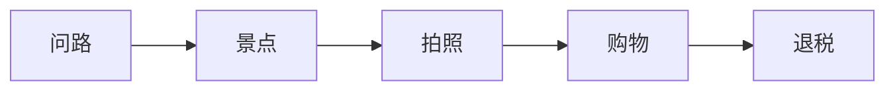

# 问路景点游览与购物场景

> [!info] 本篇定位
> 这是 **08.出行与旅游场景实战** 分类的**收官篇**。
>
> 走在国外街头，你最常做的事：
>
> - **问路**（这地方怎么走？）
> - **看景点**（买票、参观、拍照）
> - **买纪念品**（讨价还价、退税）
> - **找美食**（这周围有什么好吃的？）
>
> 中国学生的常见困扰：
>
> - 不敢拦下陌生人问路
> - 听不懂方向（north / south / east / west）
> - 景点排队看不懂英文导引
> - 拍照请求说不出 "Could you take a photo for us"
>
> 本篇覆盖**旅游全场景**：问路 → 景点 → 购物 → 退税 → 跟团 → 紧急情况。读完你能**像 local 一样自如旅游**。

---

## 1. 本篇导读：旅游英语的核心

### 1.1 旅游英语 5 大场景



### 1.2 语言旅游 5 大原则

```
1. 主动开口     不要怕被拒
2. 简短表达     问路要快
3. 用手势       配合语言
4. 看地图       Google Maps 必备
5. 微笑         国际通用语言
```

---

## 2. 问路（Asking for Directions）

### 2.1 拦下行人的开场白

```
"Excuse me, ..."
"Sorry to bother you, ..."
"Hi, could you help me?"
"Excuse me, do you have a moment?"
"Excuse me, I'm a bit lost."        (我有点迷路)
```

> [!tip] 找谁问路最容易得到帮助
>
> ✅ **最容易帮你**：年轻人、商店店员、警察
> ✅ **较容易帮你**：背包客模样的人
> ❌ **不要拦**：戴耳机的人、急匆匆的人、阴沉脸的人

### 2.2 问路核心句型（15 个）

```
① "Could you tell me how to get to [place]?"

② "How do I get to [place]?"

③ "Where's the [place]?"

④ "Is [place] near here?"

⑤ "How far is [place] from here?"

⑥ "Is there a [place] around here?"

⑦ "Which way is [place]?"

⑧ "Could you point me to [place]?"

⑨ "Am I going the right way?"

⑩ "Is this the right way to [place]?"

⑪ "How long does it take to walk to [place]?"

⑫ "Could you draw me a map?"

⑬ "Could you mark it on my map?"

⑭ "Could you say it again? My English isn't great."

⑮ "Could you write it down?"
```

### 2.3 听懂回答（听力关键）

**对方可能说**：

```
"Go straight."                          (直走)
"Turn left / right."                    (左/右转)
"Take a left / right."                  (左/右转)
"Make a left / right."                  (左/右转)
"At the next corner..."                 (在下一个转角)
"At the traffic light..."               (在红绿灯)
"At the intersection..."                (在十字路口)
"Cross the street."                     (过马路)
"Walk two blocks."                      (走两个街区)
"It's on the left / right."             (在左/右手边)
"It's on your left / right."
"It's just past..."                     (刚过...)
"It's right next to..."                 (就在 ... 旁边)
"It's across from..."                   (在 ... 对面)
"It's around the corner."               (转角处)
"It's at the end of the street."        (在街尾)
"You can't miss it."                    (你一眼就能看到)
"It's about a 10-minute walk."
"It's a few minutes by car."
```

### 2.4 方位词汇

```
north / south / east / west       (东南西北)
up / down                          (上下)
left / right                       (左右)
straight / forward                 (直)
back / behind                      (后)
ahead                              (前方)
opposite / across                  (对面)
next to                            (旁边)
between                            (之间)
behind / in front of               (后/前)
near / far                         (近/远)
nearby                             (附近)
on the corner                      (在转角)
at the end                         (在尽头)
```

### 2.5 完整问路对话

```
You：     "Excuse me, could you help me?"
Local：   "Sure, what's up?"
You：     "How do I get to the Empire State Building from here?"
Local：   "Oh, you're close. Walk straight on this street for about
          5 minutes, then turn right at the third intersection.
          You'll see it - you can't miss it."
You：     "Got it. Walk straight, turn right at the third
          intersection. About 5 minutes?"
Local：   "Yes. It's the tall pointy building with the spire."
You：     "Thanks so much!"
Local：   "No problem!"
```

### 2.6 听不懂时

```
"Sorry, could you say that again?"
"Could you speak more slowly?"
"Could you write it down?"
"Could you point to it on my map?"
"Sorry, I didn't catch that."
```

### 2.7 找不到 / 走错路

```
"I think I'm lost."
"I've been walking for a while, but I can't find it."
"Could you check my map?"
"I think I went the wrong way."
"Where am I now?"
```

---

## 3. 看地图与电子导航

### 3.1 地图相关词汇

```
map                       (地图)
city map                  (城市地图)
metro map                 (地铁地图)
attraction                (景点)
landmark                  (地标)
neighborhood              (社区/区)
district                  (区)
address                   (地址)
coordinates               (坐标)
GPS                       (导航)
Google Maps               (谷歌地图)
Apple Maps                (苹果地图)
Waze                      (实时路况)
offline map               (离线地图)
```

### 3.2 找地址 / 用 Google Maps

```
"Where is this address?"
"Could you tell me the address?"
"What's the nearest landmark?"
"How do I save the address?"
"Could you turn on directions?"
"Should I drive or walk?"
"What's the fastest route?"
```

### 3.3 GPS 听力

```
"In 200 feet, turn right onto Main Street."
"Continue straight for 1 mile."
"Take exit 23 toward downtown."
"In 0.5 miles, your destination will be on the right."
"You have arrived at your destination."
"Recalculating..."
```

---

## 4. 景点门票与开放时间（Tickets & Hours）

### 4.1 景点词汇

```
attraction                (景点)
museum                    (博物馆)
gallery                   (美术馆)
monument                  (纪念碑)
castle                    (城堡)
palace                    (宫殿)
cathedral                 (大教堂)
park                      (公园)
zoo                       (动物园)
aquarium                  (水族馆)
amusement park            (游乐园)
theme park                (主题公园)
observation deck          (观景台)
viewpoint                 (观景点)
panoramic view            (全景)
ticket office             (售票处)
admission                 (入场费)
entry fee                 (入场费)
audio guide               (音频导览)
guided tour               (导游团)
free                      (免费)
discount                  (折扣)
student / senior / child  (学生/老人/儿童)
opening hours             (开放时间)
last admission            (最后入场时间)
closed on Mondays         (周一闭馆)
public holidays           (公共假期)
```

### 4.2 买票句型

```
You：     "Hi, I'd like to buy tickets, please."
Agent：   "How many?"
You：     "Two adults and one child."
Agent：   "How old is the child?"
You：     "She's 7."
Agent：   "OK. Adult is $25, child is $15. Are you students or
          seniors?"
You：     "No, just adults."
Agent：   "Total $65. Is that with the audio guide?"
You：     "What does the audio guide cost?"
Agent：   "$10 per person, available in 8 languages."
You：     "We'll add 3 audio guides. Total then?"
Agent：   "$95. Card or cash?"
You：     "Card, please."
Agent：   "Thanks. Here's your tickets and audio guides. Enjoy
          your visit!"
```

### 4.3 询问句型（15 个）

```
① How much is the admission?

② Is there a discount for [students / kids / seniors]?

③ Do you offer a family pass?

④ What time does it open / close?

⑤ When's the last admission?

⑥ Are you open today?

⑦ Are you open on holidays?

⑧ How long does it take to see everything?

⑨ Can we re-enter if we leave?

⑩ Is photography allowed inside?

⑪ Are there guided tours?

⑫ What's included in the ticket?

⑬ Is there a free / discount day?

⑭ Should I book online or buy at the door?

⑮ Where's the entrance?
```

### 4.4 在线买票

```
Skip-the-line ticket          (免排队票)
fast-track entry              (快速通道)
combo ticket                  (套票)
city pass                     (城市通票)
e-ticket                      (电子票)
mobile ticket                 (手机票)
QR code                       (二维码)
"Show your phone at the gate."
"Show your printed ticket."
"Scan your QR code."
```

### 4.5 排队

```
"How long is the wait?"
"Is this the line for [attraction]?"
"Where does the line start?"
"Where does the line end?"
"Is there a separate line for tickets?"
"Is this the right line?"
```

---

## 5. 景点游览（Visiting）

### 5.1 进入景点后

```
"Where do we start?"
"What's worth seeing?"
"What's the most famous part?"
"What can't we miss?"
"Where are the bathrooms?"
"Where's the gift shop?"
"Is there a café inside?"
"Where can I get a map?"
"Are there lockers for bags?"
"Can I bring a backpack?"
```

### 5.2 与导游互动

```
"Could you speak louder?"
"Could you repeat that?"
"What did you say about [thing]?"
"How long is this tour?"
"Can I ask a question?"
"What's the next stop?"
"Could you slow down?"
```

### 5.3 用音频导览

```
"How do I use this?"
"How do I change the language?"
"My audio guide isn't working."
"Could you help me restart it?"
"Where's the next stop on the audio tour?"
"Can I skip to a specific number?"
```

### 5.4 景点内常见标识

```
NO ENTRY               (禁止进入)
PRIVATE                (私人)
STAFF ONLY             (员工专用)
NO PHOTOGRAPHY         (禁止拍照)
NO FLASH               (禁止闪光灯)
SILENCE PLEASE         (请保持安静)
KEEP OFF THE GRASS     (请勿踩踏草坪)
DO NOT TOUCH           (请勿触摸)
NO FOOD OR DRINK       (禁止饮食)
EMERGENCY EXIT         (紧急出口)
```

### 5.5 完整景点游览对话

```
You：     "Hi, where should we start?"
Guide：   "Welcome! I recommend starting with the Egyptian wing
          on the second floor."
You：     "Are tours included?"
Guide：   "Free tours every hour. Next one's at 11."
You：     "We'll catch that. Can we leave bags somewhere?"
Guide：   "Lockers are by the entrance, $5."
You：     "Can we take photos?"
Guide：   "Yes, but no flash, and no tripods."
You：     "Got it. What's the must-see?"
Guide：   "The mummy exhibit and the medieval armor."
You：     "Thanks!"
```

---

## 6. 拍照与请求（Photography）

### 6.1 请别人拍照

```
"Could you take a photo of us, please?"
"Would you mind taking our picture?"
"Could you take a photo with this?"   (指相机/手机)
"Could you take one more?"
"One more, please!"
"Could you take a vertical / horizontal one?"
   (竖/横拍)
"Could you step back a bit?"
"Could you get the building in the photo?"
"Could you use this filter?"
```

### 6.2 教对方怎么拍

```
"Just press this button."
"Tap the screen to focus."
"Hold it horizontal / vertical."
"Could you frame it like this?"        (这样构图)
"Could you tap on us to focus?"
"Could you take a few shots?"
"Could you back up a bit?"
"Get our shoes in too."
```

### 6.3 看拍出来效果

```
"Let me see."
"Could you take another? My eyes were closed."
"Could you take a vertical version?"
"This one is great, thanks!"
```

### 6.4 帮别人拍

```
"Want me to take one?"
"I'll get the whole group."
"Smile! ... 1, 2, 3!"
"Got it! Want to see?"
"How's this one?"
"I took a few, you can choose."
```

### 6.5 完整拍照对话

```
You：     "Excuse me, would you mind taking a photo of us?"
Stranger："Sure, of course!"
You：     "Just press the round button. Could you get the
          Eiffel Tower in the background?"
Stranger："OK, step back a little. ... Smile! 1, 2, 3!"
          (snap)
Stranger："Got a few, take a look."
You：     "Oh, perfect! Thanks so much!"
Stranger："No problem!"
You：     "Want me to take one of you?"
Stranger："Oh sure, why not!"
```

---

## 7. 纪念品购物（Souvenirs）

### 7.1 纪念品词汇

```
souvenir                 (纪念品)
gift shop                (礼品店)
local product            (当地特产)
handmade                 (手工)
authentic                (正宗的)
souvenir t-shirt         (纪念 T 恤)
postcard                 (明信片)
fridge magnet            (冰箱贴)
keychain                 (钥匙扣)
mug                      (马克杯)
snow globe               (雪花球)
trinket                  (小饰品)
craftwork                (工艺品)
ceramic                  (陶瓷)
wood carving             (木雕)
silk                     (丝绸)
jewelry                  (珠宝)
specialty food           (特产食品)
local snacks             (当地零食)
```

### 7.2 购物句型（15 个）

```
① "How much is this?"

② "Is this on sale?"

③ "Is this hand-made?"

④ "Where is this from?"

⑤ "Is this authentic?"

⑥ "Could I get it in another color?"

⑦ "Do you have a smaller size?"

⑧ "Could you wrap it as a gift?"

⑨ "Could you ship it to my country?"

⑩ "Could I get a discount?"

⑪ "I'll take this one."

⑫ "I'll think about it."

⑬ "Is the price negotiable?"

⑭ "Do you take dollars / euros?"

⑮ "Could I get a receipt?"
```

### 7.3 在景区附近的购物

```
"That's overpriced."          (太贵了)
"Same item, half price downtown."
"It's just for tourists."
"Let me check elsewhere first."
```

### 7.4 完整纪念品购物对话

```
You：     "Hi, how much is this scarf?"
Seller：  "$50. Pure silk."
You：     "Is it really silk?"
Seller：  "100% silk, hand-made."
You：     "It's beautiful but a bit pricey."
Seller：  "How about $40?"
You：     "Could you do $30?"
Seller：  "$35, final price."
You：     "$35, deal. Could you wrap it as a gift?"
Seller：  "Of course."
You：     "Could I pay by card?"
Seller：  "Yes, no problem."
You：     "Could I get a receipt?"
Seller：  "Sure."
```

---

## 8. 退税（Tax Refund）

> [!info] 哪些国家可以退税
>
> 欧盟（VAT）、英国、日本、新加坡、韩国、土耳其等。
>
> **美国不全国统一退税**，部分州有 sales tax，外国游客一般不退。

### 8.1 退税词汇

```
VAT (Value Added Tax)         (增值税，欧盟)
GST (Goods and Services Tax)  (商品税，澳/加)
sales tax                     (销售税，美国)
tax refund                    (退税)
tax-free shopping             (免税购物)
duty-free                     (免税店，机场)
minimum purchase              (最低消费)
refund form                   (退税单)
customs stamp                 (海关章)
processing fee                (手续费)
cash / card refund            (现金/卡退还)
```

### 8.2 商店里办退税

```
You：     "Hi, do you offer tax refund for foreign tourists?"
Cashier： "Yes, what's the total?"
You：     "It's €200."
Cashier： "Yes, that's above the minimum (€175). Could I see
          your passport?"
You：     "Here."
Cashier： "Fill out this form. Keep the receipt and form for
          customs at the airport."
You：     "How much will I get back?"
Cashier： "About 12% of the price after fees."
You：     "Where do I go at the airport?"
Cashier： "Look for the 'Tax Refund' or 'VAT Refund' counter
          before security."
You：     "Thanks!"
```

### 8.3 机场退税流程

```
1. 到达机场（提前 1-2 小时）
2. 找到 "Tax Refund" 柜台
3. 出示：
   - 护照
   - 登机牌
   - 退税单
   - 商品（可能要看实物）
4. 海关盖章
5. 选择退还方式：
   - 现金（部分机场）
   - 信用卡退回（最常见，2-4 周）
6. 寄送 / 投递退税单
```

### 8.4 机场退税对话

```
You：       "Hi, I'd like to claim a tax refund."
Agent：     "Passport and forms, please."
You：       "Here you go."
Agent：     "Could I see the items?"
You：       "Yes, here in my bag."
Agent：     "OK, all good. Cash or credit card refund?"
You：       "Credit card, please."
Agent：     "It will be processed in 2-4 weeks. Sign here."
You：       "Got it. Thanks!"
```

---

## 9. 美食与餐厅（Food & Restaurants）

### 9.1 找美食句型

```
"Where's a good place to eat around here?"
"Could you recommend a local restaurant?"
"What's the local specialty?"
"Where do locals eat?"
"Is there a good [Italian/Japanese] restaurant nearby?"
"What's the most popular dish here?"
"What should I try?"
```

### 9.2 美食探索词汇

```
local cuisine              (当地美食)
specialty dish             (特色菜)
must-try                   (必尝)
hidden gem                 (隐藏好店)
hole-in-the-wall           (小店、不起眼但好吃)
food street                (美食街)
night market               (夜市)
food court                 (美食广场)
food truck                 (美食车)
street food                (街头美食)
authentic                  (正宗)
touristy                   (游客向)
```

### 9.3 完整美食询问

```
You：     "We're tourists, what local food should we try?"
Concierge："What kind of cuisine?"
You：     "Anything traditional and good."
Concierge："For seafood, try [restaurant]. For traditional steak,
          try [restaurant]. Both are local favorites."
You：     "Are they expensive?"
Concierge："Mid-range. About $50 per person."
You：     "How do we get there?"
Concierge："Take a taxi, 10 minutes from here. I can call you
          one if you'd like."
```

---

## 10. 旅游团 / 导游（Tours）

### 10.1 旅游团类型

```
guided tour                (导游团)
walking tour               (步行游)
bus tour                   (大巴游)
day trip                   (一日游)
half-day tour              (半日游)
multi-day tour             (多日游)
private tour               (私人游)
group tour                 (团体游)
self-guided tour           (自助游)
hop-on hop-off bus         (随上随下巴士)
```

### 10.2 报名询问

```
"What's included in the tour?"
"How long is the tour?"
"What's the meeting point?"
"Is the guide English-speaking?"
"Are meals included?"
"Is transportation included?"
"How many people in the group?"
"Is the tour wheelchair accessible?"
"Is there a minimum age?"
"What should I bring?"
"Can I cancel?"
```

### 10.3 跟团句型

```
"What's the schedule for tomorrow?"
"What time should I be ready?"
"Where do we meet?"
"What's the dress code?"
"Is there a packed lunch?"
"How long will we be at this stop?"
"When do we need to be back on the bus?"
```

### 10.4 与导游互动

```
"Could you speak louder?"
"Could you repeat that?"
"Could you slow down?"
"Where are we going next?"
"Is there time to use the restroom?"
"Could we have a photo break?"
```

---

## 11. 紧急情况（Emergencies When Traveling）

### 11.1 走丢了

```
"I'm lost."
"I lost my group."
"I can't find my hotel."
"I forgot the address."
"Where's the nearest [hotel/police]?"
"Could I use your phone?"
```

### 11.2 丢失物品

```
"I lost my wallet."
"I lost my passport."
"I lost my phone."
"I lost my luggage."
"Where's the police station?"
"How do I file a report?"
"What's the embassy number?"
```

### 11.3 被偷了

```
"I was pickpocketed."         (被掏包)
"My bag was stolen."
"Someone stole my phone."
"Could you call the police?"
"Where's the embassy?"
```

### 11.4 紧急词汇与电话

```
emergency               (紧急情况)
police                  (警察)
ambulance               (救护车)
fire department         (消防)
embassy                 (大使馆)
consulate               (领事馆)

紧急电话：
US:        911
UK:        999
EU:        112
Australia: 000
China:     110/119/120
Japan:     119
```

### 11.5 完整丢护照对话

```
You：     "Help! I lost my passport!"
Police：  "Calm down. Where did you last see it?"
You：     "At a restaurant about an hour ago."
Police：  "Let's file a report. Could I see your ID?"
You：     "I have a copy of my passport on my phone."
Police：  "Good. After the report, you'll need to go to your
          embassy."
You：     "Where's the [Country] embassy?"
Police：  "I'll give you the address and number."
You：     "Thank you!"
```

---

## 12. 完整旅游对话场景

### 12.1 场景：第一次到罗马（综合）

```
Hotel staff：  "Welcome to Rome! First time?"
You：          "Yes! What should we see?"
Staff：        "The Colosseum is a must. Vatican City is
                amazing. And the Trevi Fountain at night."
You：          "How do we get to the Colosseum?"
Staff：        "Take the metro - line B to Colosseo station.
                15 minutes."
You：          "Should we book tickets in advance?"
Staff：        "Definitely. Book online to skip the line.
                €18 with audio guide."
You：          "What about food?"
Staff：        "For traditional Roman, go to [restaurant] in
                Trastevere. Walking tour at 7 PM if you're
                interested."
You：          "Sign us up! And could we get a city map?"
Staff：        "Here. I've marked the highlights."
```

### 12.2 场景：买纪念品 + 退税

```
Tourist：     "I'd like this scarf and these magnets."
Seller：      "Total is €120."
Tourist：     "Can I get tax refund?"
Seller：      "Yes, that's above €100. Passport please."
Tourist：     "Here."
Seller：      "Fill out this form. Take it to customs at airport.
              Receipt is here too."
Tourist：     "Cash or card refund?"
Seller：      "Your choice at the airport."
Tourist：     "Thanks!"
```

### 12.3 场景：紧急情况

```
You：       "Excuse me, could I use your phone? I was robbed."
Stranger：  "Oh my god, are you OK?"
You：       "Yes, but they took my wallet and phone."
Stranger：  "Let me call the police. Stay here."

(after police arrive)

Police：    "Can you describe what happened?"
You：       "I was in a crowded area, someone bumped into me.
            When I checked, my wallet and phone were gone."
Police：    "Did you see the person?"
You：       "Just briefly. Tall, dark jacket."
Police：    "We'll file a report. You'll need to contact your
            embassy and bank."
You：       "What's the embassy number?"
Police：    "I'll write it down for you."
```

---

## 13. 文化差异提醒

### 13.1 问路礼仪

```
中国：可以拦下任何人，简单直接
美国：先 "Excuse me"，简短礼貌
欧洲：常常先寒暄，再问

日本：一般会非常热情帮你（甚至带你过去）
法国：可以友好但偶尔遇到不耐烦
```

### 13.2 拍照注意

```
✅ 自然景观、街景、地标 - 一般可以拍
❌ 政府建筑、军事、警察、安检 - 不能拍
❌ 有些教堂、博物馆 - 看标识
❌ 在国外随便拍当地人 - 失礼

要拍人最好先问：
"Could I take your photo?"
"May I take a picture of you?"
```

### 13.3 给小费（旅游业）

```
导游 (一日游)：       $5-10/天
导游 (多日游)：       $10-20/天
司机：               $5/天
酒店行李员：          $1-2/件
酒店清洁：            $2-5/晚
餐厅：               15-20% (美国)
出租车：             10-15%
```

### 13.4 文化禁忌

```
- 教堂里不要大声说话
- 博物馆不要触摸展品
- 当地宗教场所注意着装
- 海滩在某些国家要穿泳装
- 公共场合不大声喧哗
```

---

## 14. 常见错误大盘点

### 14.1 错误 1：问路太详细

```
❌ "Could you tell me how to get to Times Square,
   I'm a tourist from China, I just arrived..."
✅ "Excuse me, how do I get to Times Square?"

简短直接，对方也好回答。
```

### 14.2 错误 2：方向词混淆

```
left = 左
right = 右

注意：
- right 也表示"对的"
- "Right!" = "对的!"，不是"右!"
- 听清楚情境
```

### 14.3 错误 3：景点名乱译

```
❌ Direct translation
   "Forbidden City" = OK 
   "Long Wall" = ❌ "Great Wall"
   
不知道英文名时，**直接说中文 + "How do you say it in English?"**
```

### 14.4 错误 4：拍照时挡到背景

```
"Could you back up a bit so we can see the building?"
"Could you frame the whole [landmark]?"

要明确告诉对方要拍什么。
```

### 14.5 错误 5：纪念品砍价过头

```
不是所有地方能砍价：
- 大型商场 → 不能砍
- 景区小摊 → 可以砍
- 跳蚤市场 → 砍
- 高端品牌 → 不能砍

砍 30-50% 已经很大幅度。
```

### 14.6 错误 6：退税忘记盖章

```
没有海关章 = 退税无效。
必须在过安检前盖章。
```

### 14.7 错误 7：紧急时慌乱

```
即使紧急情况：
1. 深呼吸
2. 用最简单的英语
3. 找警察 / 工作人员
4. 联系大使馆

慌张反而难表达。
```

---

## 15. 练习与输出建议

> [!success] 本篇练习清单
>
> **基础练习**
>
> 1. 准备**5 句问路开场白** + **10 句方向描述**
>
> 2. 准备**景点购票 5 个必问**
>
> 3. 准备**请人拍照 5 个句型**
>
> **场景模拟**
>
> 4. 模拟 5 个对话：
>    - 在街头问路
>    - 景点买票 + 询问开放时间
>    - 请陌生人拍照
>    - 纪念品砍价
>    - 机场退税
>
> **角色扮演**
>
> 5. 让 AI 扮演**当地人**，你问 5 个不同景点的路线。
>
> **写作练习**
>
> 6. 写 200 词英文短文：
>    - "My most memorable travel experience"
>    - "Tips for navigating a new city"
>
> **长期任务**
>
> 7. 看一部旅行类节目或 YouTube 频道，记录所有旅游英语。
>
> 8. 计划一次**虚拟英文旅行**：用英文研究目的地、订机票、订酒店、
>    规划行程。

---

## 16. 本篇小结

> [!success] 本篇核心要点回顾
>
> **问路**：
> - "Excuse me, how do I get to ...?"
> - 听懂方向：straight / left / right / blocks / corner
> - 听不懂请求：repeat / write down / map
>
> **景点门票**：
> - admission / discount / opening hours
> - skip-the-line / city pass
>
> **景点游览**：
> - audio guide / guided tour
> - 标识：NO PHOTOGRAPHY / NO TOUCH
>
> **拍照**：
> - "Could you take a photo of us?"
> - "Could you frame [landmark]?"
> - "I'll get the whole group."
>
> **纪念品**：
> - "How much" / "Discount" / "Take it"
> - 景区可以适度砍价
>
> **退税**：
> - 欧洲 VAT / 日本免税
> - 海关章必须盖
> - 提前 1-2 小时到机场
>
> **紧急情况**：
> - 911 / 999 / 112 / 119
> - "I lost my passport / wallet"
> - 联系大使馆

### 16.1 08 分类收官

恭喜完成 **08.出行与旅游场景实战** 分类全部 4 篇：

```
✅ 01.机场航班海关入境
✅ 02.酒店入住预订与投诉
✅ 03.公共交通打车与租车
✅ 04.问路景点游览与购物
```

**现在你已经掌握**：
- **机场全流程**（值机/安检/海关）
- **酒店全流程**（预订/入住/投诉/退房）
- **交通全方式**（地铁/Uber/租车/加油）
- **旅游全场景**（问路/景点/购物/退税）

**这是"出国旅游 / 出差全套技能"的完成**。

### 16.2 下一分类预告

> [!info] 下一分类：09.学习与教育场景实战
>
> 接下来 4 篇进入**学习场景**：
>
> - **09.01** 课堂讨论与提问场景
> - **09.02** 图书馆作业与研究场景
> - **09.03** 考试报名与学术评分场景
> - **09.04** 留学申请与校园生活场景
>
> 这一系列让你**留学读书全流程英语化**。
>
> **下一篇**：从**课堂场景**开始。
