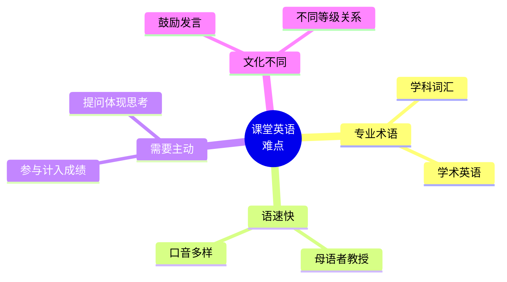

# 课堂讨论与提问场景

> [!info] 本篇定位
> 欢迎进入 **09.学习与教育场景实战** 分类！
>
> 留学生**最大的英语挑战**：**课堂参与**。
>
> 中国学生在国外课堂的典型困境：
>
> - 教授讲快听不懂
> - 想发言不知道怎么开口
> - 小组讨论别人都说话只有你沉默
> - Presentation 紧张到忘词
> - 想问问题怕被嘲笑
> - 缺课不知道怎么和教授解释
>
> 本篇覆盖**课堂全场景**：上课 → 听讲 → 提问 → 讨论 → 展示 → 与教授沟通 → 请假，**350+ 词汇** + **80+ 句型** + **15+ 真实对话**。

---

## 1. 本篇导读：课堂英语为什么难

### 1.1 课堂英语 4 大难点



### 1.2 美国 vs 中国课堂

```
中国课堂：    教授为中心，学生听讲为主，提问较少
美国课堂：    互动为中心，学生主动发言，提问鼓励
            参与度 (participation) 是成绩组成
```

### 1.3 留学课堂参与的 3 大策略

```
1. 提前阅读：    课前看 reading，能听懂上课
2. 主动提问：    哪怕基础问题也比沉默好
3. 笔记 + 录音： 课后回顾
```

---

## 2. 课堂基础词汇

### 2.1 学校与课程

```
school                    (学校)
university                (大学)
college                   (大学/学院)
campus                    (校园)
classroom                 (教室)
lecture hall              (大教室)
auditorium                (礼堂)
laboratory / lab          (实验室)
library                   (图书馆)
cafeteria                 (食堂)
dormitory / dorm          (宿舍)
student union             (学生中心)
office hours              (办公时间)
```

### 2.2 课程类型

```
class / course            (课程)
lecture                   (讲座/课)
seminar                   (研讨课，小班讨论)
discussion section        (讨论课)
recitation                (复习课)
lab                       (实验课)
workshop                  (工作坊)
tutorial                  (辅导课)
office hours              (答疑时间)
guest lecture             (客座讲座)

elective                  (选修课)
required course           (必修课)
core course               (核心课)
prerequisite              (先修课)
intro course              (入门课)
advanced course           (高阶课)
```

### 2.3 课程材料

```
syllabus                  (教学大纲)
textbook                  (教科书)
reading                   (阅读材料)
handout                   (讲义)
slides / PPT              (幻灯片)
notes                     (笔记)
homework / assignment     (作业)
problem set               (习题集)
paper / essay             (论文)
research paper            (研究论文)
case study                (案例研究)
group project             (小组项目)
final project             (期末项目)
```

### 2.4 角色

```
professor / prof          (教授)
instructor                (讲师)
lecturer                  (讲师)
TA (Teaching Assistant)   (助教)
RA (Research Assistant)   (研究助手)
student                   (学生)
classmate                 (同学)
peer                      (同辈/同学)
freshman                  (大一)
sophomore                 (大二)
junior                    (大三)
senior                    (大四)
graduate / grad student   (研究生)
undergraduate             (本科生)
PhD student               (博士生)
```

---

## 3. 上课开始与到课

### 3.1 上课前

```
"Good morning, professor!"
"Hi, I'm new to this class."
"Could I sit here?"
"Is this seat taken?"
"What did I miss last class?"
"Did we get any handouts?"
"Where can I get the slides?"
```

### 3.2 教授常用上课开场

```
"Good morning, everyone."
"Let's get started."
"Let's pick up where we left off."
"Today, we'll be covering..."
"By the end of class, you should be able to..."
"Before we begin, any questions about last class?"
"Quick recap from last time..."
"Quiz today, hope you studied!"
```

### 3.3 听课中可能遇到的指令

```
"Open your textbook to page 45."
"Take out your notebooks."
"Pair up with your neighbor."
"Form groups of 4."
"Pass out the handouts."
"Look at the slide."
"Take notes."
"Raise your hand if..."
```

### 3.4 完整开课对话

```
You：     "Good morning, professor!"
Prof：    "Morning! Are you new?"
You：     "Yes, I just transferred in. Could I get a syllabus?"
Prof：    "Of course. Here. We're on chapter 4 today."
You：     "Should I read chapters 1-3?"
Prof：    "Yes, the reading is on the syllabus. Email me if
          you have questions."
You：     "Thanks!"
```

---

## 4. 听课与做笔记

### 4.1 听不懂时怎么办

```
① "Sorry, could you repeat that?"

② "Could you go back to that slide?"

③ "Could you clarify what you mean by [term]?"

④ "I'm not sure I understood. Could you explain again?"

⑤ "Could you spell that, please?"

⑥ "What's [term] in plain English?"     (用大白话解释一下)

⑦ "Could you slow down a bit?"

⑧ "I'm a bit lost. Where are we?"

⑨ "Could you give an example?"

⑩ "Sorry, I missed that. Could you say it again?"
```

### 4.2 做笔记常用缩写

```
&         and
w/        with
w/o       without
b/c       because
e.g.      for example
i.e.      that is
etc.      and so on
vs.       versus
=         equals
≠         not equal
~         approximately
→         leads to / causes
←         comes from
↑         increases
↓         decreases
∴         therefore
b/4       before
2morrow   tomorrow
re:       regarding
```

### 4.3 表示理解 / 不理解

```
"Got it!"
"That makes sense."
"I see what you mean."
"I'm following."
"OK, that's clear now."

"I'm a bit confused."
"I don't quite follow."
"Could you go over that one more time?"
"I'm not seeing the connection."
```

---

## 5. 提问与回答

### 5.1 课堂提问礼仪

```
1. 举手等教授叫你 (raise your hand)
2. 等教授停顿
3. 简洁清楚
4. 不要打断
5. 教授叫你后再说
```

### 5.2 提问的开场白

```
"Excuse me, professor, ..."
"Sorry to interrupt, but ..."
"Could I ask a quick question?"
"I have a question about ..."
"Could you clarify ...?"
"I'm a bit confused about ..."
"Quick question..."
```

### 5.3 各种提问句型（15 个）

```
① Could you explain [concept] again?

② What do you mean by [term]?

③ Could you give an example?

④ How does [A] relate to [B]?

⑤ What's the difference between [A] and [B]?

⑥ Why did [event] happen?

⑦ What if [scenario]?

⑧ Could you go back to slide 7?

⑨ Is this correct - [your understanding]?

⑩ I'm not sure I understand - could you walk me through it?

⑪ Where can I learn more about [topic]?

⑫ Will this be on the exam?

⑬ Is there a textbook chapter on this?

⑭ Could you recommend further reading?

⑮ Do you have a different perspective on this?
```

### 5.4 回答教授的问题

**确定时**：
```
"The answer is [X]."
"I think it's [X]."
"In my opinion, ..."
"Based on the reading, ..."
"From [source], we know that ..."
```

**不确定时**：
```
"I'm not sure, but maybe ..."
"I think it might be ..."
"I'd guess that ..."
"I'm not 100% sure, but ..."
"Could it be ...?"
```

**完全不知道**：
```
"I'm not sure."
"I haven't read that part yet."
"Could you give us a hint?"
"I don't know off the top of my head."
"Sorry, I don't remember."
```

> [!tip] 不知道时不要慌
>
> 即使在美国课堂，教授也理解学生不知道。**承认 "I don't know"** 比硬编要好。
>
> 然后可以加：**"But I'd like to learn more about it."**

### 5.5 别人提问时

```
"That's a great question."
"I had the same question."
"Building on what [Name] said..."
"To add to [Name]'s point..."
"I disagree with [Name] because..."
"I see it differently..."
```

---

## 6. 小组讨论（Group Discussion）

### 6.1 组内开场

```
"Hi everyone, I'm [Name]."
"Should we go around and introduce ourselves?"
"Who wants to start?"
"Should we read the prompt first?"
"What's the question we're discussing?"
```

### 6.2 表达观点

```
"I think..."
"In my opinion..."
"From my perspective..."
"I'd argue that..."
"What if we considered..."
"My take on this is..."
```

### 6.3 邀请别人发言

```
"What do you think, [Name]?"
"[Name], what's your view?"
"Has anyone else thought about this?"
"Anyone want to add to that?"
"I'd love to hear from someone who hasn't spoken yet."
```

### 6.4 同意 / 不同意

**同意**：
```
"I agree with [Name]."
"That's a great point."
"You're right about..."
"I had the same thought."
"Building on what [Name] said..."
```

**不同意**：
```
"I see your point, but..."
"I respectfully disagree."
"I'd like to offer a different perspective."
"On the other hand..."
"I'm not sure I agree because..."
```

### 6.5 总结讨论

```
"Let me summarize what we've discussed."
"So we've agreed that..."
"The main points are..."
"Should we move on to the next question?"
"Is there anything else to discuss?"
```

### 6.6 完整小组讨论

```
You：     "Hi everyone, I'm John. Should we introduce ourselves?"
Mary：    "Sure! I'm Mary."
Tom：     "Tom."
You：     "Great. Should we start with question one?"
Mary：    "Yes. So the question is about climate policy effectiveness."
Tom：     "I think the policies have been moderately effective."
You：     "Could you elaborate?"
Tom：     "Well, emissions have decreased in some sectors..."
Mary：    "Building on Tom's point, I'd add that not all sectors
          have improved equally."
You：     "I had the same thought. What do you think, Mary?"
Mary：    "I think we need stronger policies, especially for
          industrial emissions."
You：     "I disagree slightly. Stronger isn't always better -
          we need smarter policies."
Tom：     "That's a fair point. Should we look at specific examples?"
You：     "Sure. Let me share an example from China..."
```

---

## 7. 课堂展示（Presentation）

### 7.1 Presentation 基本结构

```
1. Introduction      (引入 + 大纲)
2. Body              (主体 - 3-4 个要点)
3. Conclusion        (总结 + Q&A)
```

### 7.2 开场白

```
"Good morning, everyone."
"Hi, I'm [Name]."
"Today, I'll be talking about..."
"My presentation is on..."
"I'll be covering three main points:..."
"Let's get started."
```

### 7.3 过渡

```
"First, ..."
"Now let's move on to..."
"Next, I'll discuss..."
"Building on this..."
"This brings us to..."
"Another important aspect is..."
"Let me give you an example."
"To illustrate this..."
"As you can see in this slide..."
"Let me show you..."
```

### 7.4 强调重点

```
"The key point here is..."
"What's important to note is..."
"This is critical because..."
"It's worth highlighting that..."
"In particular, ..."
"Most notably..."
```

### 7.5 应对忘词

```
"Sorry, give me a second."
"Let me come back to that."
"I'll get to that in a moment."
"Where was I?"
"Oh right, as I was saying..."
```

### 7.6 结尾

```
"In conclusion, ..."
"To wrap up, ..."
"To summarize my main points..."
"Thank you for listening."
"I'm happy to take questions."
"That's all from me. Questions?"
```

### 7.7 Q&A 环节

**听问题**：
```
"Could you repeat the question?"
"Could you clarify?"
"That's a great question."
```

**回答**：
```
"Great question. The answer is..."
"That's something I considered. ..."
"Good point. Actually, ..."
"I'm glad you asked. ..."
```

**不知道时**：
```
"That's an interesting question. I don't have the data
in front of me, but..."
"I'd love to look into that and get back to you."
"That's outside my research, but my guess would be..."
```

### 7.8 完整 Presentation 开场

```
Hi everyone, I'm Sarah, and today I'll be presenting on
"The Impact of AI on Education."

I'll be covering three main areas:
First, the current state of AI in classrooms.
Second, the benefits and challenges.
Third, my recommendations for the future.

By the end, I hope you'll have a clearer picture of how AI is
reshaping education.

Let's dive in.
```

---

## 8. 与教授沟通（Talking to Professors）

### 8.1 邮件给教授

**主题行模板**：
```
"Question about [course code] - [topic]"
"Office hours request - [date]"
"Absent from class on [date]"
"Extension request for [assignment]"
```

**邮件正文**：
```
Subject: Question about ECON 101 - Midterm

Dear Professor [Last Name],

I hope this email finds you well.

My name is John Smith, and I'm in your ECON 101 class
(Section 2, MWF 10 AM).

I have a question about the midterm next week. Could you
clarify if it covers chapters 1-5 or 1-6?

Thank you for your time.

Best regards,
John Smith
```

### 8.2 Office Hours 拜访

**敲门**：
```
"Excuse me, are you available?"
"Hi professor, are these your office hours?"
"Sorry to bother you. Is now a good time?"
```

**自我介绍**：
```
"I'm [Name] from your [course]."
"I'm in your [day/time] section."
"I sit in the front row."
```

**说来意**：
```
"I came to talk about [topic]."
"I have a question about the assignment."
"Could you explain [concept]?"
"I'm struggling with [topic]."
"I wanted to discuss my paper."
"Could you give me feedback on..."
```

### 8.3 完整 Office Hours 对话

```
You：     "Excuse me, professor. Are you available?"
Prof：    "Yes, come in!"
You：     "Hi, I'm John from your Tuesday class."
Prof：    "Hi John, what brings you here?"
You：     "I'm having trouble with the regression analysis from
          last week. Could you walk me through it?"
Prof：    "Sure, what specifically?"
You：     "I understand the formula, but I'm not sure when to use
          it vs. correlation."
Prof：    "Great question. The key difference is..."

(after explanation)

You：     "Oh, that makes sense. Thanks!"
Prof：    "Anytime. Feel free to come back if you have more
          questions."
You：     "Will do. Thanks for your time."
```

### 8.4 请求延期 / 延长

```
"I'd like to request an extension on the paper."
"I'm dealing with [reason - illness/family]. Could I have a
few more days?"
"Could I submit it on [date]?"
"What's the late penalty?"
"Is there any flexibility on the deadline?"
```

### 8.5 推荐信请求

```
"Would you be willing to write me a letter of recommendation?"
"I'm applying for [program]. Could you write a recommendation?"
"What materials do you need from me?"
"When's the deadline?"
"Should I send you a draft of my CV?"
```

---

## 9. 请假与缺课（Absences）

### 9.1 提前请假

**邮件**：
```
Subject: Class Absence - [Date]

Dear Professor [Last Name],

I'm writing to let you know that I won't be able to attend class
on [date] due to [reason - medical appointment / family emergency /
illness].

I'll review the lecture slides and notes from a classmate. Please
let me know if there's anything specific I should focus on.

Thank you for understanding.

Best,
[Name]
```

### 9.2 缺课原因表达

```
sick                      (生病)
under the weather         (不舒服)
medical appointment       (医疗预约)
family emergency          (家庭紧急)
funeral                   (葬礼)
job interview             (面试)
religious observance      (宗教节日)
travel                    (出差/旅游)
visa appointment          (签证预约)
```

### 9.3 缺课后跟进

```
"I missed class yesterday. Could you tell me what we covered?"
"Could I borrow your notes?"
"Did we have any homework?"
"Were there handouts?"
"Did you record the lecture?"
"Where can I get the slides?"
"Did I miss anything important?"
```

### 9.4 长期缺勤

```
"I'm going to be out for a week due to [reason]."
"I'll be missing the next 3 classes."
"How can I keep up with the material?"
"Is there a way to make up the work?"
```

---

## 10. 课程相关问题

### 10.1 选课与退课

```
"Is this class still open?"
"Do I need a prerequisite?"
"How many credits is this?"
"What's the workload like?"
"How are grades calculated?"
"What's the attendance policy?"
"Could I audit the class?"        (旁听)
"Can I drop the class?"            (退课)
"What's the drop deadline?"
"Is there a wait list?"
```

### 10.2 学分相关

```
credit hour              (学分)
GPA (grade point average) (绩点)
transcript               (成绩单)
academic standing        (学术状态)
honors                   (荣誉学生)
dean's list              (院长名单 - 优秀生)
academic probation       (学术警告)
```

### 10.3 询问成绩

```
"Could I see my grade on the [exam]?"
"How was my paper?"
"Where do I stand in the class?"
"Is there a way to improve my grade?"
"Could I redo this assignment?"
"Could I take the test again?"
"Is there extra credit available?"
```

---

## 11. 完整对话场景汇总

### 11.1 场景：第一次发言

```
Prof：    "What do you think about the article?"

(awkward silence)

You：     (raises hand) "I have some thoughts."
Prof：    "Yes, [Name]?"
You：     "Sorry, I'm a bit nervous - this is my first time
          speaking. I think the author makes a strong argument
          about X, but I'm not sure about Y..."
Prof：    "Great start! Could you elaborate?"
You：     "Well, in section 2, the author claims..."
Prof：    "Excellent point. Anyone want to respond?"
```

### 11.2 场景：小组项目分工

```
You：     "OK, we have 5 sections to cover. How should we divide?"
Mary：    "I can take the historical context."
Tom：     "I'll do the data analysis."
You：     "I'll handle the literature review."
Sara：    "I can do the conclusion."
You：     "Great, that's 4 of 5. Mike, you want the introduction?"
Mike：    "Sure!"
You：     "Cool. When should we meet to put it together?"
Mary：    "How about Wednesday at 7?"
Tom：     "Works for me."
You：     "Let's create a shared Google Doc for everyone to add
          their parts."
```

### 11.3 场景：教授提问没准备

```
Prof：    "[Name], what did you think of chapter 4?"
You：     "Honestly, I haven't finished it yet. I got through
          the first half. The author's argument seems
          interesting, but I'd rather not comment on the second
          half until I've read it."
Prof：    "Fair enough. Anything you'd like to add about the
          first half?"
You：     "Yes, I noticed the author uses [strategy]..."
```

### 11.4 场景：考试后请教

```
You：     "Hi professor. I got a 75 on the midterm."
Prof：    "OK. What can I help with?"
You：     "Could you go over what I missed?"
Prof：    "Sure. Most of your errors were on the application
          questions."
You：     "How can I improve for the final?"
Prof：    "Practice more application problems. Come to my office
          hours weekly if you'd like."
You：     "I'll be here every Tuesday. Thanks!"
```

---

## 12. 文化差异提醒

### 12.1 课堂参与文化

```
中国：    沉默听讲是尊重
美国：    沉默被认为没准备/不投入

参与度可能占成绩 10-30%！
```

### 12.2 称呼教授

```
美国：
- 默认 "Professor [Last Name]"
- 拿到博士学位的教授可以叫 "Dr. [Last Name]"
- 教授说 "Call me [First Name]" 才用名字

避免：
❌ "Teacher"
❌ "Sir/Ma'am" (除非教授特别要求)
```

### 12.3 提问的"愚蠢问题"

```
中国学生常担心：
"问太基础会被笑"

美国课堂：
"There are no stupid questions."
基础问题反而显示你认真听了。
```

### 12.4 邮件正式度

```
教授邮件：    正式
- "Dear Professor [Last Name]"
- 完整段落
- "Best regards" 结尾

同学邮件：    较随意
- "Hi [Name]"
- 短句即可
- "Thanks" 结尾
```

### 12.5 论文/作业的诚信

```
西方对学术诚信极其严格：
- 抄袭 (plagiarism) = 零分 + 处分
- 一定要引用 (cite)
- 用 Turnitin 检查抄袭

千万不要侥幸！
```

---

## 13. 常见错误大盘点

### 13.1 错误 1：称呼老师 "teacher"

```
❌ "Teacher, I have a question."
✅ "Professor, I have a question."
✅ "Dr. Smith, I have a question."
```

### 13.2 错误 2：写邮件像写信

```
❌ "Hi! How are you? Hope your day is going well..."
✅ 直接进入主题，简洁
```

### 13.3 错误 3：道歉过多

```
❌ "Sorry, sorry, sorry to ask another question..."
✅ "Could I ask another question?"
```

### 13.4 错误 4：被动语气过多

```
❌ "I am sorry but I am unable to attend..."
✅ "I won't be able to attend..."
```

### 13.5 错误 5：上课迟到不解释

```
✅ Walk in quietly + sit down
✅ 课后简短解释："Sorry I was late, I had..."

不要在上课时打断。
```

### 13.6 错误 6：发言重复别人观点

```
❌ "I agree with [Name]" + 没补充
✅ "I agree with [Name], and I'd add that..."

要有自己的角度。
```

### 13.7 错误 7：截止日错过不联系

```
错过了 deadline 就不交 = 0 分

✅ 立刻邮件解释，请求延期
```

---

## 14. 练习与输出建议

> [!success] 本篇练习清单
>
> **基础练习**
>
> 1. 准备**5 个课堂提问开场白** + **10 个常用提问句型**
>
> 2. 准备**Office Hours 拜访模板**（如何敲门、说来意）
>
> 3. 写一封**给教授请假的邮件**（200 词）
>
> **场景模拟**
>
> 4. 模拟 5 个对话：
>    - 第一次见教授
>    - 课堂提问
>    - 小组讨论
>    - Office Hours
>    - 请求延期
>
> **Presentation 练习**
>
> 5. 准备一个**3 分钟英文 Presentation**（主题自选）
>    - Introduction (30 秒)
>    - 3 Main Points (2 分钟)
>    - Conclusion (30 秒)
>
> **AI 角色扮演**
>
> 6. 让 AI 扮演**教授**，进行 office hours 模拟。
>
> **写作练习**
>
> 7. 写 3 封教授邮件（不同情境）：
>    - 缺课请假
>    - 请求延期
>    - 推荐信请求
>
> **长期任务**
>
> 8. 看 **Coursera / edX 上的免费英文课**，
>    模拟课堂体验，记录所有教授常用表达。
>
> 9. 加入一个**英文学习社群**（如 Reddit r/learnEnglish），
>    练习提问和回答。

---

## 15. 本篇小结

> [!success] 本篇核心要点回顾
>
> **课堂参与是美国课堂成绩组成**：
> - 提前阅读 + 主动提问 + 课后跟进
>
> **听课**：
> - 听不懂请求重复 / 慢说 / 举例
>
> **提问**：
> - 举手 + Excuse me + 简洁
> - "Could you clarify / explain / give an example"
>
> **回答**：
> - 不知道时承认，比硬编好
> - "I'm not sure, but..."
>
> **小组讨论**：
> - 主动开场 / 邀请别人 / Building on / 总结
>
> **Presentation**：
> - 引入 + 主体 + 总结
> - Q&A 环节 - 不知道也别慌
>
> **教授沟通**：
> - 邮件正式：Dear Professor [Last Name]
> - Office hours：自我介绍 + 来意 + 感谢
>
> **请假**：
> - 提前邮件 / 给原因 / 跟进作业
>
> **文化差异**：
> - 称呼 Professor / Dr.（不用 Teacher）
> - 沉默 = 不投入
> - 学术诚信极其严格

### 15.1 下一篇预告

> [!info] 下一篇：02.图书馆作业与研究场景
>
> 下一篇讲**学习深处**的场景：
>
> - **图书馆**：借书 / 预约 / 找资料
> - **作业**：写论文 / 引用 / 查重
> - **研究**：找资料 / 实验 / 写报告
> - **小组合作**：协作工具 / 分工
>
> 这一篇让你**学术研究全英语化**。
