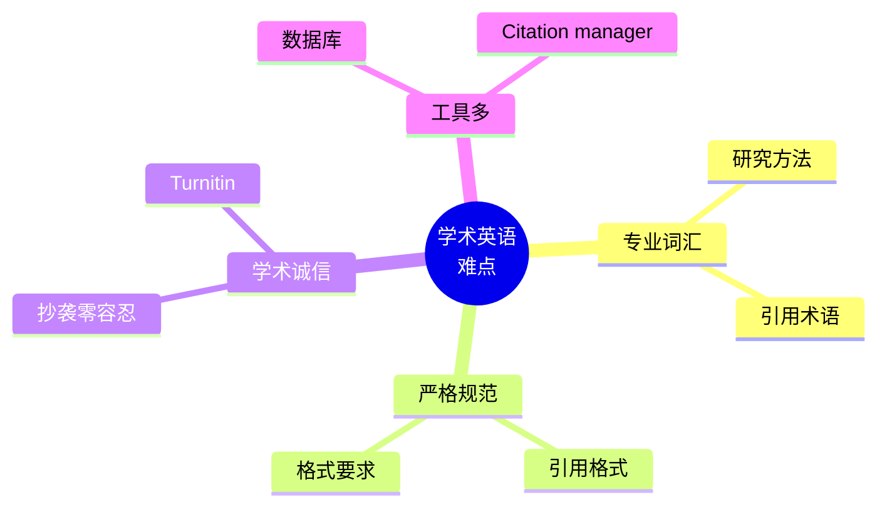
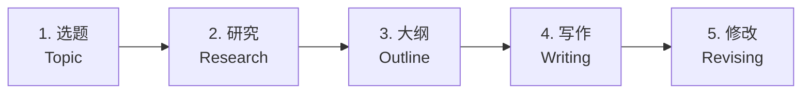

# 图书馆作业与研究场景

> [!info] 本篇定位
> 上一篇讲**课堂场景**，这一篇讲**学习的另一半**——**图书馆和学术研究**。
>
> 中国学生留学最容易踩的"学术坑"：
>
> - 不会用学校 **数据库**（Google Scholar 不够）
> - 不知道**引用格式**（APA / MLA / Chicago）
> - 写论文用**抄袭风险高的方法**（被 Turnitin 抓）
> - 找资料只会**Google**，不会用**Library Catalog**
>
> 学术诚信问题在西方**极其严重** —— 一次抄袭可能导致**开除**。
>
> 本篇覆盖：图书馆服务、找资料、论文写作、引用规范、查重、学习小组，**350+ 学术词汇** + **80+ 句型**。

---

## 1. 本篇导读：学术英语的特殊性

### 1.1 学术英语 4 大难点



### 1.2 中美研究文化差异

```
中国：    侧重背诵 + 应用
美国：    侧重批判 + 创造
         - 你的观点 (your argument) 重要
         - 引用别人观点必须标注
         - 不能复制粘贴
```

---

## 2. 图书馆服务（Library Services）

### 2.1 图书馆词汇

```
library                   (图书馆)
main library              (总馆)
branch library            (分馆)
information desk          (服务台)
reference desk            (参考咨询台)
circulation desk          (借还书台)
reading room              (阅览室)
study room                (自习室)
group study room          (小组学习室)
silent study area         (静音区)
computer lab              (电脑机房)
printer / printing room   (打印室)
copier / copy machine     (复印机)
locker                    (储物柜)
```

### 2.2 馆藏类型

```
book                      (图书)
e-book                    (电子书)
journal                   (期刊)
academic journal          (学术期刊)
magazine                  (杂志)
newspaper                 (报纸)
thesis / dissertation     (学位论文)
manuscript                (手稿)
archive                   (档案)
microfilm                 (缩微胶片)
DVD / CD                  (影音资料)
database                  (数据库)
reference book            (参考书)
encyclopedia              (百科全书)
dictionary                (词典)
atlas                     (地图集)
```

### 2.3 询问图书馆

```
"Where's the [section]?"
"Could you help me find a book?"
"Do you have [book title]?"
"Where can I print?"
"Can I get a study room?"
"Is there Wi-Fi?"
"What time do you close?"
"Are you open on weekends?"
"How long can I stay?"
"Could I use a computer?"
```

### 2.4 完整图书馆问询

```
You：     "Excuse me, I need help finding a book."
Librarian："Sure. Do you have the title?"
You：     "Yes, 'Sapiens' by Yuval Harari."
Librarian："Let me check our system... It's available, on the
          third floor, section 909."
You：     "How long can I keep it?"
Librarian："Three weeks. You can renew if no one's waiting."
You：     "Could I also reserve a study room?"
Librarian："Sure, for how long and what time?"
You：     "Two hours, around 2 PM."
Librarian："Group room 5 is free from 2 to 4. I'll book it for you."
You：     "Thanks!"
```

---

## 3. 借还书（Borrowing & Returning）

### 3.1 借书流程

```
1. 找书 (find the book)
2. 拿到借还书台 (circulation desk) 或自助机
3. 出示学生证 (student ID)
4. 借出 (check out)
5. 收据 (receipt) 含还书日期
```

### 3.2 借书句型

```
"I'd like to check out these books."
"Could I borrow this?"
"How do I check out books?"
"Where's the self-checkout?"
"How long can I keep it?"
"What's the loan period?"
"Could I extend the loan?"
"Could I renew this book?"
```

### 3.3 还书 / 续借

```
"I'd like to return this."
"Could I renew it?"
"Is there a fine?"           (有罚款吗？)
"How much is the late fee?"
"I lost a book. What do I do?"
"How much do I owe?"
```

### 3.4 馆际借阅 (Interlibrary Loan)

```
"Do you have this book?"
"Could I get it through ILL (Interlibrary Loan)?"
"How long does ILL take?"
"Is there a fee for ILL?"
"Could I order it from another library?"
```

### 3.5 完整借书对话

```
You：     "Hi, I'd like to check these out."
Staff：   "Sure, your student ID?"
You：     "Here you go."
Staff：   "OK, three books. Due back on May 15th."
You：     "Could I keep them longer? I have a research project."
Staff：   "I can extend to 6 weeks since they're not on hold."
You：     "Great, thanks!"
Staff：   "Here's your receipt. Need anything else?"
You：     "Could I print my paper?"
Staff：   "Printing is on the second floor. 10 cents per page."
You：     "Thanks!"
```

---

## 4. 找资料 / 数据库（Research）

### 4.1 学术数据库（必须知道）

```
Google Scholar              (谷歌学术)
JSTOR                       (人文社科)
PubMed                      (医学)
IEEE                        (工程电气)
Web of Science              (综合)
Scopus                      (综合)
ProQuest                    (论文)
EBSCO                       (综合)
ResearchGate                (研究者社区)
Sci-Hub                     (灰色区域，慎用)
```

### 4.2 查找资料的句型

```
"How do I access the library database?"
"Could you help me search?"
"What's the best database for [topic]?"
"How do I narrow my search?"
"Could you teach me how to search?"
"How do I download the full text?"
"This article is paywalled. Can I get it?"
"Could you request it through ILL?"
```

### 4.3 完整研究咨询

```
You：     "Excuse me, I need help with research."
Librarian："Sure! What's your topic?"
You：     "Climate change effects on Pacific island nations."
Librarian："Let's start with Web of Science. Have you used it?"
You：     "Briefly."
Librarian："Try keywords like 'climate change' AND 'Pacific
           islands' AND 'sea level rise'. Filter for 2020-2024
           and peer-reviewed."
You：     "How many should I have?"
Librarian："Aim for 10-15 quality sources for a research paper.
           Mix journal articles, government reports, and case
           studies."
You：     "Could you show me how to download?"
Librarian："Sure, click 'Full Text' or 'PDF'. If it's paywalled,
           we have institutional access for most. If not, ILL
           takes 3-5 days."
You：     "Thanks so much!"
```

### 4.4 搜索关键词技巧

```
AND               (两个都要)
OR                (任一)
NOT               (不要包含)
"phrase"          (精确匹配)
*                 (通配符 - climat* = climate, climatic)
( )               (分组)

例如：
"climate change" AND ("Pacific islands" OR Polynesia)
   NOT politics
```

### 4.5 评估资料质量

```
peer-reviewed             (同行评审 - 高质量)
scholarly source          (学术资源)
primary source            (一手资料)
secondary source          (二手资料)
credible                  (可信)
biased                    (偏见)
outdated                  (过时)
recent                    (最新)
authoritative             (权威)
```

---

## 5. 论文写作流程（Paper Writing）

### 5.1 论文写作 5 步法



### 5.2 论文相关词汇

```
paper / essay              (论文)
research paper             (研究论文)
thesis statement           (论点)
argument                   (论证)
introduction               (引言)
body                       (主体)
conclusion                 (结论)
abstract                   (摘要)
literature review          (文献综述)
methodology                (方法论)
results                    (结果)
discussion                 (讨论)
references / bibliography  (参考文献)
appendix                   (附录)
draft                      (草稿)
revision                   (修订)
final draft                (定稿)
proofreading               (校对)
```

### 5.3 选题阶段

```
"What's a good topic for [course]?"
"How do I narrow down my topic?"
"Is this topic too broad?"
"Is this topic too specific?"
"Could you help me brainstorm?"
"How do I form a thesis statement?"
```

### 5.4 论文结构

**典型 5 段式论文**：

```
Paragraph 1: Introduction
  - Hook
  - Background
  - Thesis statement (主论点)

Paragraph 2: Body Point 1
  - Topic sentence
  - Evidence (数据/引用)
  - Analysis
  - Transition to next

Paragraph 3: Body Point 2
  - Same structure

Paragraph 4: Body Point 3
  - Same structure

Paragraph 5: Conclusion
  - Restate thesis
  - Summarize key points
  - Broader implications
```

### 5.5 论文常用句型

**引言**：
```
"In recent years, [topic] has become..."
"This paper examines..."
"This essay argues that..."
"The purpose of this paper is..."
```

**主体**：
```
"First and foremost, ..."
"Furthermore, ..."
"Building on this, ..."
"For example, ..."
"As [Author] (2020) notes, ..."
"This is supported by [evidence]..."
"In contrast, ..."
"On the other hand, ..."
```

**结论**：
```
"In conclusion, ..."
"This essay has demonstrated that..."
"The implications of this are..."
"Future research should..."
```

### 5.6 学术写作 vs 口语写作

| 学术 | 口语 |
| ---- | ---- |
| do not | don't |
| It cannot be denied | You can't deny |
| examine | look at |
| illustrate | show |
| sufficient | enough |
| utilize | use |
| approximately | about |
| in addition | also |
| however | but |
| therefore | so |

> [!warning] 学术写作避免
>
> ❌ 缩写 (don't, can't, it's)
> ❌ 第一人称（除非 reflective paper）
> ❌ 口语词（kind of, sort of, gonna）
> ❌ 强烈情绪化语言
> ❌ 模糊表达 (a lot, very)

---

## 6. 引用与参考文献（Citations）

### 6.1 三大引用格式

```
APA (American Psychological Association)
   - 心理学、教育学、社会科学

MLA (Modern Language Association)
   - 文学、语言、人文

Chicago / Turabian
   - 历史、艺术
```

### 6.2 APA 格式示例

**正文引用**：
```
According to Smith (2020), climate change is...
Climate change is accelerating (Smith, 2020).
Multiple studies confirm this (Smith, 2020; Jones, 2021).
```

**参考文献列表**：
```
Smith, J. (2020). Climate change in the Pacific. Journal of
   Environmental Studies, 45(3), 123-145.

Author Last, First Initial. (Year). Title in sentence case.
   Journal Title in Title Case, Volume(Issue), Pages.
```

### 6.3 MLA 格式示例

**正文引用**：
```
According to Smith, climate change is... (123).
Climate change is accelerating (Smith 123).
```

**参考文献列表 (Works Cited)**：
```
Smith, John. "Climate Change in the Pacific." Journal of
   Environmental Studies, vol. 45, no. 3, 2020, pp. 123-145.
```

### 6.4 引用工具

```
Zotero               (开源，强烈推荐)
Mendeley             (Elsevier 出品)
EndNote              (商业，学校常有)
RefWorks             (网页版)
Citation Machine     (在线生成)
EasyBib              (在线生成)
```

### 6.5 与教授/TA 询问引用

```
"Which citation style should I use?"
"How do I cite [type of source]?"
"Could you give me an example?"
"How do I cite a YouTube video?"
"How do I cite ChatGPT?"     (新热点)
"Where can I learn the citation rules?"
"Could you check my citations?"
```

### 6.6 直接引用 vs 间接引用

**直接引用 (quoting)**：

```
According to Smith (2020), "climate change is the most
pressing issue of our time" (p. 12).

Smith (2020) writes that climate change is "the most pressing
issue" (p. 12).
```

**间接引用 / 释义 (paraphrasing)**：

```
Smith (2020) argues that climate change is the most urgent
challenge facing humanity today.
```

> [!warning] 释义不是简单替换词
>
> **错误**：原文 "Climate change is the most pressing issue."
>          错释义 "Climate change is the most urgent issue." (只换一个词)
>
> **正确**：原文 "Climate change is the most pressing issue."
>          正释义 "Smith argues that the climate crisis demands
>                  immediate attention as the foremost global
>                  challenge."
>
> **释义 = 用自己的话重新表达整句意思**。

---

## 7. 查重与学术诚信（Plagiarism & Academic Integrity）

### 7.1 关键概念

```
plagiarism                 (抄袭)
academic integrity         (学术诚信)
academic dishonesty        (学术不诚实)
self-plagiarism            (自我抄袭)
collusion                  (串通)
fabrication                (捏造)
cheating                   (作弊)
honor code                 (荣誉准则)
```

### 7.2 查重工具

```
Turnitin            (最常见，全球用)
SafeAssign          (Blackboard 系统)
Grammarly Premium   (含查重)
Copyscape           (网站查重)
iThenticate         (期刊用)
```

### 7.3 安全做法

```
✅ 引用所有来源
✅ 用引号 + 来源标注
✅ 释义彻底
✅ 自己思考为主
✅ 跑 Turnitin 自查（部分学校允许）

❌ 复制粘贴
❌ 用别人作业改一改
❌ 只换几个词
❌ 找人代写
❌ 上一个学期重复用
```

### 7.4 与教授讨论查重结果

```
"My Turnitin similarity is 30%. Is that OK?"
"How high is too high?"
"Could you check why some sentences flagged?"
"Some of my own quotes are flagged. What do I do?"
"Could I revise and resubmit?"
```

### 7.5 完整学术诚信咨询

```
You：     "I'm worried about my similarity score."
TA：      "What was it?"
You：     "Around 25%. The flagged parts are mostly direct quotes."
TA：      "If they're properly quoted and cited, that's fine.
          The key is - did you use quotation marks and citations?"
You：     "I think so."
TA：      "Let me look... Yes, all your quotes are properly cited.
          You're fine. Just make sure to paraphrase what you can
          to lower the score."
You：     "Thanks!"
```

---

## 8. 学习小组（Study Groups）

### 8.1 组建小组

```
"Want to form a study group?"
"Anyone up for studying together?"
"I'm forming a study group for [class]."
"Want to study together this weekend?"
"Could we get a study room?"
```

### 8.2 小组学习

```
"Should we go through the chapters?"
"Let's quiz each other."
"Could you explain [concept]?"
"I'm struggling with [topic]."
"Let me show you my notes."
"What did you get for question 3?"
"I disagree, I think the answer is..."
"Let me check my textbook."
```

### 8.3 复习考试

```
"Should we make flashcards?"
"Let's go through the practice exam."
"What concepts will be on the test?"
"I think we should focus on chapters 4-6."
"Let me explain it to you - I learn better by teaching."
"Quiz me on this section."
```

### 8.4 完整学习小组对话

```
You：     "Hey, want to study together for the midterm?"
Mary：    "Yes! When and where?"
You：     "Library, group room 3, Saturday 2 PM?"
Mary：    "Works for me. Tom and Sara want to join."
You：     "Great, four of us. Who's bringing what?"
Mary：    "I'll bring the practice exams."
Tom：     "I'll print the slides."
Sara：    "I have detailed notes. I'll bring those."
You：     "I'll bring snacks. Let's plan to do 3 hours - cover
          chapters 1-5, then take a break, then 6-10."
Mary：    "Sounds good!"

(at study group)

You：     "Let's start with chapter 1. Anyone struggle with it?"
Tom：     "Yeah, the second part on regression."
You：     "OK, Sara, you're best at math - could you walk us
          through it?"
Sara：    "Sure! So the formula is..."
```

---

## 9. 自习与学习习惯（Studying）

### 9.1 自习相关

```
"I have to pull an all-nighter."     (通宵)
"I'm cramming for the exam."          (临时抱佛脚)
"I need to focus."
"I'm in the zone."                    (状态好)
"I keep getting distracted."
"I need to take a break."
"I'm burnt out."
"I need to recharge."
```

### 9.2 学习方法

```
flashcards                (闪卡)
spaced repetition         (间隔重复)
Pomodoro technique        (番茄工作法)
active recall             (主动回忆)
note-taking               (做笔记)
mind map                  (思维导图)
outlining                 (列大纲)
review session            (复习课)
practice problems         (练习题)
mock exam                 (模拟考)
```

### 9.3 学习常用 App

```
Anki                      (闪卡 + 间隔重复)
Quizlet                   (闪卡)
Notion                    (笔记)
Evernote                  (笔记)
Forest                    (专注 App)
Be Focused                (番茄工作法)
Cold Turkey               (网站屏蔽)
RescueTime                (时间追踪)
```

---

## 10. 写作中心（Writing Center）

> [!info] 什么是 Writing Center
>
> 大部分美国大学有 **Writing Center**——免费的写作辅导。
> 由 TA 或学生写作顾问帮你**修改论文**。
>
> **强烈建议每篇论文都用一次**，提高质量。

### 10.1 预约 Writing Center

```
"I'd like to book an appointment."
"How long is each session?"
"Should I bring my draft?"
"Do you help with [task]?"
"Could a tutor help me with [issue]?"
```

### 10.2 在 Writing Center

```
You：     "Hi, I have an appointment for 3 PM."
Tutor：   "Welcome! Could I see your assignment prompt?"
You：     "Here, and this is my draft."
Tutor：   "Great. What would you like me to focus on?"
You：     "Mostly thesis clarity and argument structure."
Tutor：   "Sounds good. Let me read through."

(reading)

Tutor：   "Your thesis is interesting but could be more focused.
          Right now it says 'X is important.' Could you make it
          more debatable, like 'X causes Y, which leads to Z'?"
You：     "How would I phrase it?"
Tutor：   "Try: 'The expansion of social media is reshaping
          political discourse by amplifying extremist views.'"
You：     "That's much stronger. Thanks!"
```

### 10.3 Writing Center 的限制

```
Writing Center 不会：
❌ 帮你写论文
❌ 编辑你的拼写/语法（你需要自己改）
❌ 给你打分

Writing Center 会：
✅ 提建议
✅ 帮你思考
✅ 指出问题
✅ 教你工具
```

---

## 11. 数据分析与研究（Data & Research）

### 11.1 研究方法词汇

```
quantitative research       (定量研究)
qualitative research        (定性研究)
mixed methods               (混合方法)
hypothesis                  (假设)
variable                    (变量)
independent variable        (自变量)
dependent variable          (因变量)
control group               (对照组)
experimental group          (实验组)
sample                      (样本)
sample size                 (样本量)
survey                      (问卷)
interview                   (访谈)
observation                 (观察)
case study                  (案例研究)
data collection             (数据收集)
data analysis               (数据分析)
results                     (结果)
findings                    (发现)
conclusion                  (结论)
limitations                 (局限性)
```

### 11.2 实验报告结构

```
Title
Abstract
Introduction
Literature Review
Methodology
Results
Discussion
Conclusion
References
```

### 11.3 数据分析工具

```
Excel                     (基础)
SPSS                      (社科常用)
R                         (统计编程)
Python                    (数据科学)
Stata                     (经济学)
SAS                       (大数据)
NVivo                     (定性分析)
ATLAS.ti                  (定性分析)
Tableau                   (可视化)
```

### 11.4 与教授讨论研究

```
"Could you guide my research?"
"Is my research question feasible?"
"What methodology should I use?"
"How large should my sample be?"
"How do I get IRB approval?"     (伦理审查)
"Could you be my advisor?"        (做我导师)
```

---

## 12. 完整对话场景汇总

### 12.1 场景：第一次写学术论文

```
You：     "Hi, I'm writing my first research paper."
Librarian："Great! What's your topic?"
You：     "AI in education."
Librarian："Have you started searching?"
You：     "I tried Google, but most results aren't academic."
Librarian："Use Google Scholar or our databases. ERIC is great
          for education topics."
You：     "How do I access them?"
Librarian："Login with your student ID. Want me to walk you through?"
You：     "Yes, please."

(later)

You：     "I have 30 articles. Now what?"
Librarian："Skim abstracts. Keep 10-15 most relevant. Read those
          carefully and take notes."
You：     "What about citation?"
Librarian："Use Zotero. It auto-formats. Which style does your
          professor want?"
You：     "APA."
Librarian："Easy in Zotero. I'll show you the import process."
```

### 12.2 场景：抄袭风险咨询

```
You：     "I'm worried about my paper."
TA：      "What's the issue?"
You：     "I've been reading lots of articles. I'm afraid my
          ideas are too similar."
TA：      "OK, let's look. Show me a passage you're unsure about."
You：     "(shows passage)"
TA：      "This is fine because you've cited the source. But this
          part - 'the policy is ineffective due to limited
          enforcement' - is too similar to the original. Either
          quote it directly or paraphrase more deeply."
You：     "How do I paraphrase better?"
TA：      "Read the source, close it, write what you understood
          in your own words. Then check it doesn't match the
          original."
You：     "OK, I'll redo it."
TA：      "Also run Turnitin before submitting. Most schools
          allow self-checks."
You：     "Thanks!"
```

### 12.3 场景：图书馆通宵

```
You：     "Excuse me, what time do you close?"
Staff：   "Tonight we're 24/7 - it's finals week."
You：     "Could I get coffee?"
Staff：   "Coffee bar is open until midnight, but vending machines
          are 24/7 in the basement."
You：     "Are there quiet rooms still available?"
Staff：   "Most are taken. The 5th floor is dedicated quiet zone.
          Try there."
You：     "Thanks!"
```

---

## 13. 文化差异提醒

### 13.1 中美研究文化

```
中国：    侧重总结别人的观点
美国：    侧重你自己的论点 (your argument)

中国式："Most scholars believe X."
美国式："Although most scholars believe X, I argue Y because Z."
```

### 13.2 引用文化

```
中国学术：    可能松散
西方学术：    极其严格

每一个不是你原创的观点都要引用。
```

### 13.3 个人观点

```
中国学术：    避免 "I think"
美国学术：    某些课鼓励 (但研究论文还是少用)

代替：
- "I argue that..."
- "This paper contends that..."
- "It can be shown that..."
```

### 13.4 引用 ChatGPT / AI

```
新文化：
- 必须申明使用 AI
- 部分学校禁止
- 部分学校允许但需引用

引用 AI 格式 (APA 7):
OpenAI. (2024). ChatGPT (Mar 2024 version) [Large language model].
   https://chat.openai.com
```

---

## 14. 常见错误大盘点

### 14.1 错误 1：直接复制源文

```
❌ Copy-paste 然后忘记加引号
✅ 引号 + 引用 (Smith, 2020, p. 5)
```

### 14.2 错误 2：释义太浅

```
原文：The policy failed to achieve its goals.
❌ 浅释义：The policy did not achieve its goals.
✅ 深释义：Despite ambitious targets, the initiative fell short
          of its intended outcomes (Smith, 2020).
```

### 14.3 错误 3：引用格式混淆

```
APA / MLA / Chicago 不能混用。
确认教授要求的格式。
```

### 14.4 错误 4：用维基百科作为唯一来源

```
Wikipedia: 可作为起点
但不能作为引用源（学术上不接受）
```

### 14.5 错误 5：论文写"I think"

```
❌ I think climate change is bad.
✅ The data suggests that climate change has detrimental
   effects on...
```

### 14.6 错误 6：忘记备份

```
Always:
- 用 Google Drive / Dropbox
- 自动保存
- 多个版本
- USB 备份
```

### 14.7 错误 7：deadline 前才开始

```
建议时间分配：
- 30% 研究和规划
- 50% 写作
- 20% 修改和校对

至少留 24 小时给修改！
```

---

## 15. 练习与输出建议

> [!success] 本篇练习清单
>
> **基础练习**
>
> 1. 学会**3 大引用格式**（APA, MLA, Chicago）的基础
>
> 2. **下载 Zotero**，导入 5 篇论文，生成参考文献
>
> 3. 准备**找资料 5 个步骤**的英文表达
>
> **场景模拟**
>
> 4. 模拟 5 个对话：
>    - 图书馆借书
>    - 找资料咨询
>    - 与 TA 讨论查重
>    - Writing Center 预约
>    - 学习小组组建
>
> **写作练习**
>
> 5. 写一段 200 词的英文：
>    - 用 5 个引用 (APA 格式)
>    - 包含直接引用 + 间接引用
>
> 6. 把一段中文学术段落翻译成英文，避免中式表达
>
> **AI 角色扮演**
>
> 7. 让 AI 扮演**图书馆员**，进行研究咨询。
>
> **长期任务**
>
> 8. 选一个**感兴趣的话题**，写一篇 1500 词的小论文：
>    - 5 个引用
>    - 完整 APA 格式
>    - 跑一次 Turnitin
>
> 9. 在 Coursera 上学**学术英语写作**课程。

---

## 16. 本篇小结

> [!success] 本篇核心要点回顾
>
> **图书馆服务**：借书 / 还书 / 续借 / ILL / 学习室
>
> **研究流程**：
> - 数据库（Google Scholar, JSTOR, ProQuest）
> - 关键词技巧（AND/OR/NOT/"phrase"/*）
> - 评估资料（peer-reviewed / primary）
>
> **论文写作 5 步**：
> 选题 → 研究 → 大纲 → 写作 → 修改
>
> **论文结构**：
> Introduction + Body × 3 + Conclusion
>
> **引用格式**：
> APA / MLA / Chicago - 必须严格
>
> **学术诚信**：
> 抄袭零容忍 / Turnitin / 释义要彻底
>
> **写作中心**：免费咨询 / 提建议 / 不代写
>
> **学习小组**：组建 / 分工 / 互相教
>
> **常见错误**：
> - 复制粘贴
> - 释义太浅
> - 维基百科作引用
> - "I think" 用太多

### 16.1 下一篇预告

> [!info] 下一篇：03.考试报名与学术评分场景
>
> 下一篇讲**考试相关**：
>
> - **报名**：标准化考试 (TOEFL/IELTS/GRE/SAT)
> - **备考**：学习计划 / 模拟考
> - **考试日**：到考场 / 流程 / 应对压力
> - **成绩**：成绩单 / 申诉 / 重考
> - **奖学金**：申请 / 面试
>
> 这一篇让你**应对所有英语考试**。
