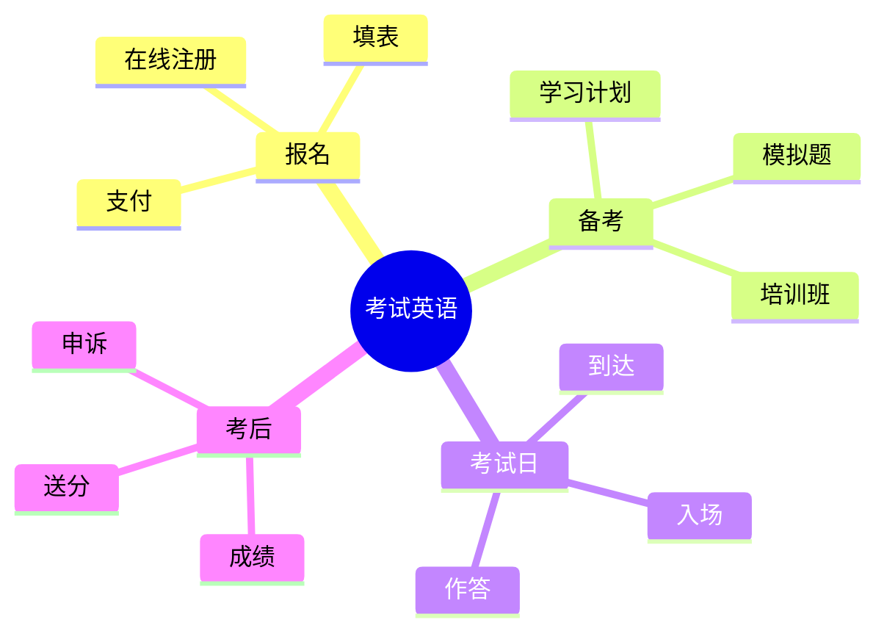

# 考试报名与学术评分场景

> [!info] 本篇定位
> 想出国留学 / 申请英语国家大学 / 移民，**绕不开的就是英语考试**。
>
> 中国学生面对的常见考试：
>
> - **TOEFL** （托福，美国大学）
> - **IELTS** （雅思，英联邦国家）
> - **GRE** （研究生入学）
> - **SAT** （美国本科）
> - **GMAT** （商学院）
> - **校内期中/期末考**
>
> 每一关都有**报名、备考、考试日、成绩、申诉**全流程。
>
> 本篇覆盖**所有考试场景**，让你**从报名到拿到分数全程英语化**。

---

## 1. 本篇导读：考试英语全景

### 1.1 主流英语考试对比

| 考试 | 用途 | 满分 | 时长 |
| ---- | ---- | ---- | ---- |
| TOEFL iBT | 美国 / 欧洲大学 | 120 | 约 3 小时 |
| IELTS Academic | 英联邦大学 | 9 | 约 3 小时 |
| GRE | 美国研究生 | 340 + 6 | 约 2 小时 |
| GMAT | 商学院 | 805 | 约 2 小时 |
| SAT | 美国本科 | 1600 | 约 2 小时 |
| ACT | 美国本科 | 36 | 约 2 小时 |
| TOEIC | 商务英语 | 990 | 约 2 小时 |

### 1.2 考试英语的特殊性



---

## 2. 标准化考试介绍（Standardized Tests）

### 2.1 TOEFL（Test of English as a Foreign Language）

**TOEFL iBT 结构**：
```
Reading            (阅读 35 分钟，2 篇文章)
Listening          (听力 36 分钟)
Speaking           (口语 16 分钟，4 题)
Writing            (写作 29 分钟，2 题)

总分：120 (4 部分各 30)
```

**美国大学要求**：
```
普通：    80+
中等：    90-100
顶尖：    100-110+
```

### 2.2 IELTS（International English Language Testing System）

**IELTS Academic 结构**：
```
Listening          (听力 30 分钟，4 部分)
Reading            (阅读 60 分钟，3 篇)
Writing            (写作 60 分钟，2 题)
Speaking           (口语 11-14 分钟，与考官面对面)

总分：9 分制 (各部分平均)
```

**英联邦大学要求**：
```
普通：    6.0-6.5
中等：    6.5-7.0
顶尖：    7.0-7.5+
```

### 2.3 GRE（Graduate Record Examination）

**GRE 结构**：
```
Verbal Reasoning      (语文 130-170)
Quantitative Reasoning (数学 130-170)
Analytical Writing    (写作 0-6)

总分：340 + 6
```

### 2.4 SAT / ACT（美国本科）

```
SAT：       Reading + Writing (200-800) + Math (200-800)
            总分 1600

ACT：       English + Math + Reading + Science (各 36)
            总分 36
```

### 2.5 考试相关词汇

```
exam / test                  (考试)
standardized test            (标准化考试)
proficiency test             (能力测试)
mock test / practice test    (模拟考)
section                      (部分)
score                        (分数)
band score                   (分段成绩，雅思用)
percentile                   (百分位)
test-taker                   (考生)
test center                  (考点)
proctor                      (监考)
```

---

## 3. 报名流程（Registration）

### 3.1 在线报名步骤

```
1. 访问官网（ETS for TOEFL/GRE, IELTS.org）
2. 创建账号
3. 选择考试日期
4. 选择考点
5. 填写个人信息
6. 上传证件照
7. 支付报名费
8. 收到确认邮件
9. 打印准考证 (Admission Ticket)
```

### 3.2 报名相关词汇

```
register / sign up           (报名)
account                      (账号)
profile                      (个人资料)
test date                    (考试日期)
test center                  (考点)
fee                          (费用)
discount                     (优惠)
late registration            (晚报名)
cancellation                 (取消)
reschedule                   (改期)
admission ticket / confirmation (准考证)
```

### 3.3 报名相关句型

```
"I'd like to register for TOEFL."
"What's the registration fee?"
"When's the next test date?"
"Are there any test centers in [city]?"
"Could I pay by credit card?"
"How do I get my admission ticket?"
"What documents do I need?"
"Could I change my test date?"
"What's the cancellation policy?"
```

### 3.4 客服电话/邮件

```
Subject: Question about TOEFL registration

Dear ETS Customer Service,

I'm trying to register for the TOEFL iBT test on May 15. I have
the following questions:

1. Are there any test centers available in [city] on that date?
2. What's the late registration deadline?
3. Could I get a fee refund if I cancel?

Thank you for your assistance.

Best regards,
[Name]
ETS ID: [your ID]
```

### 3.5 完整报名对话

```
You：       "Hi, I'd like to register for IELTS."
Staff：     "Sure. Have you registered with us before?"
You：       "No, this is my first time."
Staff：     "Could you fill out this form?"
You：       "Sure. Which test should I take - Academic or General?"
Staff：     "Are you going to university?"
You：       "Yes, I'm applying to graduate school."
Staff：     "Then take Academic. The next available date is May 20."
You：       "How much is it?"
Staff：     "$245. We accept card or cash."
You：       "Where's the test center?"
Staff：     "On the third floor of this building."
You：       "Could I get a refund if I can't make it?"
Staff：     "If you cancel 5 weeks in advance, you get 75% back.
            Less than that, no refund."
You：       "OK, I'll take May 20."
```

---

## 4. 备考阶段（Preparation）

### 4.1 备考词汇

```
study plan                  (学习计划)
study materials             (学习材料)
prep book                   (备考书)
practice test               (练习题)
mock test                   (模拟考)
flashcards                  (闪卡)
target score                (目标分数)
weak areas                  (薄弱点)
strong areas                (强项)
test-taking strategy        (应试技巧)
prep course                 (培训班)
private tutor               (私教)
official guide              (官方指南)
cram                        (临时抱佛脚)
```

### 4.2 制定学习计划

```
"What's my target score?"
"How many hours per day do I need?"
"How long until my test?"
"What are my weak areas?"
"Should I take a prep course?"
"Should I find a private tutor?"
"What materials should I use?"
```

### 4.3 备考资源推荐

**TOEFL**：
```
- The Official Guide to the TOEFL Test
- TPO (TOEFL Practice Online)
- Magoosh
- 新东方/学为贵 (中国)
```

**IELTS**：
```
- Cambridge IELTS series (1-18)
- IELTS Liz (free YouTube)
- E2 Language
```

**GRE**：
```
- Magoosh GRE
- ETS Official Guide
- Manhattan 5lb book
- 杨鹏长难句
```

### 4.4 学习方法

```
"I've been doing TPO every day."
"I'm working through practice tests."
"My speaking is my weakest area."
"I'm taking a prep course."
"I have a tutor twice a week."
"I'm using Anki for vocabulary."
"I do mock tests every weekend."
"I time myself for accuracy."
```

### 4.5 与培训班 / 老师交流

```
"What's my predicted score?"
"What should I focus on?"
"How do I improve my [section]?"
"Could you check my [essay]?"
"What's the best strategy for [section]?"
"Am I ready for the test?"
"Should I postpone my test?"
```

---

## 5. 考试日（Test Day）

### 5.1 考试前

```
"What time should I arrive?"
"What do I need to bring?"
"Could I bring water?"
"Where's the test center?"
"How early should I get there?"
"What's the dress code?"
```

**必带物品**：
```
- Passport / ID
- Admission ticket / Confirmation
- Pencils (some tests)
- Eraser
- Approved calculator (if allowed)
```

**禁止物品**：
```
- Phone
- Smart watch
- Books / notes
- Bag (sometimes)
- Food / drink (sometimes)
- Hat (sometimes)
```

### 5.2 入场

```
Proctor：  "Passport, please."
You：      "Here you go."
Proctor：  "Please put all electronics in this locker."
You：      "OK."
Proctor：  "Sign in here. Do you have any questions before we
           start?"
You：      "What time will the test end?"
Proctor：  "Around 1 PM. Follow me to the testing room."
```

### 5.3 考试中（如何提问）

```
"Excuse me, my computer is frozen."
"My screen isn't working."
"My microphone isn't working."
"I need a bathroom break."
"Could I have more scratch paper?"
"Could you explain the instructions?"
```

### 5.4 处理紧急情况

```
"I'm not feeling well."
"I think I made a mistake on the registration."
"I want to cancel my scores."
"I want to retake the test."
```

### 5.5 完整考试日对话

```
(arriving at test center)

Reception："Hi, here for the test?"
You：     "Yes, IELTS at 9 AM."
Reception："ID, please."
You：     "Here."
Reception："You're checked in. Lockers are on the right - put
           all your belongings in there. Then come back."
You：     "Could I keep my water bottle?"
Reception："Yes, but it must be a clear bottle without labels."
You：     "OK. (puts things away) Where do I go?"
Reception："Room 3, follow the signs."

(at testing room)

Proctor： "Listen carefully to the instructions. You'll have
          [time] for [section]. Any questions?"
You：     "Are we allowed to take notes?"
Proctor： "Yes, paper and pencils are on your desk."
Proctor： "When the timer starts, you may begin."

(during break)

You：     "Excuse me, may I use the bathroom?"
Proctor： "Yes, but the timer doesn't pause."
You：     "OK, thanks."

(end of test)

Proctor： "Time's up. Please put down your pencils. Wait at your
          seat to be dismissed."
```

---

## 6. 各科应试技巧（Test Strategies）

### 6.1 阅读 (Reading)

```
Time management：每篇 ~20 分钟
Skim first: 快速浏览全文
Look for keywords：定位关键词
Don't get stuck: 不会就跳过
Check answers: 时间允许时回查
```

**常用题型词汇**：
```
main idea          (主旨)
detail             (细节)
inference          (推断)
vocabulary         (词汇)
purpose            (目的)
tone               (语气)
```

### 6.2 听力 (Listening)

```
Take notes：    抓关键信息
Predict：       根据题目预测内容
Don't miss：    错过一题别影响下一题
Practice accent：训练各种口音
```

### 6.3 写作 (Writing)

**常见结构**：
```
Introduction：       1 paragraph
- Hook
- Background
- Thesis

Body：               2-3 paragraphs
- Topic sentence
- Evidence
- Analysis

Conclusion：         1 paragraph
- Restate thesis
- Summarize
- Final thought
```

**高分句型**：
```
"It is widely believed that..."
"Although [X] is true, it is also worth considering..."
"On the contrary, ..."
"This phenomenon can be attributed to..."
"In conclusion, the evidence suggests..."
```

### 6.4 口语 (Speaking)

**TOEFL Speaking 4 题**：
```
Independent task    (独立题): 个人观点
Integrated tasks    (综合题): 阅读 + 听力 + 说
```

**IELTS Speaking 3 部分**：
```
Part 1: 自我介绍 + 日常话题 (4-5 分钟)
Part 2: 卡片话题 (1-2 分钟个人陈述)
Part 3: 深入讨论 (4-5 分钟)
```

**口语应试技巧**：
```
"Let me think about it for a second..."   (思考时间)
"I'd say..."
"It depends on..."
"For example, ..."
"To give you an idea, ..."
"In my experience, ..."
"I have to admit, ..."
```

### 6.5 GRE Verbal 词汇

GRE 要求**非常高的词汇量**（10,000+）。

```
高频词例：
ubiquitous          (无所不在的)
ephemeral           (短暂的)
diligent            (勤奋的)
candid              (坦率的)
benevolent          (仁慈的)
malicious           (恶意的)
prudent             (谨慎的)
ostentatious        (炫耀的)
```

---

## 7. 考完查成绩（Getting Results）

### 7.1 成绩查询

```
"When will I get my scores?"
"How do I check my scores?"
"Where can I see my detailed results?"
"Could you email me the official report?"
```

**各考试出分时间**：
```
TOEFL：     6-10 天
IELTS：     13 天 (纸质) / 5-7 天 (机考)
GRE：       8-15 天
SAT：       2-3 周
GMAT：      20 天 (官方)
```

### 7.2 成绩单 (Score Report)

```
official score report           (官方成绩单)
unofficial score                (非官方分数)
test-taker score report         (考生版)
score recipient                 (送分接收方)
percentile rank                 (百分位)
score band                      (分数段)
```

### 7.3 送分（Score Sending）

```
"How do I send scores to schools?"
"How much does it cost to send scores?"
"How many free score reports do I get?"
"Could I send scores after the test?"
"How long does it take to receive?"
"Could I send scores from a previous test?"
```

**送分流程**：
```
1. 登录考试官网账户
2. 选择 "Send Scores"
3. 搜索学校代码 (institution code)
4. 选择要送的成绩
5. 支付费用 (TOEFL $20/份, GRE $30/份)
6. 学校 7-10 天内收到
```

---

## 8. 成绩申诉（Score Disputes）

### 8.1 什么时候申诉

```
- 你觉得评分有错
- 写作 / 口语成绩远低于预期
- 听力 / 阅读出了技术问题
```

### 8.2 申诉流程

**TOEFL**：
```
- Speaking / Writing 可申请 Score Review
- 费用 $80 per section
- 21 天出结果
- 分数可能涨 / 跌 / 不变
```

**IELTS**：
```
- 申请 Enquiry on Results (EOR)
- 6 周内提交
- 费用 ~$80 (退还如果涨分)
- 4-21 天出结果
```

### 8.3 申诉信模板

```
Subject: Score Review Request - [Test Name] [Date]

Dear ETS,

I'm writing to request a score review for my TOEFL iBT taken on
[date], registration number [number].

I scored [X] in Speaking, but based on my preparation and previous
practice scores (consistently [Y]), I believe there may have been
an error.

I would like to request a re-evaluation of my Speaking section.
I understand the fee and the possibility that my score may not
change.

Please confirm receipt of this request.

Thank you,
[Name]
ETS ID: [ID]
```

---

## 9. 重考（Retaking）

### 9.1 重考策略

```
"Should I retake?"
"My target was X but I got Y."
"Could I improve my [section] in [time]?"
"What's the score retention policy?"   (各分项保留)
"Can schools see all my scores?"
```

### 9.2 重考相关词汇

```
retake / reattempt          (重考)
score choice                (分数选择 - 哪些送给学校)
super score                 (合并最高分 - 部分学校)
score history               (历史成绩)
```

> [!tip] Score Choice 重要
>
> **TOEFL / GRE**：你可以选择哪次成绩送学校
> **SAT**：可以选择哪次成绩送学校
> **IELTS**：每次成绩独立，可单独送
>
> 所以**重考是低风险**——考差的可以不送。

### 9.3 完整重考咨询

```
You：     "I scored 95 on TOEFL but my target is 105. Should I
          retake?"
Counselor: "What's your application deadline?"
You：     "December 1st. It's now October."
Counselor: "You have time. Could you study 2 months full focus?"
You：     "Yes."
Counselor: "Then yes, retake. Your weakness was Speaking - score
          22. Speaking can improve a lot in 8 weeks with practice."
You：     "What about my Reading - I got 28."
Counselor: "Keep that up. Focus 70% on Speaking, 30% maintenance."
```

---

## 10. 校内考试（In-Class Exams）

### 10.1 考试类型

```
quiz                       (小测)
midterm                    (期中)
final                      (期末)
pop quiz                   (突击测验)
oral exam                  (口试)
take-home exam             (带回家做)
open-book                  (开卷)
closed-book                (闭卷)
multiple choice            (选择题)
short answer               (简答)
essay question             (论述题)
```

### 10.2 考试前

```
"What's the format?"
"Open book or closed?"
"How long is the test?"
"What chapters does it cover?"
"What's the grading scale?"
"Will there be a curve?"          (调分？)
"Is partial credit given?"
```

### 10.3 考试期间

```
"Could I have another blue book?"
"Could I have more paper?"
"My pen ran out."
"Could you clarify question 5?"
"How much time is left?"
```

### 10.4 关于评分

```
"How are grades calculated?"
"What's the breakdown?"            (分数构成)
"How much is the final worth?"
"What's a passing grade?"
"What's an A in this class?"
```

**美国 GPA 体系**：
```
A    (4.0)         90-100
A-   (3.7)         85-89
B+   (3.3)         80-84
B    (3.0)         75-79
B-   (2.7)         70-74
C+   (2.3)         65-69
C    (2.0)         60-64
D    (1.0)         50-59
F    (0)            <50
```

---

## 11. 奖学金申请（Scholarships）

### 11.1 奖学金类型

```
merit scholarship            (优秀奖学金)
need-based aid               (需求型援助)
athletic scholarship         (体育奖学金)
diversity scholarship        (多样性奖学金)
fellowship                   (研究奖学金)
assistantship                (助教/助研)
TA (Teaching Assistant)
RA (Research Assistant)
GA (Graduate Assistant)
tuition waiver               (学费减免)
stipend                      (生活补贴)
```

### 11.2 申请词汇

```
application                  (申请表)
deadline                     (截止日期)
eligibility                  (资格)
requirement                  (要求)
recommendation letter        (推荐信)
personal statement           (个人陈述)
essay                        (申请文书)
interview                    (面试)
shortlist                    (入围)
award                        (颁发)
recipient                    (获奖者)
```

### 11.3 询问奖学金

```
"What scholarships are available?"
"Am I eligible?"
"What's the application process?"
"What's the deadline?"
"What documents do I need?"
"How much does it cover?"
"Is it renewable?"           (可续吗？)
"How competitive is it?"
"When will I hear back?"
```

### 11.4 奖学金面试

**常见问题**：
```
"Tell me about yourself."
"Why are you applying for this scholarship?"
"What are your career goals?"
"How will this scholarship help you?"
"What makes you stand out?"
"Tell me about a challenge you overcame."
"Where do you see yourself in 5 years?"
"What would you contribute to our community?"
```

**回答框架**：
```
PRESENT (现在): Who I am
PAST    (过去): What I've done
FUTURE  (未来): What I want
```

### 11.5 完整奖学金面试

```
Interviewer： "Tell me about yourself."
You：         "Hi, I'm [Name]. I'm currently studying [Major]
              at [University]. I'm passionate about [field],
              and my long-term goal is to [goal]. I've been
              actively involved in [activities] which have
              shaped my interests."

Interviewer： "Why this scholarship?"
You：         "This scholarship aligns with my goals because
              [reason]. The opportunity to [specific benefit]
              would help me [specific outcome]. I admire that
              your scholarship emphasizes [value], which
              resonates with my own commitment to [related
              value]."

Interviewer： "What makes you a strong candidate?"
You：         "Three things: First, my academic record - I've
              maintained a [GPA] and ranked [position] in my
              class. Second, my research experience - I've
              [achievement]. Third, my leadership in [activity],
              which demonstrates my ability to [skill]."
```

### 11.6 奖学金申请文书

**Personal Statement 结构**：

```
Paragraph 1 (Hook + Thesis):
Open with a story / quote / question
State your main message

Paragraph 2-3 (Background):
Your journey
Key experiences
Achievements

Paragraph 4 (Why this scholarship):
What you've researched
How you'll use it
Alignment with their values

Paragraph 5 (Future):
Career goals
Long-term impact
Conclusion
```

---

## 12. 完整对话场景汇总

### 12.1 场景：第一次报名 TOEFL

```
You：     "Hi, I'd like to register for TOEFL."
Staff：   "Sure. Have you registered with ETS before?"
You：     "No."
Staff：   "Then you need to create an account first. Go to
           ets.org/toefl. Got internet here?"
You：     "Yes."
Staff：   "Sign up, then choose 'Register for a Test'."
You：     "What documents do I need?"
Staff：   "Just your passport and a credit card. The fee is
           $200."
You：     "What if no center is available on my preferred date?"
Staff：   "You can try other dates or the home edition online."
You：     "OK, I'll do online."
```

### 12.2 场景：考试遇到技术问题

```
(during TOEFL Speaking)

You：     "(raises hand) Excuse me, my microphone isn't recording."
Proctor： "Let me check. ... Yes, hardware issue. Wait one moment."
Proctor： "We need to restart this section. You won't lose time."
You：     "Will my previous responses be saved?"
Proctor： "Unfortunately no. We'll have to restart Speaking."
You：     "OK. Could you also give me a fresh sheet of paper?"
Proctor： "Of course."
```

### 12.3 场景：成绩申诉

```
You：     "Hi, I'd like to file a score review for my TOEFL."
ETS：     "Which section?"
You：     "Speaking. I scored 22 but my practice scores were
          consistently 26-28."
ETS：     "Score review for Speaking is $80, payable now."
You：     "Yes, I want to proceed."
ETS：     "It will take 14-21 days. Note that scores can stay
          the same, increase, or decrease."
You：     "I understand."
ETS：     "Could I have your ETS ID?"
You：     "It's [ID]."
ETS：     "Submitted. You'll get an email within 21 days."
```

### 12.4 场景：奖学金获奖通知

```
Email：   "Dear [Name], Congratulations! You have been selected
          as a recipient of the [Name] Scholarship."

You (reply):
Subject:  Re: Scholarship Award - Confirmation

Dear [Committee],

Thank you so much for selecting me for the [Name] Scholarship.
I'm honored and grateful for this recognition.

I confirm my acceptance and look forward to making the most of
this opportunity.

Could you please advise on the next steps for fund disbursement
and any required documentation?

With deepest gratitude,
[Name]
```

---

## 13. 文化差异提醒

### 13.1 中外考试文化差异

```
中国考试：
- 应试文化重
- 一次定胜负 (高考)
- 死记硬背

美国考试：
- 多次机会 (可重考)
- 综合评估
- 分数 + 文书 + 推荐 + 经历
```

### 13.2 关于"考试焦虑"

```
中国学生常严重焦虑。

应对：
✅ 多做模拟考
✅ 接受不完美
✅ 重考不是失败
✅ 找心理咨询（学校通常免费）
```

### 13.3 美国大学申请的全面评估

```
不只看分数：
- 标化考试 (TOEFL/SAT/GRE)
- GPA
- 文书 (essays)
- 推荐信 (recommendation letters)
- 课外活动 (extracurriculars)
- 面试 (interview)
- Background diversity

低分但其他优秀也能录取。
高分但其他平淡可能被拒。
```

---

## 14. 常见错误大盘点

### 14.1 错误 1：报名信息填错

```
姓名 / 出生日期填错 = 不能进考场
按护照填，逐字母核对
```

### 14.2 错误 2：忘带证件

```
没带护照 = 不能考试 + 不退钱
出发前 3 次确认
```

### 14.3 错误 3：迟到

```
迟到超过 30 分钟一般不能入场
提前 1 小时到达
```

### 14.4 错误 4：低估准备时间

```
TOEFL 100+: 3-6 个月
GRE 320+:   3-6 个月
不要 1 个月想刷分
```

### 14.5 错误 5：发音差扣 Speaking 分

```
Speaking 主要看：
- Pronunciation (发音)
- Fluency (流畅)
- Vocabulary (词汇)
- Grammar (语法)
- Logic (逻辑)

四个方面都要练。
```

### 14.6 错误 6：写作模板化

```
ETS / IELTS 检测模板。
模板背得太多 = 套路 = 扣分
要有自己的逻辑和例子
```

### 14.7 错误 7：成绩送错学校

```
学校代码看清楚！
错送 = 重新付费 = 浪费
```

---

## 15. 练习与输出建议

> [!success] 本篇练习清单
>
> **基础练习**
>
> 1. 列出**你的 3 个目标考试**（TOEFL/IELTS/GRE 等）+ 目标分数
>
> 2. 制定**3 个月备考计划**：
>    - 每周时间分配
>    - 每周目标
>    - 模拟考频率
>
> 3. 写一封**询问考试的英文邮件**（给 ETS / British Council）
>
> **场景模拟**
>
> 4. 模拟 5 个对话：
>    - 在线报名
>    - 考试日入场
>    - 考试中技术问题
>    - 成绩申诉
>    - 奖学金面试
>
> **写作练习**
>
> 5. 准备一份 **Personal Statement** (500 词)
>
> 6. 准备 **奖学金面试 5 个常见问题** 的回答
>
> **AI 角色扮演**
>
> 7. 让 AI 扮演**奖学金面试官**，进行 30 分钟模拟。
>
> **长期任务**
>
> 8. 注册 **官方 TOEFL/IELTS 模拟考**（一次免费试用）
>
> 9. 加入 **考试备考群**，每天分享进度，相互监督。

---

## 16. 本篇小结

> [!success] 本篇核心要点回顾
>
> **主流考试**：
> - TOEFL (120) / IELTS (9) / GRE (340) / SAT (1600)
>
> **报名流程**：
> 在线注册 → 选日期 → 选考点 → 上传照片 → 付费
>
> **考试日**：
> - 提前 1 小时到
> - 带护照 + 准考证
> - 不带电子产品
>
> **应试技巧**：
> - 阅读：定位关键词 + 跳过难题
> - 听力：抓重点笔记
> - 写作：5 段结构 + 高分句型
> - 口语：思考时间 + 例子 + 流畅
>
> **成绩**：
> - TOEFL 6-10 天 / IELTS 13 天 / GRE 8-15 天
> - 送分有费用
> - Score Choice 让你选送
>
> **申诉**：可以申请 review，分数可能涨/跌/不变
>
> **重考**：低风险，多次考机会
>
> **奖学金**：
> - merit / need-based / fellowship
> - 申请 + 文书 + 推荐 + 面试
>
> **文化差异**：
> - 美国大学综合评估，不只看分数
> - 重考不是失败

### 16.1 下一篇预告

> [!info] 下一篇：04.留学申请与校园生活场景
>
> 下一篇是 **09 分类的收官篇**：
>
> - **留学申请**：选校 / 文书 / 推荐信 / 面试
> - **录取后**：签证 / 行前准备
> - **校园生活**：选课 / 宿舍 / 社团
> - **文化适应**：饮食 / 语言 / 想家
>
> 这一篇让你**留学全流程英语化**。
