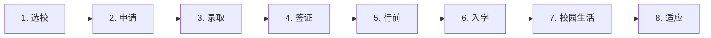

# 留学申请与校园生活场景

> [!info] 本篇定位
> 这是 **09.学习与教育场景实战** 分类的**收官篇**，也是留学整个旅程的**总览**。
>
> 留学不仅仅是"读书"，而是一段**长达 1-5 年的英语沉浸**。
>
> 中国学生留学常见困境：
>
> - 选校时不知道怎么对比
> - PS 写不出"个性"
> - 签证面试紧张
> - 抵达后第一周完全懵
> - 选课不知道怎么选
> - 宿舍和室友相处不来
> - 想家、文化冲击
>
> 本篇覆盖**留学全流程**：申请 → 录取 → 签证 → 行前 → 入学 → 校园生活 → 文化适应。

---

## 1. 本篇导读：留学全流程



---

## 2. 选校（Choosing Schools）

### 2.1 选校考虑因素

```
ranking                    (排名)
location                   (地理位置)
weather                    (气候)
cost / tuition             (学费)
financial aid              (经济援助)
program quality            (项目质量)
faculty                    (师资)
research opportunities     (研究机会)
campus life                (校园生活)
diversity                  (多样性)
class size                 (班级规模)
career placement           (就业)
alumni network             (校友网络)
```

### 2.2 选校相关词汇

```
reach school               (冲刺校 - 难录取)
target school              (目标校 - 应该能进)
safety school              (保底校 - 一定能进)
dream school               (梦校)
top tier                   (顶尖)
mid tier                   (中等)
state school               (州立)
private school             (私立)
liberal arts college       (文理学院)
research university        (研究型大学)
community college          (社区大学)
```

### 2.3 与 College Counselor 沟通

```
"I'm interested in [field]."
"What schools should I consider?"
"What's a realistic target?"
"How competitive is [school]?"
"What are my chances of getting in?"
"Should I apply ED (Early Decision) or RD (Regular Decision)?"
"How many schools should I apply to?"
"What's a balanced school list?"
```

### 2.4 信息会与公开课

```
"What's the average GPA of admitted students?"
"What's the acceptance rate?"
"What's the average class size?"
"What's student-faculty ratio?"
"What's the most popular major?"
"How's the housing?"
"Tell me about campus life."
"Where do graduates go after?"
```

---

## 3. 申请文书（Application Essays）

### 3.1 文书类型

```
Personal Statement / PS         (个人陈述)
Statement of Purpose / SOP      (研究目标 - 研究生)
Common App Essay                (本科通用文书)
Supplemental Essays             (补充文书 - 校特有)
Diversity Statement             (多样性陈述)
Research Statement              (研究陈述)
Cover Letter                    (求职信)
```

### 3.2 PS / SOP 结构

```
1. Hook                  (开头吸引)
2. Background            (背景介绍)
3. Why this field        (为什么这个领域)
4. Why this school       (为什么这个学校)
5. Future goals          (未来目标)
6. Conclusion            (总结)
```

### 3.3 PS 经典开头（不要套路）

```
✅ 好开头：
"At age 12, I dismantled my family's broken VCR..."
"The day my grandmother forgot my name was..."
"I've always thought I would be a doctor, until..."

❌ 套路开头：
"Education is the most important thing in life."
"From a young age, I've always loved learning."
"Math and science are my passions."
```

### 3.4 文书常见弱点

```
❌ 太宽泛 (too broad)
❌ 太抽象 (too abstract)
❌ 太正式 (too formal)
❌ 自夸过度 (boasting)
❌ 复述简历 (rephrasing CV)
❌ 模板化 (template-like)
❌ 套用名言 (cliché quotes)

✅ 用具体故事
✅ 用感官细节
✅ 展现思考过程
✅ 展现 vulnerability (脆弱性)
✅ 反思 + 成长
```

### 3.5 修改文书的句型

```
"I want this essay to feel more personal."
"How can I make my opening stronger?"
"Is my thesis clear?"
"Does this show my character?"
"Could you suggest a better example?"
"Is this story too generic?"
```

### 3.6 完整 PS 修改对话

```
You：     "Could you give me feedback on my PS draft?"
Counselor: "Sure, let me read it... 
            Your essay is well-written, but it reads more like
            a CV in prose form. I want to know YOU, not just
            your achievements."
You：     "How do I show 'me'?"
Counselor: "Pick one specific moment - a 'aha!' moment, a
            challenge, a realization. Show what you thought,
            felt, learned."
You：     "I have a story about a research project that failed."
Counselor: "Perfect! Failure stories are powerful because they
            show resilience and self-reflection."
You：     "Should I write the whole essay around it?"
Counselor: "Yes. Open with the failure, then show what you
            learned, then how it shaped your goals."
```

---

## 4. 推荐信（Recommendation Letters）

### 4.1 推荐信策略

```
Who to ask:
✅ 教过你的教授（最佳）
✅ 实习导师
✅ 研究 PI
❌ 名人但不了解你的人
❌ 远房亲戚
❌ 总统/政客（除非真的认识你）

Strong letter > Famous name
```

### 4.2 请求推荐信

**邮件请求**：
```
Subject: Recommendation Letter Request - Graduate School

Dear Professor [Last Name],

I hope this email finds you well. I'm applying to graduate
programs in [field] for Fall 2026, and I would be honored if
you would consider writing me a recommendation letter.

I took your [course] in [semester] and worked on [project].
You've seen my work in [specific area].

If you're willing, I can send you:
- My CV and transcript
- My personal statement
- Information about each school
- Deadlines

The earliest deadline is [date]. Would you have time?

Thank you for considering. I appreciate everything you've
taught me.

Best regards,
[Name]
```

### 4.3 当面请求

```
You：     "Professor, do you have a moment?"
Prof：    "Sure, what's up?"
You：     "I'm applying to grad school for [field]. Would you be
          willing to write me a recommendation letter?"
Prof：    "I'd be happy to. How many schools?"
You：     "Six. The earliest deadline is December 15."
Prof：    "OK. Send me your CV, statement, transcript, and the
          list of schools. The more time the better."
You：     "I'll have everything to you by Friday. Thank you so
          much!"
```

### 4.4 跟进推荐信

```
"I'm checking in on the recommendation letter."
"The deadline is approaching - would you need any more info?"
"Could I help in any way?"
"Thanks again for taking the time."
```

### 4.5 录取后的感谢

```
"I'm thrilled to share that I was accepted into [school]!"
"Thank you so much for your support."
"I couldn't have done it without your recommendation."
"I'd love to keep in touch."
```

---

## 5. 申请面试（Application Interviews）

### 5.1 面试类型

```
alumni interview            (校友面试)
admissions interview        (招生面试)
faculty interview           (导师面试 - PhD)
group interview             (集体面试)
phone / video interview     (电话/视频)
on-campus interview         (校内)
```

### 5.2 常见面试问题

**通用 10 问**：

```
① "Tell me about yourself."
② "Why did you choose this school?"
③ "Why this major / program?"
④ "What are your strengths and weaknesses?"
⑤ "Tell me about a challenge you overcame."
⑥ "What's your proudest achievement?"
⑦ "Where do you see yourself in 5/10 years?"
⑧ "What questions do you have for me?"
⑨ "What other schools are you considering?"
⑩ "Why should we accept you?"
```

### 5.3 STAR 法则回答

```
S - Situation     (情境)
T - Task          (任务)
A - Action        (行动)
R - Result        (结果)
```

**示例**：

```
Q: "Tell me about a challenge you overcame."

S: "In my junior year, I led a team project to develop an app."
T: "We needed to launch in 3 months, but our original plan failed."
A: "I reorganized the team, set new milestones, and learned new
   tools."
R: "We launched on time, with 1,000 users in the first week. I
   learned to adapt under pressure."
```

### 5.4 面试当天

**入场前**：
```
"Hi, I have an interview at 2 PM with [Name]."
"Could I have some water?"
"Where should I wait?"
```

**面试中**：
```
"Thank you for taking the time."
"It's a pleasure to meet you."
"Let me think about that for a second..."
"That's a great question."
"Could you give me a moment?"
"I'd love to elaborate on that."
```

**结束**：
```
"Thank you so much for your time."
"It was great learning more about [school]."
"What are the next steps?"
"When can I expect to hear back?"
"Could I follow up by email if I have more questions?"
```

### 5.5 面试官提问环节（你问）

**Good questions**：
```
"What do you love most about [school]?"
"How would you describe the student culture here?"
"What's a typical first-year experience like?"
"How does the school support international students?"
"What's the most surprising thing you've learned about [school]?"
"What advice would you give incoming students?"
```

**Bad questions**：
```
❌ "What's the salary after graduation?"  (过早问)
❌ "How easy is it to graduate?"           (显得不认真)
❌ "Do I get scholarships?"                (查官网)
```

### 5.6 面试后跟进

```
Subject: Thank You - Interview on [Date]

Dear [Interviewer's Name],

Thank you for taking the time to interview me yesterday.

I especially enjoyed learning about [specific thing they
mentioned]. Your perspective on [topic] gave me a lot to
think about.

I'm even more excited about [school] after our conversation.
Please let me know if you need any additional information.

Best regards,
[Name]
```

---

## 6. 录取与决定（Acceptance & Decisions）

### 6.1 收到录取

```
"Congratulations on your admission!"
"We are pleased to inform you..."
"You've been accepted into [school]!"
```

**确认录取**：
```
"I'm thrilled to accept your offer."
"I confirm my acceptance."
"I'd like to enroll for [semester]."
```

### 6.2 谈判奖学金

```
"Could I be considered for additional aid?"
"I received a more generous offer from [school]."
"Could you match it?"
"Is there a merit scholarship I'm eligible for?"
"Is the financial aid package final?"
```

### 6.3 推迟入学（Deferral）

```
"I'd like to request a deferral."
"Could I defer for one year?"
"What's the process for deferral?"
"Do I need to reapply?"
```

### 6.4 拒绝录取

```
"I appreciate your offer, but I've decided to attend [other]."
"Thank you for the opportunity. I've decided to go elsewhere."
"It was a difficult decision, but I will not be enrolling."
```

### 6.5 Waitlist（候补名单）

```
"You've been placed on our waitlist."
"I'd like to remain on the waitlist."
"What's the typical waitlist movement?"
"Is there anything I can submit to strengthen my application?"
```

---

## 7. 签证申请（Visa - F-1 / J-1 / Tier 4）

### 7.1 留学签证类型

```
F-1                  (美国学生签证)
J-1                  (美国交换学者)
M-1                  (美国职业培训)
Tier 4 / Student Visa (英国)
Subclass 500         (澳洲学生签证)
Study Permit         (加拿大学习许可)
```

### 7.2 签证准备词汇

```
visa application            (签证申请)
DS-160                      (美国签证申请表)
I-20                        (学校录取证明)
SEVIS fee                   (学生身份费)
visa interview              (签证面试)
embassy / consulate         (大使馆/领事馆)
appointment                 (预约)
required documents          (所需文件)
financial documents         (财务证明)
bank statement              (银行流水)
sponsor letter              (担保信)
```

### 7.3 美国签证面试 (F-1) 经典问题

```
① "Why do you want to study in the US?"
② "Why this university?"
③ "What's your major?"
④ "How will you fund your studies?"
⑤ "What does your sponsor do?"
⑥ "What are your plans after graduation?"
⑦ "Will you return to your home country?"
⑧ "Have you been to the US before?"
⑨ "How many schools did you apply to?"
⑩ "Tell me about your school."
```

### 7.4 完整美国签证面试

```
Officer：  "Good morning. May I see your passport and DS-160?"
You：      "Here you go."
Officer：  "Why do you want to study in the US?"
You：      "I'm pursuing a Master's in Computer Science. The US
           has the best programs in AI, which is my interest."
Officer：  "Why University of Michigan specifically?"
You：      "Their AI lab is led by Professor [Name], whose
           research aligns with my interests. I've been
           following his work for two years."
Officer：  "Who's funding your studies?"
You：      "My parents. They've saved for my education. I have
           bank statements showing $200,000 USD."
Officer：  "What does your father do?"
You：      "He's a senior engineer at [Company] in China."
Officer：  "Plans after graduation?"
You：      "I plan to work for 1-2 years on OPT to gain
           experience, then return to China to start my own
           AI startup."
Officer：  "Why return to China?"
You：      "China has a huge market for AI applications. My
           family is there. I want to contribute to the tech
           industry in my home country."
Officer：  "(types something) ... Your visa is approved. Pick
           up your passport in 5-7 business days."
You：      "Thank you very much!"
```

### 7.5 签证拒签后

```
"I was denied my visa."
"What was the reason?"
"How can I appeal?"
"When can I reapply?"
"What additional documents should I prepare?"
```

**常见拒签原因 (214(b) for US)**：
- Insufficient ties to home country (没有回国理由)
- Financial concerns
- Inconsistent answers
- Suspicious intent

---

## 8. 行前准备（Pre-Departure）

### 8.1 行前清单

```
documents：
□ Passport (with visa)
□ I-20 / Acceptance letter
□ Transcripts (sealed copies)
□ Vaccination records
□ Travel insurance

money：
□ Cash ($300-500)
□ Credit card with international fee
□ Set up US bank online
□ Tell bank about travel

essentials：
□ Laptop + chargers
□ Voltage adapter
□ Prescription medications
□ Important contacts

clothes：
□ Climate-appropriate
□ Formal attire
□ Comfortable shoes

else：
□ Phone plan (US SIM or international roaming)
□ Health insurance
□ Health checkup
```

### 8.2 与学校沟通

```
"When should I arrive on campus?"
"Where do I pick up my I-20?"
"How do I get to campus from the airport?"
"Is there an airport pickup service?"
"Where will I be staying?"
"What should I bring vs. buy in the US?"
"Are there any pre-arrival forms?"
```

### 8.3 国际学生 Orientation

```
"What's the orientation schedule?"
"Is orientation mandatory?"
"What should I bring?"
"Will there be food?"
"Will there be tours?"
```

---

## 9. 抵达与入境

### 9.1 海关入境

```
Officer：  "What's the purpose of your visit?"
You：      "I'm a student at [University]."
Officer：  "Could I see your I-20?"
You：      "Here."
Officer：  "What's your major?"
You：      "Computer Science."
Officer：  "How long is your program?"
You：      "Two years for my Master's."
Officer：  "Where will you be staying?"
You：      "On-campus dormitory."
Officer：  "Welcome to the United States. Your stamp is good
           for the duration of your studies (D/S)."
```

### 9.2 抵达学校

```
"I just arrived. Where do I check in?"
"Where's the international student office?"
"How do I get my student ID?"
"When can I move into my dorm?"
"Where can I get the campus map?"
"Is there a SIM card store nearby?"
"Where's the bookstore?"
```

### 9.3 SEVIS 报到

**所有 F-1 学生抵达后必须报到**：

```
"I need to check in for SEVIS."
"I'm a new F-1 student."
"Could you activate my SEVIS record?"
"What documents do I need?"
"When's the deadline to check in?"
```

---

## 10. 选课与注册（Course Registration）

### 10.1 选课词汇

```
course catalog              (课程目录)
course schedule             (课程表)
prerequisites               (先修课)
credit hour                 (学分)
full-time                   (全职 - 12+ credits)
part-time                   (兼职 - <12 credits)
add / drop period           (加退课期)
waitlist                    (候补)
audit                       (旁听)
pass / fail option          (P/F 选项)
academic advisor            (学术顾问)
register                    (注册)
enroll                      (报名)
```

### 10.2 与学术顾问见面

```
You：       "Hi, I'm a new student. I need help choosing courses."
Advisor：   "Welcome! What's your major?"
You：       "Computer Science."
Advisor：   "Great. Did you check the curriculum?"
You：       "Yes, I'm not sure which electives to take first."
Advisor：   "What are you most interested in?"
You：       "AI and machine learning."
Advisor：   "Then take CS 480 - Intro to AI. You should have
            the prerequisites."
You：       "How many courses should I take this semester?"
Advisor：   "Most full-time students take 4. As an international
            student, you must take at least 9 credits to
            maintain F-1 status."
You：       "Got it. Could you help me register?"
Advisor：   "Yes, let's go through it together."
```

### 10.3 选课句型

```
"How many credits is this class?"
"What's the workload like?"
"Is this class hard?"
"Who's teaching it?"
"Is it the same instructor next semester?"
"Are there alternative sections?"
"What time does it meet?"
"Is there a waitlist?"
"Could I take this pass/fail?"
```

### 10.4 加退课

```
"I'd like to add this class."
"I want to drop this class."
"Can I switch sections?"
"What's the drop deadline?"
"Will I get a refund?"
"Will it show on my transcript?"
"How does this affect my F-1 status?"
```

> [!warning] F-1 学生选课限制
>
> 必须**满足全职要求**（一般 9-12 credits）才能保持 F-1 身份。
> 退课导致低于要求 = 失去合法身份。
> 退课前必须**先咨询国际学生办公室**！

---

## 11. 宿舍生活（Dorm Life）

### 11.1 宿舍词汇

```
dormitory / dorm            (宿舍)
residence hall              (宿舍楼)
single room                 (单人间)
double room                 (双人间)
shared room                 (合住)
private bathroom            (独立卫浴)
shared bathroom             (公共卫浴)
roommate                    (室友)
RA (Resident Assistant)     (宿管)
RD (Resident Director)      (宿管主管)
common area                 (公共区域)
laundry room                (洗衣房)
kitchen                     (厨房)
study room                  (自习室)
move-in / move-out          (入住/搬出)
key card                    (门卡)
quiet hours                 (安静时间)
visitor policy              (访客政策)
fire drill                  (消防演习)
```

### 11.2 入住

```
"Hi, I'm moving in. My room is 504."
"Could I get my key?"
"How do I activate my key card?"
"Where's my mailbox?"
"What's the WiFi password?"
"Where's the laundry room?"
"How does the heating work?"
"Where do I put trash?"
```

### 11.3 与室友相处

**初次见面**：
```
"Hi! I'm John, your roommate."
"Where are you from?"
"What's your major?"
"What year are you?"
"Have you been here before?"
"Should we set some ground rules?"
```

**讨论规则**：
```
"What time do you usually sleep?"
"Are you OK with friends visiting?"
"How should we split chores?"
"Do you mind if I play music?"
"How do you feel about borrowing things?"
"Are you OK with food in the room?"
```

**矛盾沟通**：
```
"Could we talk about something?"
"I'm bothered by [specific thing]."
"Could we agree on [solution]?"
"How can we make this work?"
"Is there something I can do better?"
```

**完整室友对话**：

```
You：     "Hi! I'm John, your roommate. Just moved in."
Roommate："Hi John, I'm Mike. Where are you from?"
You：     "Beijing, China. You?"
Mike：    "Texas. First time having a roommate from another
          country, this is cool."
You：     "Same here. Should we set some basics?"
Mike：    "Yeah good idea. I'm a night owl, sleep around 1 AM."
You：     "I'm earlier, around 11. Could you keep noise down
          after 11?"
Mike：    "Of course. What about visitors?"
You：     "Maybe weekend visitors are fine, weeknights kind of
          quiet?"
Mike：    "Works for me. Cleaning?"
You：     "How about we alternate weeks?"
Mike：    "Deal. Welcome to the US!"
```

### 11.4 投诉

```
"My RA's name is [Name]."
"I have a problem with my room."
"Could I switch rooms?"
"My roommate isn't following rules."
"How do I file a complaint?"
"I need to talk to the RD."
```

---

## 12. 社团活动（Clubs & Activities）

### 12.1 社团类型

```
academic club              (学术社团)
cultural club              (文化社团)
sports club                (体育社团)
volunteer organization     (志愿者组织)
Greek life                 (兄弟会/姐妹会 - frat/sorority)
honor society              (荣誉学会)
international student      (国际生组织)
student government         (学生会)
debate club                (辩论社)
performing arts            (表演艺术)
language exchange          (语言交流)
```

### 12.2 加入社团

```
"How do I join a club?"
"When are the activities?"
"How often do you meet?"
"Are there any membership fees?"
"Do I need experience?"
"How do I sign up?"
"Is there an application process?"
```

### 12.3 Activity Fair（社团招新）

```
"Tell me about your club."
"What's the time commitment?"
"What kind of events do you do?"
"How big is the club?"
"How can I get involved?"
"Could I attend a meeting?"
"Where do I sign up?"
```

### 12.4 社团里的对话

```
"Hi, I'm new. Is this the [club] meeting?"
"Could I introduce myself?"
"What do members usually do here?"
"Could I help with anything?"
"When's the next event?"
```

---

## 13. 校园资源（Campus Resources）

### 13.1 重要部门

```
international student office     (国际学生办公室)
academic advising                (学术顾问)
career services                  (职业发展)
counseling center                (心理咨询)
health services                  (健康中心)
writing center                   (写作中心)
financial aid office             (经济援助)
registrar                        (注册处)
bursar                           (财务办)
library                          (图书馆)
recreation center                (健身中心)
dining services                  (餐饮服务)
transportation                   (交通)
```

### 13.2 心理健康资源

```
"I'd like to schedule a counseling appointment."
"Are services free for students?"
"Is what I share confidential?"
"What if I need a long-term counselor?"
"I'm dealing with [issue], can someone help?"
```

### 13.3 健康服务

```
"I'm not feeling well."
"How do I make an appointment?"
"Is there a same-day appointment?"
"Could I get a flu shot?"
"Could I refill a prescription?"
"How does insurance work?"
```

### 13.4 职业服务

```
"I need help with my resume."
"Could I do a mock interview?"
"How do I find internships?"
"When's the career fair?"
"Could you connect me with alumni?"
```

---

## 14. 文化适应（Cultural Adjustment）

### 14.1 文化冲击 4 阶段

```
1. Honeymoon phase    (蜜月期 - 1-3 个月)
   一切都新奇

2. Frustration phase  (挫折期 - 3-6 个月)
   语言障碍、想家、孤独

3. Adjustment phase   (适应期 - 6-12 个月)
   开始建立社交圈

4. Acceptance phase   (接受期 - 12 个月+)
   感到舒适
```

### 14.2 想家应对

```
"I'm feeling homesick."
"I miss my family."
"Could I talk to someone?"
"What helps with homesickness?"

应对方法：
- 视频通话家人
- 找同乡群
- 出去走走
- 加入兴趣社团
- 必要时心理咨询
```

### 14.3 文化差异表达

```
"That's interesting, in China we..."
"In my culture, we..."
"Could you tell me more about [custom]?"
"I'm not familiar with that."
"That's different from what I'm used to."
```

### 14.4 完整文化适应对话

```
You：     "I've been here 3 months and I'm starting to feel really
          lonely."
Counselor: "That's common - you're in the frustration phase of
           cultural adjustment. It's totally normal."
You：     "I feel like I can't really connect with American
          students."
Counselor: "What's been hard?"
You：     "Their humor, references to TV shows I don't know,
          slang. I always feel one step behind."
Counselor: "Have you tried being open about it? People are often
           more welcoming when you ask questions."
You：     "I'm worried they'll think I'm dumb."
Counselor: "On the contrary - asking shows curiosity. Have you
           connected with other international students?"
You：     "A bit. We have an ISA group."
Counselor: "Good. Mix both - international community for
           support, and gradually engage with American students."
You：     "I'll try."
Counselor: "Also, check out our [event] - good way to meet people
           through common interests."
```

### 14.5 校园歧视处理

```
"I experienced discrimination."
"Someone made racist comments."
"I want to file a report."
"Where do I report this?"
"What support is available?"
```

**学校通常有**：
- Office of Diversity and Inclusion
- Bias Reporting System
- Counseling support
- Legal support

---

## 15. 完整对话场景汇总

### 15.1 场景：申请季咨询

```
You：       "I'm applying to PhD programs. Could I get advice?"
Counselor：  "What field?"
You：       "Computer Science."
Counselor：  "Top programs are very competitive. What's your GPA
            and GRE?"
You：       "GPA 3.8, GRE 325."
Counselor：  "Strong. Research experience?"
You：       "Two papers, one published in ACL."
Counselor：  "Excellent. I'd suggest 4-6 reach schools, 4-6
            target, 2-3 safety. 12-15 total."
You：       "Any tips for the SOP?"
Counselor：  "Focus on research fit. Identify specific professors
            at each school whose work aligns with yours."
You：       "How important are recommendation letters?"
Counselor：  "Critical for PhD. Get strong letters from people
            who know your research, not just classroom work."
You：       "Thanks!"
```

### 15.2 场景：第一周遇到的问题

```
You：     "Hi, I'm a new international student. I have a few
          questions."
ISO：     "Welcome! What can I help with?"
You：     "First, my SEVIS record. Did it get activated?"
ISO：     "Let me check. Yes, you're activated. Your SEVIS ID
          is on your I-20."
You：     "Second, I need to open a bank account. What do I need?"
ISO：     "Passport, I-20, and proof of address. Try Bank of
          America or Chase, both have student accounts."
You：     "Third, my health insurance - how do I activate it?"
ISO：     "It's automatic with your tuition. Your card will
          mail in 2-3 weeks."
You：     "Last - I'm overwhelmed. How do I make friends?"
ISO：     "Common experience! Join clubs that match your
          interests. Attend ISO events. Talk to roommates.
          It takes time, but you'll find your people."
You：     "Thanks so much!"
```

### 15.3 场景：心理咨询

```
You：     "I'd like to talk to a counselor."
Center：  "Sure, do you want a same-day intake?"
You：     "Yes, please."

(in session)

Counselor: "What brings you here today?"
You：     "I've been overwhelmed. Coursework is hard, I miss home,
          and I'm not sleeping well."
Counselor: "That sounds really stressful. How long has this
          been going on?"
You：     "About a month. Since midterms started."
Counselor: "Let's talk about strategies. Can you describe a
          typical day?"
...

Counselor: "Here's what I suggest: weekly sessions for a month,
          plus we'll work on sleep hygiene and time management.
          How does that sound?"
You：     "I'd appreciate that."
Counselor: "All conversations are confidential, by the way.
          Nothing goes to the school."
You：     "Thank you."
```

---

## 16. 常见错误大盘点

### 16.1 错误 1：PS 太空洞

```
❌ "I love learning. I work hard. I want to make a difference."
✅ Specific story + reflection + connection to goals
```

### 16.2 错误 2：要求"权威"教授写推荐信

```
不熟悉的有名教授 < 熟悉你的普通教授

强推荐信看：
- 具体例子
- 详细评估
- 个性洞察
```

### 16.3 错误 3：签证面试穿着随便

```
✅ 商务休闲 (business casual)
❌ T 恤 + 牛仔裤
✅ 衬衫 + 裤子
```

### 16.4 错误 4：签证面试给"应该回答"

```
✅ 真实但有逻辑的回答
❌ 背诵"标准答案"

签证官非常会分辨真假。
```

### 16.5 错误 5：抵达前不联系学校

```
应在出发前 2-4 周：
- 联系国际学生办公室
- 了解抵达流程
- 联系室友
- 问行前问题
```

### 16.6 错误 6：选课不咨询

```
❌ 自己决定，没问 advisor
后果：可能选错、影响 F-1、毕业延迟

✅ 每学期前与 advisor 见面
```

### 16.7 错误 7：宿舍冲突逃避

```
和室友有矛盾：
❌ 沉默忍受 → 累积爆发
❌ 直接搬走 → 不一定能批
✅ 早期沟通 + 设定规则
✅ 必要时找 RA
```

---

## 17. 练习与输出建议

> [!success] 本篇练习清单
>
> **基础练习**
>
> 1. 写一份**3 个目标学校列表**（reach/target/safety）
>
> 2. 准备**STAR 框架的 5 个故事**（用于面试）
>
> 3. 准备**签证面试 10 个标准问题** 的英文回答
>
> **写作练习**
>
> 4. 写一份**完整的 PS / SOP**（500-1000 词）
>
> 5. 写**3 封推荐信请求邮件**给不同教授
>
> 6. 写一份**Thank-you note** 给面试官
>
> **场景模拟**
>
> 7. 模拟 5 个对话：
>    - 与申请顾问咨询
>    - 签证面试
>    - 抵达学校第一天
>    - 与室友定规则
>    - 心理咨询初次
>
> **AI 角色扮演**
>
> 8. 让 AI 扮演**签证官 / 招生官**，进行模拟面试。
>
> **长期任务**
>
> 9. 加入一个**留学群**或**论坛**，和真实留学生交流。
>
> 10. 看一些**留学 Vlog**（YouTube），感受真实生活。

---

## 18. 本篇小结

> [!success] 本篇核心要点回顾
>
> **留学全流程 8 步**：
> 选校 → 申请 → 录取 → 签证 → 行前 → 入学 → 校园 → 适应
>
> **选校**：
> - reach / target / safety (3 类)
> - ranking + fit + cost
>
> **申请文书**：
> - PS / SOP / Common App / Supplemental
> - 用具体故事 + 反思 + 成长
>
> **推荐信**：
> - 选熟悉你的人
> - 提前 1 个月请求
> - 提供完整材料
>
> **面试**：
> - STAR 法则
> - 准备 10 个常见问题
> - 准备问对方的问题
> - 后续跟进感谢信
>
> **签证 (F-1)**：
> - DS-160 + I-20 + SEVIS
> - 面试核心：学习目的 + 资金 + 回国意愿
>
> **行前准备**：
> - 文件 + 钱 + 必需品 + 衣服
> - 联系学校
>
> **校园生活**：
> - SEVIS 报到
> - 选课与 advisor
> - 宿舍 + 室友规则
> - 加入社团
>
> **文化适应**：
> - 4 阶段（蜜月 → 挫折 → 适应 → 接受）
> - 心理咨询免费保密
> - 多种社交圈
>
> **常见错误**：
> - PS 空洞
> - 签证回答标准化
> - 选课不咨询
> - 宿舍冲突逃避

### 18.1 09 分类收官

恭喜完成 **09.学习与教育场景实战** 分类全部 4 篇：

```
✅ 01.课堂讨论与提问
✅ 02.图书馆作业与研究
✅ 03.考试报名与学术评分
✅ 04.留学申请与校园生活
```

**现在你已经掌握**：
- **课堂参与**（提问/小组/Presentation/教授沟通）
- **学术研究**（图书馆/数据库/论文/引用/查重）
- **考试体系**（TOEFL/IELTS/GRE/SAT/校内考）
- **留学全流程**（申请/签证/抵达/校园/适应）

**这是"留学英语全套技能"的完整覆盖**。

### 18.2 下一分类预告

> [!info] 下一分类：10.职场与商务场景实战
>
> 接下来 4 篇进入**职场场景**：
>
> - **10.01** 求职简历面试与 Offer 谈判
> - **10.02** 会议汇报与演示
> - **10.03** 商务邮件与正式书面沟通
> - **10.04** 商务谈判合同与客户沟通
>
> 这一系列让你**外企工作 / 国际职场**毫无障碍。
>
> **下一篇**：从**求职**开始 - 职场的第一步。
