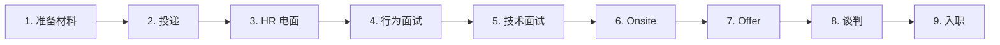
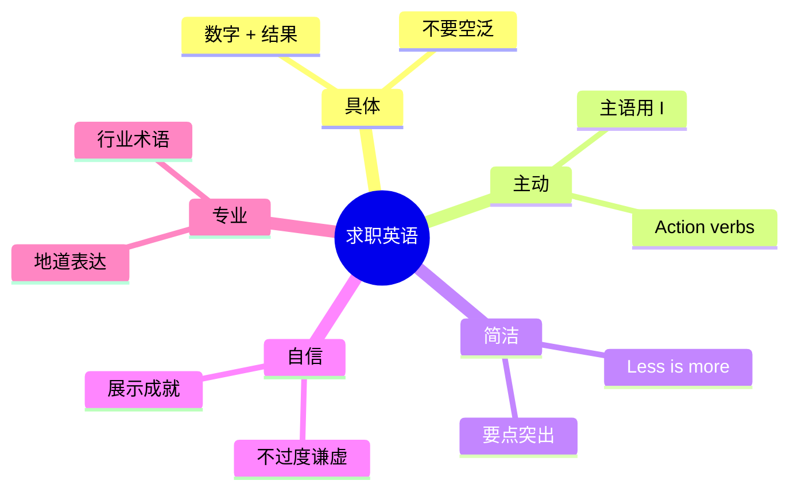

# 求职简历面试与 Offer 谈判

> [!info] 本篇定位
> 欢迎进入 **10.职场与商务场景实战** 分类！
>
> 求职是人生**最高压、最高回报**的英语场景之一。
>
> 一次成功的求职涉及：**简历 → Cover Letter → LinkedIn → 投递 → HR 电面 → 行为面试 → 技术面试 → Onsite → Offer → 谈判 → 入职**——10+ 个英语关卡。
>
> 中国学生求职的常见困境：
>
> - 简历写成"中式直译"
> - 面试紧张到结巴
> - "Tell me about yourself" 不知怎么答
> - "Behavioral question" 答不出 STAR
> - Offer 不敢谈薪资
>
> 本篇是整套教程**最长**的一篇（**15000+ 字**），带你**全流程、全英语、全无障碍**搞定求职。

---

## 1. 本篇导读：求职英语全景

### 1.1 求职流程总览



### 1.2 求职英语 5 大原则



---

## 2. 求职准备（Job Search Preparation）

### 2.1 行业 / 职业词汇

```
industry                    (行业)
field                       (领域)
sector                      (部门)
company / employer          (公司/雇主)
startup                     (创业公司)
corporation / corp          (大公司)
firm                        (公司，金融/咨询)

job / position              (工作/职位)
role                        (角色)
title                       (头衔)
opening / vacancy           (空缺职位)
opportunity                 (机会)
career                      (职业生涯)

full-time                   (全职)
part-time                   (兼职)
contract                    (合同工)
freelance                   (自由职业)
remote                      (远程)
hybrid                      (混合办公)
on-site                     (现场)

intern                      (实习生)
junior                      (初级)
senior                      (高级)
mid-level                   (中级)
manager                     (经理)
director                    (总监)
VP (Vice President)         (副总裁)
C-suite (CEO/CFO/CTO)       (高管)
```

### 2.2 求职渠道

```
job board                   (招聘网站)
LinkedIn                    (领英 - 必备)
Indeed                      (招聘网)
Glassdoor                   (公司评价)
company career page         (公司招聘页)
recruiter                   (猎头)
headhunter                  (猎头)
referral                    (内推)
networking event            (社交活动)
career fair                 (招聘会)
campus recruiting           (校招)
```

### 2.3 找工作类型

```
"I'm looking for [position]."
"I'm interested in [industry]."
"I'm searching for [type] roles."
"I want to transition into [field]."
"I'm open to [different roles]."
"I'm targeting [company size / type]."
```

---

## 3. 简历（Resume / CV）

### 3.1 Resume vs CV

```
Resume:    1-2 pages, US/Canada/Asia
CV:        2+ pages, Europe/UK/Academic
```

**美式简历**：1 页！（除非 10+ 年经验可 2 页）

### 3.2 简历结构

```
1. Contact Information     (姓名 + 邮箱 + 电话 + LinkedIn)
2. Professional Summary    (3-5 行精华，可选)
3. Experience              (工作经验 - 重点)
4. Education               (教育)
5. Skills                  (技能)
6. Projects                (项目，可选)
7. Awards / Certifications (奖项 / 证书，可选)
```

### 3.3 简历 Action Verbs（动词开头）

**Achievements**：
```
achieved, accomplished, delivered, exceeded, surpassed, won
```

**Leadership**：
```
led, managed, supervised, directed, oversaw, coordinated, headed
```

**Created / Built**：
```
built, created, developed, designed, established, founded, launched
```

**Improved**：
```
improved, enhanced, optimized, streamlined, transformed, revamped
```

**Analysis**：
```
analyzed, assessed, evaluated, investigated, researched, examined
```

**Communication**：
```
presented, communicated, negotiated, collaborated, mentored, trained
```

**Problem Solving**：
```
resolved, troubleshot, solved, addressed, mitigated, fixed
```

### 3.4 STAR 经验描述

**每条经验**用 STAR 法（精简版）：

```
[Action verb] + [What you did] + [Result with numbers]
```

**对比**：

```
❌ Bad:  "Worked on customer service team"

✅ Good: "Resolved 50+ customer issues daily, improving CSAT
        score from 3.5 to 4.7 over 6 months"

❌ Bad:  "Used Excel for data analysis"

✅ Good: "Analyzed sales data using Excel pivot tables and
        VLOOKUP, identifying 15% revenue leak in [region]"
```

### 3.5 数字 + 结果是关键

```
- "Increased revenue by 30%"
- "Reduced costs by $200K annually"
- "Managed team of 8"
- "Led 5 cross-functional projects"
- "Saved 100 hours/month through automation"
- "Trained 25 new hires"
- "Drove 40% improvement in conversion rate"
```

### 3.6 完整 Resume 示例

```
JOHN SMITH
john.smith@email.com  |  +1 555-1234  |  linkedin.com/in/johnsmith

PROFESSIONAL SUMMARY
Software engineer with 5 years of experience building scalable
backend systems. Specialized in Python, AWS, and microservices.
Track record of leading high-impact projects.

EXPERIENCE

Senior Software Engineer                       Jan 2022 - Present
Tech Co., San Francisco, CA
• Architected microservices system handling 10M daily requests,
  reducing latency by 40%
• Led team of 4 engineers in migrating legacy codebase to AWS,
  saving $200K annually
• Mentored 3 junior engineers, with 2 promoted to mid-level

Software Engineer                              Jul 2019 - Dec 2021
StartupCo., New York, NY
• Built RESTful APIs in Python serving 100K+ users
• Implemented CI/CD pipeline, cutting deployment time by 60%
• Won "Engineer of the Quarter" Q3 2020

EDUCATION

Stanford University                                    2015 - 2019
B.S. in Computer Science, GPA: 3.8

SKILLS

Programming: Python, Java, JavaScript, SQL
Cloud: AWS (EC2, S3, Lambda), Docker, Kubernetes
Tools: Git, JIRA, Datadog
```

### 3.7 简历错误避免

```
❌ "Hard worker"               (太空泛)
❌ "Team player"                (空话)
❌ "Detail-oriented"            (没证据)
❌ "Responsible for"            (要 action verb)
❌ "I" "We" "Me"                (简历不用)
❌ Photo                        (美国简历不放照片)
❌ Age, marital status          (不放)
❌ Religion                     (不放)
```

---

## 4. 求职信（Cover Letter）

### 4.1 Cover Letter 结构

```
[Your address]
[Date]
[Hiring manager's name]
[Company]

Dear [Hiring Manager / Mr./Ms. Last Name],

Paragraph 1 (Hook + Position):
- Why you're writing
- Where you found the job
- Quick statement of fit

Paragraph 2-3 (Why You):
- Specific accomplishments
- Why you fit this role
- Connect your experience to the job

Paragraph 4 (Why Them):
- Why this company
- Show research

Paragraph 5 (Closing):
- Reiterate interest
- Call to action
- Thank you

Sincerely,
[Your name]
```

### 4.2 完整 Cover Letter 示例

```
Dear Hiring Manager,

I am writing to apply for the Senior Software Engineer position
at TechCo, as advertised on LinkedIn. With 5 years of backend
engineering experience and a passion for scalable systems, I'm
excited about the opportunity to contribute to your team.

In my current role at Tech Co., I architected a microservices
system serving 10 million daily requests with 99.99% uptime.
This required deep expertise in distributed systems—exactly the
challenge described in your job posting.

What draws me to TechCo is your commitment to engineering
excellence and the innovative work in [specific area]. I've
been following your blog and was particularly impressed by [X
project]. The opportunity to work on similar challenges aligns
perfectly with my career goals.

I would welcome the chance to discuss how my background in
Python, AWS, and team leadership can contribute to TechCo's
success. Thank you for considering my application.

Sincerely,
John Smith
```

### 4.3 Cover Letter 常用句型

**开头**：
```
"I am writing to apply for the position of..."
"I was excited to see the [position] opening..."
"I am pleased to submit my application for..."
"With X years of experience in [field], I..."
```

**展示经验**：
```
"In my current role at..."
"During my time at..."
"I have a proven track record of..."
"I successfully led..."
"I am particularly proud of..."
```

**为什么选这家**：
```
"What draws me to [company] is..."
"I have long admired [company] for..."
"Your work in [area] aligns with my interests..."
"I'm impressed by your commitment to..."
```

**结尾**：
```
"I would welcome the opportunity to discuss..."
"I'm eager to learn more about how I can contribute..."
"Thank you for your consideration."
"I look forward to hearing from you."
```

---

## 5. LinkedIn 优化

### 5.1 LinkedIn 重要性

> [!info] LinkedIn = 数字简历 + 网络
>
> 美国 / 国际职场 **必备**。
> 招聘人员 **70% 通过 LinkedIn 找候选人**。

### 5.2 LinkedIn 资料要素

```
1. Profile photo            (专业头像)
2. Cover photo              (背景图)
3. Headline                 (标题 - 最重要)
4. About                    (个人简介)
5. Experience               (工作经验)
6. Education                (教育)
7. Skills                   (技能)
8. Recommendations          (推荐信)
9. Activity                 (动态)
```

### 5.3 Headline 写法

```
❌ Software Engineer at Google
✅ Software Engineer @ Google | Distributed Systems |
   Python | Looking for Senior Roles

Headline 是 SEO，要包含关键词：
- 当前职位
- 技能
- 兴趣
- 状态（在找工作？）
```

### 5.4 About Section

```
模板：
"I'm a [role] with [X years] of experience in [field].

I specialize in [specific skills], with a track record of
[notable achievement].

Currently, I'm focused on [current role / project].

I'm passionate about [what excites you], and I'm always open
to connecting with [target audience].

[Optional: contact info]"
```

### 5.5 Connection Request

**带留言的连接请求**：

```
"Hi [Name], I came across your profile while researching [field].
I'm a [your role] interested in [topic], and I'd love to connect
to learn from your insights."

"Hi [Name], we both worked at [company]. I'd love to add you
to my network."

"Hi [Name], I really enjoyed your post about [topic]. Would love
to connect and follow your work."
```

### 5.6 Cold Outreach（找猎头/同事）

```
Subject: Quick question about [Company / Role]

Hi [Name],

I hope this message finds you well. I came across your profile
and was impressed by your work at [Company]. I'm currently
exploring opportunities in [field] and would love to learn more
about your experience there.

Would you be open to a brief 15-minute coffee chat or call?

Thanks for considering!

Best,
[Your name]
```

---

## 6. 投递与等待（Applying）

### 6.1 投递词汇

```
apply / submit              (投递)
submit application          (递交申请)
job posting                 (招聘信息)
job description / JD        (职位描述)
qualifications              (资格要求)
requirements                (要求)
preferred                   (优先)
plus                        (加分)

applicant tracking system (ATS)  (申请追踪系统)
review                      (审核)
shortlist                   (入围)
move forward                (继续推进)
follow up                   (跟进)
```

### 6.2 跟进未回复

**1-2 周后**：

```
Subject: Following up on my application

Hi [Hiring Manager's name],

I hope this email finds you well. I submitted my application
for the [Position] role at [Company] on [date]. I wanted to
follow up to express my continued interest.

If you need any additional information from me, please let me
know. I'm happy to provide.

Thank you for considering my application.

Best regards,
[Name]
```

### 6.3 收到面试邀请

```
Email：    "We'd like to invite you for an interview..."

You (reply):
Subject: Re: Interview Invitation

Hi [Name],

Thank you so much for the interview invitation! I'm excited
about the opportunity.

I'm available [several time options]. Please let me know what
works best.

Looking forward to speaking with you.

Best,
[Name]
```

---

## 7. HR 电面（Phone Screen）

### 7.1 HR 电面是什么

```
- 第一轮，通常 30 分钟
- HR / Recruiter 主导
- 目的：基本资格筛选 + 文化匹配
- 内容：你的背景 + 兴趣 + 期待
```

### 7.2 标准 HR 问题（10 问）

```
① "Tell me about yourself."
② "Why are you interested in this role?"
③ "Why this company?"
④ "Why are you leaving your current job?"
⑤ "What are your strengths and weaknesses?"
⑥ "What are your salary expectations?"
⑦ "When can you start?"
⑧ "Are you authorized to work in [country]?"
⑨ "Are you interviewing elsewhere?"
⑩ "Do you have any questions for me?"
```

### 7.3 "Tell me about yourself" 黄金模板

**3 部分公式 - PRESENT / PAST / FUTURE**：

```
Present:  "I'm currently a [role] at [company], where I [main
          responsibility]. I specialize in [skill]."

Past:     "Before this, I [previous experience], where I
          [achievement]. I studied [field] at [school]."

Future:   "I'm looking for [next step] because [reason]. That's
          why I'm excited about this opportunity at [company]."
```

**示例**：

```
"I'm currently a Senior Software Engineer at Tech Co., where I
lead backend infrastructure projects. I specialize in distributed
systems and cloud architecture.

Before Tech Co., I spent two years at StartupCo., building
their initial product from zero to 100K users. I have a
Computer Science degree from Stanford.

I'm looking to take on more impact at a larger scale, which is
why this Senior Engineer role at YourCompany is so exciting—I've
been following your work in [area] and would love to contribute."
```

### 7.4 处理薪资问题

> [!warning] 早期不要透露具体数字

```
HR：       "What are your salary expectations?"

❌ Bad:   "I want $150,000."  (过早具体)
❌ Bad:   "Whatever you offer." (太被动)

✅ Good:  "I'd like to learn more about the role and full
          compensation package first. Could you share the budget
          range for this position?"

✅ Good:  "Based on my research and experience, I'm looking for
          something in the range of $130-160K, but I'm flexible
          and open to discussion."
```

### 7.5 离职原因

```
✅ Good reasons (positive):
- "Looking for new challenges"
- "Career growth opportunities"
- "Industry transition"
- "Company is moving in a different direction"

❌ Bad reasons (avoid):
- "I hate my boss"
- "Bad colleagues"
- "Toxic culture"
- "I was fired"  (但如果被裁，要诚实)

Format: "While I've enjoyed my time at [current], I'm ready
        for [positive reason], which is why this opportunity
        at [target] excites me."
```

### 7.6 完整 HR 电面对话

```
HR：       "Hi John, this is Sarah from TechCo. Got a few minutes?"
You：      "Hi Sarah, yes, perfect timing."
HR：       "Great. Let me start with - tell me about yourself."
You：      "Sure. I'm currently a Software Engineer at Tech Co.
          where I lead backend projects... [continues with PPF
          format]."
HR：       "What interests you about this role?"
You：      "Three things: First, the scale of your systems
          aligns with my passion for distributed computing.
          Second, your engineering blog shows a strong technical
          culture. Third, I'd love to work on [specific area]."
HR：       "Why are you leaving Tech Co.?"
You：      "I've had a great 5 years there, but I'm looking for
          next-level technical challenges, which is why I'm
          excited about this opportunity."
HR：       "What are your salary expectations?"
You：      "I'd love to learn more about the role first. Could
          you share the budget range?"
HR：       "We're looking at $140-170K base."
You：      "That aligns with my research. Could we discuss
          equity and benefits as well?"
HR：       "Yes, I'll send full details. Any questions for me?"
You：      "What's the typical interview process?"
HR：       "After this call, you'll have a technical screen,
          then onsite with 4 interviews."
You：      "Sounds great. Looking forward to it!"
```

---

## 8. 行为面试（Behavioral Interview）

### 8.1 行为面试是什么

> [!info] Behavioral Interview Logic
>
> "Past behavior is the best predictor of future behavior."
>
> 通过过去经验**判断你怎么做事**。

### 8.2 STAR 法则（必背）

```
S - Situation     (情境/背景)
T - Task          (任务/目标)
A - Action        (你的行动)
R - Result        (结果)
```

### 8.3 必备 10 大行为问题

```
① "Tell me about a time you led a team."
② "Tell me about a difficult project."
③ "Tell me about a conflict with a coworker."
④ "Describe a time you failed."
⑤ "Tell me about a time you went above and beyond."
⑥ "Describe a time you had to learn something new quickly."
⑦ "Tell me about a tough decision you made."
⑧ "Describe a time you persuaded someone."
⑨ "Tell me about your biggest achievement."
⑩ "Tell me about a time you handled criticism."
```

### 8.4 STAR 答题示例

**Q: "Tell me about a time you led a team through a challenge."**

```
Situation:
"Last year at Tech Co., my team was tasked with migrating our
legacy system to AWS in 3 months."

Task:
"As tech lead, I needed to plan the migration, coordinate 4
engineers, and ensure zero downtime for our 1 million users."

Action:
"I broke the migration into 5 phases, each with rollback
capability. I assigned each engineer based on strengths,
held daily standups, and built a comprehensive testing plan.
When we hit a blocker with database compatibility, I rallied
the team to a weekend hackathon."

Result:
"We migrated on time with zero downtime. The new system reduced
costs by $200K annually and improved latency by 40%. I was
later promoted to Senior Engineer."
```

### 8.5 失败问题怎么答

> [!warning] "Tell me about a time you failed" 是陷阱

**应对原则**：
```
1. 选真正的失败 (不要小事)
2. 承担责任 (不甩锅)
3. 强调学习 (Lesson)
4. 展示成长
```

**模板**：
```
"In [project], I [decision/action] which led to [bad outcome].

Looking back, I should have [different approach]. I learned
[key lesson], and now I [how you apply it].

For example, when [later situation], I [demonstrated growth]."
```

### 8.6 弱点问题怎么答

❌ **不要说**："I'm a perfectionist"（已经太套路）

✅ **正确套路**：

```
真实弱点 + 改进措施 + 进展

"My biggest weakness has been public speaking. As an engineer,
I'm comfortable with written communication but struggled
presenting to executives.

To address this, I joined Toastmasters last year, gave 5
internal talks, and now lead our weekly engineering review.
I'm not perfect, but I'm significantly more confident."
```

### 8.7 怎么处理"不会的问题"

```
"That's a great question. Let me think about it for a moment."
"I'd like to take a moment to consider this."
"Could you give me a moment?"
"Honestly, I haven't had that exact situation, but I've had
something similar where..."
```

**没经验时**：
```
"I haven't faced that situation, but I'd approach it by..."
"From my understanding of similar situations, I would..."
```

### 8.8 完整行为面试

```
Interviewer： "Tell me about a difficult coworker situation."
You：         "Sure. About a year ago at Tech Co., I had a
              conflict with a senior engineer who consistently
              missed deadlines, affecting our team's deliveries..."
              [STAR continues]

Interviewer： "Tell me about a time you went above and beyond."
You：         "Last quarter, our customer service team was
              swamped during a product launch. Although it wasn't
              my responsibility, I noticed customers were waiting
              hours..."
              [STAR continues]
```

---

## 9. 技术面试（Technical Interview）

### 9.1 技术面试类型

```
Coding interview            (编程题)
System design               (系统设计)
Algorithm                   (算法)
Data structures             (数据结构)
Whiteboard                  (白板编程)
Take-home assignment        (回家作业)
Pair programming            (结对编程)
Live coding                 (实时编码)
Domain-specific             (领域特定)
```

### 9.2 编程题（Coding）

**标准流程**：

```
1. 听题 - Clarify the question
2. 想方案 - Think out loud
3. 写伪代码 - Pseudocode
4. 编码 - Code
5. 测试 - Test cases
6. 优化 - Optimize
```

### 9.3 编程面试常用句型

**澄清问题**：
```
"Just to make sure I understand correctly, ..."
"Could I ask a clarifying question?"
"What if [edge case]?"
"What's the input size?"
"What's the expected output for [example]?"
```

**思考过程**：
```
"Let me think out loud..."
"My initial thought is to use [approach]."
"There are a few approaches: A, B, C. I think A is best because..."
"Brute force would be O(n²). Can we do better?"
"Using a hash map, we can reduce it to O(n)."
```

**编码中**：
```
"I'll start with the function signature."
"Let me write some pseudocode first."
"I'll handle this edge case here."
"I'm going to refactor this part."
```

**完成时**：
```
"Let me trace through with an example."
"This handles cases like [X], [Y], [Z]."
"Time complexity is O(n), space is O(1)."
"Could we make this more efficient?"
```

### 9.4 系统设计

**标准框架**：

```
1. Clarify requirements        (功能 + 非功能需求)
2. Estimate scale              (用户量、流量)
3. High-level design           (架构图)
4. Detailed design             (详细设计)
5. Identify bottlenecks        (瓶颈)
6. Discuss trade-offs          (权衡)
```

### 9.5 系统设计常用句型

```
"Could you clarify the requirements?"
"What's the expected scale - users, requests per second?"
"Should we optimize for [latency / consistency / availability]?"
"Let me start with a high-level architecture."
"For the database, I'd choose [SQL/NoSQL] because..."
"This component might be a bottleneck. We could solve it with..."
"There's a trade-off between [A] and [B]. I'd choose [A] for
[reason]."
"For caching, we could use Redis with [strategy]."
```

### 9.6 完整技术面试片段

```
Interviewer： "Design a URL shortener like bit.ly."

You：         "Great problem. Let me clarify a few things first.
              How many URLs are we expecting per day?"
Interviewer： "100 million."
You：         "And the read-write ratio?"
Interviewer： "100 reads to 1 write."
You：         "Got it. So this is read-heavy. Latency requirement?"
Interviewer： "<100ms for redirects."
You：         "OK, let me sketch a high-level design.
              [Continues with architecture explanation]
              We'd use a hash function like base62 to generate
              short URLs..."
```

### 9.7 不会怎么办

```
"I'm not familiar with [exact technology], but I've used
similar [technology]."
"I haven't solved this exact problem, but I'd approach it by..."
"Let me think through this with you. My intuition is..."
"Could you point me in the right direction?"
"Honestly, I'm stuck. Could you give me a hint?"
```

---

## 10. Case Interview（咨询/PM 面试）

### 10.1 Case Interview 类型

```
Market sizing               (市场规模估算)
Profitability               (盈利分析)
Market entry                (市场进入)
M&A                         (并购)
Product launch              (产品上市)
```

### 10.2 解答框架

```
1. Clarify the question
2. Structure your approach
3. Hypothesize
4. Analyze
5. Conclude
```

### 10.3 Case Interview 句型

```
"Thank you for the prompt. Let me make sure I understand."
"To approach this, I'd structure my analysis around three areas..."
"Let me hypothesize that the issue is..."
"To validate, we'd need data on..."
"Based on my analysis, I'd recommend..."
"The key risks of this recommendation are..."
```

---

## 11. 面试问问题（Asking Good Questions）

### 11.1 必须准备的问题

每次面试都要**准备 5-10 个问题**。

**对面试官个人**：
```
"What do you enjoy most about working here?"
"How long have you been at the company?"
"What's been your biggest challenge?"
```

**对团队 / 工作**：
```
"What does a typical day look like for this role?"
"Who would I be working with closely?"
"What are the biggest priorities for the team this year?"
```

**对成长 / 文化**：
```
"How does the company support career growth?"
"What's the management style like?"
"Could you describe the team culture?"
```

**对挑战**：
```
"What are the biggest challenges of this role?"
"What would success look like in 6 months?"
"What's been challenging about hiring for this role?"
```

### 11.2 不要问的问题

```
❌ Salary (early on)
❌ Vacation policy
❌ Working hours (sounds like you don't want to work)
❌ "Will I get promoted?"
❌ Easily Google-able info
```

---

## 12. 面试后跟进（Follow-up）

### 12.1 24 小时内发感谢信

**Thank-you note 模板**：

```
Subject: Thank You - Interview for [Position]

Dear [Interviewer's Name],

Thank you so much for taking the time to speak with me yesterday
about the [Position] role at [Company].

I particularly enjoyed our discussion about [specific topic].
Your perspective on [insight] gave me a lot to think about.

I'm even more excited about the opportunity to contribute to
[team] at [Company]. The [specific aspect of role] aligns
perfectly with my passion for [related interest].

Please let me know if you need any additional information from
me. I look forward to hearing about next steps.

Best regards,
[Your name]
```

### 12.2 多人面试发不同的信

```
不要群发！
每个面试官单独写，提到具体对话。
```

### 12.3 等待回复（1-2 周）

**1 周后跟进**：

```
Subject: Following up - [Position] interview

Hi [Name],

I hope you've had a great week. I wanted to check in on the
[Position] role I interviewed for last [day].

I remain very excited about the opportunity. Could you share
any updates on the timeline?

Thank you,
[Name]
```

### 12.4 收到拒绝

```
Subject: Re: Update on Your Application

Dear [Name],

Thank you for letting me know.

While I'm disappointed, I appreciate the thoughtful interview
process. I'd love to stay connected and would welcome the
opportunity to be considered for future roles that fit.

Could you share any feedback on areas where I could improve?

Best regards,
[Name]
```

---

## 13. Offer 谈判（Salary Negotiation）

### 13.1 收到 Offer

```
"We'd like to extend an offer."
"Congratulations! We'd love to have you."
"I'm thrilled to make you an offer."
```

### 13.2 不要立刻接受

> [!warning] 立刻接受 = 留钱在桌上

```
✅ 第一反应：
"Thank you so much! I'm thrilled. Could you walk me through
the full package?"

✅ 然后：
"Could I have a few days to review the offer?"
```

### 13.3 谈判 4 个杠杆

```
1. Base salary           (基本工资)
2. Sign-on bonus         (签字费)
3. Equity / Stock        (股票)
4. Vacation / Benefits   (假期/福利)
```

### 13.4 谈判策略

**做 Research**：
```
- Glassdoor / levels.fyi (查薪资)
- 现实情况
- 市场行情
```

**展示价值**：
```
"Based on my X years of experience, my track record of
[achievement], and my unique skills in [area], I was hoping
for something closer to [higher number]."
```

**给具体数字**：
```
✅ "I was looking at $180-200K"
✅ "Industry research suggests $190K"
❌ "Can you do better?"  (太空)
❌ "I want more"          (没数字)
```

### 13.5 谈判句型（必背）

```
① "Thank you for the offer. I'm excited about the role.
   Could we discuss the compensation?"

② "I appreciate the offer. Based on my research and experience,
   I was hoping for [number]. Is there flexibility?"

③ "I have a competing offer at [number]. Could you match
   or improve?"

④ "Could we increase the base / sign-on / equity?"

⑤ "I'm flexible on [X], but I'd like to negotiate [Y]."

⑥ "I understand budgets are tight. Could we revisit in
   6 months?"

⑦ "What flexibility do you have on the offer?"

⑧ "Could we discuss the equity package?"

⑨ "I'd like to think about this. When do you need a decision?"

⑩ "If we can get to [number], I'm ready to commit."
```

### 13.6 完整谈判对话

```
Recruiter： "Hi John, congratulations! We'd like to offer you
            $150K base, $20K sign-on, 1000 RSUs."
You：       "Thank you so much! I'm really excited. Could you
            walk me through the full package?"
Recruiter： "Sure. $150K base, $20K sign-on, 1000 RSUs vesting
            over 4 years, standard benefits, 15 PTO days."
You：       "Thank you. Could I have a few days to review?"
Recruiter： "Of course, take till Friday."

(2 days later)

You：       "Hi, I've thought about the offer. I'm very excited
            about the role. Based on my research and experience,
            I was hoping for $170K base. Is there flexibility?"
Recruiter： "Let me check with the hiring manager... We can do
            $160K. Is that acceptable?"
You：       "I appreciate the increase. Could we revisit the
            sign-on? Going from $20K to $30K would help offset
            the gap."
Recruiter： "I can do $25K."
You：       "Could we make it $27K plus $160K base? If so, I'm
            ready to commit."
Recruiter： "$27K, $160K base. Done."
You：       "Thank you! I'm thrilled to accept."
```

### 13.7 H1B / 国际签证谈判

国际员工有额外考虑：

```
"Could the company sponsor my H1B visa?"
"What's your green card sponsorship policy?"
"Could the start date be flexible to allow for visa processing?"
"Could I work remotely until my visa is ready?"
```

---

## 14. 接受 / 拒绝 Offer

### 14.1 接受 Offer

```
Subject: Acceptance - [Position] at [Company]

Dear [Name],

Thank you for the offer for the [Position] role at [Company].
I am pleased to accept.

To confirm:
- Position: [Title]
- Base salary: [$X]
- Sign-on bonus: [$X]
- Equity: [X RSUs]
- Start date: [Date]

I'm excited to join the team and contribute to [Company].
Please let me know what's needed before my start date.

Best regards,
[Name]
```

### 14.2 拒绝 Offer

```
Subject: Re: [Position] Offer

Dear [Name],

Thank you so much for offering me the [Position] role at
[Company]. After careful consideration, I have decided to
accept another opportunity.

This was a difficult decision. I have great respect for
[Company] and the team. Please keep me in mind for future
opportunities, and I'd love to stay in touch.

Thank you for your time and consideration.

Best regards,
[Name]
```

### 14.3 推迟开始日期

```
"Could we discuss the start date? I'd need [time] to wrap up
my current role and relocate."

"Would [later date] work? I want to give my current employer
proper notice."
```

---

## 15. 入职（Onboarding）

### 15.1 第一天

```
"Hi, I'm [Name], starting today."
"Where should I go?"
"Where's HR?"
"Could I get my badge?"
"Where's my desk?"
```

### 15.2 自我介绍（团队会议）

```
"Hi everyone! I'm [Name], I'm joining as [Position].

Before this, I was at [previous company] for [time], working
on [main responsibilities].

I'm originally from [place], living in [current city].

Outside of work, I love [hobbies].

Looking forward to working with all of you. Don't hesitate to
reach out!"
```

### 15.3 第一周问题

```
"Could someone walk me through [tool/process]?"
"What's the team's communication style?"
"Should I use Slack or email?"
"Who should I shadow this week?"
"How do I find [resource]?"
"What's the typical work schedule?"
"What's the dress code?"
```

### 15.4 第一个 1:1（与经理）

```
Manager：    "Welcome! What questions do you have?"
You：        "First, what are the most important goals for the
              team this quarter?"
Manager：    "[explains]"
You：        "What's expected of me in the first 30/60/90 days?"
Manager：    "[explains]"
You：        "What's your management style?"
Manager：    "[explains]"
You：        "What's the best way to communicate with you?"
Manager：    "Slack for quick stuff, weekly 1:1 for deeper
              conversations."
You：        "How do you give feedback?"
Manager：    "Direct and frequent."
You：        "Got it. I'll come prepared each 1:1 with updates
              and questions."
```

---

## 16. 完整对话场景汇总

### 16.1 场景：一次完整的求职旅程

**Step 1：投简历**
```
通过 LinkedIn 申请 + Cover Letter
```

**Step 2：HR 电面 (30 min)**
```
HR：    "Tell me about yourself."
You：   [PPF 模板]
HR：    "Why this role?"
You：   [3 个具体理由]
HR：    "Salary expectation?"
You：   [反问 budget range]
```

**Step 3：行为面试 (1 hour)**
```
Manager: "Tell me about a leadership experience."
You：    [STAR]
Manager: "Tell me about a failure."
You：    [STAR + Lesson]
```

**Step 4：技术面试 (1 hour)**
```
[Coding + System design]
```

**Step 5：Onsite (4 hours)**
```
4 个 sessions: 行为 + 技术 + Case + 与 VP 聊
```

**Step 6：Offer**
```
Recruiter call → 谈判 → 接受
```

### 16.2 场景：从无经验转行

```
You：     "I'm transitioning from teaching to data science."
HR：      "Tell me about that."
You：     "After 3 years teaching, I realized I love data
          analysis. I took online courses (Coursera Data Science
          specialization), built portfolio projects on GitHub,
          and earned my certification. I'm now ready to apply
          these skills professionally."
HR：      "What transferable skills do you bring?"
You：     "Communication, problem-solving, ability to explain
          complex ideas simply, and patience to debug long
          analytical problems."
HR：      "What attracted you to this junior data analyst role?"
You：     "It's a great entry point to apply my new skills with
          mentorship."
```

### 16.3 场景：薪资谈判（详细）

```
Recruiter： "We're thrilled to offer you $130K base."

You：       "Thank you so much! I'm excited. Could you walk me
            through the rest of the package?"
Recruiter： "$130K base, 10% target bonus, 200 RSUs over 4 years,
            standard benefits."
You：       "Thank you. I'd love a few days to review. Is Friday
            OK?"

(after research, finds $145K-160K is market rate)

You：       "Hi, thanks again. I'm very excited about the role.
            However, based on industry data and my 5 years of
            experience, I was hoping for $155K base. Is there
            room?"
Recruiter： "Let me check. Hiring manager mentioned strict
            budget. We can move to $140K."
You：       "I appreciate the move. Could we close the gap with
            sign-on or equity? Maybe $140K base, $15K sign-on,
            +50 RSUs?"
Recruiter： "I'll bring it back. (later) We can do $140K, $10K
            sign-on, +30 RSUs. That's our final offer."
You：       "Thank you for working with me. Could I confirm:
            $140K base, $10K sign-on, 230 total RSUs over
            4 years, plus standard benefits?"
Recruiter： "Yes."
You：       "I accept! Looking forward to joining."
```

---

## 17. 中外职场文化差异

### 17.1 简历差异

```
中国：照片、年龄、婚姻、政治面貌
美国：禁止个人信息（避免歧视）
```

### 17.2 面试自信度

```
中国学生：常过度谦虚 ("I'm not very good")
美国期望：自信展示成就

要找到中间点：自信 ≠ 自大
```

### 17.3 Salary Negotiation

```
中国：    传统上不谈 (尤其女性)
美国：    必须谈，不谈 = 留钱在桌上

数据：谈判平均提高 7-15% 薪资
```

### 17.4 Networking

```
中国：    "认识很重要"
美国：    "Networking" 更系统化、专业化

LinkedIn / 行业活动 / 校友 = 工作来源 70%+
```

### 17.5 跳槽频率

```
中国：    比较稳定
美国：    每 2-4 年正常
```

---

## 18. 常见错误大盘点

### 18.1 错误 1：简历"流水账"

```
❌ "Worked on data analysis projects"
✅ "Led 5 data analysis projects, identifying $2M revenue
    opportunity"
```

### 18.2 错误 2：面试不准备

```
✅ Glassdoor 看面试题
✅ LinkedIn 查面试官
✅ 公司新闻 / 财报
✅ 准备问题
```

### 18.3 错误 3：迟到 / 紧急情况

```
迟到 = 90% 失败
预留缓冲时间
紧急情况立即电话通知
```

### 18.4 错误 4：穿着不合适

```
科技公司：    商务休闲 (button-up + 长裤)
传统行业：    西装
创业公司：    问 HR
```

### 18.5 错误 5：感谢信不发

```
30% 候选人不发感谢信。
发了 = 加分，不发 = 减分。
```

### 18.6 错误 6：不谈 negotiate

```
HR 期待你谈！
不谈 → 觉得你"easy" / 不重视自己
谈 → 专业表现
```

### 18.7 错误 7：身体语言差

```
✅ 直立坐姿
✅ Eye contact
✅ 微笑
✅ 适度手势
✅ 握手有力

❌ 弯腰
❌ 看地
❌ 严肃脸
❌ 双手交叉
```

### 18.8 错误 8：填补沉默不当

```
说话前停顿 2-3 秒思考是 OK 的。
不要用 "um"、"uh"、"like" 填充。
"Let me think about that for a moment" 是好替代。
```

---

## 19. 练习与输出建议

> [!success] 本篇练习清单
>
> **基础练习**
>
> 1. 写**1 页英文简历**（用 STAR + 数字）
>
> 2. 写**Cover Letter** (300 词)
>
> 3. 优化你的 **LinkedIn**
>
> **STAR 故事储备**
>
> 4. 准备 **10 个 STAR 故事**：
>    - Leadership
>    - Conflict
>    - Failure
>    - Above and beyond
>    - Tough decision
>    - Persuading someone
>    - Achievement
>    - Learning fast
>    - Handling criticism
>    - Difficult coworker
>
> **场景模拟**
>
> 5. 模拟 5 个面试：
>    - HR 电面 (30 min)
>    - 行为面试 (60 min)
>    - 技术面试 (60 min)
>    - Onsite Final (4 hours)
>    - Offer 谈判
>
> **AI 角色扮演**
>
> 6. 让 AI 扮演**面试官**，进行 30 分钟模拟面试。
>
> **写作练习**
>
> 7. 写 5 封邮件：
>    - Cold outreach 给猎头
>    - Follow-up
>    - Thank-you note
>    - Salary negotiation
>    - Acceptance
>
> **长期任务**
>
> 8. 投递 **3 份真实职位**（即使不打算去），走完流程。
>
> 9. 在 LinkedIn 上**每周至少 1 个 connection request**。
>
> 10. 加入**模拟面试社群**（如 Pramp.com）。

---

## 20. 本篇小结

> [!success] 本篇核心要点回顾
>
> **求职流程 9 步**：
> 准备 → 投递 → 电面 → 行为 → 技术 → Onsite → Offer → 谈判 → 入职
>
> **简历**：
> - Action verbs + Numbers + Results
> - 1 页 (US)
> - 不放照片/年龄
>
> **Cover Letter**：
> - Hook + 你 + 公司 + Call to action
>
> **LinkedIn**：
> - Headline 是 SEO
> - About 用故事
> - 主动 connection
>
> **HR 电面**：
> - "Tell me about yourself" PPF 模板
> - 不主动报薪资
>
> **行为面试**：
> - **STAR 法则** 是核心
> - 准备 10 个故事
> - 失败问题 = 真实 + 学习
>
> **技术面试**：
> - Coding: clarify → think → code → test
> - System design: requirements → scale → architecture
>
> **问问题**：
> - 准备 5-10 个
> - 关于团队/挑战/成长
>
> **谈判**：
> - 不立即接受
> - 4 个杠杆 (base/sign-on/equity/benefits)
> - Research 后给具体数字
>
> **跟进**：
> - 24 小时内 thank-you note
> - 1 周后 follow-up
>
> **常见错误**：
> - 简历空泛
> - 不谈薪资
> - 不发感谢信
> - 身体语言差

### 20.1 下一篇预告

> [!info] 下一篇：02.会议汇报与演示场景
>
> 下一篇讲**职场最高频场景**——会议：
>
> - **召集会议**：日程 + 议程 + 邀请
> - **主持会议**：开场 + 引导 + 总结
> - **发言**：表达观点 + 反对 + 建议
> - **演示**：PPT 展示 + Q&A
> - **会后**：纪要 + 行动项
>
> 这一篇让你**职场会议无障碍**。
