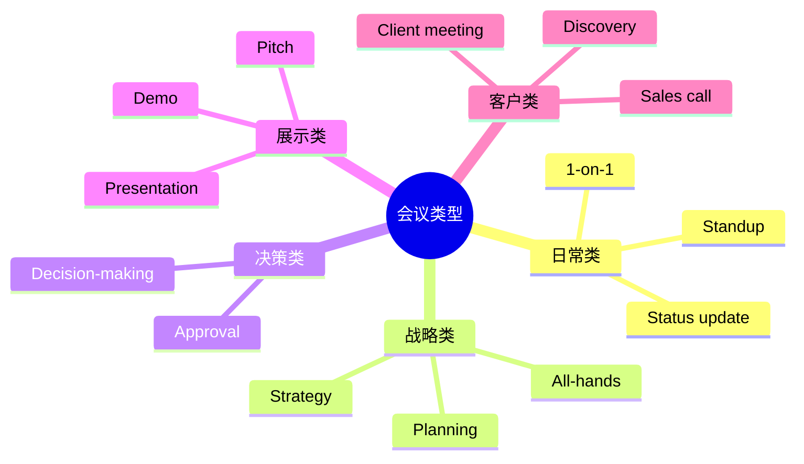

# 会议汇报与演示场景

> [!info] 本篇定位
> 上一篇讲**求职**，这一篇讲**职场最高频场景**——**会议**。
>
> 在外企 / 国际公司工作的人，**每天 30%-50% 时间在会议上**。
>
> 中国学生 / 员工的常见困境：
>
> - 会议上一句话不说（被认为没参与）
> - 想发言不知道怎么打断
> - PPT Presentation 紧张到读稿
> - Q&A 环节卡壳
> - 视频会议网络断了不知道怎么处理
>
> 本篇覆盖**会议全场景**：召集 → 主持 → 参与 → 演示 → Q&A → 跟进，**400+ 词汇** + **80+ 句型** + **15+ 真实对话**。

---

## 1. 本篇导读：会议英语全景

### 1.1 会议类型



### 1.2 会议词汇

```
meeting                     (会议)
call                        (电话/视频会议)
huddle                      (短会，立站会)
sync / sync-up              (同步)
catch-up                    (聊近况)
1-on-1 (one-on-one)         (一对一)
all-hands                   (全员大会)
townhall                    (公开论坛)
standup                     (站会)
retro / retrospective       (复盘)
kickoff                     (启动会)
brainstorm                  (头脑风暴)
workshop                    (工作坊)
QBR (Quarterly Business Review)  (季度回顾)
post-mortem                 (事后复盘)
```

### 1.3 会议元素

```
agenda                      (议程)
action items                (行动项)
minutes                     (会议纪要)
attendees                   (参会人)
host / facilitator          (主持人)
note-taker                  (记录人)
deck / slides               (PPT)
talking points              (要点)
```

---

## 2. 召集会议（Scheduling Meetings）

### 2.1 通过邮件召集

**模板**：

```
Subject: Meeting Request - [Topic] - [Date]

Hi all,

I'd like to schedule a meeting to discuss [topic].

Proposed time: [Day, Date, Time]
Duration: [X] minutes
Location/Link: [Conference room / Zoom link]

Agenda:
1. [Item 1]
2. [Item 2]
3. [Item 3]

Please let me know if this works or suggest alternatives.

Thanks,
[Name]
```

### 2.2 召集会议句型

```
"Could we set up a meeting to discuss...?"
"I'd like to schedule a call about..."
"Let's get on a call about this."
"Could we sync next week?"
"What times work for you?"
"Are you available [day] at [time]?"
"Could we get 30 minutes on your calendar?"
"I'll send out a calendar invite."
```

### 2.3 接受 / 推迟邀请

**接受**：
```
"Sounds good, see you then!"
"Confirmed, see you at [time]."
"Yes, I'll be there."
"Looking forward to it."
"Adding it to my calendar."
```

**冲突时改期**：
```
"I have a conflict at that time. Could we move to [time]?"
"I'm not available [time]. How about [alternative]?"
"Could we push it 30 minutes?"
"I'll need to reschedule. Apologies for the late notice."
```

### 2.4 议程（Agenda）写法

```
Meeting Agenda - Q3 Planning

Date: Aug 15, 2026
Time: 2:00 PM - 3:30 PM
Location: Conference Room B / Zoom

Attendees: [list]

Agenda:
1. Welcome & Intros (5 min)
2. Q2 Recap (15 min) - John
3. Q3 Goals (30 min) - Sarah
4. Resource Allocation (20 min) - Mike
5. Risks & Mitigation (10 min) - All
6. Next Steps & Action Items (10 min)
```

---

## 3. 主持会议（Hosting / Facilitating）

### 3.1 开场（Opening）

```
"Hi everyone, thanks for joining."
"Let's get started, we have a lot to cover."
"Welcome! Let me give a quick rundown of the agenda."
"Just waiting for a few more people to join... OK, let's begin."
"Let's kick this off."
```

### 3.2 介绍参会者

```
"For those who don't know, this is [Name], [role]."
"Could everyone do a quick intro?"
"Let's go around the room - name and role."
"[Name], could you start?"
```

### 3.3 推进议程

```
"Let's start with the first item on the agenda."
"Moving on to..."
"Let's spend 10 minutes on this."
"In the interest of time, let's move on."
"Could we table this for now?"     (先放一放)
"Let's circle back to this."
"Let's park that for later."
"Let's take this offline."          (会后单独聊)
```

### 3.4 引导讨论

```
"What are everyone's thoughts?"
"[Name], could we hear from you?"
"Anyone else have a view on this?"
"Let's hear from someone we haven't heard from."
"Could you elaborate on that?"
"Could you give an example?"
```

### 3.5 控制偏题

```
"That's a great point, but it's outside today's scope."
"Let's stay focused on..."
"Could we save that for another meeting?"
"To get back on track..."
"That's an important question, but let's discuss it after."
```

### 3.6 处理冲突

```
"I see we have different views. Let's hear both sides."
"Let's depersonalize this. What does the data say?"
"Both points are valid. How can we find a middle ground?"
"Let's take a 5-minute break."
```

### 3.7 总结与收尾

```
"Let me summarize what we've decided."
"Action items:
  - [Person] will [action] by [date]
  - [Person] will [action] by [date]"
"Did I miss anything?"
"Are we aligned on the next steps?"
"Great discussion, everyone. Talk soon."
"I'll send out notes by end of day."
```

### 3.8 完整主持会议

```
You：     "Hi everyone, thanks for joining. Let's get started.

          Quick agenda: First, John will recap last sprint.
          Then we'll discuss blockers. Finally, plan next sprint.

          John, the floor is yours."

John：    [presents]

You：     "Thanks John. Any questions?"

(after Q&A)

You：     "Great. Now blockers. Sarah, you mentioned an issue?"

Sarah：   [presents blocker]

You：     "Mike, you have experience with this. Any thoughts?"

Mike：    [responds]

You：     "OK, let's table the technical details for a 1:1
          discussion. Sarah, Mike - work it out and report back
          tomorrow.

          Moving on - sprint planning. Lisa?"

Lisa：    [presents]

You：     "Great work. Let me summarize action items:
          1. Mike and Sarah to resolve blocker by tomorrow
          2. Lisa to finalize sprint plan by Friday
          3. All to commit tickets in Jira by Monday

          Anything I missed? No? Great, let's go execute!"
```

---

## 4. 参与会议（Participating）

### 4.1 表达观点

```
"I think..."
"In my view..."
"From my perspective..."
"My take on this is..."
"I'd argue that..."
"Building on what [Name] said..."
"To add to that..."
```

### 4.2 同意

```
"I agree."
"Agreed."
"Good point."
"+1 to that."         (口语)
"Same thinking here."
"That's exactly what I was thinking."
"You took the words out of my mouth."
```

### 4.3 不同意（委婉）

```
"I see your point, but..."
"I have a slightly different view."
"I'm not sure I agree with..."
"Have we considered...?"
"I'd like to play devil's advocate."   (我来唱反调)
"What about...?"
"I'd push back on that."
```

### 4.4 礼貌打断

```
"Sorry to interrupt, but..."
"Quick question..."
"Could I jump in here?"
"If I may add..."
"Building on that..."
```

### 4.5 让别人继续

```
"Sorry, I cut you off. Please continue."
"You were saying?"
"Go ahead."
```

### 4.6 提出问题

```
"Could you clarify...?"
"Could you elaborate on that?"
"What do you mean by...?"
"Could you give an example?"
"How does this affect...?"
"What are the next steps?"
"Who's responsible for this?"
"What's the timeline?"
```

### 4.7 表达不确定 / 需要时间

```
"I'd need to think about that."
"Let me get back to you on that."
"Could I take some time to research?"
"I'm not sure off the top of my head."
"I'll need to check with the team."
```

### 4.8 状态汇报（Status Update）

**Standup 模板**：

```
"Yesterday, I [accomplishment].
 Today, I'm working on [task].
 Blockers: [issue, or 'none']."
```

**示例**：

```
"Yesterday, I finished the API integration with the payment
service.

Today, I'm starting on the database optimization project.

Blockers: I need approval from security team for the database
schema change. Could anyone help expedite?"
```

### 4.9 完整会议参与

```
Manager：  "What does everyone think about Plan A?"

You：      "I like the direction. I have a few concerns about
          the timeline though."

Manager：  "Tell me more."

You：      "If we launch in Q3, we'll be missing key features
          for our enterprise customers. Could we extend to Q4
          and add those features?"

Tom：      "I disagree. Speed to market matters more than
          features."

You：      "Tom, I see your point. But our enterprise customers
          are 60% of revenue. What if we did a phased launch?
          Q3 for SMB, Q4 for enterprise?"

Tom：      "Hmm, that could work."

Manager：  "Good discussion. Let's go with the phased approach."
```

---

## 5. PPT 演示（Presentation）

### 5.1 演示前准备

```
"Let me share my screen."
"Can everyone see my slides?"
"Is my screen showing?"
"Good. Let me start."
```

### 5.2 演示开场

```
"Good morning everyone. Today, I'll be presenting on [topic].

I'll cover three main areas:
1. [Topic A]
2. [Topic B]
3. [Topic C]

By the end, you should have a clear understanding of [outcome].

Let's dive in."
```

### 5.3 过渡（Transitions）

**Section transitions**：
```
"That covers [previous topic]. Let's move on to..."
"Building on this..."
"Now I'd like to discuss..."
"Next, let's look at..."
"This brings us to..."
"With that context, let's now turn to..."
```

**Slide transitions**：
```
"On this next slide..."
"As you can see here..."
"Looking at this chart..."
"This graph shows..."
"The key takeaway here is..."
```

### 5.4 强调要点

```
"The most important thing to remember is..."
"What's critical here is..."
"I want to emphasize..."
"This is a key point..."
"In particular..."
"Most notably..."
"What's striking is..."
```

### 5.5 引用数据

```
"As you can see, we grew 30% YoY."
"The data shows..."
"Our metrics indicate..."
"Based on the research..."
"A recent study found..."
"According to [source]..."
```

### 5.6 应对技术问题

```
"Sorry, my screen froze. Give me a moment."
"I'm having technical difficulties. Bear with me."
"Could someone tell me if my audio is OK?"
"Let me restart the share."
"While we wait, are there any questions?"
```

### 5.7 应对忘词

```
"Let me come back to that."
"Where was I?"
"Sorry, I lost my train of thought."
"Let me check my notes."
"Could you remind me where we were?"
```

### 5.8 演示结尾

```
"To wrap up..."
"To summarize my main points..."
"In conclusion..."
"Three key takeaways:
  1. ...
  2. ...
  3. ..."

"Thank you for your attention."
"I'm happy to take any questions."
"That concludes my presentation. Questions?"
```

### 5.9 完整演示开场

```
Hi everyone, I'm Sarah, Product Manager for our AI initiative.

Today, I'll be sharing our Q3 product roadmap.

I'll cover three areas:
1. What we shipped in Q2
2. Our Q3 priorities
3. Resource needs

By the end, I hope you'll see why we're excited about Q3 and
how we can collaborate.

This presentation should take about 20 minutes, with time for
Q&A at the end.

Let's get started.
```

---

## 6. Q&A 环节（Question and Answer）

### 6.1 邀请提问

```
"Any questions?"
"I'm happy to take questions now."
"What questions do you have?"
"Let me know if anything wasn't clear."
"I'd love to hear your thoughts."
```

### 6.2 听清问题

```
"Could you repeat the question?"
"Sorry, could you clarify?"
"Just to make sure I understand..."
"You're asking about [paraphrase], right?"
```

### 6.3 给自己时间

```
"That's a great question."
"Let me think about that for a second."
"That's something we've been discussing internally."
"Good question. The answer is..."
```

### 6.4 直接回答

```
"The answer is..."
"Yes, exactly..."
"That's correct."
"To answer your question..."
"In short, yes/no..."
```

### 6.5 不知道时

> [!warning] 不知道答案，**不要编**

```
✅ "Honest answer? I don't know. Let me find out and get back
   to you."

✅ "I don't have that information off the top of my head. Could
   I follow up over email?"

✅ "Great question - I haven't thought about that. Initial
   thoughts are [thinking out loud], but I'd need to validate."

❌ Making something up
❌ Long rambling
❌ Avoiding the question
```

### 6.6 复杂问题处理

```
"That's a complex question. Let me break it down..."
"That has multiple parts. Let me address each."
"That's a deep question - we could spend an hour on it. Let me
give you the high-level answer."
```

### 6.7 不愿回答

```
"That's outside my scope today."
"I'd prefer to discuss that with [team] before answering."
"Could we take that offline?"
"Let me follow up after the meeting."
```

### 6.8 不友好的问题

```
攻击型问题：
"Why didn't you do X earlier?"

应对：
"That's a fair question. The reason was [factual answer].
Looking back, [acknowledgment]. Going forward, we're [action]."

不要：防御 / 反击 / 解释过多
要：保持冷静 / 承认 / 展示行动
```

### 6.9 时间到了

```
"We're running short on time. Let me take one more question."
"Anyone has a quick question before we wrap up?"
"Time's up - let's continue this offline."
"I'll send out notes with answers to remaining questions."
```

### 6.10 完整 Q&A

```
You：       "Any questions?"

Audience1： "What's the budget for this initiative?"

You：       "Great question. The current budget is $500K, but
            we're requesting an additional $200K for Q4."

Audience2： "How does this compare to competitor X's approach?"

You：       "We've done some research. Their approach is more
            [aspect], while we're focused on [different aspect].
            We believe ours has stronger long-term potential."

Audience3： "What if it doesn't work?"

You：       "Honest answer - we have a 6-month checkpoint. If
            metrics don't hit targets, we'll pivot or sunset.
            We've built clear exit criteria."

You：       "One more question?"

Audience4： "Could you share the data you mentioned earlier?"

You：       "Yes, I'll send the deck and supporting data after.
            Thanks everyone!"
```

---

## 7. 视频会议（Video Conferences）

### 7.1 视频会议词汇

```
Zoom / Teams / Google Meet / Webex
camera / mic
mute / unmute
share screen
chat box
breakout room
participants
host / co-host
recording
transcript
```

### 7.2 进入会议

```
"Hi everyone, can you hear me?"
"Loud and clear?"
"Sorry I'm late, technical issues."
"My camera isn't working today."
"Sorry for the background noise."
```

### 7.3 常见技术问题

**麦克风**：
```
"You're on mute."
"I think you're muted."
"Could you unmute yourself?"
"Sorry, I was on mute."
"My mic isn't working."
```

**信号问题**：
```
"You're cutting out."
"You're breaking up."
"I lost you for a moment."
"Could you repeat that?"
"My internet is unstable."
"Let me reconnect."
```

**屏幕共享**：
```
"Could you share your screen?"
"I can't see your screen."
"Could you go full screen?"
"You're sharing the wrong screen."
"Could you share the right window?"
"I see your screen now."
```

### 7.4 视频会议礼仪

```
✅ 提前 1-2 分钟进入
✅ 测试摄像头/麦克风
✅ 不发言时静音
✅ 看着摄像头说话
✅ 良好光线
✅ 整洁背景
✅ 着装得体（至少上半身）

❌ 一边吃饭
❌ 走来走去
❌ 同事突然进入镜头
❌ 暗光线
❌ 床上躺着
```

### 7.5 视频会议控制

```
"Let's go around and have everyone introduce themselves."
"I'm going to share my screen now."
"Could everyone mute themselves?"
"Use the chat to ask questions."
"I'll create breakout rooms for discussion."
"We have 5 minutes left."
"Let's wrap up."
```

### 7.6 完整视频会议

```
Host：     "Hi everyone, can you all hear me?"
Multiple： "Yes."
Host：     "Great. Let's wait one more minute for late joiners.

           OK, let's get started. Welcome to our weekly sync.

           Quick agenda: status update, blockers, then planning.

           John, can you start with status?"

John：     "(unmute) Sure. (status update)"

Host：     "Thanks. Sarah, you're on mute."

Sarah：    "(unmute) Sorry! I was saying..."

Host：     "Time check - we have 10 minutes. Let's move to
           planning. Mike, want to share your screen?"

Mike：     "Sharing now. Can you see it?"

Host：     "Yes. Go ahead."

(after Mike's update)

Host：     "Great. Let me drop the doc in chat. Action items:
           1. John finalizes design by Wednesday
           2. Sarah connects with Mike on infra
           3. Mike's update by next sync

           Thanks everyone!"
```

---

## 8. 客户会议（Client Meetings）

### 8.1 客户会议类型

```
discovery call               (探索性通话)
demo                         (产品演示)
sales call                   (销售通话)
QBR (Quarterly Business Review)  (季度回顾)
renewal discussion           (续约讨论)
escalation                   (升级处理)
kickoff                      (项目启动)
```

### 8.2 客户开场

```
"Thank you for taking the time today."
"It's a pleasure to meet you."
"How are you doing today?"
"Did you get a chance to look at the materials I sent?"
"Let me start by making sure we're aligned on goals."
```

### 8.3 了解客户需求（Discovery）

```
"Tell me about your current situation."
"What challenges are you facing?"
"What's working? What's not?"
"What are your priorities for the year?"
"What success would look like for you?"
"What's blocking you today?"
```

### 8.4 演示产品

```
"Let me show you how our product can help."
"This feature was built specifically for your use case."
"Let me walk you through the workflow."
"You can see here how..."
"Customers like you typically use this for..."
```

### 8.5 处理异议

```
Client： "Your price is too high."

You：    "I understand price is a concern. Could we discuss the
          ROI? Customers typically see [specific value] within
          [timeframe], which more than covers the investment."

Client： "We're already using a competitor."

You：    "Got it. What's working with your current solution?
          What gaps do you see?"

Client： "I need to think about it."

You：    "Of course. What would help you make the decision?
          Could we set up a follow-up to address remaining
          concerns?"
```

### 8.6 客户会议结尾

```
"Thanks for the great conversation."
"Let me summarize what we discussed and next steps."
"I'll send a recap email by end of day."
"Could we schedule a follow-up?"
"What's the best way to keep this momentum?"
```

---

## 9. 一对一会议（1-on-1）

### 9.1 与经理 1:1

**议程模板**：
```
1. Status update (5-10 min)
2. Blockers (5 min)
3. Career / development (5-10 min)
4. Manager's items (10 min)
5. Open discussion / questions
```

**典型问题**：

```
"What's working well?"
"What's not?"
"What can I help with?"
"How can I support you better?"
"What's been on your mind?"
"How are you doing - really?"
```

### 9.2 与下属 1:1

```
"How's the week going?"
"What's on your plate?"
"Anything blocking you?"
"How can I help?"
"How are you feeling about the project?"
"What do you want to focus on growing?"
```

### 9.3 给反馈

**正面反馈**：
```
"I want to recognize the great work on [project]."
"You handled [situation] really well because [specific]."
"I appreciate how you [behavior]."
```

**建设性反馈**：
```
"I have some feedback. Is this a good time?"
"In [situation], you [observation]. The impact was [result].
Going forward, I'd suggest [alternative]."

"I noticed [behavior]. Can you walk me through your thinking?"
```

**接受反馈**：
```
"Thank you for the feedback."
"Could you give me a specific example?"
"I appreciate you sharing this."
"How would you suggest I approach it differently?"
"Let me reflect on this."
```

### 9.4 完整 1:1

```
Manager： "How's the week?"
You：     "Pretty good. Wrapped up the migration on time."
Manager： "Any blockers?"
You：     "Not technical, but I'd love guidance on prioritizing
          next quarter."
Manager： "Sure. What are you considering?"
You：     "Three things: A, B, or C. Each has trade-offs."
Manager： "Let's think through it. A is high-impact but high
          risk. B is incremental. C is unknown."
You：     "I'm leaning toward A."
Manager： "I support that. Let's make sure to set milestones."
You：     "Will do. One more thing - I'd like to discuss my
          career growth."
Manager： "Tell me what you're thinking."
You：     "I want to move toward staff engineer level. What
          would help me get there?"
Manager： "Three things: more cross-team impact, mentoring,
          and technical writing. Let's create a development
          plan."
```

---

## 10. 会后跟进（Follow-up）

### 10.1 会议纪要（Meeting Notes / Minutes）

```
Subject: Notes from [Meeting Name] - [Date]

Hi all,

Thanks for the productive discussion today. Here's a recap:

Key Decisions:
- [Decision 1]
- [Decision 2]

Action Items:
| Owner | Action | Deadline |
|-------|--------|----------|
| John | Finalize design | June 1 |
| Sarah | Send vendor list | May 28 |
| Mike | Get budget approval | June 5 |

Next Steps:
- [Next step 1]
- [Next step 2]

Next meeting: [Date / Time]

Let me know if I missed anything.

Thanks,
[Name]
```

### 10.2 跟进未参会者

```
Subject: Recap from [Meeting] - You couldn't attend

Hi [Name],

You couldn't make today's meeting. Here's a quick recap:

[Key points]

Action items relevant to you:
- [Item]

Let me know if you have questions.

Thanks,
[Name]
```

### 10.3 推动行动项

```
"Just checking in on [action item]."
"How's [task] progressing?"
"Any blockers I can help unblock?"
"Could we get an update by [date]?"
```

---

## 11. 完整对话场景汇总

### 11.1 场景：Sprint Planning 主持

```
You：     "Welcome everyone to sprint planning. Let's get
          started.

          Quick agenda: Last sprint review (10 min), this
          sprint capacity (5 min), then we plan tickets.

          Let me share my screen.

          For last sprint - we completed 28 of 32 story points.
          The 4 unfinished move to this sprint.

          Now capacity. We have 5 engineers, 10 working days.
          Estimated capacity: 50 points.

          Let's go through the backlog. Top priority is the
          payment integration. Sarah, want to walk us through?"

(Sarah explains)

You：     "Estimates? John?"

John：    "8 points."

Mike：    "I'd say 13 - we're integrating with a new API."

You：     "Let's go with 13 for safety. Next ticket..."

(after planning)

You：     "Final commitments: 48 points. We're slightly under
          capacity, which is fine. Anyone need to leave early?
          No? Great. Let's review action items in JIRA."
```

### 11.2 场景：和上级汇报项目

```
You：     "Thanks for taking the time. I want to update you on
          the migration project."

Boss：    "Sure, what's the status?"

You：     "On track for the June 1 deadline. We've completed 80%
          of the work."

Boss：    "What's the remaining 20%?"

You：     "Mainly QA testing and the production rollout plan."

Boss：    "Any risks?"

You：     "Two: First, our QA timeline is tight. Second, we
          need cross-team coordination for the rollout."

Boss：    "How are you mitigating?"

You：     "For QA, I've added a dedicated tester. For
          coordination, I've scheduled a kickoff with the
          dependent teams next week."

Boss：    "Sounds good. What can I help with?"

You：     "Two things: First, prioritization conflict with
          another initiative - could you help align? Second,
          recognition - the team has been amazing."

Boss：    "I'll handle prioritization today. And I'll send a
          team-wide email recognizing the team."

You：     "Thank you!"
```

### 11.3 场景：被客户追问

```
Client：   "Why didn't you launch on time?"

You：      "Fair question. The original timeline was ambitious.
           We hit 3 unforeseen technical challenges."

Client：   "Why weren't we informed sooner?"

You：      "We should have communicated earlier. I take
           responsibility for that. Going forward, we're doing
           weekly status updates."

Client：   "What's the new timeline?"

You：      "We're targeting 6 weeks from today. We've built in
           buffer to ensure we hit it."

Client：   "How do I know we won't miss again?"

You：      "Three things: weekly reviews, milestone-based
           checkpoints, and an executive escalation path if
           we see risk. Would that give you confidence?"

Client：   "OK. Let's set up the first weekly review."
```

---

## 12. 文化差异提醒

### 12.1 中外会议文化

```
中国会议：
- 等级明显，年轻人少发言
- 决策由高层做
- 长会议
- 读 PPT

国际会议：
- 鼓励所有人发言
- 决策需共识
- 时间严格
- 互动 + 讨论
```

### 12.2 美国会议特点

```
1. Time-conscious: 准时开始，准时结束
2. Outcome-driven: 一定要有 action items
3. Participatory: 不参与 = 不重视
4. Direct: 有不同意见直接说
5. Egalitarian: 实习生和 VP 同样可以发言
```

### 12.3 欧洲会议特点

```
法国 / 德国：
- 较正式
- 充分讨论
- 重视计划

北欧：
- 极平等
- 不需举手发言
- 共识文化
```

### 12.4 亚洲会议特点

```
日本：
- 极正式
- "Nemawashi" - 会前私下沟通
- 会议是确认，不是讨论

韩国：
- 等级明显
- 上级先发言
- 长会议
```

---

## 13. 常见错误大盘点

### 13.1 错误 1：会议上沉默

```
即使没准备充分：
✅ "I'd like to learn more before commenting."
✅ "I haven't formed an opinion yet."
✅ Ask questions

不要：完全沉默 = 不参与
```

### 13.2 错误 2：超时

```
Standup 应该 15 分钟。
1:1 30 分钟。
持续超时 = 让大家不耐烦。

主持要严格控时。
参会者发言要简洁。
```

### 13.3 错误 3：没议程

```
没议程 = 浪费时间。
任何会议都有议程，最少 3 项。
```

### 13.4 错误 4：会议没有纪要

```
会议结束 24 小时内必须发纪要：
- 谁参加了
- 决定了什么
- 谁负责什么
- 何时完成
```

### 13.5 错误 5：演示读 PPT

```
观众能自己读。
你应该：
✅ 解释 + 添加价值
✅ 看观众，不是屏幕
✅ 用口语，不是书面
```

### 13.6 错误 6：Q&A 编答案

```
不知道说不知道。
后续跟进。
编答案被识破 = 信誉破产。
```

### 13.7 错误 7：视频会议不开摄像头

```
默认开摄像头。
不开 = 显得不投入。
特殊情况告知："Sorry, I'll keep camera off today, [reason]."
```

### 13.8 错误 8：打断粗鲁

```
✅ "Sorry to interrupt..."
✅ "Could I jump in?"
✅ Wait for natural pause

❌ Cutting people off mid-sentence
❌ Talking over others
```

---

## 14. 练习与输出建议

> [!success] 本篇练习清单
>
> **基础练习**
>
> 1. 准备**主持会议 5 个开场白** + **5 个推进句型**
>
> 2. 准备**5 种参与会议的发言句型**（同意/不同意/打断/提问/不确定）
>
> 3. 准备**Standup 模板**（昨天/今天/blocker）
>
> **演示练习**
>
> 4. 准备一个**5 分钟英文 Presentation**：
>    - Open
>    - 3 main points
>    - Conclusion
>    - Q&A
>
> 5. **录视频**自己演示，回看找改进点
>
> **场景模拟**
>
> 6. 模拟 5 个对话：
>    - 主持 standup
>    - 项目汇报给老板
>    - 客户演示
>    - 1:1 with manager
>    - 视频会议技术问题
>
> **AI 角色扮演**
>
> 7. 让 AI 扮演**老板/客户**，进行 30 分钟汇报模拟。
>
> **写作练习**
>
> 8. 写**3 份会议纪要**（不同类型会议）
>
> 9. 写**会议邀请邮件**（含完整议程）
>
> **长期任务**
>
> 10. 加入 **Toastmasters**（演讲俱乐部），练习公开发言。
>
> 11. 看 **TED Talks**，学结构和过渡。

---

## 15. 本篇小结

> [!success] 本篇核心要点回顾
>
> **会议类型**：standup / 1:1 / all-hands / strategy / kickoff
>
> **主持会议**：
> - 开场 + 议程
> - 推进 + 引导
> - 总结 + 行动项
>
> **参与会议**：
> - 表达观点 + 同意/不同意 + 礼貌打断
> - Status update: 昨天/今天/blocker
>
> **PPT 演示**：
> - 开场 + 过渡 + 强调 + 数据 + 结尾
> - 处理技术问题 + 忘词
>
> **Q&A**：
> - 邀请 + 听清 + 给时间 + 回答
> - 不知道 = 诚实承认
>
> **视频会议**：
> - 麦克风 / 信号 / 屏幕共享
> - 礼仪 + 控制
>
> **客户会议**：
> - Discovery → Demo → Objection handling → Close
>
> **1:1**：
> - Status / Blocker / Career / Open
> - 给反馈 + 接受反馈
>
> **跟进**：
> - 24 小时内会议纪要
> - 行动项追踪
>
> **常见错误**：
> - 沉默
> - 超时
> - 没议程
> - 没纪要
> - 读 PPT
> - 编答案

### 15.1 下一篇预告

> [!info] 下一篇：03.商务邮件与正式书面沟通
>
> 下一篇讲**职场最重要的书面沟通**：
>
> - **商务邮件结构**：subject / 称呼 / 正文 / 结尾
> - **常见邮件类型**：询问 / 跟进 / 拒绝 / 投诉
> - **邮件礼仪**：CC / BCC / Reply All
> - **正式 vs 非正式**程度
> - **跨文化邮件**：中美邮件差异
> - **邮件模板大全**
>
> 这一篇让你**写出职业级商务邮件**。
