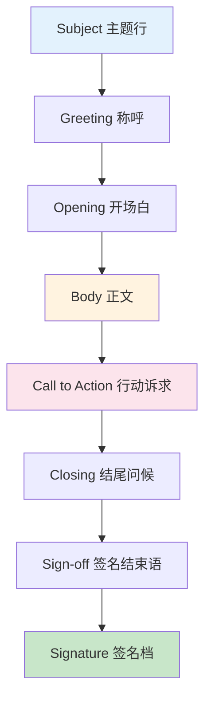
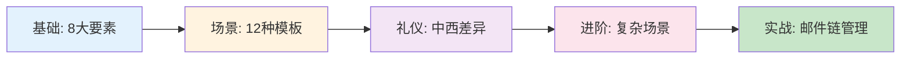
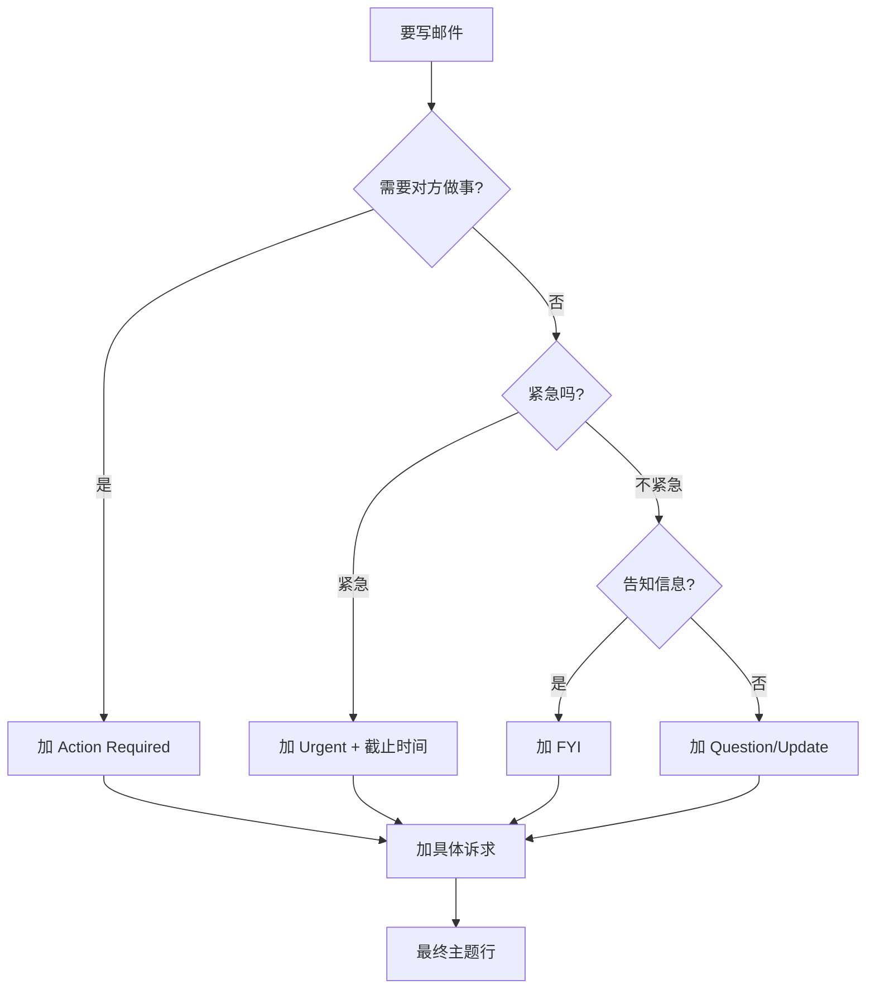
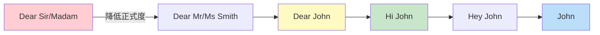
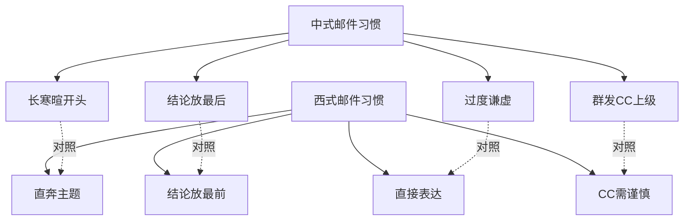
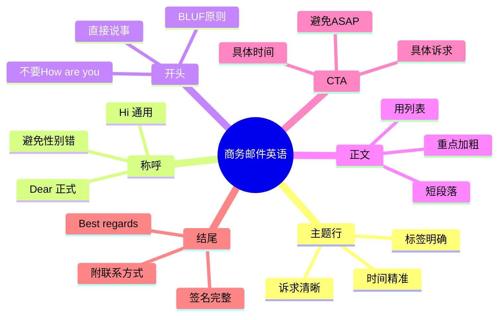
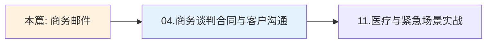

# 商务邮件与正式书面沟通

> [!info] 本篇定位
>
> 欢迎进入 **10.职场与商务场景实战** 的第 3 篇！
>
> 上一篇 [02.会议汇报与演示场景] 教你**说**英语；本篇教你**写**英语。
>
> 在远程办公时代，**80% 的商务沟通是通过邮件完成的**。一封写得好的邮件能：
>
> - 让对方快速理解你的诉求
> - 体现你的专业度和职业素养
> - 在跨国协作中建立信任
> - 留下书面记录避免扯皮
>
> 中国职场人写英文邮件的常见痛点：
>
> - 主题行写得像「你好」「关于」（点开率为零）
> - 开头永远是 `How are you? I am Tom from China.`
> - 中间一段大长句，老外读完不知道你想干嘛
> - 结尾总是 `Please reply me ASAP.`（语法错且态度差）
> - 签名只有名字（缺联系方式、职位）
>
> 本篇 **12000+ 字**，给你**全场景、全模板、可复制粘贴**的邮件英语武器库。
>
> **目标**：写完一封邮件，老外的反应是 `Quick reply, clear ask, professional!`

---

## 1. 本篇导读：商务邮件英语全景

### 1.1 邮件 vs 即时消息

> [!warning] 不是所有沟通都该用邮件
>
> 写邮件前先问自己：**这个内容用 Slack/微信秒回，会不会更高效？**

| 场景 | 用邮件 | 用即时消息 |
|------|-------|-----------|
| 需要书面记录的决策 | ✅ | ❌ |
| 跨部门正式通知 | ✅ | ❌ |
| 包含附件/合同/报告 | ✅ | ❌ |
| 涉及多人 CC | ✅ | ❌ |
| 简单问答（5 分钟内能完成） | ❌ | ✅ |
| 紧急需要回复 | ❌ | ✅（电话更好） |
| 闲聊/八卦 | ❌ | ✅ |

### 1.2 一封商务邮件的完整解剖



上图展示了一封标准商务邮件的 **8 大组成部分**。**蓝色（A）是入口** —— 主题行决定邮件会不会被打开；**橙色和粉色（D、E）是核心** —— 正文和行动诉求决定对方会不会回；**绿色（H）是落款** —— 完整的签名档体现职业素养。本篇将逐一拆解每个部分的写法。

### 1.3 学习路线图



学习路径分 5 步推进。**先打地基**（8 大要素），**再练套路**（12 种高频模板），**然后注意文化差异**（中西邮件礼仪不同），**最后处理复杂场景**（多方协作、邮件链管理）。每一步都配套实例 + 可复制模板。

---

## 2. 主题行（Subject Line）写法

> [!danger] 主题行决定生死
>
> 老外每天收 50-200 封邮件，**70% 的邮件根据主题行决定打不打开**。
>
> 主题行写不好 = 邮件被秒删。

### 2.1 主题行黄金公式

```text
[标签] 动作 + 对象 + 时间/上下文
```

#### 2.1.1 公式各部分解读

| 元素 | 作用 | 示例 |
|------|------|------|
| `[标签]` | 让收件人一眼分类 | `[Action Required]`、`[FYI]`、`[Urgent]` |
| 动作 | 你要对方做什么 | `Approval needed`、`Review`、`Confirm` |
| 对象 | 具体的事/物 | `Q2 Budget`、`Sales Report` |
| 时间/上下文 | 紧急度和上下文 | `by Friday`、`for May launch` |

### 2.2 高频主题行标签

```text
[Action Required]      需要你做事
[FYI]                  仅供参考，不需回复
[Urgent]               紧急（请慎用！）
[EOD]                  今天下班前需要
[Reminder]             提醒
[Update]               进度更新
[Question]             有问题请教
[Approval Needed]      需要审批
[Decision Needed]      需要决策
[Follow-up]            跟进
[No Reply Needed]      不用回复
[Confidential]         机密
```

### 2.3 主题行优秀 vs 糟糕对比

| 糟糕 ❌ | 优秀 ✅ | 为什么更好 |
|---------|---------|-----------|
| `Hi` | `[Question] Q2 budget assumptions` | 一目了然 |
| `Meeting` | `[Action Required] Confirm Tuesday 2PM call` | 明确诉求 |
| `Important!!!` | `[Urgent] Server downtime—need decision by 3PM` | 给出紧急原因 |
| `Update` | `[Update] Project Phoenix - Week 3 status` | 具体到项目和周次 |
| `Please reply` | `[EOD Today] Approval needed for vendor contract` | 时间和事项清晰 |
| `Question about the report` | `Question: Where can I find Q1 revenue breakdown?` | 直接问题 |
| `Re: Re: Re: Re: Re: meeting` | `[New thread] Meeting reschedule for May 5` | 重启清晰主题 |

### 2.4 主题行写法决策树



按这张决策树写主题行，**不会写错**。先判断诉求类型 → 加合适的标签 → 补具体内容 → 完工。整个过程不超过 30 秒，但能让你的邮件**打开率提升一倍以上**。

---

## 3. 称呼语（Greeting）

> [!info] 称呼是邮件的第一印象
>
> 称呼用错 = 显得没礼貌或不专业。中国学生最常错的就是**和高管说 `Hey`**，或**给同事写 `Dear Mr. Smith,`**（过于正式）。

### 3.1 称呼正式程度光谱



从最正式（红色）到最随意（蓝色），**6 种称呼层级**。**90% 的日常商务邮件使用 `Hi John,`**（绿色）—— 友好而专业。下面详细讲什么场景用哪种。

### 3.2 各种称呼的使用场景

| 称呼 | 正式度 | 适用场景 | 注意事项 |
|------|-------|---------|---------|
| `Dear Sir/Madam,` | ⭐⭐⭐⭐⭐ | 完全不知道收件人是谁 | 现在很少用，显得过时 |
| `To whom it may concern,` | ⭐⭐⭐⭐⭐ | 投诉信、推荐信、求职信 | 非常正式 |
| `Dear Mr. Smith,` / `Dear Ms. Wong,` | ⭐⭐⭐⭐ | 第一次联系高级别人士 | 用姓不用名 |
| `Dear Dr. Lee,` | ⭐⭐⭐⭐ | 学术界、医生 | 有头衔时优先用头衔 |
| `Dear John,` | ⭐⭐⭐ | 第一次联系，但希望友好 | 用名字（已知名字时） |
| `Hello John,` | ⭐⭐⭐ | 中性正式 | 比 Hi 略正式 |
| `Hi John,` | ⭐⭐ | **日常商务邮件首选** | 90% 场景用这个 |
| `Hi team,` | ⭐⭐ | 群发 | 团队群发常用 |
| `Hey John,` | ⭐ | 熟悉的同事 | 仅限熟人 |
| `John,` | ⭐ | 熟悉的同事或快速回复 | 直接称名 |

### 3.3 性别不明 / 不知名字时

> [!warning] 性别推测雷区
>
> 不要根据名字猜性别！比如：
>
> - `Robin` 男女都有
> - `Pat` 男女都有
> - `Alex` 可能是 Alexander 也可能是 Alexandra
>
> **不确定就用全名**，避免 Mr/Ms 搞错的尴尬。

```text
✅ Dear Robin Chen,                (用全名最保险)
✅ Dear Hiring Manager,            (针对岗位)
✅ Hi there,                       (略随意但安全)
❌ Dear Mr. Robin,                 (Robin 可能是女性)
❌ Dear Sir,                       (默认男性，性别歧视嫌疑)
```

### 3.4 称呼后的标点

```text
正式邮件:    Dear Mr. Smith,        (用逗号 ✓)
正式邮件:    Dear Mr. Smith:        (英美正式信件用冒号 ✓)
日常邮件:    Hi John,               (用逗号 ✓)
日常邮件:    Hi John -              (破折号也可以 ✓)
英式拼写:    Dear Mr Smith,         (Mr 后不加点)
美式拼写:    Dear Mr. Smith,        (Mr. 后加点)
```

### 3.5 群发与多人称呼

```text
两人:       Hi John and Sarah,
三人以下:    Hi John, Sarah, and Mike,
团队:        Hi team,
全员:        Hi all, / Hello everyone,
跨部门:      Hi all,
正式群发:    Dear all, / Dear colleagues,
```

---

## 4. 开头句型（Opening Line）

> [!tip] 开头第一句决定阅读体验
>
> 中国学生开头雷点 Top 1：**`How are you?`** —— 老外一看就知道是亚洲人写的，且会觉得是寒暄而非正事。

### 4.1 开头句型四大类型

#### 4.1.1 直接切入主题（推荐）

```text
"I'm writing to [verb]..."
"I'm reaching out about..."
"I wanted to follow up on..."
"This email is regarding..."
"I'd like to discuss..."
```

#### 4.1.2 回复式开头

```text
"Thanks for your email."
"Thank you for reaching out."
"Thanks for the quick reply."
"Following up on our conversation..."
"As discussed in our meeting today..."
"Per our earlier discussion..."
```

#### 4.1.3 致谢/感谢式开头

```text
"Thanks for your help with..."
"I really appreciate you taking the time to..."
"Thanks for the heads-up on..."
"I want to thank you for..."
```

#### 4.1.4 寒暄式开头（仅熟人）

```text
"Hope you're doing well."
"Hope you had a great weekend."
"Hope this email finds you well."
"Hope you're staying warm/cool!"  (季节性)
```

> [!warning] 寒暄要看关系
>
> `Hope you're doing well` 这种寒暄**仅适合**：
>
> - 熟悉的同事
> - 已经合作过的客户
> - 第二次以上的邮件往来
>
> **第一次联系陌生人不要寒暄**，直接说事更专业。

### 4.2 开头雷区清单

| 中式雷区 ❌ | 地道写法 ✅ |
|------------|-----------|
| `How are you?` | `Hope you're doing well.` |
| `I am Tom from China.` | `I'm Tom, [职位] at [公司].` |
| `My name is Tom.` | `I'm Tom from [部门].` |
| `Long time no see.` | `Hope you've been well.` |
| `Sorry to bother you.` | `Quick question for you...` |
| `Please allow me to introduce...` | `I'm reaching out because...` |

### 4.3 优秀开头实例

#### 4.3.1 求联系开头

```text
✅ "I'm Sarah, the new product manager on the Enterprise team. 
   I'd love to connect and learn about your work on customer 
   onboarding."

[拆解：身份 + 诉求 + 共同话题]
```

#### 4.3.2 跟进开头

```text
✅ "Following up on the proposal I sent last Wednesday—just 
   wanted to check if you've had a chance to review it."

[拆解：时间锚点 + 具体内容 + 软性追问]
```

#### 4.3.3 回复开头

```text
✅ "Thanks for the detailed feedback. I've addressed your 
   points below."

[拆解：致谢 + 预告下文]
```

---

## 5. 邮件正文（Body）写作

> [!success] 正文写作三原则
>
> **BLUF**（Bottom Line Up Front）= **结论先行**
>
> **One thought per paragraph** = **一段一个主题**
>
> **Skimmable** = **可扫读**

### 5.1 BLUF 原则（结论先行）

#### 5.1.1 反例：埋藏式写法（中文式）

```text
❌ 糟糕的邮件：

Hi John,

Hope you're well. As you know, we've been working on the 
Q2 marketing plan for several weeks now. We've gathered 
feedback from multiple stakeholders, including the sales 
team and the customer success team. After analyzing the 
data and discussing internally, we believe there are 
several factors to consider. Therefore, after careful 
deliberation, we have decided to delay the launch by 
two weeks.

[读到最后才看到结论，老外要崩溃]
```

#### 5.1.2 正例：BLUF 写法

```text
✅ 优秀的邮件：

Hi John,

We're delaying the Q2 marketing launch by two weeks—new 
date is May 20.

Reasons:
1. Sales team needs more time for collateral
2. Customer success flagged 3 critical issues
3. Data analysis revealed lower demand than expected

Action needed: Please confirm if this works for your team.

Thanks,
Sarah

[第一句就是结论，对方一秒钟知道全貌]
```

> [!tip] BLUF 公式
>
> **第一句话回答**：「我要你做什么？」或「发生了什么？」
>
> 后面的段落才是「为什么」「细节」「背景」。

### 5.2 正文结构模板

```text
[第 1 段：核心信息 / 行动诉求]
一两句话说清最重要的事

[第 2 段：背景 / 上下文]
为什么这件事重要？相关背景是什么？

[第 3 段：细节 / 数据]
具体要点（建议用列表）

[第 4 段：行动项]
具体要对方做什么、何时做

[第 5 段：致谢 / 收尾]
感谢配合，提供联系方式
```

### 5.3 善用列表与编号

> [!warning] 长段落是邮件杀手
>
> 老外**99% 的邮件是手机看的**，5 行以上的段落基本会被跳过。

#### 5.3.1 项目符号（Bullet Points）

```text
✅ 推荐写法：

The new policy includes:

• Remote work allowed up to 3 days per week
• Core hours: 10 AM - 3 PM
• Quarterly in-person team offsites
• Flexible PTO policy
```

#### 5.3.2 编号列表（Numbered List）

```text
✅ 推荐写法：

To set up your account:

1. Click the activation link in your welcome email
2. Create a password (8+ characters)
3. Verify your phone number
4. Complete your profile
```

### 5.4 强调重点的方法

| 方法 | 示例 | 适用场景 |
|------|------|---------|
| **加粗** | `Please **confirm by Friday**.` | 关键诉求 |
| 大写 | `URGENT - server down` | 仅限主题行/紧急 |
| 高亮 | 用邮件编辑器的高亮 | 正文重点 |
| 引用 | `> Quote from previous email` | 引用之前内容 |

> [!danger] 不要全大写
>
> 全大写在英文中 = 大喊大叫。`PLEASE REPLY` 给人感觉是在咆哮。

---

## 6. 行动诉求（Call to Action / Ask）

> [!info] 没有 CTA 的邮件就是废话
>
> 写邮件前先想清楚：**「我想让对方做什么？」**

### 6.1 明确诉求的句型

#### 6.1.1 请求审批

```text
"Could you please approve [item] by [date]?"
"I'd appreciate your sign-off on..."
"Please review and let me know if you have concerns."
"Awaiting your green light to proceed."
```

#### 6.1.2 请求回复

```text
"Could you let me know by [date]?"
"Please share your thoughts when you have a moment."
"I'd love your input on this."
"Looking forward to your response."
```

#### 6.1.3 请求行动

```text
"Could you please [verb] [object] by [date]?"
"I'd appreciate it if you could [verb]."
"Would you mind [verb-ing] when you have a chance?"
"Could you take a quick look at..."
```

#### 6.1.4 请求会议

```text
"Could we set up a 30-minute call this week?"
"Are you free for a quick chat on Tuesday?"
"I'd love to discuss this in person—when works?"
```

### 6.2 时间表达的精准度

> [!warning] 别说 ASAP
>
> `ASAP`（as soon as possible）听起来紧迫但**没有约束力**。对方理解的「ASAP」可能是「今晚」也可能是「下周」。

| 模糊 ❌ | 精准 ✅ |
|--------|--------|
| `ASAP` | `by Friday 5 PM PST` |
| `soon` | `by end of this week` |
| `when you have time` | `before our Monday meeting` |
| `Please reply quickly` | `Please reply by tomorrow EOD` |

### 6.3 不同紧急度的措辞

```text
紧急（24 小时内）:
"Could you please confirm by EOD today?"
"This is time-sensitive—need your input by [time]."

正常（本周内）:
"Please review by Friday."
"Could you get back to me this week?"

不急（无截止）:
"No rush—whenever you have a chance."
"At your convenience..."
```

---

## 7. 结尾句型与签名

### 7.1 结尾问候句

#### 7.1.1 标准结尾

```text
"Let me know if you have any questions."
"Happy to discuss further."
"Looking forward to your reply."
"Thanks in advance for your help."
"Please don't hesitate to reach out."
"I appreciate your time and consideration."
```

#### 7.1.2 友好结尾

```text
"Have a great weekend!"
"Wishing you a productive week."
"Talk soon!"
"Looking forward to working together."
"Thanks for your patience."
```

### 7.2 签名结束语（Sign-off）

> [!info] Sign-off 不是随便选的
>
> 不同的 sign-off 传达不同的关系亲近度和正式程度。**选错会让人感觉怪怪的**。

| Sign-off | 正式度 | 适用场景 | 中文感觉 |
|----------|-------|---------|---------|
| `Sincerely,` | ⭐⭐⭐⭐⭐ | 求职信、推荐信、投诉信 | 此致 |
| `Yours truly,` | ⭐⭐⭐⭐⭐ | 极度正式书信 | 您忠实的 |
| `Best regards,` | ⭐⭐⭐⭐ | 商务通用 | 顺颂商祺 |
| `Kind regards,` | ⭐⭐⭐⭐ | 英式商务 | 致以亲切的问候 |
| `Regards,` | ⭐⭐⭐ | 商务标准 | 此致 |
| `Best,` | ⭐⭐⭐ | **日常商务首选** | 祝好 |
| `Cheers,` | ⭐⭐ | 英式 / 澳洲 / 友好 | 加油 |
| `Thanks,` | ⭐⭐ | 请求帮助后 | 谢了 |
| `Thx,` | ⭐ | 仅限熟人 | 谢 |
| `-John` | ⭐ | 极简快速回复 | 仅签名 |

### 7.3 完整签名档（Email Signature）

```text {1,3,4,5,7,8,9,10}
Best regards,

John Smith
Senior Product Manager
Acme Corporation

📧 john.smith@acme.com
📱 +1 (415) 555-0123
🌐 www.acme.com
🔗 linkedin.com/in/johnsmith

[Optional: 公司地址 / 法律免责声明]
```

> [!info] 签名档要素解读
>
> - **第 1 行 Sign-off**：`Best regards,` 是商务通用安全选择
> - **第 3 行 全名**：用首字母大写的全名，不要昵称
> - **第 4 行 职位**：完整职位名，让收件人知道你的权限
> - **第 5 行 公司**：完整公司名
> - **第 7-10 行 联系方式**：邮件 + 电话 + 网站 + LinkedIn
>
> **黄金原则**：让对方看完签名档**不需要再问你任何身份/联系信息**。

### 7.4 签名档常见错误

```text
❌ 错误：
Thanks
john

❌ 错误：
Best
JOHN SMITH
PM

❌ 错误：
祝商祺
张三 / Zhang San
[没有职位、公司、联系方式]
```

---

## 8. 12 种高频场景邮件模板

> [!success] 可复制粘贴的实战模板
>
> 以下 12 个模板覆盖**职场最高频的邮件场景**，把方括号里的内容替换成你的实际情况，就能直接发送。

### 8.1 请假邮件（Sick Leave / PTO）

```text {1,3,5,7,9}
Subject: Sick Leave Request - [Your Name] - [Date]

Hi [Manager's name],

I'm not feeling well today and would like to take a sick day.
I'll be back at work tomorrow if I'm feeling better.

For urgent matters, please contact [colleague's name] who is 
covering for me. I'll catch up on emails when I'm back.

Thanks for your understanding.

Best,
[Your name]
```

> [!info] 关键点
>
> - **第 1 行**：主题清晰带姓名和日期
> - **第 3 行**：直接称呼经理
> - **第 5 行**：一句话说明诉求 + 预计返岗时间
> - **第 7 行**：交接安排
> - **第 9 行**：礼貌致谢

### 8.2 工作进度汇报（Status Update）

```text {3,5,11,17}
Subject: [Update] Project Phoenix - Week 3 Status

Hi [Manager],

Quick weekly update on Project Phoenix:

Progress:
• Completed: User research interviews (10/10)
• In progress: Wireframe design (60% done)
• Up next: Prototype development

Risks:
• Designer is OOO next week—may delay wireframes by 2 days
• Awaiting legal review on data privacy

Asks:
• Need your sign-off on the research findings deck (attached)

Let me know if you'd like to discuss in our 1:1 on Friday.

Best,
[Your name]
```

### 8.3 致歉邮件（Apology）

```text {3,5,7,11}
Subject: Apology for the missed deadline

Hi [Name],

I want to sincerely apologize for missing the deadline on 
the Q2 report yesterday.

The delay was due to [brief explanation—不要找借口]. 
I should have flagged this earlier, and I take full 
responsibility.

Here's how I'll make it right:
1. The report will be in your inbox by EOD today
2. I've added a buffer to all my future deliverables
3. I'll send mid-point check-ins to avoid this in future

Again, I apologize for the inconvenience.

Best regards,
[Your name]
```

> [!tip] 致歉邮件三大要素
>
> 1. **承认**：明确道歉，不找借口
> 2. **解释**：简要说明原因（一句话足够）
> 3. **补救**：具体行动 + 预防措施

### 8.4 催促邮件（Follow-up / Reminder）

```text {3,5,7,11}
Subject: Follow-up: Approval needed on Q2 Budget

Hi [Name],

I'm following up on my email from last Tuesday regarding 
the Q2 budget approval.

I understand you're busy, but we need your sign-off by 
Friday to keep the project on track.

If there are any concerns or questions, I'm happy to 
hop on a quick call.

Thanks,
[Your name]
```

> [!warning] 催促的礼仪边界
>
> - 第一次催促：3-5 天后，温和提醒
> - 第二次催促：再过 3 天，明确截止时间
> - 第三次催促：CC 上级（慎用）
>
> **永远不要**在主题行写 `URGENT!!!` 或 `Why no reply???`

### 8.5 感谢邮件（Thank You）

```text {3,5,7}
Subject: Thank you for your help with [topic]

Hi [Name],

I just wanted to take a moment to thank you for your 
help with [specific task/issue] last week.

Your [insight/advice/support] really made a difference. 
[Specific result if possible.]

I really appreciate your taking the time to help.

Best,
[Your name]
```

### 8.6 邀请邮件（Invitation）

```text {3,5,9,15}
Subject: You're invited: Q3 Kickoff Meeting

Hi team,

I'd like to invite you to our Q3 kickoff meeting next week.

When: Monday, July 1, 10:00 - 11:30 AM PST
Where: Zoom (link below)
Who: All marketing and sales teams

Agenda:
• Q2 recap and key learnings
• Q3 OKRs and priorities
• Cross-team collaboration plan
• Q&A

Please RSVP by Friday so we can finalize logistics.

Looking forward to seeing everyone!

Best,
[Your name]
```

### 8.7 询问邮件（Inquiry）

```text {3,5,9}
Subject: Question: Pricing for enterprise plan

Hi [Name],

I came across [Company]'s enterprise plan and have a few 
questions before we make a decision.

Specifically, I'd like to know:
1. Is volume discount available for 100+ seats?
2. What's the SLA for enterprise support?
3. Can the contract be renewed annually vs. multi-year?

Could you point me to the right person, or share this info 
when you have a moment?

Thanks,
[Your name]
```

### 8.8 自我介绍邮件（Introduction）

```text {3,5,7,11}
Subject: Introduction - [Your Name], [Role] at [Company]

Hi [Name],

I'm [Your name], the new [role] at [company]. I'm reaching 
out to introduce myself as we'll be working together on 
[project/topic].

A bit about me: [1-2 sentences about background and what 
you'll be doing.]

I'd love to set up a brief intro call next week to learn 
more about your work and explore how we can collaborate.

What's your availability?

Best,
[Your name]
```

### 8.9 跟进邮件（Follow-up after Meeting）

```text {3,5,7,15}
Subject: Follow-up: Action items from today's meeting

Hi [Name],

Thanks for the great discussion today. As promised, here's 
a summary of what we covered and the action items:

Decisions made:
• We'll proceed with Option A for the new feature
• Launch date confirmed for May 15

Action items:
• [Your name]: Send wireframes by Wednesday
• [Their name]: Review and provide feedback by Friday
• Both: Sync again Monday at 10 AM

Let me know if I missed anything.

Best,
[Your name]
```

### 8.10 拒绝邮件（Polite Decline）

```text {3,5,7,11}
Subject: Re: [Original subject]

Hi [Name],

Thank you so much for thinking of me for [opportunity/request].

After careful consideration, I'm afraid I won't be able to 
[take this on / accept the invitation / proceed with the 
proposal] at this time, due to [brief reason].

I really appreciate the offer and hope we can connect on 
something else in the future.

Wishing you the best with [project/event].

Best regards,
[Your name]
```

> [!tip] 拒绝邮件 3 步法
>
> 1. **感谢**：肯定对方的邀请/提议
> 2. **拒绝**：明确而委婉
> 3. **留门**：给未来合作可能性

### 8.11 投诉邮件（Complaint）

```text {3,5,7,13}
Subject: Complaint: Order #12345 - Damaged product

Dear Customer Service Team,

I am writing to report an issue with my recent order 
#12345, placed on May 1.

The product I received was damaged upon arrival. 
Specifically, [详细描述问题，附图片]. This is the 
second time this has happened with your service.

I would like to request:
1. A full refund for the damaged item
2. An explanation of how this will be prevented in future

I have attached photos of the damage and a copy of the 
original invoice for your reference.

I look forward to your prompt response.

Sincerely,
[Your name]
```

### 8.12 道贺邮件（Congratulations）

```text {3,5,7}
Subject: Congratulations on your promotion!

Hi [Name],

I just heard the news about your promotion to [new role]—
huge congratulations! You absolutely deserve it.

[Specific compliment about their work or qualities.]

Looking forward to seeing all the great things you'll do 
in your new role. Let's grab coffee soon to celebrate!

Cheers,
[Your name]
```

---

## 9. 邮件礼仪与文化禁忌

### 9.1 中西邮件文化差异



中西邮件文化在**开头方式、结论位置、表达直接度、CC 习惯** 4 个维度差异显著。中国职场邮件像「正式信件」，西方邮件像「商务备忘录」。**适应西式风格 = 立即提升专业感**。

### 9.2 To / CC / BCC 使用规则

| 字段 | 含义 | 使用场景 | 注意事项 |
|------|------|---------|---------|
| **To** | 主要收件人 | 你期望对方采取行动 | 默认对方需要回复 |
| **CC** | 抄送 | 让相关方知情 | 收件人可看到 CC 列表 |
| **BCC** | 密送 | 隐藏发送给某人 | 其他收件人看不到 BCC |

#### 9.2.1 CC 使用礼仪

```text
✅ 合适的 CC 场景：
- 通知上级你在跟进某事
- 抄送相关团队成员保持知情
- 把项目利益相关方加入循环

❌ 不当的 CC 场景：
- CC 上级施压（passive-aggressive）
- 把不相关的人 CC 进来
- 群发后忘记 BCC 大量陌生人
```

#### 9.2.2 BCC 的正确用法

```text
✅ BCC 适用场景：
- 群发新闻邮件（保护隐私）
- 转发邮件给上级"留底"但不让对方知道
- 大型活动通知

❌ BCC 滥用场景：
- 偷偷把对手 BCC 进来「埋雷」
- 在敏感讨论中 BCC 第三方
```

### 9.3 Reply All 的使用

> [!danger] Reply All 是邮件礼仪头号雷区
>
> 不需要回复给所有人时**绝对不要** Reply All。否则你会污染十几个人的收件箱。

```text
✅ Reply All 合适：
- 信息对所有人都有价值
- 协调安排（确认/改期）
- 团队讨论

❌ Reply All 不合适：
- 只对发件人有价值的回复
- 「Thanks!」「Got it!」这种短回复
- 涉及敏感话题
```

### 9.4 转发邮件的礼仪

```text
转发前必做：

1. 检查原邮件是否包含敏感信息
2. 是否需要征得原发件人同意
3. 删除冗余的邮件链历史
4. 在顶部加上你转发的目的

格式示例：

Hi [Name],

Forwarding the email below from [原发件人] for your 
visibility. As discussed, please [行动诉求].

Let me know if you have questions.

Best,
[Your name]

------- Forwarded message -------
[原邮件内容]
```

### 9.5 邮件回复时效

```text
内部邮件:
• 紧急: 1 小时内
• 一般: 4 小时内（工作时间）
• 不急: 24 小时内

外部邮件:
• 客户: 4 小时内
• 合作方: 24 小时内
• 求职简历: 48 小时内

收不到立即回复:
• 设置 Out of Office (OOO) 自动回复
• 告知预计回复时间
• 提供紧急联系人
```

---

## 10. 实战完整案例

> [!success] 把所有要素串起来
>
> 下面 3 个完整案例展示**真实职场中的邮件链管理**，从初次邮件到最终结案。

### 10.1 案例一：客户提案邮件链

#### 10.1.1 第 1 封：初次接触

```text
Subject: [Introduction] Acme + [Client] - Marketing Solutions

Hi [Client name],

I'm Sarah, Senior Account Manager at Acme. I noticed your 
team recently expanded into the EMEA market—congratulations!

I lead our enterprise client success team and have helped 
similar SaaS companies (e.g., Stripe, Notion) scale their 
marketing operations during international expansion.

Would you be open to a 20-minute intro call to explore if 
we can support your EMEA growth?

Here are some times that work for me next week:
• Tuesday 2-3 PM PST
• Wednesday 10-11 AM PST
• Thursday 4-5 PM PST

Best regards,
Sarah Chen
Senior Account Manager, Acme
sarah@acme.com | +1 (415) 555-0123
```

#### 10.1.2 第 2 封：客户回复后的跟进

```text
Subject: Re: [Introduction] Acme + [Client] - Marketing Solutions

Hi [Client name],

Thanks for getting back to me! Tuesday at 2 PM works 
perfectly. I've sent a calendar invite with the Zoom link.

To make our time efficient, here are 3 questions I'd love 
to discuss:

1. What are your top 2-3 priorities for EMEA in the next 
   6 months?
2. What's been your biggest challenge so far?
3. What does success look like 12 months from now?

Feel free to reply with your initial thoughts, or we can 
discuss live.

Looking forward to it!

Best,
Sarah
```

#### 10.1.3 第 3 封：会议后跟进

```text
Subject: Follow-up: Next steps from our discussion today

Hi [Client name],

Thank you for the great conversation today! As discussed, 
here's a summary and proposed next steps.

Key takeaways:
• Your top priority is EMEA brand awareness in Q3
• Budget range: $200-300K for the campaign
• Timeline: Launch by August 15

Proposed approach (deck attached):
• Multi-channel paid campaign across LinkedIn, Google, FB
• Localized content for UK, Germany, France
• Estimated ROI: 4-6x based on similar campaigns

Next steps:
1. Review the attached proposal at your convenience
2. I'll set up a follow-up call next week to discuss
3. Target signing by end of June

Available for any questions in the meantime.

Best regards,
Sarah
```

### 10.2 案例二：项目延期通知

```text
Subject: [Important] Project Phoenix - Timeline Update

Hi all,

I want to give you a heads-up that we need to push the 
Project Phoenix launch from May 15 to June 1.

Why the delay:
• Critical bug discovered in user authentication
• Vendor delivered wrong API documentation
• Need additional QA cycle to ensure quality

What this means:
• Marketing campaigns paused until June 1
• Sales enablement training postponed
• Customer announcements delayed accordingly

What's not changing:
• Final scope and features remain the same
• Pricing and packaging unchanged
• Q3 GTM strategy on track

Action needed:
• [Marketing]: Pause paid campaigns
• [Sales]: Reschedule training to May 28
• [Customer Success]: Update customer communications

I know this is not the news anyone wanted, but I believe 
shipping a quality product is more important than rushing 
a buggy release.

I'll be available all day tomorrow to discuss any questions 
or concerns. You can also reach me on Slack.

Thanks for your understanding and continued support.

Best,
[PM Name]
```

### 10.3 案例三：求职简历跟进邮件

```text
Subject: Following up: Senior PM application - [Your name]

Dear [Hiring Manager],

I hope this email finds you well. I'm following up on my 
application for the Senior Product Manager role I submitted 
on April 15.

I'm very excited about this opportunity at [Company] because:
1. Your mission to [specific company mission] aligns with 
   my passion for [related area]
2. My 5 years of experience scaling SaaS products from 0 
   to $10M ARR maps directly to your stated needs
3. I've been a power user of your product and would love 
   to contribute to its growth

I've attached my updated resume for your reference. I'd 
welcome the opportunity to discuss how I can contribute 
to your team.

I'm available for an interview at your convenience.

Thank you for considering my application.

Best regards,
[Your name]
[Phone] | [Email] | [LinkedIn]
```

---

## 11. 常见错误与辨析

### 11.1 中式英语 Top 15

| 中式 ❌ | 地道 ✅ | 解释 |
|--------|--------|------|
| `Please reply me` | `Please reply to me` | reply 不及物 |
| `Discuss about` | `Discuss` | discuss 是及物动词 |
| `Wait you reply` | `Await your reply` | wait + for 或用 await |
| `Until now I haven't received` | `I haven't received it yet` | 时态搭配 |
| `My English is poor` | （删掉这句） | 自降身价，没必要 |
| `I'm Tom from China` | `I'm Tom, [职位] at [公司]` | 用职业身份 |
| `Sorry to bother you` | `Quick question for you` | 中式过度谦虚 |
| `Hope to hearing from you` | `Hope to hear from you` | hope to + 原形 |
| `Could you do me a favor?` | `Could you help with...?` | favor 太大词 |
| `Looking forward to hear` | `Looking forward to hearing` | look forward to + ing |
| `I have a doubt` | `I have a question` | doubt = 怀疑，不是疑问 |
| `Kindly` | （日常少用） | 听起来有命令感 |
| `Pls` / `Plz` | `Please` | 商务邮件别缩写 |
| `Thanks for your kindly help` | `Thanks for your help` | kindly 多余 |
| `Best wish` | `Best wishes` | wishes 复数 |

### 11.2 形近表达辨析

#### 11.2.1 `I will` vs `I shall`

```text
现代英语:    I will get back to you.       (✅ 通用)
英式正式:    I shall get back to you.      (✅ 较正式)
建议:        商务邮件用 will 即可
```

#### 11.2.2 `Could you` vs `Can you` vs `Would you`

| 句型 | 礼貌度 | 适用场景 |
|------|-------|---------|
| `Can you...?` | ⭐⭐ | 关系好的同事 |
| `Could you...?` | ⭐⭐⭐⭐ | **商务通用** |
| `Would you...?` | ⭐⭐⭐⭐⭐ | 较正式的请求 |

#### 11.2.3 `Sincerely` vs `Best regards` vs `Best`

```text
最正式:      Sincerely,         (求职信、推荐信)
正式:        Best regards,      (商务标准)
日常:        Best,              (日常邮件首选)
```

### 11.3 时态使用要点

```text
✅ 动作已完成:
   "I have attached the report."
   "I sent the invoice yesterday."

✅ 动作正在进行:
   "I'm reaching out about..."
   "We're working on..."

✅ 未来动作:
   "I'll send the deck by Friday."
   "We'll discuss this in our next meeting."

✅ 礼貌建议:
   "It would be great if you could..."
   "I'd appreciate it if you would..."
```

---

## 12. 练习与输出建议

### 12.1 模板改写练习

把下面这段中式英语改写成地道商务邮件：

```text
原文（中式）:

Dear Mr. Smith,

How are you? My name is Tom and I am from China. I hope 
you are well. I am writing this email to talk about the 
project. As you know, we have been working on this project 
for some time. We have done many things and we have some 
results. Now we want to discuss with you. Please tell me 
when you are free. Sorry to bother you. Looking forward 
to hear from you.

Best wish,
Tom
```

> [!tip] 改写要点
>
> 1. 删掉 `How are you?` 寒暄
> 2. `My name is Tom from China` → `I'm Tom, PM at Acme`
> 3. BLUF 原则：把诉求放第一句
> 4. 删掉 `Sorry to bother you`
> 5. 修正 `hope to hear`、`Best wishes`

参考改写：

```text
Subject: Project Phoenix - 30-min sync this week

Hi John,

I'd like to schedule a 30-minute call to share Project 
Phoenix progress and get your input on next steps.

Quick context:
• We've completed the user research and prototype
• Initial results are promising (details in attached deck)
• Need your guidance on go-to-market strategy

Available times:
• Wednesday 2-3 PM PST
• Thursday 10-11 AM PST

What works for you?

Best,
Tom
PM, Acme | tom@acme.com
```

### 12.2 每日 1 句替换练习

每天抽一个句型，**用你今天工作中的真实场景**替换造句：

| 周一 | 周二 | 周三 | 周四 | 周五 |
|------|------|------|------|------|
| Subject 句型 | Opening 句型 | CTA 句型 | Closing 句型 | Sign-off 选择 |

### 12.3 邮件审计自查表

每写完一封邮件，按下表自查：

| 维度 | 检查点 | 是否达标 |
|------|--------|---------|
| 主题行 | 一眼看清诉求和紧急度 | ☐ |
| 称呼 | 与收件人关系匹配 | ☐ |
| 开头 | 没有 `How are you?` | ☐ |
| BLUF | 第一句就是核心信息 | ☐ |
| 结构 | 用了列表/编号 | ☐ |
| 段落 | 没有超过 5 行的段落 | ☐ |
| CTA | 明确「谁、做什么、何时」 | ☐ |
| 时间 | 没有用 `ASAP` | ☐ |
| Sign-off | 与正式度匹配 | ☐ |
| 签名档 | 信息完整 | ☐ |
| 附件 | 提到的附件已添加 | ☐ |
| 收件人 | To/CC/BCC 用对了 | ☐ |

### 12.4 进阶练习：邮件链管理

找一个**正在进行的工作话题**，连续写 3 封邮件：

1. **第 1 封**：发起话题
2. **第 2 封**：回应对方反馈
3. **第 3 封**：总结结案

练习重点：**保持主题行一致性、引用前文要点、推动事情前进**。

---

## 13. 小结与下一步

### 13.1 本篇核心要点回顾



### 13.2 必背 20 句型清单

> [!success] 把这 20 句背到脱口而出
>
> 这是商务邮件的最小可用句型库，背熟即可应对 80% 的场景。

```text
开头:
1.  I'm writing to [verb]...
2.  I'm reaching out about...
3.  Following up on our conversation...

致谢:
4.  Thanks for your email.
5.  Thanks for the quick reply.
6.  I really appreciate your help with...

转折/补充:
7.  That said, ...
8.  On a related note, ...
9.  As a follow-up, ...

请求:
10. Could you please [verb] by [date]?
11. I'd appreciate it if you could...
12. Would you mind [verb-ing]?

提供信息:
13. Please find attached...
14. For your reference, ...
15. As mentioned in my previous email, ...

结尾:
16. Let me know if you have any questions.
17. Happy to discuss further.
18. Looking forward to your reply.

Sign-off:
19. Best regards,
20. Best,
```

### 13.3 下一篇预告



**下一篇预告**：[04.商务谈判合同与客户沟通]

- 商务谈判 5 大阶段（Opening → Bargaining → Closing）
- 报价与议价句型库
- 合同条款常见英文表达
- 客户投诉处理 LAST 模型
- 危机沟通话术

> [!tip] 学完本篇的行动建议
>
> 1. **立即应用**：今天写下一封邮件时，刻意使用本篇的 BLUF 原则
> 2. **存模板**：把第 8 章的 12 个模板存到笔记软件里，用时直接调
> 3. **审计旧邮件**：找 5 封过去发过的邮件，用第 12.3 节的清单自查
> 4. **持续输出**：未来一周，每写一封邮件就检查一遍 20 句型清单

> [!success] scholar，恭喜完成本篇！
>
> 12000 字、12 个场景模板、3 个完整邮件链案例、20 句必背句型——你已经拿到商务邮件英语的**完整工具包**。
>
> **记住一件事**：商务邮件不是「翻译中文」，而是**「用英语思维表达诉求」**。
>
> 下一封邮件，从把主题行写成 `[Action Required] [具体内容] by [时间]` 开始，你的专业感会立刻提升一个档次。
>
> 加油，下一篇商务谈判见！💪
