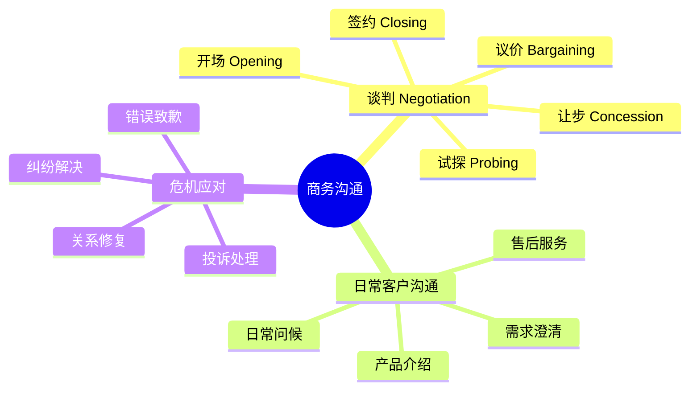
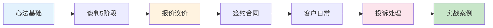
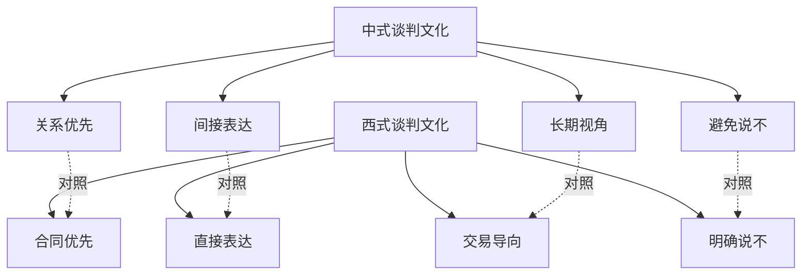
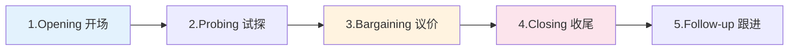
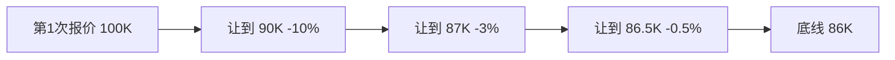
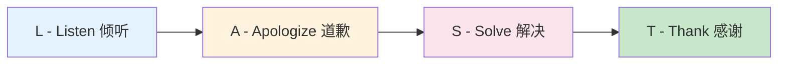
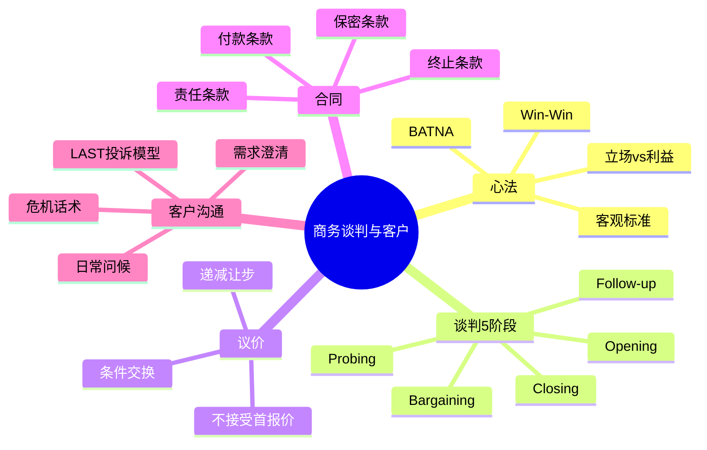
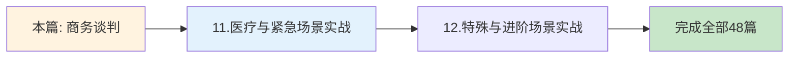

# 商务谈判合同与客户沟通

> [!info] 本篇定位
>
> 欢迎进入 **10.职场与商务场景实战** 的最后一篇 —— 第 4 篇！
>
> 前三篇你学会了**找工作、开会、写邮件**。这一篇带你跨入职场的「**真金白银战场**」 —— 商务谈判和客户管理。
>
> 这是一个让中国职场人**最想学好,但最少系统训练**的领域:
>
> - 谈判时一开口报价就吃亏
> - 客户投诉来了不知怎么应对
> - 合同条款看不懂直接签字
> - 想说 No 但又怕得罪客户
> - 和外国客户聊天总在「天气」上打转
>
> 谈判和客户沟通的英语 = **逻辑 + 心理 + 礼仪 + 文化**的综合能力。
>
> 本篇 **12000+ 字**,涵盖**100+ 谈判句型** + **合同英语必备 50 词** + **5 段完整实战案例** + **LAST 投诉处理模型**,让你在每次和客户/合作方的英语沟通中,都能**赢里子又赢面子**。
>
> **目标**:谈完一笔单子,对方说 `It was a pleasure doing business with you.`,而不是 `That was tough.`

---

## 1. 本篇导读:商务谈判与客户沟通全景

### 1.1 为什么要专门学

> [!warning] 谈判英语 ≠ 流利英语
>
> 你英语说得溜,不代表你能赢谈判。
>
> 谈判英语的核心是**精准表达「立场、底线、让步」**,每个词的选择都关乎几万到几百万的得失。
>
> - 说错 `firm price` 还是 `final price`,可能意味着失去议价空间
> - 说 `we agree` 还是 `we'd consider`,差别是千金一诺
> - 说 `that's our position` 还是 `we have flexibility`,决定对方下一步怎么出招

### 1.2 谈判 vs 客户沟通



上图把商务沟通分成 **3 大场景**:谈判（一锤定音）、日常沟通（持续维护）、危机应对（救火止损）。三者的英语风格完全不同 —— **谈判要刚柔并济,日常要友好专业,危机要冷静诚恳**。本篇按这三个场景依次展开。

### 1.3 本篇学习路线图



学习路径分 7 步推进。**蓝色（A）打底**(掌握谈判心法), **橙色（C）核心**(报价议价是商务的钱袋子), **粉色（F）救命**(投诉处理的成败决定客户去留), **绿色（G）实战**(综合应用)。每一步都配套句型库 + 真实对话。

---

## 2. 商务谈判核心心法

> [!success] 谈判 5 大基本原则
>
> 在动嘴之前,先动脑。下面 5 个原则是**全球商学院谈判课的共识**,英语只是表达工具。

### 2.1 核心原则速览

| 原则 | 英文术语 | 中文 | 一句话解释 |
|------|---------|------|-----------|
| **1. 知己知彼** | BATNA | Best Alternative to a Negotiated Agreement | 知道你的「最佳备选」,谈不成也不会被卡 |
| **2. 立场 vs 利益** | Positions vs Interests | 立场 vs 利益 | 「我要 100 万」是立场,「我需要 60 万还房贷」是利益 |
| **3. 创造价值** | Win-Win | 双赢 | 别只切蛋糕,先把蛋糕做大 |
| **4. 客观标准** | Objective Criteria | 客观标准 | 用市场价、行业规范说话,不是「我感觉」 |
| **5. 关系管理** | Relationship | 关系 | 这次赢钱失了关系,下次没生意做 |

### 2.2 中西谈判文化差异



中西谈判风格在 **4 个维度上几乎相反**。中国职场人和欧美客户谈判时,常因文化差异错失信号:对方说 `I'll think about it` 在西方语境往往等同于 `No`,但中国人会理解为「他在考虑,有戏」。**理解文化差异 = 看懂对方的真实信号**。

### 2.3 谈判前必备清单

> [!warning] 临阵磨枪不亮也光
>
> 80% 的谈判结果在你坐到桌前之前就已经决定了。

```text
谈判前必须做的 8 件事:

1. ☐ 明确自己的目标价 (Target Price)
2. ☐ 明确自己的底线 (Walk-away Point)
3. ☐ 调研对方的 BATNA (他们没你能找谁?)
4. ☐ 准备 3 个让步选项 (大让步/中让步/小让步)
5. ☐ 准备数据支持 (市场价、行业基准、案例)
6. ☐ 列出对方可能的反对意见 + 应对话术
7. ☐ 想好开场白和收场白
8. ☐ 安排合适的人和时间 (决策人在场)
```

---

## 3. 谈判五大阶段全流程

### 3.1 阶段总览



完整谈判按时间线分 **5 个阶段**。**Opening 是定调** —— 决定整场谈判的氛围;**Bargaining 是博弈核心** —— 真金白银的拉锯;**Closing 是落锤** —— 把口头共识变成白纸黑字;**Follow-up 是续命** —— 谈完不联系,客户就丢了。每个阶段都有专属句型,绝不能混用。

### 3.2 阶段一:Opening 开场

#### 3.2.1 寒暄破冰（5 分钟内）

```text
"Thanks for taking the time to meet with us today."
"It's great to finally meet in person."
"How was your trip?"
"Have you been to [city] before?"
"I appreciate you fitting this into your schedule."
```

#### 3.2.2 设定议程

```text
"Before we get into the details, let me outline what 
 I'd like to cover today."

"I propose we start with [topic A], then move to [topic B], 
 and wrap up with next steps. Does that work for you?"

"We have about [time] today. Where would you like to start?"

"Is there anything you'd like to add to the agenda?"
```

#### 3.2.3 表态合作姿态

```text
"We're really excited about the possibility of working 
 with [Company]."

"Our goal today is to find a solution that works for 
 both sides."

"We've come prepared and hope we can reach an agreement 
 today."
```

> [!tip] 开场 3 大忌
>
> 1. ❌ **谈天太久** —— 西方客户超过 5 分钟会觉得你浪费时间
> 2. ❌ **直接报价** —— 没建立基础就谈钱,显得急功近利
> 3. ❌ **过度赞美** —— `Your company is the best in the world!` 反而让人警惕

### 3.3 阶段二:Probing 试探

> [!info] 试探阶段决定整场谈判
>
> 通过提问了解对方的**真实需求、决策流程、预算范围、时间紧迫度**。
>
> **会提问 = 谈判已赢一半**。

#### 3.3.1 了解需求的提问

```text
"Could you walk me through what you're looking for?"
"What's the most important factor for you in this decision?"
"What's driving the timing on this?"
"Help me understand your priorities."
"What does success look like for you in this partnership?"
"What problem are you trying to solve?"
```

#### 3.3.2 了解决策流程

```text
"Who else will be involved in this decision?"
"What's your typical decision-making process?"
"When are you hoping to make a final decision?"
"Are there other vendors you're evaluating?"
"What would need to be true for us to move forward?"
```

#### 3.3.3 了解预算

```text
"Have you set a budget for this project?"
"What's your range for this kind of solution?"
"How does this fit into your overall budget?"
"To make sure we don't waste your time, what's the 
 budget ballpark?"
```

> [!tip] 提问的艺术:开放式 vs 封闭式
>
> - **开放式**(以 What/How/Why 开头):获取更多信息
>   - `What's most important to you?`
> - **封闭式**(以 Is/Do/Are 开头):确认或锁定承诺
>   - `Is the budget around $50K?`
>
> 试探阶段 80% 用开放式,锁定阶段才用封闭式。

### 3.4 阶段三:Bargaining 议价

> [!danger] 议价是谈判的核心战场
>
> 这一阶段每一句话都关乎钱,**话术错误直接换算成损失**。

#### 3.4.1 报价的两种策略

```text
策略 A:对方先报价 (Anchor 后到)

"What budget range did you have in mind?"
"What kind of investment are you prepared to make?"
"Help me understand what you'd consider a fair price."

策略 B:你先报价 (Anchor 先到)

"Based on the scope, our standard pricing for this 
 would be $50,000."

"For a project of this complexity, we typically charge 
 between $40K and $60K."

"Our list price is $X, but for strategic partners 
 like yourselves, we have flexibility."
```

#### 3.4.2 报价句型库

| 报价类型 | 句型 | 中文 |
|---------|------|------|
| 标准报价 | `Our price for this is $X.` | 我们的价格是 X |
| 范围报价 | `It typically ranges from $X to $Y.` | 通常在 X 到 Y 之间 |
| 含税报价 | `That's $X all-in / inclusive of all fees.` | 这是 X，全包 |
| 不含税 | `That's $X excluding tax.` | 这是 X，不含税 |
| 单位报价 | `That's $X per [unit/seat/month].` | 每个单位 X |
| 一次性 | `One-time payment of $X.` | 一次性 X |
| 订阅制 | `$X per month, billed annually.` | 每月 X，按年付 |
| 分期付款 | `Payable in [number] installments of $X.` | 分 X 期付款 |

#### 3.4.3 收到报价的反应（不要立刻接受!）

> [!warning] 永远不要爽快接受第一个报价
>
> 对方报价 → 你立刻说 `Sounds good!` → 对方心想:**我开高了,他还能接受**。下次他会试探更高的价。

```text
✅ 标准反应:

"Hmm, that's higher than what we had in mind."
"That's outside of our budget range."
"We need to be in the $X range to make this work."
"Is there any flexibility on the pricing?"
"What can you do to bring that down?"
"We've seen similar offerings at lower price points."
```

#### 3.4.4 砍价的话术

```text
温和砍价:
"Could you do better than that?"
"Is that the best you can do?"
"What's your wiggle room?"

中度砍价:
"We were hoping for something closer to $X."
"That's about [%] above our budget."
"To make this work, we'd need to be at $X."

强硬砍价:
"That price won't work for us."
"We need at least a [%] discount to consider this."
"Frankly, that's a non-starter."
```

#### 3.4.5 反驳对方砍价

```text
强调价值:
"I understand price is important. Let me remind you 
 what's included..."

"While we may not be the cheapest, we deliver [value]. 
 Here's why that matters..."

"If you compare apples to apples, our total cost of 
 ownership is actually lower."

锁定预算:
"Help me understand—is it a budget issue or a value 
 perception issue?"

"If we can find $X in savings, would we have a deal?"

延后决定:
"Let me think about what we can do and get back 
 to you tomorrow."
```

### 3.5 阶段四:Closing 收尾

#### 3.5.1 推进成交

```text
"It sounds like we have alignment on the key terms."
"Are we ready to move forward?"
"What would it take to get this signed today?"
"Let's recap what we've agreed to."
"I think we have a deal. Let me draft the contract."
```

#### 3.5.2 锁定承诺

```text
"So just to confirm: $X for [scope], starting [date], 
 with [terms]. Is that right?"

"Let me make sure I have this correct..."

"To put this in writing—you'll [action], and we'll 
 [action], by [date]."
```

#### 3.5.3 安排后续

```text
"I'll send the contract by EOD tomorrow."
"Let's plan to sign by [date]."
"I'll set up a kickoff meeting once the contract 
 is signed."
"Who should I send the paperwork to?"
```

### 3.6 阶段五:Follow-up 跟进

```text
谈完后 24 小时内发邮件:

Subject: Great meeting today—next steps

Hi [Name],

Thank you for a productive discussion today. As 
discussed, here's what we agreed:

1. Pricing: $X for [scope]
2. Timeline: Start [date], deliver by [date]
3. Payment: [terms]

Next steps:
• I'll send the draft contract by [date]
• You'll review with your team and [action] by [date]
• We'll plan to sign by [date]

Looking forward to working together!

Best regards,
[Your name]
```

---

## 4. 让步与施压策略

> [!info] 让步不是输,是策略
>
> **每一次让步都要换回对方的让步**。单方面让步 = 给对方挖坑往里跳。

### 4.1 让步的「条件交换」原则

#### 4.1.1 万能公式

```text
"If you [对方让步], then we can [我方让步]."
```

#### 4.1.2 具体应用

```text
价格换数量:
"If you can commit to a 3-year contract, we can 
 offer a 15% discount."

价格换付款:
"If you can pay 100% upfront, we can knock off 10%."

价格换推荐:
"If you'd be willing to provide a case study, we 
 can include 6 months of free support."

时间换条件:
"If we can push the deadline by 2 weeks, we can 
 absorb the additional cost."
```

### 4.2 让步的递减节奏

> [!tip] 让步要越来越小
>
> 第一次让 10%,第二次让 3%,第三次让 0.5% —— **传达「快到底线了」的信号**。
>
> 如果你每次都让 10%,对方会一直砍下去。



这个让步曲线展示了**递减让步策略**:第一次大让步显示诚意,第二次小让步表明谈判空间收窄,第三次微让步暗示已到底线。**节奏比金额本身更重要** —— 它在向对方传递信号:**「再压我就走了」**。

### 4.3 施压的话术

#### 4.3.1 时间压力

```text
"This offer is good through Friday."
"We have other clients waiting on capacity."
"Our pricing increases on [date]."
"To meet your launch date, we'd need to start by [date]."
```

#### 4.3.2 稀缺性

```text
"We only take on [number] new clients per quarter."
"This pricing tier has limited availability."
"There's a waitlist after this."
```

#### 4.3.3 备选警告

```text
"We're also evaluating other options."
"If we can't reach an agreement, we'll need to 
 explore alternatives."
"Frankly, your competitors are offering better terms."
```

> [!danger] 施压有度
>
> 过度施压 = 把对方逼走。
>
> **不要用**: `Take it or leave it.`(要么接受要么走人)、`This is final.`(过早封死)
>
> **可以用**: `We're hoping to find a path forward together.`(留余地)

### 4.4 防御对方施压的话术

```text
对方说 "Our budget is fixed at $X":
你回应 "I understand budget constraints. Let's see 
       what we can do within those parameters. 
       What's the most important to you?"

对方说 "Your competitor offers it for less":
你回应 "I'd love to understand the comparison. 
       Are you comparing the same scope and quality?"

对方说 "We need a decision by tomorrow":
你回应 "I appreciate the urgency. To respond properly, 
       I need [X]. Can we extend by [Y]?"

对方说 "Take it or leave it":
你回应 "I hear you. Let me see if there's any way to 
       get to your number, and I'll come back to you."
```

---

## 5. 签约与合同条款英语

> [!warning] 合同条款不是装饰
>
> 看不懂英文合同就签字 = 把钱往坑里扔。**本节是合同英语的最小生存包**。

### 5.1 合同高频术语

#### 5.1.1 合同结构词汇

| 术语 | 音标 | 中文 |
|------|------|------|
| **agreement** | /əˈɡriːmənt/ | 协议 |
| **contract** | /ˈkɑːntrækt/ | 合同 |
| **MOU** | /em oʊ juː/ | 谅解备忘录 (Memorandum of Understanding) |
| **NDA** | /en diː eɪ/ | 保密协议 (Non-Disclosure Agreement) |
| **SOW** | /soʊ/ | 工作说明书 (Statement of Work) |
| **MSA** | /em es eɪ/ | 主服务协议 (Master Service Agreement) |
| **terms and conditions** | /tɜːrmz/ | 条款与条件 |
| **schedule / appendix** | /ˈskedʒuːl/ | 附件 |
| **clause** | /klɔːz/ | 条款 |
| **provision** | /prəˈvɪʒən/ | 规定 |

#### 5.1.2 合同关键条款词汇

| 术语 | 中文 | 你需要关注 |
|------|------|-----------|
| **scope of work** | 工作范围 | 写明白做什么/不做什么 |
| **deliverables** | 交付物 | 具体产出物 |
| **timeline / milestones** | 时间表/里程碑 | 关键节点 |
| **payment terms** | 付款条款 | 何时付、付多少 |
| **net 30 / net 60** | 30/60 天付款 | 收到发票后多少天 |
| **late payment fee** | 迟付费 | 超期罚款 |
| **deposit / retainer** | 定金/预付费 | 启动金额 |
| **warranty** | 保修 | 出问题谁负责 |
| **liability** | 责任 | 出事赔多少 |
| **indemnification** | 赔偿 | 第三方索赔 |
| **confidentiality** | 保密 | 不能泄密 |
| **IP rights** | 知识产权 | 谁拥有产出 |
| **termination** | 终止 | 怎么解约 |
| **force majeure** | 不可抗力 | 自然灾害免责 |
| **governing law** | 管辖法律 | 出纠纷按哪国法 |
| **arbitration** | 仲裁 | 不打官司,仲裁解决 |
| **non-compete** | 竞业禁止 | 不做竞争对手 |
| **renewal** | 续约 | 自动/手动续约 |
| **auto-renewal** | 自动续约 | ⚠️ 重点关注! |
| **opt-out** | 退订 | 怎么不续约 |

### 5.2 合同条款常见英文模板

#### 5.2.1 付款条款（Payment Terms）

```text {1,3,5,7}
Payment Terms

The Client shall pay the Service Provider as follows:
1. 30% deposit upon signing this Agreement.
2. 40% upon completion of Phase 1 (Wireframes).
3. 30% upon final delivery and acceptance.

All invoices are payable within thirty (30) days of 
the invoice date (Net 30). Late payments will incur 
a 1.5% monthly late fee.
```

> [!info] 付款条款解读
>
> - **第 1 行**:章节标题
> - **第 3-7 行**:分期付款百分比 + 节点(里程碑)
> - **Net 30**:发票后 30 天付款
> - **Late fee**:迟付罚款,通常 1-2%/月

#### 5.2.2 终止条款（Termination）

```text {1,3,5,7}
Termination

Either party may terminate this Agreement with thirty 
(30) days' written notice.

In the event of material breach, the non-breaching 
party may terminate immediately upon written notice.

Upon termination, the Client shall pay for all work 
completed up to the termination date.
```

#### 5.2.3 保密条款（Confidentiality）

```text {1,3,7}
Confidentiality

Both parties agree to keep confidential all proprietary 
information shared during this engagement, including but 
not limited to business plans, customer data, financial 
information, and trade secrets.

This obligation shall survive termination of this 
Agreement for a period of five (5) years.
```

### 5.3 谈判合同条款的句型

#### 5.3.1 异议条款

```text
"I'd like to push back on Section [X]."
"This clause is too one-sided."
"We can't agree to unlimited liability."
"Could we modify this to..."
"Our standard terms require..."
"This would need to be reciprocal."
```

#### 5.3.2 提出修改

```text
"Could we change [X] to [Y]?"
"We propose striking this clause entirely."
"Let's add a cap on liability of $[amount]."
"We'd like to extend the cure period to 30 days."
"Could we include a [carve-out / exception] for..."
```

#### 5.3.3 接受/拒绝

```text
接受:
"That works for us."
"We can live with that."
"Approved on our end."

拒绝:
"This is a non-starter for us."
"That's outside our standard terms."
"We can't agree to that as written."

进一步讨论:
"I need to run this by legal."
"Let me check internally and get back to you."
"Could we put a pin in this and discuss tomorrow?"
```

### 5.4 签约现场常用句

```text
"Where should I sign?"
"Could you initial here as well?"
"I need to add my title under my signature."
"Let me make a copy of the signed agreement for our records."
"When can we expect the countersigned copy?"
"Looking forward to a successful partnership!"
"Welcome aboard!"
"Cheers to a great partnership!"
```

---

## 6. 客户日常沟通

> [!tip] 关系是生意的基石
>
> 谈判赢一时,关系赢一世。**80% 的复购来自老客户**,客户日常沟通的功夫比谈判更见真章。

### 6.1 日常问候与跟进

#### 6.1.1 季度问候

```text
"Hi [Name], hope you're doing well! Just wanted to 
 check in and see how things are going on your end."

"It's been a while since we last connected. How's 
 the [project/initiative] going?"

"Wanted to share a thought I had after our last 
 conversation..."
```

#### 6.1.2 节日问候

```text
"Wishing you and your team a wonderful holiday season!"
"Happy [holiday]! Hope you have a relaxing time off."
"As we close out the year, I wanted to thank you for 
 your partnership."
```

#### 6.1.3 行业资讯分享

```text
"Came across this article and thought of you—seemed 
 relevant to your work on [topic]."

"Saw [Company]'s announcement and thought you'd find 
 it interesting given our recent discussion."

"There's a new report from [Source] on [topic]. 
 Sharing in case it's useful."
```

### 6.2 需求澄清

```text
"To make sure I understand correctly, you're looking 
 for [X]. Is that right?"

"Could you give me a bit more context on [topic]?"
"What's the use case you have in mind?"
"Help me understand the priorities here."
"What does 'success' look like for you in 6 months?"
"Walk me through the current process."
```

### 6.3 产品/方案介绍

#### 6.3.1 价值导向介绍

```text
"What this means for you is [benefit]."
"The way this would help you is..."
"You can think of it as [analogy]."
"Companies like [example] have used this to [result]."
"The ROI typically looks like [numbers]."
```

#### 6.3.2 演示节奏

```text
"Let me walk you through how it works."
"To give you a sense of the experience..."
"I'll show you a quick example."
"Does this resonate with what you're trying to do?"
"What questions do you have so far?"
```

### 6.4 售后服务

#### 6.4.1 主动跟进

```text
"How's everything going since launch?"
"Are you seeing the results we discussed?"
"Anything we can do to make your experience better?"
"How is the team adopting the new tool?"
```

#### 6.4.2 提供支持

```text
"I'm happy to set up a refresher training for your team."
"Let me connect you with our customer success manager."
"We have some new features that might be helpful."
"I'll loop in our technical team to take a look."
```

---

## 7. 客户投诉处理: LAST 模型

> [!danger] 投诉处理决定客户去留
>
> 数据显示:**投诉处理得当的客户,忠诚度比从不投诉的客户还高 30%**。
>
> 反之,处理不当则客户流失 + 负面口碑。

### 7.1 LAST 模型解析



LAST 是客服界的黄金法则:**Listen(听完) → Apologize(致歉) → Solve(解决) → Thank(感谢)**。这 4 步缺一不可。**最大的错误是跳过 L 直接跳到 S** —— 客户没被听到,即使解决了问题也心怀不满。

### 7.2 L - Listen 倾听阶段

#### 7.2.1 表达倾听姿态

```text
"I'm really sorry to hear that. Could you tell me 
 more about what happened?"

"I want to make sure I understand the full picture. 
 Walk me through what occurred."

"Take your time. I'm here to help."
"I'm listening. Please continue."
"That sounds frustrating. What happened next?"
```

#### 7.2.2 复述确认

```text
"Just to make sure I've got this right—you're saying 
 that [paraphrase]. Is that correct?"

"Let me play this back: [restatement]."
"So the main issues are: 1) [X], 2) [Y], 3) [Z]. 
 Did I miss anything?"
```

> [!warning] 倾听阶段绝对不要做的事
>
> - ❌ 打断客户
> - ❌ 急着解释「这不是我们的错」
> - ❌ 找借口
> - ❌ 转移话题
> - ❌ 责怪客户没看清楚

### 7.3 A - Apologize 道歉阶段

#### 7.3.1 真诚道歉的句型

```text
弱:    "I apologize for any inconvenience this may have caused."
       (公式化,客户能听出来不真诚)

中:    "I'm really sorry this happened to you."
       (真诚,但缺细节)

强:    "I'm so sorry. This shouldn't have happened, 
        and I completely understand why you're upset."
       (✅ 最佳:真诚 + 承认问题 + 共情)
```

#### 7.3.2 共情语句

```text
"I can imagine how frustrating that must be."
"That's not the experience we want you to have."
"You have every right to be upset."
"If I were in your shoes, I'd feel the same way."
"Thank you for bringing this to our attention—it 
 helps us do better."
```

> [!tip] 道歉的关键
>
> 道歉不是认所有的错,而是承认**「让你产生这种感受」是错的**。
>
> 即使最终发现是客户操作问题,你也可以说:
> `I'm sorry our instructions weren't clear enough.`

### 7.4 S - Solve 解决阶段

#### 7.4.1 提供解决方案

```text
"Here's what I'm going to do for you..."
"To make this right, I'd like to offer..."
"Let me take care of this personally."
"I have two options for you—which would you prefer?"
"Here's how we can fix this..."
```

#### 7.4.2 设定期望

```text
"I'll have an update for you by [time]."
"This will take about [duration] to resolve."
"I'll personally follow up to make sure it's done."
"You'll hear from me within 24 hours."
"In the meantime, here's what you can do..."
```

#### 7.4.3 超出期望（Going the Extra Mile）

```text
"In addition to fixing this, I'd like to offer 
 [bonus] as a gesture of goodwill."

"To thank you for your patience, we'll waive 
 [fee/charge]."

"As a thank-you for sticking with us, please 
 accept [credit/discount]."
```

### 7.5 T - Thank 感谢阶段

```text
"Thank you for letting us know about this."
"I really appreciate your patience while we sorted 
 this out."

"Thanks for giving us the chance to make this right."
"Your feedback helps us improve—please keep it coming."
"Thank you for your continued business."
```

### 7.6 LAST 模型完整对话示例

```text
Customer: I'm really upset. Your product broke after 
          two days, and I tried to call but no one 
          answered for hours!

You (L):  I'm so sorry to hear that, and I completely 
          understand your frustration. Could you walk 
          me through what happened?

Customer: [explains in detail]

You (L):  Just to confirm—the device stopped working 
          on day 2, you called 5 times with no response, 
          and now you're stuck without it for a week. 
          Is that right?

Customer: Yes, exactly.

You (A):  I am so sorry. This is absolutely not the 
          experience we want for our customers. The 
          phone wait time is unacceptable, and the 
          product failure shouldn't happen.

Customer: So what are you going to do?

You (S):  Here's what I'll do right now. First, I'll 
          ship you a replacement today with overnight 
          shipping—you'll have it tomorrow. Second, 
          I'll add 3 months free to your subscription. 
          Third, I'll personally follow up in a week 
          to make sure everything is working.

Customer: ...okay, that sounds reasonable.

You (T):  Thank you for your patience and for giving 
          us a chance to make this right. Your feedback 
          about phone wait times is going straight to 
          our operations team. I'll text you the 
          tracking number within an hour.

Customer: Thanks. I appreciate that.
```

---

## 8. 危机沟通话术

> [!warning] 危机时刻 = 信任时刻
>
> 在重大问题发生时(数据泄露、产品召回、服务中断),你的英语沟通方式决定客户**留下还是离开**。

### 8.1 危机沟通 5 大原则

```text
1. 速度 (Speed):24-48 小时内必须回应
2. 透明 (Transparency):说清楚发生了什么
3. 责任 (Responsibility):承担责任,不推诿
4. 行动 (Action):说明你做了什么/将做什么
5. 持续 (Continuity):持续更新,直到问题解决
```

### 8.2 危机声明模板

```text {1,3,5,11,17}
Subject: [Important Update] Service Disruption on [Date]

Dear Customer,

We're writing to inform you of a service disruption 
that occurred on [date] between [time] and [time], 
affecting [scope].

What happened:
[Brief, factual description—no jargon, no excuses]

The impact:
[Specific to the customer—what they couldn't do, 
what data may have been affected]

What we're doing:
1. [Immediate action]
2. [Investigation in progress]
3. [Long-term prevention]

Your next steps:
[Specific actions the customer should take]

We take full responsibility for this issue. We know 
trust is hard to earn and easy to lose. We're committed 
to doing better.

If you have questions, please contact us at [email/phone].

Sincerely,
[CEO Name]
[Title]
[Company]
```

### 8.3 不同危机类型的英语应对

#### 8.3.1 数据泄露

```text
"On [date], we discovered that [specific data] may 
 have been accessed without authorization."

"As a precaution, we've [actions taken]."

"We strongly recommend you [user action: change password, 
 monitor accounts, etc.]."

"We've engaged [security firm] to investigate. We will 
 share updates as we learn more."
```

#### 8.3.2 产品质量问题

```text
"We've identified an issue with [product/batch] that 
 may affect [function/safety]."

"If you purchased between [dates], please [action]."

"We're offering full refunds and replacements at no 
 cost to you."

"Your safety is our top priority."
```

#### 8.3.3 服务中断

```text
"We're currently experiencing [issue]. Our engineering 
 team is working to resolve this."

"Estimated time to recovery: [time]."

"We'll post updates every [interval] on our status page: 
 [URL]."

"We sincerely apologize for the disruption."
```

### 8.4 媒体应对短语（公关话术）

```text
"We are aware of the situation and taking it seriously."
"We are conducting a thorough investigation."
"We are cooperating fully with [authorities]."
"Our top priority is [customer safety / data security]."
"We will share more information as it becomes available."
"We do not comment on ongoing investigations."
```

> [!danger] 危机沟通绝对禁忌
>
> - ❌ `No comment.`(显得心虚)
> - ❌ `It's not our fault.`(推卸责任)
> - ❌ `These things happen.`(轻描淡写)
> - ❌ `We can't talk about it.`(回避)
> - ❌ 沉默(最糟糕的回应)

---

## 9. 实战完整案例

### 9.1 案例一:SaaS 软件议价

**背景**:你是销售,客户要求 30% 折扣。

```text
Customer: We've reviewed your proposal. Your competitor 
          quoted us 30% less for the same features.

You:      I appreciate you sharing that. Could you tell 
          me which competitor and what's included in 
          their proposal?

Customer: It's [Competitor X]. Same features, $35K 
          instead of your $50K.

You:      That's helpful context. Just to make sure 
          we're comparing apples to apples—does their 
          quote include the dedicated account manager, 
          24/7 support, and the SOC 2 compliance package?

Customer: Hmm, I'm not sure about all of those.

You:      Those three items typically add about $15K 
          in value. So we may actually be priced 
          similarly when you compare like-for-like.

          That said, I want to find a way to make this 
          work. Here's what I can do:

          Option A: Match their $35K, but we'd need to 
          reduce scope—remove the dedicated AM and 
          downgrade support to business hours.

          Option B: Stay at full scope, but offer 15% 
          off ($42.5K) if you commit to a 2-year contract 
          and provide a case study.

          Which feels closer to what you need?

Customer: Option B is interesting. Can you do 20% off?

You:      I'd love to. Let me check with my manager and 
          get back to you tomorrow. If we can do 18%, 
          would we have a deal?

Customer: 18% works.

You:      Great. I'll confirm by EOD tomorrow and send 
          over the contract. Welcome aboard!
```

> [!info] 案例分析
>
> 1. **不立即让步**:先了解对手底细
> 2. **价值重塑**:把对手的价格优势消解(`apples to apples`)
> 3. **二选一策略**:给客户选项而不是单一方案
> 4. **递减让步**:20% → 18%,显示底线
> 5. **条件交换**:让步换 2 年合约 + 案例

### 9.2 案例二:合同条款谈判

**背景**:你的法务对客户合同里的责任条款有意见。

```text
You:        Hi [Name], thanks for sending the contract. 
            We've reviewed it and have a few questions 
            on Sections 8 and 12.

Client:     Sure, what's the concern?

You:        Section 8 has unlimited liability on our 
            side. That's a non-starter for us. Could 
            we cap liability at the contract value?

Client:     We typically don't cap liability for vendors 
            of your category.

You:        I understand. However, this is industry 
            standard for SaaS contracts. I can share 
            examples from [reference]. Would you 
            consider a cap at 2x annual contract value?

Client:     Let me check with our legal team. What 
            about Section 12?

You:        Section 12 has a 10-day cure period for 
            breach. Our standard is 30 days. This 
            gives both sides reasonable time to resolve 
            issues before termination.

Client:     30 days is reasonable. We can do that.

You:        Great. So to summarize:
            • Section 8: Liability capped at 2x ACV (pending your legal)
            • Section 12: 30-day cure period (agreed)

            When can we hear back on Section 8?

Client:     I'll have an answer by Wednesday.

You:        Perfect. If we can align on Section 8, 
            we should be able to sign by Friday.
```

### 9.3 案例三:客户投诉处理

**背景**:客户因系统宕机投诉。

```text
Customer:  Your system has been down for 3 hours! 
           My entire team is sitting idle. This is 
           unacceptable.

You:       I am so sorry. I completely understand your 
           frustration—this is not the reliability you 
           expect, or what we promise.

           Can you tell me which features specifically 
           you're unable to access right now?

Customer:  Everything! Login, dashboard, reports. We 
           can't work.

You:       Got it. I'm pulling up your account now.

           [pause]

           I can see we had an outage starting at 9 AM 
           PST. Our engineering team is actively working 
           on it. ETA is 30 minutes.

           Here's what I'm going to do for you:

           1. I'll personally call you the moment we're 
              back up.
           2. I'm crediting your next month's invoice 
              as compensation.
           3. I'll send you our incident report once 
              the post-mortem is complete.

Customer:  That's something at least. But this is the 
           second outage this month.

You:       You're absolutely right to bring that up. 
           I'm escalating this to our VP of Engineering 
           and will personally arrange a call between 
           you and her this week to discuss our 
           reliability roadmap.

           Would Wednesday or Thursday afternoon work?

Customer:  Thursday at 2 PM.

You:       Done. I'll send the calendar invite. And 
           thank you for your patience—your feedback 
           is exactly what we need to improve.
```

### 9.4 案例四:拒绝客户不合理要求

**背景**:客户要求免费做范围外的工作。

```text
Customer:  We need you to add the mobile app feature 
           too. Same price, right?

You:       I appreciate you thinking of us for the 
           mobile work. However, mobile development 
           wasn't in our original scope or pricing.

Customer:  But it's just one more feature.

You:       I hear you, but mobile is actually a 
           significant addition. It typically takes 
           4-6 weeks of dedicated work and would 
           require a new SOW.

           Here's what I can do:

           Option 1: Complete the original scope as 
           agreed, then we can quote the mobile work 
           separately. I estimate $30K-40K.

           Option 2: We can pause the current work, 
           expand scope to include mobile, and adjust 
           timeline and budget accordingly. This would 
           push delivery to August.

           Which approach works better for you?

Customer:  Hmm, we really wanted everything for the 
           original price.

You:       I understand the desire to maximize value. 
           Unfortunately, we can't deliver mobile at 
           no extra cost—it would mean operating at 
           a loss, which isn't sustainable for either 
           of us long-term.

           That said, I want to find a way to make 
           this work. If you can extend our partnership 
           to a year, I can offer 15% off the mobile 
           project as a loyalty discount.

Customer:  Let me think about it.

You:       Of course. Take your time. I'll send the 
           proposal for both options today so you can 
           review.
```

### 9.5 案例五:跨文化客户沟通

**背景**:与日本客户的初次会议(注意正式度)。

```text
You:       Tanaka-san, thank you very much for taking 
           the time to meet with us today. We're truly 
           honored to have this opportunity.

Tanaka:    The honor is mine. Thank you for visiting 
           our office.

You:       Before we begin, I wanted to share that we've 
           done extensive research on [Tanaka's company] 
           and deeply respect your commitment to quality.

Tanaka:    Thank you for your kind words.

You:       I understand that long-term relationships are 
           very important to your company. We share that 
           value and approach this conversation as the 
           beginning of a partnership, not a transaction.

Tanaka:    That is reassuring to hear.

You:       I'd like to listen first to understand your 
           needs before discussing how we might help. 
           Could you share what's most important to you 
           in a partner?

[Tanaka explains]

You:       Thank you for that context. Based on what 
           you've shared, I believe we can align well.

           Would it be appropriate to schedule a follow-up 
           meeting to discuss specifics? We don't want 
           to rush this important decision.

Tanaka:    Yes, that would be very welcome.
```

> [!info] 跨文化沟通要点
>
> - **日韩客户**:多用敬语、避免直接、重视关系建立
> - **欧美客户**:直接表达、效率优先、合同明确
> - **中东客户**:重视面子、长时间寒暄、家庭话题
> - **拉美客户**:热情、肢体接触、决策较慢

---

## 10. 常见错误与辨析

### 10.1 中式英语 Top 12

| 中式 ❌ | 地道 ✅ | 说明 |
|--------|--------|------|
| `Give you a discount` | `Offer you a discount` | give 太随意 |
| `Cheapest price` | `Best price` | cheap 含义偏负面 |
| `My boss says no` | `Let me check with leadership` | 显得没决策权 |
| `It's not my fault` | `Let me look into this` | 推诿姿态 |
| `Pay first, then we ship` | `Once payment is received, we'll ship` | 命令口吻 |
| `You must accept` | `We need to align on this` | 强制 vs 协商 |
| `No way!` | `That won't work for us, but...` | 全盘否定 |
| `Take it or leave it` | `That's our best offer` | 太硬 |
| `We are the best` | `We're known for [specific value]` | 空洞 vs 具体 |
| `Your problem` | `Let's work this out together` | 推卸 vs 协作 |
| `I want to know...` | `Could you help me understand...` | 命令 vs 请求 |
| `Final price` | `Our best price` | 过早封死 |

### 10.2 谈判用词的精细差别

#### 10.2.1 `firm` vs `final` vs `best`

```text
"firm price"     谈判中坚持但仍可商量
"final price"    封死,不再让步
"best price"     已让步到底,但留余地
```

#### 10.2.2 `agree` vs `accept` vs `consider`

```text
"We agree"       已经接受,可以签字
"We accept"      接受但有条件
"We'll consider" 还在考虑,未承诺
```

#### 10.2.3 `discount` vs `concession` vs `accommodation`

```text
"discount"        价格让步
"concession"      条款让步(更广义)
"accommodation"   适应/迁就(关系层面)
```

### 10.3 文化禁忌速查

```text
❌ 不要做的事:

1. 第一次见面就谈价格
2. 在合同签字前就当成已成交
3. 在桌面上谈论对方个人收入
4. 用 "I'll give you a special price"(暗示行贿)
5. 在群体场合让对方"丢面子"
6. 对宗教/政治话题轻率发言
7. 笑着说严肃的话(中国习惯,西方混淆)
8. 沉默太久(西方人会不安)
```

---

## 11. 练习与输出建议

### 11.1 角色扮演练习

> [!tip] 推荐 AI 陪练 Prompt

```text
You are playing the role of [Customer/Vendor]. We are 
negotiating a [contract/deal] for [scope]. Your starting 
position is [position]. Your BATNA is [alternative]. 
Your hidden constraints are [constraints].

Negotiate with me in English. Use realistic tactics 
including objections, counteroffers, and pressure 
tactics. After 15 exchanges, give me feedback on:
1. What worked in my approach
2. What I could have done better
3. Specific phrases I should add to my repertoire
```

### 11.2 句型替换练习

每天选 1 个句型公式,**用今天工作中的真实场景**填空 5 次:

```text
公式 1: "If you can [对方让步], we can [我方让步]."
公式 2: "I appreciate [view], but our position is [position]."
公式 3: "To make sure I understand—[paraphrase]. Is that right?"
公式 4: "Here's what I can do: [concrete option]."
公式 5: "Let me check internally and get back to you by [time]."
```

### 11.3 邮件改写练习

把下面这段中式英语谈判邮件改写成地道英文:

```text
原文(中式):

Dear Mr. Smith,

We received your quotation. Your price is too expensive. 
We need a 30% discount. We are a big company with much 
business. If you cannot give us discount, we will choose 
your competitor. Please reply quickly.

Best wish,
Tom
```

> [!tip] 改写要点
>
> 1. 主题行加标签
> 2. 不要直接说 `too expensive`(显得无修养)
> 3. BLUF 但留余地
> 4. 用具体业务量证明价值
> 5. 给 deadline 但不要逼迫
> 6. Best wish → Best regards

参考改写:

```text
Subject: [Discussion] Pricing Review for [Project Name]

Hi Mr. Smith,

Thank you for the detailed quotation. We've reviewed 
it carefully and would like to discuss the pricing.

Based on our market research and budget, we were 
hoping to be in the [$X-Y] range, which is about 
30% below your current quote.

A few factors that might support a more competitive 
price:
• We're committing to a 3-year contract
• Annual volume of [number] units
• Potential for case study and references

If we can find alignment on pricing, we're prepared 
to move forward by [date]. Otherwise, we may need 
to evaluate alternative options.

Could we set up a call this week to discuss?

Best regards,
Tom
```

### 11.4 复盘清单

每次谈判后用以下清单复盘:

| 维度 | 反思问题 | 评分 1-5 |
|------|---------|---------|
| 准备 | 是否充分调研对方? | ☐ |
| 开场 | 是否建立了良好氛围? | ☐ |
| 试探 | 是否问到了关键信息? | ☐ |
| 报价 | 锚定是否合理? | ☐ |
| 让步 | 让步是否换回价值? | ☐ |
| 收尾 | 是否锁定了承诺? | ☐ |
| 跟进 | 24 小时内是否邮件确认? | ☐ |
| 整体 | 关系是否得到加强? | ☐ |

---

## 12. 小结与下一步

### 12.1 本篇核心要点回顾



### 12.2 必背 25 句型清单

> [!success] 商务谈判与客户沟通的最小可用句库
>
> 这 25 句覆盖 80% 高频场景,背熟即可上场。

```text
开场:
1.  Thanks for taking the time to meet with us today.
2.  Our goal is to find a solution that works for both sides.

试探:
3.  What's most important to you in this decision?
4.  Help me understand your priorities.
5.  Who else will be involved in this decision?

报价/反应:
6.  Our standard pricing for this is $X.
7.  Hmm, that's higher than what we had in mind.
8.  Is there any flexibility on the pricing?

议价/让步:
9.  If you can [X], then we can [Y].
10. We were hoping for something closer to $X.
11. What would it take to get to a yes?

合同:
12. I need to run this by legal.
13. Could we cap liability at the contract value?
14. That's a non-starter for us.
15. We can live with that.

收尾:
16. So just to confirm: [terms]. Is that right?
17. Welcome aboard!

客户沟通:
18. Just wanted to check in and see how things are going.
19. To make sure I understand—you're looking for [X].
20. What does success look like for you?

投诉处理 (LAST):
21. I'm so sorry to hear that. Could you tell me more?
22. I completely understand your frustration.
23. Here's what I'm going to do for you...
24. Thank you for bringing this to our attention.

危机:
25. We take full responsibility and here's what we're doing.
```

### 12.3 学习路径下一站



**10.职场与商务场景**全部 4 篇已完成 ✅

**下一篇预告**: [11.医疗与紧急场景实战 / 01.医院看病与药店购药场景]

- 医院挂号、症状描述、看医生流程
- 常见病症英语词汇(感冒、发烧、过敏、骨折)
- 处方、药店买药对话
- 急救、手术同意书相关英语
- 海外就医保险流程

> [!tip] 学完本篇后建议
>
> 1. **立即应用**:下一次和客户/合作方沟通,刻意使用 BLUF + 条件交换公式
> 2. **建模板库**:把第 5 章的合同条款模板存到笔记里,签合同时调出来对照
> 3. **角色扮演**:用 11.1 的 AI 陪练 Prompt,每周练一次谈判
> 4. **复盘**:用 11.4 的清单,每次重要谈判后必做复盘

> [!success] scholar,恭喜完成本篇!
>
> 12000+ 字、100+ 句型、5 段实战案例、LAST 模型 + BATNA 心法 —— 商务谈判与客户沟通的**完整工具包**已交付。
>
> **同时也意味着 10.职场与商务场景实战分类已全部完成 (4/4)**!从求职 → 会议 → 邮件 → 谈判,你拥有了完整的职场英语武器库。
>
> **记住一件事**:谈判英语的本质不是「赢」,而是**「让双方都觉得自己赢了」**。下次和客户谈判,从一句 `Help me understand your priorities` 开始,你的专业感会瞬间不同。
>
> 加油,下一站医疗与紧急场景见!💪
