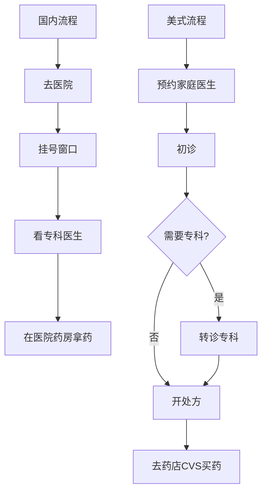
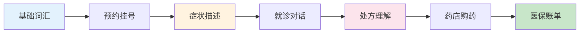
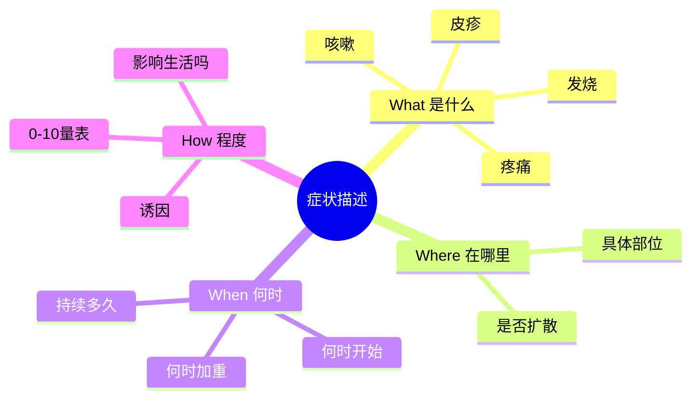
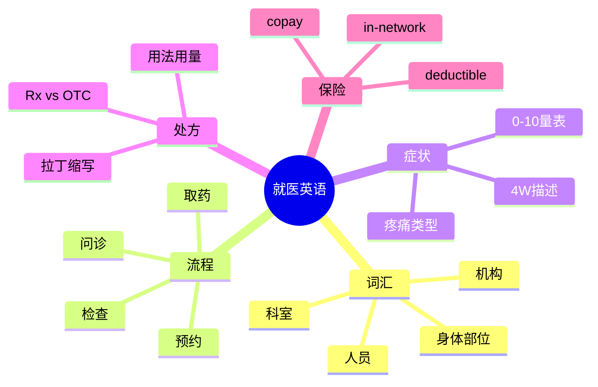
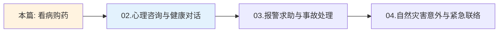

# 医院看病与药店购药场景

> [!info] 本篇定位
>
> 欢迎进入 **11.医疗与紧急场景实战** 的第 1 篇！
>
> 在国外生病、留学就医、出差时身体不适——这些场景**容不得半点听不懂**。一句英语听错、症状描述错位，可能导致**误诊或浪费几百美元**。
>
> 中国人海外就医的常见痛点：
>
> - 不知道挂哪个科 (`internal medicine` 还是 `family medicine`?)
> - 描述疼痛只会说 `It hurts`(医生听完一脸懵)
> - 听不懂处方说明 (`take twice daily with food` = ?)
> - 不会读药品标签 (`OTC` / `Rx` / `dosage` / `expiration`)
> - 看不懂医保账单 (`copay` / `deductible` / `out-of-pocket`)
>
> 本篇 **10000+ 字**，给你**完整就医英语武器库**：
>
> - 200+ 医疗词汇 + 国际音标
> - 80+ 实用句型
> - 5 段完整就诊对话
> - 西式医保系统全解
>
> **目标**：在国外生病时，能完整、准确地描述症状，听懂医嘱，安全拿药。

---

## 1. 本篇导读：海外就医英语全景

### 1.1 中外就医流程差异

> [!warning] 美国/欧洲就医和国内完全不同
>
> 国内:**直接去医院挂号 → 看专科**
>
> 美国:**先约家庭医生 → 转诊专科 → 拿处方 → 药店买药**



中外就医流程在 **入口、转诊、买药** 三个环节完全不同。**不理解这个流程**,你可能直接冲到医院说想看心脏科,结果被告知必须先约家庭医生(GP / Primary Care Physician)。本篇按西式流程展开。

### 1.2 海外就医英语学习路线



学习路径分 7 步推进。**蓝色 (A) 打基础** —— 不认识 `prescription`、`pharmacist` 这些核心词,后面全部段子都听不懂;**橙色 (C) 是核心** —— 描述症状决定医生能否准确诊断;**粉色 (E) 关乎用药安全** —— 处方读错可能吃错药;**绿色 (G) 关乎钱包** —— 美国医疗账单看不懂可能多付几百美元。

---

## 2. 医疗系统核心词汇

### 2.1 医疗机构与场所

| 英文 | 音标 | 中文 | 说明 |
|------|------|------|------|
| **hospital** | /ˈhɑːspɪtəl/ | 医院 | 大型综合 |
| **clinic** | /ˈklɪnɪk/ | 诊所 | 小型,通常专科 |
| **urgent care** | /ˈɜːrdʒənt ker/ | 紧急医疗中心 | 非急救但当天看 |
| **emergency room (ER)** | /ɪˈmɜːrdʒənsi/ | 急诊室 | 危及生命 |
| **doctor's office** | /ˈdɑːktərz ˈɔːfɪs/ | 私人诊所 | 家庭医生 |
| **pharmacy / drugstore** | /ˈfɑːrməsi/ | 药店 | CVS、Walgreens |
| **walk-in clinic** | /wɔːk ɪn/ | 免预约诊所 | 不用提前约 |
| **dental office** | /ˈdentəl/ | 牙科诊所 | 牙齿 |
| **outpatient** | /ˈaʊtˌpeɪʃənt/ | 门诊 | 不住院 |
| **inpatient** | /ˈɪnˌpeɪʃənt/ | 住院 | 需要床位 |
| **ICU** | /aɪ siː juː/ | 重症监护室 | Intensive Care Unit |
| **ward** | /wɔːrd/ | 病房 | 住院病房 |

### 2.2 医务人员

| 英文 | 音标 | 中文 |
|------|------|------|
| **doctor / physician** | /ˈdɑːktər/ /fəˈzɪʃən/ | 医生 |
| **nurse** | /nɜːrs/ | 护士 |
| **surgeon** | /ˈsɜːrdʒən/ | 外科医生 |
| **specialist** | /ˈspeʃəlɪst/ | 专科医生 |
| **GP (general practitioner)** | /dʒiː piː/ | 全科医生(英) |
| **PCP (primary care physician)** | /piː siː piː/ | 主治医生(美) |
| **resident** | /ˈrezɪdənt/ | 住院医生 |
| **intern** | /ˈɪntɜːrn/ | 实习医生 |
| **pharmacist** | /ˈfɑːrməsɪst/ | 药剂师 |
| **dentist** | /ˈdentɪst/ | 牙医 |
| **paramedic** | /ˌpærəˈmedɪk/ | 急救人员 |
| **receptionist** | /rɪˈsepʃənɪst/ | 接待员/挂号员 |

### 2.3 医院科室

| 英文 | 音标 | 中文 | 看什么病 |
|------|------|------|---------|
| **internal medicine** | /ɪnˈtɜːrnəl ˈmedəsən/ | 内科 | 一般内科疾病 |
| **family medicine** | /ˈfæməli/ | 家庭医学 | 家庭医生 |
| **pediatrics** | /ˌpiːdiˈætrɪks/ | 儿科 | 儿童 |
| **obstetrics & gynecology (OB-GYN)** | /əbˈstetrɪks/ /ˌɡaɪnəˈkɑːlədʒi/ | 妇产科 | 女性/孕产 |
| **cardiology** | /ˌkɑːrdiˈɑːlədʒi/ | 心脏科 | 心脏 |
| **dermatology** | /ˌdɜːrməˈtɑːlədʒi/ | 皮肤科 | 皮肤 |
| **neurology** | /nʊˈrɑːlədʒi/ | 神经科 | 神经系统 |
| **orthopedics** | /ˌɔːrθəˈpiːdɪks/ | 骨科 | 骨骼/关节 |
| **ophthalmology** | /ˌɑːfθælˈmɑːlədʒi/ | 眼科 | 眼睛 |
| **ENT (ear, nose, throat)** | /iː en tiː/ | 耳鼻喉科 | 五官 |
| **psychiatry** | /saɪˈkaɪətri/ | 精神科 | 心理疾病 |
| **oncology** | /ɑːnˈkɑːlədʒi/ | 肿瘤科 | 癌症 |
| **radiology** | /ˌreɪdiˈɑːlədʒi/ | 放射科 | X 光/CT/MRI |
| **emergency medicine** | /ɪˈmɜːrdʒənsi/ | 急诊科 | 急诊 |

### 2.4 身体部位词汇

#### 2.4.1 头部

```text
head        /hed/        头
hair        /her/        头发
forehead    /ˈfɔːrhed/   额头
temple      /ˈtempəl/    太阳穴
eye         /aɪ/         眼睛
eyelid      /ˈaɪlɪd/     眼睑
ear         /ɪr/         耳朵
nose        /noʊz/       鼻子
nostril     /ˈnɑːstrəl/  鼻孔
mouth       /maʊθ/       嘴
lip         /lɪp/        嘴唇
tooth/teeth /tuːθ/       牙齿
tongue      /tʌŋ/        舌头
chin        /tʃɪn/       下巴
jaw         /dʒɔː/       下颌
neck        /nek/        脖子
throat      /θroʊt/      喉咙
```

#### 2.4.2 躯干与四肢

```text
shoulder    /ˈʃoʊldər/   肩膀
chest       /tʃest/      胸部
breast      /brest/      乳房
back        /bæk/        背部
spine       /spaɪn/      脊柱
waist       /weɪst/      腰
abdomen     /ˈæbdəmən/   腹部
stomach     /ˈstʌmək/    胃/肚子
hip         /hɪp/        髋部
arm         /ɑːrm/       手臂
elbow       /ˈelboʊ/     肘部
wrist       /rɪst/       手腕
hand        /hænd/       手
finger      /ˈfɪŋɡər/    手指
thumb       /θʌm/        拇指
leg         /leɡ/        腿
thigh       /θaɪ/        大腿
knee        /niː/        膝盖
calf        /kæf/        小腿
ankle       /ˈæŋkəl/     脚踝
foot/feet   /fʊt/        脚
toe         /toʊ/        脚趾
```

#### 2.4.3 内脏器官

```text
heart       /hɑːrt/      心脏
lung        /lʌŋ/        肺
liver       /ˈlɪvər/     肝
kidney      /ˈkɪdni/     肾
brain       /breɪn/      脑
intestine   /ɪnˈtestən/  肠
appendix    /əˈpendɪks/  阑尾
gallbladder /ˈɡɔːlblædər/ 胆囊
bladder     /ˈblædər/    膀胱
bone        /boʊn/       骨头
muscle      /ˈmʌsəl/     肌肉
joint       /dʒɔɪnt/     关节
nerve       /nɜːrv/      神经
artery      /ˈɑːrtəri/   动脉
vein        /veɪn/       静脉
```

---

## 3. 预约挂号 (Making an Appointment)

> [!info] 美国看病必须预约
>
> 直接走进诊所基本会被拒(除非 walk-in clinic 或 ER)。掌握**电话预约英语**是第一课。

### 3.1 电话预约句型

#### 3.1.1 开场白

```text
"Hi, I'd like to make an appointment with Dr. [Name]."
"I need to schedule a check-up."
"Could I book an appointment for [reason]?"
"I'm a new patient and would like to see a doctor."
"Do you have any openings this week?"
```

#### 3.1.2 说明就诊原因

```text
"It's for a routine check-up."        (常规体检)
"I have [symptom] and need to see someone."
"I need a follow-up after my last visit."  (复诊)
"I need to renew my prescription."         (开方续药)
"It's a non-emergency but I'd like to see 
 someone soon."
"I think I need [vaccination/test]."
```

#### 3.1.3 沟通时间

```text
"What times do you have available?"
"Do you have anything tomorrow?"
"Anything sooner?"
"How about next week?"
"What's the earliest available?"
"Could I do a Saturday appointment?"
"Do you have evening hours?"
```

#### 3.1.4 紧急程度判断

| 情况 | 应该去哪 | 英文表达 |
|------|---------|---------|
| 危及生命 | ER 急诊 | `Call 911` / `Go to the ER immediately` |
| 当天就诊 | Urgent Care | `I need to be seen today` |
| 一两天内 | 家庭医生 | `Earliest available appointment` |
| 常规检查 | 提前一周约 | `Routine check-up` |

### 3.2 完整预约对话示例

```text
Receptionist: Good morning, Riverside Medical Group, this 
              is Lisa speaking. How can I help you?

You:          Hi Lisa, I'd like to make an appointment with 
              Dr. Chen.

Receptionist: Sure. Are you a new patient or returning?

You:          I'm a new patient.

Receptionist: OK, I'll need some information. Can I have 
              your full name, date of birth, and phone number?

You:          Sure. My name is Tom Wang. Date of birth is 
              May 5, 1995. Phone number is 415-555-0123.

Receptionist: Got it. What's the reason for your visit?

You:          I've been having stomach pain for about a week. 
              I'd like to get it checked.

Receptionist: I see. Dr. Chen has an opening on Thursday at 
              10 AM, or Friday at 2 PM. Which works better?

You:          Thursday at 10 AM, please.

Receptionist: Great. Could you arrive 15 minutes early to 
              fill out some paperwork? Also, please bring 
              your insurance card and photo ID.

You:          Will do. Anything else I should bring?

Receptionist: A list of any medications you're currently 
              taking would be helpful.

You:          Got it. Thanks Lisa, see you Thursday.

Receptionist: You're welcome. Feel better soon!
```

> [!tip] 预约后必做 3 件事
>
> 1. **写入日历** + 设置提醒
> 2. **保存诊所地址** + 停车信息
> 3. **准备资料**:保险卡、ID、用药清单、症状记录

---

## 4. 描述症状 (Describing Symptoms)

> [!danger] 描述症状是就医英语的核心
>
> 医生听 1 分钟症状,就能初步判断 80% 的病。**描述准确度直接影响诊断准确度**。

### 4.1 症状描述四要素



完整的症状描述需要回答 **4W 问题**:What(什么症状)、Where(在哪里)、When(何时开始)、How(多严重)。**只说 `It hurts` 等于没说**,医生没法判断。

### 4.2 疼痛类型词汇

| 英文 | 音标 | 中文 | 适用场景 |
|------|------|------|---------|
| **sharp** | /ʃɑːrp/ | 锐痛 | 像针扎、像刀割 |
| **dull** | /dʌl/ | 钝痛 | 闷闷的 |
| **throbbing** | /ˈθrɑːbɪŋ/ | 跳痛 | 一跳一跳的 |
| **stabbing** | /ˈstæbɪŋ/ | 刺痛 | 像被刺中 |
| **burning** | /ˈbɜːrnɪŋ/ | 烧灼感 | 火辣辣 |
| **aching** | /ˈeɪkɪŋ/ | 酸痛 | 持续酸 |
| **cramping** | /ˈkræmpɪŋ/ | 痉挛痛 | 抽筋 |
| **shooting** | /ˈʃuːtɪŋ/ | 放射痛 | 串着痛 |
| **tingling** | /ˈtɪŋɡlɪŋ/ | 麻刺感 | 麻麻的 |
| **soreness** | /ˈsɔːrnəs/ | 酸软 | 运动后那种 |

### 4.3 症状程度量表（0-10 Pain Scale）

> [!info] 美国医生标准做法
>
> 几乎每个医生都会问:`On a scale of 1 to 10, how would you rate your pain?`

```text
0:    No pain                 (没痛)
1-3:  Mild pain               (轻微,能正常活动)
4-6:  Moderate pain           (中度,影响活动)
7-9:  Severe pain             (严重,无法专注)
10:   Worst pain imaginable   (最痛,无法忍受)
```

### 4.4 时间描述句型

#### 4.4.1 何时开始

```text
"It started [time period] ago."
"It's been going on for [duration]."
"Since [time/event]..."
"I first noticed it [time] ago."

具体例子:
"It started two days ago."
"It's been going on for about a week."
"I first noticed it last Monday."
"It started after I ate something at the restaurant."
```

#### 4.4.2 频率

```text
"It happens [频率]."
"It comes and goes."
"It's constant."
"It's worse [when]."

具体例子:
"It happens every morning when I wake up."
"It comes and goes throughout the day."
"It's constant—doesn't stop."
"It's worse after I eat."
"It's worse at night."
```

### 4.5 身体感觉句型

#### 4.5.1 一般描述

```text
"I don't feel well."           (不舒服)
"I'm not feeling great."       (感觉不好)
"I feel under the weather."    (不舒服,口语)
"I feel terrible."             (很糟糕)
"I'm feeling sick."            (生病)
"I feel run down."             (虚弱)
"I'm achy all over."           (浑身酸痛)
```

#### 4.5.2 具体症状的句型

```text
基本结构: "I have [症状]" 或 "I'm [feeling/experiencing] [症状]"

发烧:     "I have a fever of 101°F."
头痛:     "I have a bad headache."
胃痛:     "My stomach hurts."
呕吐:     "I've been throwing up."
腹泻:     "I have diarrhea."
咳嗽:     "I have a persistent cough."
咽喉痛:   "I have a sore throat."
鼻塞:     "I'm congested."
流鼻涕:   "I have a runny nose."
头晕:     "I feel dizzy."
疲劳:     "I'm exhausted."
失眠:     "I can't sleep."
皮疹:     "I have a rash on my arm."
肿胀:     "My ankle is swollen."
出血:     "I'm bleeding."
```

### 4.6 完整症状描述模板

> [!tip] 黄金描述公式
>
> **症状 + 部位 + 起始时间 + 持续时间 + 程度 + 加重/缓解因素**

```text
模板:
"I have [症状] in my [部位]. It started [时间] ago and 
has been going on for [持续时间]. The pain is about 
[1-10] out of 10. It gets worse when [触发因素], and 
it feels better when [缓解因素]."

示例 1 (头痛):
"I have a sharp headache on the right side of my head. 
It started two days ago and has been constant since. 
It's about a 7 out of 10. It gets worse with bright 
lights, and lying down in a dark room helps a bit."

示例 2 (胃痛):
"I have a burning pain in my upper stomach. It started 
about a week ago. It comes and goes, but it's worse 
right after I eat. The pain is about 5 out of 10."

示例 3 (脚踝伤):
"I twisted my ankle yesterday during a basketball game. 
It's swollen and bruised. The pain is about 6 out of 10 
when I try to walk on it, but it doesn't hurt when I 
keep it elevated."
```

---

## 5. 就诊对话流程

### 5.1 进诊室

```text
Nurse:    Hi Tom, I'm Sarah, the nurse. I'll be taking 
          your vitals today. Please follow me.

You:      Hi Sarah.

Nurse:    Let's start with your weight.   [称重]
          Now your height.                 [量身高]
          I'll take your blood pressure.   [量血压]
          And your temperature.            [量体温]
          Now your oxygen level.           [测血氧]

Nurse:    All looks good. Your blood pressure is 120/80, 
          temperature 98.6°F. Dr. Chen will be with you 
          shortly. Please have a seat.
```

### 5.2 医生问诊

```text
Doctor:   Hi Tom, I'm Dr. Chen. What brings you in today?

You:      I've been having stomach pain for about a week.

Doctor:   I'm sorry to hear that. Tell me more about it. 
          Where exactly do you feel the pain?

You:      It's in my upper stomach, right here. 
          [指向位置]

Doctor:   And what kind of pain is it? Sharp, dull, burning?

You:      It's a burning sensation, especially after 
          I eat.

Doctor:   How would you rate the pain on a scale of 
          1 to 10?

You:      About 5 most of the time, but sometimes it 
          spikes to 7.

Doctor:   Have you experienced any other symptoms—
          nausea, vomiting, changes in appetite?

You:      I feel nauseous after meals, but I haven't 
          thrown up.

Doctor:   Have you had this before?

You:      No, this is the first time.

Doctor:   Any recent changes in diet, stress, or new 
          medications?

You:      I've been pretty stressed at work, and I 
          drink more coffee than usual.

Doctor:   OK. Let me examine your stomach. Could you 
          lie down?

[examines]

Doctor:   I think you may have gastritis—inflammation 
          of the stomach lining. Stress and excessive 
          coffee can trigger it. I'd like to run a quick 
          test to rule out other causes. We'll do a 
          blood test today.

You:      Will I need any medication?

Doctor:   I'll prescribe an acid reducer. Take it twice 
          a day for two weeks. Cut back on coffee, spicy 
          foods, and alcohol. If symptoms persist after 
          two weeks, come back and we'll do further 
          investigation.

You:      Thank you, Dr. Chen.
```

### 5.3 问诊常见问题清单

> [!info] 医生最常问的 10 个问题
>
> 提前想好答案,减少现场卡顿。

```text
1. "What brings you in today?"
   → 你今天来看什么?

2. "When did this start?"
   → 什么时候开始的?

3. "Have you had this before?"
   → 以前有过吗?

4. "Any allergies to medications?"
   → 对什么药过敏?

5. "Are you taking any medications currently?"
   → 现在吃什么药?

6. "Any family history of [condition]?"
   → 家族有 X 病史吗?

7. "Do you smoke or drink alcohol?"
   → 抽烟喝酒吗?

8. "When did you last eat?"
   → 最后一次吃东西是什么时候?

9. "Are you pregnant or trying to conceive?"
   → 怀孕了或正在备孕吗? (女性)

10. "Any recent travel?"
    → 最近出过远门吗?
```

### 5.4 医生常用回应

```text
"Let me take a look."
"Take a deep breath."                  (深呼吸)
"Hold your breath."                    (屏住呼吸)
"Open your mouth and say 'ah'."        (张嘴说 ah)
"Stick out your tongue."               (伸舌头)
"Does this hurt?"                      (这里痛吗?)
"Where does it hurt the most?"
"Press here. Tell me when it hurts."
"Roll up your sleeve."                 (卷起袖子)
"Lie down on the table."               (躺在检查床上)
"You can sit up now."
```

---

## 6. 常见病症英语词汇

### 6.1 感冒 / 流感类

| 英文 | 音标 | 中文 |
|------|------|------|
| **cold** | /koʊld/ | 感冒 |
| **flu / influenza** | /fluː/ | 流感 |
| **fever** | /ˈfiːvər/ | 发烧 |
| **chills** | /tʃɪlz/ | 发冷 |
| **sore throat** | /sɔːr θroʊt/ | 喉咙痛 |
| **cough** | /kɔːf/ | 咳嗽 |
| **runny nose** | /ˈrʌni noʊz/ | 流鼻涕 |
| **stuffy nose / congestion** | /ˈstʌfi/ | 鼻塞 |
| **sneezing** | /ˈsniːzɪŋ/ | 打喷嚏 |
| **body aches** | /ˈbɑːdi eɪks/ | 浑身酸痛 |
| **headache** | /ˈhedeɪk/ | 头痛 |
| **fatigue** | /fəˈtiːɡ/ | 疲劳 |

### 6.2 消化系统

| 英文 | 音标 | 中文 |
|------|------|------|
| **stomachache** | /ˈstʌməkˌeɪk/ | 胃痛 |
| **nausea** | /ˈnɔːziə/ | 恶心 |
| **vomiting** | /ˈvɑːmətɪŋ/ | 呕吐 |
| **diarrhea** | /ˌdaɪəˈriːə/ | 腹泻 |
| **constipation** | /ˌkɑːnstəˈpeɪʃən/ | 便秘 |
| **bloating** | /ˈbloʊtɪŋ/ | 腹胀 |
| **heartburn** | /ˈhɑːrtbɜːrn/ | 烧心 |
| **acid reflux** | /ˈæsɪd ˈriːflʌks/ | 反酸 |
| **food poisoning** | /fuːd ˈpɔɪzənɪŋ/ | 食物中毒 |
| **indigestion** | /ˌɪndaɪˈdʒestʃən/ | 消化不良 |
| **gastritis** | /ɡæˈstraɪtɪs/ | 胃炎 |
| **ulcer** | /ˈʌlsər/ | 溃疡 |

### 6.3 过敏与皮肤

| 英文 | 音标 | 中文 |
|------|------|------|
| **allergy** | /ˈælərdʒi/ | 过敏 |
| **rash** | /ræʃ/ | 皮疹 |
| **itch / itchy** | /ɪtʃ/ | 痒 |
| **hives** | /haɪvz/ | 荨麻疹 |
| **eczema** | /ˈeksɪmə/ | 湿疹 |
| **acne** | /ˈækni/ | 痤疮 |
| **sunburn** | /ˈsʌnbɜːrn/ | 晒伤 |
| **insect bite** | /ˈɪnsekt baɪt/ | 虫咬 |
| **swelling** | /ˈswelɪŋ/ | 肿胀 |
| **bruise** | /bruːz/ | 瘀青 |

### 6.4 受伤类

| 英文 | 音标 | 中文 |
|------|------|------|
| **sprain** | /spreɪn/ | 扭伤 |
| **strain** | /streɪn/ | 拉伤 |
| **fracture / broken bone** | /ˈfræktʃər/ | 骨折 |
| **dislocation** | /ˌdɪsloʊˈkeɪʃən/ | 脱臼 |
| **cut / laceration** | /ˌlæsəˈreɪʃən/ | 割伤 |
| **burn** | /bɜːrn/ | 烫伤/烧伤 |
| **concussion** | /kənˈkʌʃən/ | 脑震荡 |
| **bleeding** | /ˈbliːdɪŋ/ | 出血 |
| **swollen** | /ˈswoʊlən/ | 肿的 |

### 6.5 慢性病

| 英文 | 音标 | 中文 |
|------|------|------|
| **diabetes** | /ˌdaɪəˈbiːtiːz/ | 糖尿病 |
| **high blood pressure / hypertension** | /ˌhaɪpərˈtenʃən/ | 高血压 |
| **high cholesterol** | /kəˈlestərɔːl/ | 高胆固醇 |
| **asthma** | /ˈæzmə/ | 哮喘 |
| **arthritis** | /ɑːrˈθraɪtɪs/ | 关节炎 |
| **migraine** | /ˈmaɪɡreɪn/ | 偏头痛 |
| **anxiety** | /æŋˈzaɪəti/ | 焦虑 |
| **depression** | /dɪˈpreʃən/ | 抑郁 |
| **insomnia** | /ɪnˈsɑːmniə/ | 失眠 |

---

## 7. 检查与诊断

### 7.1 常见医学检查

| 英文 | 音标 | 中文 | 用途 |
|------|------|------|------|
| **blood test** | /blʌd test/ | 血液检查 | 血常规 |
| **urine test** | /ˈjʊrən/ | 尿液检查 | 尿常规 |
| **X-ray** | /eks reɪ/ | X 光 | 骨骼/胸 |
| **CT scan** | /siː tiː skæn/ | CT 扫描 | 横断面成像 |
| **MRI** | /em ɑːr aɪ/ | 核磁共振 | 软组织 |
| **ultrasound** | /ˈʌltrəsaʊnd/ | 超声波 | B 超 |
| **EKG / ECG** | /iː keɪ dʒiː/ | 心电图 | 心脏 |
| **biopsy** | /ˈbaɪɑːpsi/ | 活检 | 取组织化验 |
| **endoscopy** | /enˈdɑːskəpi/ | 内窥镜 | 胃肠镜 |
| **colonoscopy** | /ˌkoʊləˈnɑːskəpi/ | 结肠镜 | 检查肠道 |
| **mammogram** | /ˈmæməɡræm/ | 乳腺X光 | 乳腺筛查 |
| **physical exam** | /ˈfɪzɪkəl ɪɡˈzæm/ | 体格检查 | 一般体检 |

### 7.2 检查相关对话

```text
医生开检查:
"I'd like to order a blood test."
"We need to do an X-ray."
"Let's send you for an ultrasound."
"You'll need to schedule an MRI."

你的反应:
"What does the test involve?"
"How long will it take?"
"Do I need to fast beforehand?"     (需要空腹吗?)
"When will I get the results?"
"Will my insurance cover this?"
```

### 7.3 听诊断结果

```text
医生说出诊断:
"You have [condition]."
"It looks like [condition]."
"The test results show..."
"Your [body part] is [condition]."

具体例子:
"You have a sinus infection."
"It looks like the flu."
"The blood test shows you're anemic."
"Your knee has a small tear."

询问后续:
"How serious is it?"
"What's the treatment plan?"
"How long until I recover?"
"Are there any side effects to the medication?"
"What should I avoid?"
"When should I follow up?"
```

---

## 8. 处方与药品

> [!warning] 美国处方药 vs 非处方药
>
> - **Rx (Prescription)** = 处方药,必须医生开方
> - **OTC (Over-the-Counter)** = 非处方药,药店直接买

### 8.1 药品类型词汇

| 英文 | 音标 | 中文 | 用途 |
|------|------|------|------|
| **prescription** | /prɪˈskrɪpʃən/ | 处方 | 医生开的 |
| **medication / medicine** | /ˌmedəˈkeɪʃən/ | 药物 | 通用 |
| **pill / tablet** | /pɪl/ /ˈtæblət/ | 药丸/药片 | 固体 |
| **capsule** | /ˈkæpsəl/ | 胶囊 | 胶囊 |
| **syrup** | /ˈsɪrəp/ | 糖浆 | 液体药 |
| **drops** | /drɑːps/ | 滴剂 | 滴眼/滴耳 |
| **cream / ointment** | /kriːm/ /ˈɔɪntmənt/ | 药膏 | 外用 |
| **inhaler** | /ɪnˈheɪlər/ | 吸入器 | 哮喘 |
| **injection / shot** | /ɪnˈdʒekʃən/ | 注射 | 打针 |
| **vaccine** | /vækˈsiːn/ | 疫苗 | 预防 |
| **supplement** | /ˈsʌpləmənt/ | 营养补充剂 | 维生素等 |

### 8.2 常见药物名称

```text
止痛/退烧:
acetaminophen / Tylenol     (扑热息痛/泰诺) - 退烧止痛
ibuprofen / Advil           (布洛芬/艾德维) - 消炎止痛
aspirin                     (阿司匹林) - 镇痛抗血栓

感冒/过敏:
DayQuil / NyQuil            (感冒药白天/晚上)
Sudafed                     (减充血剂)
Benadryl                    (抗过敏)
Claritin / Zyrtec           (长效抗过敏)
cough syrup                 (止咳糖浆)
throat lozenges             (润喉糖)

消化:
Tums / Pepto-Bismol         (抗酸/止泻)
Imodium                     (止泻药)
laxative                    (通便药)
antacid                     (抗酸剂)

抗生素:
amoxicillin                 (阿莫西林)
penicillin                  (青霉素)
azithromycin                (阿奇霉素)
```

### 8.3 处方说明读法

> [!info] 处方说明常见缩写
>
> 美国处方常用拉丁缩写,看不懂可能吃错药!

| 缩写 | 拉丁全称 | 英文意思 | 中文 |
|------|---------|---------|------|
| **PO** | per os | by mouth | 口服 |
| **PRN** | pro re nata | as needed | 必要时 |
| **BID** | bis in die | twice a day | 一天 2 次 |
| **TID** | ter in die | three times a day | 一天 3 次 |
| **QID** | quater in die | four times a day | 一天 4 次 |
| **QD** | quaque die | once a day | 一天 1 次 |
| **HS** | hora somni | at bedtime | 睡前 |
| **AC** | ante cibum | before meals | 饭前 |
| **PC** | post cibum | after meals | 饭后 |
| **q4h** | — | every 4 hours | 每 4 小时 |
| **stat** | statim | immediately | 立即 |

### 8.4 处方理解练习

```text
处方写: "Amoxicillin 500mg, 1 cap PO TID x 7 days"

逐字解读:
- Amoxicillin = 阿莫西林
- 500mg = 500 毫克
- 1 cap = 1 颗胶囊
- PO = 口服
- TID = 一天 3 次
- x 7 days = 持续 7 天

完整意思:
"阿莫西林 500 毫克,一次 1 粒,一天 3 次,口服,连吃 7 天。"
```

### 8.5 询问处方的句型

```text
"What's this medication for?"          (这药治什么的?)
"How should I take it?"                (怎么吃?)
"How often?"                            (多久一次?)
"Should I take it with food?"          (要饭后吃吗?)
"Are there any side effects?"          (有副作用吗?)
"What should I avoid?"                  (要避免什么?)
"Can I drink alcohol?"                  (能喝酒吗?)
"What if I miss a dose?"                (漏吃了怎么办?)
"How long do I take it?"                (吃多久?)
"Can I drive while taking this?"        (吃药能开车吗?)
"Will it interact with my other meds?"  (和其他药冲突吗?)
```

---

## 9. 药店购药 (At the Pharmacy)

### 9.1 药店类型

```text
chain pharmacy    (连锁药店,如 CVS、Walgreens、Rite Aid)
drugstore         (药店统称)
pharmacy counter  (大型超市的药品柜台,如 Walmart)
24-hour pharmacy  (24小时药店)
mail-order pharmacy (邮购药房,慢性病常用)
```

### 9.2 取处方药对话

```text
Pharmacist: Hi, can I help you?

You:        Hi, I'm here to pick up a prescription. 
            My name is Tom Wang.

Pharmacist: Date of birth, please?

You:        May 5, 1995.

Pharmacist: Let me check the system... Yes, I have it 
            ready. It's amoxicillin. Is this your first 
            time taking this medication?

You:        Yes, it is.

Pharmacist: OK, let me go over the instructions. Take 
            one capsule three times a day with food, 
            for 7 days. Make sure to finish all the 
            pills, even if you feel better.

You:        Got it. Any side effects I should watch for?

Pharmacist: Common side effects include nausea or mild 
            diarrhea. If you experience a rash, swelling, 
            or difficulty breathing, stop taking it 
            immediately and call 911—that could be an 
            allergic reaction.

You:        OK. Will it interact with anything?

Pharmacist: Are you on any other medications?

You:        Just a multivitamin.

Pharmacist: That's fine, no interaction. Avoid alcohol 
            while you're on this. Any questions?

You:        How much is it with my insurance?

Pharmacist: Your copay is $15.

You:        OK, here's my card.

Pharmacist: Thanks. Sign here, please. Feel better!
```

### 9.3 买非处方药

```text
You:        Hi, I'm looking for something for [症状].

Pharmacist: Could you describe the symptoms?

You:        I have a sore throat and a cough.

Pharmacist: Is the cough dry or productive?  (干咳还是有痰?)

You:        It's dry.

Pharmacist: I'd recommend Robitussin DM for the cough 
            and these throat lozenges. The cough syrup 
            is on aisle 4. You'll want to take it before 
            bed.

You:        Thanks. Anything for the throat itself?

Pharmacist: These lozenges with menthol will provide 
            relief. They're also on aisle 4.

You:        Great, thank you!
```

### 9.4 药店常见请求

```text
"I need to refill my prescription."     (续方)
"Can I transfer my prescription from another pharmacy?"  (转药)
"Do you sell [item]?"                                    (有卖 X 吗?)
"Where can I find [item]?"                               (在哪里?)
"Is there a generic version?"                            (有仿制药吗?)
"How much will this cost without insurance?"
"Can you check if this is covered by my insurance?"
"I need this filled today."                              (今天要拿)
"When will it be ready?"                                 (什么时候好?)
```

---

## 10. 医疗保险与账单

> [!warning] 美国医疗费天价
>
> 没有保险,一次普通急诊可能 $2000+,救护车 $1000+。**懂保险英语 = 懂得保护自己**。

### 10.1 医疗保险核心词汇

| 英文 | 音标 | 中文 | 解释 |
|------|------|------|------|
| **insurance** | /ɪnˈʃʊrəns/ | 保险 | 通用 |
| **policy** | /ˈpɑːləsi/ | 保单 | 合同 |
| **premium** | /ˈpriːmiəm/ | 保费 | 每月付的钱 |
| **deductible** | /dɪˈdʌktəbəl/ | 自付额 | 保险报销前自己先付 |
| **copay / co-payment** | /ˈkoʊpeɪ/ | 共付额 | 每次看病自己付一部分 |
| **coinsurance** | /ˌkoʊɪnˈʃʊrəns/ | 共同保险 | 保险报销 X%, 你付 (100-X)% |
| **out-of-pocket maximum** | /aʊt əv ˈpɑːkət/ | 自付上限 | 一年最多自付多少 |
| **in-network** | /ɪn ˈnetwɜːrk/ | 网内 | 保险合作的医院 |
| **out-of-network** | /aʊt əv/ | 网外 | 不在合作范围内,贵 |
| **claim** | /kleɪm/ | 理赔 | 申请报销 |
| **coverage** | /ˈkʌvərɪdʒ/ | 保障范围 | 保哪些 |
| **pre-authorization** | /priː ˌɔːθərəˈzeɪʃən/ | 预授权 | 大手术需事先批 |
| **HMO / PPO** | /eɪtʃ em oʊ/ | 健保类型 | 不同保险结构 |

### 10.2 看病前问保险

```text
"Is Dr. [Name] in my network?"
"Does my plan cover this procedure?"
"What's my copay for a specialist visit?"
"Do I need a referral?"
"Is this hospital in-network?"
"How much will this cost out-of-pocket?"
```

### 10.3 看懂账单 (EOB - Explanation of Benefits)

```text
账单常见项目:

Total Charge:           $500  (诊所收费)
Insurance Adjustment:   -$200 (保险议价折扣)
Insurance Paid:         -$240 (保险公司付的)
Patient Responsibility: $60   (你要付的)

其中你要付的 $60 可能包含:
- Copay:        $30
- Deductible:   $20
- Coinsurance:  $10
```

### 10.4 处理账单问题

```text
账单异常时:
"I think there's an error on my bill."
"This procedure should have been covered."
"Could you verify this charge?"
"Why am I being charged for [item]?"
"Can you submit this to my insurance again?"

无法支付时:
"Do you offer a payment plan?"
"Is there financial assistance available?"
"Can I get a discount for paying upfront?"
"Can you waive the late fee?"
```

---

## 11. 实战完整对话

### 11.1 案例一:Urgent Care 紧急就诊

**背景**:周末突发严重头痛,去 urgent care。

```text
Receptionist: Welcome to Riverside Urgent Care. Have 
              you been here before?

You:          No, this is my first time.

Receptionist: I'll need you to fill out these forms. 
              Do you have insurance?

You:          Yes, here's my card and ID.

Receptionist: Thank you. The wait is about 30 minutes. 
              Please have a seat.

[30 minutes later]

Nurse:        Tom Wang? Right this way. I'll take your 
              vitals first.

[checks blood pressure, temperature]

Nurse:        Your BP is a bit high—140/90. Temperature 
              is normal. The doctor will be in shortly.

Doctor:       Hi Tom, I'm Dr. Patel. What's going on today?

You:          I've had a really bad headache since this 
              morning. It started suddenly and it's the 
              worst headache I've ever had.

Doctor:       That's concerning. On a scale of 1 to 10?

You:          Easily a 9.

Doctor:       Where exactly is the pain?

You:          The whole right side, but worse in the 
              back of my head.

Doctor:       Any nausea, vision changes, or sensitivity 
              to light?

You:          Yes, lights make it worse, and I feel a 
              bit nauseous.

Doctor:       Have you had migraines before?

You:          A few times, but never this bad.

Doctor:       Given the severity and your blood pressure, 
              I'd like to be cautious. We'll do a CT scan 
              to rule out anything serious. We'll also 
              check your blood pressure again after you 
              rest for a few minutes.

You:          OK. Will the CT take long?

Doctor:       About 30-45 minutes total, including reading 
              the results. Better safe than sorry.

[After CT scan]

Doctor:       Good news—the CT is clear. This appears to 
              be a severe migraine triggered by stress 
              and possibly your blood pressure. I'm going 
              to give you an injection for the migraine 
              and prescribe a stronger medication for if 
              this happens again. Please follow up with 
              your primary care doctor about the blood 
              pressure within a week.

You:          Thank you, doctor.
```

### 11.2 案例二:儿科带孩子看医生

```text
Doctor:    Good morning! How's our little one today?

Parent:    Not great. She's had a fever for two days 
           and is pulling at her ear.

Doctor:    Let me take a look. [examines ear] Yep, 
           that's an ear infection. Pretty common at 
           this age.

Parent:    Will she need antibiotics?

Doctor:    Yes, I'll prescribe amoxicillin. Give her 
           5 ml twice a day for 10 days. It tastes like 
           bubble gum, so she should tolerate it well.

Parent:    What if she throws it up?

Doctor:    If within 30 minutes, give it again. After 
           that, just continue with the next scheduled 
           dose. For the fever, you can give her 
           children's Tylenol every 6 hours.

Parent:    When should I bring her back?

Doctor:    If she's not improving in 48 hours, or if 
           the fever spikes above 103°F, bring her in. 
           Otherwise, let's plan a follow-up in 2 weeks 
           to make sure the infection is fully cleared.

Parent:    Thank you so much.
```

### 11.3 案例三:慢性病复诊

```text
Doctor:    Hi Mr. Wang, good to see you. How have you 
           been since your last visit?

You:       Pretty good. My blood sugar has been more 
           stable since I started the new medication.

Doctor:    Excellent. Did you bring your glucose log?

You:       Yes, here it is.

Doctor:    [reviews] These numbers look much better. 
           Average is around 130. Any side effects from 
           the medication?

You:       Some mild stomach upset at first, but it 
           went away after a couple of weeks.

Doctor:    Good. Let's check your A1C today—I'll have 
           the nurse draw blood. We want to see if the 
           3-month average has improved too.

You:       OK. Should I continue the same dosage?

Doctor:    For now, yes. Once we see the A1C results, 
           we may adjust. I'd also like to renew your 
           prescription—I'll send it to your pharmacy 
           today.

You:       Thank you. Same one as before?

Doctor:    Yes, CVS on Main Street. Anything else 
           bothering you?

You:       I've been a bit tired lately.

Doctor:    Could be diabetes-related, or something else. 
           Let's add a thyroid test to today's blood 
           work. We'll review everything when results 
           come back—probably in 2-3 days.
```

---

## 12. 常见错误与辨析

### 12.1 中式英语 Top 10

| 中式 ❌ | 地道 ✅ | 解释 |
|--------|--------|------|
| `I am ill` | `I'm sick` / `I'm not feeling well` | ill 较正式,日常用 sick |
| `I want to see doctor` | `I'd like to see a doctor` | 加冠词 a |
| `I have stomach pain` | `My stomach hurts` / `I have a stomachache` | 用 ache 名词 |
| `I am cough` | `I have a cough` / `I'm coughing` | cough 是名词或动词 |
| `My head is painful` | `I have a headache` / `My head hurts` | painful 不用于身体 |
| `I have a heat` | `I have a fever` | heat ≠ 发烧 |
| `I have wind in stomach` | `I have gas / bloating` | wind 不用于此 |
| `I want medicine` | `I need medication for...` | 给医生说要具体 |
| `I'm so painful` | `I'm in pain` / `It hurts a lot` | painful 不形容人 |
| `I drink medicine` | `I take medicine` | 吃药用 take |

### 12.2 易混淆词辨析

#### 12.2.1 `pain` vs `ache` vs `hurt`

```text
pain   /peɪn/   名词,泛指疼痛(可剧烈)
       "I'm in severe pain."

ache   /eɪk/    名词,持续钝痛(常用于身体部位)
       "I have a headache / stomachache."

hurt   /hɜːrt/  动词,弄痛/感到痛
       "My back hurts."
       "I hurt my knee."
```

#### 12.2.2 `medicine` vs `medication` vs `drug`

```text
medicine    日常用,通用
medication  正式用,医生常用
drug        药物 + 毒品(中性词,看语境)
```

#### 12.2.3 `Dr.` 称呼

```text
✅ Dr. Smith       (姓 + Dr.)
❌ Dr. John        (不用名)
✅ Doctor          (单独称呼,口语)
```

### 12.3 文化差异提示

> [!info] 西方就医文化要点
>
> 1. **守时**:迟到 15 分钟可能被取消
> 2. **诚实**:抽烟喝酒都要如实说,医生不评判
> 3. **隐私**:HIPAA 法律保护医疗隐私
> 4. **第二意见**:有疑问可寻求 second opinion
> 5. **预约**:看专科必须先约,不能直接去
> 6. **不带礼物**:送红包/礼物违反职业道德

---

## 13. 练习与输出建议

### 13.1 角色扮演练习

> [!tip] 推荐 AI 陪练 Prompt

```text
You are an English-speaking doctor in a US clinic. 
I'm a Chinese patient visiting for the first time. 
I have [症状]. Conduct a normal medical consultation 
in English—ask about my symptoms, medical history, 
and lifestyle. Then provide a likely diagnosis and 
treatment plan. After our conversation, give me 
feedback on my English—what was clear, what was 
confusing, and what phrases I should learn.
```

### 13.2 症状描述卡片

为常见症状制作记忆卡片(中英对照):

```text
症状: 头痛
英文: I have a headache.
位置: in my forehead / temples / back of my head
程度: about 6 out of 10
类型: throbbing / sharp / dull
时长: started 3 days ago, comes and goes
触发: bright lights, lack of sleep
```

### 13.3 模拟挂号电话

对着手机录音,模拟一次完整的英语挂号:
1. 说明身份
2. 提供基本信息
3. 描述症状
4. 选择时间
5. 询问注意事项

### 13.4 处方理解练习

下面是一张处方,试着用英文解释每个部分:

```text
Patient: John Smith
Date: 04/26/2026

Rx: Lisinopril 10mg
Sig: 1 tab PO QD

Refills: 3
DAW: No
```

> 答案:Lisinopril 10 毫克,一次 1 片,口服,一天 1 次。可以续方 3 次,可以用仿制药。

---

## 14. 小结与下一步

### 14.1 本篇核心要点



### 14.2 必背 20 句型清单

```text
预约:
1.  I'd like to make an appointment with Dr. [Name].
2.  Do you have any openings this week?

进诊室:
3.  What brings you in today?

描述症状:
4.  I have [症状] in my [部位].
5.  It started [时间] ago.
6.  On a scale of 1 to 10, the pain is about [number].
7.  It's worse when [触发], better when [缓解].

医生提问:
8.  Have you had this before?
9.  Any allergies to medications?
10. Any other symptoms?

诊断:
11. What's the diagnosis?
12. How serious is it?
13. What's the treatment plan?

处方:
14. How should I take this medication?
15. Any side effects I should watch for?
16. How long do I take it?

药店:
17. I'm here to pick up a prescription.
18. What's my copay?

紧急情况:
19. I need to be seen today.
20. This is an emergency.
```

### 14.3 下一篇预告



**下一篇预告**: [02.心理咨询与健康对话场景]

- 描述情绪状态(焦虑/抑郁/压力)
- 心理咨询初次访谈对话
- 健身房/营养师对话
- 健康习惯与生活方式
- 戒烟戒酒相关对话

> [!tip] 学完本篇后建议
>
> 1. **救命收藏**:把第 13.4 节的处方解读练习存到手机里
> 2. **症状卡片**:针对自己常见的 5 个症状制作中英对照卡片
> 3. **保险研究**:如果你有海外保险,实际去查一下 deductible / copay / network
> 4. **紧急联系**:记住 911(美国/加拿大)、999(英国)、112(欧盟)

> [!success] scholar,恭喜完成本篇!
>
> 10000+ 字、200+ 词汇、5 段实战对话、20 句必背 —— 海外就医英语的**完整生存包**已交付。
>
> **记住一件事**:就医英语错不起。**生病前花 1 小时学**,胜过生病时手忙脚乱花 100 倍时间。
>
> 最重要的一句话: **`On a scale of 1 to 10, the pain is about [number]`** —— 这是医生最常问、你最常答的句子。
>
> 健康第一,加油!💪
