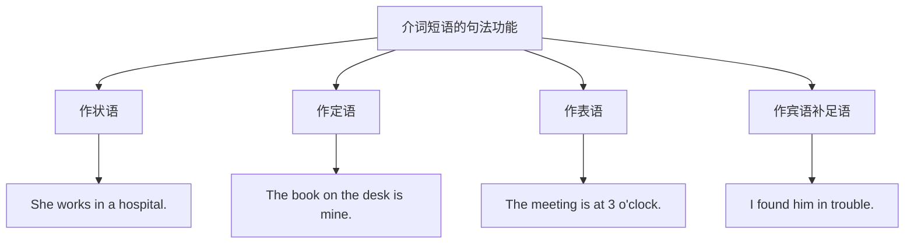
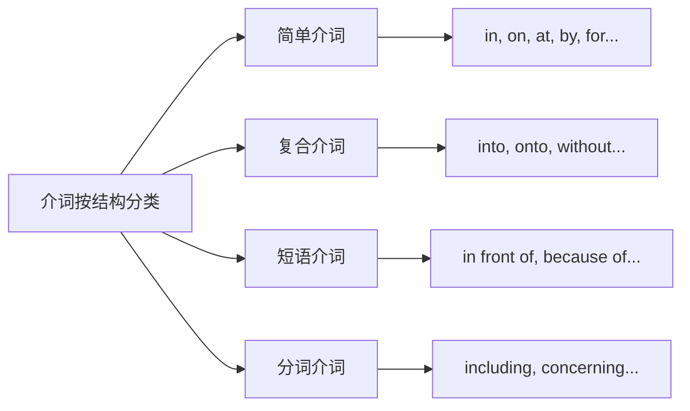
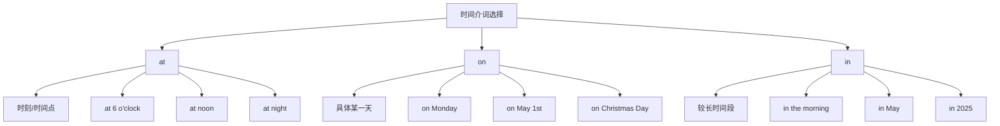
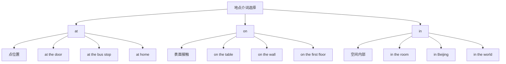
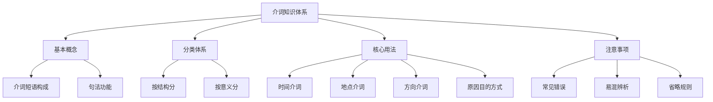

# 介词的分类与基本用法

> [!info] 学习目标
>
> 通过本章学习，你将掌握：
> - 理解介词的本质和句法功能
> - 掌握介词的分类体系
> - 熟练运用时间介词 at/on/in 等
> - 正确使用地点介词和方向介词
> - 了解原因、目的、方式等介词的用法
> - 避免介词使用中的常见错误

介词（Preposition）是英语中最常用但也最容易出错的词类之一。它虽然是"小词"，却承担着连接句子各成分、表达复杂语义关系的重任。一个介词用错，整个句子的意思可能完全改变。本章将系统介绍介词的分类与基本用法，帮助你建立清晰的介词知识框架。

---

## 1. 介词概述

### 1.1 什么是介词

介词（Preposition）是一种虚词，本身没有完整的词汇意义，必须与名词、代词或相当于名词的其他词语（如动名词）构成**介词短语**（Prepositional Phrase），才能在句中发挥作用。

> [!tip] 名称由来
>
> Preposition 由 pre-（在...之前）+ position（位置）构成，字面意思是"放在前面的词"。介词通常放在名词或代词之前，形成介词短语。

**介词的核心特点**：

| 特点 | 说明 | 例证 |
| --- | --- | --- |
| 位置固定 | 通常位于名词/代词之前 | **in** the room |
| 不能单独使用 | 必须与宾语构成短语 | ❌ I live in. ✅ I live in Beijing. |
| 无词形变化 | 没有时态、数、格的变化 | in → in（始终不变）|
| 表达关系 | 表示时间、地点、方式等关系 | at 6 o'clock（时间）|

### 1.2 介词短语的构成

介词短语的基本结构是：

```
介词 + 宾语（名词/代词/动名词/从句）
```

**各类宾语示例**：

```
介词 + 名词：in the morning（在早上）
介词 + 代词：with her（和她一起）
介词 + 动名词：by studying hard（通过努力学习）
介词 + 从句：except that he was late（除了他迟到了）
```

> [!warning] 注意事项
>
> 介词后的代词必须用**宾格**形式：
> - ✅ between you and **me**（在你我之间）
> - ❌ between you and **I**

### 1.3 介词短语的句法功能

介词短语在句中可以充当多种成分：



**作状语**（最常见）：

修饰动词、形容词或整个句子，表示时间、地点、方式、原因等。

```
He arrived at noon.
他中午到达。
[at noon 作时间状语，修饰动词 arrived]

She spoke with confidence.
她自信地讲话。
[with confidence 作方式状语，修饰动词 spoke]
```

**作定语**（后置定语）：

修饰名词，相当于形容词的功能。

```
The girl in red is my sister.
穿红衣服的女孩是我姐姐。
[in red 作后置定语，修饰 the girl]

The road to success is long.
通往成功的道路很漫长。
[to success 作后置定语，修饰 the road]
```

**作表语**：

位于系动词后，说明主语的特征或状态。

```
The cat is under the table.
猫在桌子下面。
[under the table 作表语，说明 cat 的位置]

He seems in good health.
他看起来身体很好。
[in good health 作表语，说明 he 的状态]
```

**作宾语补足语**：

补充说明宾语的状态、身份或位置。

```
They elected him as chairman.
他们选他当主席。
[as chairman 作宾补，补充说明 him 的身份]

I saw her in the garden.
我看见她在花园里。
[in the garden 作宾补，补充说明 her 的位置]
```

---

## 2. 介词的分类体系

英语介词可以按照不同标准进行分类：

### 2.1 按结构分类



**简单介词**（Simple Prepositions）：

由单个单词构成的介词，是英语中最基本、最常用的介词。

| 介词 | 基本含义 | 例句 |
| --- | --- | --- |
| in | 在...里面 | in the box |
| on | 在...上面 | on the table |
| at | 在（某点）| at the door |
| by | 通过；在旁边 | by bus; by the river |
| for | 为了；达... | for you; for two hours |
| with | 和...一起 | with friends |
| from | 从... | from China |
| to | 到...；向... | to school |
| of | ...的 | a cup of tea |
| about | 关于 | about the project |

**复合介词**（Compound Prepositions）：

由两个词合成的介词。

| 复合介词 | 构成 | 含义 | 例句 |
| --- | --- | --- | --- |
| into | in + to | 进入 | go into the room |
| onto | on + to | 到...上 | jump onto the stage |
| within | with + in | 在...之内 | within a week |
| without | with + out | 没有 | without help |
| throughout | through + out | 贯穿；遍及 | throughout the year |
| upon | up + on | 在...上 | upon the hill |

**短语介词**（Phrasal Prepositions）：

由多个词构成、整体作为介词使用的固定搭配。

| 短语介词 | 含义 | 例句 |
| --- | --- | --- |
| in front of | 在...前面 | in front of the building |
| in spite of | 尽管 | in spite of the rain |
| because of | 因为 | because of his help |
| instead of | 代替；而不是 | instead of coffee |
| according to | 根据 | according to the news |
| as for | 至于 | as for me |
| by means of | 通过 | by means of technology |
| on behalf of | 代表 | on behalf of the company |
| with regard to | 关于 | with regard to this matter |
| in addition to | 除...之外（还有）| in addition to English |

**分词介词**（Participle Prepositions）：

由动词的现在分词或过去分词转化而来的介词。

| 分词介词 | 含义 | 例句 |
| --- | --- | --- |
| including | 包括 | everyone including Tom |
| excluding | 不包括 | the price excluding tax |
| concerning | 关于 | information concerning safety |
| regarding | 关于 | questions regarding your application |
| considering | 考虑到 | considering the circumstances |
| given | 考虑到；鉴于 | given his experience |
| following | 在...之后 | following the meeting |
| pending | 在等待...期间 | pending his arrival |

### 2.2 按意义分类

这是最实用的分类方式，按照介词所表达的语义关系进行分类：

| 类别 | 主要介词 | 表达关系 |
| --- | --- | --- |
| 时间介词 | at, on, in, during, for, since, until... | 时间点/段/期限 |
| 地点介词 | at, on, in, under, above, behind, beside... | 空间位置 |
| 方向介词 | to, into, onto, towards, through, across... | 移动方向 |
| 原因介词 | because of, due to, owing to, for... | 原因理由 |
| 目的介词 | for, to, in order to... | 目的意图 |
| 方式介词 | by, with, in, through... | 方式手段 |
| 比较介词 | like, as, than... | 比较对照 |

> [!tip] 学习建议
>
> 按意义分类学习介词最为高效，因为：
> 1. 便于理解同类介词之间的区别
> 2. 方便记忆介词的核心用法
> 3. 有助于在写作中正确选词

---

## 3. 时间介词

时间介词是使用频率最高的介词类别之一。掌握时间介词的关键在于理解它们各自适用的时间范围和语境。

### 3.1 at/on/in 的时间用法

这三个介词在表示时间时有明确的分工：



#### at：用于时刻和时间点

**at 表示精确的时间点**，包括钟点、用餐时间、某些特定时刻等。

```
at 7:30（在7点30分）
at noon（在中午）
at midnight（在午夜）
at dawn（在黎明）
at dusk（在黄昏）
at sunrise（在日出时）
at sunset（在日落时）
at lunchtime（在午餐时间）
at the moment（此刻）
at present（目前）
at that time（在那时）
```

**例句分析**：

```
I wake up at 6 o'clock every morning.
我每天早上6点醒来。
[at 6 o'clock 表示精确的钟点时间]

The meeting starts at noon.
会议中午开始。
[at noon 表示一天中的特定时刻]

At that moment, she realized her mistake.
就在那一刻，她意识到了自己的错误。
[at that moment 表示特定的时间点]
```

> [!warning] 特殊用法：at night
>
> 虽然 night 是一个时间段，但英语中习惯用 **at night**，而不是 in night：
> - ✅ I often read at night.（我经常晚上读书。）
> - ❌ I often read in night.
>
> 但如果 night 前有修饰语，则用 on：
> - on Monday night（周一晚上）
> - on a cold winter night（在一个寒冷的冬夜）

#### on：用于具体的某一天

**on 表示特定的日期、星期、节日（具体某天）**。

```
on Monday（在周一）
on Friday afternoon（在周五下午）
on May 1st（在5月1日）
on July 4, 2025（在2025年7月4日）
on Christmas Day（在圣诞节那天）
on New Year's Eve（在新年前夜）
on my birthday（在我生日那天）
on the morning of May 5th（在5月5日早上）
on a rainy day（在一个下雨天）
```

**例句分析**：

```
The shop is closed on Sundays.
这家店周日不营业。
[on Sundays 表示每个星期天]

She was born on October 15, 1990.
她出生于1990年10月15日。
[on October 15, 1990 表示具体的日期]

We'll have a party on Christmas Eve.
我们将在圣诞前夜举办派对。
[on Christmas Eve 表示特定的节日之夜]
```

> [!tip] 星期 + 时间段的搭配
>
> 当星期与时间段（morning/afternoon/evening）连用时，用 on：
> - on Monday morning（周一早上）
> - on Friday evening（周五晚上）
> - on Saturday afternoon（周六下午）

#### in：用于较长的时间段

**in 表示月份、季节、年份、世纪以及一天中的某个时段（除 night 外）**。

```
in the morning（在早上）
in the afternoon（在下午）
in the evening（在晚上）
in January（在一月）
in spring（在春天）
in summer（在夏天）
in 2025（在2025年）
in the 21st century（在21世纪）
in the 1990s（在20世纪90年代）
in ancient times（在古代）
```

**例句分析**：

```
I usually exercise in the morning.
我通常早上锻炼。
[in the morning 表示一天中的早晨时段]

It often snows in winter here.
这里冬天经常下雪。
[in winter 表示一年中的冬季]

He started his business in 2010.
他于2010年创业。
[in 2010 表示某一年份]
```

**in 表示"在...之后"（将来时间）**：

```
The train will arrive in 10 minutes.
火车将在10分钟后到达。
[in 10 minutes 表示从现在起10分钟后]

She'll be back in a week.
她一周后回来。
[in a week 表示从现在起一周后]
```

> [!warning] in vs. after 表示将来
>
> - **in + 时间段**：从现在算起（常用于将来时）
>   - I'll call you **in** an hour.（一小时后我给你打电话。）
> - **after + 时间段**：从过去某时算起（常用于过去时）
>   - He came back **after** three days.（他三天后回来了。）

### 3.2 at/on/in 时间用法对比表

| 用法 | at | on | in |
| --- | --- | --- | --- |
| 时刻 | ✅ at 3 p.m. | ❌ | ❌ |
| 周几 | ❌ | ✅ on Monday | ❌ |
| 日期 | ❌ | ✅ on May 1st | ❌ |
| 早/下午/晚 | ❌ | ❌ | ✅ in the morning |
| 夜晚 | ✅ at night | ✅ on Monday night | ❌ |
| 月份 | ❌ | ❌ | ✅ in July |
| 季节 | ❌ | ❌ | ✅ in summer |
| 年份 | ❌ | ❌ | ✅ in 2025 |
| 世纪 | ❌ | ❌ | ✅ in the 20th century |

### 3.3 during/for/since/until

#### during：在...期间

**during 表示"在某段时间内"**，强调动作发生在某时间段的过程中。

```
during the meeting（会议期间）
during the summer vacation（暑假期间）
during my stay in Beijing（我在北京逗留期间）
during the war（战争期间）
```

**例句**：

```
Don't talk during the class.
上课时不要说话。
[during the class 表示整个上课期间]

I visited many places during my trip to Japan.
我在日本旅行期间参观了很多地方。
[during my trip 强调旅行这段时间内]
```

> [!warning] during vs. for
>
> - **during** + 特定时间段名词（强调"在...期间"）
>   - during the meeting（会议期间）
> - **for** + 时间长度（强调"持续多久"）
>   - for two hours（持续两小时）
>
> 比较：
> - I slept **during** the movie.（电影放映期间我睡着了。）
> - I slept **for** two hours.（我睡了两小时。）

#### for：持续...时间

**for 表示动作持续的时间长度**，回答 "How long?" 的问题。

```
for two hours（两小时）
for three days（三天）
for a long time（很长时间）
for years（很多年）
for ever（永远）
```

**例句**：

```
I have lived here for ten years.
我在这里住了十年了。
[for ten years 表示住的时间长度]

She waited for him for two hours.
她等了他两个小时。
[for two hours 强调等待的持续时间]
```

#### since：自从...以来

**since 表示"从过去某时一直到现在"**，常与完成时态连用。

```
since 2010（自2010年以来）
since Monday（自周一以来）
since childhood（自童年以来）
since then（从那以后）
```

**例句**：

```
I have known her since 2015.
我从2015年就认识她了。
[since 2015 表示从2015年到现在]

He has been ill since last week.
他从上周就病了。
[since last week 表示从上周到现在的持续状态]
```

> [!tip] since 后的时间点
>
> since 后通常接：
> - 具体时间点：since 8 o'clock, since May, since 2020
> - 过去某事件：since I came here, since the war ended
> - 时间副词：since then, since when

#### until/till：直到...为止

**until (till) 表示动作持续到某时结束**。

```
until 6 o'clock（直到6点）
until tomorrow（直到明天）
until next week（直到下周）
until the end（直到最后）
```

**例句**：

```
I'll wait until 5 o'clock.
我会等到5点。
[until 5 o'clock 表示等待的终止时间]

The shop is open until 10 p.m.
这家店营业到晚上10点。
[until 10 p.m. 表示营业的结束时间]
```

**not...until/till 表示"直到...才"**：

```
He didn't come back until midnight.
他直到午夜才回来。
[not...until midnight 强调很晚才发生]

I didn't know the truth until yesterday.
我直到昨天才知道真相。
```

### 3.4 before/after/by

#### before：在...之前

```
before noon（中午之前）
before the meeting（会议之前）
before 2020（2020年之前）
```

**例句**：

```
Please finish your homework before dinner.
请在晚饭前完成作业。

I had never seen snow before I came to Beijing.
在来北京之前，我从没见过雪。
```

#### after：在...之后

```
after lunch（午饭后）
after the exam（考试之后）
after 6 o'clock（6点之后）
```

**例句**：

```
Let's go for a walk after dinner.
晚饭后我们去散步吧。

She left after the meeting ended.
会议结束后她就离开了。
```

#### by：不迟于；到...为止

**by 强调"不迟于某时"，常表示截止时间**。

```
by 5 o'clock（到5点为止/5点之前）
by the end of the month（到月底为止）
by tomorrow（到明天为止）
```

**例句**：

```
Please submit your report by Friday.
请在周五之前提交报告。
[by Friday 强调截止日期]

By the time I arrived, the party had ended.
我到达时，聚会已经结束了。
[by the time 引导时间状语从句]
```

> [!warning] by vs. before
>
> - **by**：强调"不迟于"，截止时间点
>   - by 5 o'clock（可以是5点，也可以更早，但不能更晚）
> - **before**：强调"在...之前"，不包含该时间点
>   - before 5 o'clock（5点之前，不包括5点）

---

## 4. 地点介词

地点介词用于表示人或物在空间中的位置关系。

### 4.1 at/on/in 的地点用法

这三个介词在表示地点时同样有分工：



#### at：表示点位置

**at 用于表示较小的、具体的点位置**，把地点视为一个"点"。

```
at the door（在门口）
at the bus stop（在公交站）
at the corner（在拐角处）
at home（在家）
at school（在学校）
at work（在工作）
at the airport（在机场）
at the station（在车站）
at the top/bottom（在顶部/底部）
```

**例句**：

```
I'll meet you at the entrance.
我在入口处等你。
[at the entrance 表示一个具体的点]

She's waiting at the bus stop.
她在公交站等着。
[at the bus stop 把车站视为一个点]
```

#### on：表示接触表面

**on 表示在某物的表面上，强调接触关系**。

```
on the table（在桌子上）
on the wall（在墙上）
on the floor（在地板上）
on the ceiling（在天花板上）
on the first floor（在一楼）
on the left/right（在左边/右边）
on the coast（在海岸上）
on the island（在岛上）
```

**例句**：

```
There's a book on the desk.
桌子上有一本书。
[on the desk 表示书与桌子表面接触]

The picture is hanging on the wall.
画挂在墙上。
[on the wall 表示画与墙面接触]

He lives on the third floor.
他住在三楼。
[on the third floor 表示在某一楼层]
```

> [!tip] 交通工具与 on
>
> 对于较大的公共交通工具，用 on：
> - on the bus（在公交车上）
> - on the train（在火车上）
> - on the plane（在飞机上）
> - on the ship（在船上）
>
> 但小型私人交通工具用 in：
> - in the car（在小汽车里）
> - in the taxi（在出租车里）

#### in：表示在空间内部

**in 表示在某个三维空间的内部**。

```
in the room（在房间里）
in the box（在盒子里）
in the water（在水里）
in the sky（在天空中）
in Beijing（在北京）
in China（在中国）
in the world（在世界上）
in the newspaper（在报纸上）
```

**例句**：

```
The keys are in my pocket.
钥匙在我口袋里。
[in my pocket 表示在口袋这个空间内]

He lives in London.
他住在伦敦。
[in London 表示在伦敦这个城市范围内]

I read it in the newspaper.
我在报纸上看到的。
[in the newspaper 强调内容在报纸"里面"]
```

### 4.2 at/on/in 地点用法对比

| 地点类型 | at | on | in |
| --- | --- | --- | --- |
| 门、入口 | ✅ at the door | ❌ | ❌ |
| 桌面 | ❌ | ✅ on the table | ❌ |
| 房间 | ❌ | ❌ | ✅ in the room |
| 楼层 | ❌ | ✅ on the 2nd floor | ❌ |
| 小地点 | ✅ at the station | ❌ | ✅ in the station |
| 城市/国家 | ❌ | ❌ | ✅ in Paris |
| 街道 | ❌ | ✅ on Main Street | ✅ in the street |
| 角落 | ✅ at the corner | ✅ on the corner | ✅ in the corner |

> [!info] corner 的介词选择
>
> - **at the corner**：在街道的拐角处（外角）
> - **on the corner**：在某物的角上
> - **in the corner**：在房间等空间的角落（内角）

### 4.3 表示方位的介词

#### above/over：在...上方

**above** 表示"在...上方"，不一定正上方，强调位置高于某物。

```
The plane flew above the clouds.
飞机飞在云层上方。

The temperature is above zero.
气温在零度以上。
```

**over** 表示"在...正上方"，常暗示覆盖或越过。

```
There's a bridge over the river.
河上有一座桥。
[over 表示桥跨越河流正上方]

She put a blanket over the baby.
她给婴儿盖上毯子。
[over 表示覆盖]
```

> [!warning] above vs. over
>
> - **above**：泛指"高于"，不一定是正上方
>   - The sun rose above the horizon.（太阳升到地平线上方。）
> - **over**：强调"正上方"，有时含"覆盖、越过"之意
>   - He jumped over the fence.（他跳过了栅栏。）

#### below/under：在...下方

**below** 表示"在...下方"，与 above 相对。

```
The valley is below sea level.
这个山谷在海平面以下。

Please see the notes below.
请看下面的注释。
```

**under** 表示"在...正下方"，与 over 相对。

```
The cat is sleeping under the table.
猫在桌子下面睡觉。
[under 表示正下方]

Children under 12 can enter free.
12岁以下的儿童可以免费进入。
[under 表示低于某个数值]
```

#### beside/by/near/next to：在...旁边

| 介词 | 含义 | 例句 |
| --- | --- | --- |
| beside | 在...旁边（紧挨着）| She sat beside me. |
| by | 在...旁边；靠近 | a house by the river |
| near | 在...附近 | near the station |
| next to | 紧挨着 | next to the bank |

```
Come and sit beside me.
来坐在我旁边。

He lives by the sea.
他住在海边。

Is there a bank near here?
这附近有银行吗？

The post office is next to the supermarket.
邮局紧挨着超市。
```

#### between/among：在...之间

**between** 表示"在两者之间"。

```
The book is between the lamp and the clock.
书在台灯和钟之间。

There's a secret between you and me.
这是你我之间的秘密。
```

**among** 表示"在三者或三者以上之间"。

```
He is popular among his classmates.
他在同学中很受欢迎。

The house is hidden among the trees.
房子隐藏在树丛中。
```

> [!tip] between 用于三者以上的情况
>
> 当强调"每两两之间"的关系时，即使涉及三者以上，也用 between：
> - The agreement was signed between the three countries.
>   （这项协议由三国签署。）[强调三国两两之间的协议关系]

#### in front of/behind：在...前面/后面

```
There's a garden in front of the house.
房子前面有一个花园。

The parking lot is behind the building.
停车场在大楼后面。

Don't stand in front of the TV.
不要站在电视机前面。
```

> [!warning] in front of vs. in the front of
>
> - **in front of**：在某物的外部前面
>   - There's a tree in front of the house.（房子前面有一棵树——树在房子外面）
> - **in the front of**：在某物的内部前面
>   - The teacher stands in the front of the classroom.（老师站在教室的前面——在教室内部）

#### opposite：在...对面

```
The bank is opposite the post office.
银行在邮局对面。

She sat opposite me at the dinner table.
她在餐桌对面坐着。
```

---

## 5. 方向介词

方向介词表示人或物体移动的方向和路径。

### 5.1 to/towards：向...

**to** 表示移动的目的地，强调到达。

```
go to school（去学校）
fly to Paris（飞往巴黎）
send a letter to her（给她寄信）
```

**towards (toward)** 表示移动的方向，不一定到达。

```
He walked towards the door.
他朝门走去。
[towards 只表示方向，不一定走到门口]

She ran towards me.
她朝我跑过来。
```

> [!tip] to vs. towards
>
> - **to** = 朝...并到达
>   - I went to the park.（我去了公园——到达了）
> - **towards** = 朝...的方向
>   - I walked towards the park.（我朝公园走去——可能没到）

### 5.2 into/onto：进入/到...上

**into** 表示从外部进入内部。

```
She walked into the room.
她走进房间。

He jumped into the water.
他跳入水中。

Put the books into the box.
把书放进盒子里。
```

**onto** 表示移动到某物表面上。

```
The cat jumped onto the table.
猫跳上了桌子。

She climbed onto the roof.
她爬上了屋顶。
```

> [!info] into/onto vs. in/on
>
> - **in/on**：表示静止状态
>   - The book is in the box.（书在盒子里——静态）
>   - The cat is on the table.（猫在桌子上——静态）
> - **into/onto**：表示移动过程
>   - I put the book into the box.（我把书放进盒子——动态）
>   - The cat jumped onto the table.（猫跳上桌子——动态）

### 5.3 out of/off：从...出来/从...离开

**out of** 表示从内部出来。

```
She walked out of the room.
她从房间里走出来。

He took a pen out of his pocket.
他从口袋里掏出一支笔。

We ran out of time.
我们时间用完了。
```

**off** 表示从表面离开。

```
He fell off the ladder.
他从梯子上摔下来。

Take your feet off the table.
把脚从桌子上拿下来。

The plane took off at 8 a.m.
飞机早上8点起飞。
```

### 5.4 through/across/over：穿过

这三个介词都可表示"穿过"，但有区别：

| 介词 | 穿过方式 | 例句 |
| --- | --- | --- |
| through | 从内部穿过（隧道、人群）| through the tunnel |
| across | 从表面穿过（马路、河流）| across the street |
| over | 从上方越过（栅栏、山）| over the fence |

```
We drove through the tunnel.
我们开车穿过隧道。
[through 强调从隧道内部通过]

She walked across the street.
她穿过马路。
[across 强调从街道表面横穿]

The bird flew over the mountain.
鸟飞过山顶。
[over 强调从山的上方飞过]
```

### 5.5 along/around/past：沿着/绕过/经过

**along** 表示沿着。

```
We walked along the river.
我们沿着河边走。

There are trees along the road.
路两旁有树。
```

**around (round)** 表示围绕、绕着。

```
The earth moves around the sun.
地球围绕太阳运转。

Let's take a walk around the park.
我们绑公园走走吧。
```

**past** 表示经过（某处）。

```
He walked past me without saying hello.
他走过我身边，没打招呼。

Go past the bank and turn left.
经过银行后左转。
```

### 5.6 up/down：向上/向下

**up** 表示向上的方向。

```
He climbed up the stairs.
他爬上楼梯。

The price went up.
价格上涨了。
```

**down** 表示向下的方向。

```
She ran down the hill.
她从山上跑下来。

The sun went down.
太阳落山了。
```

---

## 6. 原因、目的与方式介词

### 6.1 原因介词

#### because of：因为

**because of** 是最常用的原因介词短语。

```
The match was cancelled because of the rain.
比赛因雨取消了。

She was late because of the traffic.
她因为交通拥堵而迟到。
```

> [!warning] because of vs. because
>
> - **because of** + 名词/动名词（介词短语）
>   - because of the rain
> - **because** + 从句（连词）
>   - because it rained

#### due to：由于

```
The delay was due to bad weather.
延误是由于恶劣天气。

Due to his illness, he couldn't come.
由于生病，他没能来。
```

#### owing to：由于

```
Owing to the snow, all flights were delayed.
由于下雪，所有航班都延误了。
```

#### for：因为（正式）

```
The city is famous for its beautiful scenery.
这座城市以美丽的风景闻名。

He was punished for being late.
他因迟到受到惩罚。
```

#### from：由于（身体/精神状态）

```
She's suffering from a cold.
她感冒了。

He died from his injuries.
他因伤势过重而死亡。
```

### 6.2 目的介词

#### for：为了

```
I bought flowers for my mother.
我给妈妈买了花。

What did you do that for?
你为什么那样做？

We study hard for a better future.
我们努力学习是为了更好的未来。
```

#### to：为了（不定式用法）

```
I came here to learn English.
我来这里是为了学英语。

He works hard to support his family.
他努力工作来养家。
```

### 6.3 方式介词

#### by：通过（方式/手段）

```
by bus（乘公交车）
by air（乘飞机）
by train（乘火车）
by email（通过邮件）
by phone（通过电话）
by hand（手工地）
by accident（意外地）
by mistake（错误地）
by chance（偶然地）
```

**例句**：

```
I go to work by bus.
我乘公交车上班。

She contacted me by email.
她通过邮件联系我。

He broke the vase by accident.
他不小心打碎了花瓶。
```

> [!warning] by 与交通工具
>
> by + 交通工具时，交通工具前**不加冠词**：
> - ✅ by bus / by car / by train
> - ❌ by a bus / by the car
>
> 但用其他介词时需加冠词：
> - ✅ in a car / on the bus / on a train

#### with：用（工具/器具）

```
with a knife（用刀）
with a pen（用笔）
with both hands（用双手）
with care（小心地）
with pleasure（乐意地）
```

**例句**：

```
She cut the cake with a knife.
她用刀切蛋糕。

He wrote the letter with a pen.
他用笔写信。

Please handle it with care.
请小心处理。
```

> [!tip] by vs. with
>
> - **by**：强调方式、手段、途径
>   - by working hard（通过努力工作）
> - **with**：强调使用的工具、器具
>   - with a hammer（用锤子）

#### in：用（语言/材料/方式）

```
in English（用英语）
in pencil（用铅笔）
in ink（用墨水）
in a loud voice（大声地）
in this way（用这种方式）
```

**例句**：

```
Please write your name in English.
请用英语写你的名字。

She answered in a low voice.
她低声回答。

In this way, we can solve the problem.
用这种方式，我们可以解决问题。
```

---

## 7. 其他常用介词

### 7.1 about/on：关于

**about** 表示"关于"，语气较随意。

```
a book about animals（一本关于动物的书）
talk about the weather（谈论天气）
What's the movie about?（这部电影讲什么？）
```

**on** 表示"关于"（学术性、专业性话题）。

```
a lecture on history（一场关于历史的讲座）
a book on grammar（一本语法书）
an expert on economics（经济学专家）
```

> [!tip] about vs. on
>
> - **about**：一般性的"关于"，日常对话常用
> - **on**：专业、学术性的"关于"，正式场合更常用

### 7.2 with/without：有/没有

**with** 表示"有；带着；和...一起"。

```
a house with a garden（带花园的房子）
coffee with sugar（加糖的咖啡）
She came with her friend.（她和朋友一起来的。）
```

**without** 表示"没有；不带"。

```
coffee without sugar（不加糖的咖啡）
without any help（没有任何帮助）
I can't live without you.（没有你我活不下去。）
```

### 7.3 like/as：像/作为

**like** 表示"像...一样"（相似但不相同）。

```
She sings like a professional.
她唱歌像专业的一样。

He runs like the wind.
他跑起来像风一样快。
```

**as** 表示"作为；以...身份"。

```
She works as a teacher.
她当老师。

As a student, you should study hard.
作为学生，你应该努力学习。
```

> [!warning] like vs. as
>
> - **like**：像（比喻，实际不是）
>   - He runs like a rabbit.（他跑得像兔子——他不是兔子）
> - **as**：作为（实际身份）
>   - He works as a doctor.（他是医生——这是他的职业）

### 7.4 except/besides：除了

**except** 表示"除...之外（不包括）"。

```
Everyone passed the exam except Tom.
除了汤姆，大家都通过了考试。
[汤姆没通过]

I like all fruits except durian.
我喜欢所有水果，除了榴莲。
[不喜欢榴莲]
```

**besides** 表示"除...之外（还有）"。

```
Besides English, she also speaks French.
除了英语，她还会说法语。
[会英语也会法语]

Besides Tom, Mary also came to the party.
除了汤姆，玛丽也来参加派对了。
[汤姆来了，玛丽也来了]
```

> [!tip] except vs. besides
>
> - **except** = 不包括（排除）
> - **besides** = 另外还有（包括）
>
> 口诀：except 是"减法"，besides 是"加法"

---

## 8. 介词使用的常见错误

### 8.1 中式英语错误

由于中英文表达习惯不同，中国学生常犯以下介词错误：

| 错误表达 | 正确表达 | 中文意思 |
| --- | --- | --- |
| ❌ discuss about | ✅ discuss | 讨论 |
| ❌ enter into the room | ✅ enter the room | 进入房间 |
| ❌ marry with sb | ✅ marry sb | 和某人结婚 |
| ❌ return back | ✅ return | 返回 |
| ❌ reply him | ✅ reply to him | 回复他 |
| ❌ listen the music | ✅ listen to the music | 听音乐 |
| ❌ arrive the station | ✅ arrive at the station | 到达车站 |

### 8.2 易混介词辨析

| 易混介词 | 区别 | 例句 |
| --- | --- | --- |
| in time / on time | in time（及时）/ on time（准时）| We arrived just in time. / The train is on time. |
| at the end / in the end | at the end（在末端）/ in the end（最后）| at the end of the road / In the end, we won. |
| in the tree / on the tree | in the tree（外来物）/ on the tree（树上长的）| a bird in the tree / apples on the tree |
| in the wall / on the wall | in the wall（嵌入墙内）/ on the wall（挂在墙上）| a window in the wall / a picture on the wall |
| made of / made from | made of（看得出原料）/ made from（看不出原料）| made of wood / made from milk |

### 8.3 介词省略的情况

在某些情况下，介词可以或必须省略：

**时间状语前省略介词**：

```
I'll see you (on) next Monday.
（下周一见。）

She left (on) that day.
（她那天离开了。）

We stayed there (for) three days.
（我们在那里待了三天。）
```

**this/that/last/next/every 等词前通常省略介词**：

```
✅ this morning（今天早上）❌ in this morning
✅ last week（上周）❌ in last week
✅ next year（明年）❌ in next year
✅ every day（每天）❌ on every day
```

---

## 9. 本章小结



> [!success] 核心要点回顾
>
> **1. 介词的本质**
> - 介词是虚词，必须与宾语构成介词短语
> - 介词短语可作状语、定语、表语、宾补
>
> **2. 时间介词 at/on/in**
> - at：时刻、时间点（at 6 o'clock, at night）
> - on：具体某天（on Monday, on May 1st）
> - in：较长时间段（in the morning, in 2025）
>
> **3. 地点介词 at/on/in**
> - at：点位置（at the door, at home）
> - on：表面接触（on the table, on the wall）
> - in：空间内部（in the room, in Beijing）
>
> **4. 方向介词**
> - to（到达）vs. towards（方向）
> - into（进入）vs. onto（上到）
> - through（穿过内部）vs. across（穿过表面）vs. over（越过上方）
>
> **5. 学习建议**
> - 注意介词的搭配习惯
> - 避免中式英语错误
> - 通过大量例句理解介词的核心语义

---

## 10. 巩固练习

### 10.1 选择正确的介词

1. I usually get up ___ 7 o'clock.
   A. in  B. on  C. at  D. by

2. There is a map ___ the wall.
   A. in  B. on  C. at  D. by

3. He arrived ___ London yesterday.
   A. to  B. at  C. in  D. on

4. She walked ___ the room quietly.
   A. in  B. into  C. on  D. onto

5. The book was written ___ English.
   A. with  B. by  C. in  D. on

### 10.2 改正错误

1. We discussed about the problem for hours.
2. She married with a doctor last year.
3. I arrived the airport at 8 a.m.
4. Please listen the teacher carefully.
5. The meeting will be held in next Monday.

### 10.3 参考答案

**选择题答案**：
1. C (at 7 o'clock - 时刻用 at)
2. B (on the wall - 表面接触用 on)
3. C (in London - 大城市用 in)
4. B (into the room - 进入用 into)
5. C (in English - 用某种语言用 in)

**改错答案**：
1. discussed ~~about~~ → discussed
2. married ~~with~~ → married
3. arrived → arrived at
4. listen → listen to
5. ~~in~~ next Monday → next Monday

---

> [!quote] 学习提示
>
> 介词的学习重在积累和实践。建议：
> 1. 遇到新的介词搭配时，记录下来形成词汇本
> 2. 多读英文原版材料，培养介词语感
> 3. 写作时有意识地检查介词使用是否正确
> 4. 下一章我们将学习[[02.常用介词搭配详解|常用介词搭配详解]]，深入探讨 in/on/at、with/by/for 等介词的具体辨析
