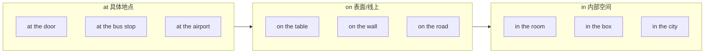
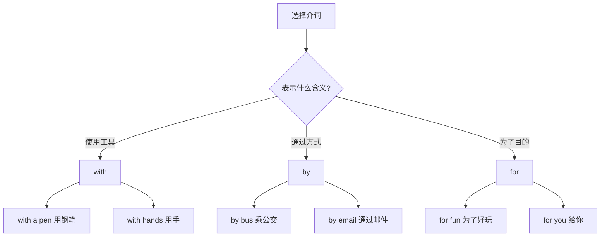
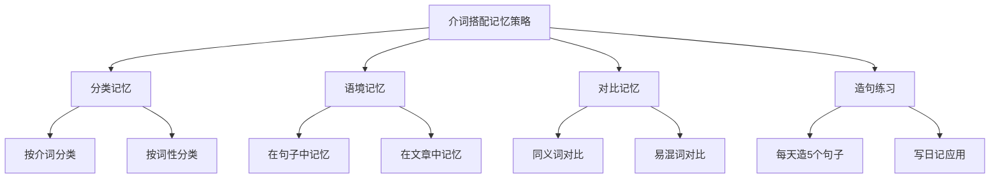

# 常用介词搭配详解

介词搭配是英语学习中的重点和难点之一。由于介词的含义往往抽象且多变，同一个介词在不同搭配中可能表达完全不同的意思。掌握常用的介词搭配，不仅能帮助我们准确表达意思，还能让我们的英语表达更加地道自然。

本章将系统讲解英语中最常用的介词搭配，从时间地点介词的辨析入手，逐步深入到方式手段介词的区别，最后全面介绍介词与动词、形容词、名词的固定搭配。

---

## 1. 时间地点介词 in/on/at 辨析

in、on、at 是英语中使用频率最高的三个介词，它们既可以表示时间，也可以表示地点。正确区分这三个介词的用法，是掌握介词搭配的第一步。

### 1.1 表示时间的 in/on/at

这三个介词在表示时间时，遵循一个基本规律：**at 用于具体时刻，on 用于具体日期，in 用于较长时间段**。

> [!tip] 时间范围记忆法
>
> 可以把时间想象成一个容器：
> - **at** 表示一个"点"（时刻、瞬间）
> - **on** 表示一个"面"（特定的一天）
> - **in** 表示一个"空间"（较长的时间段）

#### 1.1.1 at 表示具体时刻

at 用于表示具体的钟点时间、用餐时间、以及某些固定的时间表达。

**用于钟点时间**：

```
at 7 o'clock        在七点钟
at 8:30 a.m.        在上午八点半
at noon             在中午
at midnight         在午夜
at dawn             在黎明
at dusk             在黄昏
```

**例句分析**：

| 英文例句 | 中文翻译 | 句法分析 |
| --- | --- | --- |
| The meeting starts **at 9 o'clock**. | 会议九点钟开始。 | at + 具体钟点，表示精确时刻 |
| I usually wake up **at dawn**. | 我通常在黎明时醒来。 | at + 一天中的特定时刻 |
| The train arrives **at 10:15 p.m.** | 火车晚上十点一刻到达。 | at + 精确的分钟时间 |

**用于用餐时间和节日**：

```
at breakfast         在早餐时
at lunch             在午餐时
at dinner            在晚餐时
at Christmas         在圣诞节
at Easter            在复活节
at the weekend       在周末（英式英语）
```

> [!warning] 英美差异
>
> 表示"在周末"：
> - 英式英语：**at the weekend** 或 **at weekends**
> - 美式英语：**on the weekend** 或 **on weekends**

**用于年龄表达**：

```
at the age of 18     在18岁时
at 25               在25岁时
```

**例句**：

- She got married **at the age of 25**.（她25岁时结婚了。）
- He started his business **at 30**.（他30岁时开始创业。）

#### 1.1.2 on 用于具体日期

on 用于表示星期几、具体日期、特定的某一天。

**用于星期几**：

```
on Monday            在星期一
on Tuesday morning   在星期二早上
on Friday night      在星期五晚上
on weekdays          在工作日
```

**用于具体日期**：

```
on January 1st             在一月一日
on December 25, 2025       在2025年12月25日
on my birthday             在我生日那天
on the first day of May    在五月一日
```

**用于特定的某一天**：

```
on New Year's Day          在元旦
on Christmas Day           在圣诞节那天
on Independence Day        在独立日
on a rainy day             在一个雨天
on that day                在那一天
```

**例句分析**：

| 英文例句 | 中文翻译 | 句法分析 |
| --- | --- | --- |
| I was born **on March 15, 1990**. | 我出生于1990年3月15日。 | on + 完整日期 |
| We have a meeting **on Monday morning**. | 我们星期一早上有个会议。 | on + 星期 + 时段 |
| **On that cold winter night**, he left home. | 在那个寒冷的冬夜，他离开了家。 | on + 修饰语 + 特定的一天/夜 |

> [!info] 特殊情况
>
> 当 morning、afternoon、evening 前有修饰语时，介词要用 **on** 而不是 in：
> - in the morning（在早上）→ **on** Monday morning（在星期一早上）
> - in the evening（在晚上）→ **on** a cold evening（在一个寒冷的夜晚）

#### 1.1.3 in 用于较长时间段

in 用于表示月份、季节、年份、世纪、以及一天中的时段。

**用于月份和季节**：

```
in January           在一月
in spring            在春天
in summer            在夏天
in autumn/fall       在秋天
in winter            在冬天
```

**用于年份和世纪**：

```
in 2025              在2025年
in the 1990s         在20世纪90年代
in the 21st century  在21世纪
```

**用于一天中的时段**：

```
in the morning       在早上
in the afternoon     在下午
in the evening       在晚上
```

> [!warning] 注意 at night
>
> 表示"在晚上"时，要用 **at night**，而不是 "in the night"。
> - I study **in the evening**.（我晚上学习。）—— 指傍晚到睡前的时段
> - I can't sleep **at night**.（我晚上睡不着。）—— 指夜间

**用于表示"在…之后"**：

in 还可以表示"在一段时间之后"，常用于将来时态。

```
in five minutes      五分钟后
in two hours         两小时后
in a week            一周后
in three years       三年后
```

**例句**：

- The movie will start **in 10 minutes**.（电影将在10分钟后开始。）
- He will be back **in a month**.（他一个月后会回来。）

#### 1.1.4 时间介词的特殊用法

**不用介词的情况**：

当时间名词前有 this、that、last、next、every、each 等词修饰时，不需要介词。

| 错误用法 | 正确用法 | 中文翻译 |
| --- | --- | --- |
| ~~on this Monday~~ | this Monday | 这个星期一 |
| ~~in last year~~ | last year | 去年 |
| ~~on next Friday~~ | next Friday | 下周五 |
| ~~in every month~~ | every month | 每个月 |

**例句**：

- I will visit you **next week**.（我下周会来看你。）
- She called me **last night**.（她昨晚给我打电话了。）

### 1.2 表示地点的 in/on/at

这三个介词在表示地点时，遵循的基本规律是：**at 用于具体地点，on 用于表面或线上，in 用于内部空间**。



#### 1.2.1 at 表示具体地点

at 表示在某个具体的点或位置，强调的是一个相对较小的、精确的地点。

**用于具体位置**：

```
at the door          在门口
at the bus stop      在公交车站
at the corner        在拐角处
at the entrance      在入口处
at the top           在顶部
at the bottom        在底部
```

**用于某人的住所或工作地点**：

```
at home              在家
at school            在学校
at work              在工作
at the office        在办公室
at the hospital      在医院
```

**用于活动场所**：

```
at the party         在派对上
at the concert       在音乐会上
at the meeting       在会议上
```

**例句分析**：

| 英文例句 | 中文翻译 | 句法分析 |
| --- | --- | --- |
| He is waiting **at the gate**. | 他在大门口等着。 | at + 具体的点位置 |
| I met her **at a party**. | 我在一个派对上遇见了她。 | at + 活动场合 |
| She works **at a bank**. | 她在银行工作。 | at + 工作单位（作为地点） |

#### 1.2.2 on 表示表面或线上

on 表示在某物的表面上，或在某条线（如道路、河流、边界）上。

**用于表面**：

```
on the table         在桌子上
on the wall          在墙上
on the floor         在地板上
on the ceiling       在天花板上
on the page          在页面上
```

**用于道路和交通**：

```
on the road          在路上
on the street        在街上
on the highway       在高速公路上
on the bus           在公交车上
on the train         在火车上
on the plane         在飞机上
```

> [!tip] 交通工具介词选择
>
> - 大型交通工具（公交、火车、飞机、轮船）用 **on**：on the bus, on the train
> - 小型交通工具（小汽车、出租车）用 **in**：in the car, in a taxi
> - 步行或骑行用 **on**：on foot, on a bike, on horseback

**用于楼层**：

```
on the first floor   在一楼
on the ground floor  在底层（英式）
on the top floor     在顶层
```

**例句分析**：

| 英文例句 | 中文翻译 | 句法分析 |
| --- | --- | --- |
| The book is **on the desk**. | 书在桌子上。 | on + 物体表面 |
| I live **on the fifth floor**. | 我住在五楼。 | on + 楼层 |
| We traveled **on the train**. | 我们乘火车旅行。 | on + 大型交通工具 |

#### 1.2.3 in 表示内部空间

in 表示在某个封闭或半封闭的空间内部，强调被包围或包含的状态。

**用于封闭空间**：

```
in the room          在房间里
in the box           在盒子里
in the drawer        在抽屉里
in the bag           在包里
in the water         在水中
```

**用于地理位置**：

```
in the city          在城市里
in the country       在乡村/在国内
in Beijing           在北京
in China             在中国
in Asia              在亚洲
```

**用于书籍、报纸等**：

```
in the book          在书中
in the newspaper     在报纸上
in the magazine      在杂志里
```

> [!info] in 与 on 的区别
>
> 表示"在报纸上"时：
> - **in the newspaper** 强调内容在报纸里面（作为一篇文章）
> - **on the newspaper** 强调物理上放在报纸表面
>
> 例句：
> - I read it **in the newspaper**.（我在报纸上读到的。）—— 指文章内容
> - The cup is **on the newspaper**.（杯子放在报纸上。）—— 指物理位置

**例句分析**：

| 英文例句 | 中文翻译 | 句法分析 |
| --- | --- | --- |
| She is **in the kitchen**. | 她在厨房里。 | in + 封闭空间 |
| I was born **in Shanghai**. | 我出生在上海。 | in + 城市 |
| He found it **in the book**. | 他在书中找到了它。 | in + 书籍（内容） |

#### 1.2.4 地点介词的对比练习

以下是一些容易混淆的地点介词用法对比：

| 搭配 | 含义 | 例句 |
| --- | --- | --- |
| **at the hospital** | 在医院（探望、工作等） | He works at the hospital. |
| **in the hospital** | 在医院里（住院） | She is in the hospital. |
| **at school** | 在上学（强调状态） | The children are at school. |
| **in the school** | 在学校里面（物理位置） | There's a library in the school. |
| **at the door** | 在门口（外面） | Someone is at the door. |
| **in the doorway** | 在门道里（门框之间） | He stood in the doorway. |

---

## 2. 方式手段介词 with/by/for 辨析

with、by、for 这三个介词在表示方式、手段、原因等方面有各自的用法，容易混淆。本节将详细辨析它们的区别。

### 2.1 with 的用法

with 是一个多义介词，主要表示"用（工具）"、"和…一起"、"带有"等含义。

#### 2.1.1 表示使用工具或手段

with 用于表示使用具体的工具或身体部位来完成某事。

```
with a pen           用钢笔
with a knife         用刀
with my hands        用我的手
with care            小心地
with difficulty      困难地
```

**例句分析**：

| 英文例句 | 中文翻译 | 句法分析 |
| --- | --- | --- |
| She cut the bread **with a knife**. | 她用刀切面包。 | with + 具体工具 |
| He opened the door **with his left hand**. | 他用左手开了门。 | with + 身体部位 |
| Please handle this **with care**. | 请小心处理这个。 | with + 抽象名词（表方式） |

#### 2.1.2 表示伴随或带有

with 表示某人或某物具有某种特征、伴随某种状态。

```
a girl with long hair      一个长头发的女孩
a house with a garden      一栋带花园的房子
a man with glasses         一个戴眼镜的男人
```

**例句**：

- I want a room **with a view**.（我想要一间有风景的房间。）
- She is the woman **with red hair**.（她是那个红头发的女人。）

#### 2.1.3 表示"和…一起"

with 表示陪伴、一起做某事。

**例句**：

- I went to the movies **with my friends**.（我和朋友们一起去看电影了。）
- She lives **with her parents**.（她和父母住在一起。）

#### 2.1.4 表示原因或情感

with 可以表示由于某种情感或原因而导致的状态。

```
with joy             高兴地
with anger           愤怒地
with fear            恐惧地
tremble with cold    冷得发抖
shake with fear      吓得发抖
```

**例句**：

- Her eyes filled **with tears**.（她的眼睛充满了泪水。）
- He was trembling **with excitement**.（他激动得发抖。）

### 2.2 by 的用法

by 主要表示"通过（方式/手段）"、"靠近"、"在…之前"等含义。

#### 2.2.1 表示方式或手段

by 用于表示通过某种方式、方法或手段来完成某事，常用于抽象的方式。

**用于交通方式**：

```
by bus               乘公交车
by train             乘火车
by plane             乘飞机
by car               乘汽车
by bike              骑自行车
by sea               乘船
by air               乘飞机（航空）
```

> [!warning] 交通方式的介词区别
>
> - **by + 交通工具**（无冠词）：表示抽象的交通方式
>   - I go to work **by bus**.（我乘公交上班。）
> - **on/in + the/a + 交通工具**：表示具体的某辆交通工具
>   - I am **on the bus** now.（我现在在公交车上。）

**用于通讯方式**：

```
by phone             通过电话
by email             通过电子邮件
by letter            通过信件
by text              通过短信
```

**用于付款方式**：

```
by cash              用现金
by credit card       用信用卡
by check             用支票
```

**例句分析**：

| 英文例句 | 中文翻译 | 句法分析 |
| --- | --- | --- |
| I'll contact you **by email**. | 我会通过邮件联系你。 | by + 通讯方式 |
| She paid **by credit card**. | 她用信用卡付款。 | by + 付款方式 |
| We traveled **by train**. | 我们乘火车旅行。 | by + 交通方式 |

#### 2.2.2 表示动作执行者（被动语态）

在被动语态中，by 用于引出动作的执行者。

**例句**：

- The book was written **by J.K. Rowling**.（这本书是 J.K. 罗琳写的。）
- The window was broken **by a stone**.（窗户被一块石头打破了。）

#### 2.2.3 表示"靠近、在…旁边"

by 可以表示空间上的接近。

```
by the window        在窗户旁边
by the river         在河边
by my side           在我身边
```

**例句**：

- She sat **by the fire**.（她坐在火炉旁。）
- The hotel is **by the beach**.（酒店在海滩旁边。）

#### 2.2.4 表示时间"在…之前"

by 用于表示"不迟于某个时间点"。

```
by 5 o'clock         在五点之前
by tomorrow          在明天之前
by the end of        在…结束之前
```

**例句**：

- Please finish this **by Friday**.（请在周五之前完成这个。）
- I'll be back **by 6 p.m.**（我六点之前回来。）

### 2.3 for 的用法

for 主要表示"为了"、"因为"、"对于"、"持续（时间）"等含义。

#### 2.3.1 表示目的

for 用于表示做某事的目的或意图。

```
for dinner           为了晚餐
for a walk           去散步
for fun              为了好玩
for sale             待售
for rent             出租
```

**例句**：

- Let's go out **for a drink**.（我们出去喝一杯吧。）
- This gift is **for you**.（这个礼物是给你的。）

#### 2.3.2 表示原因

for 可以表示原因或理由。

```
for this reason      因为这个原因
for fear of          因为害怕
famous for           因…而著名
thank you for        因…而感谢
```

**例句**：

- Paris is famous **for the Eiffel Tower**.（巴黎因埃菲尔铁塔而闻名。）
- Thank you **for your help**.（感谢你的帮助。）

#### 2.3.3 表示持续时间

for 用于表示动作或状态持续的时间长度。

```
for two hours        持续两小时
for three days       持续三天
for a long time      很长时间
for years            多年来
```

**例句**：

- I have lived here **for ten years**.（我在这里住了十年了。）
- She studied **for five hours**.（她学习了五个小时。）

> [!tip] for 与 since 的区别
>
> - **for + 时间段**：表示持续多长时间
>   - I have known him **for five years**.（我认识他五年了。）
> - **since + 时间点**：表示从什么时候开始
>   - I have known him **since 2020**.（我从2020年就认识他了。）

#### 2.3.4 表示"对于"

for 用于表示对某人或某事物而言。

**例句**：

- This is too difficult **for me**.（这对我来说太难了。）
- It's good **for your health**.（这对你的健康有好处。）

### 2.4 with/by/for 对比总结



| 介词 | 主要用法 | 典型搭配 |
| --- | --- | --- |
| **with** | 使用具体工具、伴随、带有 | with a knife, with care, with friends |
| **by** | 通过方式/手段、靠近、在…之前 | by bus, by email, by Friday |
| **for** | 为了目的、因为、持续时间 | for dinner, for this reason, for two hours |

---

## 3. 介词与动词的固定搭配

英语中有大量动词与特定介词形成固定搭配，这些搭配的含义往往不能从单词的字面意思推断出来，需要专门记忆。

### 3.1 常见动词 + 介词搭配

#### 3.1.1 动词 + about

| 搭配 | 含义 | 例句 |
| --- | --- | --- |
| think about | 考虑 | I'm thinking about your proposal. |
| talk about | 谈论 | Let's talk about the plan. |
| worry about | 担心 | Don't worry about me. |
| care about | 关心 | She cares about her family. |
| know about | 了解 | I know about the situation. |
| hear about | 听说 | Have you heard about the news? |
| dream about | 梦见 | I dreamed about you last night. |
| complain about | 抱怨 | He always complains about his job. |
| forget about | 忘记 | Don't forget about our meeting. |

**例句分析**：

- What are you **thinking about**?（你在想什么？）
- She never **worries about** money.（她从不担心钱的问题。）
- I **heard about** your promotion. Congratulations!（我听说你升职了。恭喜！）

#### 3.1.2 动词 + at

| 搭配 | 含义 | 例句 |
| --- | --- | --- |
| look at | 看 | Look at the picture. |
| stare at | 盯着看 | Don't stare at strangers. |
| laugh at | 嘲笑 | They laughed at his jokes. |
| shout at | 对…大喊 | Stop shouting at me! |
| aim at | 瞄准 | He aimed at the target. |
| arrive at | 到达（小地点） | We arrived at the station. |
| knock at | 敲（门/窗） | Someone is knocking at the door. |

**例句分析**：

- Please **look at** the board.（请看黑板。）
- It's rude to **stare at** people.（盯着人看是不礼貌的。）
- We **arrived at** the airport on time.（我们准时到达了机场。）

> [!info] arrive at 与 arrive in 的区别
>
> - **arrive at** + 小地点（车站、机场、学校等）
>   - We arrived **at** the station.
> - **arrive in** + 大地点（城市、国家等）
>   - We arrived **in** New York.

#### 3.1.3 动词 + for

| 搭配 | 含义 | 例句 |
| --- | --- | --- |
| wait for | 等待 | I'm waiting for the bus. |
| look for | 寻找 | I'm looking for my keys. |
| ask for | 请求 | She asked for help. |
| search for | 搜索 | They searched for the missing child. |
| pay for | 付款 | I'll pay for dinner. |
| apply for | 申请 | He applied for the job. |
| prepare for | 为…准备 | We're preparing for the exam. |
| thank for | 感谢 | Thank you for your help. |
| blame for | 因…责备 | Don't blame me for the mistake. |
| apologize for | 为…道歉 | I apologize for being late. |

**例句分析**：

- I've been **waiting for** you for an hour!（我等你一个小时了！）
- What are you **looking for**?（你在找什么？）
- He **apologized for** his behavior.（他为自己的行为道歉。）

#### 3.1.4 动词 + from

| 搭配 | 含义 | 例句 |
| --- | --- | --- |
| come from | 来自 | I come from China. |
| learn from | 向…学习 | We can learn from our mistakes. |
| differ from | 与…不同 | His opinion differs from mine. |
| suffer from | 遭受 | She suffers from headaches. |
| prevent from | 阻止 | Nothing can prevent me from going. |
| protect from | 保护…免受 | The umbrella protects you from rain. |
| borrow from | 向…借 | I borrowed money from him. |
| separate from | 与…分离 | He was separated from his family. |
| recover from | 从…恢复 | She has recovered from her illness. |

**例句分析**：

- Where do you **come from**?（你来自哪里？）
- We can **learn from** each other.（我们可以互相学习。）
- The coat will **protect** you **from** the cold.（这件外套会保护你免受寒冷。）

#### 3.1.5 动词 + in

| 搭配 | 含义 | 例句 |
| --- | --- | --- |
| believe in | 相信 | I believe in you. |
| succeed in | 成功于 | He succeeded in passing the exam. |
| result in | 导致 | The accident resulted in three deaths. |
| participate in | 参与 | She participated in the competition. |
| specialize in | 专门从事 | He specializes in heart surgery. |
| invest in | 投资于 | They invested in real estate. |

**例句分析**：

- Do you **believe in** ghosts?（你相信鬼魂吗？）
- She **succeeded in** getting the job.（她成功得到了这份工作。）
- Many people **participate in** volunteer activities.（很多人参与志愿活动。）

#### 3.1.6 动词 + of

| 搭配 | 含义 | 例句 |
| --- | --- | --- |
| think of | 想到 | I often think of you. |
| remind of | 使想起 | This song reminds me of my childhood. |
| consist of | 由…组成 | Water consists of hydrogen and oxygen. |
| dream of | 梦想 | I dream of becoming a doctor. |
| accuse of | 指控 | He was accused of theft. |
| get rid of | 摆脱 | I want to get rid of this old sofa. |
| take care of | 照顾 | She takes care of her elderly parents. |
| die of | 死于 | He died of cancer. |

**例句分析**：

- What do you **think of** my idea?（你觉得我的想法怎么样？）
- This photo **reminds** me **of** my grandmother.（这张照片让我想起我的奶奶。）
- The committee **consists of** ten members.（委员会由十名成员组成。）

#### 3.1.7 动词 + on

| 搭配 | 含义 | 例句 |
| --- | --- | --- |
| depend on | 依靠 | You can depend on me. |
| rely on | 依赖 | Don't rely on luck. |
| focus on | 专注于 | Focus on your work. |
| concentrate on | 集中于 | I can't concentrate on reading. |
| insist on | 坚持 | She insisted on paying. |
| spend on | 花费于 | He spends too much on games. |
| comment on | 评论 | She commented on my performance. |
| congratulate on | 祝贺 | Congratulate him on his success. |

**例句分析**：

- Success **depends on** hard work.（成功取决于努力。）
- Please **focus on** the main points.（请专注于要点。）
- He **insisted on** coming with us.（他坚持要和我们一起来。）

#### 3.1.8 动词 + to

| 搭配 | 含义 | 例句 |
| --- | --- | --- |
| listen to | 听 | Listen to me carefully. |
| belong to | 属于 | This book belongs to me. |
| lead to | 导致 | Smoking leads to health problems. |
| refer to | 指的是 | What does this word refer to? |
| reply to | 回复 | Please reply to my email. |
| contribute to | 贡献于 | Exercise contributes to good health. |
| object to | 反对 | I object to this plan. |
| adapt to | 适应 | She adapted to the new environment. |
| add to | 增加 | This adds to the problem. |
| look forward to | 期待 | I look forward to seeing you. |

> [!warning] look forward to 后接动名词
>
> "look forward to" 中的 to 是介词，不是不定式符号，所以后面要接名词或动名词。
> - I look forward to **seeing** you.（我期待见到你。）
> - ~~I look forward to see you.~~（错误）

**例句分析**：

- Please **listen to** the instructions.（请听指示。）
- This **belongs to** my sister.（这是我姐姐的。）
- Poor planning **led to** the failure.（糟糕的计划导致了失败。）

#### 3.1.9 动词 + with

| 搭配 | 含义 | 例句 |
| --- | --- | --- |
| agree with | 同意 | I agree with you. |
| deal with | 处理 | How do you deal with stress? |
| begin with | 以…开始 | Let's begin with the basics. |
| end with | 以…结束 | The story ends with a happy ending. |
| compare with | 与…比较 | Don't compare yourself with others. |
| mix with | 与…混合 | Oil doesn't mix with water. |
| provide with | 提供 | The company provides us with training. |
| fill with | 充满 | The room was filled with smoke. |
| quarrel with | 与…争吵 | He quarreled with his brother. |

**例句分析**：

- I completely **agree with** your opinion.（我完全同意你的观点。）
- We need to **deal with** this problem immediately.（我们需要立即处理这个问题。）
- The bottle is **filled with** water.（瓶子里装满了水。）

### 3.2 易混淆的动词介词搭配

有些动词可以与不同的介词搭配，但含义会发生变化：

#### 3.2.1 look 的搭配

| 搭配 | 含义 | 例句 |
| --- | --- | --- |
| look at | 看 | Look at the sky! |
| look for | 寻找 | I'm looking for my phone. |
| look after | 照顾 | She looks after her baby. |
| look up | 查阅 | Look up the word in the dictionary. |
| look forward to | 期待 | I look forward to your reply. |
| look into | 调查 | The police looked into the case. |
| look out | 当心 | Look out! A car is coming! |

#### 3.2.2 get 的搭配

| 搭配 | 含义 | 例句 |
| --- | --- | --- |
| get to | 到达 | How do I get to the station? |
| get on | 上车 | Get on the bus quickly. |
| get off | 下车 | We get off at the next stop. |
| get over | 克服 | It took me a long time to get over the cold. |
| get through | 通过 | He got through the exam. |
| get along with | 与…相处 | Do you get along with your colleagues? |
| get rid of | 摆脱 | Get rid of those old clothes. |

#### 3.2.3 take 的搭配

| 搭配 | 含义 | 例句 |
| --- | --- | --- |
| take after | 像（某人） | She takes after her mother. |
| take on | 承担 | He took on too much work. |
| take off | 起飞/脱掉 | The plane took off on time. |
| take up | 开始从事 | He took up painting last year. |
| take in | 理解/收留 | I couldn't take in so much information. |
| take over | 接管 | She took over the company. |
| take care of | 照顾 | Take care of yourself. |

---

## 4. 介词与形容词的固定搭配

许多形容词需要与特定的介词搭配使用，这些搭配表达特定的含义。

### 4.1 形容词 + about

| 搭配 | 含义 | 例句 |
| --- | --- | --- |
| worried about | 担心 | I'm worried about the exam. |
| excited about | 对…兴奋 | She's excited about the trip. |
| curious about | 对…好奇 | Children are curious about everything. |
| careful about | 对…小心 | Be careful about what you say. |
| happy about | 对…高兴 | I'm happy about your success. |
| serious about | 对…认真 | He's serious about learning Chinese. |
| sorry about | 对…抱歉 | I'm sorry about the mistake. |

**例句分析**：

- I'm very **excited about** the new project.（我对这个新项目非常兴奋。）
- You should be **careful about** your health.（你应该注意你的健康。）
- She's **curious about** different cultures.（她对不同文化很好奇。）

### 4.2 形容词 + at

| 搭配 | 含义 | 例句 |
| --- | --- | --- |
| good at | 擅长 | She's good at math. |
| bad at | 不擅长 | I'm bad at remembering names. |
| surprised at | 对…惊讶 | I was surprised at the result. |
| angry at | 对…生气 | He was angry at the delay. |
| amazed at | 对…惊叹 | We were amazed at her talent. |
| skilled at | 在…有技能 | He's skilled at negotiation. |

> [!tip] good at 与 good for 的区别
>
> - **good at**：擅长做某事
>   - She is **good at** singing.（她擅长唱歌。）
> - **good for**：对…有好处
>   - Exercise is **good for** your health.（运动对健康有好处。）

### 4.3 形容词 + for

| 搭配 | 含义 | 例句 |
| --- | --- | --- |
| famous for | 因…著名 | Paris is famous for fashion. |
| ready for | 为…准备好 | Are you ready for the test? |
| responsible for | 对…负责 | He's responsible for the project. |
| grateful for | 对…感激 | I'm grateful for your help. |
| sorry for | 为…难过 | I feel sorry for him. |
| suitable for | 适合 | This movie is suitable for children. |
| bad for | 对…有害 | Smoking is bad for your health. |
| late for | 迟到 | Don't be late for class. |

**例句分析**：

- Japan is **famous for** its technology.（日本以其技术闻名。）
- Who is **responsible for** this mess?（谁对这个烂摊子负责？）
- I'm **grateful for** everything you've done.（我感激你所做的一切。）

### 4.4 形容词 + in

| 搭配 | 含义 | 例句 |
| --- | --- | --- |
| interested in | 对…感兴趣 | I'm interested in history. |
| involved in | 参与 | He's involved in the project. |
| successful in | 在…成功 | She was successful in her career. |
| rich in | 富含 | This food is rich in vitamins. |
| weak in | 在…方面弱 | He's weak in math. |

**例句分析**：

- Are you **interested in** art?（你对艺术感兴趣吗？）
- The soil is **rich in** minerals.（土壤富含矿物质。）
- She was very **successful in** business.（她在商业上非常成功。）

### 4.5 形容词 + of

| 搭配 | 含义 | 例句 |
| --- | --- | --- |
| afraid of | 害怕 | I'm afraid of spiders. |
| aware of | 意识到 | Are you aware of the problem? |
| proud of | 以…自豪 | I'm proud of my daughter. |
| tired of | 厌倦 | I'm tired of waiting. |
| full of | 充满 | The room is full of people. |
| fond of | 喜欢 | She's fond of reading. |
| capable of | 能够 | He's capable of doing the job. |
| jealous of | 嫉妒 | She's jealous of her sister. |
| ashamed of | 对…羞愧 | He was ashamed of his behavior. |
| sure of | 对…确信 | I'm not sure of the answer. |

**例句分析**：

- Many people are **afraid of** public speaking.（很多人害怕公开演讲。）
- I'm very **proud of** your achievements.（我为你的成就感到非常骄傲。）
- The garden is **full of** flowers.（花园里开满了花。）

### 4.6 形容词 + to

| 搭配 | 含义 | 例句 |
| --- | --- | --- |
| similar to | 与…相似 | This is similar to that one. |
| different from/to | 与…不同 | My opinion is different from yours. |
| married to | 与…结婚 | She's married to a doctor. |
| related to | 与…有关 | This is related to what we discussed. |
| close to | 接近 | Our house is close to the school. |
| kind to | 对…友善 | She's always kind to animals. |
| polite to | 对…有礼貌 | Be polite to your elders. |
| rude to | 对…粗鲁 | Don't be rude to the waiter. |
| used to | 习惯于 | I'm used to getting up early. |

> [!warning] be used to 与 used to 的区别
>
> - **be used to + 名词/动名词**：习惯于
>   - I **am used to** living alone.（我习惯独居。）
> - **used to + 动词原形**：过去常常
>   - I **used to** live in Shanghai.（我过去住在上海。）

**例句分析**：

- Your bag is **similar to** mine.（你的包和我的很像。）
- He is **married to** my cousin.（他和我表姐结婚了。）
- I'm **used to** working late.（我习惯了晚工作。）

### 4.7 形容词 + with

| 搭配 | 含义 | 例句 |
| --- | --- | --- |
| satisfied with | 对…满意 | I'm satisfied with the result. |
| pleased with | 对…高兴 | She's pleased with her new job. |
| angry with | 生某人的气 | She's angry with her son. |
| bored with | 对…厌烦 | I'm bored with this game. |
| familiar with | 熟悉 | Are you familiar with this software? |
| patient with | 对…有耐心 | Be patient with children. |
| busy with | 忙于 | He's busy with his work. |
| popular with | 受…欢迎 | This singer is popular with young people. |

> [!info] angry with 与 angry at 的区别
>
> - **angry with + 人**：生某人的气
>   - I'm **angry with** him.（我生他的气。）
> - **angry at + 事物/情况**：对某事生气
>   - I'm **angry at** the situation.（我对这种情况很生气。）

**例句分析**：

- Are you **satisfied with** your salary?（你对你的薪水满意吗？）
- I'm not **familiar with** this area.（我对这个地区不熟悉。）
- She's very **patient with** her students.（她对学生很有耐心。）

---

## 5. 介词与名词的固定搭配

介词与名词的固定搭配在英语中非常常见，掌握这些搭配可以让表达更加地道。

### 5.1 by + 名词

| 搭配 | 含义 | 例句 |
| --- | --- | --- |
| by accident | 偶然地 | I met her by accident. |
| by mistake | 错误地 | I took your book by mistake. |
| by chance | 偶然 | We met by chance at the airport. |
| by heart | 背诵 | Learn this poem by heart. |
| by hand | 手工 | This was made by hand. |
| by law | 依法 | It's required by law. |
| by nature | 天生地 | She's kind by nature. |
| by oneself | 独自 | He lives by himself. |

**例句分析**：

- I found this **by accident** while cleaning.（我在打扫时偶然发现了这个。）
- Sorry, I opened your letter **by mistake**.（对不起，我错误地拆开了你的信。）
- You must learn these rules **by heart**.（你必须把这些规则背下来。）

### 5.2 in + 名词

| 搭配 | 含义 | 例句 |
| --- | --- | --- |
| in fact | 事实上 | In fact, I don't agree. |
| in general | 总的来说 | In general, I like the idea. |
| in particular | 特别是 | I like fruit, in particular apples. |
| in advance | 提前 | Please book in advance. |
| in detail | 详细地 | Explain it in detail. |
| in person | 亲自 | I'd like to meet you in person. |
| in public | 公开地 | He spoke in public. |
| in private | 私下地 | Can we talk in private? |
| in danger | 处于危险中 | The species is in danger. |
| in trouble | 处于困境 | She's in trouble again. |
| in love | 恋爱中 | They're in love. |
| in time | 及时 | We arrived in time. |
| in common | 共同点 | We have a lot in common. |
| in charge of | 负责 | Who's in charge of this project? |

**例句分析**：

- **In fact**, the situation is much worse.（事实上，情况要糟糕得多。）
- Please let me know **in advance**.（请提前告诉我。）
- We have nothing **in common**.（我们没有共同点。）

> [!tip] in time 与 on time 的区别
>
> - **in time**：及时（在某事发生之前）
>   - We arrived **in time** for dinner.（我们及时赶上了晚餐。）
> - **on time**：准时（按计划的时间）
>   - The train arrived **on time**.（火车准时到达。）

### 5.3 on + 名词

| 搭配 | 含义 | 例句 |
| --- | --- | --- |
| on time | 准时 | The train arrived on time. |
| on purpose | 故意地 | He did it on purpose. |
| on average | 平均 | On average, I sleep 7 hours. |
| on sale | 打折销售 | These shoes are on sale. |
| on duty | 值班 | The doctor is on duty. |
| on holiday | 度假中 | I'm on holiday next week. |
| on business | 出差 | He's in Beijing on business. |
| on the whole | 总体上 | On the whole, it was a success. |
| on behalf of | 代表 | I'm speaking on behalf of the team. |
| on fire | 着火 | The building is on fire! |

**例句分析**：

- Did you break the vase **on purpose**?（你是故意打碎花瓶的吗？）
- **On average**, students spend 4 hours studying daily.（平均而言，学生每天学习4小时。）
- I'm traveling **on business** this week.（这周我出差。）

### 5.4 at + 名词

| 搭配 | 含义 | 例句 |
| --- | --- | --- |
| at first | 起初 | At first, I didn't understand. |
| at last | 最后 | At last, we arrived. |
| at least | 至少 | It costs at least $100. |
| at most | 最多 | It will take at most 2 hours. |
| at once | 立刻 | Come here at once! |
| at present | 目前 | At present, I'm studying English. |
| at times | 有时 | At times, I feel lonely. |
| at risk | 处于危险中 | Your health is at risk. |
| at peace | 平静 | I'm at peace with myself. |
| at war | 交战中 | The two countries are at war. |

**例句分析**：

- **At first**, I was nervous, but I got used to it.（起初我很紧张，但我习惯了。）
- You should drink **at least** 8 glasses of water a day.（你每天应该至少喝8杯水。）
- **At present**, we don't have enough information.（目前，我们没有足够的信息。）

### 5.5 for + 名词

| 搭配 | 含义 | 例句 |
| --- | --- | --- |
| for example | 例如 | For example, I like apples. |
| for instance | 例如 | For instance, consider this case. |
| for free | 免费 | You can get it for free. |
| for fun | 为了好玩 | I do it just for fun. |
| for sale | 待售 | This house is for sale. |
| for certain | 肯定地 | I know for certain. |
| for good | 永远 | He left for good. |
| for now | 暂时 | That's all for now. |

**例句分析**：

- **For example**, you could try a different approach.（例如，你可以尝试不同的方法。）
- The concert tickets are available **for free**.（音乐会门票免费提供。）
- He's gone **for good** this time.（这次他永远离开了。）

### 5.6 out of + 名词

| 搭配 | 含义 | 例句 |
| --- | --- | --- |
| out of date | 过时的 | This information is out of date. |
| out of order | 出故障 | The elevator is out of order. |
| out of work | 失业 | He's been out of work for months. |
| out of control | 失控 | The situation got out of control. |
| out of reach | 够不到 | Put it out of reach of children. |
| out of stock | 缺货 | This item is out of stock. |
| out of sight | 看不见 | The ship sailed out of sight. |
| out of breath | 喘不过气 | I was out of breath after running. |

**例句分析**：

- Your computer software is **out of date**.（你的电脑软件过时了。）
- Sorry, that product is currently **out of stock**.（抱歉，该产品目前缺货。）
- He was **out of breath** after climbing the stairs.（爬完楼梯后他喘不过气来。）

---

## 6. 介词搭配综合练习

为了帮助巩固本章学习的内容，以下提供一些综合练习题。

### 6.1 选择正确的介词

> [!example] 练习题
>
> 选择正确的介词填空：
>
> 1. I'm interested ___ learning Japanese.
> 2. She's very good ___ playing the piano.
> 3. The meeting starts ___ 9 a.m.
> 4. He cut the paper ___ scissors.
> 5. I'll contact you ___ email.
> 6. She's responsible ___ the marketing department.
> 7. The book was written ___ a famous author.
> 8. I'm looking forward ___ seeing you again.
> 9. He arrived ___ New York yesterday.
> 10. She's married ___ a lawyer.

<details>
<summary>点击查看答案</summary>

1. **in** - be interested in
2. **at** - be good at
3. **at** - at + 具体时间
4. **with** - with + 工具
5. **by** - by + 通讯方式
6. **for** - be responsible for
7. **by** - 被动语态用 by
8. **to** - look forward to
9. **in** - arrive in + 大城市
10. **to** - be married to

</details>

### 6.2 改正错误

> [!example] 改错练习
>
> 找出并改正以下句子中的介词错误：
>
> 1. I'm afraid from spiders. ❌
> 2. She's good in math. ❌
> 3. He arrived to the airport. ❌
> 4. I'll see you in Monday. ❌
> 5. We traveled with train. ❌

<details>
<summary>点击查看答案</summary>

1. I'm afraid **of** spiders. ✅
2. She's good **at** math. ✅
3. He arrived **at** the airport. ✅
4. I'll see you **on** Monday. ✅
5. We traveled **by** train. ✅

</details>

### 6.3 搭配配对

将左侧的动词/形容词与右侧正确的介词搭配连线：

| 动词/形容词 | 介词 |
| --- | --- |
| depend | about |
| worried | on |
| listen | with |
| satisfied | to |
| think | for |
| wait | of |
| proud | from |
| suffer | in |
| believe | at |
| good | --- |

<details>
<summary>点击查看答案</summary>

- depend **on** 依靠
- worried **about** 担心
- listen **to** 听
- satisfied **with** 满意
- think **about/of** 想
- wait **for** 等待
- proud **of** 自豪
- suffer **from** 遭受
- believe **in** 相信
- good **at** 擅长

</details>

---

## 7. 介词搭配学习策略

### 7.1 记忆技巧



> [!tip] 高效记忆建议
>
> 1. **不要死记硬背**：将搭配放入具体语境中理解和记忆
> 2. **建立联想**：将介词的核心含义与搭配关联起来
> 3. **定期复习**：使用间隔重复法，定期回顾已学搭配
> 4. **主动使用**：在写作和口语中主动使用新学的搭配
> 5. **错题整理**：记录自己常犯的介词错误，重点突破

### 7.2 常见错误警示

| 错误类型 | 错误示例 | 正确用法 | 错因分析 |
| --- | --- | --- | --- |
| 介词遗漏 | listen music | listen **to** music | 受中文影响，中文"听音乐"无介词 |
| 介词误用 | good in English | good **at** English | 混淆 in 和 at 的用法 |
| 多余介词 | discuss about | discuss (直接接宾语) | discuss 是及物动词 |
| 时间介词混淆 | in Monday | **on** Monday | 星期用 on |
| 地点介词混淆 | arrive to | arrive **at/in** | arrive 后不用 to |

### 7.3 学习资源推荐

以下是一些有效学习介词搭配的方法：

1. **阅读英文材料**：在阅读中注意介词搭配的使用
2. **使用搭配词典**：如 Oxford Collocations Dictionary
3. **做专项练习**：针对介词搭配的语法练习题
4. **写作实践**：在写作中有意识地运用所学搭配
5. **口语练习**：在对话中使用介词搭配

---

## 本章小结

本章系统学习了英语中最常用的介词搭配，包括：

1. **时间地点介词 in/on/at**：at 用于点、on 用于面、in 用于空间
2. **方式手段介词 with/by/for**：with 用于工具、by 用于方式、for 用于目的
3. **动词 + 介词搭配**：如 look at, wait for, depend on 等
4. **形容词 + 介词搭配**：如 good at, interested in, proud of 等
5. **名词 + 介词搭配**：如 by accident, in fact, on purpose 等

> [!success] 学习要点回顾
>
> - 介词的选择往往不能靠翻译，需要记住固定搭配
> - 同一个词与不同介词搭配可能有不同含义
> - 通过语境学习比死记硬背更有效
> - 多读多写多练是掌握介词搭配的关键

掌握这些常用的介词搭配，将极大提升英语表达的准确性和地道性。建议在日常学习中不断积累新的搭配，并在实际使用中加以巩固。
