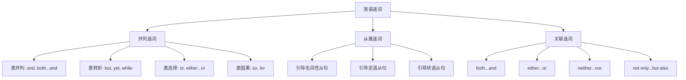
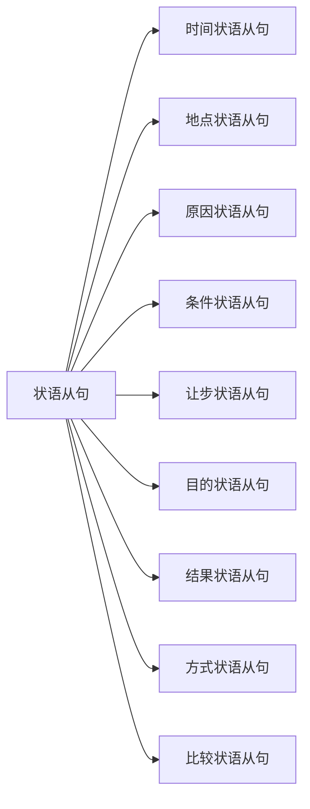
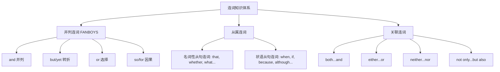

# 连词的分类与用法

连词（Conjunction）是英语中用来连接词与词、短语与短语、句子与句子的虚词。它本身没有实际意义，但在句子结构中起着至关重要的桥梁作用。掌握连词的正确用法，是构建复杂句式、表达逻辑关系的基础技能。

## 1. 连词概述

### 1.1 连词的定义与功能

连词是一种功能词，其核心作用是建立语言单位之间的连接关系。与介词不同，连词连接的是对等或从属的语法成分，而不是引导名词性成分作状语。

> [!info] 连词的三大功能
>
> 1. **连接功能**：将两个或多个语言单位连接成一个整体
> 2. **表意功能**：表明被连接成分之间的逻辑关系
> 3. **结构功能**：决定句子是简单句、并列句还是复合句

连词连接的语言单位可以是：

| 连接对象 | 示例 |
| --- | --- |
| 词与词 | bread **and** butter（面包和黄油） |
| 短语与短语 | in the morning **or** in the evening（早上或晚上） |
| 句子与句子 | I called him, **but** he didn't answer.（我打给他，但他没接。） |
| 从句与主句 | I'll wait **until** you come back.（我会等到你回来。） |

### 1.2 连词的分类体系

英语连词按照其功能和连接方式，可分为三大类：



这三类连词的核心区别在于：

| 类别 | 连接关系 | 语法地位 | 典型代表 |
| --- | --- | --- | --- |
| 并列连词 | 对等连接 | 连接的成分地位平等 | and, but, or, so |
| 从属连词 | 主从连接 | 引导从句，从句依附于主句 | because, if, when, that |
| 关联连词 | 成对使用 | 强调对等或选择关系 | both...and, either...or |

---

## 2. 并列连词详解

并列连词（Coordinating Conjunction）用于连接语法地位相等的词、短语或句子。英语中的基本并列连词可以用 **FANBOYS** 来记忆：**F**or, **A**nd, **N**or, **B**ut, **O**r, **Y**et, **S**o。

### 2.1 表示并列关系的连词

#### 2.1.1 and 的用法

**and** 是最常用的并列连词，表示"和、与、而且"，用于连接意义相近或顺承的成分。

**基本用法**：

```
主语 + 谓语 + 宾语1 + and + 宾语2
```

**例句分析**：

| 例句 | 句法分析 |
| --- | --- |
| Tom **and** Jerry are good friends. | and 连接两个主语，谓语用复数 |
| She sings **and** dances well. | and 连接两个动词，共用主语 |
| I bought a book **and** a pen. | and 连接两个宾语 |
| He is young **and** energetic. | and 连接两个形容词作表语 |

> [!tip] and 的特殊用法
>
> 1. **表示顺承**：He came in **and** sat down.（他进来坐下了。）
> 2. **表示条件**：Work hard, **and** you will succeed.（努力工作，你就会成功。）
> 3. **表示对比**：There are teachers **and** teachers.（老师和老师不一样。）
> 4. **连接数字**：three hundred **and** twenty-five（325）

**and 连接主语时的主谓一致**：

| 情况 | 谓语形式 | 示例 |
| --- | --- | --- |
| 表示不同人/物 | 复数 | Tom and Jerry **are** friends. |
| 表示同一人/物 | 单数 | The writer and teacher **is** respected. |
| 固定搭配 | 单数 | Bread and butter **is** my breakfast. |
| each/every 修饰 | 单数 | Every boy and girl **has** a book. |

#### 2.1.2 both...and 的用法

**both...and** 意为"两者都……"，强调"二者兼顾"，连接的成分必须对等。

**句法结构**：

```
Both + 成分A + and + 成分B + 谓语（复数）
```

**例句详解**：

| 例句 | 分析 |
| --- | --- |
| **Both** he **and** I are students. | 连接两个主语，谓语用复数 are |
| She is **both** clever **and** hardworking. | 连接两个形容词 |
| I **both** saw **and** heard him. | 连接两个动词 |
| He speaks **both** English **and** French. | 连接两个宾语 |

> [!warning] both...and 使用注意
>
> 1. **谓语必须用复数**：Both Tom and Jerry **are** (不是 is) here.
> 2. **不能用于否定句**：要说"两者都不"，用 neither...nor
> 3. **位置要对称**：both 和 and 后面的成分语法结构要一致

### 2.2 表示转折关系的连词

#### 2.2.1 but 的用法

**but** 是最常用的转折连词，表示"但是、然而"，用于连接意义相反或相对的成分。

**基本句型**：

```
句子A + , + but + 句子B
```

**例句分析**：

| 例句 | 语义分析 |
| --- | --- |
| He is poor **but** honest. | 贫穷与诚实形成对比 |
| I tried hard, **but** I failed. | 努力与失败形成转折 |
| She is not a teacher **but** a doctor. | not...but 表示"不是...而是" |
| I have no choice **but** to accept. | have no choice but to do 只能做 |

> [!example] but 的固定搭配
>
> - **not...but...**：不是……而是……
>   - He is not lazy **but** careless.（他不是懒惰而是粗心。）
> - **not only...but (also)**：不仅……而且……
>   - She is not only beautiful **but also** smart.（她不仅漂亮而且聪明。）
> - **nothing but**：只有，仅仅
>   - There is nothing **but** water here.（这里只有水。）
> - **anything but**：根本不，绝不
>   - He is anything **but** a fool.（他绝不是傻瓜。）
> - **but for**：要不是（表虚拟）
>   - **But for** your help, I would have failed.（要不是你的帮助，我早就失败了。）

#### 2.2.2 yet 的用法

**yet** 作连词时表示"然而、但是"，语气比 but 稍强，常用于书面语。

**例句对比**：

| 例句 | 说明 |
| --- | --- |
| The problem is difficult, **yet** I'll try. | yet 表示"尽管如此，但" |
| He is wealthy, **yet** unhappy. | yet 连接形容词，表强烈对比 |
| Strange **yet** true. | 省略句，奇怪但真实 |

> [!info] but 与 yet 的区别
>
> - **but** 是最常用的转折词，语气中性
> - **yet** 语气更强，常暗示"出乎意料"的转折
> - **yet** 更多用于书面语和正式场合

#### 2.2.3 while 作并列连词

**while** 除了引导时间状语从句外，还可作并列连词表示对比，意为"而、却"。

**例句分析**：

| 例句 | 分析 |
| --- | --- |
| He is tall **while** his brother is short. | 对比两人身高差异 |
| Some people like coffee, **while** others prefer tea. | 对比不同人的喜好 |
| I earn $3000 a month **while** he earns $5000. | 对比收入差异 |

### 2.3 表示选择关系的连词

#### 2.3.1 or 的用法

**or** 表示"或者、还是"，用于表示选择关系或否定句中的并列。

**基本用法**：

| 用法 | 例句 | 说明 |
| --- | --- | --- |
| 表选择 | Coffee **or** tea? | 咖啡还是茶？ |
| 否定中的并列 | I don't like apples **or** oranges. | 我不喜欢苹果和橙子 |
| 表否则 | Hurry up, **or** you'll be late. | 快点，否则你会迟到 |
| 表解释 | Physics, **or** natural philosophy | 物理学，即自然哲学 |

> [!tip] or 的特殊用法
>
> 1. **or so**：大约
>    - Wait for an hour **or so**.（等大约一个小时。）
> 2. **or else**：否则，要不然
>    - Do it now, **or else** you'll regret.（现在就做，否则你会后悔。）
> 3. **or rather**：更确切地说
>    - He is my friend, **or rather**, my best friend.（他是我的朋友，更确切地说，是我最好的朋友。）

**or 在否定句中的用法**：

在否定句中，**or** 代替 **and** 连接并列成分：

| 肯定句（用 and） | 否定句（用 or） |
| --- | --- |
| I like apples **and** oranges. | I don't like apples **or** oranges. |
| He can read **and** write. | He can't read **or** write. |

#### 2.3.2 either...or 的用法

**either...or** 意为"要么……要么……"，"或者……或者……"，强调二选一。

**句法结构**：

```
Either + 成分A + or + 成分B
```

**主谓一致原则**：谓语动词与 **or** 后面的主语保持一致（就近原则）。

**例句详解**：

| 例句 | 主谓一致分析 |
| --- | --- |
| **Either** you **or** I **am** wrong. | 谓语与 I 一致，用 am |
| **Either** he **or** his parents **are** at home. | 谓语与 parents 一致，用 are |
| **Either** the students **or** the teacher **is** to blame. | 谓语与 teacher 一致，用 is |

> [!warning] either...or 注意事项
>
> 1. **就近原则**：谓语与靠近的主语一致
> 2. **只能二选一**：不能用于三个或以上的选择
> 3. **否定形式**：neither...nor（两者都不）

#### 2.3.3 neither...nor 的用法

**neither...nor** 意为"既不……也不……"，表示对两者的否定。

**句法结构**：

```
Neither + 成分A + nor + 成分B + 谓语（就近一致）
```

**例句分析**：

| 例句 | 分析 |
| --- | --- |
| **Neither** he **nor** I **am** a doctor. | 谓语与 I 一致，用 am |
| **Neither** Tom **nor** his friends **were** there. | 谓语与 friends 一致，用 were |
| I have **neither** time **nor** money. | 连接两个宾语 |
| She is **neither** rich **nor** beautiful. | 连接两个形容词 |

> [!example] neither...nor 的句法转换
>
> **原句**：Neither Tom nor Jerry is here.
> **等价表达**：
> - Tom is not here, and Jerry isn't, either.
> - Tom is not here, nor is Jerry.（nor 引起倒装）
> - Both Tom and Jerry are not here.（此句有歧义，不推荐）

### 2.4 表示因果关系的连词

#### 2.4.1 so 的用法

**so** 作并列连词表示"所以、因此"，引出结果。

**基本句型**：

```
原因句 + , + so + 结果句
```

**例句分析**：

| 例句 | 分析 |
| --- | --- |
| It was late, **so** I went home. | 因为晚了，所以回家 |
| He was ill, **so** he didn't come. | 因为生病，所以没来 |
| I think, **so** I am. | 我思故我在 |

> [!warning] so 与 because 不能连用
>
> - ❌ **Because** it was raining, **so** I stayed home.
> - ✅ **Because** it was raining, I stayed home.
> - ✅ It was raining, **so** I stayed home.
>
> 中文可以说"因为……所以……"，但英语中 because 和 so 不能同时出现在一个句子中。

#### 2.4.2 for 的用法

**for** 作并列连词表示"因为"，用于补充说明原因，语气较弱。

**基本句型**：

```
结论句 + , + for + 原因句
```

**例句分析**：

| 例句 | 分析 |
| --- | --- |
| He must be ill, **for** he is absent. | for 补充说明推断的依据 |
| It must be morning, **for** the birds are singing. | for 解释判断的原因 |

> [!info] for 与 because 的区别
>
> | 对比项 | for | because |
> | --- | --- | --- |
> | 词性 | 并列连词 | 从属连词 |
> | 位置 | 只能放在主句之后 | 可放句首或句中 |
> | 语气 | 补充说明，语气弱 | 直接表原因，语气强 |
> | 标点 | 前面必须有逗号 | 句中不一定需要逗号 |
> | 回答 Why | 不能用 for 回答 | 可以用 because 回答 |

**对比示例**：

| 用 because（直接原因） | 用 for（补充说明） |
| --- | --- |
| I stayed home **because** it was raining. | It must have rained, **for** the ground is wet. |
| 因为下雨，所以我待在家里 | 一定下过雨了，因为地是湿的 |

---

## 3. 从属连词详解

从属连词（Subordinating Conjunction）用于引导从句，使从句依附于主句。从属连词引导的从句在句中充当名词、形容词或副词的功能。

### 3.1 引导名词性从句的连词

名词性从句包括主语从句、宾语从句、表语从句和同位语从句。引导这类从句的连词主要有：

| 连词 | 意义 | 是否充当成分 |
| --- | --- | --- |
| that | 无实义 | 不充当成分 |
| whether/if | 是否 | 不充当成分 |
| what | 什么；所……的 | 充当主语、宾语、表语 |
| who/whom | 谁 | 充当主语、宾语 |
| which | 哪一个 | 充当定语、主语、宾语 |
| when | 什么时候 | 充当时间状语 |
| where | 哪里 | 充当地点状语 |
| why | 为什么 | 充当原因状语 |
| how | 如何 | 充当方式状语 |

#### 3.1.1 that 引导名词性从句

**that** 引导名词性从句时无实际意义，只起连接作用，在从句中不充当任何成分。

**引导主语从句**：

```
That + 主语 + 谓语 + ... + is/was + 形容词/名词
```

| 例句 | 分析 |
| --- | --- |
| **That** he will come is certain. | that 从句作主语 |
| **That** the earth is round is a fact. | that 从句陈述事实 |
| It is important **that** you should be honest. | it 作形式主语，that 从句是真正主语 |

> [!tip] that 的省略规则
>
> 1. **主语从句**：that 不可省略
> 2. **表语从句**：that 通常不省略
> 3. **宾语从句**：that 常可省略（非正式场合）
> 4. **同位语从句**：that 不可省略

**引导宾语从句**：

| 例句 | 分析 |
| --- | --- |
| I think **(that)** he is right. | that 可省略 |
| I believe **(that)** you can do it. | that 可省略 |
| I'm sure **(that)** she will come. | that 可省略 |

**引导表语从句**：

| 例句 | 分析 |
| --- | --- |
| The fact is **that** we are lost. | that 引导表语从句 |
| The problem is **that** we have no money. | 说明问题的具体内容 |
| My suggestion is **that** you should rest. | 说明建议的具体内容 |

**引导同位语从句**：

| 例句 | 分析 |
| --- | --- |
| The news **that** he died is false. | that 从句解释 news 的内容 |
| I have no idea **that** he is a spy. | that 从句说明 idea 的内容 |
| The fact **that** she won surprised us. | that 从句解释 fact 的内容 |

#### 3.1.2 whether/if 引导名词性从句

**whether** 和 **if** 都可以表示"是否"，但用法有所不同。

**whether 与 if 的区别**：

| 使用场景 | whether | if |
| --- | --- | --- |
| 引导主语从句 | ✅ 可以 | ❌ 不可以 |
| 引导表语从句 | ✅ 可以 | ❌ 不可以 |
| 引导宾语从句 | ✅ 可以 | ✅ 可以 |
| 引导同位语从句 | ✅ 可以 | ❌ 不可以 |
| 与 or not 连用 | ✅ whether or not | ❌ 不能直接接 or not |
| 介词后 | ✅ 可以 | ❌ 不可以 |
| 与不定式连用 | ✅ whether to do | ❌ 不可以 |

**例句对比**：

| 场景 | 正确用法 | 错误用法 |
| --- | --- | --- |
| 主语从句 | **Whether** he will come is unknown. | ❌ If he will come is unknown. |
| 介词后 | I'm worried about **whether** he is safe. | ❌ I'm worried about if he is safe. |
| or not 直接跟 | **Whether or not** he agrees... | ❌ If or not he agrees... |
| 不定式 | I don't know **whether to go**. | ❌ I don't know if to go. |

### 3.2 引导状语从句的连词

状语从句是从属连词最丰富的应用领域。根据表达的意义，状语从句可分为以下类型：



#### 3.2.1 时间状语从句连词

| 连词 | 意义 | 例句 |
| --- | --- | --- |
| when | 当……时 | **When** I arrived, he had left. |
| while | 当……时（持续） | **While** I was sleeping, the phone rang. |
| as | 当……时；随着 | **As** time goes by, we grow older. |
| before | 在……之前 | Think twice **before** you act. |
| after | 在……之后 | I'll call you **after** I finish. |
| until/till | 直到 | Wait **until** I come back. |
| since | 自从 | I've lived here **since** 2010. |
| as soon as | 一……就 | I'll tell you **as soon as** I know. |
| once | 一旦 | **Once** you start, you can't stop. |
| hardly...when | 刚……就 | **Hardly** had I arrived **when** it rained. |
| no sooner...than | 刚……就 | **No sooner** had he left **than** she came. |

> [!example] when, while, as 的区别
>
> | 连词 | 动作特点 | 时态搭配 | 例句 |
> | --- | --- | --- | --- |
> | when | 短暂或持续 | 一般时/进行时 | **When** he came, I was reading. |
> | while | 持续性动作 | 常用进行时 | **While** he was reading, I was writing. |
> | as | 同时发生 | 强调伴随 | **As** he walked, he sang. |

**until 的特殊用法**：

| 主句谓语 | 意义 | 例句 |
| --- | --- | --- |
| 延续性动词（肯定） | 一直到……为止 | I'll wait **until** you come. |
| 短暂性动词（否定） | 直到……才 | He didn't leave **until** she came. |

> [!tip] not...until 的强调句和倒装句
>
> **原句**：He didn't leave until she came.
> **强调句**：It was not until she came that he left.
> **倒装句**：Not until she came did he leave.

#### 3.2.2 原因状语从句连词

| 连词 | 语气强度 | 位置 | 例句 |
| --- | --- | --- | --- |
| because | 最强 | 句首/句中 | **Because** it rained, we stayed home. |
| since | 较弱（既然） | 常放句首 | **Since** you know, why ask? |
| as | 较弱 | 常放句首 | **As** it's late, we should go. |
| now (that) | 既然 | 句首 | **Now that** you're here, stay for dinner. |
| seeing (that) | 既然 | 句首 | **Seeing that** it's urgent, I'll help. |
| in that | 因为 | 句中 | He is lucky **in that** he has good health. |

> [!info] because, since, as, for 的区别
>
> | 连词 | 词性 | 语气 | 是否回答 Why |
> | --- | --- | --- | --- |
> | because | 从属连词 | 最强，直接原因 | ✅ 可以 |
> | since | 从属连词 | 较弱，已知原因 | ❌ 不可以 |
> | as | 从属连词 | 较弱，显而易见 | ❌ 不可以 |
> | for | 并列连词 | 补充说明 | ❌ 不可以 |

#### 3.2.3 条件状语从句连词

| 连词 | 意义 | 例句 |
| --- | --- | --- |
| if | 如果 | **If** it rains, I'll stay home. |
| unless | 除非（= if not） | I won't go **unless** you come. |
| provided (that) | 假如；只要 | I'll go **provided that** you pay. |
| providing (that) | 假如；只要 | **Providing** it's fine, we'll go. |
| suppose/supposing | 假设 | **Suppose** you were rich, what would you do? |
| as long as | 只要 | **As long as** you try, you'll succeed. |
| so long as | 只要 | **So long as** there's life, there's hope. |
| on condition that | 条件是 | I'll help **on condition that** you help others. |
| in case | 万一；以防 | Take an umbrella **in case** it rains. |

> [!warning] 条件状语从句的时态
>
> **主将从现原则**：主句用将来时，从句用一般现在时表将来。
>
> - ✅ If it **rains** tomorrow, I **will stay** home.
> - ❌ If it **will rain** tomorrow, I will stay home.
>
> 但虚拟语气除外：If I **were** you, I **would go**.

**unless 的用法**：

**unless** = **if...not**，意为"除非，如果不"。

| unless 句 | 等价 if...not 句 |
| --- | --- |
| I won't go **unless** you come. | I won't go **if** you **don't** come. |
| **Unless** invited, he won't come. | **If not** invited, he won't come. |

#### 3.2.4 让步状语从句连词

| 连词 | 意义 | 例句 |
| --- | --- | --- |
| although/though | 虽然 | **Although** he is old, he is healthy. |
| even if/though | 即使 | **Even if** it rains, I'll go. |
| while | 尽管 | **While** I agree, I have concerns. |
| whereas | 然而 | He is rich, **whereas** I am poor. |
| no matter + 疑问词 | 无论 | **No matter what** you say, I won't believe. |
| whatever/whoever/... | 无论什么/谁/... | **Whatever** you do, do it well. |
| as | 尽管（倒装） | **Young as** he is, he knows a lot. |

> [!warning] although/though 不与 but 连用
>
> - ❌ **Although** he is poor, **but** he is happy.
> - ✅ **Although** he is poor, he is happy.
> - ✅ He is poor, **but** he is happy.
>
> 中文可以说"虽然……但是……"，英语中 although 和 but 不能同时使用。

**as 引导让步状语从句的倒装**：

**as** 引导让步状语从句时，必须将表语、状语或动词原形提到句首：

| 原句 | as 倒装句 |
| --- | --- |
| Although he is young, he knows a lot. | **Young as** he is, he knows a lot. |
| Although he tried hard, he failed. | **Hard as** he tried, he failed. |
| Although she is a child, she understands. | **Child as** she is, she understands. |

> [!tip] as 倒装句的特点
>
> 1. 形容词/副词/名词提前
> 2. 名词提前时不加冠词：Child as she is（不是 A child as she is）
> 3. 动词原形提前用 as/though：Try as he might, he failed.

#### 3.2.5 目的状语从句连词

| 连词 | 意义 | 例句 |
| --- | --- | --- |
| so that | 以便，为了 | Speak louder **so that** everyone can hear. |
| in order that | 以便，为了 | Study hard **in order that** you may pass. |
| for fear that | 以免，唯恐 | He ran away **for fear that** he might be caught. |
| in case | 以防，万一 | Take your ID **in case** they ask. |
| lest | 以免（正式） | Walk carefully **lest** you should fall. |

> [!info] 目的状语从句的特点
>
> 1. 从句中常用情态动词 can/could, may/might, will/would
> 2. lest 后常用 should + 动词原形（should 可省略）
> 3. for fear that 后常用 might/should

#### 3.2.6 结果状语从句连词

| 连词 | 结构 | 例句 |
| --- | --- | --- |
| so...that | so + 形/副 + that | He is **so tall that** he can reach the top. |
| such...that | such + 名词 + that | It was **such a** good book **that** I read it twice. |
| so that | 结果（无逗号） | He didn't study, so that he failed. |

**so...that 与 such...that 的区别**：

| 结构 | 修饰对象 | 例句 |
| --- | --- | --- |
| so + 形容词 + that | 形容词 | He is **so clever** that... |
| so + 副词 + that | 副词 | He runs **so fast** that... |
| so + 形容词 + a/an + 名词 + that | 单数可数名词 | It is **so good a** book that... |
| such + a/an + 形容词 + 名词 + that | 单数可数名词 | It is **such a good** book that... |
| such + 形容词 + 复数名词 + that | 复数名词 | They are **such good** books that... |
| such + 形容词 + 不可数名词 + that | 不可数名词 | It is **such fine** weather that... |

> [!tip] so 与 such 的特殊情况
>
> 当名词前有 many, much, few, little（表数量）修饰时，用 **so** 而不用 such：
>
> - **so many** books that...（这么多书以至于）
> - **so much** water that...（这么多水以至于）
> - **so few** friends that...（这么少朋友以至于）
> - **so little** time that...（这么少时间以至于）

#### 3.2.7 方式状语从句连词

| 连词 | 意义 | 例句 |
| --- | --- | --- |
| as | 按照，如同 | Do **as** I say, not as I do. |
| as if/as though | 好像 | He talks **as if** he knew everything. |
| the way | 按照……方式 | Do it **the way** I showed you. |

**as if/as though 的语气**：

| 情况 | 时态 | 例句 |
| --- | --- | --- |
| 可能是事实 | 陈述语气 | It looks **as if** it is going to rain. |
| 与现在事实相反 | 过去时 | He talks **as if** he **knew** everything. |
| 与过去事实相反 | 过去完成时 | He talks **as if** he **had been** there. |

#### 3.2.8 比较状语从句连词

| 连词 | 意义 | 例句 |
| --- | --- | --- |
| than | 比 | He is taller **than** I am. |
| as...as | 和……一样 | He is **as tall as** his father. |
| not as/so...as | 不如 | He is **not as tall as** his father. |
| the more...the more | 越……越 | **The more** you read, **the more** you know. |

> [!example] the more...the more 句型
>
> **结构**：The + 比较级 + 主语 + 谓语, the + 比较级 + 主语 + 谓语
>
> - **The harder** you work, **the more progress** you will make.
>   （你越努力，进步就越大。）
> - **The sooner**, **the better**.
>   （越快越好。）——省略形式
> - **The more**, **the merrier**.
>   （人越多越热闹。）——省略形式

---

## 4. 关联连词详解

关联连词（Correlative Conjunction）是成对使用的连词，用于强调并列、选择或否定关系。

### 4.1 关联连词一览表

| 关联连词 | 意义 | 连接关系 |
| --- | --- | --- |
| both...and | 两者都 | 并列肯定 |
| either...or | 或者……或者 | 二选一 |
| neither...nor | 既不……也不 | 双重否定 |
| not only...but (also) | 不仅……而且 | 递进 |
| not...but | 不是……而是 | 对比否定 |
| whether...or | 是……还是 | 选择 |

### 4.2 not only...but (also) 的用法

**not only...but (also)** 意为"不仅……而且"，表示递进关系。

**基本结构**：

```
Not only + 成分A + but (also) + 成分B
```

**主谓一致**：遵循**就近原则**，谓语与 but also 后的主语一致。

| 例句 | 分析 |
| --- | --- |
| **Not only** he **but also** I **am** a student. | 谓语与 I 一致 |
| **Not only** the students **but also** the teacher **is** here. | 谓语与 teacher 一致 |
| She is **not only** beautiful **but also** clever. | 连接两个形容词 |
| He **not only** sings **but also** dances. | 连接两个动词 |

> [!warning] not only 位于句首时的倒装
>
> 当 **not only** 位于句首时，**not only** 所在的分句要**部分倒装**，**but also** 分句正常语序。
>
> **原句**：He not only speaks English but also writes it well.
> **倒装**：**Not only does he speak** English, **but he also writes** it well.
>
> **原句**：She is not only a teacher but also a writer.
> **倒装**：**Not only is she** a teacher, **but she is also** a writer.

### 4.3 whether...or 的用法

**whether...or** 用于引导选择关系，意为"是……还是……"或"无论……还是……"。

**引导名词性从句**：

| 例句 | 分析 |
| --- | --- |
| I don't know **whether** he is right **or** wrong. | 宾语从句 |
| **Whether** it's true **or** not doesn't matter. | 主语从句 |
| The question is **whether** to go **or** stay. | 表语从句 |

**引导让步状语从句**：

| 例句 | 分析 |
| --- | --- |
| **Whether** you like it **or** not, you must go. | 无论你喜欢与否 |
| **Whether** rich **or** poor, he is always happy. | 无论贫富 |

### 4.4 not...but 的用法

**not...but** 意为"不是……而是……"，用于否定前者，肯定后者。

| 例句 | 分析 |
| --- | --- |
| He is **not** a teacher **but** a doctor. | 不是老师而是医生 |
| I came **not** to praise him **but** to bury him. | 不是赞扬而是埋葬 |
| **Not** you **but** I am to blame. | 该受责备的不是你而是我 |

**主谓一致**：谓语与 **but** 后的主语一致。

---

## 5. 连词的固定搭配与习语

### 5.1 常见连词固定搭配

| 搭配 | 意义 | 例句 |
| --- | --- | --- |
| and so on | 等等 | books, pens, **and so on** |
| and so forth | 等等 | A, B, C, **and so forth** |
| and yet | 然而 | He is rich **and yet** unhappy. |
| but then | 但另一方面 | I'd like to go, **but then** I'm busy. |
| or else | 否则 | Hurry up, **or else** you'll be late. |
| if any | 如果有的话 | Correct errors, **if any**. |
| if so | 如果是这样 | **If so**, I'll help you. |
| if not | 如果不是 | **If not**, forget it. |
| if ever | 如果曾经有过 | seldom, **if ever** |
| if necessary | 如果必要 | **If necessary**, I'll stay. |
| if possible | 如果可能 | **If possible**, come early. |
| as if/though | 好像 | He acted **as if** nothing happened. |
| even if/though | 即使 | I'll go **even if** it rains. |
| what if | 如果……怎么办 | **What if** he doesn't come? |

### 5.2 连词相关的习语表达

| 习语 | 意义 | 例句 |
| --- | --- | --- |
| no sooner...than | 一……就 | **No sooner** had he arrived **than** it rained. |
| hardly/scarcely...when | 刚……就 | **Hardly** had I sat down **when** the phone rang. |
| not...until | 直到……才 | I didn't sleep **until** midnight. |
| the moment/minute/instant | 一……就 | I knew **the moment** I saw him. |
| every time | 每次 | **Every time** I see her, I smile. |
| by the time | 到……时候 | **By the time** he arrived, we had left. |

> [!example] no sooner...than 与 hardly...when 的倒装
>
> 这两个结构强调"刚……就……"，当 no sooner/hardly 位于句首时，主句部分倒装。
>
> **原句**：He had no sooner arrived than it began to rain.
> **倒装**：**No sooner had he arrived** than it began to rain.
>
> **原句**：I had hardly sat down when the phone rang.
> **倒装**：**Hardly had I sat down** when the phone rang.

---

## 6. 连词使用的常见错误

### 6.1 并列连词与从属连词混用

> [!warning] 典型错误分析
>
> | 错误句 | 错误原因 | 正确句 |
> | --- | --- | --- |
> | ❌ Because it rained, so I stayed home. | because 和 so 不能连用 | ✅ Because it rained, I stayed home. |
> | ❌ Although he is poor, but he is happy. | although 和 but 不能连用 | ✅ Although he is poor, he is happy. |
> | ❌ The reason is because he is ill. | reason 后用 that，不用 because | ✅ The reason is that he is ill. |

### 6.2 连词位置错误

| 错误句 | 正确句 | 说明 |
| --- | --- | --- |
| ❌ He not only is tall but also handsome. | ✅ He is not only tall but also handsome. | not only 应放在 is 后 |
| ❌ Both he and I am students. | ✅ Both he and I are students. | both...and 连接主语用复数 |
| ❌ If he will come is unknown. | ✅ Whether he will come is unknown. | if 不引导主语从句 |

### 6.3 主谓一致错误

| 情况 | 错误句 | 正确句 |
| --- | --- | --- |
| either...or | ❌ Either you or I are wrong. | ✅ Either you or I **am** wrong. |
| neither...nor | ❌ Neither he nor they is here. | ✅ Neither he nor they **are** here. |
| not only...but also | ❌ Not only he but also I is a student. | ✅ Not only he but also I **am** a student. |

### 6.4 时态搭配错误

> [!warning] 条件句和时间状语从句的时态
>
> **主将从现**原则：主句用将来时，从句用一般现在时表将来。
>
> | 错误句 | 正确句 |
> | --- | --- |
> | ❌ If it **will rain**, I will stay. | ✅ If it **rains**, I will stay. |
> | ❌ When he **will come**, tell me. | ✅ When he **comes**, tell me. |
> | ❌ I'll wait until he **will return**. | ✅ I'll wait until he **returns**. |

---

## 7. 连词综合练习

### 7.1 选择填空

> [!example] 练习题
>
> 1. He was tired, ______ he kept working.
>    A. so  B. but  C. and  D. or
>
> 2. ______ he is young, he knows a lot.
>    A. Because  B. Although  C. If  D. Unless
>
> 3. I don't know ______ he will come or not.
>    A. if  B. whether  C. that  D. what
>
> 4. ______ you ______ I am wrong.
>    A. Both...and  B. Either...or  C. Neither...nor  D. Not only...but
>
> 5. Work hard, ______ you'll fail.
>    A. and  B. but  C. or  D. so

> [!tip] 答案解析
>
> 1. **B**（but）表转折：虽然累但继续工作
> 2. **B**（Although）表让步：虽然年轻但知道很多
> 3. **B**（whether）引导宾语从句，与 or not 连用必须用 whether
> 4. **B**（Either...or）表二选一：要么你错，要么我错
> 5. **C**（or）表否则：努力工作，否则你会失败

### 7.2 句子改写

> [!example] 改写练习
>
> **用 not only...but also 改写**：
> 原句：He is clever. He is also hardworking.
> 改写：He is **not only** clever **but also** hardworking.
>
> **用 although 改写**：
> 原句：He is poor, but he is happy.
> 改写：**Although** he is poor, he is happy.
>
> **用 so...that 改写**：
> 原句：The box is very heavy. I can't carry it.
> 改写：The box is **so** heavy **that** I can't carry it.

### 7.3 翻译练习

| 中文 | 英文参考 |
| --- | --- |
| 无论发生什么，我都会支持你。 | **Whatever** happens, I will support you. |
| 一到家我就给你打电话。 | I will call you **as soon as** I get home. |
| 他不仅会说英语，还会说法语。 | He can speak **not only** English **but also** French. |
| 如果你有问题，随时来找我。 | **If** you have any questions, come to me anytime. |
| 虽然他很忙，但他还是来了。 | **Although** he was busy, he still came. |

---

## 8. 本章小结



> [!success] 核心要点回顾
>
> 1. **并列连词**连接对等成分，记住 FANBOYS：for, and, nor, but, or, yet, so
>
> 2. **从属连词**引导从句，从句依附于主句：
>    - 名词性从句：that, whether, what, who, how...
>    - 状语从句：when, if, because, although, so that...
>
> 3. **关联连词**成对使用，注意主谓一致：
>    - both...and（复数）
>    - either...or（就近原则）
>    - neither...nor（就近原则）
>    - not only...but also（就近原则）
>
> 4. **避免常见错误**：
>    - because 和 so 不连用
>    - although 和 but 不连用
>    - if 不引导主语从句
>    - 条件句和时间状语从句用一般现在时表将来

掌握连词的分类与用法，是构建复杂句式、准确表达逻辑关系的关键。在实际应用中，要注意连词的语义差异、位置规范以及主谓一致原则，避免中式英语的干扰，逐步形成地道的英语表达习惯。
