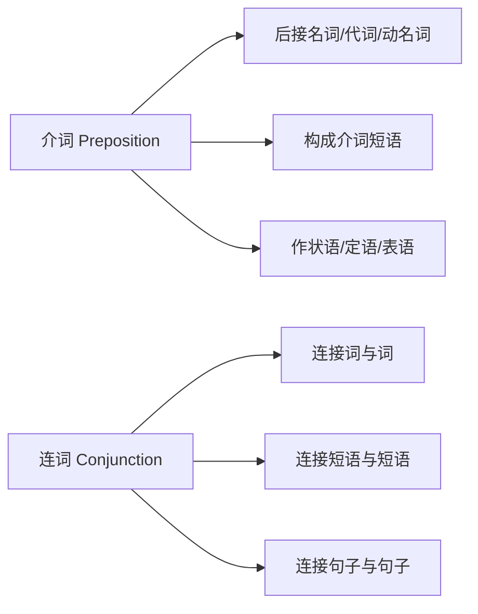
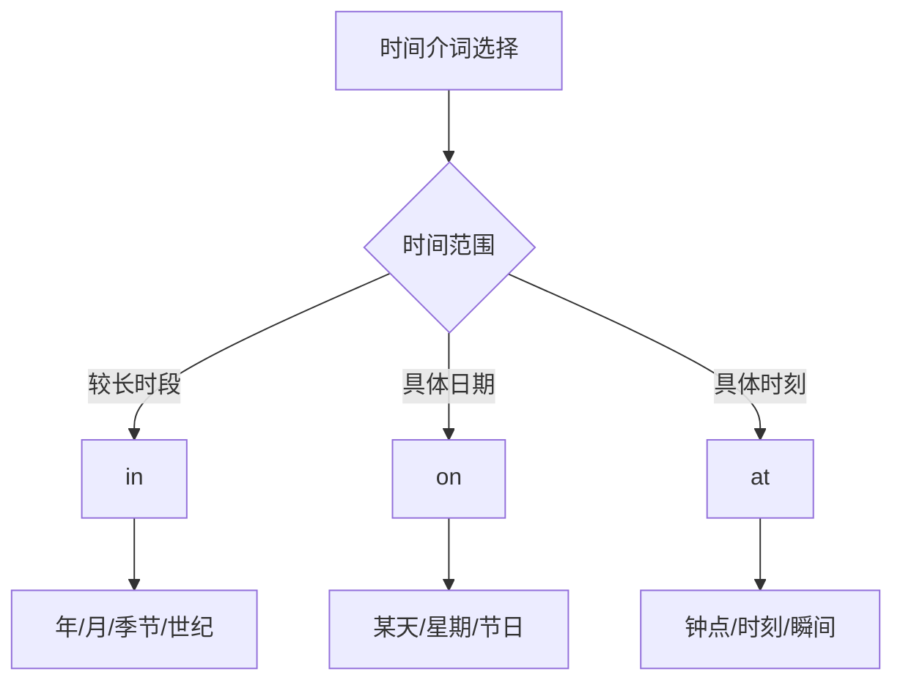
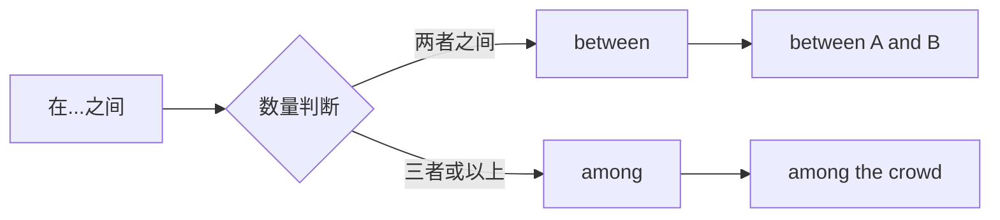
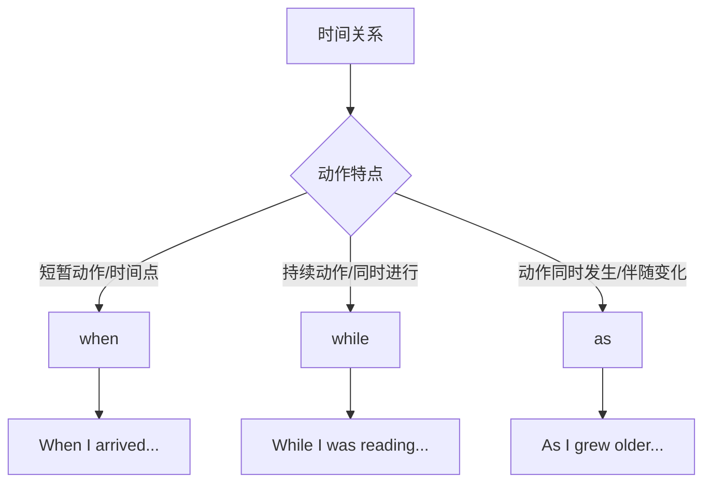
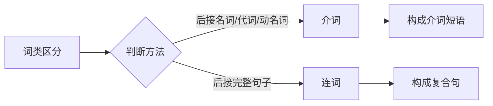

# 介词与连词的易混点

在英语学习过程中，介词和连词是两类极易混淆的词类。它们都起着连接作用，但在语法功能、句法结构和语义表达上存在本质差异。本篇将从词性本质出发，系统梳理介词与连词的区别，深入辨析常见易混词对，并通过大量例句和专项练习帮助你彻底掌握这两类词的正确用法。

## 1. 介词与连词的本质区别

### 1.1 词性定义与功能对比

介词（Preposition）和连词（Conjunction）虽然都具有"连接"的功能，但它们连接的对象和方式截然不同。

> [!info] 核心概念
>
> **介词**：连接名词、代词或名词性短语，表示它们与句中其他成分的关系（时间、地点、方式、原因等）。介词后面必须跟宾语，构成介词短语。
>
> **连词**：连接词、短语或句子，表示并列、转折、因果、条件等逻辑关系。连词本身不需要宾语。



介词的核心特征是"后面必须有宾语"。当你看到一个词后面跟着名词或代词，它很可能是介词；如果一个词连接的是两个完整的句子或并列成分，它很可能是连词。

### 1.2 语法结构对比

介词和连词在句子中的位置和搭配方式有明显区别：

| 特征 | 介词 | 连词 |
| --- | --- | --- |
| 后接成分 | 名词、代词、动名词 | 词、短语、从句 |
| 构成结构 | 介词短语 | 并列结构或主从复合句 |
| 句法功能 | 状语、定语、表语 | 连接成分，本身不作句子成分 |
| 能否独立 | 不能独立使用 | 可连接独立分句 |

**介词结构示例**：

```
介词 + 名词/代词 = 介词短语

in the morning（在早晨）
with my friends（和我的朋友们）
after dinner（晚饭后）
```

**连词结构示例**：

```
连词 + 句子 = 复合句

When I arrived, he had left.（当我到达时，他已经离开了。）
Although it rained, we went out.（虽然下雨了，我们还是出去了。）
```

### 1.3 同形异类词的区分

英语中有一些词既可以作介词，也可以作连词，这是造成混淆的主要原因。判断这类词的词性，关键看它后面跟的是什么成分。

> [!warning] 重点辨析
>
> 判断一个词是介词还是连词，核心方法是看**后面跟的是名词性成分还是完整句子**。
>
> - 后接名词/代词/动名词 → 介词
> - 后接主谓完整的句子 → 连词

常见的同形异类词包括：

| 词 | 作介词时 | 作连词时 |
| --- | --- | --- |
| **before** | before lunch（午餐前） | before you leave（在你离开之前） |
| **after** | after school（放学后） | after he finished（在他完成之后） |
| **since** | since 2020（自2020年以来） | since you came（自从你来了） |
| **until** | until midnight（直到午夜） | until you return（直到你回来） |
| **as** | as a teacher（作为老师） | as I know（据我所知） |

**对比例句**：

| 介词用法 | 连词用法 |
| --- | --- |
| I haven't seen him **since** Monday.（自周一以来我没见过他。）| I haven't seen him **since** he moved away.（自从他搬走后我就没见过他。）|
| We waited **until** noon.（我们等到中午。）| We waited **until** the rain stopped.（我们等到雨停。）|
| **Before** breakfast, I take a walk.（早餐前，我散步。）| **Before** I have breakfast, I take a walk.（在我吃早餐之前，我散步。）|

## 2. 易混介词辨析

### 2.1 时间介词：in / on / at

这三个时间介词是最基础也是最常混淆的介词组合。它们的区别主要在于所表示的时间范围大小。



#### 2.1.1 in 的用法

**in** 用于较长的时间段，包括年、月、季节、世纪、时代等。

| 时间类型 | 例句 | 中文翻译 |
| --- | --- | --- |
| 年份 | I was born **in** 1995. | 我出生于1995年。 |
| 月份 | The festival is **in** October. | 这个节日在十月。 |
| 季节 | Flowers bloom **in** spring. | 花在春天盛开。 |
| 世纪 | This happened **in** the 20th century. | 这发生在20世纪。 |
| 一天中的时段 | I study **in** the morning. | 我在早上学习。 |

> [!tip] 特殊用法
>
> "in + 一段时间"可表示"在...之后"，用于将来时态：
>
> - I'll be back **in** an hour.（我一小时后回来。）
> - The train will arrive **in** ten minutes.（火车十分钟后到达。）

#### 2.1.2 on 的用法

**on** 用于具体的某一天，包括日期、星期、节日、特定的某天等。

| 时间类型 | 例句 | 中文翻译 |
| --- | --- | --- |
| 日期 | The meeting is **on** July 15th. | 会议在7月15日。 |
| 星期 | I have a class **on** Monday. | 我周一有课。 |
| 节日（特定日） | We gather **on** Christmas Day. | 我们在圣诞节聚会。 |
| 特定的某天 | **On** a cold winter morning, ... | 在一个寒冷的冬天早晨... |

> [!warning] 易错点
>
> 当"morning/afternoon/evening"前有修饰语时，介词要从 **in** 变为 **on**：
>
> - in the morning（在早上）→ on Monday morning（在周一早上）
> - in the evening（在晚上）→ on a rainy evening（在一个雨夜）

#### 2.1.3 at 的用法

**at** 用于具体的时刻、时间点或较短的时间。

| 时间类型 | 例句 | 中文翻译 |
| --- | --- | --- |
| 钟点 | The class starts **at** 9 o'clock. | 课程9点开始。 |
| 特定时刻 | I arrived **at** noon. | 我中午到达。 |
| 节日（时段） | **At** Christmas, families gather. | 圣诞节期间，家人团聚。 |
| 年龄 | He got married **at** 25. | 他25岁结婚。 |
| 夜间 | I often read **at** night. | 我常在夜里读书。 |

> [!info] in / on / at 对比表
>
> | 时间范围 | 介词 | 典型搭配 |
> | --- | --- | --- |
> | 最大（年/月/季） | in | in 2024, in May, in winter |
> | 中等（具体某天） | on | on Monday, on May 1st |
> | 最小（时刻/瞬间） | at | at 3 p.m., at noon, at night |

### 2.2 地点介词：in / on / at

这三个介词用于表示地点时，区别在于空间范围和接触方式。

#### 2.2.1 in 表示"在...里面"

**in** 强调处于某个空间的内部，被包围其中。

| 例句 | 中文翻译 | 解析 |
| --- | --- | --- |
| The keys are **in** the drawer. | 钥匙在抽屉里。 | 被抽屉包围 |
| She lives **in** Beijing. | 她住在北京。 | 在城市范围内 |
| There are fish **in** the pond. | 池塘里有鱼。 | 在水体内部 |
| He is **in** the car. | 他在车里。 | 在车厢内部 |

#### 2.2.2 on 表示"在...上面"

**on** 强调与表面接触，在某物的上面或表面。

| 例句 | 中文翻译 | 解析 |
| --- | --- | --- |
| The book is **on** the desk. | 书在桌子上。 | 与桌面接触 |
| There's a picture **on** the wall. | 墙上有一幅画。 | 与墙面接触 |
| She is **on** the bus. | 她在公交车上。 | 在公共交通工具上 |
| We live **on** the third floor. | 我们住在三楼。 | 在某一层 |

> [!tip] in the car vs. on the bus
>
> 小型交通工具（car, taxi）用 **in**，因为空间狭小，人在里面；
> 大型交通工具（bus, train, plane, ship）用 **on**，因为空间大，人可以在上面走动。

#### 2.2.3 at 表示"在某点/某处"

**at** 强调位于某个点或某个地点（不强调内部或表面）。

| 例句 | 中文翻译 | 解析 |
| --- | --- | --- |
| I'll meet you **at** the station. | 我在车站等你。 | 车站这个点 |
| She works **at** a bank. | 她在一家银行工作。 | 在某机构 |
| We arrived **at** the airport. | 我们到达机场。 | 抵达某地点 |
| He is **at** home. | 他在家。 | 固定搭配 |

> [!info] 地点介词对比
>
> | 介词 | 空间概念 | 典型搭配 |
> | --- | --- | --- |
> | in | 内部空间 | in the room, in China, in the box |
> | on | 表面接触 | on the table, on the floor, on the bus |
> | at | 某个点位 | at the door, at school, at the corner |

### 2.3 between vs. among

这两个介词都表示"在...之间"，但使用场景不同。



#### 2.3.1 between 的用法

**between** 通常用于两者之间，也可用于三者或以上时，每两个个体之间有明确的一对一关系。

| 例句 | 中文翻译 |
| --- | --- |
| The shop is **between** the bank and the post office. | 商店在银行和邮局之间。 |
| **Between** you and me, I don't trust him. | 就你我之间说，我不信任他。 |
| Switzerland lies **between** France, Germany, Austria and Italy. | 瑞士位于法国、德国、奥地利和意大利之间。（四国每两个国家间有边界） |
| What's the difference **between** these two words? | 这两个词有什么区别？ |

#### 2.3.2 among 的用法

**among** 用于三者或以上的群体之中，强调"在...当中"。

| 例句 | 中文翻译 |
| --- | --- |
| She sat **among** the students. | 她坐在学生们中间。 |
| He is popular **among** his classmates. | 他在同学中很受欢迎。 |
| This problem is common **among** teenagers. | 这个问题在青少年中很普遍。 |
| They divided the money **among** themselves. | 他们把钱在他们之间分了。 |

> [!warning] 易错点
>
> 即使涉及多个对象，如果强调的是每两个个体之间的关系，仍用 **between**：
>
> - An agreement was signed **between** the five countries.
>   （五国之间签署了协议。——强调国与国之间的双边关系）

### 2.4 beside vs. besides

这两个词只差一个字母，但意思完全不同。

| 词 | 词性 | 含义 | 例句 |
| --- | --- | --- | --- |
| **beside** | 介词 | 在...旁边 | He sat **beside** me.（他坐在我旁边。） |
| **besides** | 介词/副词 | 除...之外（还有） | **Besides** English, she speaks French.（除了英语，她还会法语。） |

**beside 例句**：

| 例句 | 中文翻译 |
| --- | --- |
| The park is **beside** the river. | 公园在河边。 |
| She stood **beside** her mother. | 她站在她母亲身旁。 |
| Put the chair **beside** the desk. | 把椅子放在桌子旁边。 |

**besides 例句**：

| 例句 | 中文翻译 |
| --- | --- |
| **Besides** me, there are five students. | 除了我，还有五个学生。 |
| I don't want to go. **Besides**, I'm tired. | 我不想去。再说，我累了。（副词用法） |
| What do you want **besides** this? | 除了这个你还要什么？ |

> [!tip] 记忆技巧
>
> - **beside**（无 s）= 在旁边（by the side）
> - **besides**（有 s）= 除此之外还有（= in addition to）

### 2.5 except vs. except for vs. besides

这三个词都涉及"除...之外"，但用法有细微差别。

| 词 | 含义 | 用法要点 |
| --- | --- | --- |
| **except** | 除...之外（不包括） | 同类事物中排除某项 |
| **except for** | 除...之外（整体评价的例外） | 美中不足，整体与部分 |
| **besides** | 除...之外（还包括） | 在...之外还有 |

**except 例句**：

| 例句 | 中文翻译 |
| --- | --- |
| Everyone passed the exam **except** Tom. | 除了汤姆，每个人都通过了考试。 |
| I work every day **except** Sunday. | 除了周日，我每天都工作。 |
| All the rooms are clean **except** this one. | 除了这间，所有房间都干净。 |

**except for 例句**：

| 例句 | 中文翻译 |
| --- | --- |
| The essay is good **except for** some spelling errors. | 这篇文章很好，只是有一些拼写错误。 |
| **Except for** the weather, the trip was perfect. | 除了天气，这次旅行很完美。 |
| The room was empty **except for** a table. | 房间空空如也，只有一张桌子。 |

**besides 例句**：

| 例句 | 中文翻译 |
| --- | --- |
| **Besides** Tom, Mary also passed the exam. | 除了汤姆，玛丽也通过了考试。（汤姆和玛丽都通过了） |
| **Besides** English, I also study French. | 除了英语，我还学法语。 |

> [!warning] 关键区别
>
> - **except** = 排除（不包括被排除的）
> - **besides** = 包含（包括被提及的）
>
> 例：Everyone came **except** John. → 约翰没来
> 例：Everyone came **besides** John. → 约翰也来了

### 2.6 by vs. with vs. through

这三个介词都可表示方式或手段，但侧重点不同。

| 介词 | 侧重点 | 常见搭配 |
| --- | --- | --- |
| **by** | 通过某种方式/手段 | by bus, by doing, by chance |
| **with** | 使用某种工具/借助某物 | with a pen, with help |
| **through** | 通过某种途径/经历过程 | through hard work, through him |

**by 例句**：

| 例句 | 中文翻译 | 解析 |
| --- | --- | --- |
| I go to work **by** bus. | 我乘公交去上班。 | 交通方式 |
| You can improve **by** practicing. | 通过练习你可以提高。 | 行为方式 |
| He passed the exam **by** working hard. | 他通过努力学习通过了考试。 | 途径方法 |
| **By** chance, I met him yesterday. | 我昨天偶然遇见了他。 | 固定搭配 |

**with 例句**：

| 例句 | 中文翻译 | 解析 |
| --- | --- | --- |
| I write **with** a pen. | 我用钢笔写字。 | 使用工具 |
| Cut it **with** scissors. | 用剪刀剪开它。 | 使用工具 |
| **With** your help, I can finish it. | 有你的帮助，我能完成它。 | 借助 |
| He looked at me **with** surprise. | 他惊讶地看着我。 | 伴随状态 |

**through 例句**：

| 例句 | 中文翻译 | 解析 |
| --- | --- | --- |
| He succeeded **through** hard work. | 他通过努力工作成功了。 | 经历过程 |
| I learned it **through** experience. | 我通过经验学会了它。 | 途径 |
| I got the job **through** a friend. | 我通过朋友得到了这份工作。 | 中间人 |
| We went **through** the forest. | 我们穿过森林。 | 穿越空间 |

> [!tip] 对比记忆
>
> - **by** + 交通工具/方式（无冠词）：by bus, by doing
> - **with** + 具体工具（有冠词）：with a knife, with the help of
> - **through** + 过程/途径/中间人：through practice, through difficulties

### 2.7 for vs. during vs. in（时间段）

这三个介词都可表示时间段，但用法有区别。

| 介词 | 用法 | 例句 |
| --- | --- | --- |
| **for** | 表示持续多长时间 | I've lived here **for** ten years. |
| **during** | 表示在某段时间内（某个事件期间） | I met him **during** the meeting. |
| **in** | 表示在多长时间内完成 | I finished it **in** an hour. |

**for 例句**：

| 例句 | 中文翻译 |
| --- | --- |
| I waited **for** two hours. | 我等了两个小时。 |
| She has worked here **for** five years. | 她在这里工作了五年。 |
| We stayed **for** a week. | 我们待了一周。 |

**during 例句**：

| 例句 | 中文翻译 |
| --- | --- |
| It happened **during** the war. | 这事发生在战争期间。 |
| I fell asleep **during** the movie. | 我在电影放映期间睡着了。 |
| **During** my stay in Paris, I visited the Louvre. | 我在巴黎期间参观了卢浮宫。 |

**in 例句**：

| 例句 | 中文翻译 |
| --- | --- |
| I can do it **in** an hour. | 我能在一小时内完成它。 |
| She learned to drive **in** three months. | 她三个月内学会了开车。 |
| He will be back **in** a minute. | 他一分钟后回来。 |

> [!warning] 易错点
>
> **for** 强调持续了多久（how long）
> **during** 强调在某事件期间（when）
> **in** 强调多久完成或多久之后（within / later）
>
> - 错误：I slept during three hours. ✗
> - 正确：I slept for three hours. ✓

## 3. 易混连词辨析

### 3.1 when / while / as（时间）

这三个连词都表示"当...时候"，但强调的时间关系不同。



#### 3.1.1 when 的用法

**when** 表示"当...时"，既可指时间点，也可指时间段，主从句动作可同时或先后发生。

| 例句 | 中文翻译 | 时态特点 |
| --- | --- | --- |
| **When** I got home, my mother was cooking. | 当我到家时，妈妈正在做饭。 | 从句短暂，主句持续 |
| **When** I was young, I lived in the countryside. | 当我年轻时，我住在农村。 | 从句时间段 |
| **When** I opened the door, the phone rang. | 当我开门时，电话响了。 | 两个短暂动作 |
| I was reading **when** he came in. | 我正在看书时他进来了。 | 主句持续，从句打断 |

#### 3.1.2 while 的用法

**while** 强调"在...期间"，从句通常用进行时态，表示持续性动作。

| 例句 | 中文翻译 | 用法特点 |
| --- | --- | --- |
| **While** I was sleeping, the phone rang. | 我睡觉时电话响了。 | 持续动作被打断 |
| **While** he was reading, she was writing. | 他看书的同时她在写字。 | 两个同时进行的持续动作 |
| **While** I agree with you, I have some concerns. | 虽然我同意你，但我有些担忧。 | 表示对比/让步 |
| **While** in Paris, I visited many museums. | 在巴黎期间，我参观了很多博物馆。 | 省略主语和 be 动词 |

#### 3.1.3 as 的用法

**as** 表示"随着"、"当...时"，强调两个动作同时进行或伴随变化。

| 例句 | 中文翻译 | 用法特点 |
| --- | --- | --- |
| **As** I was walking, I met an old friend. | 我走路时遇到了一个老朋友。 | 同时发生 |
| **As** time goes by, everything changes. | 随着时间流逝，一切都在改变。 | 伴随变化 |
| **As** he grew older, he became wiser. | 随着年龄增长，他变得更聪明。 | 渐变过程 |
| She sang **as** she worked. | 她边工作边唱歌。 | 同时进行 |

> [!tip] 三者对比
>
> | 连词 | 强调重点 | 典型时态 | 例句 |
> | --- | --- | --- | --- |
> | when | 时间点/时间段 | 多种时态 | When I saw him, he waved. |
> | while | 持续过程 | 进行时 | While I was reading, ... |
> | as | 同时/伴随变化 | 一般时/进行时 | As I got older, ... |

### 3.2 because / since / as / for（原因）

这四个连词都可表示原因，但语气强弱和使用场合不同。

#### 3.2.1 because 的用法

**because** 表示直接原因，语气最强，回答 why 问句时只能用 because。

| 例句 | 中文翻译 |
| --- | --- |
| I stayed home **because** I was ill. | 我待在家里因为我生病了。 |
| **Because** it was raining, we cancelled the picnic. | 因为下雨，我们取消了野餐。 |
| —Why were you late? —**Because** I missed the bus. | ——你为什么迟到？——因为我没赶上公交。 |

#### 3.2.2 since 的用法

**since** 表示"既然"，说话人和听者都已知道的原因，语气较弱。

| 例句 | 中文翻译 |
| --- | --- |
| **Since** you're busy, I'll come back later. | 既然你忙，我稍后再来。 |
| **Since** everyone is here, let's begin. | 既然大家都到了，我们开始吧。 |
| **Since** you don't like it, I won't buy it. | 既然你不喜欢，我就不买了。 |

#### 3.2.3 as 的用法（表原因）

**as** 表示"由于"，语气比 because 弱，原因往往是附带说明。

| 例句 | 中文翻译 |
| --- | --- |
| **As** it was late, I went home. | 由于天晚了，我回家了。 |
| **As** I had no money, I couldn't buy it. | 由于我没钱，我买不起。 |
| I can't come, **as** I'm too busy. | 我来不了，因为我太忙了。 |

#### 3.2.4 for 的用法

**for** 作为连词表示原因时，是对前面情况的补充说明，只能放在主句之后，前面通常有逗号。

| 例句 | 中文翻译 |
| --- | --- |
| He must be ill, **for** he is absent today. | 他一定病了，因为他今天缺席。 |
| It must have rained, **for** the ground is wet. | 一定下过雨了，因为地面是湿的。 |
| I believed him, **for** he never lies. | 我相信他，因为他从不说谎。 |

> [!info] 原因连词语气强弱对比
>
> | 连词 | 语气强度 | 位置 | 用法特点 |
> | --- | --- | --- | --- |
> | because | ★★★★★ | 前/后 | 直接原因，回答 why |
> | since | ★★★☆☆ | 通常前 | 既然，已知原因 |
> | as | ★★☆☆☆ | 通常前 | 由于，附带说明 |
> | for | ★☆☆☆☆ | 只能后 | 补充说明，推测原因 |

### 3.3 although / though / even though / even if

这些词都表示让步，但程度和用法有差异。

#### 3.3.1 although / though 的用法

**although** 和 **though** 基本可互换，表示"虽然"，though 较口语化。

| 例句 | 中文翻译 |
| --- | --- |
| **Although/Though** he is old, he is still active. | 虽然他老了，但仍然活跃。 |
| **Although/Though** it was raining, we went out. | 虽然下雨，我们还是出去了。 |
| He came to work, **though** he was ill. | 虽然生病了，他还是来上班。 |

> [!warning] 注意事项
>
> 1. although/though 不能与 but 同时使用：
>    - 错误：Although he is old, but he is active. ✗
>    - 正确：Although he is old, he is active. ✓
>
> 2. though 可放在句末，although 不可：
>    - He is old. He is active, **though**.（他老了。但他仍然活跃。）

#### 3.3.2 even though / even if 的区别

| 词 | 含义 | 用法 |
| --- | --- | --- |
| **even though** | 即使（事实如此） | 指真实情况 |
| **even if** | 即使（假设如此） | 指假设情况 |

**对比例句**：

| even though（事实） | even if（假设） |
| --- | --- |
| **Even though** he is rich, he is not happy.（虽然他富有，但他不快乐。）——他确实富有 | **Even if** he were rich, he wouldn't be happy.（即使他富有，他也不会快乐。）——假设情况 |
| I'll help you **even though** I'm busy.（虽然我忙，我会帮你。）——我确实忙 | I'll help you **even if** I'm busy.（即使我忙，我也会帮你。）——不管忙不忙 |

### 3.4 if / whether（是否）

这两个词都可表示"是否"，但在某些情况下不能互换。

#### 3.4.1 可互换的情况

在宾语从句中，且从句在动词后，if 和 whether 通常可互换。

| 例句 | 中文翻译 |
| --- | --- |
| I wonder **if/whether** he will come. | 我想知道他是否会来。 |
| I don't know **if/whether** it's true. | 我不知道这是否是真的。 |
| Tell me **if/whether** you need help. | 告诉我你是否需要帮助。 |

#### 3.4.2 只能用 whether 的情况

| 情况 | 例句 | 解析 |
| --- | --- | --- |
| 主语从句 | **Whether** he will come is unknown. | 主语从句只能用 whether |
| 表语从句 | The question is **whether** we should go. | 表语从句只能用 whether |
| 介词后 | I'm thinking about **whether** to accept it. | 介词后只能用 whether |
| 与 or not 直接连用 | I don't know **whether or not** he'll come. | or not 紧跟时只能用 whether |
| 不定式前 | I don't know **whether** to go or stay. | 不定式前只能用 whether |
| 同位语从句 | The question **whether** we should go is important. | 同位语从句只能用 whether |

> [!tip] 记忆口诀
>
> **whether** 用法更广泛，以下情况必用 whether：
> - 句首作主语
> - 紧跟 or not
> - 介词后面
> - 不定式前

### 3.5 so that / so...that / such...that

这三个结构都含有 that，但用法完全不同。

#### 3.5.1 so that 的用法

**so that** 表示目的"以便"或结果"因此"。

| 用法 | 例句 | 中文翻译 |
| --- | --- | --- |
| 目的 | I got up early **so that** I could catch the train. | 我早起以便能赶上火车。 |
| 目的 | Speak louder **so that** everyone can hear. | 大声点以便大家都能听到。 |
| 结果 | He studied hard, **so that** he passed the exam. | 他努力学习，因此通过了考试。 |

#### 3.5.2 so...that 的用法

**so...that** 表示"如此...以至于"，so 后接形容词或副词。

| 结构 | 例句 | 中文翻译 |
| --- | --- | --- |
| so + adj. + that | He is **so** tall **that** he can reach the ceiling. | 他如此高以至于能够到天花板。 |
| so + adv. + that | She spoke **so** fast **that** I couldn't understand. | 她说得太快以至于我听不懂。 |
| so + many/few + n. + that | There were **so** many people **that** we couldn't get in. | 人太多以至于我们进不去。 |
| so + much/little + n. + that | I have **so** little time **that** I can't finish it. | 我时间太少以至于完不成。 |

#### 3.5.3 such...that 的用法

**such...that** 也表示"如此...以至于"，such 后接名词或名词短语。

| 结构 | 例句 | 中文翻译 |
| --- | --- | --- |
| such + a/an + adj. + n. + that | It was **such** a cold day **that** we stayed home. | 那天太冷了以至于我们待在家里。 |
| such + adj. + n.(复数/不可数) + that | They are **such** lovely children **that** everyone likes them. | 他们是如此可爱的孩子以至于每个人都喜欢他们。 |
| such + n. + that | He is **such** a fool **that** he believes everything. | 他是如此愚蠢以至于什么都信。 |

> [!warning] so 与 such 的区别
>
> - **so** + 形容词/副词：so beautiful, so quickly
> - **such** + 名词/名词短语：such a beautiful girl, such weather
>
> 特殊情况：当名词前有 many, much, few, little 时，用 so 而非 such：
> - so many books（不是 such many books）
> - so much money（不是 such much money）

### 3.6 until / not...until

#### 3.6.1 until 的用法

**until** 表示"直到...为止"，主句谓语动词通常是延续性动词。

| 例句 | 中文翻译 |
| --- | --- |
| I waited **until** 10 o'clock. | 我等到10点。 |
| We worked **until** midnight. | 我们工作到午夜。 |
| Stay here **until** I come back. | 待在这里直到我回来。 |
| I'll keep trying **until** I succeed. | 我会一直尝试直到成功。 |

#### 3.6.2 not...until 的用法

**not...until** 表示"直到...才"，主句谓语动词通常是短暂性动词。

| 例句 | 中文翻译 |
| --- | --- |
| I **didn't** leave **until** he came. | 直到他来我才离开。 |
| She **didn't** go to bed **until** midnight. | 她直到午夜才睡觉。 |
| I **didn't** realize my mistake **until** then. | 直到那时我才意识到错误。 |
| He **won't** come **until** tomorrow. | 他明天才会来。 |

> [!tip] 判断方法
>
> 1. 动词是延续性动词（wait, work, stay）→ 用 until
> 2. 动词是短暂性动词（leave, arrive, realize）→ 用 not...until
>
> 例：I studied until midnight. ✓（学习是延续的）
> 例：I didn't finish until midnight. ✓（完成是短暂的）

## 4. 介词与连词的混用错误

### 4.1 常见错误类型

在实际使用中，学习者常将介词和连词混用。以下是常见的错误类型和纠正方法。

#### 4.1.1 during vs. while

| 错误 | 正确 | 解析 |
| --- | --- | --- |
| I met him **during** I was studying. ✗ | I met him **while** I was studying. ✓ | during 是介词，后接名词；while 是连词，后接句子 |
| We talked **while** the meeting. ✗ | We talked **during** the meeting. ✓ | while 后应接句子，不接名词 |

#### 4.1.2 because vs. because of

| 错误 | 正确 | 解析 |
| --- | --- | --- |
| **Because of** it was raining, we stayed home. ✗ | **Because** it was raining, we stayed home. ✓ | because of 是介词短语，后接名词 |
| We stayed home **because** the rain. ✗ | We stayed home **because of** the rain. ✓ | because 是连词，后接句子 |

#### 4.1.3 despite / in spite of vs. although

| 错误 | 正确 | 解析 |
| --- | --- | --- |
| **Despite** he is old, he works hard. ✗ | **Although** he is old, he works hard. ✓ | despite 是介词，后接名词 |
| **Although** his age, he works hard. ✗ | **Despite** his age, he works hard. ✓ | although 是连词，后接句子 |

> [!info] 介词短语与连词对照表
>
> | 介词/介词短语（后接名词） | 连词（后接句子） |
> | --- | --- |
> | because of | because |
> | due to | because / since |
> | owing to | because / as |
> | thanks to | because |
> | despite / in spite of | although / though |
> | during | while / when |
> | before / after（接名词时） | before / after（接句子时） |

### 4.2 转换练习

将下列句子在介词结构和连词结构之间转换：

| 原句 | 转换后 |
| --- | --- |
| **Because** it was hot, we went swimming. | **Because of** the heat, we went swimming. |
| **Despite** the rain, we went out. | **Although** it rained, we went out. |
| He arrived **before** the meeting started. | He arrived **before** the meeting. |
| **During** my stay in London, I learned English. | **While** I was staying in London, I learned English. |
| She succeeded **because of** her hard work. | She succeeded **because** she worked hard. |

## 5. 综合练习

### 5.1 选择填空

选择正确的介词或连词填空：

1. I haven't seen him ______ Monday.
   - A. since  B. from  C. for

2. The book is ______ the table ______ the lamp.
   - A. on, beside  B. in, besides  C. at, beside

3. ______ everyone had arrived, the meeting began.
   - A. While  B. Since  C. During

4. He didn't leave ______ the rain stopped.
   - A. when  B. until  C. while

5. ______ he is rich, he isn't happy.
   - A. Despite  B. Although  C. Because of

6. The city is ______ Beijing and Shanghai.
   - A. among  B. between  C. beside

7. I go to school ______ bus every day.
   - A. by  B. on  C. with

8. ______ of the bad weather, we cancelled the trip.
   - A. Because  B. Because of  C. Since

9. He speaks English so well ______ everyone thinks he's American.
   - A. so  B. that  C. as

10. I wonder ______ to accept the offer.
    - A. if  B. whether  C. that

> [!tip] 答案
>
> 1. A（since + 时间点，表示"自...以来"）
> 2. A（on the table 在桌上，beside the lamp 在灯旁边）
> 3. B（Since 既然，引导原因状语从句）
> 4. B（not...until 直到...才）
> 5. B（Although 虽然，后接句子）
> 6. B（between 在两者之间）
> 7. A（by bus 乘公交车，介词 by 表交通方式）
> 8. B（Because of 后接名词短语）
> 9. B（so...that 如此...以至于）
> 10. B（whether to do 是否做某事，不定式前用 whether）

### 5.2 改错练习

找出下列句子中的错误并改正：

1. I stayed home because of it was raining.
2. During I was sleeping, someone knocked on the door.
3. Although he is poor, but he is honest.
4. I don't know if to go or not.
5. He is such clever that everyone admires him.
6. The house is among the two buildings.
7. Besides the cold, we went for a walk.
8. I will wait here since you come back.
9. She works in a big company at Beijing.
10. I haven't eaten something since this morning.

> [!tip] 答案
>
> 1. because of → because（because 引导从句）
> 2. During → While（While 后接句子）
> 3. 删除 but（although 和 but 不能同时用）
> 4. if → whether（whether to do，不定式前用 whether）
> 5. such → so（so + adj.）
> 6. among → between（两者之间用 between）
> 7. Besides → Despite（Despite 表示"尽管"）
> 8. since → until（等待用 wait...until）
> 9. at → in（in + 大城市）
> 10. something → anything（否定句用 anything）

### 5.3 句型转换

按要求转换句子：

1. **Because** she was ill, she didn't come to school.
   → **Because of** ______________________________

2. **Although** it rained heavily, we went camping.
   → **Despite** ________________________________

3. **While** I was walking home, I met Tom.
   → **During** ________________________________

4. The box is too heavy for me to carry.
   → The box is **so** heavy **that** ________________

5. He didn't go to bed until midnight.
   → **Not until** ______________________________ (强调句型)

> [!tip] 答案
>
> 1. Because of her illness, she didn't come to school.
> 2. Despite the heavy rain, we went camping.
> 3. During my walk home, I met Tom.
> 4. The box is so heavy that I can't carry it.
> 5. Not until midnight did he go to bed.

## 6. 本章小结

通过本章的学习，你应该掌握以下要点：

### 6.1 介词与连词的本质区别



### 6.2 易混介词速查表

| 对比组 | 区分要点 |
| --- | --- |
| in/on/at（时间） | in 大时间段，on 具体某天，at 具体时刻 |
| in/on/at（地点） | in 内部，on 表面，at 某点 |
| between/among | between 两者，among 三者以上 |
| beside/besides | beside 在旁边，besides 除此之外还 |
| except/besides | except 排除，besides 包含 |
| by/with/through | by 方式，with 工具，through 途径 |
| for/during/in | for 持续多久，during 某事期间，in 多久完成 |

### 6.3 易混连词速查表

| 对比组 | 区分要点 |
| --- | --- |
| when/while/as | when 时间点，while 持续，as 伴随 |
| because/since/as/for | because 最强，since 既然，as 由于，for 补充 |
| although/even though/even if | although/even though 事实，even if 假设 |
| if/whether | 主语从句、介词后、or not 紧跟时用 whether |
| so that/so...that/such...that | so that 目的/结果，so+adj.+that，such+n.+that |

### 6.4 常见混用错误

| 介词结构 | 连词结构 |
| --- | --- |
| because of + 名词 | because + 句子 |
| despite / in spite of + 名词 | although / though + 句子 |
| during + 名词 | while / when + 句子 |

> [!success] 学习建议
>
> 1. **理解本质**：介词后接名词，连词后接句子
> 2. **记忆搭配**：通过大量例句熟悉固定搭配
> 3. **对比记忆**：将易混词放在一起对比学习
> 4. **实践运用**：通过写作和口语练习巩固
> 5. **错题整理**：收集自己的易错点，反复复习

掌握了介词与连词的区别和易混点辨析，你就能在英语表达中更加准确、地道。建议将本章内容多读几遍，并结合练习题反复巩固，直到能够熟练运用为止。
