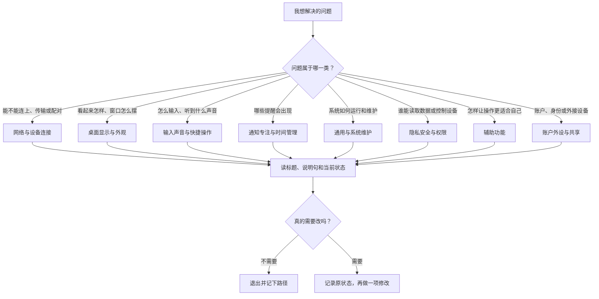

# 从系统偏好设置到系统设置：界面演进与学习地图

进入 macOS 系统设置时，先不要急着记住一长串菜单名称。它的核心结构是：左侧负责把功能分组，右侧负责解释和修改当前分组里的设置，弹窗负责处理需要额外确认、选择或认证的动作。只要能分清这三层，即使当前界面全是英文，也能沿着“我想解决什么问题”找到正确位置。

> [!info] 学完这一篇以后，你应该能做到
>
> - 解释 `System Preferences` 和 `System Settings` 在学习资料中为什么会同时出现。
> - 看懂左侧栏中网络、外观、账户、隐私与辅助功能这些大类的作用。
> - 用完整英语说出“我在哪个页面、看到什么状态、准备做什么”。
> - 在不改动任何设置的情况下，完成一次可靠的界面定位和核对。

## 名称变化不是两个不同的软件

较早版本的 macOS 把设置应用称为 **System Preferences**。这个名称强调“个人偏好”：你根据自己的习惯选择桌面样式、声音、键盘行为和账户选项。现在的 macOS 使用 **System Settings**。`settings` 更像“系统当前采用的一组配置”，它提醒你：有些项目不只是视觉偏好，还会影响网络连接、隐私授权、设备安全、其他用户和共享服务。

两个名称在英语学习中都要认识，但使用场景不同：

| 英文表达 | 常见中文 | 在什么时候会看到 | 不要误解成 |
| --- | --- | --- | --- |
| System Preferences | 系统偏好设置 | 旧版教程、旧截图、旧帮助文章 | 另一个需要安装的软件 |
| System Settings | 系统设置 | 本机当前界面、较新的 macOS 教程 | 只有“系统级危险操作”的页面 |
| preference | 偏好、习惯设置 | 描述用户选择的文字或旧名称 | 每个开关都毫无影响 |
| setting | 设置、配置项 | 页面标题、说明句、帮助文章 | 只能通过命令行修改的参数 |
| option | 选项 | 开关、单选项、下拉框和复选框附近 | 必然可以随意选择的功能 |
| control | 控件 | 描述按钮、开关、输入框等可操作元素 | 只指“控制中心”这个页面 |

名称变化带来的实际学习方法也不同。看到旧资料写“Open System Preferences”，你可以把它翻译成“打开系统设置”，然后按本机侧边栏寻找同名或近义的类别。看到本机的 `System Settings`，不要逐字翻成“系统的设定”；把它理解成“管理这台 Mac 当前运行方式的入口”更准确。

> [!note] 版本差异的处理原则
>
> 帮助文章里的路径与本机不完全一致时，不要直接认为某个功能消失了。先用页面搜索找关键词，再比对标题、说明句和控件类型。名称相近但说明句不同的项目，往往不是同一个功能。

## 把系统设置看成一张功能地图

系统设置不是一份按字母排列的词典。它把“你想管理的对象”放在相近位置：网络和设备连接在一起，屏幕与桌面外观在一起，账户与个人资料在一起，隐私和安全放在高风险操作附近，辅助功能集中放在需要改变交互方式的地方。



图中的第一步很重要：先判断问题，不要先猜英文。例如“耳机没有声音”通常从 `Sound` 开始；“网页打不开”不一定先去 `Wi-Fi`，也可能需要检查代理、VPN 或网络服务；“一个应用为什么能读到照片”应该去 `Privacy & Security`，不是去应用本身的普通设置。

## 左侧栏的阅读顺序

本机的左侧栏会因账户、设备、语言和已安装软件而略有不同，但稳定的分组逻辑不会变。下表按“解决的问题”整理高频入口。学习时请把同一行当成完整搭配读，而不是把 `Privacy`、`Security` 分开背。

| 想做什么 | 本机界面常见英文 | 软件语境中的准确理解 | 常见后续页面 |
| --- | --- | --- | --- |
| 连接网络 | Wi-Fi / Network / VPN | 无线连接、网络服务与虚拟专用网络 | Details, TCP/IP, DNS, Proxies |
| 使用外围设备 | Bluetooth / Displays / Sound | 蓝牙设备、显示器和声音设备 | Pair, Input, Output, Use as |
| 管理当前设备 | General | 系统版本、存储、语言、更新和迁移 | About, Software Update, Storage |
| 调整外观 | Appearance / Desktop & Dock / Wallpaper | 深浅色、窗口区域、桌面与墙纸 | Accent color, Stage Manager, Screen Saver |
| 找到内容 | Spotlight / Siri | 搜索结果与语音请求的行为 | Search Results, Siri Suggestions |
| 处理提醒 | Notifications / Focus / Screen Time | 通知展示、打断规则和使用限制 | Allow Notifications, Schedules, Downtime |
| 管理个人信息 | Apple Account / Internet Accounts | Apple 服务账户与第三方账户连接 | iCloud, Sign-In & Security, Mail |
| 控制敏感访问 | Privacy & Security | 权限、加密、安全检查和受限行为 | Location Services, Files and Folders, FileVault |
| 改变操作方式 | Accessibility | 视觉、听觉、语音、输入和指针辅助 | VoiceOver, Zoom, Spoken Content |

`General` 是特别容易被误读的词。它在日常英语里可以表示“总体的、一般的”，但在系统设置里是一个总入口，涵盖设备信息、更新、存储、语言、共享和迁移等系统级项目。不要把它理解为“没什么重要内容的普通设置”。

## 界面实例：用总览页建立地图，而不是背菜单

<a id="interface-system-settings-overview"></a>

> 本机截图未包含在公开版本中，以保护原图中的个人信息。

这张图中最值得先读的不是每一个标签，而是页面关系：左边是类别，中间是当前选中的 `General` 内容，右侧每一行通常带有箭头，表示还可以继续进入详情。下面的英文属于稳定、可复用的界面表达。

| 完整英文 | 中文理解 | 读法与使用场景 |
| --- | --- | --- |
| `Manage your overall setup and preferences for Mac.` | 管理 Mac 的整体配置和偏好。 | 这是说明句。`overall` 限定范围是整台 Mac，`setup and preferences` 同时覆盖系统配置和个人选择。 |
| `Software Update` | 软件更新。 | 页面名，不表示立即开始更新。进入后还要看可用版本、自动更新和安装按钮。 |
| `Storage` | 存储空间。 | 不是“保存”这个动作；这里指磁盘容量及其分类。 |
| `AirDrop & Continuity` | 隔空投送与连续互通。 | 两个功能放在同一入口，常和其他 Apple 设备协同工作有关。 |
| `Date & Time` | 日期与时间。 | 用来管理时间、时区和自动设置，不只是看当前时间。 |
| `Language & Region` | 语言与地区。 | 影响显示语言、日期格式、温度单位、排序和部分翻译行为。 |
| `Startup Disk` | 启动磁盘。 | 指开机时用哪个系统卷启动；它不是日常文件保存位置。 |
| `Transfer or Reset` | 传输或还原。 | 是影响范围较大的维护入口，看到它要先读说明和确认流程。 |

这组表达中有一个实用句型：`Manage + 名词短语`。它不表示“马上修改”，而是“进入一个可以查看、调整和维护的范围”。因此，你可以这样描述自己的动作：

> I opened **General** to manage the overall settings for this Mac, but I did not change anything.
>
> 我打开了“通用”来查看这台 Mac 的整体设置，但没有更改任何项目。

## 界面实例：同一个类别会继续展开成多个任务

<a id="interface-general-details"></a>

> 本机截图未包含在公开版本中，以保护原图中的个人信息。

当你已经进入一个类别，下一步要读的是“这行文字是信息、动作还是进入详情的入口”。右侧箭头通常表示还要打开一个新页面；开关表示当前状态可以切换；灰色小字往往说明条件、限制或状态，不应忽略。

| 英文表达 | 它在界面中的角色 | 你该问自己的问题 |
| --- | --- | --- |
| `About` | 设备信息入口 | 我需要的是型号、系统版本还是保修状态？ |
| `AppleCare & Warranty` | 服务与保修入口 | 这个页面显示的是资格信息，还是需要登录后才能看到的个人服务？ |
| `Login Items & Extensions` | 后台启动和扩展管理入口 | 我是在允许程序后台运行，还是在管理某种系统扩展？ |
| `Sharing` | 服务开关集合 | 开启后，谁能从哪里访问这台 Mac？ |
| `Time Machine` | 备份入口 | 当前备份目标、频率和可恢复范围分别是什么？ |
| `Device Management` | 组织管理信息 | 这台 Mac 是否受学校或公司策略管理？ |

不要看到箭头就点击。更可靠的阅读动作是：先读行标题，再读这一行下方有没有说明，最后判断它会打开详情、显示选择器，还是要求认证。这样可以避免把 `Time Machine` 当成普通“时间设置”，也不会把 `Device Management` 误认为“管理已连接设备”。

## 页面、控件与状态：三个层次必须分开

软件英语里最常见的误解是把一个页面名、一个按钮和一个状态词当成同一类词。它们在语法上和操作上都不一样。

| 层次 | 常见英语 | 它回答的问题 | 例句 |
| --- | --- | --- | --- |
| 页面或类别 | `General`, `Privacy & Security`, `Bluetooth` | 我在哪里？ | `I am in Privacy & Security.` |
| 可执行控件 | `Add`, `Remove`, `Change`, `Turn On` | 我能做什么？ | `Select Change to choose a different option.` |
| 当前状态 | `Connected`, `Off`, `Unavailable`, `Managed` | 现在发生了什么？ | `Bluetooth is currently off.` |
| 条件或结果 | `when`, `only if`, `requires`, `to allow` | 什么时候生效、为什么不能操作？ | `The option is available only when a device is connected.` |

下面四句话看起来都很简单，但表达的内容不同：

1. `Wi-Fi` 是一个类别或页面名称。
2. `Turn Wi-Fi On` 是一个动作。
3. `Wi-Fi is on` 是对当前状态的描述。
4. `Turn on Wi-Fi to join a network` 把动作和目的连起来，说明为什么要做。

如果你只背 `Wi-Fi = 无线网络`，只能识别第 1 句。把四种句子都读懂，才可以在真实界面里判断自己是否真的完成了操作。

## 两个完整操作案例

### 案例一：只读定位“存储空间”

目标不是清理文件，而是确认你能独立到达 `Storage` 页面并说清它的作用。

1. 打开 **System Settings**。
2. 在左侧栏选择 **General**。
3. 在右侧找到 **Storage**，先不要点击其他项目。
4. 进入后，只观察容量分类、系统建议和页面标题；不要删除文件、不要开启优化选项。
5. 退出前，用英语复述：`I opened General and selected Storage to check how space is being used on this Mac.`

这里的 `how space is being used` 比单独说 `storage` 更有用。它说明你看的不是一个抽象名词，而是“空间被哪些内容占用了”。

### 案例二：核对系统语言而不切换语言

这个案例训练你读条件和影响范围。切换系统语言会影响许多界面，所以第一次练习只观察。

1. 打开 **General**，选择 **Language & Region**。
2. 记录当前的首选语言、地区、日期格式和温度单位。
3. 找到与 `Preferred Languages`、`Region`、`Date format` 或类似文字相关的区域。
4. 不拖动语言顺序，不保存任何变更。
5. 用英语说明：`I checked the language and region settings, but I left the current preferences unchanged.`

`left ... unchanged` 是软件操作里非常实用的说法，表示“检查过，但保持原样”。它比“我没有动”更准确，也更适合向他人汇报。

## 常见误读与恢复方式

| 误读 | 为什么会出错 | 更可靠的做法 |
| --- | --- | --- |
| 把 `General` 当成“普通、可以跳过” | 忽略了它是系统维护入口 | 先看右侧列表，确认它包含更新、存储、语言和迁移等关键项目 |
| 看到 `Reset` 就理解成“恢复某一个小选项” | 没有读完整搭配 `Transfer or Reset` | 进入前查明具体对象和确认步骤；不确定时只读说明 |
| 只看蓝色按钮，不读灰色说明 | 灰色说明常写着条件、影响范围或权限要求 | 每次操作前读控件上下至少两行文字 |
| 把 `Off` 当成“功能坏了” | `Off` 只是当前关闭，未必是错误 | 寻找 `Unavailable`、`Failed`、`Requires` 等真正的受限或失败提示 |
| 跟着旧教程找不到 `System Preferences` | 忽略了名称随版本变化 | 用 `System Settings` 打开本机界面，再按功能名称搜索 |

> [!warning] 不要为了练习而修改高影响设置
>
> 语言、启动磁盘、共享、设备管理、系统更新和账户安全都可能影响其他应用或使用者。练习页面英语时，默认采用“进入、阅读、记录、退出”的只读路径。只有当你清楚原值、影响范围和恢复方法时，才改动一项设置。

## 英语表达规律：如何把路径说成一句完整的话

描述系统设置路径时，最实用的结构是：

```text
Open System Settings, choose [category], and select [item].
```

把方括号替换为本机页面名：

- `Open System Settings, choose General, and select Software Update.`
- `Open System Settings, choose Privacy & Security, and select Location Services.`
- `Open System Settings, choose Bluetooth, and select the device you want to pair.`

当你要描述状态，用 `is` 或 `are`，不要误用动作动词：

- `The option is turned off.`：选项当前关闭。
- `The Mac is managed by an organization.`：这台 Mac 当前受组织管理。
- `No device is connected.`：当前没有设备连接。

当你要描述目的，用 `to + 动词原形`：

- `Turn on Bluetooth to connect a keyboard.`
- `Open Storage to find large files.`
- `Check Software Update to see whether a newer version is available.`

这三类句子分别说路径、状态和目的。把它们组合起来，你就能说出完整的故障描述：

> I opened System Settings and chose Bluetooth. Bluetooth is turned on, but no device is connected. I want to pair my keyboard.

## 自测

1. `System Preferences` 和 `System Settings` 为什么可能指向同一类系统设置入口？
2. 你要确认电脑剩余空间，应该先进入哪个类别，再选择哪个项目？
3. `The option is unavailable` 与 `The option is off` 分别说明什么？
4. 用英文说出“我检查了语言和地区设置，但没有更改当前偏好”。

<details>
<summary>查看参考答案</summary>

1. 前者是旧名称，后者是当前系统常用名称；不同版本和资料可能保留旧叫法。
2. 先进入 `General`，再选择 `Storage`。
3. `unavailable` 表示当前不能使用，通常有条件、权限或设备限制；`off` 只表示当前关闭。
4. `I checked the language and region settings, but I left the current preferences unchanged.`

</details>

## 版本与来源

- 本机界面事实：macOS 27.0 Beta (26A5425a)，采集日期 2026-09-09。
- 功能原理参考：[Mac User Guide](https://support.apple.com/guide/mac-help/welcome/mh43558/mac) 与 [Change System Settings on Mac](https://support.apple.com/guide/mac-help/change-system-settings-mh15217/mac)。
- 本文中的按钮、路径和可见状态以本机界面实例为准；公开文档与本机版本不同的地方，需要在真实界面中再次核对。
