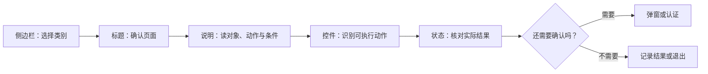

# 看懂一个设置页：侧边栏、详情页、弹窗与状态控件

一个英文设置页并不是一堆平铺的单词。每个元素都在回答一个不同的问题：侧边栏回答“去哪里”，标题回答“现在在哪”，说明句回答“这个功能有什么用”，控件回答“可以做什么”，状态回答“现在是什么结果”，弹窗回答“系统还需要你确认什么”。阅读顺序一旦固定，你就不需要靠猜中文来操作。

> [!info] 本篇要建立的能力
>
> - 一眼区分导航项、页面标题、说明句、按钮、开关、下拉菜单和状态提示。
> - 读到 `Details…`、`Advanced…`、`Learn More…` 时，能判断它们会打开什么，而不是盲点。
> - 用“路径 + 当前状态 + 下一步”的完整句子描述界面。
> - 知道何时应该退出、何时可以继续、何时必须先记录原来的值。

## 一页系统设置由五部分组成

最常见的页面结构可以拆成五部分。并不是每个页面都完全相同，但这个模型适用于 Wi-Fi、声音、显示器、隐私、通知和辅助功能。

| 部分 | 它做什么 | 常见英文 | 阅读时先看什么 |
| --- | --- | --- | --- |
| 侧边栏 | 在大类之间切换 | `Wi-Fi`, `General`, `Privacy & Security` | 目前选中的是哪一类 |
| 页面顶部 | 给出当前主题和总体说明 | `Wi-Fi`, `Manage your overall setup…` | 标题和第一句说明是否匹配你的目的 |
| 分组标题 | 把同类控件组织起来 | `Known Networks`, `Personal Hotspots` | 这一组管理的是设备、状态还是规则 |
| 可操作控件 | 触发动作或修改值 | `Details…`, `Add`, `Remove`, switch | 点击或改动后影响的对象 |
| 反馈信息 | 告诉你条件、进度或结果 | `Connected`, `Weak Security`, `Unavailable` | 是成功、进行中、关闭还是不能使用 |

把这五部分连起来，可以得到一个可重复使用的阅读路线：

这个流程比“看到蓝色按钮就点”安全得多。尤其是网络、隐私和共享页面，状态文字和说明文字往往比按钮名称更重要。

## 侧边栏：它是路径，不是功能说明书

侧边栏中的 `Wi-Fi`、`Bluetooth`、`Sound` 和 `General` 大多是**名词性入口**。它们告诉你应该进入哪里，却不保证告诉你进入以后能做什么。真正的动作一般在右侧内容区出现，例如 `Turn On Wi-Fi`、`Pair`、`Change` 或 `Remove`。

这一区分决定了英语句子的写法：

| 你想表达的意思 | 自然英语 | 为什么 |
| --- | --- | --- |
| 我进入了 Wi-Fi 页面。 | `I selected Wi-Fi in System Settings.` | `Wi-Fi` 是被选择的页面。 |
| 我打开了 Wi-Fi。 | `I turned on Wi-Fi.` | `turn on` 才是改变状态的动作。 |
| Wi-Fi 目前已开启。 | `Wi-Fi is on.` | `is on` 描述状态。 |
| 我查看了网络详情。 | `I opened the network details.` | `details` 是进入更深层内容。 |

不要用 `I opened Wi-Fi` 来代替所有情况。别人仍能猜到意思，但它没有说明你是打开页面、打开开关还是查看详情。在远程排障或向客服描述问题时，这种差别会让对方给出完全不同的下一步。

## 内容区：先找句子的主语，再看控件

页面顶端常有一句灰色或较小的说明。它往往比标题更完整，例如 Wi-Fi 页面的说明会表达“把 Mac 无线连接到互联网”“打开 Wi-Fi 后选择网络加入”。你可以把这类句子拆成四部分：

| 句子部分 | 要找的内容 | 示例问题 |
| --- | --- | --- |
| 对象 | 谁或什么受影响 | `this Mac`、`nearby personal hotspots` 是谁？ |
| 动作 | 系统让你做什么 | `turn on`、`choose`、`join` 分别是什么动作？ |
| 条件 | 何时生效或何时可见 | `when no Wi-Fi network is available` 限定了什么？ |
| 结果 | 成功后或当前会怎样 | `Connected`、`You will be notified` 表示什么？ |

例如下面这句：

> `Allow this Mac to automatically discover nearby personal hotspots when no Wi-Fi network is available.`

它不是在说“这里有热点”。它的主语是 `this Mac`，核心动作是 `discover`，方式是 `automatically`，条件由 `when` 引出。完整意思是“当没有可用 Wi-Fi 网络时，允许这台 Mac 自动发现附近的个人热点”。理解这种句子以后，你就知道它不是“连接热点”的按钮，而是一条自动发现规则。

## 界面实例：从 Wi-Fi 页面辨认层级

> 本机截图未包含在公开版本中，以保护原图中的个人信息。

图片中会出现本机网络名称和其他动态数据；它们只用于观察页面结构，不是学习词汇，也不写入搜索和练习内容。真正需要学习的是稳定的系统表达和它们之间的关系。

| 稳定界面表达 | 类型 | 它告诉你什么 | 看到后该怎么读 |
| --- | --- | --- | --- |
| `Set up Wi-Fi to wirelessly connect your Mac to the internet.` | 说明句 | 本页的目的 | `to wirelessly connect` 说明 Wi-Fi 的用途，不是当前连接状态。 |
| `Turn on Wi-Fi, then choose a network to join.` | 操作步骤 | 动作顺序 | `then` 表示先开开关，再从列表选择网络。 |
| `Learn More…` | 帮助按钮 | 打开解释资料 | 三个点表示还会出现下一层，不等于立即执行配置。 |
| `Connected` | 状态 | 已建立连接 | 是结果词；只有它出现时，才可说网络已经连上。 |
| `Weak Security` | 风险提示 | 当前网络的安全性较弱 | 它不是“信号弱”，也不等于 Mac 已经断网。 |
| `Details…` | 详情按钮 | 打开当前网络的进一步设置 | 常见后续内容包括地址、DNS、代理和自动加入。 |
| `Known Networks` | 分组标题 | Mac 已经记住的网络 | 这里的 `known` 是“已被系统认识”，不是“我本人认识”。 |
| `Other Networks` | 分组标题 | 当前可见但未归入已知列表的网络 | 不应把列表中的网络名称当作固定英文词汇。 |
| `Advanced…` | 深层设置按钮 | 打开更复杂、影响更大的配置 | 进入前先确认自己要找的是 DNS、代理还是其他规则。 |

这里有三个极易混淆的词：

1. `connected` 表示已经连上，是**当前结果**。
2. `available` 表示可以使用，是**条件满足**。
3. `known` 表示系统已有记录，是**历史关系**。

同一个网络可能 `known` 但并没有 `connected`；一个网络也可能 `available`，但你还没有加入。把三个词混成“有网络”，就无法准确描述问题。

## 控件不是同一种“按钮”

英语里把各种可操作元素统称为 `controls`，但具体控件的动作和风险不同。理解控件类型，能帮你预测下一步界面会怎样变化。

| 控件 | 视觉特征 | 常见英语 | 操作后的预期 | 练习时的原则 |
| --- | --- | --- | --- | --- |
| 开关 | On / Off 的滑块 | `Turn On`, `Allow`, `Enable` | 状态会从开到关或从关到开 | 修改前记录原值 |
| 普通按钮 | 文字或图标区域 | `Add`, `Remove`, `Change`, `Done` | 立即执行动作或提交选择 | 先读按钮附近说明 |
| 省略号按钮 | 名称后有 `…` | `Details…`, `Advanced…`, `Other…` | 打开子页、弹窗或选择器 | 把它当作“继续进入”，不是完成操作 |
| 下拉菜单 | 显示当前选项 | `Automatic`, `Notify`, `Never` | 展开一组互斥选项 | 先看当前值，再看候选值 |
| 复选项 | 独立的勾选状态 | `Show`, `Allow`, `Use` | 多个选项可以同时成立 | 逐项判断影响范围 |
| 列表行 | 条目右侧有箭头或更多按钮 | `Show Detail`, `Edit` | 进入该条目的详情 | 先确认对应的是哪一个对象 |

`Details…` 与 `Show Detail` 看起来相近，却不必完全等同。前者通常是一个明确命名的详情入口；后者可能是每一个列表行右边的通用操作。对英语学习来说，重点不是背“detail = 详情”，而是知道这些词引导你从摘要走向更具体的信息。

## 状态词：不要只凭颜色判断

很多系统界面用颜色区分状态，但颜色在深色模式、高对比度模式和屏幕录制中都可能变化。可靠的判断应建立在文字上。

| 状态表达 | 准确含义 | 不能推出什么 | 可以怎样说 |
| --- | --- | --- | --- |
| `On` | 功能处于开启状态 | 它一定工作正常 | `The option is turned on.` |
| `Off` | 功能处于关闭状态 | 功能损坏或不存在 | `The option is currently off.` |
| `Connected` | 已与网络或设备建立连接 | 所有网络服务都可用 | `The Mac is connected to a network.` |
| `Unavailable` | 当前条件下不能使用 | 永远不会出现 | `This option is unavailable right now.` |
| `Disabled` | 控件被系统暂时禁止操作 | 用户主动关闭了功能 | `The button is disabled because a condition is not met.` |
| `Requires` | 还缺少一个条件 | 只要点击就能继续 | `This action requires authentication.` |
| `Weak Security` | 网络配置的安全性较弱 | 无线信号弱 | `The network shows a weak security warning.` |

`disabled` 和 `off` 是最值得分开的两个词。`off` 是某项功能的值；`disabled` 是你当前无法操作这个控件。一个开关可以是 off 但仍然可以切换；一个按钮可以显示在页面上却被 disabled。遇到灰色控件时，先找它附近的 `requires`、`only when`、`not available` 或系统说明，而不是反复点击。

## 弹窗与认证：它们在要求你做决定

弹窗不是“打扰操作的广告”。在系统设置中，它通常表示下面四种情况之一：

| 弹窗目的 | 常见英文 | 你需要确认什么 |
| --- | --- | --- |
| 选择对象 | `Choose…`, `Select…`, `Add…` | 选的是哪一个网络、文件、账户或设备 |
| 确认影响 | `Are you sure?`, `This will…` | 修改会影响哪些设置、能否恢复 |
| 身份验证 | `Authenticate`, `Use Touch ID`, `Enter Password` | 是否有权限执行，是否要继续 |
| 错误说明 | `Could not…`, `Failed`, `Try Again` | 哪一步失败，系统建议的下一步是什么 |

看到弹窗后，正确的顺序是：读标题、读第一段说明、找主要动作按钮、确认取消按钮在哪里，再决定是否继续。不要只凭蓝色、红色或位置猜测哪个按钮“安全”。

> [!warning] 认证窗口不是练习素材
>
> 练习系统英语时，如果页面要求输入密码、使用 Touch ID 或批准设备访问，可以先阅读弹窗文案，然后选择 `Cancel`。不要为了补全一张图或完成一条练习而输入凭据、改变权限或确认高影响操作。

## 两个完整操作案例

### 案例一：检查当前网络状态，不加入新网络

目标：区分“已连接”“已知”和“可见”的网络状态，而不修改连接。

1. 打开 **System Settings**，在侧边栏选择 **Wi-Fi**。
2. 在内容区找到当前网络附近的状态文字。只记录 `Connected`、安全提示和信号图标代表的含义，不记录网络名称。
3. 找到 **Known Networks** 与 **Other Networks** 两个分组，说明它们分别表示什么。
4. 不点击网络行，不点击 **Details…**，不输入密码。
5. 用英语报告：`Wi-Fi is on. I can see the current connection status, known networks, and other available networks. I did not join or change any network.`

这段话把状态、观察范围和“未执行的动作”说清楚。最后一句很重要：在帮助他人排查时，`I did not change any network` 能避免对方误以为你已经改过配置。

### 案例二：进入详情后原样返回

目标：学习省略号按钮的含义，练习“进入详情但不修改”的表达。

1. 在 Wi-Fi 页面确认当前网络旁边有 **Details…**。
2. 点击 **Details…**，只阅读页面标题、左侧或顶部的标签，不改任何开关、文本框或菜单值。
3. 用返回按钮回到 Wi-Fi 列表。
4. 再次确认原来的连接状态仍在。
5. 用英语说明：`I opened the network details to review the settings, then went back without making changes.`

`to review the settings` 表示“为了查看设置”，比 `to see settings` 更自然。`went back without making changes` 表示进入过下一层但没有留下修改，适用于很多系统设置操作。

## 把观察和推测分开说

软件界面最容易让人误说的一点，是把自己看到的内容直接推断成系统已经完成了某件事。学习时应把句子分成三类：**观察**、**确认**和**推测**。观察只说界面实际显示的文字；确认要有明确状态或重新进入页面的证据；推测必须保留条件，不把它说成事实。

| 说法类型 | 推荐英文 | 中文含义 | 为什么可靠 |
| --- | --- | --- | --- |
| 观察 | `The page shows a Connected status.` | 页面显示“已连接”。 | 只描述看见的文字。 |
| 确认 | `The connection remained active after I reopened the page.` | 重新打开页面后，连接仍然有效。 | 有第二次核对的证据。 |
| 推测 | `The option may be unavailable because a required device is not connected.` | 该选项可能因所需设备未连接而不可用。 | `may be` 明确这是基于条件的判断。 |
| 不可靠的断言 | `The setting worked because I clicked it.` | 我点过，所以设置成功了。 | 点击不是结果证据。 |

这套区分在遇到英文错误提示时尤其有用。假如页面显示 `Could not connect`，你可以说 `The Mac could not connect to the network.`；如果只看到加载动画，应该说 `The connection is still being checked.`；如果没有任何成功提示，则诚实地说 `I could not confirm that the change was applied.`。这些句子比“它不行”“我改好了”更容易让别人继续帮助你。

## 自测

1. `Known Networks`、`Other Networks` 和 `Connected` 分别描述什么？
2. `Details…` 为什么不等于“已经完成设置”？
3. 一个按钮是 `disabled` 时，为什么不能简单理解为“功能已关闭”？
4. 用英文描述：你打开了一个详情页，只读了内容，然后没有改动就返回。

查看参考答案

1. `Known Networks` 是系统已记录的网络；`Other Networks` 是当前可见的其他网络；`Connected` 是当前已经建立连接的状态。
2. 三个点表示点击后还有下一层页面、弹窗或选择器，是否完成取决于后续操作和状态反馈。
3. `disabled` 表示控件现在不能操作，原因可能是权限、条件或上级设置；`off` 才是功能值为关闭。
4. `I opened the details page, reviewed the information, and went back without making any changes.`

## 版本与来源

- 本机界面事实：macOS 27.0 Beta (26A5425a)，采集日期 2026-09-09。
- 功能原理参考：[Mac User Guide](https://support.apple.com/guide/mac-help/welcome/mh43558/mac) 与 [Connect your Mac to the internet using Wi-Fi](https://support.apple.com/guide/mac-help/connect-to-the-internet-mh11939/mac)。
- 本篇不把网络名称、设备名称、IP 地址、MAC 地址或个人账户信息作为学习内容；这些内容在图片中仅作为本机动态数据存在。
