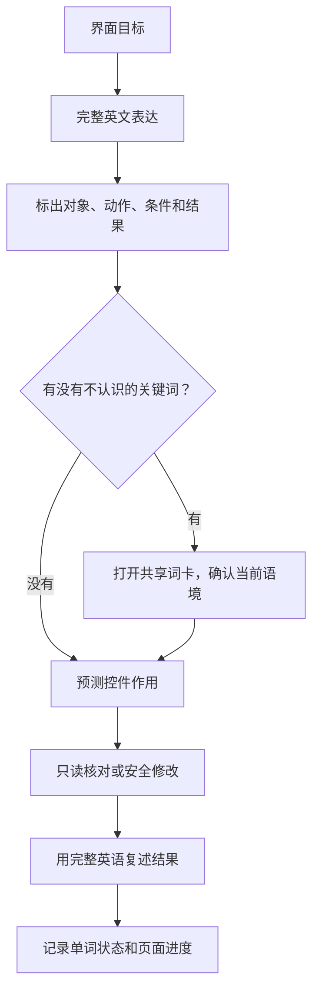

# 把界面英语学成操作能力：完整表达、词卡与复习方法

软件英语的终点不是把 `Allow`、`Details`、`Connected` 背成中文，而是在真正的设置页里看懂一整句说明，知道哪些按钮可以点、改动后会影响什么，并能用英文向别人说明你做了什么。本篇给出一套固定练习循环：先看页面目标，再读完整表达，然后查必要词，最后通过一次可恢复的操作验证理解。

> [!info] 三条学习原则
>
> 1. 先学完整表达，再拆单词；界面语言的意义往往来自搭配和条件。
> 2. 一个词只有一份学习状态；在讲义、查词、文章或词汇页标记后，应以同一份状态继续复习。
> 3. 页面“已读”不等于词汇“已掌握”；阅读进度和单词掌握必须分别判断。

## 为什么单词本身不够

如果只记 `allow = 允许`，你仍然无法判断下面三句分别在要求什么：

| 完整表达 | 直译容易漏掉的内容 | 软件里的实际意思 |
| --- | --- | --- |
| `Allow this Mac to use your location.` | `this Mac` 是被授权的主体 | 允许这台设备使用位置数据，不是允许某个人使用。 |
| `Allow apps to access your photos.` | `apps` 是复数主体，`access` 是访问权限 | 为应用授予照片访问权限，通常会影响隐私。 |
| `Allow notifications when the screen is locked.` | `when` 限定时间条件 | 只讨论锁屏期间通知如何展示，不是打开所有通知。 |

单词 `allow` 在三句中含义相近，但授权对象、资源和条件不同。软件界面真正决定操作结果的是整条关系：**谁被允许做什么，在什么条件下，对哪个对象产生影响**。所以学习顺序应该是：

这张流程图有一个刻意的顺序：词卡在“完整表达之后”。先从界面看到 `Allow apps to access your photos`，再查 `access`，你会知道它在这里是“访问资源”；如果脱离界面先查词，词典可能给出“通道、接近、接入”等多种义项，反而增加负担。

## 一条界面表达要怎样读

建议每次用四个问题拆句子。它们比传统的“主谓宾”更贴合软件操作。

| 问题 | 要找什么 | 常见语言线索 | 示例 |
| --- | --- | --- | --- |
| 管谁或管什么？ | 主体、设备、应用、文件、账户 | `this Mac`, `apps`, `your account` | `This Mac` 是动作承受者还是执行者？ |
| 系统让它做什么？ | 动作或权限 | `allow`, `connect`, `show`, `require` | 要连接、显示、允许还是要求？ |
| 作用到哪里？ | 资源或目标 | `to a network`, `your photos`, `in the menu bar` | 改动影响网络、个人资料还是显示位置？ |
| 何时或为什么？ | 条件、例外、结果 | `when`, `only if`, `because`, `to` | 这个选项什么时候有效？ |

以句子 `Show notifications when the display is sleeping.` 为例：

- 动作是 `Show`，意思是显示。
- 目标是 `notifications`，不是某个应用本身。
- 条件是 `when the display is sleeping`，即显示器休眠时。
- 因此它不能简单翻成“开启通知”；它讨论的是一个具体时段的通知展示方式。

当一句话没有动词时，也不要觉得它“不完整”。很多页面名和标签就是名词短语，例如 `Background Items`、`Login Options`、`Password Required`。它们需要和下方说明、右侧开关或当前值合起来读。

## 词卡该回答什么问题

点词打开词卡时，不要立刻只看中文释义。正确的词卡顺序是：读词形和发音、确认本界面的词性与语境、回到原句、再决定学习状态。

| 词卡区域 | 你需要得到的信息 | 例子 |
| --- | --- | --- |
| 单词与发音 | 这个词怎么读，词形是否变化 | `connected` 是 `connect` 的过去分词或形容词性状态。 |
| 当前界面语境 | 这个词在这里具体指什么 | `network` 在 Wi-Fi 页多指网络连接环境，不是抽象人际网络。 |
| 完整句 | 它跟谁搭配、由什么条件限定 | `connected to a network` 是固定的状态搭配。 |
| 通用词典义 | 这个词还有哪些常见意思 | 用于扩展，不替代当前界面解释。 |
| 学习状态 | 我现在是否能在原句里认出并正确使用它 | 学习中、困难词、已掌握应反映实际表现。 |

举例来说，`pair` 在日常英语里有“一对”的名词义，也有“配对”的动词义。在蓝牙页面，看到 `Pair` 通常是一个动作按钮；你应该记住的是 `pair a device`，而不只是“pair = 一双”。同样，`forget` 在 Wi-Fi 页面可能意味着“让 Mac 不再保存该网络”，它不是人际语境里的“忘记”。

> [!tip] 用原句判定是否掌握
>
> 遮住中文后，能看懂单词但不能解释整句的条件或对象，只能算“认识词形”，仍应标记为学习中。能在另一个相似页面正确判断它是状态、动作还是权限，才适合标记为已掌握。

## 学习状态怎样标才不自欺

学习状态的作用是安排下一次注意力，不是奖励自己。以下判断标准适用于所有产品中的同一张词卡。

| 状态 | 适合什么情况 | 下一次复习要做什么 | 不适合什么情况 |
| --- | --- | --- | --- |
| 未学 | 还没有在真实表达里看过，或完全不能识别 | 先读完整句和语境解释 | 只是“没背过”，但已能熟练理解 |
| 学习中 | 能认出词，但需要看中文、上下文或提示 | 在不同界面例句里再判断一次 | 点击过一次词卡就立刻标已掌握 |
| 困难词 | 经常混淆词性、方向、条件或相似词 | 建立对比句，优先反复复述 | 只是词很长、但实际已能用 |
| 已掌握 | 能看懂原句并说明它控制什么 | 间隔一段时间后再抽查 | 只记住中文释义，不能判断界面作用 |

例如 `available` 很容易被误标为已掌握，因为很多人知道它是“可用的”。真正的检查是：你能否区分 `available networks`、`available only when connected`、`not available in your region`？三句分别谈可见资源、条件限制和地区限制。不能区分时，它仍然是学习中或困难词。

## 界面实例：把 General 的总览句读完整

> 本机截图未包含在公开版本中，以保护原图中的个人信息。

页面顶部的 `Manage your overall setup and preferences for Mac, such as software updates, device language, AirDrop, and more.` 是一个很好的学习材料。不要把它变成几十个散词卡，而要先看句子的组织方式。

| 片段 | 它的角色 | 语境解释 |
| --- | --- | --- |
| `Manage` | 动作动词 | 表示进入管理范围，不等于立即修改。 |
| `your overall setup and preferences` | 动作对象 | 指整台设备的一组配置与个人偏好。 |
| `for Mac` | 作用对象 | 限定这些设置属于这台 Mac。 |
| `such as` | 举例连接 | 后面列的是例子，不是完整清单。 |
| `software updates, device language, AirDrop` | 具体项目 | 它们是 General 中可继续进入的功能。 |

用这个句子练习时，建议按三轮进行：

1. **理解轮**：看中文解释，指出 `such as` 后面的项目只是举例。
2. **遮挡轮**：只看英文，口头说出“管理 Mac 的整体配置，例如更新、语言和隔空投送”。
3. **迁移轮**：打开 General 页面，选择其中一个项目，用同一结构造句：`I opened General to manage the overall settings for this Mac.`

第三轮才是关键。能把一个说明句迁移到真实操作中，才说明你学到的是语言关系。

## 朗读不是机械重复

朗读功能适合练节奏、重音和完整搭配，但不应该替代理解。对一个设置表达，推荐按下面的顺序播放和跟读：

1. 先听一遍原句，不看中文，猜它是页面名、状态还是说明。
2. 显示中文，确认对象、动作和条件。
3. 跟读一遍完整句，停在连接词前后，例如 `only when`、`in order to`、`because`。
4. 关掉原句，尝试从中文意图复述英文的大意。
5. 回到页面，检查这个句子是否真的对应当前控件或说明。

对较短的项目名，朗读仍然有价值，但要加上搭配。例如不要孤立重复 `Details`，而读 `Open Details to review the network settings.`；不要孤立重复 `Connected`，而读 `The Mac is connected to the selected network.`。这样发音、词义和操作会绑定在同一个记忆单元里。

## 两个完整操作案例

### 案例一：把“已连接”从一个词变成一次完整说明

1. 打开 **Wi-Fi** 页面，找到当前状态区域。
2. 先只读状态词，不点击网络、详情或高级设置。
3. 分别回答：谁连接了什么？系统显示的是成功、过程还是失败？有没有任何安全提醒？
4. 用英语组成一段观察：`Wi-Fi is on, and this Mac is connected to a network. I can also see the network status and a security message.`
5. 点开 `connected`、`network` 和 `security` 的词卡，确认它们在这一句中的语境义；如果不能解释三者的区别，标学习中。

这项练习不需要改变任何设置，但它要求你把三个词连成一个可以报告的状态句。

### 案例二：练习“查看后恢复原位”的语言

1. 选择 **General**，进入 **Language & Region**。
2. 读出当前值和它控制的范围，但不要调整语言顺序、地区或格式。
3. 用返回按钮回到 General。
4. 再次进入，确认页面仍显示原来的值。
5. 说出完整报告：`I reviewed the language and region settings, returned to General, and confirmed that the original preferences were unchanged.`

这里的 `confirmed` 表示你做了再次核对；`were unchanged` 明确没有修改被保存。这比简单说 `I did not change it` 多了一层可验证的信息。

## 复习时如何避免“只会这一页”

每周从不同类别抽三条表达：一条网络状态、一条权限说明、一条显示或声音选项。不要看中文，先判断它们属于页面名、动作、状态还是条件；再打开相应页面验证。这个跨页面检查能暴露很多假熟练，例如：

| 你以为会的词 | 换到另一个页面后容易出现的误解 | 应该建立的对比 |
| --- | --- | --- |
| `allow` | 只知道“允许”，忽略谁被允许访问什么 | `allow apps to access…` 与 `allow this Mac to…` |
| `show` | 以为都是“打开功能” | `show in menu bar` 与 `show notifications` |
| `remove` | 不知道移除的是列表记录、权限还是设备 | `remove a network` 与 `remove an app from the list` |
| `available` | 只理解成“有” | `available networks` 与 `available only when…` |
| `require` | 把“需要”当成建议 | `require a password` 是强制条件 |

你不需要把每个词都立刻转成已掌握。稳定的学习方式是：在同一词出现至少两个不同系统语境时，都能说出对象、动作和条件，再提高状态。

## 为一个词建立最小而完整的记忆卡

词卡的信息很多，但每次复习不必把每一栏都强行背下来。对软件英语而言，一张真正有用的记忆卡只需要固定回答五个问题：它是什么词性、在这个页面指什么、和哪些词连用、控制什么结果、我最容易把它和谁混淆。下面以 `require` 为例。

| 问题 | 对 `require` 的回答 | 为什么要这样记 |
| --- | --- | --- |
| 它是什么？ | 动词，表示“要求成为必要条件”。 | 不是表示礼貌建议的 `recommend`。 |
| 页面里指什么？ | 系统规定某项条件必须满足。 | 例如需要密码、需要认证、需要连接设备。 |
| 怎么搭配？ | `require a password`、`require authentication`、`requires macOS…` | 连同宾语读，知道系统到底要求什么。 |
| 控制什么结果？ | 条件没满足时，后续动作不能完成或控件不可用。 | 能解释为什么页面没有按预期继续。 |
| 容易和谁混？ | `need`、`ask for`、`allow`。 | `need` 可以是事实需求，`require` 更像规则或强制门槛。 |

把这五项写成一句话，就是：`This action requires authentication before macOS can apply the change.` 这句话包含了动作、必要条件、执行主体和结果。你在别的权限页看到 `requires` 时，不必重新背一遍，只要替换动作或条件即可。

同样的办法也适用于 `forget`、`join`、`share`、`erase` 这类看起来简单、但在系统设置中可能有明确后果的词。不要把“看过词卡”当作任务完成；要问自己：如果屏幕上的中文被遮住，我能否根据英文说明判断现在是否安全、下一步应该做什么？

## 怎样把错误变成下一轮复习材料

真正有价值的困难词不是“长词”，而是会导致误操作的词。每次看错时，记录错的是哪一种关系，而不是只记“我又错了”。

| 错误类型 | 典型误解 | 应写下的对比 | 下次怎么检查 |
| --- | --- | --- | --- |
| 对象错 | 把 `this Mac` 当成当前 App | `allow this Mac` 与 `allow apps` | 指出每句里谁得到权限。 |
| 状态错 | 把 `unavailable` 当成 `off` | 不能使用与已关闭 | 说出是否还能点击控件。 |
| 时间条件错 | 忽略 `when` 或 `until` | 立即生效与条件生效 | 圈出条件从句，再解释它限制什么。 |
| 影响范围错 | 把 `remove` 当成关闭开关 | 移除记录与切换状态 | 预测恢复时需要重新添加还是重新打开。 |
| 结果错 | 点击后默认认为成功 | 点击、保存、状态确认 | 重新打开页面寻找结果文字。 |

例如你曾把 `Forget This Network` 理解成“暂时断开网络”，就不应该只把 `forget` 机械标成困难词。更有效的记录是：`Forget` removes the saved network information; it is different from disconnecting for now. 下次遇到同类表达时，先问“系统会不会保存这项信息”，再决定能否安全执行。

## 自测

1. 为什么 `allow` 不应该只背成“允许”？
2. 页面已读和单词已掌握分别代表什么？
3. 看到 `available only when…` 时，最需要继续找哪一部分？
4. 用英语说出“我查看了网络详情，但没有编辑任何条目”。

查看参考答案

1. 它必须和被授权的主体、资源和条件一起理解；不同对象会产生不同的权限含义。
2. 页面已读表示你完成了页面阅读；单词已掌握表示你能在真实表达里正确理解和使用该词。两者不能互相替代。
3. 继续找 `when` 后的条件，确认什么情况成立时选项才可用。
4. `I reviewed the network details, but I did not edit any entries.`

## 版本与来源

- 本机界面事实：macOS 27.0 Beta (26A5425a)，采集日期 2026-09-09。
- 系统设置页面的读取与词卡交互以 NEXUS 当前实现为准；系统功能原理参考 [Mac User Guide](https://support.apple.com/guide/mac-help/welcome/mh43558/mac)。
- 本篇不把账户、网络名称、设备编号或其他动态界面数据纳入学习词汇；学习的是可复用的系统表达和操作关系。
