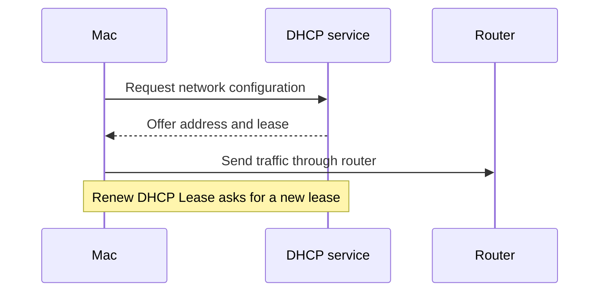

# 理解网络地址：TCP-IP、DHCP、路由器与硬件地址

TCP/IP 页面里的数字不需要背，也不应该复制到笔记里。你真正要学的是它们各自扮演的角色：Mac 怎样取得网络地址、把数据交给谁、IPv4 和 IPv6 是否采用自动配置、何时可以请求新的 DHCP 租约。只要能把“地址、配置方式、路由器、租约”分开，就能读懂大部分网络状态说明。

> [!info] 本篇学会后应能完成的判断
>
> - `Using DHCP` 说明地址怎样取得，不说明网络必然可用。
> - `Renew DHCP Lease` 是请求更新租约，不是刷新网页或重启 Wi-Fi。
> - `IP address`、`Router`、`Wi-Fi address` 的作用不同，任何具体值都不应进入学习文本。
> - `Automatically`、`Manually`、`Link-local only` 等选项改变的是配置策略，修改前必须记录原值。

## TCP/IP 页面到底管什么

`TCP/IP` 是一组网络通信协议的统称。在系统设置里，它不是让你学习协议实现细节，而是让你查看和选择本机怎样获得地址、怎样找到路由器、以及 IPv4 和 IPv6 使用何种配置方式。

| 页面元素 | 它回答的问题 | 常见误读 |
| --- | --- | --- |
| `Configure IPv4` | IPv4 地址由什么方式配置 | “当前 IPv4 地址是多少” |
| `Using DHCP` | 系统通过 DHCP 自动取得 IPv4 配置 | “网络已经成功访问互联网” |
| `IP address` | 当前连接使用的网络地址 | “设备永久身份证” |
| `Router` | 这一网络的路由器或网关信息 | “浏览器访问的网站地址” |
| `Renew DHCP Lease` | 向 DHCP 服务请求新的租约配置 | “让所有网络问题自动消失” |
| `DHCP client ID (if required)` | 某些网络要求的客户端标识字段 | “每个人都必须填写的密码” |
| `Configure IPv6` | IPv6 地址的配置策略 | “IPv6 地址本身的列表” |

页面上既有名词也有动作。`IP address`、`Router` 是信息标签；`Configure IPv4` 是配置入口；`Renew DHCP Lease` 是可能触发网络变化的动作。读到它们时，先判断“这是在描述当前值，还是邀请我做一个操作”。

## 界面实例：从配置方式读出网络来源

<a id="interface-wifi-tcp-ip"></a>

> 本机截图未包含在公开版本中，以保护原图中的个人信息。

图片中出现的 IPv4、IPv6、路由器和客户端标识值都是本机动态数据，因此不转录。下表保留的是可以迁移到任何系统设置页面的稳定英文。

| 完整英文 | 软件语境中文 | 怎样理解它 |
| --- | --- | --- |
| `Configure IPv4` | 配置 IPv4。 | 是一个选择配置方式的入口，不等于直接编辑地址。 |
| `Using DHCP` | 使用 DHCP。 | 当前 IPv4 通常由网络自动分配。 |
| `IP address` | IP 地址。 | 当前连接的网络地址；不是用户账户，也不是 Wi-Fi 地址。 |
| `Renew DHCP Lease` | 更新 DHCP 租约。 | 向网络请求新的自动配置；可能导致短暂重新连接。 |
| `DHCP client ID (if required)` | DHCP 客户端 ID（如需要）。 | `if required` 限定：不是所有网络都需要填写。 |
| `Configure IPv6` | 配置 IPv6。 | 和 IPv4 是两个独立的配置区域。 |
| `Automatically` | 自动。 | 系统或网络自动提供配置，而不是你手动输入。 |
| `Router` | 路由器。 | 这里指本网络把数据转向外部网络的设备或地址。 |
| `IPv6 address` | IPv6 地址。 | 是网络地址的一种格式；列表中的具体值不需要背。 |
| `Prefix length` | 前缀长度。 | 用来定义 IPv6 网络范围的技术字段，通常只读查看。 |

`Using DHCP` 的语法很简短，但包含了关键的“方式”关系。你可以把它补成完整句：`The Mac is using DHCP to obtain an IPv4 configuration.` 这里 `to obtain` 说明 DHCP 的目的，是取得网络配置；它不是一个普通的“网络名称”。

## DHCP：自动分配和租约是什么意思

DHCP 可以理解为网络中的自动分配服务。Mac 加入网络后，通常会向网络请求地址、路由信息和其他必要配置；网络会在一段时间内把这些信息分配给设备，这段时间被称为 `lease`，即“租约”。



这张图只解释关系，不代表每个网络都会显示同样的细节。你在界面中需要记住的是：`Renew DHCP Lease` 是重新请求自动配置的动作，它可能帮助解决地址冲突或旧配置残留，但不会替你修复错误的 DNS、代理规则、认证门户或路由器故障。

| 情况 | 可以这样说 | 不应该这样说 |
| --- | --- | --- |
| 当前采用 DHCP | `IPv4 is configured using DHCP.` | “DHCP 证明互联网一定正常。” |
| 想检查地址来源 | `I want to review how the address is configured.` | “我要修改 IP。” |
| 需要尝试更新租约 | `I may need to renew the DHCP lease.` | “点一下就能修好网络。” |
| 看到客户端 ID 字段 | `The client ID is only needed if the network requires it.` | “每个用户都要填这个字段。” |

> [!warning] 更新 DHCP 租约会影响当前连接
>
> `Renew DHCP Lease` 不是纯阅读动作。它可能让网络连接短暂更新，并改变当前地址或网络状态。如果只是学习页面英语，请不要执行。只有在知道原网络可恢复、并且确实需要排查地址配置时，才在合适环境中使用。

## IPv4 与 IPv6：先分清“协议版本”和“配置方式”

`IPv4`、`IPv6` 很容易被初学者当作“两个地址”。更准确的说法是：它们是两种网络协议地址体系，系统可以为两者分别显示配置策略和当前信息。

| 项目 | 你在页面上看到的是什么 | 学习时应该关注什么 |
| --- | --- | --- |
| IPv4 | `Configure IPv4` 和当前地址信息 | 是自动、手动还是其他方式；不要记录具体地址。 |
| IPv6 | `Configure IPv6`、地址列表和前缀长度 | 配置是否自动；不要把地址列表当单词表。 |
| Router | 当前网络的网关信息 | Mac 通向其他网络时使用的出口关系。 |
| DHCP lease | 当前自动配置的租约关系 | 它可更新，但更新有网络影响。 |

页面里 `Automatically` 通常描述配置策略。它不等于“自动解决一切网络问题”，也不意味着用户从来不能进行任何设置。相对地，`Manually` 通常要求你输入网络管理员提供的具体信息；如果没有可靠来源，不应该尝试填写。

在英语表达上，`configured automatically` 和 `automatically configured` 都能使用，但前者更适合解释页面值：

> `IPv6 is configured automatically on this network.`

这句中的 `on this network` 再次限定了范围：不是全世界所有网络，也不是 Mac 的永久属性。

## 地址、路由器和硬件地址不要混为一谈

网络页面的多个“地址”指向不同层次。错误地把它们都叫“IP”会导致排查跑偏。

| 名称 | 页面中的含义 | 是否应写入笔记 | 问题出现时优先检查什么 |
| --- | --- | --- | --- |
| `IP address` | 当前网络为这台 Mac 使用的地址 | 否 | 配置方式、租约与当前网络状态 |
| `Router` | 网络出口或网关相关信息 | 否 | 网络管理员、路由器可用性和路径 |
| `Wi-Fi address` | 无线接口相关的设备地址 | 否 | 私有地址策略、设备登记要求 |
| `DNS server` | 负责名称解析的服务地址 | 否 | DNS 配置和域名解析现象 |
| `DHCP client ID` | 某些网络要求的客户端标识 | 否 | 是否明确要求填写、由谁提供值 |

你可以用不含具体数字的英语描述事实：

> `The Mac has an IPv4 address from DHCP, and the router information is shown on the same page.`

如果要请管理员帮助，给出页面结构和状态通常比把完整地址复制到聊天里更安全：

> `The Mac is using DHCP, but I need help checking whether the network is providing the correct configuration.`

## 两个完整操作案例

### 案例一：只读确认 IPv4 配置方式

1. 打开 **System Settings → Wi-Fi → Details… → TCP/IP**。
2. 找到 **Configure IPv4**，读出当前显示的是 `Using DHCP`、手动配置，还是其他选项。
3. 找到 **IP address** 和 **Router** 标签，但不要抄写具体值。
4. 读出 **Renew DHCP Lease** 按钮，解释它是请求更新配置而不是普通刷新。
5. 不修改下拉菜单，不点更新租约，选择返回或取消。
6. 用英语报告：`I reviewed the IPv4 configuration and confirmed that the Mac is using DHCP. I did not renew the lease or edit any address.`

`confirmed that` 后面接一个已经通过页面文字确认的事实；`did not renew or edit` 则明确你没有做高影响操作。

### 案例二：判断 DHCP 客户端 ID 是否需要填写

1. 在 TCP/IP 页面找到 **DHCP client ID (if required)**。
2. 注意括号中的 `if required`，回答“谁来决定是否需要？”答案是当前网络或网络管理员的要求，不是英语学习者自己猜测。
3. 不填写任何值，保持字段原样。
4. 如果你需要向管理员询问，可以使用：`Does this network require a DHCP client ID? If so, what value should I use?`
5. 在得到明确且可信的网络说明前，不保存任何手动输入。

这个案例训练的是条件问句。`If so` 指“如果确实需要”，比直接假定要填写更谨慎。

## 常见错误和恢复方式

| 错误 | 为什么不可靠 | 更好的做法 |
| --- | --- | --- |
| 看见 IP 地址就手动改 | 不知道地址由谁分配、是否会冲突 | 先读 `Configure IPv4` 和当前策略 |
| 把 Renew DHCP Lease 当成无风险刷新 | 它会请求新的网络配置 | 只在排查地址配置且知道恢复路径时使用 |
| 把路由器地址当成 DNS | 两者负责的网络功能不同 | DNS 问题进入 DNS 页，出口问题再看 Router |
| 为了练习填写 DHCP client ID | 字段可能只适用于特定网络 | 看到 `if required` 就先确认要求来源 |
| 把 IPv6 列表中的数字背下来 | 动态值对语言学习没有迁移价值 | 学配置策略和稳定标签即可 |

## 手动配置前必须问清的四件事

`Manually` 看起来像一个普通下拉选项，实际意味着系统不再完全依赖自动分配，而是需要你提供准确的信息。没有网络管理员给出的值时，不应该为练习英语而切换到手动模式。读到这类选项，先把下面四件事问清楚。

| 要问的问题 | 对应英语 | 为什么不能省略 |
| --- | --- | --- |
| 谁提供这些值？ | `Who provided these network settings?` | 防止把网上看到的示例地址填进当前网络。 |
| 这些值适用于哪一个网络？ | `Which network is this configuration for?` | 同一组地址不能随意迁移到其他 Wi-Fi。 |
| 原来的自动配置是什么？ | `What was the previous configuration method?` | 出问题时才有恢复点。 |
| 如何验证并恢复？ | `How can I verify the change and restore the original settings?` | 不能只知道怎样改，还要知道怎样回退。 |

如果管理员要求填写信息，先将请求复述成完整英语，确认双方理解一致：

> `You asked me to configure IPv4 manually for this network. Before I make the change, could you confirm the address, subnet mask, router, and DNS values?`

这句话没有替对方猜参数，也没有暴露当前值；它清楚说明了配置范围和需要确认的字段。若对方只说“改成手动”，但没有给出完整信息，合理的下一步是继续询问，而不是自行尝试。

## 用英文区分“地址问题”和“访问问题”

网络故障经常被一句“没有网络”掩盖。TCP/IP 页面帮助你把问题缩小，但它只能证明当前的地址与配置关系，不能单独证明所有服务正常。表达时应避免跳过证据。

| 现象 | 不准确的说法 | 更准确的说法 |
| --- | --- | --- |
| 没有看到地址信息 | `The internet is broken.` | `I cannot confirm that the Mac has received an IP configuration.` |
| 有地址但网页打不开 | `DHCP failed.` | `The Mac has an IP configuration, but a website is not loading.` |
| 不确定路由器是否可用 | `The router is wrong.` | `I can see router information, but I have not verified the network path yet.` |
| 准备更新租约 | `I will fix the network.` | `I am considering renewing the DHCP lease to request a new configuration.` |
| 有 IPv6 条目 | `IPv6 is the problem.` | `IPv6 is configured on this network; I need more evidence before changing it.` |

这类措辞的重点是保留事实边界：界面显示了什么、你还没有验证什么、下一步打算检查什么。它既适合英语学习，也适合真实地向网络管理员提交问题。

## 把网络路径说成一段可复现说明

当别人让你“看一下 TCP/IP”，不要只回复一个页面名。可以用下面的顺序说明自己实际做了什么：

```text
I opened System Settings and selected Wi-Fi.
I opened Details for the current network and selected TCP/IP.
I checked the IPv4 configuration method and the router field.
I did not renew the DHCP lease or enter any manual values.
```

这四句分别说明入口、层级、观察内容和操作边界。任何一项出现异常时，都可以补充一个事实句，例如 `The IPv4 setting is using DHCP.` 或 `The manual fields are empty.`，而不要把未经验证的原因写成结论。

## 自测

1. `Using DHCP` 和 `Connected` 分别说明什么？
2. 为什么不能把 `Renew DHCP Lease` 当成“网络修复按钮”？
3. `DHCP client ID (if required)` 中的条件是谁决定的？
4. 用英语说出“我查看了 IPv4 配置，但没有更新租约或编辑地址”。

<details>
<summary>查看参考答案</summary>

1. `Using DHCP` 说明 IPv4 配置通过 DHCP 自动取得；`Connected` 说明当前已与网络建立连接。两者不能互相替代。
2. 它只是请求新的自动配置，不能保证修复 DNS、代理、认证或路由器问题，而且可能影响当前连接。
3. 由当前网络或网络管理员的要求决定。
4. `I reviewed the IPv4 configuration, but I did not renew the lease or edit any address.`

</details>

## 版本与来源

- 本机界面事实：macOS 27.0 Beta (26A5425a)，采集日期 2026-09-09。
- 功能原理参考：[Change TCP/IP settings on Mac](https://support.apple.com/guide/mac-help/change-tcp-ip-settings-mchlp2498/mac)。
- 地址、路由器和客户端标识都是动态网络数据。本篇只记录稳定的系统表达、作用关系和安全操作边界。
