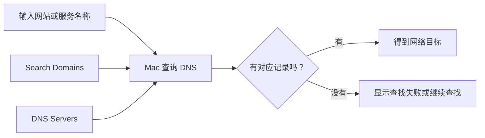

# 设置名称解析：DNS、搜索域与 WINS

DNS、搜索域和 WINS 都和“名称”有关，但它们解决的不是同一种问题。DNS 让设备把网站或服务名称找到对应的网络地址；搜索域帮助系统补全局部名称；WINS 和 NetBIOS 更多出现在兼容某些 Windows 网络名称的场景。看到它们在同一个详情页，不代表你应该一起修改。

> [!info] 本篇的安全底线
>
> DNS 服务器、搜索域、WINS 服务器、NetBIOS 名称和工作组值都可能由网络管理员、学校、公司或路由器策略决定。学习时可以阅读、比较和提问；没有明确来源的配置值时，不要新增、删除或手动填写。

## 先分清三个“名称”层次

在网络页面里，`name` 可能指网站域名、局部搜索后缀、设备名称或 Windows 工作组。中文都容易叫“名称”，英语却用不同术语区分。

| 名称类型 | 页面英文 | 它帮助系统做什么 | 典型使用场景 |
| --- | --- | --- | --- |
| 域名解析 | `DNS Servers` | 把域名解析为网络地址 | 访问网站、服务或内部域名 |
| 搜索后缀 | `Search Domains` | 补全短名称的查找范围 | 公司或学校内部服务 |
| Windows 名称服务 | `WINS Servers` | 支持某些旧式 Windows 名称解析 | 特定企业网络兼容场景 |
| 设备网络名 | `NetBIOS name` | 在某些局部网络中标识设备 | Windows 文件共享或设备发现 |
| 工作组 | `Workgroup` | 将设备归入一个工作组名称 | 旧式局域网组织方式 |

不要把 `DNS Servers` 理解成“存网站的服务器”。它指的是负责**回答名称该去哪里找**的服务器。也不要把 `Search Domains` 翻成“搜索网站”；它是系统在处理不完整名称时可能追加的域后缀。

## 界面实例：DNS 页面先读标签和列表状态

<a id="interface-wifi-dns"></a>

> 本机截图未包含在公开版本中，以保护原图中的个人信息。

图片中的具体服务器地址属于当前网络数据，不进入正文。稳定的系统英文如下。

| 完整英文 | 软件语境中文 | 阅读重点 |
| --- | --- | --- |
| `DNS Servers` | DNS 服务器。 | 一组用于名称解析的服务器配置。 |
| `Encrypted DNS Servers or IP addresses` | 加密 DNS 服务器或 IP 地址。 | 输入项可以接受不同类型的服务器标识；不代表可以随意使用任意值。 |
| `Search Domains` | 搜索域。 | 影响短名称的补全和查找范围。 |
| `No Search Domains` | 没有搜索域。 | 当前列表为空，不是网络失效提示。 |
| `Add` | 添加。 | 往当前列表新增条目，属于会改变配置的动作。 |
| `Remove` | 移除。 | 删除已选择的条目；未选择条目时按钮可能不可用。 |
| `Cancel` | 取消。 | 放弃当前未确认的编辑；仍应根据页面验证保存时机。 |
| `OK` | 确定。 | 确认本页编辑；之后要重新进入页面核对。 |

`No Search Domains` 是一个完整状态句的省略形式。它表达“当前没有配置搜索域”，不是“系统找不到任何域名”。理解这种简短状态很重要：页面里的 `No …` 往往只否定当前列表或当前条件，并不一定表示故障。

## DNS：名称解析的入口，不是“网速开关”

当浏览器访问一个名字时，系统需要把名字对应到网络上的目标。DNS 就参与这个查询过程。DNS 设置可能影响“某个名称能否被解析”“查询走哪个服务”“内部域名能否找到”，但它不会单独决定无线信号强度、账户认证或网页内容是否可用。



这张图的意思是：`DNS Servers` 决定系统向哪些名称解析服务询问；`Search Domains` 可能影响系统在查询短名称时怎样补全。它不是命令链，也不表示所有网络都会按照同一种配置处理。

| 现象 | 可能和 DNS 有关吗 | 还需要排除什么 | 合理的英文描述 |
| --- | --- | --- | --- |
| 已连接但某个域名打不开 | 可能 | 代理、VPN、浏览器、网站本身 | `The Mac is connected, but a name is not resolving as expected.` |
| 所有网页都慢 | 不一定 | 信号、网络拥堵、网站内容、设备性能 | `I cannot tell whether the issue is DNS-related yet.` |
| 内部服务只能输入完整地址访问 | 可能 | 搜索域、VPN、账户权限 | `I want to check whether a search domain is required.` |
| DNS 列表为空 | 不一定是问题 | 网络可能通过自动配置提供 DNS | `The list is empty, but the network may still provide DNS automatically.` |

`may still provide` 这种表达非常实用。它说明你知道列表为空这个事实，也保留了“自动配置可能仍在发挥作用”的可能性，避免把界面观察夸大成结论。

## Search Domains：补全范围，不是搜索历史

`Search Domains` 令人困惑的原因在于 `search` 在日常软件里常表示输入关键词查内容；在这里它表示系统解析简短网络名称时使用的附加域后缀。例如某些机构里，用户只输入一个内部主机短名，系统会结合搜索域继续尝试查找。普通家庭网络通常不需要手动设置它。

| 表达 | 它真正表示 | 不要理解成 |
| --- | --- | --- |
| `Search Domains` | 用于补全网络名称的域后缀列表 | 浏览器或 Spotlight 的搜索范围 |
| `No Search Domains` | 当前没有手动列出的搜索域 | DNS 服务完全不存在 |
| `Add` | 新增一个搜索域条目 | 自动修复所有打不开的网站 |
| `Remove` | 移除已选择的搜索域条目 | 临时隐藏一个搜索建议 |

若管理员让你加入一个搜索域，最安全的确认问句是：

> `Which search domain should be added for this network, and does it apply only to the internal service?`

这句话会让对方明确给出值、适用网络和用途。不要从别人屏幕上的内部域名猜一个类似的值填入本机。

## WINS、NetBIOS 和 Workgroup：兼容性设置要更谨慎

WINS 页面通常不代表每个人都需要设置。它保留的是某些网络环境中与 Windows 名称解析或旧式局域网发现相关的配置。对大多数个人 Mac 用户而言，最常见的学习任务是认识页面语言、理解它的适用范围，而不是修改任何字段。

<a id="interface-wifi-wins"></a>

> 本机截图未包含在公开版本中，以保护原图中的个人信息。

| 界面表达 | 中文理解 | 应该怎样判断 |
| --- | --- | --- |
| `NetBIOS name` | NetBIOS 名称。 | 某些局域网兼容场景里的设备名；不是 Apple 账户名。 |
| `Workgroup` | 工作组。 | 旧式或特定 Windows 网络组织名称；不是 macOS 用户组。 |
| `WINS Servers` | WINS 服务器。 | 与特定 Windows 名称服务有关，通常由管理员给出。 |
| `No WINS Servers` | 没有 WINS 服务器。 | 当前列表为空，不自动说明网络出错。 |
| `Add` / `Remove` | 添加 / 移除。 | 修改当前 WINS 列表，需要明确的管理员配置。 |

`Workgroup` 和 macOS 的 `Users & Groups` 很容易混淆。前者属于网络兼容与局域网组织概念，后者属于这台 Mac 上的本地用户和权限。虽然中文都可能被叫“组”，却不是同一层级。

> [!warning] 不要为了“让局域网能找到电脑”随意改 WINS
>
> 文件共享、打印机发现或公司内部资源访问异常，可能涉及账户、共享开关、网络策略、DNS、VPN 或防火墙。没有明确证据时，直接填写 WINS 服务器或更改 NetBIOS 名称不仅难以验证，也可能影响现有兼容性。先描述现象，再向管理员确认所需配置。

## 两个完整操作案例

### 案例一：只读判断 DNS 列表和搜索域状态

1. 打开 **System Settings → Wi-Fi → Details… → DNS**。
2. 分别观察 `DNS Servers` 与 `Search Domains` 两个标题。
3. 如果看到 `No Search Domains`，只记录“当前没有手动列出的搜索域”，不要推断网络不能解析名称。
4. 观察 `Add` 与 `Remove`；若 Remove 灰色不可用，解释它可能因为没有选中条目。
5. 不添加、不移除任何条目，返回上一页。
6. 用英语报告：`I reviewed the DNS Servers and Search Domains lists. I did not add or remove any configuration.`

### 案例二：向管理员确认内部服务名称问题

假设你已经确认 Wi-Fi 显示 Connected，但一个内部服务只能用完整名称访问。不要直接改 DNS 或搜索域，可以先这样沟通：

> `The Mac is connected to the network, but the internal service does not resolve when I use its short name. Should this network provide a search domain or a specific DNS server?`

这段描述包含四个有用事实：连接正常、问题出现在短名称、你没有假定原因、你请求的是管理员应提供的配置类型。对方若给出明确答案，再按指引操作并记录原值。

## 常见错误与恢复方式

| 错误 | 为什么会造成问题 | 更安全的替代动作 |
| --- | --- | --- |
| 把公开 DNS 地址复制进列表试运气 | 可能绕过公司、学校或家用网络的既有策略 | 先确认当前网络要求和问题现象 |
| 看见 No Search Domains 就认定 DNS 失效 | 搜索域只是补全短名称的一种配置 | 先区分完整域名与短名称的访问结果 |
| 把 WINS 当现代 DNS 的替代品 | 两者用途和适用网络不同 | 先问管理员是否存在 Windows 兼容要求 |
| 点击 Remove 却没确认选中对象 | 可能删除有效条目 | 先读当前行，再记录原值 |
| 用 Go Back 当作配置恢复 | 页面返回不一定撤销已确认的编辑 | 重新打开 DNS 或 WINS，核对条目是否仍存在 |

## `Add` 和 `Remove` 不是对称的“试试看”按钮

DNS 与 WINS 页面都使用列表来展示配置项，所以 `Add` 和 `Remove` 的动作会直接改变列表成员。它们看起来互为相反操作，但真实恢复并不总是对称：删除一个已存在的服务器后，你未必记得原值；新增一个服务器后，系统查询顺序也可能改变。因此，看到 Add 或 Remove 时，要比面对单纯开关更谨慎。

| 动作 | 操作前必须知道什么 | 操作后怎样验证 | 如果想恢复 |
| --- | --- | --- | --- |
| `Add` DNS server | 值由谁提供、适用于当前网络还是全局策略 | 新条目是否真的出现在正确列表，查询现象是否改变 | 删除刚添加的同一条目，并重新进入页面核对 |
| `Remove` DNS server | 当前选中的是哪一条、删除后是否还有其他解析来源 | 该条目是否从列表消失，网络是否仍能解析名称 | 需要准确的原值才能重新添加 |
| `Add` search domain | 这是给哪个内部服务或网络使用的后缀 | 短名称的解析范围是否符合预期 | 删除同一后缀，验证页面恢复为空或原列表 |
| `Remove` WINS server | 是否由组织网络要求保留 | 企业资源或局域网发现是否受影响 | 向管理员索取原服务器信息，不要猜测 |

如果 Remove 按钮是灰色的，最常见的原因不是系统故障，而是没有选中可移除的行。可用英语描述为：`Remove is disabled because no list item is selected.` 这比“Remove 不工作”更准确，也能帮助对方迅速定位问题。

在必要的受控维护中，应该先建立恢复记录：截图或安全地记录**由管理员提供**的原配置、操作时间、网络名称和预期影响。此处“记录”是为了恢复配置，不是把值放进英语笔记。英语讲义中依然只保留结构化表达，不保存动态地址。

## DNS 故障表达：从现象到假设的正确顺序

名称解析问题常被描述为“网络不能用”，但排查顺序应该从可观察现象开始，逐层缩小范围。下面的句子模板可以避免在没有证据时直接责怪 DNS。

```text
The Mac is connected to Wi-Fi.
An internal name / a website name is not resolving as expected.
I checked the DNS page, but I did not change the server list.
I need to confirm whether this network provides DNS automatically.
```

每句承担一个角色：第一句确认连接层；第二句说明名称问题；第三句交代已经做过的只读动作；第四句提出还需确认的条件。你可以依现象替换中间一句：

| 观察到的现象 | 可用表达 | 说明 |
| --- | --- | --- |
| 完整网站地址也无法打开 | `A website name is not resolving as expected.` | 只谈名称解析结果，不假定服务器故障。 |
| 只有内部短名称失败 | `The internal service does not resolve when I use its short name.` | 指向可能的搜索域或内部 DNS 问题。 |
| 完整名称正常、短名称不正常 | `The fully qualified name works, but the short name does not.` | 提供了非常有价值的比较证据。 |
| 不确定是否自动提供 DNS | `I need to verify whether DNS is provided automatically on this network.` | 将配置来源作为待确认事项。 |

`fully qualified name` 指完整的、带有全部域层级的名称。即使暂时不需要背这个术语，也应认识它和 `short name` 的对比关系：一个正常、另一个失败时，问题范围常比“完全无法联网”小得多。

## 与管理员沟通时应提供和不应提供的信息

向学校、公司或网络服务人员求助时，可以提供页面名称、状态词、错误现象、是否自动配置、是否做过修改；不应在普通聊天里发送密码、完整地址、设备唯一标识或截图中未处理的敏感内容。

| 可以提供 | 应避免公开发送 |
| --- | --- |
| `Wi-Fi is connected.` | 网络密码 |
| `Configure IPv4 shows Using DHCP.` | 完整 IP、路由器、DNS 或 MAC 值 |
| `The DNS server list has an entry / is empty.` | 内部服务地址或组织网络拓扑 |
| `No Search Domains is shown.` | 账户、设备名称和序列号 |
| `I did not change the configuration.` | 包含私人数据的整页截图 |

这份区分本身也是软件英语能力的一部分：能准确描述系统，不等于把系统中所有看见的信息全部说出去。

## 自测

1. `DNS Servers` 和 `Search Domains` 分别解决什么问题？
2. `No Search Domains` 能否直接证明 DNS 不能工作？
3. WINS 和 `Users & Groups` 为什么不能混为一谈？
4. 用英文说明“我查看了 DNS 列表，但没有添加或删除任何配置”。

<details>
<summary>查看参考答案</summary>

1. DNS Servers 用于名称解析服务；Search Domains 用于补全短名称时的域后缀查找范围。
2. 不能。网络可能自动提供 DNS，搜索域为空只说明没有手动列出的搜索域。
3. WINS 属于某些 Windows 网络名称兼容场景；Users & Groups 管理这台 Mac 的本地用户和权限。
4. `I reviewed the DNS list, but I did not add or remove any configuration.`

</details>

## 版本与来源

- 本机界面事实：macOS 27.0 Beta (26A5425a)，采集日期 2026-09-09。
- 功能原理参考：[Change DNS settings on Mac](https://support.apple.com/guide/mac-help/change-dns-settings-mh14127/mac) 与 [Change WINS settings on Mac](https://support.apple.com/guide/mac-help/change-wins-settings-mh14130/mac)。
- DNS、搜索域、WINS 服务器和设备名称均可能由网络环境决定。本文保留稳定英语和操作边界，不记录实际配置值。
