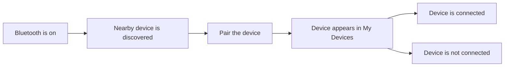

# 连接其他设备：VPN、蓝牙、配对与设备状态

VPN 和蓝牙都出现在系统设置的连接区域，但它们解决的是两件不同的事：VPN 为网络流量建立一条受配置控制的虚拟路径；蓝牙让 Mac 与附近配件建立短距离无线连接。两者都涉及 `Connected`、`Not Connected`、`Add`、`Details` 等词，却不能互相替代。先看对象和作用范围，才能理解页面语言。

> [!warning] 配置与配对都可能影响正在使用的服务
>
> 添加 VPN 配置可能需要组织账户、证书或管理员说明；删除蓝牙设备会让它需要重新配对。学习本篇时只读页面，不新建 VPN、不输入认证信息、不移除设备。设备名称、VPN 提供者和账户信息属于动态数据，不写入讲义文本。

## 两种连接，两个问题

| 功能 | 它连接什么 | 典型目的 | 不应该理解成 |
| --- | --- | --- | --- |
| VPN | Mac 与一个虚拟专用网络服务 | 访问组织资源、按策略路由网络流量、建立受保护的网络路径 | 打开 Wi-Fi 或连接任意蓝牙设备 |
| Bluetooth | Mac 与附近的硬件配件 | 键盘、鼠标、耳机、手柄等设备交互 | 连接互联网或替代 VPN |
| Wi-Fi | Mac 与无线网络 | 建立局域网或互联网连接 | 自动提供组织 VPN 权限 |
| Network filters | 流量如何经过系统组件 | 过滤、代理、策略处理 | 设备配对或 VPN 配置本身 |

同一个词 `Connected` 会在不同页面出现，但宾语不同：`connected to a VPN` 表示网络路径已建立；`a Bluetooth device is connected` 表示硬件配件与 Mac 已建立连接。学习时不能只背“connected = 已连接”，必须同时说清“谁连接了谁”。

## VPN：先认识“配置”与“连接状态”的区别

VPN 页面若显示 `No VPN Configurations`，它说明当前系统没有可用的 VPN 配置记录。它不表示 Wi-Fi 已断开，也不表示这台 Mac 不能使用互联网。`configuration` 指一组可供系统使用的连接规则，通常包含提供者、服务器、认证和路由等信息。

<a id="interface-vpn-empty-state"></a>

> 本机截图未包含在公开版本中，以保护原图中的个人信息。

| 界面表达 | 软件语境中文 | 正确理解 |
| --- | --- | --- |
| `VPN` | 虚拟专用网络。 | 一个网络连接类型或配置类别。 |
| `No VPN Configurations` | 没有 VPN 配置。 | 当前没有可供连接的 VPN 规则，不代表网络出错。 |
| `About VPNs & Privacy…` | 关于 VPN 与隐私。 | 打开解释资料，不会添加或连接 VPN。 |
| `Add` / 加号 | 添加。 | 创建或导入新的配置，通常需要可信的组织资料。 |
| `Help` | 帮助。 | 查阅说明，不等于系统自动完成认证。 |

`No VPN Configurations` 的语法是“没有 + 复数名词”。它和 `Not connected` 不同：前者是没有**配置记录**，后者是某个已有服务当前没有**建立连接**。可以用下面两句区分：

> `There are no VPN configurations on this Mac.`
>
> `The VPN configuration exists, but it is not connected.`

第一句说记录不存在；第二句说记录存在但状态未建立。向 IT 支持报告时，这个差别决定对方是给你一份配置资料，还是排查现有连接。

## 蓝牙：开启、可发现、已配对与已连接是四个状态

蓝牙页容易让人把“开着”“能被发现”“在我的设备里”“当前连接”混为同一个状态。它们实际描述的是不同阶段。

<a id="interface-bluetooth-device-states"></a>

> 本机截图未包含在公开版本中，以保护原图中的个人信息。

图片里有本机和附近设备的动态名称；它们只说明布局，不进入正文、搜索或练习。下面是稳定表达及其关系。

| 界面表达 | 软件语境中文 | 说明 |
| --- | --- | --- |
| `Connect to accessories…` | 连接配件。 | 描述蓝牙的用途；`accessories` 可以是键盘、音频设备、鼠标等。 |
| `This Mac is discoverable…` | 这台 Mac 可被发现。 | 别的设备在特定条件下能够发现这台 Mac，不等于已配对。 |
| `while Bluetooth Settings is open` | 当蓝牙设置打开时。 | `while` 限定可发现状态的时间条件。 |
| `My Devices` | 我的设备。 | 已记录或曾配对的设备集合，不保证当前连接。 |
| `Nearby Devices` | 附近设备。 | 当前被发现的设备，不保证可信或可以使用。 |
| `Not Connected` | 未连接。 | 当前没有建立设备连接；不是设备已被删除。 |
| `Show Detail` | 显示详情。 | 打开该设备的进一步信息或操作入口。 |

蓝牙状态可以用一个小流程表示：



图中每一步都有可能停住。蓝牙开启后，附近设备未必可发现；设备出现在 My Devices 后，也可能显示 Not Connected；配对完成不保证某个功能马上可用。排障时应说出停在哪一步，而不是笼统说“蓝牙不行”。

## `discoverable` 和 `pair`：不要把可见当作可用

`discoverable` 表示可被其他设备发现。它只谈“看得见”，不谈是否建立信任关系或连接。`pair` 则表示让两台设备建立配对关系，通常可能需要确认码、按键或其他认证动作。

| 状态或动作 | 它证明了什么 | 还不能证明什么 |
| --- | --- | --- |
| Bluetooth is on | Mac 的蓝牙功能开启 | 目标设备已经出现 |
| Discoverable | 其他设备有机会发现这台 Mac | 对方已配对或已连接 |
| Nearby device | Mac 当前检测到附近设备 | 设备可信、可用或有权限连接 |
| Pair | 正在建立配对关系 | 已完成后一定自动连接 |
| My Devices | 本机保留了设备记录 | 当前设备在线或已连接 |
| Connected | 当前连接已建立 | 音频、输入或电量等所有功能正常 |

你可以用准确英语解释这条差异：

> `The Mac is discoverable while Bluetooth Settings is open, but being discoverable does not mean that another device is paired or connected.`

这句话中的 `does not mean that` 是软件说明里非常常用的逻辑表达，适合用来纠正“看到状态就过度推断”的错误。

## 设备名和网络名为什么不能进入词汇表

Bluetooth 页面中的设备名、VPN 页面中的提供者名称、网络页面中的 SSID 都是本机数据。它们可能含有个人姓名、型号、组织信息、习惯或设备识别线索。学习软件英语时，要把可复用的系统语言和动态数据拆开。

| 可以学习 | 不应写入正文或词汇表 |
| --- | --- |
| `My Devices`, `Nearby Devices`, `Not Connected` | 具体设备名、耳机名、手机名、序列号 |
| `No VPN Configurations`, `Add`, `Connect` | VPN 提供者、服务器、账户、证书名称 |
| `Show Detail`, `Forget This Device` | 配对码、认证请求内容、联系人信息 |

因此，描述一个动态对象时，用 `the selected device`、`the current VPN configuration`、`a nearby accessory` 代替具体名字。这样既能练到正确英语，也不会把私人界面数据变成永久学习材料。

## 两个完整操作案例

### 案例一：只读检查蓝牙设备所处阶段

1. 打开 **System Settings → Bluetooth**。
2. 查看蓝牙开关是否为 On。
3. 阅读 `My Devices` 和 `Nearby Devices`，区分已记录设备与当前附近设备。
4. 对一个已记录设备只读状态，例如 `Connected` 或 `Not Connected`，不要点击 Show Detail、移除或重新配对。
5. 用英语汇报：`Bluetooth is on. I reviewed the saved and nearby devices, but I did not pair, remove, or reconnect any accessory.`

这里的 `saved and nearby devices` 是对两类列表的概括；`did not pair, remove, or reconnect` 列明了没有执行的高影响动作。

### 案例二：判断 VPN 页面下一步需要什么

1. 打开 **System Settings → VPN**。
2. 如果看到 `No VPN Configurations`，判断当前缺少的是配置记录，而不是无线连接。
3. 点击 **About VPNs & Privacy…** 只阅读解释资料；不要点击加号创建配置。
4. 若需要公司或学校 VPN，向管理员提出：`Could you provide the approved VPN configuration and sign-in instructions for this Mac?`
5. 收到可靠资料前，不输入服务器、账户、密码或证书信息。

这项练习训练“缺少什么”和“应该向谁请求”的表达。没有配置时，最安全的下一步是获取批准的配置来源，不是找一组随机参数尝试。

## 连接问题的报告顺序

无论是 VPN 还是蓝牙，报告问题时可以沿着同一个顺序：功能是否开启、对象是否存在、状态是否已连接、是否执行过动作、下一步要验证什么。

```text
Bluetooth is on, but the accessory is not connected.
The device appears under My Devices, so it has been paired before.
I did not remove the device or start a new pairing process.
I need to check whether the accessory is charged and available.
```

VPN 可以这样说：

```text
There is no VPN configuration on this Mac.
Wi-Fi is connected, but I have not set up the organization VPN.
I need the approved configuration and sign-in instructions before adding anything.
```

这两段都把观察、已有事实、未执行动作和下一步需求分开。它们比“蓝牙连不上”或“VPN 不行”更容易获得正确帮助。

## 蓝牙未连接时，先检查哪一种条件

`Not Connected` 只说明当前连接不存在，它不说明失败原因。设备可能不在附近、没有电、蓝牙已关闭、正在连接别的设备、需要重新进入配对模式，或者本机保存的配对记录已经不再适用。学习软件英语时，应训练把现象和假设分开。

| 观察到的内容 | 可以确认的事实 | 仍然只是待验证的假设 |
| --- | --- | --- |
| `Bluetooth is on` | Mac 的蓝牙功能已开启 | 配件有电、在附近、可被连接 |
| 设备在 `My Devices` | Mac 曾保存过该设备关系 | 配对仍然有效、设备当前可用 |
| `Not Connected` | 当前没有建立连接 | 配件故障、Mac 故障或需要删除记录 |
| 设备在 `Nearby Devices` | Mac 发现了附近设备 | 它是可信设备、你有权配对 |
| 页面一直在搜索 | 系统正在扫描附近设备 | 目标设备一定会出现 |

一段谨慎的英文报告可以是：

> `Bluetooth is on and the accessory is listed under My Devices, but it is not connected. I have not removed the pairing. I need to check whether the accessory is powered on and available for connection.`

这段话只陈述页面证据，并把“有电、可连接”留作下一步验证，不把猜测说成事实。

## VPN 与隐私：连接路径不是绝对匿名承诺

VPN 页面旁边常出现 `About VPNs & Privacy…`。这提示 VPN 与隐私有关，但不能自动推出“使用 VPN 后所有活动都匿名”或“所有 App 都走同一条路径”。一个 VPN 配置的实际行为取决于组织策略、连接状态、DNS、代理、应用自己的网络实现和当前网络环境。

| 你想表达的内容 | 更准确的英语 | 避免的过度结论 |
| --- | --- | --- |
| 当前没有 VPN 配置 | `There is no VPN configuration on this Mac.` | “这台 Mac 完全没有隐私保护。” |
| VPN 已建立 | `The VPN connection is active.` | “所有 traffic 都是匿名的。” |
| 需要了解作用范围 | `I need to understand which network traffic the VPN is intended to handle.` | “VPN 会处理所有东西。” |
| 想确认隐私说明 | `I am reviewing the VPN and privacy information before adding a configuration.` | “我已经可以安全连接。” |

如果页面、组织资料或管理员没有明确说明，不要在学习笔记里承诺安全效果。使用 `intended to`、`may route`、`need to confirm` 等表达，既符合界面事实，也能避免把复杂配置说成简单开关。

## 一个完整的连接恢复记录

当确实需要在授权范围内改动 VPN 或蓝牙配置时，恢复记录应包含四个部分：原状态、做过的动作、页面反馈、恢复验证。可以使用下面的英文框架：

```text
Before the test, the device / VPN was [original state].
I changed only [one setting] to test [one expected effect].
The page showed [visible result].
I restored [original setting] and verified [final state].
```

这个框架强迫你一次只改一个变量，也给后续恢复留下清晰证据。若不能填出第一句或第四句，就说明还不具备安全修改的条件，应停留在只读学习阶段。

## 常见错误与恢复方式

| 错误 | 为什么不可靠 | 更安全的做法 |
| --- | --- | --- |
| 看到 My Devices 就认定设备已连接 | 列表可能只是保存了配对记录 | 继续查看 Connected / Not Connected 状态 |
| 为了测试而删除设备 | 删除后可能需要重新配对或认证 | 先只读详情和状态 |
| 把 No VPN Configurations 当作 Wi-Fi 故障 | 一个说配置记录，一个说无线网络 | 分别检查 VPN 页面和 Wi-Fi 状态 |
| 自行新建 VPN 并填写未知资料 | 认证和路由配置可能来自组织策略 | 请求管理员提供批准的配置 |
| 把 discoverable 当成 paired | 可发现只代表能被看到 | 确认是否完成配对和当前连接 |

## 自测

1. `No VPN Configurations` 与 `Not connected` 的差异是什么？
2. `My Devices` 为什么不能证明设备当前已连接？
3. `discoverable` 在蓝牙页面里描述哪个阶段？
4. 用英语说出“蓝牙已经开启，但该配件当前未连接”。

<details>
<summary>查看参考答案</summary>

1. 前者表示没有 VPN 配置记录；后者表示某个已有对象当前没有建立连接。
2. 它只表示本机保留或认识该设备；连接状态还要看 Connected / Not Connected。
3. 描述其他设备能够发现这台 Mac 的阶段，不等于配对或连接。
4. `Bluetooth is on, but the accessory is not currently connected.`

</details>

## 版本与来源

- 本机界面事实：macOS 27.0 Beta (26A5425a)，采集日期 2026-09-09。
- 功能原理参考：[Set up a VPN connection on Mac](https://support.apple.com/guide/mac-help/set-up-a-vpn-connection-mchlp2963/mac) 与 [Connect a Bluetooth device with your Mac](https://support.apple.com/guide/mac-help/connect-a-bluetooth-device-mchlp1331/mac)。
- 本篇只保留稳定的连接语言和状态判断，设备名称、VPN 提供者、账户与认证信息均不写入教程正文。
