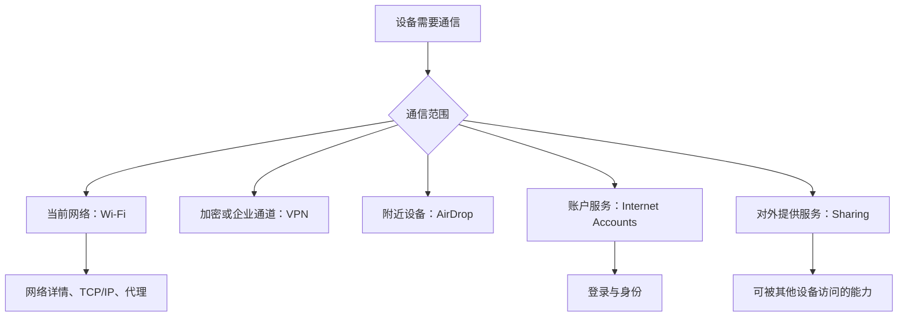

# 把连接说清楚：Wi-Fi、VPN、隔空投送、账户与共享边界

系统设置里“连接”不是单一概念。Wi-Fi 解决当前网络接入，VPN 处理经由加密通道的连接，AirDrop 处理附近设备间的发现与传输，互联网账户提供服务账户，Sharing 则决定本机可向其他设备提供什么服务。它们都可能出现 `network`、`account`、`share`、`privacy` 等词，但每个词的对象不同。学习这组页面的目标是先把连接关系说准确，再决定是否有必要修改。

> [!warning] 仅阅读，不建立新的连接
> 本篇不要求连接陌生 Wi-Fi、添加 VPN、登录账户、启用共享、改变路由或配对设备。网络和身份类设置可能影响现有访问路径与数据暴露面；真实改动必须先明确目标、影响范围和恢复方式。

## 学习目标

你将能区分 `Wi-Fi Details`、`TCP/IP`、`Proxies`、`VPN`、`AirDrop`、`Internet Accounts`、`Users & Groups`、`Sharing`、`Sign in with Apple` 和 `Game Center` 的对象；能读懂 `Join Other Network`、`Configure IPv4`、`Bypass proxy settings` 与 `Allow` 的语境；也能说清“我查看了连接配置，但没有创建、删除或共享任何资源”。

## 连接、身份和共享的关系

任何一个页面中出现 `Details`，都表示进入细节，而不是确认连接已经稳定。`Configure` 描述配置动作，`Join` 描述加入网络，`Share` 描述向外提供，`Sign In` 描述账户认证。用动词给对象分类后，可以避免将 VPN 误当 Wi-Fi 的附属项，或把 AirDrop 当作互联网账户。

## 真实界面：Wi-Fi、TCP/IP、代理与 VPN

> 本机截图未包含在公开版本中，以保护原图中的个人信息。

> 本机截图未包含在公开版本中，以保护原图中的个人信息。

> 本机截图未包含在公开版本中，以保护原图中的个人信息。

> 本机截图未包含在公开版本中，以保护原图中的个人信息。

> 本机截图未包含在公开版本中，以保护原图中的个人信息。

> 本机截图未包含在公开版本中，以保护原图中的个人信息。

> 本机截图未包含在公开版本中，以保护原图中的个人信息。

> 本机截图未包含在公开版本中，以保护原图中的个人信息。

> 本机截图未包含在公开版本中，以保护原图中的个人信息。

> 本机截图未包含在公开版本中，以保护原图中的个人信息。

> 本机截图未包含在公开版本中，以保护原图中的个人信息。

> 本机截图未包含在公开版本中，以保护原图中的个人信息。

> 本机截图未包含在公开版本中，以保护原图中的个人信息。

> 本机截图未包含在公开版本中，以保护原图中的个人信息。

> 本机截图未包含在公开版本中，以保护原图中的个人信息。

> 本机截图未包含在公开版本中，以保护原图中的个人信息。

> 本机截图未包含在公开版本中，以保护原图中的个人信息。

## 真实界面：附近设备、账户、身份与共享服务

> 本机截图未包含在公开版本中，以保护原图中的个人信息。

> 本机截图未包含在公开版本中，以保护原图中的个人信息。

> 本机截图未包含在公开版本中，以保护原图中的个人信息。

> 本机截图未包含在公开版本中，以保护原图中的个人信息。

> 本机截图未包含在公开版本中，以保护原图中的个人信息。

> 本机截图未包含在公开版本中，以保护原图中的个人信息。

> 本机截图未包含在公开版本中，以保护原图中的个人信息。

> 本机截图未包含在公开版本中，以保护原图中的个人信息。

> 本机截图未包含在公开版本中，以保护原图中的个人信息。

> 本机截图未包含在公开版本中，以保护原图中的个人信息。

> 本机截图未包含在公开版本中，以保护原图中的个人信息。

> 本机截图未包含在公开版本中，以保护原图中的个人信息。

> 本机截图未包含在公开版本中，以保护原图中的个人信息。

> 本机截图未包含在公开版本中，以保护原图中的个人信息。

> 本机截图未包含在公开版本中，以保护原图中的个人信息。

> 本机截图未包含在公开版本中，以保护原图中的个人信息。

### 完整界面表达

| 原文 | 软件语境中文 | 实际对象 | 不应混淆为 |
| --- | --- | --- | --- |
| `Join Other Network` | 加入其他网络 | 一个 Wi-Fi 接入动作 | 新增账户认证。 |
| `TCP/IP` | TCP/IP | 网络地址和协议配置 | VPN 服务。 |
| `Proxies` | 代理 | 某些请求经由代理服务器的规则 | 所有网络访问。 |
| `Bypass proxy settings` | 绕过代理设置 | 特定目标不走代理的例外 | 关闭网络连接。 |
| `VPN` | 虚拟专用网络 | 加密或受管网络通道 | Wi-Fi 名称。 |
| `AirDrop` | 隔空投送 | 附近设备间发现和传输 | 云端账户同步。 |
| `Internet Accounts` | 互联网账户 | 服务账户与其提供的功能 | 本地用户账户。 |
| `Sharing` | 共享 | 本机向其他设备提供的服务 | 单向文件下载。 |

## 两个完整观察案例

### 案例一：读代理规则而不改代理

1. 打开 **Wi-Fi → Details → Proxies**，阅读代理项目、说明和底部连续内容。
2. 找到 `Bypass proxy settings`，确认它描述的是某些目标的例外路径。
3. 不填入服务器地址，不新增例外，也不切换自动配置脚本。
4. 用英语说明：`I reviewed the proxy exceptions without changing the proxy configuration.`
5. 如有网络故障，先记录原有配置并确定由谁管理，再决定是否需要修改；不要把“绕过”理解为可以随意关闭安全措施。

### 案例二：把共享和账户认证分开报告

1. 阅读 `Internet Accounts` 的服务说明，再阅读 `Sharing` 的远程服务说明。
2. 前者强调你向服务提供方认证后可使用的账户能力；后者强调其他设备可否访问本机的一项服务。
3. 不登录新账户，也不开启远程脚本、屏幕共享或文件共享。
4. 用英语说：`An Internet Account connects this Mac to a service. Sharing controls a service offered by this Mac.`
5. 需要恢复时，回到创建变化的那一侧：账户回到账户页，共享回到共享页，不能靠切换 Wi-Fi 解决身份或服务暴露问题。

> [!tip] 从介词读方向
> `connect to a network` 表示连向网络，`share with another device` 表示与另一台设备共享，`from another device` 表示来源。英语里的 `to`、`with`、`from` 常常已经告诉你数据或操作的方向。

## 英语表达规律与搭配

网络页多用 `configure`、`connect`、`join`、`bypass` 和 `share`。`configure` 强调设置参数，`connect` 强调建立连通关系，`join` 常用于加入可用网络，`bypass` 表示跳过某条规则，`share` 表示向外提供。完整报告可以是：`The Mac is connected to Wi-Fi, but I did not configure a VPN or enable a sharing service.`

| 单词 | 音标 | 词性 | 本篇语境义 | 所在完整表达 |
| --- | --- | --- | --- | --- |
| network | /ˈnetwɜːrk/ | n. | 网络 | `Join Other Network` |
| proxy | /ˈprɑːksi/ | n. | 代理服务器或代理规则 | `Proxies` |
| bypass | /ˈbaɪpæs/ | v. | 绕过 | `Bypass proxy settings` |
| private | /ˈpraɪvət/ | adj. | 专用的、私有的 | `Virtual Private Network` |
| account | /əˈkaʊnt/ | n. | 服务账户 | `Internet Accounts` |
| share | /ʃer/ | v. | 共享、提供 | `Sharing` |
| nearby | /ˌnɪrˈbaɪ/ | adj./adv. | 附近的 | AirDrop 的设备范围说明 |

## 连接出问题时先报告可观察事实

网络页面很容易诱发猜测。更稳妥的报告顺序是：先说当前页面、再说看见的配置类别、最后说尚未执行的动作。例如：`I am on the Wi-Fi details page. I can see TCP/IP and proxy settings. I have not changed the connection.` 这三句分别给出位置、可见对象和变更边界。它们不会把“看到网络选项”误说成“网络已经恢复”，也不会把“存在 VPN 页面”误说成“VPN 已连接”。

当你需要别人协助时，可继续补充一个明确问题：`Should this connection use a proxy, a VPN, or neither?` 在采取行动前问清目标，比在多个页面同时切换开关更安全。若网络由组织、学校或家庭中的其他人管理，保存当前值并向管理者确认具体规则，通常比从页面名称猜测配置含义更可靠。

## 自测

1. `Wi-Fi Details`、`TCP/IP` 和 `VPN` 为什么不是同一层？
2. `Bypass proxy settings` 在路由规则中意味着什么？
3. `Internet Accounts` 与 `Sharing` 分别朝哪个方向建立关系？
4. 用英语说“我查看了 Wi-Fi 的代理设置，但没有连接新的网络或启用 VPN”。

查看参考答案

1. 它们分别处理当前接入的细节、协议配置和独立的加密或受管通道。
2. 指特定目标不使用该代理规则，不等于关闭连接。
3. 账户连向外部服务，共享让其他设备可使用本机提供的服务。
4. `I reviewed the Wi-Fi proxy settings without joining a new network or enabling a VPN.`

## 版本与来源

本文依据本机 macOS 27.0 Beta (26A5425a) 于 2026-09-09 的采集。网络名称、账户提供方和服务可用性会随环境变化，正文不转录动态数据。功能参考 Apple 的 [Change Wi-Fi settings on Mac](https://support.apple.com/guide/mac-help/change-wifi-settings-mchle2c429fc/mac)、[Set up a VPN connection on Mac](https://support.apple.com/guide/mac-help/set-up-a-vpn-connection-mac-mchlp2963/mac) 与 [Change Sharing settings on Mac](https://support.apple.com/guide/mac-help/change-sharing-settings-mac-mh17131/mac)。
